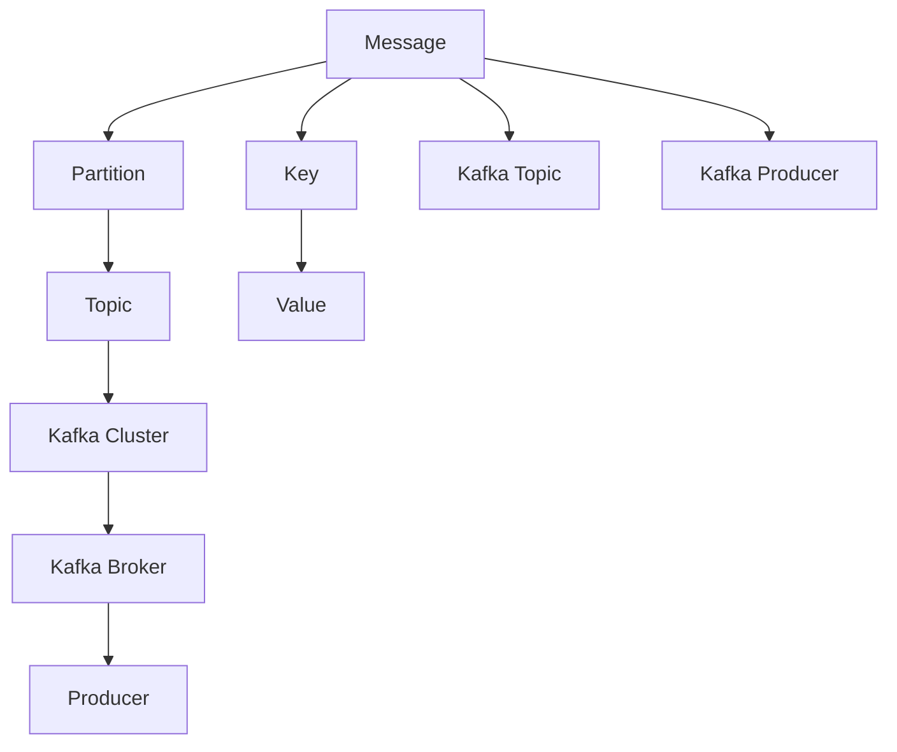

                 

# Kafka Producer原理与代码实例讲解

> 关键词：Kafka, Producer, API, 数据流处理, 实时数据流

## 1. 背景介绍

### 1.1 问题由来
随着大数据时代的到来，企业对数据的实时性要求日益增加，传统的批处理模式已无法满足需求。Kafka作为一种高效、分布式的数据流平台，其 Producer 组件允许应用程序将数据实时推送到 Kafka 集群中，是构建实时数据流处理系统的核心组件之一。Kafka Producer 负责将消息从应用程序推送到 Kafka 集群，从而保证了数据流的高效和可靠性。

### 1.2 问题核心关键点
Kafka Producer 的核心在于理解其工作原理和关键技术细节，如消息生产、故障处理、数据分区、批量处理等。通过深入学习 Kafka Producer 的工作原理，开发者可以更加高效地构建和维护实时数据流系统。

## 2. 核心概念与联系

### 2.1 核心概念概述

为更好地理解 Kafka Producer 的工作机制，本节将介绍几个关键概念：

- Kafka Producer：Kafka 数据流平台中的消息生产者组件，用于将消息从应用程序推送到 Kafka 集群。
- Kafka Cluster：Kafka 数据流平台的核心组件之一，由多个 Kafka Broker 组成，负责存储和管理消息。
- Message：Kafka 集群中的基本数据单元，包括 Key、Value、Partition、Topic 等属性。
- Topic：Kafka 集群中的主题，用于存储同一类型的数据。
- Partition：Kafka Topic 的分区，用于分布式存储和管理消息。

这些概念之间的逻辑关系可以通过以下 Mermaid 流程图来展示：



这个流程图展示了这个核心概念之间的联系：

1. 消息被拆分为多个分区，存储在 Kafka Topic 中。
2. 分区是 Topic 中的子主题，用于分布式存储和管理消息。
3. Kafka Topic 是存储同一类型数据的容器。
4. Kafka Broker 是 Kafka 集群的核心组件，负责存储和管理 Topic。
5. Kafka Producer 负责将消息从应用程序推送到 Kafka Broker。

这些概念共同构成了 Kafka 数据流系统的基本架构，理解它们有助于我们深入掌握 Kafka Producer 的工作机制。

## 3. 核心算法原理 & 具体操作步骤
### 3.1 算法原理概述

Kafka Producer 的核心算法原理包括以下几个关键部分：

- 消息批量处理：Kafka Producer 将消息批量处理，提高传输效率。
- 数据分区：Kafka Topic 被划分为多个分区，用于分布式存储和管理消息。
- 重试机制：在发送消息时，Kafka Producer 会实现重试机制，保证消息的可靠性。
- 可靠性保证：Kafka Producer 支持多种可靠性保证机制，如异步发送、同步发送等。

### 3.2 算法步骤详解

Kafka Producer 的基本工作流程包括以下几个关键步骤：

**Step 1: 初始化 Kafka Producer**
- 创建 KafkaProducer 对象，并配置相关参数。

**Step 2: 发送消息**
- 将消息转化为字节数组。
- 将字节数组发送给 Kafka Broker。

**Step 3: 处理错误**
- 处理 Kafka 集群服务不可用的情况。
- 处理网络连接中断、消息发送失败等情况。

**Step 4: 关闭 Kafka Producer**
- 关闭 KafkaProducer 对象，释放资源。

### 3.3 算法优缺点

Kafka Producer 的优点包括：

1. 高效的消息批量处理：Kafka Producer 将消息批量处理，提高了数据传输效率。
2. 可靠的数据分区：Kafka Topic 被划分为多个分区，分布式存储和管理消息，提高了数据处理能力。
3. 多种可靠性保证机制：Kafka Producer 支持异步发送和同步发送等可靠性保证机制，确保数据传输的可靠性。

缺点包括：

1. 配置复杂：Kafka Producer 需要配置多个参数，如 Batch Size、Linger Time、Retries、Max Retries 等，配置不当可能导致消息发送失败。
2. 易受网络影响：Kafka Producer 对网络连接要求较高，网络中断或连接不稳定可能导致消息丢失或延迟。
3. 资源消耗大：Kafka Producer 的资源消耗较大，特别是在高并发环境下，需注意资源分配和优化。

### 3.4 算法应用领域

Kafka Producer 广泛应用于各种实时数据流处理系统，例如：

- 日志系统：如 Apache Log4j、Fluentd 等，将日志数据实时推送到 Kafka 集群。
- 金融交易：如高频交易、量化交易等，将交易数据实时推送到 Kafka 集群。
- 实时数据处理：如实时数据清洗、实时数据统计等，将数据实时推送到 Kafka 集群。
- 物联网：如设备监控、传感器数据采集等，将设备数据实时推送到 Kafka 集群。

## 4. 数学模型和公式 & 详细讲解 & 举例说明

### 4.1 数学模型构建

本节将使用数学语言对 Kafka Producer 的批量处理机制进行更加严格的刻画。

记消息的发送时间为 $t$，消息大小为 $s$，发送到 Kafka 集群的时延为 $d$，批量大小为 $B$，批量处理间隔为 $L$。则 Kafka Producer 的批量处理机制可以表示为：

$$
\text{发送消息量} = \left\lfloor\frac{t}{L}\right\rfloor \times B
$$

其中 $\lfloor x \rfloor$ 表示向下取整。

### 4.2 公式推导过程

我们考虑一个简单的场景，即 Kafka Producer 将消息均匀发送。假设消息的发送间隔为 $t$，每个消息大小为 $s$，发送到 Kafka 集群的时延为 $d$。则一个消息的处理时间 $T$ 可以表示为：

$$
T = s + d
$$

如果 Kafka Producer 使用批量处理机制，则 $t$ 可以表示为：

$$
t = n \times B + L
$$

其中 $n$ 表示批量处理次数，$L$ 表示批量处理间隔。

将 $t$ 代入公式 $T$，得：

$$
T = \frac{n \times B + L}{n} \times s + d = B \times s + L \times \frac{s}{n} + d
$$

为了最大化数据传输效率，需要最大化 $T$，即最小化 $L \times \frac{s}{n}$。因此，批量处理机制需要找到合适的 $B$ 和 $L$，以满足实时数据流的处理需求。

### 4.3 案例分析与讲解

假设 Kafka Producer 的批量大小为 $B=1$，批量处理间隔为 $L=1$，消息的发送间隔为 $t=1$，消息大小为 $s=1$，发送到 Kafka 集群的时延为 $d=0.1$。则一个消息的处理时间为：

$$
T = 1 \times 1 + 1 \times 0.1 = 1.1
$$

这种情况下，Kafka Producer 将实时处理数据。

如果将批量大小调整为 $B=2$，批量处理间隔调整为 $L=2$，则一个消息的处理时间为：

$$
T = 2 \times 1 + 2 \times 0.1 = 2.2
$$

这种情况下，Kafka Producer 的传输效率有所提升，但需要考虑网络延迟和系统开销等因素。

## 5. 项目实践：代码实例和详细解释说明
### 5.1 开发环境搭建

在进行 Kafka Producer 实践前，我们需要准备好开发环境。以下是使用 Java 进行 Kafka 开发的开发环境配置流程：

1. 安装 Java Development Kit：从官网下载并安装 Java JDK，用于编译和运行 Java 程序。
2. 安装 Kafka：从官网下载并安装 Apache Kafka，安装配置相关的环境变量。
3. 创建 Kafka Topic：使用 Kafka 命令行工具创建 Topic，以便进行测试。

### 5.2 源代码详细实现

下面我们以 Kafka Producer 的基本操作为例，给出使用 Java Kafka API 进行 Kafka Producer 开发的代码实现。

首先，配置 Kafka Producer 的基本参数：

```java
Properties props = new Properties();
props.put("bootstrap.servers", "localhost:9092");
props.put("acks", "all");
props.put("retries", 5);
props.put("batch.size", 16384);
props.put("linger.ms", 1);
props.put("buffer.memory", 33554432);
props.put("key.serializer", "org.apache.kafka.common.serialization.StringSerializer");
props.put("value.serializer", "org.apache.kafka.common.serialization.StringSerializer");
```

然后，创建 KafkaProducer 对象并发送消息：

```java
KafkaProducer<String, String> producer = new KafkaProducer<>(props);

producer.send(new ProducerRecord<String, String>("my-topic", "key", "value"));

producer.flush();
producer.close();
```

接下来，对发送的消息进行异常处理：

```java
try {
    producer.send(new ProducerRecord<String, String>("my-topic", "key", "value"));
    producer.flush();
} catch (KafkaException e) {
    e.printStackTrace();
}

producer.close();
```

### 5.3 代码解读与分析

让我们再详细解读一下关键代码的实现细节：

**Properties 配置**
- `bootstrap.servers`：指定 Kafka Broker 的地址。
- `acks`：指定消息确认机制，可选值为 `all`、`0`、`1`。
- `retries`：指定重试次数。
- `batch.size`：指定批量大小。
- `linger.ms`：指定批量处理间隔。
- `buffer.memory`：指定缓冲区大小。
- `key.serializer`：指定 Key 序列化器。
- `value.serializer`：指定 Value 序列化器。

**KafkaProducer 对象**
- `new KafkaProducer<>(props)`：创建 KafkaProducer 对象。
- `producer.send()`：发送消息到 Kafka Broker。
- `producer.flush()`：刷新发送缓冲区，确保消息已发送。
- `producer.close()`：关闭 KafkaProducer 对象，释放资源。

**异常处理**
- 在发送消息时，可能出现 Kafka 集群服务不可用、网络连接中断等异常情况。
- 通过捕获 KafkaException 异常，实现对异常情况的处理。

可以看到，Java Kafka API 提供了一套简单易用的接口，可以方便地进行 Kafka Producer 的开发。开发者可以根据具体需求，灵活配置 Kafka Producer 的各种参数，从而满足不同场景下的实时数据流处理需求。

## 6. 实际应用场景
### 6.1 智能物流系统

Kafka Producer 可以应用于智能物流系统的构建。在物流系统中，实时监控设备的运行状态，将传感器数据实时推送到 Kafka 集群，便于实时监控和数据分析。

在技术实现上，可以收集设备传感器数据，将传感器数据转化为 Kafka 消息，通过 Kafka Producer 将数据实时推送到 Kafka 集群。在 Kafka 集群中，可以使用 Kafka Streams 等组件对数据进行实时处理和分析，从而实现物流系统的实时监控和预警。

### 6.2 金融交易系统

Kafka Producer 在金融交易系统中也有广泛应用。在金融交易系统中，实时监控交易数据，将交易数据实时推送到 Kafka 集群，便于实时监控和分析。

在技术实现上，可以收集交易数据，将交易数据转化为 Kafka 消息，通过 Kafka Producer 将数据实时推送到 Kafka 集群。在 Kafka 集群中，可以使用 Apache Flink、Apache Spark 等组件对数据进行实时处理和分析，从而实现金融交易系统的实时监控和预警。

### 6.3 实时数据统计

Kafka Producer 还可以应用于实时数据统计。在实时数据统计系统中，实时监控数据来源，将数据实时推送到 Kafka 集群，便于实时统计和分析。

在技术实现上，可以收集各种数据源，将数据转化为 Kafka 消息，通过 Kafka Producer 将数据实时推送到 Kafka 集群。在 Kafka 集群中，可以使用 Apache Kafka Streams 等组件对数据进行实时处理和统计，从而实现实时数据统计系统的功能。

### 6.4 未来应用展望

随着大数据和实时数据流处理技术的不断发展，Kafka Producer 的应用场景将不断拓展。未来，Kafka Producer 将在更多领域得到应用，为实时数据流处理系统提供更加强大的支持。

在智慧城市治理中，Kafka Producer 可以应用于城市事件监测、舆情分析、应急指挥等环节，提高城市管理的自动化和智能化水平。

在智能制造中，Kafka Producer 可以应用于工业设备监控、生产数据分析等环节，提升工业生产效率和质量。

在智慧医疗中，Kafka Producer 可以应用于医疗设备监控、患者数据分析等环节，提升医疗服务质量和效率。

此外，在智能交通、智慧农业、智能能源等众多领域，Kafka Producer 也将得到广泛应用，为实时数据流处理系统提供新的动力。相信随着技术的不断发展，Kafka Producer 将在构建智慧社会中扮演越来越重要的角色。

## 7. 工具和资源推荐
### 7.1 学习资源推荐

为了帮助开发者系统掌握 Kafka Producer 的工作原理和开发技巧，这里推荐一些优质的学习资源：

1. Apache Kafka 官方文档：Kafka 官方文档提供了详尽的 API 文档和示例代码，是学习和开发 Kafka 的必备资料。
2. Kafka: The Definitive Guide 书籍：Kafka 权威指南，详细介绍了 Kafka 的核心概念和开发技巧。
3. Java Kafka API 官方文档：Java Kafka API 官方文档提供了详尽的 Java Kafka API 文档和示例代码。
4. Apache Kafka Streams 官方文档：Kafka Streams 官方文档提供了详尽的 Kafka Streams 开发文档和示例代码。
5. Kafka Streams in Action 书籍：深入讲解 Kafka Streams 的开发技巧和应用场景。

通过对这些资源的学习实践，相信你一定能够快速掌握 Kafka Producer 的工作原理和开发技巧，并用于解决实际的 Kafka 开发问题。
### 7.2 开发工具推荐

高效的开发离不开优秀的工具支持。以下是几款用于 Kafka Producer 开发的常用工具：

1. IntelliJ IDEA：支持 Kafka 开发的集成开发环境，提供了丰富的插件和示例代码，方便开发和调试。
2. Eclipse：支持 Kafka 开发的集成开发环境，提供了丰富的插件和示例代码，方便开发和调试。
3. Apache Kafka 命令行工具：Kafka 命令行工具提供了丰富的命令行操作，方便管理和监控 Kafka 集群。
4. Apache Kafka Streams 命令行工具：Kafka Streams 命令行工具提供了丰富的命令行操作，方便管理和监控 Kafka Streams 应用程序。
5. Apache Kafka Connect 命令行工具：Kafka Connect 命令行工具提供了丰富的命令行操作，方便管理和监控 Kafka Connect 应用程序。

合理利用这些工具，可以显著提升 Kafka Producer 的开发效率，加快创新迭代的步伐。

### 7.3 相关论文推荐

Kafka Producer 的开发涉及多个核心技术，包括消息处理、数据分区、批量处理等。以下是几篇奠基性的相关论文，推荐阅读：

1. "Apache Kafka: A Real-Time Distributed Storage System"（Apache Kafka: A Real-Time Distributed Storage System）：Kafka 论文，介绍了 Kafka 的基本架构和工作原理。
2. "Kafka Streams: A Stateful Streaming Data Abstraction"（Kafka Streams: A Stateful Streaming Data Abstraction）：Kafka Streams 论文，详细介绍了 Kafka Streams 的开发技巧和应用场景。
3. "Kafka Connect: Connecting Your Data Pipeline to Kafka"（Kafka Connect: Connecting Your Data Pipeline to Kafka）：Kafka Connect 论文，详细介绍了 Kafka Connect 的开发技巧和应用场景。
4. "Kafka: The Definitive Guide"（Kafka: The Definitive Guide）：Kafka 权威指南，详细介绍了 Kafka 的核心概念和开发技巧。
5. "Kafka Streams in Action"（Kafka Streams in Action）：深入讲解 Kafka Streams 的开发技巧和应用场景。

这些论文代表了大数据和实时数据流处理技术的最新进展，可以帮助研究者把握技术发展的脉搏，激发更多的创新灵感。

## 8. 总结：未来发展趋势与挑战
### 8.1 总结

本文对 Kafka Producer 的工作原理和开发技巧进行了全面系统的介绍。首先，阐述了 Kafka Producer 的背景和重要性，明确了 Kafka Producer 在实时数据流处理系统中的核心作用。其次，从原理到实践，详细讲解了 Kafka Producer 的批量处理机制、数据分区、重试机制、可靠性保证等核心算法，给出了 Kafka Producer 开发的完整代码实例。同时，本文还广泛探讨了 Kafka Producer 在智能物流、金融交易、实时数据统计等诸多领域的应用前景，展示了 Kafka Producer 的强大潜力。

通过本文的系统梳理，可以看到，Kafka Producer 作为 Kafka 数据流平台的基石，已经成为构建实时数据流处理系统的核心组件之一。随着大数据和实时数据流处理技术的不断发展，Kafka Producer 将在更多领域得到应用，为实时数据流处理系统提供更加强大的支持。未来，伴随预训练语言模型和微调方法的持续演进，相信 NLP 技术将在更广阔的应用领域大放异彩。

### 8.2 未来发展趋势

展望未来，Kafka Producer 的发展趋势包括以下几个方面：

1. 更高的处理能力：随着硬件性能的提升，Kafka Producer 的处理能力将进一步增强，能够处理更大规模的实时数据流。
2. 更多的可靠性保证：Kafka Producer 将支持更多的可靠性保证机制，如事务处理、数据一致性等，保证数据传输的可靠性。
3. 更好的可扩展性：Kafka Producer 将支持更多的分布式处理模式，如分片、集群、流式处理等，提高系统的可扩展性和稳定性。
4. 更强的兼容性：Kafka Producer 将支持更多的数据格式和协议，兼容不同的数据源和数据流处理系统。
5. 更灵活的配置：Kafka Producer 将提供更多的配置选项，方便开发者根据具体需求进行灵活配置。

这些趋势将进一步提升 Kafka Producer 的处理能力、可靠性和可扩展性，使其成为构建更高效、更稳定、更灵活的实时数据流处理系统的核心组件。

### 8.3 面临的挑战

尽管 Kafka Producer 已经取得了显著成果，但在迈向更加智能化、普适化应用的过程中，它仍面临诸多挑战：

1. 资源消耗大：Kafka Producer 的资源消耗较大，特别是在高并发环境下，需注意资源分配和优化。
2. 配置复杂：Kafka Producer 需要配置多个参数，如 Batch Size、Linger Time、Retries、Max Retries 等，配置不当可能导致消息发送失败。
3. 易受网络影响：Kafka Producer 对网络连接要求较高，网络中断或连接不稳定可能导致消息丢失或延迟。
4. 兼容性不足：Kafka Producer 需要兼容不同的数据源和数据流处理系统，这增加了开发难度和系统复杂度。
5. 可靠性保证不足：Kafka Producer 的可靠性保证机制有限，如异步发送、同步发送等，需要进一步改进。

### 8.4 研究展望

为了应对这些挑战，未来的研究需要在以下几个方面寻求新的突破：

1. 优化资源分配：优化 Kafka Producer 的资源分配策略，减少资源消耗，提高系统性能。
2. 简化配置管理：简化 Kafka Producer 的配置管理，减少配置复杂度，提高系统稳定性。
3. 提升网络可靠性：提升 Kafka Producer 的网络可靠性，减少网络连接中断和延迟，提高系统稳定性。
4. 增强兼容性：增强 Kafka Producer 的兼容性，支持更多的数据源和数据流处理系统，提高系统灵活性。
5. 强化可靠性保证：强化 Kafka Producer 的可靠性保证机制，支持更多的可靠性保证方式，提高系统可靠性。

这些研究方向的探索，将进一步提升 Kafka Producer 的处理能力、可靠性和可扩展性，使其成为构建更高效、更稳定、更灵活的实时数据流处理系统的核心组件。

## 9. 附录：常见问题与解答
### 9.1 Q1: Kafka Producer 的批量处理机制是什么？

A: Kafka Producer 的批量处理机制是通过将多个消息合并为一个 batch 进行发送，以减少网络传输次数，提高数据传输效率。批量处理机制通过 batch.size 和 linger.ms 两个参数进行配置，batch.size 表示批量大小， linger.ms 表示批量处理间隔。

### 9.2 Q2: Kafka Producer 的可靠性保证有哪些？

A: Kafka Producer 的可靠性保证包括：
1. 异步发送：在发送消息时，将消息缓存到内存中，异步发送给 Kafka Broker。
2. 同步发送：在发送消息时，阻塞当前线程，直到消息发送成功。
3. 批量发送：将多个消息合并为一个 batch 进行发送，减少网络传输次数，提高数据传输效率。
4. 事务处理：在发送消息时，使用事务机制，保证消息的可靠性。

### 9.3 Q3: Kafka Producer 的错误处理有哪些？

A: Kafka Producer 的错误处理包括：
1. 网络连接中断：在发送消息时，网络连接中断会导致消息发送失败，需要通过 retries 参数进行配置，控制重试次数。
2. Kafka 集群服务不可用：在发送消息时，Kafka 集群服务不可用会导致消息发送失败，需要通过 retries 参数进行配置，控制重试次数。
3. 消息发送失败：在发送消息时，消息发送失败会导致消息丢失，需要通过 retries 参数进行配置，控制重试次数。

### 9.4 Q4: Kafka Producer 的并发性能如何优化？

A: Kafka Producer 的并发性能可以通过以下几种方式进行优化：
1. 调整 batch.size 和 linger.ms 参数，提高批量处理能力。
2. 增加并发连接数，提高并发处理能力。
3. 使用分区机制，减少数据竞争，提高处理效率。
4. 使用网络优化技术，减少网络延迟，提高处理效率。

通过这些优化措施，可以显著提升 Kafka Producer 的并发性能，满足高并发数据流处理的需求。

### 9.5 Q5: Kafka Producer 的监控告警有哪些方式？

A: Kafka Producer 的监控告警可以通过以下几种方式实现：
1. 使用 Kafka 监控工具，如 Kafka Manager、Kafdrop，实时监控 Kafka Producer 的状态和性能。
2. 使用 Apache Ambari 监控工具，实时监控 Kafka Producer 的状态和性能。
3. 使用第三方监控工具，如 Grafana、Prometheus，实时监控 Kafka Producer 的状态和性能。
4. 使用自定义监控脚本，实时监控 Kafka Producer 的状态和性能。

通过这些监控告警方式，可以实时发现 Kafka Producer 的异常情况，及时进行处理，保证系统的稳定性和可靠性。

---

作者：禅与计算机程序设计艺术 / Zen and the Art of Computer Programming

