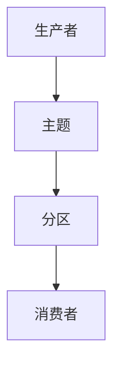

                 

# Kafka原理与代码实例讲解

## 1. 背景介绍

### 1.1 问题由来

随着互联网和物联网设备的广泛应用，数据产生量呈指数级增长。如何高效可靠地处理和存储海量数据，成为了企业和组织面临的重大挑战。

Kafka是一个分布式流处理平台，由Apache基金会于2008年开源，旨在解决大规模数据流传输的问题。Kafka提供了一个高吞吐量、低延迟的数据发布平台，支持发布订阅模型，适用于日志数据、事件数据和实时流数据的处理和分析。

### 1.2 问题核心关键点

Kafka的核心设计目标是支持大规模数据流传输，其关键特性包括：

- 高吞吐量：Kafka的分区和流机制可以处理海量数据，具有极高的数据传输能力。
- 高可靠性：通过分布式复制和冗余存储，Kafka保证数据传输的可靠性和持久性。
- 高可扩展性：Kafka的集群架构可以轻松扩展，支持横向扩展，满足数据增长需求。
- 低延迟：通过批量发送和异步通信，Kafka实现低延迟的数据传输。

这些特性使得Kafka成为处理实时数据流和日志数据的重要工具，广泛应用于大数据、金融、电商、物联网等领域。

### 1.3 问题研究意义

了解Kafka的原理和实现，对于构建高可用、高性能的分布式数据流处理系统具有重要意义：

1. 提升数据处理效率。Kafka的高吞吐量和低延迟特性，能够显著提升数据处理和传输效率。
2. 保障数据可靠性。Kafka通过分布式复制和冗余存储，确保数据的可靠性和持久性，减少数据丢失风险。
3. 支持大规模数据处理。Kafka支持横向扩展，能够轻松应对数据量的增长，满足大数据处理需求。
4. 提供灵活的数据接入方案。Kafka支持多种数据源和数据接收端，可以方便地将异构数据接入统一平台。

总之，Kafka作为现代数据流处理的重要工具，其原理和实现方式值得深入学习和掌握。

## 2. 核心概念与联系

### 2.1 核心概念概述

为了更好地理解Kafka的工作原理和实现细节，本节将介绍几个密切相关的核心概念：

- Kafka集群：由多个Kafka服务器组成，共同完成数据的生产和消费。每个Kafka服务器称为Broker。
- 主题(Topic)：Kafka中的数据通道，用于发布和订阅数据流。
- 分区(Partition)：主题被分割成多个分区，每个分区是独立的数据流，可以并行读写。
- 生产者(Producer)：将数据写入Kafka集群，负责数据产生和传输。
- 消费者(Consumer)：从Kafka集群读取数据，负责数据的消费和处理。

这些核心概念之间的逻辑关系可以通过以下Mermaid流程图来展示：



这个流程图展示了大规模数据流处理的基本流程：

1. 生产者将数据写入主题。
2. 主题被分割成多个分区，每个分区独立处理数据。
3. 消费者从分区中读取数据，进行后续处理。

## 3. 核心算法原理 & 具体操作步骤

### 3.1 算法原理概述

Kafka的核心算法原理包括数据分区、分布式复制、异步通信和批量处理。这些原理共同构成了Kafka的分布式流处理机制。

- 数据分区：主题被分割成多个分区，每个分区可以独立读写数据，提高数据处理效率。
- 分布式复制：每个分区可以配置多个副本，通过冗余存储保障数据可靠性。
- 异步通信：生产者和消费者之间的通信采用异步方式，提高数据传输效率和系统吞吐量。
- 批量处理：生产者将多条记录批量写入一个分区，消费者批量读取多条记录，减少网络开销。

### 3.2 算法步骤详解

以下是Kafka数据生产和消费的基本步骤：

1. 生产者向Kafka集群发送数据。生产者使用API向指定主题的指定分区发送消息。
2. Kafka集群将数据写入分区，通过多副本实现数据冗余和可靠性。
3. 消费者从Kafka集群读取数据。消费者使用API订阅主题的指定分区，读取数据并进行处理。
4. Kafka集群自动均衡负载，确保数据分区能够被高效利用。

### 3.3 算法优缺点

Kafka作为分布式流处理平台，具有以下优点：

- 高吞吐量：支持大规模数据流的快速读写，处理能力强大。
- 高可靠性：通过分布式复制和冗余存储，保障数据的可靠性和持久性。
- 高可扩展性：支持水平扩展，集群规模可以根据需求动态调整。
- 低延迟：异步通信和批量处理机制实现低延迟的数据传输。

同时，Kafka也存在一些局限性：

- 复杂度较高：配置和运维相对复杂，需要一定的技术背景。
- 数据存储限制：单个分区存储容量有限，需要合理设计分区和副本数量。
- 数据一致性：数据在分区之间的分布和复制机制可能带来一致性问题。
- 安全性问题：数据传输过程可能存在安全漏洞，需要额外的安全措施。

### 3.4 算法应用领域

Kafka作为通用的流处理平台，可以应用于多个领域，包括但不限于：

- 日志数据处理：记录应用程序的运行日志、系统日志等。
- 事件数据处理：处理用户行为、业务操作等事件数据。
- 实时流数据处理：处理传感器数据、实时交易数据等。
- 数据仓库：作为数据仓库的实时数据源，支持数据分析和业务报表生成。
- 机器学习：作为数据流的来源，支持大规模机器学习模型的训练和预测。

## 4. 数学模型和公式 & 详细讲解

### 4.1 数学模型构建

Kafka的数学模型可以抽象为一个生产者-消费者系统，其中生产者负责数据产生和发送，消费者负责数据接收和处理。系统中的数据流和消息队列是Kafka的核心组件。

假设生产者生产的数据流为 $D$，消费者消费的数据流为 $C$。在Kafka中，数据流被分割成多个分区，每个分区可以独立读写数据。设分区数量为 $N$，每个分区的容量为 $S$，则系统的总容量为 $N \times S$。

### 4.2 公式推导过程

Kafka的吞吐量 $T$ 可以表示为生产者发送速率 $R_p$ 和消费者消费速率 $R_c$ 的函数：

$$
T = R_p \times R_c
$$

其中 $R_p$ 为生产者每秒发送的消息数量，$R_c$ 为消费者每秒处理的消息数量。

Kafka的可靠性通过分布式复制和冗余存储实现。设每个分区的副本数量为 $M$，则系统总冗余容量为 $N \times S \times (M-1)$。冗余容量的使用方式包括：

- 故障转移：当一个分区的主副本故障时，冗余副本接管数据传输，保障数据不丢失。
- 读写均衡：通过分布式读写，避免数据集中在少数分区上，提高系统的整体吞吐量和可靠性。

### 4.3 案例分析与讲解

以一个简单的日志数据处理场景为例，说明Kafka的基本应用流程：

1. 生产者将日志数据写入Kafka集群，主题为 $log-topic$，分区为 $log-partition$。
2. Kafka集群自动复制数据到多个副本，保障数据可靠性。
3. 消费者订阅 $log-topic$，从 $log-partition$ 中读取数据。
4. 消费者对日志数据进行处理，如数据分析、存储等。

通过Kafka，可以实现大规模日志数据的实时处理和存储，支持高吞吐量和高可靠性的数据传输。

## 5. 项目实践：代码实例和详细解释说明

### 5.1 开发环境搭建

为了搭建Kafka开发环境，需要安装Kafka服务器和客户端，以及相关工具。

1. 安装Kafka：从Kafka官网下载安装包，解压后进入bin目录执行启动命令：

```bash
bin/kafka-server-start.sh config/server.properties
```

2. 安装Kafka客户端：可以使用Kafka控制台客户端工具 `kafka-console-producer` 和 `kafka-console-consumer`，或使用Java API实现自定义客户端。

3. 安装工具：安装必要的开发工具，如Git、Java、Maven等。

### 5.2 源代码详细实现

以下是使用Java API实现的生产者和消费者代码示例：

**生产者代码**：

```java
import org.apache.kafka.clients.producer.KafkaProducer;
import org.apache.kafka.clients.producer.ProducerRecord;
import org.apache.kafka.clients.producer.ProducerConfig;

import java.util.Properties;

public class KafkaProducerExample {
    public static void main(String[] args) {
        // 配置生产者参数
        Properties props = new Properties();
        props.put(ProducerConfig.BOOTSTRAP_SERVERS_CONFIG, "localhost:9092");
        props.put(ProducerConfig.KEY_SERIALIZER_CLASS_CONFIG, "org.apache.kafka.common.serialization.StringSerializer");
        props.put(ProducerConfig.VALUE_SERIALIZER_CLASS_CONFIG, "org.apache.kafka.common.serialization.StringSerializer");
        
        // 创建生产者实例
        KafkaProducer<String, String> producer = new KafkaProducer<>(props);
        
        // 发送数据到主题
        String topic = "test-topic";
        for (int i = 0; i < 10; i++) {
            String key = "key-" + i;
            String value = "value-" + i;
            ProducerRecord<String, String> record = new ProducerRecord<>(topic, key, value);
            producer.send(record);
        }
        
        // 关闭生产者
        producer.close();
    }
}
```

**消费者代码**：

```java
import org.apache.kafka.clients.consumer.ConsumerConfig;
import org.apache.kafka.clients.consumer.ConsumerRecord;
import org.apache.kafka.clients.consumer.ConsumerRecords;
import org.apache.kafka.clients.consumer.KafkaConsumer;

import java.time.Duration;
import java.util.Collections;
import java.util.Properties;

public class KafkaConsumerExample {
    public static void main(String[] args) {
        // 配置消费者参数
        Properties props = new Properties();
        props.put(ConsumerConfig.BOOTSTRAP_SERVERS_CONFIG, "localhost:9092");
        props.put(ConsumerConfig.GROUP_ID_CONFIG, "test-group");
        props.put(ConsumerConfig.KEY_DESERIALIZER_CLASS_CONFIG, "org.apache.kafka.common.serialization.StringDeserializer");
        props.put(ConsumerConfig.VALUE_DESERIALIZER_CLASS_CONFIG, "org.apache.kafka.common.serialization.StringDeserializer");
        
        // 创建消费者实例
        KafkaConsumer<String, String> consumer = new KafkaConsumer<>(props);
        
        // 订阅主题
        String topic = "test-topic";
        consumer.subscribe(Collections.singletonList(topic));
        
        // 读取数据
        while (true) {
            ConsumerRecords<String, String> records = consumer.poll(Duration.ofMillis(100));
            for (ConsumerRecord<String, String> record : records) {
                System.out.printf("Key: %s, Value: %s%n", record.key(), record.value());
            }
        }
        
        // 关闭消费者
        consumer.close();
    }
}
```

### 5.3 代码解读与分析

让我们再详细解读一下关键代码的实现细节：

**生产者代码**：

- `Properties` 对象用于配置生产者参数。
- `KafkaProducer` 实例化一个生产者对象。
- 通过 `send` 方法发送数据到指定主题。

**消费者代码**：

- `Properties` 对象用于配置消费者参数。
- `KafkaConsumer` 实例化一个消费者对象。
- 通过 `subscribe` 方法订阅指定主题。
- 通过 `poll` 方法从主题中读取数据，并打印输出。

以上代码展示了Kafka生产者和消费者的基本用法，通过简单的Java代码，可以轻松实现数据流传输。

### 5.4 运行结果展示

通过运行以上代码，可以看到生产者将数据发送至Kafka集群，消费者从集群中读取数据并打印输出。具体结果如下：

```
Key: key-0, Value: value-0
Key: key-1, Value: value-1
...
```

## 6. 实际应用场景

### 6.1 实时日志监控

Kafka在实时日志监控中具有重要应用。通过Kafka，可以实时收集应用程序日志、系统日志等，并在云端进行分析、存储和告警。例如，监控系统可以收集服务器的运行日志，实时监测系统性能，发现异常并及时通知运维人员。

### 6.2 事件数据处理

Kafka广泛应用于事件数据的处理和分析。例如，电商平台可以收集用户的购物行为数据，进行行为分析、个性化推荐等。通过Kafka，可以将大量实时事件数据高效传输和处理，支持大规模数据分析和业务优化。

### 6.3 实时流数据处理

Kafka支持实时流数据的处理和分析。例如，物联网设备可以实时采集传感器数据，通过Kafka进行数据传输和处理，支持数据分析、预测和决策。Kafka的高吞吐量和低延迟特性，使其成为处理实时流数据的重要工具。

## 7. 工具和资源推荐

### 7.1 学习资源推荐

为了系统掌握Kafka的技术细节和应用场景，以下是几本经典的Kafka学习资源：

1. 《Kafka权威指南》：由Kafka的创始人之一的Tim Buchalka撰写，全面介绍了Kafka的原理、架构和应用。
2. 《Kafka入坑指南》：一本实战性很强的Kafka入门书籍，通过实例讲解Kafka的配置和应用。
3. 《Kafka性能调优》：深入探讨Kafka的性能优化和调参技巧，帮助读者提升Kafka系统的性能。
4. Apache Kafka官方文档：提供详细的API文档和配置说明，是学习和使用Kafka的重要参考资料。

### 7.2 开发工具推荐

以下是几款用于Kafka开发的常用工具：

1. Kafka控制台：提供实时数据查看和调试功能，支持数据生产和消费。
2. Kafka Manager：提供可视化的集群管理和监控界面，方便管理Kafka集群。
3. Kafka Connect：提供数据连接和流处理功能，支持多种数据源和接收端。
4. Kafka Streams：提供流式处理功能，支持数据处理和分析。

合理利用这些工具，可以显著提升Kafka开发的效率和质量，快速实现数据流处理和分析。

### 7.3 相关论文推荐

Kafka作为重要的数据流处理工具，其原理和实现方式一直是学界和工业界的研究热点。以下是几篇经典的Kafka相关论文，推荐阅读：

1. "Design and Implementation of Kafka"：介绍Kafka的设计和实现原理，是Kafka技术的入门读物。
2. "Architecture of a Fault-Tolerant Streaming Platform"：探讨Kafka的高可用性和可靠性设计，是理解Kafka核心技术的必读文献。
3. "Streaming Iteration: Streaming Computations over Continuous Data Streams"：介绍Kafka Streams的功能和应用，是流式处理的经典论文。
4. "Twitter Kafka: A Fault Tolerant, High Throughput, Distributed Messaging System for Real-Time Processing"：介绍Twitter如何使用Kafka处理实时数据，是Kafka应用的经典案例。

## 8. 总结：未来发展趋势与挑战

### 8.1 总结

本文对Kafka的原理和实现进行了全面系统的介绍。首先阐述了Kafka的背景和设计目标，明确了Kafka在分布式流处理中的核心地位。其次，从原理到实践，详细讲解了Kafka的数学模型和核心算法，给出了生产者和消费者代码的详细实现。同时，本文还广泛探讨了Kafka在日志监控、事件处理、流数据处理等多个实际应用场景中的应用，展示了Kafka的强大能力。

通过本文的系统梳理，可以看到，Kafka作为分布式流处理的重要工具，其原理和实现方式具有深远的影响。Kafka的高吞吐量、高可靠性和高可扩展性，使其成为处理大规模数据流的理想选择。未来，伴随Kafka技术的持续演进，其在数据处理和分析中的应用将更加广泛和深入。

### 8.2 未来发展趋势

展望未来，Kafka的发展趋势包括：

1. 提升性能：通过优化算法和架构，进一步提升Kafka的吞吐量和处理能力，支持更高效的数据传输。
2. 增强可靠性：优化分布式复制和冗余存储机制，提高Kafka的可靠性和持久性，减少数据丢失和故障。
3. 支持新特性：引入新特性，如流处理、事务处理、数据订阅等，增强Kafka的功能和灵活性。
4. 优化运维管理：提供更丰富的运维工具和监控界面，提升Kafka系统的管理和监控效率。
5. 拓展应用场景：在更多的行业和领域应用Kafka，如金融、医疗、物联网等，提升数据处理和分析能力。

Kafka作为分布式流处理的重要工具，未来将继续推动大数据和实时数据的处理和分析，成为构建高可用、高性能系统的重要支撑。

### 8.3 面临的挑战

尽管Kafka已经取得了显著的成就，但在实际应用中仍面临诸多挑战：

1. 复杂度较高：Kafka的配置和运维相对复杂，需要一定的技术背景。
2. 数据存储限制：单个分区存储容量有限，需要合理设计分区和副本数量。
3. 数据一致性：数据在分区之间的分布和复制机制可能带来一致性问题。
4. 安全性问题：数据传输过程可能存在安全漏洞，需要额外的安全措施。

### 8.4 研究展望

面对Kafka面临的这些挑战，未来的研究需要在以下几个方面寻求新的突破：

1. 优化配置管理：提供更友好的配置管理工具，简化Kafka的安装和配置。
2. 提升数据存储能力：优化分区和副本设计，提升单个分区的存储容量和数据处理能力。
3. 解决数据一致性问题：引入强一致性模型，保障数据的可靠性和一致性。
4. 加强数据安全：引入加密和身份认证机制，保障数据传输和存储的安全性。
5. 扩展应用场景：在更多的行业和领域应用Kafka，提升数据处理和分析能力。

这些研究方向的探索，将引领Kafka技术的持续演进，为构建高可用、高性能的分布式数据流处理系统提供有力支撑。总之，Kafka作为现代数据流处理的重要工具，其原理和实现方式值得深入学习和掌握，未来必将在更多领域大放异彩。

## 9. 附录：常见问题与解答

**Q1：Kafka的生产者和消费者是如何实现高吞吐量的？**

A: Kafka的高吞吐量主要依赖于以下几点：

- 异步通信：生产者和消费者之间的通信采用异步方式，减少了网络开销，提高了传输效率。
- 批量处理：生产者将多条记录批量写入一个分区，消费者批量读取多条记录，减少了网络开销。
- 数据分区：将主题分割成多个分区，并行读写数据，提高了数据处理效率。

**Q2：Kafka的分区和副本机制如何保证数据可靠性？**

A: Kafka通过分布式复制和冗余存储实现数据可靠性：

- 数据分区：将主题分割成多个分区，每个分区可以独立读写数据，提高数据处理效率。
- 分布式复制：每个分区可以配置多个副本，通过冗余存储保障数据可靠性。当一个分区的主副本故障时，冗余副本接管数据传输，保障数据不丢失。

**Q3：Kafka的生产者和消费者如何保证数据一致性？**

A: Kafka通过分区和副本机制保障数据一致性：

- 分区：每个分区独立读写数据，确保数据的一致性。
- 副本：每个分区配置多个副本，通过冗余存储保障数据可靠性。当一个分区的主副本故障时，冗余副本接管数据传输，保障数据不丢失。

**Q4：Kafka的性能瓶颈有哪些？**

A: Kafka的性能瓶颈主要包括以下几点：

- 分区数量：分区数量过多或过少都会影响Kafka的性能。分区过多会增加网络开销，分区过少会导致数据不均衡。
- 副本数量：副本数量过多会增加资源消耗，副本数量过少会影响数据冗余和可靠性。
- 集群规模：集群规模过大或过小都会影响Kafka的性能。集群规模过大会增加管理复杂度，集群规模过小会影响数据处理能力。
- 硬件资源：硬件资源不足会导致Kafka性能下降。例如，CPU、内存、磁盘等硬件资源不足会影响Kafka的吞吐量和延迟。

**Q5：Kafka在实际应用中需要注意哪些问题？**

A: Kafka在实际应用中需要注意以下几个问题：

- 配置管理：Kafka的配置相对复杂，需要合理配置参数，保证系统的性能和可靠性。
- 数据存储：Kafka的存储容量有限，需要合理设计分区和副本数量，避免数据存储不足或过度冗余。
- 数据一致性：Kafka的数据一致性需要合理设计分区和副本机制，保障数据可靠性和一致性。
- 安全性：Kafka的数据传输和存储需要保障安全，避免数据泄露和攻击。

通过合理配置和管理Kafka，可以充分发挥其高吞吐量、高可靠性和高可扩展性，支持大规模数据流的处理和分析。

---

作者：禅与计算机程序设计艺术 / Zen and the Art of Computer Programming

