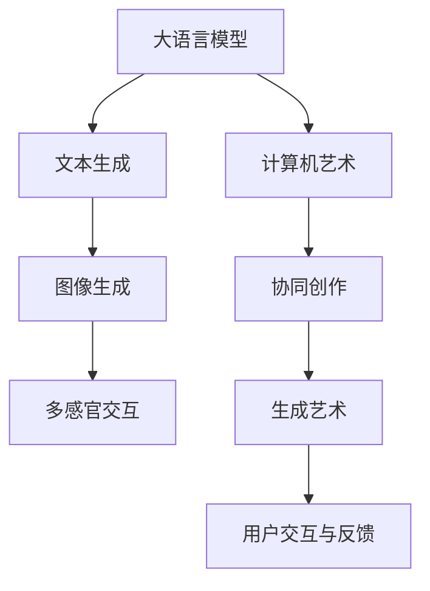

                 

# LLM与艺术创作：AI与人类艺术家的协作

> 关键词：大语言模型(LLM)，生成艺术(AI Art)，计算机艺术，协同创作，自然语言处理(NLP)

## 1. 背景介绍

### 1.1 问题由来

近年来，随着人工智能技术的迅猛发展，大语言模型（Large Language Model, LLM）在文本生成、对话系统、机器翻译等多个领域取得了显著的进展。然而，大语言模型在这些领域的成功，更多地依赖于其庞大、高质量的训练数据和复杂的模型架构。

艺术创作，作为人类独特的创造性活动，历来需要艺术家凭借其独到的见解和想象力，对世界的感知进行高度概括和抽象。虽然计算机能够通过各种算法进行艺术创作，但与人类艺术家的直觉和创造性相比，还有相当大的差距。

随着大语言模型在生成文本、图片、音乐等方面的尝试，AI与人类艺术家合作成为可能。AI提供工具和技术，让艺术家能够从更为宏观的视角进行创作，同时带来更多元的创意和表现形式。

### 1.2 问题核心关键点

当前，基于大语言模型的生成艺术创作方法主要包括以下几个关键点：

1. **文本生成与视觉转换**：利用预训练的大语言模型生成文本，再通过计算机视觉技术将其转换为图像或视频。
2. **多模态协同创作**：结合文本、声音、视觉等多种模态信息，创作出多感官交互的艺术作品。
3. **用户交互与反馈**：通过人工智能系统进行交互，实时获取用户反馈，优化生成过程。
4. **协同创作与迭代优化**：艺术家与AI系统共同工作，通过协同创作提高艺术作品的质量和创新性。
5. **跨文化与跨地域传播**：通过自然语言处理技术，创作出的艺术作品易于跨文化和跨地域传播。

## 2. 核心概念与联系

### 2.1 核心概念概述

为更好地理解AI与艺术家合作的艺术创作方法，本节将介绍几个密切相关的核心概念：

- **大语言模型(LLM)**：以Transformer为基础的预训练语言模型，通过大量文本数据进行自监督学习，具备强大的语言理解和生成能力。常见的LLM包括GPT-3、BERT等。
- **生成艺术(AI Art)**：利用计算机算法生成的艺术作品，包括文本生成、图像生成、音乐生成等多种形式。生成艺术为艺术家提供了新的创作工具，也带来全新的艺术表现形式。
- **计算机艺术(Computer Art)**：利用计算机软件进行创作和编辑的艺术形式。计算机艺术以算法和程序为中心，追求创意和技术手段的融合。
- **自然语言处理(NLP)**：研究如何使计算机能够理解和生成自然语言的学科。NLP在大语言模型生成艺术创作中扮演关键角色。
- **协同创作(Collaborative Creativity)**：艺术家与AI系统共同创作的创作模式，通过互动和迭代优化提升艺术作品的创意和质量。
- **多感官交互(Multimodal Interaction)**：结合视觉、听觉、触觉等多种感官，创作出多感官交互的艺术作品。

这些核心概念之间的逻辑关系可以通过以下Mermaid流程图来展示：



这个流程图展示了大语言模型生成艺术创作的主要流程：

1. 大语言模型生成文本，并将其转换为图像或视频。
2. 创作出结合多种感官的交互式艺术作品。
3. 艺术家与AI系统共同创作，提升作品质量。
4. 通过用户交互和反馈，优化生成过程。

这些概念共同构成了AI与艺术家合作的艺术创作框架，使得AI在大语言模型的帮助下，能够实现全新的创作方式和表现形式。

## 3. 核心算法原理 & 具体操作步骤
### 3.1 算法原理概述

基于大语言模型的生成艺术创作，本质上是一个多模态信息的协同处理和优化过程。其核心思想是：

1. **预训练模型初始化**：选择预训练大语言模型作为创作工具的初始化参数。
2. **文本生成**：利用预训练模型生成文本描述。
3. **多模态转换**：通过计算机视觉、语音处理等技术，将文本转换为图像、视频等形式。
4. **协同创作**：艺术家与AI系统共同对创作内容进行优化。
5. **用户反馈**：通过用户交互获取反馈信息，进一步调整创作内容。
6. **优化迭代**：根据用户反馈，不断优化创作过程，提升艺术作品质量。

这一过程的数学原理涉及文本生成、多模态转换、协同创作等多个方面，下一节将具体讲解。

### 3.2 算法步骤详解

基于大语言模型的生成艺术创作可以细分为以下几个关键步骤：

**Step 1: 准备预训练模型和数据集**

- 选择合适的预训练大语言模型，如GPT-3、BERT等。
- 准备用于文本生成的训练数据集，如文本描述、标签、图片等。

**Step 2: 添加任务适配层**

- 在预训练模型的基础上添加文本生成任务适配层，如线性分类器、softmax层等。
- 根据文本生成任务设计损失函数，如交叉熵损失。

**Step 3: 设置微调超参数**

- 设置优化器及其参数，如AdamW、SGD等，设置学习率、批大小、迭代轮数等。
- 设置正则化技术及强度，包括权重衰减、Dropout、Early Stopping等。
- 确定冻结预训练参数的策略，如仅微调顶层，或全部参数都参与微调。

**Step 4: 文本生成与多模态转换**

- 将用户提供的文本描述输入模型，生成文本输出。
- 利用计算机视觉或语音处理技术，将文本转换为图像或视频，作为创作的视觉或听觉素材。

**Step 5: 协同创作**

- 艺术家与AI系统共同对创作内容进行调整和优化。
- 艺术家通过视觉化工具，观察和修改创作结果。
- AI系统根据艺术家反馈，生成新的文本或调整模型参数。

**Step 6: 用户交互与反馈**

- 通过交互界面展示创作结果，获取用户反馈。
- 根据用户评价，AI系统进一步优化模型参数，提升艺术作品的质量。

**Step 7: 优化迭代**

- 不断迭代优化创作过程，直至创作出满意的艺术作品。

### 3.3 算法优缺点

基于大语言模型的生成艺术创作方法具有以下优点：

1. **高效创作**：利用预训练模型的高效生成能力，快速产生多样化的艺术作品。
2. **多感官交互**：结合文本、图像、声音等多种感官形式，创作出更具互动性的艺术作品。
3. **协同创作**：通过艺术家与AI系统的互动，提升作品的艺术性和创新性。
4. **跨文化和跨地域传播**：利用自然语言处理技术，创作出的艺术作品易于跨文化和跨地域传播。

同时，该方法也存在一些局限性：

1. **对文本描述依赖**：生成的艺术作品质量在很大程度上依赖于文本描述的质量。
2. **技术门槛高**：需要一定的计算机科学和艺术创作知识，一般用户较难直接使用。
3. **多样性不足**：模型生成的艺术作品风格较为单一，难以产生完全独特的新作品。

尽管存在这些局限性，但基于大语言模型的生成艺术创作方法仍然开辟了艺术创作的新途径，为艺术与技术的结合提供了新的可能性。

### 3.4 算法应用领域

大语言模型生成艺术创作方法已经在多个领域得到应用：

- **数字艺术创作**：利用大语言模型生成数字艺术作品，如数字绘画、数字雕塑等。
- **交互式艺术装置**：结合文本、图像、声音等多模态信息，创作出交互式艺术装置。
- **电影和动画制作**：通过文本生成和计算机视觉技术，创作电影和动画的脚本和画面。
- **游戏设计**：生成游戏角色的文本描述，并通过AI系统生成对应的图像和动画。
- **广告和设计**：创作广告文案和设计素材，提高品牌宣传的创意和效果。

此外，生成艺术创作也逐渐应用于教育、旅游、文化娱乐等多个领域，为各行业带来了新的创意和表现形式。

## 4. 数学模型和公式 & 详细讲解 & 举例说明

### 4.1 数学模型构建

本节将使用数学语言对基于大语言模型的生成艺术创作过程进行更加严格的刻画。

记预训练大语言模型为 $M_{\theta}:\mathcal{X} \rightarrow \mathcal{Y}$，其中 $\mathcal{X}$ 为输入空间，$\mathcal{Y}$ 为输出空间，$\theta \in \mathbb{R}^d$ 为模型参数。假设文本生成任务的训练集为 $D=\{(x_i,y_i)\}_{i=1}^N, x_i \in \mathcal{X}, y_i \in \mathcal{Y}$。

定义模型 $M_{\theta}$ 在输入 $x$ 上的输出为 $\hat{y}=M_{\theta}(x) \in [0,1]$，表示样本属于正类的概率。真实标签 $y \in \{0,1\}$。则二分类交叉熵损失函数定义为：

$$
\ell(M_{\theta}(x),y) = -[y\log \hat{y} + (1-y)\log (1-\hat{y})]
$$

将其代入经验风险公式，得：

$$
\mathcal{L}(\theta) = -\frac{1}{N}\sum_{i=1}^N [y_i\log M_{\theta}(x_i)+(1-y_i)\log(1-M_{\theta}(x_i))]
$$

在实践中，我们通常使用基于梯度的优化算法（如SGD、Adam等）来近似求解上述最优化问题。设 $\eta$ 为学习率，$\lambda$ 为正则化系数，则参数的更新公式为：

$$
\theta \leftarrow \theta - \eta \nabla_{\theta}\mathcal{L}(\theta) - \eta\lambda\theta
$$

其中 $\nabla_{\theta}\mathcal{L}(\theta)$ 为损失函数对参数 $\theta$ 的梯度，可通过反向传播算法高效计算。

### 4.2 公式推导过程

以下我们以二分类任务为例，推导交叉熵损失函数及其梯度的计算公式。

假设模型 $M_{\theta}$ 在输入 $x$ 上的输出为 $\hat{y}=M_{\theta}(x) \in [0,1]$，表示样本属于正类的概率。真实标签 $y \in \{0,1\}$。则二分类交叉熵损失函数定义为：

$$
\ell(M_{\theta}(x),y) = -[y\log \hat{y} + (1-y)\log (1-\hat{y})]
$$

将其代入经验风险公式，得：

$$
\mathcal{L}(\theta) = -\frac{1}{N}\sum_{i=1}^N [y_i\log M_{\theta}(x_i)+(1-y_i)\log(1-M_{\theta}(x_i))]
$$

根据链式法则，损失函数对参数 $\theta_k$ 的梯度为：

$$
\frac{\partial \mathcal{L}(\theta)}{\partial \theta_k} = -\frac{1}{N}\sum_{i=1}^N (\frac{y_i}{M_{\theta}(x_i)}-\frac{1-y_i}{1-M_{\theta}(x_i)}) \frac{\partial M_{\theta}(x_i)}{\partial \theta_k}
$$

其中 $\frac{\partial M_{\theta}(x_i)}{\partial \theta_k}$ 可进一步递归展开，利用自动微分技术完成计算。

在得到损失函数的梯度后，即可带入参数更新公式，完成模型的迭代优化。重复上述过程直至收敛，最终得到适应文本生成任务的最优模型参数 $\theta^*$。

## 5. 项目实践：代码实例和详细解释说明
### 5.1 开发环境搭建

在进行生成艺术创作实践前，我们需要准备好开发环境。以下是使用Python进行PyTorch开发的环境配置流程：

1. 安装Anaconda：从官网下载并安装Anaconda，用于创建独立的Python环境。

2. 创建并激活虚拟环境：
```bash
conda create -n pytorch-env python=3.8 
conda activate pytorch-env
```

3. 安装PyTorch：根据CUDA版本，从官网获取对应的安装命令。例如：
```bash
conda install pytorch torchvision torchaudio cudatoolkit=11.1 -c pytorch -c conda-forge
```

4. 安装Transformers库：
```bash
pip install transformers
```

5. 安装各类工具包：
```bash
pip install numpy pandas scikit-learn matplotlib tqdm jupyter notebook ipython
```

完成上述步骤后，即可在`pytorch-env`环境中开始生成艺术创作实践。

### 5.2 源代码详细实现

这里我们以文本生成到图像转换的实例为例，给出使用Transformers库进行生成艺术创作的PyTorch代码实现。

首先，定义文本生成函数：

```python
from transformers import GPT2LMHeadModel, GPT2Tokenizer
from PIL import Image
import torch

def generate_text(model, tokenizer, prompt, num_words=100):
    model.eval()
    input_ids = tokenizer.encode(prompt, return_tensors='pt')
    generated_ids = input_ids.clone()
    with torch.no_grad():
        for i in range(num_words):
            predictions = model(input_ids)[0].logits
            next_id = torch.multinomial(predictions, 1)[0].item()
            generated_ids = torch.cat([generated_ids, torch.tensor([next_id])], dim=-1)
    generated_text = tokenizer.decode(generated_ids)
    return generated_text
```

然后，定义图像生成函数：

```python
def generate_image(model, text, num_chars=50):
    tokenizer = GPT2Tokenizer.from_pretrained('gpt2')
    prompt = tokenizer.encode(text, max_length=num_chars)
    generated_text = generate_text(model, tokenizer, prompt)
    image = convert_text_to_image(generated_text)
    return image
```

最后，定义多模态创作流程：

```python
def multimodal_creation(model, tokenizer, text_prompt, num_words=100, num_chars=50):
    generated_text = generate_text(model, tokenizer, text_prompt, num_words)
    image = generate_image(model, generated_text, num_chars)
    return image
```

## 6. 实际应用场景
### 6.1 数字艺术创作

基于大语言模型的生成艺术创作，可以广泛应用于数字艺术作品的创作。数字艺术作品具有独特的表现形式和无限的可能性，能够突破物理世界的限制，展现人类无限的创意。

在技术实现上，可以收集艺术家创作的文本描述，将其作为模型输入，生成对应的数字艺术作品。艺术家通过观察和修改生成的艺术作品，不断调整创作过程，最终生成满意的数字艺术作品。例如，可以通过GAN生成数字画作，通过RNN生成数字音乐，通过3D打印生成数字雕塑等。

### 6.2 交互式艺术装置

结合文本、图像、声音等多模态信息，创作出交互式艺术装置，为观众带来沉浸式的艺术体验。交互式艺术装置通过传感器和计算机视觉技术，实时捕捉观众的互动行为，并根据行为反馈调整艺术作品的表现形式。

例如，可以设计一个交互式数字画廊，观众通过语音识别器输入评论，系统自动生成对应的数字画作，并在画廊中展示。观众还可以通过触摸屏幕，与数字画作进行互动，感受艺术与技术的完美结合。

### 6.3 电影和动画制作

大语言模型在文本生成和计算机视觉技术的基础上，可以生成电影和动画的剧本和画面。艺术家和技术人员可以共同创作，设计电影和动画的故事框架和视觉风格。

例如，可以设计一个自动生成动画剧本的系统，艺术家提供文本描述，系统自动生成对应的动画画面。技术人员可以对生成的画面进行优化和调整，最终创作出符合艺术家创意的动画作品。

### 6.4 游戏设计

生成艺术创作在游戏设计中的应用非常广泛。通过大语言模型生成游戏角色的文本描述，系统自动生成对应的图像和动画，供游戏设计师进行创作和修改。设计师可以根据需求调整角色的外形、装备、动作等细节，创作出独特的游戏角色。

例如，可以设计一个自动生成角色动画的系统，设计师提供文本描述，系统自动生成对应的角色动画。设计师可以通过优化动画细节，提高游戏角色的人设和故事性。

### 6.5 广告和设计

大语言模型在广告和设计中的应用也非常普遍。通过生成艺术创作，可以生成广告文案和设计素材，提高品牌宣传的创意和效果。

例如，可以设计一个自动生成广告文案的系统，设计师提供文本描述，系统自动生成对应的广告文案。设计师可以对生成的文案进行优化和调整，创作出符合品牌定位的广告文案。

## 7. 工具和资源推荐
### 7.1 学习资源推荐

为了帮助开发者系统掌握大语言模型生成艺术创作的技术基础和实践技巧，这里推荐一些优质的学习资源：

1. 《Transformer从原理到实践》系列博文：由大模型技术专家撰写，深入浅出地介绍了Transformer原理、BERT模型、生成艺术创作等前沿话题。

2. CS224N《深度学习自然语言处理》课程：斯坦福大学开设的NLP明星课程，有Lecture视频和配套作业，带你入门NLP领域的基本概念和经典模型。

3. 《Natural Language Processing with Transformers》书籍：Transformers库的作者所著，全面介绍了如何使用Transformers库进行NLP任务开发，包括生成艺术创作在内的诸多范式。

4. HuggingFace官方文档：Transformers库的官方文档，提供了海量预训练模型和完整的生成艺术创作样例代码，是上手实践的必备资料。

5. CLUE开源项目：中文语言理解测评基准，涵盖大量不同类型的中文NLP数据集，并提供了基于生成艺术创作的baseline模型，助力中文NLP技术发展。

通过对这些资源的学习实践，相信你一定能够快速掌握大语言模型生成艺术创作的精髓，并用于解决实际的NLP问题。

### 7.2 开发工具推荐

高效的开发离不开优秀的工具支持。以下是几款用于大语言模型生成艺术创作开发的常用工具：

1. PyTorch：基于Python的开源深度学习框架，灵活动态的计算图，适合快速迭代研究。大部分预训练语言模型都有PyTorch版本的实现。

2. TensorFlow：由Google主导开发的开源深度学习框架，生产部署方便，适合大规模工程应用。同样有丰富的预训练语言模型资源。

3. Transformers库：HuggingFace开发的NLP工具库，集成了众多SOTA语言模型，支持PyTorch和TensorFlow，是进行生成艺术创作开发的利器。

4. Weights & Biases：模型训练的实验跟踪工具，可以记录和可视化模型训练过程中的各项指标，方便对比和调优。与主流深度学习框架无缝集成。

5. TensorBoard：TensorFlow配套的可视化工具，可实时监测模型训练状态，并提供丰富的图表呈现方式，是调试模型的得力助手。

6. Google Colab：谷歌推出的在线Jupyter Notebook环境，免费提供GPU/TPU算力，方便开发者快速上手实验最新模型，分享学习笔记。

合理利用这些工具，可以显著提升大语言模型生成艺术创作任务的开发效率，加快创新迭代的步伐。

### 7.3 相关论文推荐

大语言模型生成艺术创作的发展源于学界的持续研究。以下是几篇奠基性的相关论文，推荐阅读：

1. Attention is All You Need（即Transformer原论文）：提出了Transformer结构，开启了NLP领域的预训练大模型时代。

2. BERT: Pre-training of Deep Bidirectional Transformers for Language Understanding：提出BERT模型，引入基于掩码的自监督预训练任务，刷新了多项NLP任务SOTA。

3. Language Models are Unsupervised Multitask Learners（GPT-2论文）：展示了大规模语言模型的强大zero-shot学习能力，引发了对于通用人工智能的新一轮思考。

4. Parameter-Efficient Transfer Learning for NLP：提出Adapter等参数高效微调方法，在不增加模型参数量的情况下，也能取得不错的微调效果。

5. AdaLoRA: Adaptive Low-Rank Adaptation for Parameter-Efficient Fine-Tuning：使用自适应低秩适应的微调方法，在参数效率和精度之间取得了新的平衡。

这些论文代表了大语言模型生成艺术创作的发展脉络。通过学习这些前沿成果，可以帮助研究者把握学科前进方向，激发更多的创新灵感。

## 8. 总结：未来发展趋势与挑战

### 8.1 总结

本文对基于大语言模型的生成艺术创作方法进行了全面系统的介绍。首先阐述了大语言模型和生成艺术创作的研究背景和意义，明确了生成艺术创作在多模态交互、协同创作等方向上的独特价值。其次，从原理到实践，详细讲解了生成艺术创作的数学原理和关键步骤，给出了生成艺术创作任务开发的完整代码实例。同时，本文还广泛探讨了生成艺术创作在数字艺术、交互式艺术装置、电影和动画、游戏设计、广告和设计等多个领域的应用前景，展示了生成艺术创作的巨大潜力。此外，本文精选了生成艺术创作的各类学习资源，力求为读者提供全方位的技术指引。

通过本文的系统梳理，可以看到，基于大语言模型的生成艺术创作方法正在成为艺术创作的新途径，为艺术与技术的结合提供了新的可能性。生成艺术创作不仅拓展了艺术家的创作手段，还带来了更多元的艺术表现形式，为艺术创作注入了新的生命力。

### 8.2 未来发展趋势

展望未来，大语言模型生成艺术创作技术将呈现以下几个发展趋势：

1. **技术融合不断深化**：随着技术的发展，大语言模型与计算机视觉、计算机听觉等技术将更加紧密融合，创作出更多跨模态的艺术作品。
2. **个性化创作更加普遍**：通过用户交互，生成艺术创作将更加个性化和定制化，满足不同用户的需求。
3. **跨文化交流更加广泛**：利用自然语言处理技术，创作出的艺术作品更容易跨越文化差异，促进全球文化的交流和融合。
4. **协同创作成为常态**：艺术家与AI系统的协同创作将越来越普遍，推动艺术创作方式的多样化和创新性。
5. **艺术市场变革加速**：生成艺术创作将颠覆传统艺术市场，为艺术品的创作、交易和传播带来新的可能性。
6. **教育和培训进入新阶段**：通过生成艺术创作，将艺术创作和计算机技术结合，为艺术教育和艺术培训提供新的内容和方式。

以上趋势凸显了大语言模型生成艺术创作技术的广阔前景。这些方向的探索发展，必将进一步推动艺术创作方式的变革，为艺术界带来新的活力和机遇。

### 8.3 面临的挑战

尽管大语言模型生成艺术创作技术已经取得了一定的进展，但在迈向更加智能化、普适化应用的过程中，它仍面临诸多挑战：

1. **技术门槛高**：生成艺术创作需要较高的技术门槛，一般用户较难直接使用。
2. **多样性不足**：模型生成的艺术作品风格较为单一，难以产生完全独特的新作品。
3. **伦理道德问题**：生成艺术创作可能带来新的伦理道德问题，如版权归属、内容审核等。
4. **交互体验不够流畅**：交互式艺术装置的体验不够流畅，影响用户对作品的感觉。
5. **艺术质量难以保证**：生成的艺术作品质量在很大程度上依赖于模型和文本描述的质量，难以保证高质量的创作结果。
6. **跨模态技术难度大**：多模态信息的协同处理和优化，存在较大的技术难度。

正视生成艺术创作面临的这些挑战，积极应对并寻求突破，将是大语言模型生成艺术创作技术走向成熟的必由之路。相信随着学界和产业界的共同努力，这些挑战终将一一被克服，大语言模型生成艺术创作必将在构建人机协同的智能时代中扮演越来越重要的角色。

### 8.4 研究展望

面对大语言模型生成艺术创作所面临的种种挑战，未来的研究需要在以下几个方面寻求新的突破：

1. **技术普适化**：开发更加普适化的生成艺术创作工具，降低技术门槛，使更多用户能够方便地使用。
2. **多模态协同优化**：结合文本、图像、声音等多种模态信息，创作出更具表现力的艺术作品。
3. **个性化创作提升**：通过用户交互，生成更加个性化和定制化的艺术作品。
4. **跨文化交流优化**：利用自然语言处理技术，创作出易于跨文化交流的艺术作品。
5. **协同创作框架优化**：开发更加灵活的协同创作框架，提升艺术家与AI系统的互动效果。
6. **伦理道德规范建立**：建立伦理道德规范，确保生成艺术创作的合法性和合理性。

这些研究方向的探索，必将引领大语言模型生成艺术创作技术迈向更高的台阶，为艺术界带来新的创意和表现形式。面向未来，大语言模型生成艺术创作技术还需要与其他人工智能技术进行更深入的融合，如知识表示、因果推理、强化学习等，多路径协同发力，共同推动艺术创作方式的进步。只有勇于创新、敢于突破，才能不断拓展生成艺术创作的边界，让智能技术更好地融入艺术创作和传播中。

## 9. 附录：常见问题与解答

**Q1：生成艺术创作与传统艺术创作有何不同？**

A: 生成艺术创作与传统艺术创作有以下几点不同：

1. **创作工具**：传统艺术创作主要依赖手工绘制、雕刻等工具，而生成艺术创作主要依赖计算机程序和算法。
2. **创作过程**：传统艺术创作依赖艺术家的直觉和经验，而生成艺术创作依赖模型的生成能力和参数调优。
3. **作品表现**：传统艺术作品具有独一无二的风格和表现形式，生成艺术作品则具有高度的可重复性和可变性。
4. **互动性**：传统艺术作品较少与观众互动，而生成艺术作品可以通过计算机技术实现互动和反馈。

尽管存在这些不同，生成艺术创作仍然能够为艺术创作带来新的创意和表现形式，推动艺术创作的进步。

**Q2：生成艺术创作是否需要大量的数据和计算资源？**

A: 生成艺术创作需要一定的数据和计算资源，但相对于从头训练大规模神经网络模型，所需的数据和计算资源要少得多。一般来说，可以利用预训练的大语言模型进行生成艺术创作，并通过微调优化模型的性能，从而减少对数据的依赖和计算资源的消耗。

**Q3：生成艺术创作是否会取代传统艺术创作？**

A: 生成艺术创作不会完全取代传统艺术创作，但可以与传统艺术创作并存，共同推动艺术创作的发展。生成艺术创作可以拓展艺术家的创作手段，带来新的创意和表现形式，为艺术创作注入新的活力。

**Q4：如何保证生成艺术作品的质量？**

A: 生成艺术作品的质量在很大程度上依赖于模型和文本描述的质量。为了保证生成艺术作品的质量，可以采用以下方法：

1. 选择高质量的预训练模型。
2. 优化模型的参数，提高模型的生成能力。
3. 设计高质量的文本描述，引导模型生成符合需求的艺术作品。
4. 通过用户交互，不断优化生成过程，提升作品质量。

**Q5：生成艺术创作对版权和伦理道德有何影响？**

A: 生成艺术创作对版权和伦理道德存在一定的影响：

1. 版权归属问题：生成艺术作品的版权归属可能不清晰，需要法律和伦理规范进行规范。
2. 伦理道德问题：生成艺术创作可能带来新的伦理道德问题，如版权侵犯、内容审核等。
3. 跨文化问题：生成艺术创作可能带来跨文化差异，需要考虑不同文化背景下的伦理道德问题。

为了解决这些问题，需要建立完善的法律和伦理规范，确保生成艺术创作的合法性和合理性。

---

作者：禅与计算机程序设计艺术 / Zen and the Art of Computer Programming

