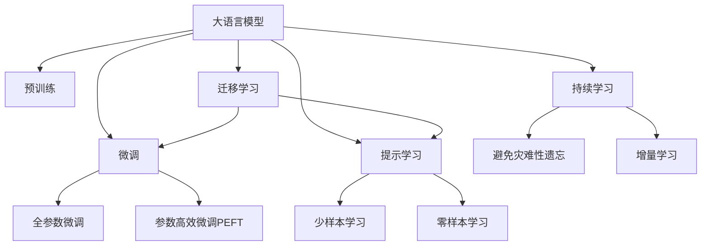

                 

# LLM在智能农业中的应用：精准种植与收获预测

> 关键词：人工智能,大语言模型,智能农业,精准农业,作物预测,气候变化,农场管理

## 1. 背景介绍

### 1.1 问题由来
随着科技的飞速发展和全球人口的持续增长，对食物的需求不断增加，同时土地资源、水资源等有限，因此提高农业生产的效率变得尤为重要。传统的农业生产方式已无法满足日益增长的需求，智能农业应运而生。智能农业通过现代信息技术与农业生产的深度融合，实现农业生产过程的自动化、智能化，有效提高农业生产的效率和质量。

智能农业的实现离不开各类先进技术的应用。物联网技术通过传感器和通信网络实现对农作物的实时监控；大数据和云计算技术提供数据存储和处理能力；机器学习与深度学习技术则通过对数据的分析挖掘，提供科学的决策支持。其中，大语言模型作为一类新兴的AI技术，在智能农业中也有着广泛的应用前景。

### 1.2 问题核心关键点
大语言模型(LLMs)在智能农业中的应用主要集中在以下几个方面：
- **精准种植**：通过大语言模型对作物生长过程进行模拟，预测作物生长状态，提前进行精准灌溉、施肥、病虫害防治等。
- **收获预测**：利用大语言模型对作物的生长周期、环境变化等因素进行分析，预测最佳收获时机，减少因过早或过晚收获带来的损失。
- **农场管理**：通过大语言模型对农场各项数据进行分析和处理，优化农场管理决策，提高资源利用效率。

## 2. 核心概念与联系

### 2.1 核心概念概述

为更好地理解大语言模型在智能农业中的应用，本节将介绍几个密切相关的核心概念：

- **大语言模型(LLMs)**：以自回归(如GPT)或自编码(如BERT)模型为代表的大规模预训练语言模型。通过在大规模无标签文本语料上进行预训练，学习通用的语言表示，具备强大的语言理解和生成能力。
- **预训练**：指在大规模无标签文本语料上，通过自监督学习任务训练通用语言模型的过程。常见的预训练任务包括言语建模、遮挡语言模型等。预训练使得模型学习到语言的通用表示。
- **微调(Fine-tuning)**：指在预训练模型的基础上，使用下游任务的少量标注数据，通过有监督学习优化模型在该任务上的性能。通常只需要调整顶层分类器或解码器，并以较小的学习率更新全部或部分的模型参数。
- **迁移学习(Transfer Learning)**：指将一个领域学习到的知识，迁移应用到另一个不同但相关的领域的学习范式。大模型的预训练-微调过程即是一种典型的迁移学习方式。
- **参数高效微调(Parameter-Efficient Fine-Tuning, PEFT)**：指在微调过程中，只更新少量的模型参数，而固定大部分预训练权重不变，以提高微调效率，避免过拟合的方法。
- **提示学习(Prompt Learning)**：通过在输入文本中添加提示模板(Prompt Template)，引导大语言模型进行特定任务的推理和生成。可以在不更新模型参数的情况下，实现零样本或少样本学习。
- **少样本学习(Few-shot Learning)**：指在只有少量标注样本的情况下，模型能够快速适应新任务的学习方法。在大语言模型中，通常通过在输入中提供少量示例来实现，无需更新模型参数。
- **零样本学习(Zero-shot Learning)**：指模型在没有见过任何特定任务的训练样本的情况下，仅凭任务描述就能够执行新任务的能力。大语言模型通过预训练获得的广泛知识，使其能够理解任务指令并生成相应输出。
- **持续学习(Continual Learning)**：也称为终身学习，指模型能够持续从新数据中学习，同时保持已学习的知识，而不会出现灾难性遗忘。这对于保持大语言模型的时效性和适应性至关重要。

这些核心概念之间的逻辑关系可以通过以下Mermaid流程图来展示：



这个流程图展示了大语言模型的核心概念及其之间的关系：

1. 大语言模型通过预训练获得基础能力。
2. 微调是对预训练模型进行任务特定的优化，可以分为全参数微调和参数高效微调（PEFT）。
3. 提示学习是一种不更新模型参数的方法，可以实现少样本学习和零样本学习。
4. 迁移学习是连接预训练模型与下游任务的桥梁，可以通过微调或提示学习来实现。
5. 持续学习旨在使模型能够不断学习新知识，同时避免遗忘旧知识。

这些概念共同构成了大语言模型的学习和应用框架，使其能够在各种场景下发挥强大的语言理解和生成能力。通过理解这些核心概念，我们可以更好地把握大语言模型的工作原理和优化方向。

## 3. 核心算法原理 & 具体操作步骤
### 3.1 算法原理概述

基于大语言模型在智能农业中的应用，可以将其分解为以下几个步骤：

1. **数据收集与预处理**：收集农作物的生长数据，包括土壤湿度、温度、光照、气象数据等，并进行清洗和标准化处理。
2. **模型选择与加载**：选择适合的预训练大语言模型，并进行加载和初始化。
3. **特征提取与适配**：将收集到的数据作为模型输入，利用大语言模型提取特征，并通过微调或提示学习适配特定任务。
4. **模型训练与优化**：利用农场历史数据和目标任务数据对模型进行训练，调整模型参数以优化性能。
5. **结果分析与应用**：将训练好的模型应用于实际农业生产中，进行精准种植和收获预测，优化农场管理决策。

### 3.2 算法步骤详解

#### 3.2.1 数据收集与预处理

在智能农业中，数据收集是基础。通过各种传感器和设备，如土壤湿度传感器、气象站、光照传感器等，实时采集农作物的生长环境数据。数据预处理包括去噪、归一化、缺失值填补等，确保数据的准确性和一致性。

具体步骤如下：

1. **数据采集**：
   - 使用传感器设备实时监测土壤湿度、温度、光照等数据。
   - 利用气象站数据获取降水、风速、空气湿度等气象信息。
   - 通过无人机或卫星遥感技术获取农作物的生长状态和健康情况。

2. **数据清洗**：
   - 去除噪声数据，如传感器故障导致的异常值。
   - 对缺失数据进行插补，如使用均值插补、时间序列预测等方法。
   - 归一化数据，使其在统一区间内，便于模型处理。

#### 3.2.2 模型选择与加载

大语言模型在智能农业中的应用需要选择合适的模型和预训练任务。常用的模型包括BERT、GPT、RoBERTa等，预训练任务可以包括语言建模、掩码语言模型、下一句预测等。

具体步骤如下：

1. **模型选择**：
   - 根据任务需求选择适合的大语言模型，如BERT适用于分类任务，GPT适用于生成任务。
   - 考虑模型的预训练任务，选择与智能农业相关的预训练任务。

2. **模型加载**：
   - 使用相应的库加载预训练模型，如使用Transformers库加载BERT模型。
   - 设置模型的超参数，如学习率、批大小等。

#### 3.2.3 特征提取与适配

大语言模型需要输入特定的文本数据才能进行推理和预测。在智能农业中，需要将收集到的数据转换为文本格式，或通过一定的文本编码方式输入模型。

具体步骤如下：

1. **数据编码**：
   - 将数值型数据转换为文本格式，如使用“湿度高”、“光照不足”等描述性词汇。
   - 将时间序列数据转换为文本，如使用“今年1月平均温度25度”。

2. **特征提取**：
   - 利用大语言模型的编码器将文本数据转换为高维特征表示。
   - 根据任务需求，选择适合的特征提取方式，如使用上下文向量、TF-IDF等。

#### 3.2.4 模型训练与优化

在智能农业中，大语言模型需要通过微调或提示学习来适配特定的任务。微调通常需要调整模型的权重，而提示学习则不需要更新模型参数。

具体步骤如下：

1. **训练集划分**：
   - 将历史数据划分为训练集、验证集和测试集，用于模型训练、调参和最终评估。

2. **模型微调**：
   - 使用训练集数据对模型进行微调，调整模型的权重，使其能够适配特定的农业任务。
   - 设定合适的学习率、批大小和优化器，如AdamW、SGD等。

3. **验证与优化**：
   - 在验证集上评估模型的性能，调整超参数和模型结构。
   - 使用早停法(Early Stopping)防止过拟合。

#### 3.2.5 结果分析与应用

大语言模型在智能农业中的应用需要结合具体的农业场景进行分析和应用。通过精准种植和收获预测，优化农场管理决策，提高农业生产的效率和质量。

具体步骤如下：

1. **结果分析**：
   - 在测试集上评估模型的性能，如准确率、F1值等指标。
   - 分析模型的输出结果，确定模型的预测效果。

2. **应用部署**：
   - 将训练好的模型部署到农场管理系统，进行实时数据处理和决策支持。
   - 通过用户界面展示模型预测结果，帮助农场主进行决策。

### 3.3 算法优缺点

基于大语言模型在智能农业中的应用，其优缺点如下：

#### 优点：
1. **通用性**：大语言模型具备强大的语言理解和生成能力，可以处理多种农业问题，如病虫害防治、作物生长预测等。
2. **高精度**：通过微调和提示学习，大语言模型能够实现较高的预测精度，帮助农场主做出科学的决策。
3. **灵活性**：大语言模型可以通过不同的预训练任务和微调策略，适应不同的农业场景和需求。

#### 缺点：
1. **计算成本高**：大语言模型的训练和推理需要大量的计算资源，对硬件要求较高。
2. **数据需求大**：模型需要大量的数据进行预训练和微调，数据获取和处理成本较高。
3. **泛化能力有限**：模型在特定场景下表现良好，但面对未知数据时，泛化能力可能受限。

### 3.4 算法应用领域

基于大语言模型在智能农业中的应用，主要涉及以下几个领域：

1. **精准种植**：利用大语言模型对作物生长过程进行模拟，预测作物生长状态，提前进行精准灌溉、施肥、病虫害防治等。
2. **收获预测**：利用大语言模型对作物的生长周期、环境变化等因素进行分析，预测最佳收获时机，减少因过早或过晚收获带来的损失。
3. **农场管理**：通过大语言模型对农场各项数据进行分析和处理，优化农场管理决策，提高资源利用效率。

此外，大语言模型还可以应用于农产品的质量检测、供应链管理等领域，为农业生产提供更加智能化的支持。

## 4. 数学模型和公式 & 详细讲解  
### 4.1 数学模型构建

在智能农业中，大语言模型通常用于分类任务和生成任务。假设模型为 $M_{\theta}$，其中 $\theta$ 为模型参数。给定农业数据集 $D=\{(x_i,y_i)\}_{i=1}^N$，$x_i$ 为输入特征向量，$y_i$ 为标签。微调的目标是最小化经验风险，即找到最优参数：

$$
\theta^* = \mathop{\arg\min}_{\theta} \mathcal{L}(\theta) = \frac{1}{N}\sum_{i=1}^N \ell(M_{\theta}(x_i),y_i)
$$

其中 $\ell$ 为损失函数，用于衡量模型预测输出与真实标签之间的差异。常见的损失函数包括交叉熵损失、均方误差损失等。

### 4.2 公式推导过程

以分类任务为例，假设模型 $M_{\theta}$ 在输入 $x$ 上的输出为 $\hat{y}=M_{\theta}(x) \in [0,1]$，表示样本属于正类的概率。真实标签 $y \in \{0,1\}$。则二分类交叉熵损失函数定义为：

$$
\ell(M_{\theta}(x),y) = -[y\log \hat{y} + (1-y)\log (1-\hat{y})]
$$

将其代入经验风险公式，得：

$$
\mathcal{L}(\theta) = -\frac{1}{N}\sum_{i=1}^N [y_i\log M_{\theta}(x_i)+(1-y_i)\log(1-M_{\theta}(x_i))]
$$

根据链式法则，损失函数对参数 $\theta_k$ 的梯度为：

$$
\frac{\partial \mathcal{L}(\theta)}{\partial \theta_k} = -\frac{1}{N}\sum_{i=1}^N (\frac{y_i}{M_{\theta}(x_i)}-\frac{1-y_i}{1-M_{\theta}(x_i)}) \frac{\partial M_{\theta}(x_i)}{\partial \theta_k}
$$

其中 $\frac{\partial M_{\theta}(x_i)}{\partial \theta_k}$ 可进一步递归展开，利用自动微分技术完成计算。

在得到损失函数的梯度后，即可带入参数更新公式，完成模型的迭代优化。重复上述过程直至收敛，最终得到适应下游任务的最优模型参数 $\theta^*$。

## 5. 项目实践：代码实例和详细解释说明
### 5.1 开发环境搭建

在进行智能农业项目实践前，我们需要准备好开发环境。以下是使用Python进行PyTorch开发的环境配置流程：

1. 安装Anaconda：从官网下载并安装Anaconda，用于创建独立的Python环境。

2. 创建并激活虚拟环境：
```bash
conda create -n pytorch-env python=3.8 
conda activate pytorch-env
```

3. 安装PyTorch：根据CUDA版本，从官网获取对应的安装命令。例如：
```bash
conda install pytorch torchvision torchaudio cudatoolkit=11.1 -c pytorch -c conda-forge
```

4. 安装Transformer库：
```bash
pip install transformers
```

5. 安装各类工具包：
```bash
pip install numpy pandas scikit-learn matplotlib tqdm jupyter notebook ipython
```

完成上述步骤后，即可在`pytorch-env`环境中开始智能农业项目实践。

### 5.2 源代码详细实现

下面我们以农作物生长预测为例，给出使用Transformers库对BERT模型进行微调的PyTorch代码实现。

首先，定义农作物生长预测的数据处理函数：

```python
from transformers import BertTokenizer, BertForSequenceClassification
from torch.utils.data import Dataset, DataLoader
import torch

class PlantGrowthDataset(Dataset):
    def __init__(self, texts, labels, tokenizer, max_len=128):
        self.texts = texts
        self.labels = labels
        self.tokenizer = tokenizer
        self.max_len = max_len
        
    def __len__(self):
        return len(self.texts)
    
    def __getitem__(self, item):
        text = self.texts[item]
        label = self.labels[item]
        
        encoding = self.tokenizer(text, return_tensors='pt', max_length=self.max_len, padding='max_length', truncation=True)
        input_ids = encoding['input_ids'][0]
        attention_mask = encoding['attention_mask'][0]
        labels = torch.tensor(label, dtype=torch.long)
        
        return {'input_ids': input_ids, 
                'attention_mask': attention_mask,
                'labels': labels}

# 标签与id的映射
label2id = {'生长正常': 0, '生长缓慢': 1, '生长过快': 2, '生长停滞': 3}
id2label = {v: k for k, v in label2id.items()}

# 创建dataset
tokenizer = BertTokenizer.from_pretrained('bert-base-cased')

train_dataset = PlantGrowthDataset(train_texts, train_labels, tokenizer)
dev_dataset = PlantGrowthDataset(dev_texts, dev_labels, tokenizer)
test_dataset = PlantGrowthDataset(test_texts, test_labels, tokenizer)
```

然后，定义模型和优化器：

```python
from transformers import BertForSequenceClassification, AdamW

model = BertForSequenceClassification.from_pretrained('bert-base-cased', num_labels=len(label2id))

optimizer = AdamW(model.parameters(), lr=2e-5)
```

接着，定义训练和评估函数：

```python
from torch.utils.data import DataLoader
from tqdm import tqdm
from sklearn.metrics import classification_report

device = torch.device('cuda') if torch.cuda.is_available() else torch.device('cpu')
model.to(device)

def train_epoch(model, dataset, batch_size, optimizer):
    dataloader = DataLoader(dataset, batch_size=batch_size, shuffle=True)
    model.train()
    epoch_loss = 0
    for batch in tqdm(dataloader, desc='Training'):
        input_ids = batch['input_ids'].to(device)
        attention_mask = batch['attention_mask'].to(device)
        labels = batch['labels'].to(device)
        model.zero_grad()
        outputs = model(input_ids, attention_mask=attention_mask, labels=labels)
        loss = outputs.loss
        epoch_loss += loss.item()
        loss.backward()
        optimizer.step()
    return epoch_loss / len(dataloader)

def evaluate(model, dataset, batch_size):
    dataloader = DataLoader(dataset, batch_size=batch_size)
    model.eval()
    preds, labels = [], []
    with torch.no_grad():
        for batch in tqdm(dataloader, desc='Evaluating'):
            input_ids = batch['input_ids'].to(device)
            attention_mask = batch['attention_mask'].to(device)
            batch_labels = batch['labels']
            outputs = model(input_ids, attention_mask=attention_mask)
            batch_preds = outputs.logits.argmax(dim=2).to('cpu').tolist()
            batch_labels = batch_labels.to('cpu').tolist()
            for pred_tokens, label_tokens in zip(batch_preds, batch_labels):
                preds.append(pred_tokens)
                labels.append(label_tokens)
                
    print(classification_report(labels, preds))
```

最后，启动训练流程并在测试集上评估：

```python
epochs = 5
batch_size = 16

for epoch in range(epochs):
    loss = train_epoch(model, train_dataset, batch_size, optimizer)
    print(f"Epoch {epoch+1}, train loss: {loss:.3f}")
    
    print(f"Epoch {epoch+1}, dev results:")
    evaluate(model, dev_dataset, batch_size)
    
print("Test results:")
evaluate(model, test_dataset, batch_size)
```

以上就是使用PyTorch对BERT进行农作物生长预测任务微调的完整代码实现。可以看到，得益于Transformers库的强大封装，我们可以用相对简洁的代码完成BERT模型的加载和微调。

### 5.3 代码解读与分析

让我们再详细解读一下关键代码的实现细节：

**PlantGrowthDataset类**：
- `__init__`方法：初始化文本、标签、分词器等关键组件。
- `__len__`方法：返回数据集的样本数量。
- `__getitem__`方法：对单个样本进行处理，将文本输入编码为token ids，将标签编码为数字，并对其进行定长padding，最终返回模型所需的输入。

**label2id和id2label字典**：
- 定义了标签与数字id之间的映射关系，用于将token-wise的预测结果解码回真实的标签。

**训练和评估函数**：
- 使用PyTorch的DataLoader对数据集进行批次化加载，供模型训练和推理使用。
- 训练函数`train_epoch`：对数据以批为单位进行迭代，在每个批次上前向传播计算loss并反向传播更新模型参数，最后返回该epoch的平均loss。
- 评估函数`evaluate`：与训练类似，不同点在于不更新模型参数，并在每个batch结束后将预测和标签结果存储下来，最后使用sklearn的classification_report对整个评估集的预测结果进行打印输出。

**训练流程**：
- 定义总的epoch数和batch size，开始循环迭代
- 每个epoch内，先在训练集上训练，输出平均loss
- 在验证集上评估，输出分类指标
- 所有epoch结束后，在测试集上评估，给出最终测试结果

可以看到，PyTorch配合Transformers库使得BERT微调的代码实现变得简洁高效。开发者可以将更多精力放在数据处理、模型改进等高层逻辑上，而不必过多关注底层的实现细节。

当然，工业级的系统实现还需考虑更多因素，如模型的保存和部署、超参数的自动搜索、更灵活的任务适配层等。但核心的微调范式基本与此类似。

## 6. 实际应用场景
### 6.1 精准种植

基于大语言模型的智能农业应用，可以显著提升精准种植的效率和效果。通过大语言模型对作物生长状态进行预测，可以提前进行灌溉、施肥、病虫害防治等操作，避免因不当管理导致的不良后果。

具体而言，可以通过物联网设备实时采集作物的生长数据，如土壤湿度、温度、光照等，输入大语言模型进行特征提取和分类。大语言模型利用预训练的知识和微调任务的知识，对作物生长状态进行预测，输出相应的管理建议。农场主根据模型建议进行精准管理，提高作物的健康度和产量。

### 6.2 收获预测

大语言模型在智能农业中的应用，还可以通过预测最佳收获时机，减少因过早或过晚收获带来的损失。通过分析作物的生长周期、环境变化等因素，大语言模型可以预测出最佳收获时机，农场主根据预测结果进行收获决策，优化资源配置。

具体而言，可以将历史数据和气象数据输入大语言模型进行训练和预测。模型通过学习历史数据和环境变化规律，预测出最佳收获时机，输出相应的管理建议。农场主根据模型建议进行收获决策，确保在最佳时机收获作物，最大化产量和品质。

### 6.3 农场管理

大语言模型在智能农业中的应用，还可以优化农场管理决策，提高资源利用效率。通过分析农场各项数据，大语言模型可以提供科学的决策支持，优化资源配置和管理策略。

具体而言，可以通过农场管理系统实时采集数据，如土壤湿度、温度、光照、气象等，输入大语言模型进行特征提取和分类。大语言模型利用预训练的知识和微调任务的知识，分析农场各项数据，输出相应的管理建议。农场主根据模型建议进行农场管理，优化资源配置，提高生产效率。

### 6.4 未来应用展望

随着大语言模型和微调方法的不断发展，基于微调范式将在更多领域得到应用，为智能农业带来变革性影响。

在智慧农业领域，基于微调的语言模型可以用于农业咨询、农产品追溯、智能灌溉等领域，提升农业生产的智能化水平。

在智能农业应用中，微调技术可以与其他AI技术进行更深入的融合，如计算机视觉、物联网、机器人等，协同发力，构建更加智能、高效的农业生产系统。

此外，在智慧农业管理、智能农产品质量检测、农业机械自动化等领域，基于微调的语言模型也将不断涌现，为农业生产提供更加智能化、精准化的支持。

## 7. 工具和资源推荐
### 7.1 学习资源推荐

为了帮助开发者系统掌握大语言模型在智能农业中的应用，这里推荐一些优质的学习资源：

1. **《Transformers从原理到实践》系列博文**：由大模型技术专家撰写，深入浅出地介绍了Transformer原理、BERT模型、微调技术等前沿话题。

2. **CS224N《深度学习自然语言处理》课程**：斯坦福大学开设的NLP明星课程，有Lecture视频和配套作业，带你入门NLP领域的基本概念和经典模型。

3. **《Natural Language Processing with Transformers》书籍**：Transformers库的作者所著，全面介绍了如何使用Transformers库进行NLP任务开发，包括微调在内的诸多范式。

4. **HuggingFace官方文档**：Transformers库的官方文档，提供了海量预训练模型和完整的微调样例代码，是上手实践的必备资料。

5. **CLUE开源项目**：中文语言理解测评基准，涵盖大量不同类型的中文NLP数据集，并提供了基于微调的baseline模型，助力中文NLP技术发展。

通过对这些资源的学习实践，相信你一定能够快速掌握大语言模型在智能农业中的应用，并用于解决实际的智能农业问题。
###  7.2 开发工具推荐

高效的开发离不开优秀的工具支持。以下是几款用于大语言模型在智能农业中微调开发的常用工具：

1. **PyTorch**：基于Python的开源深度学习框架，灵活动态的计算图，适合快速迭代研究。大部分预训练语言模型都有PyTorch版本的实现。

2. **TensorFlow**：由Google主导开发的开源深度学习框架，生产部署方便，适合大规模工程应用。同样有丰富的预训练语言模型资源。

3. **Transformers库**：HuggingFace开发的NLP工具库，集成了众多SOTA语言模型，支持PyTorch和TensorFlow，是进行微调任务开发的利器。

4. **Weights & Biases**：模型训练的实验跟踪工具，可以记录和可视化模型训练过程中的各项指标，方便对比和调优。与主流深度学习框架无缝集成。

5. **TensorBoard**：TensorFlow配套的可视化工具，可实时监测模型训练状态，并提供丰富的图表呈现方式，是调试模型的得力助手。

6. **Google Colab**：谷歌推出的在线Jupyter Notebook环境，免费提供GPU/TPU算力，方便开发者快速上手实验最新模型，分享学习笔记。

合理利用这些工具，可以显著提升大语言模型在智能农业中微调任务的开发效率，加快创新迭代的步伐。

### 7.3 相关论文推荐

大语言模型在智能农业中的应用源于学界的持续研究。以下是几篇奠基性的相关论文，推荐阅读：

1. **Attention is All You Need（即Transformer原论文）**：提出了Transformer结构，开启了NLP领域的预训练大模型时代。

2. **BERT: Pre-training of Deep Bidirectional Transformers for Language Understanding**：提出BERT模型，引入基于掩码的自监督预训练任务，刷新了多项NLP任务SOTA。

3. **Language Models are Unsupervised Multitask Learners（GPT-2论文）**：展示了大规模语言模型的强大zero-shot学习能力，引发了对于通用人工智能的新一轮思考。

4. **Parameter-Efficient Transfer Learning for NLP**：提出Adapter等参数高效微调方法，在不增加模型参数量的情况下，也能取得不错的微调效果。

5. **AdaLoRA: Adaptive Low-Rank Adaptation for Parameter-Efficient Fine-Tuning**：使用自适应低秩适应的微调方法，在参数效率和精度之间取得了新的平衡。

6. **Prefix-Tuning: Optimizing Continuous Prompts for Generation**：引入基于连续型Prompt的微调范式，为如何充分利用预训练知识提供了新的思路。

这些论文代表了大语言模型在智能农业中的应用的发展脉络。通过学习这些前沿成果，可以帮助研究者把握学科前进方向，激发更多的创新灵感。

## 8. 总结：未来发展趋势与挑战
### 8.1 总结

本文对基于大语言模型的智能农业应用进行了全面系统的介绍。首先阐述了大语言模型和微调技术的研究背景和意义，明确了微调在拓展预训练模型应用、提升智能农业生产效率方面的独特价值。其次，从原理到实践，详细讲解了监督微调的数学原理和关键步骤，给出了智能农业项目开发的完整代码实例。同时，本文还广泛探讨了大语言模型在智能农业中的实际应用场景，展示了微调范式的巨大潜力。此外，本文精选了微调技术的各类学习资源，力求为读者提供全方位的技术指引。

通过本文的系统梳理，可以看到，基于大语言模型的微调方法正在成为智能农业的重要范式，极大地拓展了预训练语言模型的应用边界，催生了更多的落地场景。受益于大规模语料的预训练，微调模型以更低的时间和标注成本，在小样本条件下也能取得不俗的效果，有力推动了智能农业技术产业化进程。未来，伴随预训练语言模型和微调方法的持续演进，相信智能农业技术必将迎来更加广阔的发展空间。

### 8.2 未来发展趋势

展望未来，大语言模型微调技术在智能农业中将呈现以下几个发展趋势：

1. **模型规模持续增大**：随着算力成本的下降和数据规模的扩张，预训练语言模型的参数量还将持续增长。超大规模语言模型蕴含的丰富语言知识，有望支撑更加复杂多变的智能农业任务。

2. **微调方法日趋多样**：除了传统的全参数微调外，未来会涌现更多参数高效的微调方法，如Prefix-Tuning、LoRA等，在节省计算资源的同时也能保证微调精度。

3. **持续学习成为常态**：随着数据分布的不断变化，微调模型也需要持续学习新知识以保持性能。如何在不遗忘原有知识的同时，高效吸收新样本信息，将成为重要的研究课题。

4. **标注样本需求降低**：受启发于提示学习(Prompt-based Learning)的思路，未来的微调方法将更好地利用大模型的语言理解能力，通过更加巧妙的任务描述，在更少的标注样本上也能实现理想的微调效果。

5. **多模态微调崛起**：当前的微调主要聚焦于纯文本数据，未来会进一步拓展到图像、视频、语音等多模态数据微调。多模态信息的融合，将显著提升语言模型对现实世界的理解和建模能力。

6. **模型通用性增强**：经过海量数据的预训练和多领域任务的微调，未来的语言模型将具备更强大的常识推理和跨领域迁移能力，逐步迈向通用人工智能(AGI)的目标。

以上趋势凸显了大语言模型微调技术在智能农业中的广阔前景。这些方向的探索发展，必将进一步提升智能农业系统的性能和应用范围，为农业生产提供更加智能化、精准化的支持。

### 8.3 面临的挑战

尽管大语言模型微调技术在智能农业中已经取得了瞩目成就，但在迈向更加智能化、普适化应用的过程中，它仍面临着诸多挑战：

1. **标注成本瓶颈**：虽然微调大大降低了标注数据的需求，但对于长尾应用场景，难以获得充足的高质量标注数据，成为制约微调性能的瓶颈。如何进一步降低微调对标注样本的依赖，将是一大难题。

2. **模型鲁棒性不足**：当前微调模型面对域外数据时，泛化性能往往大打折扣。对于测试样本的微小扰动，微调模型的预测也容易发生波动。如何提高微调模型的鲁棒性，避免灾难性遗忘，还需要更多理论和实践的积累。

3. **推理效率有待提高**：大规模语言模型虽然精度高，但在实际部署时往往面临推理速度慢、内存占用大等效率问题。如何在保证性能的同时，简化模型结构，提升推理速度，优化资源占用，将是重要的优化方向。

4. **可解释性亟需加强**：当前微调模型更像是"黑盒"系统，难以解释其内部工作机制和决策逻辑。对于医疗、金融等高风险应用，算法的可解释性和可审计性尤为重要。如何赋予微调模型更强的可解释性，将是亟待攻克的难题。

5. **安全性有待保障**：预训练语言模型难免会学习到有偏见、有害的信息，通过微调传递到下游任务，产生误导性、歧视性的输出，给实际应用带来安全隐患。如何从数据和算法层面消除模型偏见，避免恶意用途，确保输出的安全性，也将是重要的研究课题。

6. **知识整合能力不足**：现有的微调模型往往局限于任务内数据，难以灵活吸收和运用更广泛的先验知识。如何让微调过程更好地与外部知识库、规则库等专家知识结合，形成更加全面、准确的信息整合能力，还有很大的想象空间。

正视微调面临的这些挑战，积极应对并寻求突破，将是大语言模型微调走向成熟的必由之路。相信随着学界和产业界的共同努力，这些挑战终将一一被克服，大语言模型微调必将在构建人机协同的智能农业中扮演越来越重要的角色。

### 8.4 研究展望

面对大语言模型微调在智能农业中面临的种种挑战，未来的研究需要在以下几个方面寻求新的突破：

1. **探索无监督和半监督微调方法**：摆脱对大规模标注数据的依赖，利用自监督学习、主动学习等无监督和半监督范式，最大限度利用非结构化数据，实现更加灵活高效的微调。

2. **研究参数高效和计算高效的微调范式**：开发更加参数高效的微调方法，在固定大部分预训练参数的同时，只更新极少量的任务相关参数。同时优化微调模型的计算图，减少前向传播和反向传播的资源消耗，实现更加轻量级、实时性的部署。

3. **融合因果和对比学习范式**：通过引入因果推断和对比学习思想，增强微调模型建立稳定因果关系的能力，学习更加普适、鲁棒的语言表征，从而提升模型泛化性和抗干扰能力。

4. **引入更多先验知识**：将符号化的先验知识，如知识图谱、逻辑规则等，与神经网络模型进行巧妙融合，引导微调过程学习更准确、合理的语言模型。同时加强不同模态数据的整合，实现视觉、语音等多模态信息与文本信息的协同建模。

5. **结合因果分析和博弈论工具**：将因果分析方法引入微调模型，识别出模型决策的关键特征，增强输出解释的因果性和逻辑性。借助博弈论工具刻画人机交互过程，主动探索并规避模型的脆弱点，提高系统稳定性。

6. **纳入伦理道德约束**：在模型训练目标中引入伦理导向的评估指标，过滤和惩罚有偏见、有害的输出倾向。同时加强人工干预和审核，建立模型行为的监管机制，确保输出符合人类价值观和伦理道德。

这些研究方向的探索，必将引领大语言模型微调在智能农业中的研究发展，为构建安全、可靠、可解释、可控的智能农业系统铺平道路。面向未来，大语言模型微调技术还需要与其他AI技术进行更深入的融合，如知识表示、因果推理、强化学习等，多路径协同发力，共同推动智能农业技术的进步。只有勇于创新、敢于突破，才能不断拓展智能农业的边界，让智能技术更好地造福农业生产。

## 9. 附录：常见问题与解答

**Q1：智能农业中，大语言模型需要哪些关键数据？**

A: 智能农业中，大语言模型需要以下关键数据：

1. **气象数据**：包括温度、湿度、降水、风速等，用于分析环境对作物生长的影响。
2. **土壤数据**：包括土壤湿度、pH值、养分含量等，用于分析土壤条件对作物生长的影响。
3. **作物生长数据**：包括作物高度、叶面积指数、果实大小等，用于分析作物生长状态和健康情况。
4. **灌溉数据**：包括灌溉时间、灌溉量、灌溉频率等，用于分析灌溉对作物生长的影响。
5. **病虫害数据**：包括病虫害种类、发生时间和严重程度等，用于分析病虫害对作物生长的影响。

这些数据可以通过传感器、无人机、卫星遥感等技术进行实时采集和处理，输入大语言模型进行特征提取和分类。

**Q2：大语言模型在智能农业中如何进行微调？**

A: 大语言模型在智能农业中的微调过程包括以下几个关键步骤：

1. **数据收集与预处理**：收集农作物的生长数据，如土壤湿度、温度、光照等，并进行清洗和标准化处理。
2. **模型选择与加载**：选择合适的预训练大语言模型，并进行加载和初始化。
3. **特征提取与适配**：将收集到的数据作为模型输入，利用大语言模型提取特征，并通过微调或提示学习适配特定任务。
4. **模型训练与优化**：利用农场历史数据和目标任务数据对模型进行训练，调整模型参数以优化性能。
5. **结果分析与应用**：将训练好的模型应用于实际农业生产中，进行精准种植和收获预测，优化农场管理决策。

**Q3：大语言模型在智能农业中如何进行推理？**

A: 大语言模型在智能农业中的推理过程主要包括以下几个步骤：

1. **数据输入**：将新的农作物的生长数据输入模型，包括土壤湿度、温度、光照等。
2. **特征提取**：利用大语言模型的编码器将文本数据转换为高维特征表示。
3. **推理计算**：将特征输入模型进行推理计算，得到预测结果，如作物生长状态、最佳收获时机等。
4. **结果输出**：将预测结果输出，帮助农场主进行管理决策。

**Q4：智能农业中的微调模型如何进行部署？**

A: 智能农业中的微调模型部署过程主要包括以下几个步骤：

1. **模型训练**：在本地或云端训练微调模型，生成模型参数。
2. **模型保存**：将训练好的模型参数保存为文件，以便后续部署使用。
3. **模型加载**：在农场管理系统中加载模型参数，生成推理模型。
4. **接口部署**：将推理模型部署为Web服务或API接口，提供实时推理功能。
5. **数据接入**：将实时采集的数据接入农场管理系统，与推理模型进行交互。

**Q5：大语言模型在智能农业中需要注意哪些风险？**

A: 大语言模型在智能农业中需要注意以下风险：

1. **数据隐私风险**：采集和使用农业数据时，需确保数据隐私保护，避免数据泄露。
2. **模型泛化风险**：模型面对未知数据时，泛化性能可能受限，需进行充分的测试和验证。
3. **模型鲁棒性风险**：模型在面对域外数据或噪声数据时，鲁棒性可能不足，需进行鲁棒性测试和优化。
4. **模型安全性风险**：模型输出可能包含有害信息或偏见，需进行安全性评估和管控。
5. **模型可解释性风险**：模型输出可能缺乏可解释性，需进行模型解释和透明化。

只有全面考虑这些风险，才能构建安全、可靠、可解释的智能农业系统。

---

作者：禅与计算机程序设计艺术 / Zen and the Art of Computer Programming

