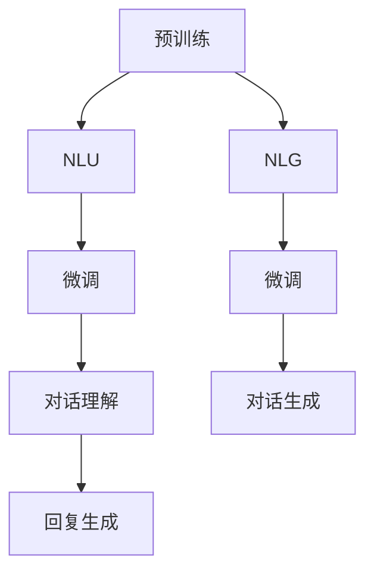

                 

# LLM在智能对话系统中的潜力

> 关键词：大语言模型,对话系统,智能客服,自然语言理解,NLP,机器学习,深度学习

## 1. 背景介绍

在当今数字化社会，智能对话系统已经渗透到各行各业，成为了提升用户体验和效率的重要工具。从传统的客服机器人到智能助手，从语音助手到文字聊天机器人，智能对话系统的应用场景愈发广泛。其中，大语言模型（Large Language Model, LLM）以其强大的自然语言理解能力，成为智能对话系统技术演进的引领者。

### 1.1 问题由来

智能对话系统的核心任务包括自然语言理解（Natural Language Understanding, NLU）和自然语言生成（Natural Language Generation, NLG）。传统对话系统依赖于规则或模板驱动的固定脚本，难以处理复杂多变的用户输入。而大语言模型通过预训练和微调，能够学习通用的语言表示，从而在理解和生成文本方面具备显著优势。

### 1.2 问题核心关键点

大语言模型在智能对话系统中的潜力主要体现在以下几个方面：

- 自然语言理解：通过预训练语言模型，对话系统能够更准确地解析用户输入的意图和情感。
- 自然语言生成：大语言模型可以根据理解到的意图和上下文生成符合逻辑、流畅的回复。
- 跨领域泛化：预训练语言模型经过跨领域泛化，能够应对不同行业、不同领域的对话需求。
- 数据效率：在有限的数据集上，通过微调和大模型迁移学习，能够快速构建高效对话系统。
- 用户互动：大语言模型赋予对话系统更丰富的语言表达能力，提升用户体验。

### 1.3 问题研究意义

研究大语言模型在智能对话系统中的应用，对于提升对话系统性能、降低开发成本、加速行业应用落地具有重要意义：

1. **提升性能**：大语言模型能够处理更加复杂、多样化的用户输入，提供更加准确、个性化的回复。
2. **降低成本**：通过预训练和微调技术，可以快速构建对话系统，减少人工脚本开发和维护成本。
3. **加速落地**：大语言模型的泛化能力使得对话系统能够跨领域、跨平台应用，推动NLP技术在各行业的普及。
4. **丰富互动**：通过大语言模型的自然语言处理能力，对话系统可以更好地理解和响应用户情感和需求，提升用户满意度。

## 2. 核心概念与联系

### 2.1 核心概念概述

大语言模型是一种通过大规模无标签文本数据预训练，然后再通过特定任务上的监督学习（微调）来提升模型性能的深度学习模型。其核心在于自然语言理解（NLU）和自然语言生成（NLG）能力。

- **预训练**：在大规模无标签文本数据上，通过自监督学习任务训练通用语言模型。
- **微调**：在特定任务上，使用少量标注数据进行有监督学习，优化模型性能。
- **自然语言理解（NLU）**：解析用户输入，理解其意图、情感和语境。
- **自然语言生成（NLG）**：根据理解和上下文，生成符合语法和语义规则的文本。

这些核心概念之间的逻辑关系可以通过以下Mermaid流程图来展示：



这个流程图展示了大语言模型在智能对话系统中的核心应用流程：

1. 大语言模型通过预训练学习通用语言表示。
2. 在对话理解阶段，使用NLU技术解析用户输入。
3. 在对话生成阶段，使用NLG技术生成回复。
4. 在微调阶段，针对具体对话任务进行优化。

## 3. 核心算法原理 & 具体操作步骤

### 3.1 算法原理概述

基于大语言模型的智能对话系统，通常分为预训练、微调和对话生成三个阶段：

1. **预训练**：在大规模无标签文本数据上，通过自监督学习任务（如掩码语言模型、自回归预测等）训练通用语言模型。
2. **微调**：在特定对话任务上，使用少量标注数据进行有监督学习，优化模型性能。
3. **对话生成**：根据用户输入和上下文，使用大语言模型生成对话回复。

### 3.2 算法步骤详解

以下是智能对话系统中大语言模型应用的主要步骤：

**Step 1: 数据准备**
- 收集对话数据，包括用户输入、系统回复、上下文信息等。
- 对数据进行清洗、标注和划分，确保数据质量。

**Step 2: 模型选择与微调**
- 选择预训练语言模型（如BERT、GPT等）作为对话系统的基础模型。
- 在对话数据集上进行微调，优化模型在理解意图和生成回复方面的能力。
- 设置微调参数，如学习率、批次大小、迭代次数等。

**Step 3: 对话理解与生成**
- 使用微调后的模型对用户输入进行自然语言理解，解析出意图、情感和上下文信息。
- 根据理解到的信息，使用自然语言生成技术生成回复。
- 对生成的回复进行后处理，如去重、分词、过滤敏感词等。

**Step 4: 系统集成与部署**
- 将对话理解与生成的功能集成到智能对话系统中。
- 部署系统，并进行性能测试和优化。
- 提供API接口，方便系统集成和调用。

### 3.3 算法优缺点

大语言模型在智能对话系统中的优点包括：

- **通用性**：预训练语言模型可以在多种对话场景中应用，提高系统的跨领域泛化能力。
- **灵活性**：通过微调，可以根据特定对话任务优化模型性能。
- **效率**：在少样本情况下，微调能够快速构建高性能对话系统，降低开发成本。
- **效果**：大语言模型在理解和生成方面表现优秀，能够提供高质量的对话体验。

缺点则主要包括：

- **资源需求**：预训练和微调需要大量计算资源和数据，硬件成本较高。
- **模型复杂度**：大语言模型参数量大，推理速度较慢。
- **可解释性**：模型黑盒特性使得理解其内部决策逻辑困难，影响系统信任度。

### 3.4 算法应用领域

大语言模型在智能对话系统中已经被广泛应用于以下领域：

1. **智能客服**：如在线客服机器人、语音客服系统等，能够自动处理常见问题和复杂场景。
2. **虚拟助手**：如个人助理、企业内部助手等，提供个性化、定制化的服务。
3. **翻译**：将对话内容翻译成不同语言，增强跨语言沟通能力。
4. **推荐系统**：根据用户历史对话记录和当前输入，推荐相关产品或服务。
5. **情感分析**：分析用户情感，提供情感支持或干预建议。
6. **游戏聊天**：如游戏内对话、NPC对话等，增强游戏体验。

## 4. 数学模型和公式 & 详细讲解 & 举例说明

### 4.1 数学模型构建

在智能对话系统中，大语言模型通常采用Transformer模型作为基础架构。假定采用Transformer编码器-解码器结构，其数学模型可表示为：

$$
\text{Encoder}(x_i) = \text{Transformer}(x_i; \theta_{\text{enc}})
$$

$$
\text{Decoder}(x_j|x_i) = \text{Transformer}(x_j, \text{Encoder}(x_i); \theta_{\text{dec}})
$$

其中，$x_i$ 为输入序列，$x_j$ 为输出序列，$\theta_{\text{enc}}$ 和 $\theta_{\text{dec}}$ 分别为编码器和解码器的参数。

### 4.2 公式推导过程

以基于Transformer的对话系统为例，推导生成回复的计算过程：

1. **编码器计算**：将用户输入 $x_i$ 通过Transformer编码器进行编码，得到语义表示 $h_i$：

$$
h_i = \text{Transformer}(x_i; \theta_{\text{enc}})
$$

2. **解码器计算**：将编码器输出 $h_i$ 和目标回复 $x_j$ 输入解码器，得到概率分布 $p_j$：

$$
p_j = \text{Transformer}(x_j, h_i; \theta_{\text{dec}})
$$

3. **回复生成**：从概率分布 $p_j$ 中采样生成回复文本 $y_j$：

$$
y_j = \text{argmax}_{y_j} p_j
$$

### 4.3 案例分析与讲解

假设一个智能客服对话场景，用户输入：“我需要预约一下门诊，怎么操作？”。系统首先通过微调的BERT模型对用户意图进行解析，得到意图为“预约门诊”，并从对话历史中提取相关信息。然后，系统使用微调的GPT模型生成回复：“您好，请问您需要预约哪个科室的门诊？”。

## 5. 项目实践：代码实例和详细解释说明

### 5.1 开发环境搭建

开发环境搭建步骤如下：

1. **环境安装**：
   - 安装Python和相关依赖库，如TensorFlow、PyTorch、NLTK等。
   - 安装对话数据集和预训练模型，如对话数据集（如DialoGPT、Meena等）和预训练模型（如BERT、GPT等）。

2. **模型加载**：
   - 使用预训练语言模型（如BERT、GPT等）加载模型。
   - 加载对话数据集，进行清洗和预处理。

### 5.2 源代码详细实现

以下是一个基于GPT模型的对话系统代码示例：

```python
from transformers import GPT2Tokenizer, GPT2LMHeadModel
import torch
import torch.nn as nn
import torch.optim as optim
from torch.utils.data import Dataset, DataLoader

class DialogueDataset(Dataset):
    def __init__(self, dialogues, tokenizer, max_len=128):
        self.tokenizer = tokenizer
        self.dialogues = dialogues
        self.max_len = max_len
        
    def __len__(self):
        return len(self.dialogues)
    
    def __getitem__(self, item):
        dialogue = self.dialogues[item]
        inputs = self.tokenizer(dialogue['input'], return_tensors='pt', max_length=self.max_len, padding='max_length', truncation=True)
        targets = self.tokenizer(dialogue['output'], return_tensors='pt', max_length=self.max_len, padding='max_length', truncation=True)
        return {'input_ids': inputs['input_ids'].flatten(), 
                'attention_mask': inputs['attention_mask'].flatten(),
                'labels': targets['input_ids'].flatten()}

# 加载数据集
tokenizer = GPT2Tokenizer.from_pretrained('gpt2')
dataset = DialogueDataset(dialogue_dataset, tokenizer)

# 加载模型
model = GPT2LMHeadModel.from_pretrained('gpt2')

# 定义损失函数和优化器
criterion = nn.CrossEntropyLoss()
optimizer = optim.AdamW(model.parameters(), lr=1e-5)

# 训练过程
device = torch.device('cuda') if torch.cuda.is_available() else torch.device('cpu')
model.to(device)

for epoch in range(epochs):
    dataloader = DataLoader(dataset, batch_size=32, shuffle=True)
    model.train()
    for batch in dataloader:
        input_ids = batch['input_ids'].to(device)
        attention_mask = batch['attention_mask'].to(device)
        labels = batch['labels'].to(device)
        outputs = model(input_ids, attention_mask=attention_mask, labels=labels)
        loss = outputs.loss
        optimizer.zero_grad()
        loss.backward()
        optimizer.step()

    print(f"Epoch {epoch+1}, loss: {loss:.3f}")

# 测试过程
model.eval()
for batch in dataloader:
    input_ids = batch['input_ids'].to(device)
    attention_mask = batch['attention_mask'].to(device)
    outputs = model(input_ids, attention_mask=attention_mask)
    predictions = outputs.logits.argmax(dim=-1)
    print(f"Prediction: {tokenizer.decode(predictions[0])}")

```

### 5.3 代码解读与分析

该代码示例中，我们首先定义了对话数据集的加载和预处理，然后使用GPT2模型进行训练和推理。代码关键步骤如下：

1. **数据集定义**：定义了DialogueDataset类，用于加载和预处理对话数据。
2. **模型加载**：使用GPT2Tokenizer和GPT2LMHeadModel加载预训练模型和分词器。
3. **损失函数和优化器**：定义了交叉熵损失函数和AdamW优化器。
4. **模型训练**：在训练过程中，使用GPT2模型进行前向传播和反向传播，计算损失并更新模型参数。
5. **模型测试**：在测试过程中，使用模型进行推理，解码生成回复。

## 6. 实际应用场景

### 6.1 智能客服系统

智能客服系统是大语言模型在智能对话系统中的典型应用之一。通过微调的对话模型，可以自动理解用户意图，并提供准确的回复。例如，电子商务平台可以使用智能客服机器人处理订单查询、退换货申请等常见问题，提升客户体验。

### 6.2 虚拟助手

虚拟助手如Apple的Siri、亚马逊的Alexa等，通过微调的对话模型，能够根据用户的语音指令执行各种任务。用户可以通过语音与虚拟助手进行自然对话，实现控制家居、播放音乐、查询信息等功能。

### 6.3 多模态对话系统

多模态对话系统可以同时处理语音和文本输入，支持多语言和多种交互方式。例如，Google的Google Assistant支持自然语言理解和语音识别，能够在对话中自动切换模式，提高用户体验。

### 6.4 未来应用展望

未来，大语言模型在智能对话系统中的应用将更加广泛，主要趋势包括：

1. **跨领域泛化**：预训练语言模型将更加通用，能够适应不同行业和领域的对话需求。
2. **个性化推荐**：结合用户行为数据，智能对话系统能够提供个性化推荐服务，提升用户粘性。
3. **情感计算**：通过分析用户情感，智能对话系统能够提供情感支持或干预建议，增强用户体验。
4. **隐私保护**：在处理用户对话数据时，需要加强隐私保护和数据安全，确保用户信息不被滥用。
5. **交互升级**：引入多模态、情感计算、多语言支持等技术，提升智能对话系统的交互体验和智能化水平。

## 7. 工具和资源推荐

### 7.1 学习资源推荐

以下是推荐的学习资源，帮助开发者掌握大语言模型在智能对话系统中的应用：

1. **《Natural Language Processing with Transformers》**：由Hugging Face团队编写，全面介绍了基于Transformer的NLP技术。
2. **Coursera课程《Sequence Models for Time Series and Sequences》**：由Stanford大学开设，介绍序列模型在时间序列和序列数据上的应用。
3. **PyTorch官方文档**：详细介绍了TensorFlow和PyTorch的使用方法，并提供丰富的样例代码。
4. **Transformers官方文档**：包含大量预训练语言模型和微调范例，是深入学习大语言模型的必备资源。
5. **NLP相关的学术会议和期刊**：如ACL、EMNLP、COLING等，定期发布最新研究成果和进展。

### 7.2 开发工具推荐

大语言模型在智能对话系统中的应用，离不开优秀的开发工具支持。以下是推荐的开发工具：

1. **PyTorch**：基于Python的开源深度学习框架，支持动态计算图和自动微分。
2. **TensorFlow**：由Google开发的深度学习框架，支持分布式计算和GPU加速。
3. **NLTK**：自然语言处理库，提供丰富的NLP功能。
4. **Transformers**：由Hugging Face开发的NLP工具库，集成了多种预训练语言模型。
5. **TensorBoard**：TensorFlow配套的可视化工具，帮助调试和优化模型性能。
6. **Weights & Biases**：实验跟踪工具，记录和可视化模型训练过程，方便对比和调优。

### 7.3 相关论文推荐

以下是推荐的相关论文，帮助深入了解大语言模型在智能对话系统中的应用：

1. **"Attention is All You Need"**：谷歌的研究论文，提出了Transformer结构，开启了预训练大模型的时代。
2. **"BERT: Pre-training of Deep Bidirectional Transformers for Language Understanding"**：谷歌的研究论文，提出了BERT模型，刷新了多项NLP任务SOTA。
3. **"Towards a Unified Text-to-Text Transformer"**：OpenAI的研究论文，提出了T5模型，支持多语言和多种文本生成任务。
4. **"Language Models are Unsupervised Multitask Learners"**：OpenAI的研究论文，展示了大语言模型在zero-shot和few-shot学习方面的能力。
5. **"Rethinking Attention with Self-attention Machines"**：谷歌的研究论文，提出了自注意力机制，提升了Transformer模型的表现。

## 8. 总结：未来发展趋势与挑战

### 8.1 研究成果总结

基于大语言模型的智能对话系统在多个领域已经展现出了强大的应用潜力。通过预训练和微调技术，大语言模型能够理解自然语言，生成流畅的回复，提升用户互动体验。

### 8.2 未来发展趋势

未来，大语言模型在智能对话系统中的应用将更加广泛，主要趋势包括：

1. **跨领域泛化**：预训练语言模型将更加通用，能够适应不同行业和领域的对话需求。
2. **个性化推荐**：结合用户行为数据，智能对话系统能够提供个性化推荐服务，提升用户粘性。
3. **情感计算**：通过分析用户情感，智能对话系统能够提供情感支持或干预建议，增强用户体验。
4. **隐私保护**：在处理用户对话数据时，需要加强隐私保护和数据安全，确保用户信息不被滥用。
5. **交互升级**：引入多模态、情感计算、多语言支持等技术，提升智能对话系统的交互体验和智能化水平。

### 8.3 面临的挑战

尽管大语言模型在智能对话系统中的应用前景广阔，但仍面临以下挑战：

1. **资源需求**：预训练和微调需要大量计算资源和数据，硬件成本较高。
2. **模型复杂度**：大语言模型参数量大，推理速度较慢。
3. **可解释性**：模型黑盒特性使得理解其内部决策逻辑困难，影响系统信任度。

### 8.4 研究展望

为了克服这些挑战，未来的研究需要关注以下几个方向：

1. **模型压缩和优化**：通过模型剪枝、量化等技术，减少参数量，提高推理速度。
2. **小样本学习**：研究如何在大规模无标签数据上训练模型，减少对标注数据的依赖。
3. **多模态融合**：结合视觉、语音等模态信息，提升对话系统的多模态处理能力。
4. **交互优化**：研究如何优化对话系统的交互体验，增强用户满意度。
5. **伦理和安全**：研究如何确保对话系统的伦理和安全，避免有害输出。

总之，大语言模型在智能对话系统中的应用前景广阔，未来需要进一步探索和优化，以应对不断变化的需求和挑战。只有不断创新，才能构建更加智能、高效、安全的对话系统，为用户带来更好的体验。

## 9. 附录：常见问题与解答

### Q1: 大语言模型在智能对话系统中有哪些优点和缺点？

A: 大语言模型在智能对话系统中的优点包括：

- **通用性**：能够处理多种自然语言，适应不同领域的对话需求。
- **灵活性**：通过微调，可以根据特定对话任务优化模型性能。
- **效果**：在理解和生成方面表现优秀，能够提供高质量的对话体验。

缺点主要包括：

- **资源需求**：预训练和微调需要大量计算资源和数据，硬件成本较高。
- **模型复杂度**：参数量大，推理速度较慢。
- **可解释性**：模型黑盒特性使得理解其内部决策逻辑困难，影响系统信任度。

### Q2: 如何在大语言模型中进行对话理解？

A: 对话理解是大语言模型在智能对话系统中的核心任务之一。通常包括以下步骤：

1. **分词和预处理**：将用户输入进行分词和预处理，去除噪声和特殊符号。
2. **编码器计算**：将预处理后的文本输入编码器，得到语义表示。
3. **解码器计算**：使用解码器对语义表示进行处理，解析出意图和情感。
4. **上下文理解**：结合对话历史，理解上下文信息，增强对话理解能力。

### Q3: 如何在大语言模型中进行对话生成？

A: 对话生成是大语言模型在智能对话系统中的另一个核心任务。通常包括以下步骤：

1. **编码器计算**：将用户输入进行编码，得到语义表示。
2. **解码器计算**：使用解码器对语义表示进行处理，生成回复文本。
3. **后处理**：对生成的回复进行后处理，如去重、分词、过滤敏感词等，确保回复质量。

### Q4: 智能对话系统在实际应用中面临哪些挑战？

A: 智能对话系统在实际应用中面临以下挑战：

1. **数据隐私**：对话数据可能涉及用户隐私，需要加强数据保护。
2. **模型泛化**：大语言模型在不同领域和场景中的泛化能力有限，需要进一步优化。
3. **模型效率**：推理速度较慢，需要优化模型结构和计算图。
4. **用户体验**：对话系统的自然语言理解和生成需要进一步提升，以更好地满足用户需求。

总之，智能对话系统在大语言模型中的应用前景广阔，但面临诸多挑战。只有不断优化和创新，才能构建更加智能、高效、安全的对话系统。

