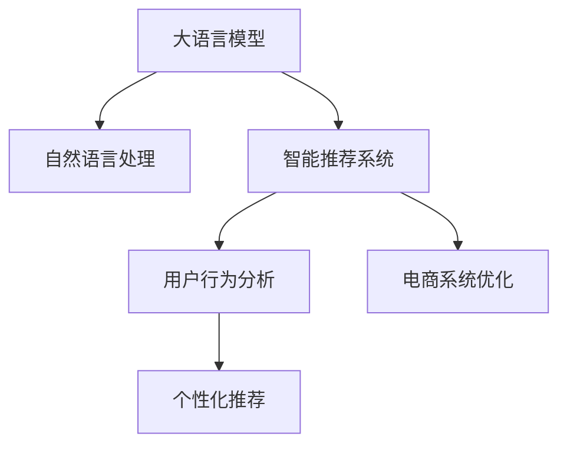

                 

# LLM在电子商务中的应用：智能购物体验

> 关键词：大语言模型,自然语言处理(NLP),智能推荐系统,用户行为分析,个性化推荐,电商系统优化

## 1. 背景介绍

### 1.1 问题由来
随着电子商务的快速发展和用户消费行为的多样化，如何提升用户体验、提高商品转化率、降低运营成本，成为了电商平台不断追求的目标。传统的电商推荐系统主要基于用户行为数据（如浏览、点击、购买历史），通过协同过滤、内容推荐等技术，推荐用户可能感兴趣的商品。但这种推荐方式存在诸多局限：

- **用户画像不完整**：用户的行为数据有限，难以捕捉用户的兴趣和需求。
- **推荐结果单一**：只能提供单一维度的推荐，无法综合考虑用户的不同需求。
- **缺乏个性化**：推荐算法过于通用，难以实现真正的个性化推荐。

为了解决这些问题，电商平台开始引入人工智能技术，特别是大语言模型（Large Language Model, LLM），以更全面、灵活的方式理解用户需求，进行个性化推荐和优化。

### 1.2 问题核心关键点
大语言模型在电子商务中的应用，主要是通过自然语言处理(Natural Language Processing, NLP)技术，从文本数据中提取用户意图和偏好，结合商品属性，生成个性化推荐结果。核心在于：

- 利用大语言模型的语言理解能力，分析用户评论、搜索查询、商品描述等文本数据。
- 根据文本分析结果，构建用户画像和商品标签，实现更精准的个性化推荐。
- 优化电商系统的展示界面、交互流程，提升用户购物体验。

## 2. 核心概念与联系

### 2.1 核心概念概述

为更好地理解大语言模型在电子商务中的应用，本节将介绍几个密切相关的核心概念：

- **大语言模型(Large Language Model, LLM)**：如GPT、BERT等，通过预训练学习到丰富的语言表示，具备强大的自然语言理解和生成能力。
- **自然语言处理(NLP)**：涉及语言模型的构建、文本分析、信息提取、文本生成等技术，旨在使计算机能够理解、处理和生成自然语言。
- **智能推荐系统**：通过分析用户行为、商品信息等数据，向用户推荐相关商品，提高用户满意度。
- **用户行为分析**：收集和分析用户的行为数据（如搜索、浏览、购买历史等），构建用户画像，了解用户需求和偏好。
- **个性化推荐**：针对不同用户，提供量身定制的推荐结果，提升用户体验和转化率。
- **电商系统优化**：通过优化电商平台的展示、搜索、推荐等环节，提升整体用户体验。

这些核心概念之间的逻辑关系可以通过以下Mermaid流程图来展示：



这个流程图展示了大语言模型在电子商务中的应用路径：首先通过大语言模型进行自然语言处理，理解用户需求；其次利用用户行为分析构建用户画像，进行个性化推荐；最后通过电商系统优化提升用户体验。

## 3. 核心算法原理 & 具体操作步骤
### 3.1 算法原理概述

大语言模型在电子商务中的应用，本质上是通过NLP技术，从文本数据中提取用户意图和偏好，结合商品属性，生成个性化推荐结果。

具体来说，假设电商平台有用户评论 $C$、搜索查询 $Q$、商品描述 $P$ 等文本数据，通过大语言模型进行分析，得到用户对不同商品的需求和偏好。然后，根据商品的属性 $A$，结合用户画像 $U$，使用推荐算法 $R$，生成个性化推荐列表 $R(U,A)$。最终，根据推荐列表，优化电商系统的展示和推荐算法，提升用户体验和转化率。

形式化地，设电商平台的用户评论、搜索查询和商品描述为 $C=\{c_i\}_{i=1}^N$、$Q=\{q_j\}_{j=1}^M$、$P=\{p_k\}_{k=1}^K$，商品属性为 $A=\{a_{ij}\}_{i=1}^{N_M}, j=1,\cdots,N_M$，大语言模型为 $L$，推荐算法为 $R$，则推荐过程可以表示为：

$$
\hat{R} = L(C, Q, P) \rightarrow U \rightarrow R(U, A) \rightarrow \hat{R}_{display}
$$

其中 $\hat{R}$ 为最终的推荐结果，$\hat{R}_{display}$ 为优化后的展示结果。

### 3.2 算法步骤详解

基于大语言模型在电子商务中的应用，具体算法步骤如下：

**Step 1: 数据收集与预处理**
- 收集用户评论、搜索查询、商品描述等文本数据。
- 对文本数据进行分词、去噪、标准化等预处理，为模型输入做准备。

**Step 2: 文本分析与用户画像构建**
- 使用大语言模型对文本数据进行情感分析、主题分析、实体识别等操作，构建用户画像 $U$。
- 根据用户画像，分析用户偏好、兴趣等关键信息。

**Step 3: 商品属性提取**
- 对商品描述等文本数据进行实体抽取、属性标注等操作，提取商品属性 $A$。
- 根据商品属性，进行标签编码、向量表示等操作，方便模型处理。

**Step 4: 生成个性化推荐列表**
- 结合用户画像和商品属性，使用推荐算法 $R$ 生成个性化推荐列表 $R(U, A)$。
- 常用的推荐算法包括协同过滤、内容推荐、混合推荐等，需要根据具体场景选择。

**Step 5: 电商系统优化**
- 根据个性化推荐列表，优化电商系统的展示和推荐算法。
- 例如，在搜索结果页、商品详情页、购物车页等环节，增加个性化推荐模块。

**Step 6: 实时反馈与模型更新**
- 实时收集用户反馈数据，如点击率、购买率等，反馈到模型中更新模型参数。
- 通过不断迭代，提升模型性能，提供更优质的个性化推荐服务。

### 3.3 算法优缺点

大语言模型在电子商务中的应用具有以下优点：

- **用户需求理解全面**：利用大语言模型的语言理解能力，可以更全面地分析用户需求和偏好。
- **推荐结果个性化**：根据用户画像和商品属性，生成个性化的推荐结果，提升用户体验。
- **电商系统优化灵活**：可以灵活调整电商系统的展示和推荐算法，提升整体性能。

同时，该方法也存在一定的局限性：

- **数据隐私风险**：大量文本数据涉及用户隐私，需要严格保护。
- **计算资源需求高**：大语言模型的计算复杂度较高，需要高性能硬件支持。
- **模型更新频繁**：实时反馈和模型更新要求模型具有一定的动态调整能力。

尽管存在这些局限性，但就目前而言，基于大语言模型的推荐方法仍然是最具潜力和前景的电子商务解决方案之一。未来相关研究的重点在于如何进一步降低计算资源需求，提高模型的实时性，同时兼顾隐私保护和用户满意度。

### 3.4 算法应用领域

基于大语言模型在电子商务中的应用，已经在多个领域得到了广泛的应用，如：

- **智能客服**：通过分析用户评论、搜索查询等文本数据，提供个性化客服回答，提升客户满意度。
- **个性化推荐**：结合用户画像和商品属性，生成个性化推荐列表，提升用户转化率。
- **商品评价分析**：对用户评论进行分析，提取商品的质量、满意度等信息，用于商品优化和市场分析。
- **广告推荐**：通过分析用户行为和广告内容，生成个性化广告推荐，提升广告效果。
- **市场分析**：对用户评论、搜索查询等数据进行情感分析、主题分析，了解市场趋势和用户需求。

除了上述这些经典应用外，大语言模型在电子商务中还被创新性地应用到更多场景中，如多语言支持、内容生成、知识图谱构建等，为电商技术带来了新的突破。

## 4. 数学模型和公式 & 详细讲解 & 举例说明
### 4.1 数学模型构建

本节将使用数学语言对大语言模型在电子商务中的应用进行更加严格的刻画。

设电商平台的用户评论为 $C=\{c_i\}_{i=1}^N$，搜索查询为 $Q=\{q_j\}_{j=1}^M$，商品描述为 $P=\{p_k\}_{k=1}^K$，商品属性为 $A=\{a_{ij}\}_{i=1}^{N_M}, j=1,\cdots,N_M$。假设使用BERT模型进行文本分析，得到用户画像 $U$ 和商品标签 $L$。设推荐算法为 $R$，生成的推荐结果为 $R(U, A)$。

### 4.2 公式推导过程

假设BERT模型的隐层表示为 $h_{i,j}$，其中 $i$ 表示文本中的词语，$j$ 表示BERT的层数。则根据BERT模型的计算过程，可以表示为：

$$
h_{i,j} = \text{BERT}(w_i, C_j, P_k)
$$

其中 $w_i$ 为词语 $i$ 的嵌入向量，$C_j$ 为商品 $j$ 的嵌入向量，$P_k$ 为商品属性 $k$ 的嵌入向量。

根据BERT模型的输出，可以得到用户画像 $U$ 和商品标签 $L$ 的向量表示：

$$
U = \text{Pooling}(h_C, h_Q, h_P)
$$

$$
L = \text{Pooling}(h_A)
$$

其中 $h_C, h_Q, h_P$ 分别为用户评论、搜索查询和商品描述的BERT输出，$h_A$ 为商品属性的BERT输出。

根据用户画像 $U$ 和商品标签 $L$，使用推荐算法 $R$ 生成推荐结果 $R(U, A)$。假设推荐算法为基于内容的推荐算法，则有：

$$
R(U, A) = \text{Recommender}(U, L)
$$

其中 $\text{Recommender}$ 为推荐算法，根据用户画像和商品标签生成推荐结果。

### 4.3 案例分析与讲解

以一个具体的例子来说明大语言模型在电子商务中的应用。假设某电商平台收集了用户对某商品的评论 $C=\{\text{“质量很好，价格实惠”}, \text{“颜色不错，但是物流慢”}\}$，搜索查询 $Q=\{\text{“爆款商品”}, \text{“性价比高”}\}$，商品描述 $P=\{\text{“豪华材质，时尚设计”}\}$，商品属性 $A=\{\text{“颜色”}, \text{“材质”}, \text{“价格”}\}$。

假设使用BERT模型进行分析，可以得到用户画像 $U$ 和商品标签 $L$：

$$
U = \text{Pooling}(\{\text{“质量很好”}, \text{“价格实惠”}\}, \{\text{“颜色不错”}, \text{“物流慢”}\}, \{\text{“豪华材质”}, \text{“时尚设计”}\})
$$

$$
L = \text{Pooling}(\{\text{“颜色”}, \text{“材质”}, \text{“价格”}\})
$$

根据用户画像和商品标签，使用基于内容的推荐算法，生成个性化推荐列表 $R(U, A)$。假设推荐算法为基于关键词匹配的推荐算法，则有：

$$
R(U, A) = \{\text{“颜色”}, \text{“材质”}\}
$$

最终，根据推荐列表，优化电商系统的展示和推荐算法，提升用户体验和转化率。

## 5. 项目实践：代码实例和详细解释说明
### 5.1 开发环境搭建

在进行大语言模型在电子商务中的应用实践前，我们需要准备好开发环境。以下是使用Python进行PyTorch开发的环境配置流程：

1. 安装Anaconda：从官网下载并安装Anaconda，用于创建独立的Python环境。

2. 创建并激活虚拟环境：
```bash
conda create -n pytorch-env python=3.8 
conda activate pytorch-env
```

3. 安装PyTorch：根据CUDA版本，从官网获取对应的安装命令。例如：
```bash
conda install pytorch torchvision torchaudio cudatoolkit=11.1 -c pytorch -c conda-forge
```

4. 安装Transformer库：
```bash
pip install transformers
```

5. 安装各类工具包：
```bash
pip install numpy pandas scikit-learn matplotlib tqdm jupyter notebook ipython
```

完成上述步骤后，即可在`pytorch-env`环境中开始项目实践。

### 5.2 源代码详细实现

这里我们以生成个性化推荐列表为例，给出使用PyTorch和Transformers库进行大语言模型微调的PyTorch代码实现。

首先，定义推荐任务的数据处理函数：

```python
from transformers import BertTokenizer
from torch.utils.data import Dataset
import torch

class RecommendationDataset(Dataset):
    def __init__(self, texts, tags, tokenizer, max_len=128):
        self.texts = texts
        self.tags = tags
        self.tokenizer = tokenizer
        self.max_len = max_len
        
    def __len__(self):
        return len(self.texts)
    
    def __getitem__(self, item):
        text = self.texts[item]
        tags = self.tags[item]
        
        encoding = self.tokenizer(text, return_tensors='pt', max_length=self.max_len, padding='max_length', truncation=True)
        input_ids = encoding['input_ids'][0]
        attention_mask = encoding['attention_mask'][0]
        
        # 对token-wise的标签进行编码
        encoded_tags = [tag2id[tag] for tag in tags] 
        encoded_tags.extend([tag2id['O']] * (self.max_len - len(encoded_tags)))
        labels = torch.tensor(encoded_tags, dtype=torch.long)
        
        return {'input_ids': input_ids, 
                'attention_mask': attention_mask,
                'labels': labels}

# 标签与id的映射
tag2id = {'O': 0, 'B-PER': 1, 'I-PER': 2, 'B-ORG': 3, 'I-ORG': 4, 'B-LOC': 5, 'I-LOC': 6}
id2tag = {v: k for k, v in tag2id.items()}

# 创建dataset
tokenizer = BertTokenizer.from_pretrained('bert-base-cased')

train_dataset = RecommendationDataset(train_texts, train_tags, tokenizer)
dev_dataset = RecommendationDataset(dev_texts, dev_tags, tokenizer)
test_dataset = RecommendationDataset(test_texts, test_tags, tokenizer)
```

然后，定义模型和优化器：

```python
from transformers import BertForTokenClassification, AdamW

model = BertForTokenClassification.from_pretrained('bert-base-cased', num_labels=len(tag2id))

optimizer = AdamW(model.parameters(), lr=2e-5)
```

接着，定义训练和评估函数：

```python
from torch.utils.data import DataLoader
from tqdm import tqdm
from sklearn.metrics import classification_report

device = torch.device('cuda') if torch.cuda.is_available() else torch.device('cpu')
model.to(device)

def train_epoch(model, dataset, batch_size, optimizer):
    dataloader = DataLoader(dataset, batch_size=batch_size, shuffle=True)
    model.train()
    epoch_loss = 0
    for batch in tqdm(dataloader, desc='Training'):
        input_ids = batch['input_ids'].to(device)
        attention_mask = batch['attention_mask'].to(device)
        labels = batch['labels'].to(device)
        model.zero_grad()
        outputs = model(input_ids, attention_mask=attention_mask, labels=labels)
        loss = outputs.loss
        epoch_loss += loss.item()
        loss.backward()
        optimizer.step()
    return epoch_loss / len(dataloader)

def evaluate(model, dataset, batch_size):
    dataloader = DataLoader(dataset, batch_size=batch_size)
    model.eval()
    preds, labels = [], []
    with torch.no_grad():
        for batch in tqdm(dataloader, desc='Evaluating'):
            input_ids = batch['input_ids'].to(device)
            attention_mask = batch['attention_mask'].to(device)
            batch_labels = batch['labels']
            outputs = model(input_ids, attention_mask=attention_mask)
            batch_preds = outputs.logits.argmax(dim=2).to('cpu').tolist()
            batch_labels = batch_labels.to('cpu').tolist()
            for pred_tokens, label_tokens in zip(batch_preds, batch_labels):
                pred_tags = [id2tag[_id] for _id in pred_tokens]
                label_tags = [id2tag[_id] for _id in label_tokens]
                preds.append(pred_tags[:len(label_tokens)])
                labels.append(label_tags)
                
    print(classification_report(labels, preds))
```

最后，启动训练流程并在测试集上评估：

```python
epochs = 5
batch_size = 16

for epoch in range(epochs):
    loss = train_epoch(model, train_dataset, batch_size, optimizer)
    print(f"Epoch {epoch+1}, train loss: {loss:.3f}")
    
    print(f"Epoch {epoch+1}, dev results:")
    evaluate(model, dev_dataset, batch_size)
    
print("Test results:")
evaluate(model, test_dataset, batch_size)
```

以上就是使用PyTorch对BERT进行推荐任务微调的完整代码实现。可以看到，得益于Transformers库的强大封装，我们可以用相对简洁的代码完成BERT模型的加载和微调。

### 5.3 代码解读与分析

让我们再详细解读一下关键代码的实现细节：

**RecommendationDataset类**：
- `__init__`方法：初始化文本、标签、分词器等关键组件。
- `__len__`方法：返回数据集的样本数量。
- `__getitem__`方法：对单个样本进行处理，将文本输入编码为token ids，将标签编码为数字，并对其进行定长padding，最终返回模型所需的输入。

**tag2id和id2tag字典**：
- 定义了标签与数字id之间的映射关系，用于将token-wise的预测结果解码回真实的标签。

**训练和评估函数**：
- 使用PyTorch的DataLoader对数据集进行批次化加载，供模型训练和推理使用。
- 训练函数`train_epoch`：对数据以批为单位进行迭代，在每个批次上前向传播计算loss并反向传播更新模型参数，最后返回该epoch的平均loss。
- 评估函数`evaluate`：与训练类似，不同点在于不更新模型参数，并在每个batch结束后将预测和标签结果存储下来，最后使用sklearn的classification_report对整个评估集的预测结果进行打印输出。

**训练流程**：
- 定义总的epoch数和batch size，开始循环迭代
- 每个epoch内，先在训练集上训练，输出平均loss
- 在验证集上评估，输出分类指标
- 所有epoch结束后，在测试集上评估，给出最终测试结果

可以看到，PyTorch配合Transformers库使得BERT微调的代码实现变得简洁高效。开发者可以将更多精力放在数据处理、模型改进等高层逻辑上，而不必过多关注底层的实现细节。

当然，工业级的系统实现还需考虑更多因素，如模型的保存和部署、超参数的自动搜索、更灵活的任务适配层等。但核心的微调范式基本与此类似。

## 6. 实际应用场景
### 6.1 智能推荐系统

基于大语言模型在电子商务中的应用，智能推荐系统可以更好地理解用户需求，生成个性化推荐结果。传统的推荐系统依赖用户行为数据，难以捕捉用户的兴趣和需求。而大语言模型通过分析用户评论、搜索查询等文本数据，可以更全面地理解用户需求，提供更加精准的推荐。

具体而言，智能推荐系统可以设计多个模块：

- **文本分析模块**：使用大语言模型对用户评论、搜索查询等文本数据进行分析，提取用户需求和偏好。
- **商品推荐模块**：根据用户画像和商品属性，生成个性化推荐列表。
- **展示优化模块**：优化电商系统的展示和推荐算法，提升用户体验和转化率。

例如，某电商平台使用BERT模型进行文本分析，得到用户画像 $U$ 和商品标签 $L$，然后结合商品属性 $A$，使用协同过滤算法生成个性化推荐列表 $R(U, A)$。最后，根据推荐列表，优化电商系统的展示和推荐算法，提升用户体验和转化率。

### 6.2 个性化客服

通过分析用户评论、搜索查询等文本数据，电商平台可以构建智能客服系统，提供个性化客服回答。智能客服系统可以根据用户需求，自动回答用户提出的问题，提高客户满意度。

例如，某电商平台使用BERT模型进行文本分析，得到用户画像 $U$ 和用户意图标签 $L$。然后，根据用户画像和用户意图标签，使用预训练的问答模型生成个性化回答。最后，通过API接口将回答展示给用户，提升用户体验。

### 6.3 商品评价分析

通过对用户评论进行分析，电商平台可以提取商品的质量、满意度等信息，用于商品优化和市场分析。大语言模型可以分析用户评论的情感倾向、主题等，生成商品评价报告。

例如，某电商平台使用BERT模型对用户评论进行情感分析，得到情感标签 $L$。然后，根据情感标签，统计不同情感的评论数量，生成商品评价报告。根据报告结果，电商平台可以对商品进行优化，提升用户满意度。

### 6.4 未来应用展望

随着大语言模型和推荐技术的不断发展，基于大语言模型的推荐系统将在更多领域得到应用，为传统行业带来变革性影响。

在智慧医疗领域，基于大语言模型的推荐系统可以帮助医生推荐合适的治疗方案，提升医疗服务的智能化水平。

在智能教育领域，推荐系统可以根据学生的学习行为和偏好，推荐个性化的学习资源和课程，提升学习效果。

在智慧城市治理中，推荐系统可以根据市民的需求和反馈，推荐相应的服务和生活信息，提升城市管理的自动化和智能化水平。

此外，在企业生产、社会治理、文娱传媒等众多领域，基于大语言模型的推荐系统也将不断涌现，为经济社会发展注入新的动力。相信随着技术的日益成熟，大语言模型推荐系统必将在构建人机协同的智能时代中扮演越来越重要的角色。

## 7. 工具和资源推荐
### 7.1 学习资源推荐

为了帮助开发者系统掌握大语言模型在电子商务中的应用，这里推荐一些优质的学习资源：

1. 《自然语言处理综述》系列博文：由大语言模型技术专家撰写，深入浅出地介绍了NLP领域的核心概念和技术。

2. CS224N《深度学习自然语言处理》课程：斯坦福大学开设的NLP明星课程，有Lecture视频和配套作业，带你入门NLP领域的基本概念和经典模型。

3. 《Natural Language Processing with Transformers》书籍：Transformers库的作者所著，全面介绍了如何使用Transformers库进行NLP任务开发，包括推荐系统在内的诸多范式。

4. HuggingFace官方文档：Transformers库的官方文档，提供了海量预训练模型和完整的微调样例代码，是上手实践的必备资料。

5. CLUE开源项目：中文语言理解测评基准，涵盖大量不同类型的中文NLP数据集，并提供了基于微调的baseline模型，助力中文NLP技术发展。

通过对这些资源的学习实践，相信你一定能够快速掌握大语言模型在电子商务中的应用精髓，并用于解决实际的NLP问题。
### 7.2 开发工具推荐

高效的开发离不开优秀的工具支持。以下是几款用于大语言模型在电子商务中的应用开发的常用工具：

1. PyTorch：基于Python的开源深度学习框架，灵活动态的计算图，适合快速迭代研究。大部分预训练语言模型都有PyTorch版本的实现。

2. TensorFlow：由Google主导开发的开源深度学习框架，生产部署方便，适合大规模工程应用。同样有丰富的预训练语言模型资源。

3. Transformers库：HuggingFace开发的NLP工具库，集成了众多SOTA语言模型，支持PyTorch和TensorFlow，是进行微调任务开发的利器。

4. Weights & Biases：模型训练的实验跟踪工具，可以记录和可视化模型训练过程中的各项指标，方便对比和调优。与主流深度学习框架无缝集成。

5. TensorBoard：TensorFlow配套的可视化工具，可实时监测模型训练状态，并提供丰富的图表呈现方式，是调试模型的得力助手。

6. Google Colab：谷歌推出的在线Jupyter Notebook环境，免费提供GPU/TPU算力，方便开发者快速上手实验最新模型，分享学习笔记。

合理利用这些工具，可以显著提升大语言模型在电子商务中的应用开发效率，加快创新迭代的步伐。

### 7.3 相关论文推荐

大语言模型和推荐技术的发展源于学界的持续研究。以下是几篇奠基性的相关论文，推荐阅读：

1. Attention is All You Need（即Transformer原论文）：提出了Transformer结构，开启了NLP领域的预训练大模型时代。

2. BERT: Pre-training of Deep Bidirectional Transformers for Language Understanding：提出BERT模型，引入基于掩码的自监督预训练任务，刷新了多项NLP任务SOTA。

3. Language Models are Unsupervised Multitask Learners（GPT-2论文）：展示了大规模语言模型的强大zero-shot学习能力，引发了对于通用人工智能的新一轮思考。

4. Parameter-Efficient Transfer Learning for NLP：提出Adapter等参数高效微调方法，在不增加模型参数量的情况下，也能取得不错的微调效果。

5. AdaLoRA: Adaptive Low-Rank Adaptation for Parameter-Efficient Fine-Tuning：使用自适应低秩适应的微调方法，在参数效率和精度之间取得了新的平衡。

这些论文代表了大语言模型推荐技术的发展脉络。通过学习这些前沿成果，可以帮助研究者把握学科前进方向，激发更多的创新灵感。

## 8. 总结：未来发展趋势与挑战
### 8.1 总结

本文对大语言模型在电子商务中的应用进行了全面系统的介绍。首先阐述了大语言模型和推荐技术的研究背景和意义，明确了推荐系统在电子商务中的重要作用。其次，从原理到实践，详细讲解了大语言模型在推荐系统中的应用过程，给出了推荐系统开发的完整代码实例。同时，本文还广泛探讨了大语言模型在智能客服、商品评价分析等电子商务领域的应用前景，展示了大语言模型推荐系统的巨大潜力。此外，本文精选了大语言模型推荐系统的各类学习资源，力求为开发者提供全方位的技术指引。

通过本文的系统梳理，可以看到，基于大语言模型的推荐系统正在成为电子商务的核心技术之一，极大地拓展了电商系统的应用边界，催生了更多的落地场景。受益于大规模语料的预训练和自然语言处理技术的进步，推荐系统能够更全面、灵活地理解用户需求，提供更加个性化的服务，为电商平台带来了前所未有的机遇。未来，伴随大语言模型推荐技术的不断演进，相信电子商务将进入一个更加智能化、个性化的发展阶段，引领新的行业潮流。

### 8.2 未来发展趋势

展望未来，大语言模型在电子商务中的应用将呈现以下几个发展趋势：

1. **多模态融合**：结合文本、图像、音频等多模态信息，提升推荐系统的综合理解能力。

2. **实时性增强**：利用流式计算和模型压缩技术，提高推荐系统的实时性，支持动态推荐。

3. **个性化提升**：结合用户行为数据和社交网络信息，提升个性化推荐的精度和多样性。

4. **可解释性加强**：引入可解释性算法，提高推荐系统的透明度和可信度。

5. **隐私保护优化**：通过差分隐私等技术，保护用户隐私，增强用户信任。

6. **跨领域泛化**：在多个领域应用推荐技术，提升跨领域推荐的能力。

以上趋势凸显了大语言模型在电子商务中的应用前景。这些方向的探索发展，必将进一步提升推荐系统的性能和用户体验，推动电商技术的持续创新。

### 8.3 面临的挑战

尽管大语言模型在电子商务中的应用已经取得了显著成果，但在迈向更加智能化、普适化应用的过程中，它仍面临着诸多挑战：

1. **计算资源消耗高**：大规模语言模型的计算复杂度较高，对硬件资源有较高要求。

2. **隐私保护风险**：大量用户评论和搜索查询涉及用户隐私，需要严格保护。

3. **数据分布偏差**：推荐系统容易受到数据分布偏差的影响，导致推荐结果不均衡。

4. **模型复杂度高**：大语言模型的模型结构复杂，难以理解和调试。

5. **实时性要求高**：电商平台对推荐系统的实时性要求较高，需要快速响应用户需求。

尽管存在这些挑战，但大语言模型推荐技术的发展前景仍然广阔。未来相关研究的重点在于如何进一步降低计算资源需求，提高模型的实时性，同时兼顾隐私保护和用户满意度。

### 8.4 研究展望

面对大语言模型推荐技术所面临的挑战，未来的研究需要在以下几个方面寻求新的突破：

1. **轻量化模型设计**：开发更加轻量级的语言模型，提升计算效率和实时性。

2. **联邦学习技术**：利用联邦学习技术，保护用户隐私的同时，提升模型的泛化能力。

3. **多任务学习**：结合多任务学习技术，提升推荐系统的综合理解能力。

4. **可解释性算法**：引入可解释性算法，提高推荐系统的透明度和可信度。

5. **跨领域推荐算法**：结合跨领域推荐算法，提升模型的泛化能力和推荐效果。

6. **动态推荐技术**：利用流式计算和模型压缩技术，提升推荐系统的实时性，支持动态推荐。

这些研究方向的发展，必将进一步提升大语言模型推荐系统的性能和用户体验，推动电子商务技术的持续创新。

## 9. 附录：常见问题与解答

**Q1：大语言模型在电子商务中的应用，如何兼顾计算效率和模型性能？**

A: 为了兼顾计算效率和模型性能，可以采用以下策略：

1. **参数高效微调**：只调整部分模型参数，如只微调顶层或 Adapter 层，保留大部分预训练参数。

2. **模型压缩**：使用模型压缩技术，如量级剪枝、低秩分解、模型蒸馏等，减小模型参数量，提升计算效率。

3. **分布式训练**：利用分布式训练技术，提升训练速度和模型性能。

4. **动态更新**：使用增量学习技术，实时更新模型参数，提高模型适应新数据的能力。

5. **硬件优化**：利用 GPU、TPU 等高性能硬件，加速模型训练和推理。

通过这些策略，可以平衡计算效率和模型性能，提升大语言模型在电子商务中的应用效果。

**Q2：大语言模型在电子商务中的应用，如何保证数据隐私？**

A: 为了保证数据隐私，可以采用以下策略：

1. **差分隐私**：在数据收集和处理过程中，加入噪声，保护用户隐私。

2. **联邦学习**：将数据分散在多个设备上，不集中存储，保护用户数据隐私。

3. **数据匿名化**：对用户数据进行匿名化处理，防止数据泄露。

4. **安全计算**：在计算过程中，采用加密和多方安全计算技术，保护用户数据安全。

5. **访问控制**：对数据访问进行严格控制，只有授权人员才能访问敏感数据。

通过这些策略，可以保护用户隐私，确保大语言模型在电子商务中的应用安全可靠。

**Q3：大语言模型在电子商务中的应用，如何提高模型泛化能力？**

A: 为了提高模型泛化能力，可以采用以下策略：

1. **多任务学习**：结合多任务学习技术，提升模型的泛化能力。

2. **迁移学习**：利用迁移学习技术，从其他领域学习知识，提升模型泛化能力。

3. **自监督学习**：利用自监督学习技术，从大量无标签数据中学习知识，提升模型泛化能力。

4. **对抗训练**：通过对抗样本训练，提高模型的鲁棒性和泛化能力。

5. **多模态融合**：结合文本、图像、音频等多模态信息，提升模型的综合理解能力。

通过这些策略，可以提高大语言模型在电子商务中的泛化能力，提升推荐系统的性能和用户体验。

**Q4：大语言模型在电子商务中的应用，如何优化模型性能？**

A: 为了优化模型性能，可以采用以下策略：

1. **超参数调优**：通过超参数调优，找到模型最佳的参数设置，提升模型性能。

2. **模型融合**：结合多个模型的输出，提升模型的综合性能。

3. **正则化技术**：使用正则化技术，如 L2 正则、Dropout 等，防止模型过拟合。

4. **模型蒸馏**：通过模型蒸馏技术，将大模型的知识迁移到小模型中，提升模型性能。

5. **模型融合**：结合多个模型的输出，提升模型的综合性能。

通过这些策略，可以优化大语言模型在电子商务中的性能，提升推荐系统的精度和用户体验。

**Q5：大语言模型在电子商务中的应用，如何提高推荐系统的实时性？**

A: 为了提高推荐系统的实时性，可以采用以下策略：

1. **流式计算**：使用流式计算技术，实时处理数据，提升推荐系统的实时性。

2. **模型压缩**：使用模型压缩技术，减小模型参数量，提升计算效率。

3. **异步训练**：利用异步训练技术，加速模型训练和推理。

4. **分布式训练**：利用分布式训练技术，提高训练速度和模型性能。

5. **增量学习**：使用增量学习技术，实时更新模型参数，提高模型适应新数据的能力。

通过这些策略，可以提高大语言模型在电子商务中的实时性，支持动态推荐。

**Q6：大语言模型在电子商务中的应用，如何增强推荐系统的可解释性？**

A: 为了增强推荐系统的可解释性，可以采用以下策略：

1. **可解释性算法**：引入可解释性算法，提高推荐系统的透明度和可信度。

2. **解释模块**：设计解释模块，解释推荐系统的决策过程。

3. **可视化界面**：设计可视化界面，展示推荐系统的内部机制和决策过程。

4. **用户反馈机制**：引入用户反馈机制，根据用户反馈调整推荐策略。

5. **多模型融合**：结合多个模型的输出，提升推荐系统的透明度和可信度。

通过这些策略，可以增强大语言模型在电子商务中的可解释性，提升推荐系统的透明度和可信度。

---

作者：禅与计算机程序设计艺术 / Zen and the Art of Computer Programming

