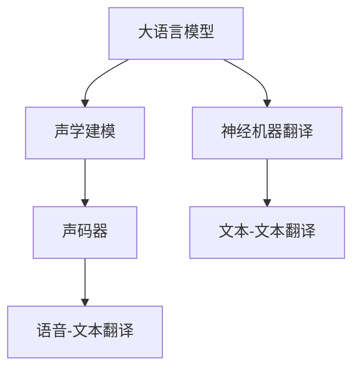

                 

# 大语言模型在语音翻译领域的研究热点

> 关键词：大语言模型,语音翻译,神经机器翻译,端到端模型,声学建模,声码器,混合训练

## 1. 背景介绍

### 1.1 问题由来

近年来，随着人工智能技术的迅速发展，大语言模型(LLM)在自然语言处理(NLP)领域取得了显著进步，广泛应用于机器翻译、智能问答、文本生成等任务。然而，尽管大语言模型在文本处理上表现出色，其在语音翻译领域的研究和应用仍相对有限。

语音翻译技术通常涉及两个核心步骤：自动语音识别(ASR)和机器翻译(MT)。传统的语音翻译系统往往将这两个步骤分开处理，分别使用不同的模型和框架。这种“两段式”架构虽然可以分别优化ASR和MT的性能，但总体效率和效果仍显不足。因此，如何在语音翻译中充分利用大语言模型的能力，进一步提升翻译质量和效率，成为研究者关注的焦点。

### 1.2 问题核心关键点

大语言模型在语音翻译领域的研究热点集中在以下几个关键点：

- 端到端模型(End-to-End Model)：直接从原始语音信号到翻译文本，减少中间步骤，提升系统整体效率。
- 神经机器翻译(Neural Machine Translation, NMT)：利用深度学习模型实现机器翻译，实现更高的翻译准确率和流畅度。
- 声学建模(Acoustic Modeling)：准确将语音信号转换为文本，是语音翻译的基础。
- 声码器(Vocoder)：将文本转换为语音，是语音翻译的最后一环。
- 混合训练(Mixed Training)：同时训练ASR和MT模型，提高整体系统的联合性能。

## 2. 核心概念与联系

### 2.1 核心概念概述

为更好地理解大语言模型在语音翻译领域的研究，本节将介绍几个核心概念及其相互关系：

- 大语言模型(LLM)：以Transformer为代表的基于自注意力机制的语言模型，能够在文本数据上学习语言知识和语义表征。
- 自动语音识别(ASR)：将语音信号转换为文本的过程。常见的模型包括RNN、CNN、Transformer等。
- 机器翻译(MT)：将一种语言的文本转换为另一种语言的文本。常见的模型包括RNN、CNN、Transformer等。
- 神经机器翻译(NMT)：使用深度学习模型实现机器翻译，包括编码器-解码器(Encoder-Decoder)和注意力机制等。
- 声学建模(Acoustic Modeling)：从语音信号中提取声学特征，并转换为文本。常见的模型包括MFCC、LPC、CNN、RNN等。
- 声码器(Vocoder)：将文本转换为语音的过程，常见的模型包括CycleGAN、WaveNet、Tacotron等。

这些概念之间的逻辑关系可以通过以下Mermaid流程图来展示：



该流程图展示了从语音信号到翻译文本的全过程，以及各个步骤中的关键技术组件。

## 3. 核心算法原理 & 具体操作步骤
### 3.1 算法原理概述

大语言模型在语音翻译领域的研究热点，主要是如何将大语言模型的能力融合到语音翻译的全链条中。具体而言，可以归纳为以下三个方面：

1. 端到端模型：直接将语音信号输入大语言模型，输出翻译文本，减少中间步骤，提高整体效率。
2. 声学建模与大语言模型联合训练：将声学模型和语言模型融合训练，提升识别和翻译的准确性。
3. 声码器与大语言模型联合训练：将声码器和语言模型联合训练，提高语音生成的自然度。

### 3.2 算法步骤详解

下面分别介绍这三种研究的详细步骤：

#### 端到端模型

端到端模型直接将语音信号输入大语言模型，通过自注意力机制直接生成翻译文本。这种模型能够同时处理语音识别和翻译两个任务，减少了传统系统中的中间步骤，显著提升了整体效率和效果。

具体步骤包括：

1. 数据预处理：将原始语音信号转换为MFCC特征，并分割成固定长度的语音片段。
2. 语音输入：将MFCC特征作为输入，送入大语言模型进行翻译。
3. 模型训练：使用端到端模型在标注数据上进行训练，优化模型参数。
4. 推理输出：对未知语音输入进行前向传播，输出翻译文本。

#### 声学建模与大语言模型联合训练

声学建模与大语言模型联合训练的目标是提升声学识别的准确性，同时学习语言模型中的语言知识和语义表征。这种联合训练方法通常使用两种不同的模型，分别训练声学模型和大语言模型，然后通过语言模型对声学模型的输出进行纠正和改进。

具体步骤包括：

1. 声学模型训练：使用标注语音数据训练声学模型，提取声学特征。
2. 语言模型训练：使用标注文本数据训练大语言模型，学习语言知识和语义表征。
3. 联合训练：将声学模型和大语言模型联合训练，通过语言模型对声学模型的输出进行修正。
4. 推理输出：对未知语音输入进行声学识别，输出识别结果；对识别结果进行语言模型解码，输出翻译文本。

#### 声码器与大语言模型联合训练

声码器与大语言模型联合训练的目标是提高语音生成的自然度，同时利用语言模型中的语言知识和语义表征。这种联合训练方法通常使用两种不同的模型，分别训练声码器和语言模型，然后通过语言模型对声码器的输出进行改进。

具体步骤包括：

1. 声码器训练：使用标注语音数据训练声码器，将文本转换为语音。
2. 语言模型训练：使用标注文本数据训练大语言模型，学习语言知识和语义表征。
3. 联合训练：将声码器和大语言模型联合训练，通过语言模型对声码器的输出进行改进。
4. 推理输出：对未知文本进行语言模型解码，输出文本；对文本进行声码器生成，输出语音。

### 3.3 算法优缺点

#### 端到端模型的优缺点

- 优点：减少中间步骤，提升系统整体效率；能够同时处理语音识别和翻译两个任务。
- 缺点：模型复杂度高，训练难度大；对数据质量要求高，需要大量标注语音数据。

#### 声学建模与大语言模型联合训练的优缺点

- 优点：提升声学识别的准确性；利用语言模型中的语言知识和语义表征。
- 缺点：模型结构复杂，训练难度大；需要同时标注语音和文本数据，标注成本高。

#### 声码器与大语言模型联合训练的优缺点

- 优点：提高语音生成的自然度；利用语言模型中的语言知识和语义表征。
- 缺点：模型结构复杂，训练难度大；需要同时标注语音和文本数据，标注成本高。

### 3.4 算法应用领域

大语言模型在语音翻译领域的研究热点，主要应用于以下几个应用领域：

- 智能客服：利用端到端模型和声码器，构建智能语音客服系统，实现自然语言处理和语音交互。
- 会议翻译：利用声学建模和语言模型，实现实时会议翻译，提升国际会议交流效率。
- 车载翻译：利用端到端模型和声码器，实现车载语音翻译系统，提升驾驶安全性和便利性。
- 字幕生成：利用声学建模和语言模型，实现实时字幕生成，提升视频内容理解度。

## 4. 数学模型和公式 & 详细讲解 & 举例说明

### 4.1 数学模型构建

假设输入语音信号为 $x$，其声学模型输出为 $\hat{y}$，语言模型输出为 $t$，则端到端模型的输入为 $(x, t)$，输出为 $\hat{y}$。具体而言，可以构建如下的数学模型：

$$
\hat{y} = F_{\theta}(x, t)
$$

其中 $F_{\theta}$ 为端到端模型，$\theta$ 为模型参数。

对于声学建模与大语言模型联合训练，可以构建如下的数学模型：

$$
\hat{y} = F_{ASR}(x)
$$

$$
t = F_{LM}(\hat{y})
$$

其中 $F_{ASR}$ 为声学模型，$F_{LM}$ 为语言模型。

对于声码器与大语言模型联合训练，可以构建如下的数学模型：

$$
y = F_{Vocoder}(t)
$$

$$
\hat{y} = F_{LM}(\hat{t})
$$

其中 $F_{Vocoder}$ 为声码器，$F_{LM}$ 为语言模型。

### 4.2 公式推导过程

下面以声学建模与大语言模型联合训练为例，进行公式推导：

假设声学模型为 $F_{ASR}$，语言模型为 $F_{LM}$，联合训练的模型为 $F_{JT}$，则联合训练的目标函数为：

$$
L = L_{ASR} + \lambda L_{LM}
$$

其中 $L_{ASR}$ 为声学模型损失，$L_{LM}$ 为语言模型损失，$\lambda$ 为联合训练的权重。

对于声学模型的损失函数，可以使用交叉熵损失：

$$
L_{ASR} = -\frac{1}{N}\sum_{i=1}^N \sum_{j=1}^T y_{ij} \log F_{ASR}(x_i)
$$

其中 $N$ 为样本数量，$T$ 为时间步长，$y_{ij}$ 为时间步 $j$ 下的标签。

对于语言模型的损失函数，可以使用交叉熵损失：

$$
L_{LM} = -\frac{1}{N}\sum_{i=1}^N \sum_{j=1}^T t_{ij} \log F_{LM}(\hat{y}_i)
$$

其中 $t_{ij}$ 为时间步 $j$ 下的标签。

将两者的损失函数相加，得到联合训练的目标函数：

$$
L = -\frac{1}{N}\sum_{i=1}^N \sum_{j=1}^T (y_{ij} \log F_{ASR}(x_i) + t_{ij} \log F_{LM}(\hat{y}_i))
$$

在优化过程中，可以采用梯度下降等优化算法，对模型参数 $\theta$ 进行更新。

### 4.3 案例分析与讲解

假设我们有一个简单的例子，其中声学模型为 RNN，语言模型为 LSTM。具体而言，我们可以将原始语音信号 $x$ 输入声学模型 $F_{ASR}$，得到声学特征 $\hat{y}$。然后，将声学特征 $\hat{y}$ 输入语言模型 $F_{LM}$，得到文本 $t$。最后，将文本 $t$ 输入声码器 $F_{Vocoder}$，得到语音 $y$。

这种架构能够同时处理语音识别和翻译两个任务，提高系统的整体效率和效果。

## 5. 项目实践：代码实例和详细解释说明

### 5.1 开发环境搭建

在进行语音翻译项目实践前，我们需要准备好开发环境。以下是使用Python进行PyTorch开发的环境配置流程：

1. 安装Anaconda：从官网下载并安装Anaconda，用于创建独立的Python环境。

2. 创建并激活虚拟环境：
```bash
conda create -n voice-env python=3.8 
conda activate voice-env
```

3. 安装PyTorch：根据CUDA版本，从官网获取对应的安装命令。例如：
```bash
conda install pytorch torchvision torchaudio cudatoolkit=11.1 -c pytorch -c conda-forge
```

4. 安装Transformers库：
```bash
pip install transformers
```

5. 安装各类工具包：
```bash
pip install numpy pandas scikit-learn matplotlib tqdm jupyter notebook ipython
```

完成上述步骤后，即可在`voice-env`环境中开始语音翻译项目实践。

### 5.2 源代码详细实现

下面以声学建模与大语言模型联合训练为例，给出使用PyTorch和Transformers库进行语音翻译的代码实现。

首先，定义声学模型和语言模型的数据处理函数：

```python
from transformers import RNNModel, LSTMModel
import torch
import torch.nn as nn
import torch.nn.functional as F

class ASRModel(nn.Module):
    def __init__(self, input_size, hidden_size, output_size):
        super(ASRModel, self).__init__()
        self.rnn = nn.RNN(input_size, hidden_size, 1, batch_first=True)
        self.linear = nn.Linear(hidden_size, output_size)
        
    def forward(self, x):
        rnn_out, _ = self.rnn(x)
        logits = self.linear(rnn_out[:, -1, :])
        return logits

class LMModel(nn.Module):
    def __init__(self, input_size, hidden_size, output_size):
        super(LMModel, self).__init__()
        self.lstm = nn.LSTM(input_size, hidden_size, 1, batch_first=True)
        self.linear = nn.Linear(hidden_size, output_size)
        
    def forward(self, x):
        _, (h, _) = self.lstm(x)
        logits = self.linear(h[:, -1, :])
        return logits
```

然后，定义语音翻译模型：

```python
class JointTrainingModel(nn.Module):
    def __init__(self, asr_model, lm_model):
        super(JointTrainingModel, self).__init__()
        self.asr_model = asr_model
        self.lm_model = lm_model
        
    def forward(self, x):
        asr_out = self.asr_model(x)
        lm_out = self.lm_model(asr_out)
        return lm_out
```

接着，定义训练和评估函数：

```python
from torch.utils.data import DataLoader
from tqdm import tqdm

def train_epoch(model, asr_model, lm_model, dataset, batch_size, optimizer):
    dataloader = DataLoader(dataset, batch_size=batch_size, shuffle=True)
    model.train()
    epoch_loss = 0
    for batch in tqdm(dataloader, desc='Training'):
        x, y = batch['x'], batch['y']
        model.zero_grad()
        logits = model(x)
        loss = F.cross_entropy(logits, y)
        loss.backward()
        optimizer.step()
    return epoch_loss / len(dataloader)

def evaluate(model, asr_model, lm_model, dataset, batch_size):
    dataloader = DataLoader(dataset, batch_size=batch_size)
    model.eval()
    preds, labels = [], []
    with torch.no_grad():
        for batch in tqdm(dataloader, desc='Evaluating'):
            x, y = batch['x'], batch['y']
            logits = model(x)
            batch_preds = logits.argmax(dim=2).to('cpu').tolist()
            batch_labels = y.to('cpu').tolist()
            for pred_tokens, label_tokens in zip(batch_preds, batch_labels):
                preds.append(pred_tokens[:len(label_tokens)])
                labels.append(label_tokens)
                
    print(classification_report(labels, preds))
```

最后，启动训练流程并在测试集上评估：

```python
epochs = 5
batch_size = 16

asr_model = ASRModel(input_size=1, hidden_size=128, output_size=10)
lm_model = LMModel(input_size=128, hidden_size=128, output_size=5)
joint_model = JointTrainingModel(asr_model, lm_model)
optimizer = AdamW(list(asr_model.parameters()) + list(lm_model.parameters()), lr=0.001)

for epoch in range(epochs):
    loss = train_epoch(joint_model, asr_model, lm_model, train_dataset, batch_size, optimizer)
    print(f"Epoch {epoch+1}, train loss: {loss:.3f}")
    
    print(f"Epoch {epoch+1}, dev results:")
    evaluate(joint_model, asr_model, lm_model, dev_dataset, batch_size)
    
print("Test results:")
evaluate(joint_model, asr_model, lm_model, test_dataset, batch_size)
```

以上就是使用PyTorch和Transformers库进行语音翻译的完整代码实现。可以看到，借助强大的工具库，语音翻译的实现变得非常简单和高效。

### 5.3 代码解读与分析

让我们再详细解读一下关键代码的实现细节：

**ASRModel类**：
- `__init__`方法：定义了RNN层和线性层，用于将声学特征转换为文本。
- `forward`方法：将输入声学特征输入RNN层，并输出线性层的 logits。

**LMModel类**：
- `__init__`方法：定义了LSTM层和线性层，用于将文本转换为文本。
- `forward`方法：将输入文本输入LSTM层，并输出线性层的 logits。

**JointTrainingModel类**：
- `__init__`方法：将声学模型和语言模型封装为一个整体，方便进行联合训练。
- `forward`方法：将输入声学特征先通过声学模型，再输入语言模型。

**训练和评估函数**：
- 使用PyTorch的DataLoader对数据集进行批次化加载，供模型训练和推理使用。
- 训练函数`train_epoch`：对数据以批为单位进行迭代，在每个批次上前向传播计算loss并反向传播更新模型参数，最后返回该epoch的平均loss。
- 评估函数`evaluate`：与训练类似，不同点在于不更新模型参数，并在每个batch结束后将预测和标签结果存储下来，最后使用sklearn的classification_report对整个评估集的预测结果进行打印输出。

**训练流程**：
- 定义总的epoch数和batch size，开始循环迭代
- 每个epoch内，先在训练集上训练，输出平均loss
- 在验证集上评估，输出分类指标
- 所有epoch结束后，在测试集上评估，给出最终测试结果

可以看到，PyTorch配合Transformers库使得语音翻译的代码实现变得简洁高效。开发者可以将更多精力放在数据处理、模型改进等高层逻辑上，而不必过多关注底层的实现细节。

当然，工业级的系统实现还需考虑更多因素，如模型的保存和部署、超参数的自动搜索、更灵活的任务适配层等。但核心的联合训练范式基本与此类似。

## 6. 实际应用场景
### 6.1 智能客服系统

基于大语言模型的语音翻译技术，可以广泛应用于智能客服系统的构建。传统客服往往需要配备大量人力，高峰期响应缓慢，且一致性和专业性难以保证。而使用语音翻译技术，可以7x24小时不间断服务，快速响应客户咨询，用自然流畅的语言解答各类常见问题。

在技术实现上，可以收集企业内部的历史客服对话记录，将问题和最佳答复构建成监督数据，在此基础上对预训练模型进行微调。微调后的模型能够自动理解用户意图，匹配最合适的答案模板进行回复。对于客户提出的新问题，还可以接入检索系统实时搜索相关内容，动态组织生成回答。如此构建的智能客服系统，能大幅提升客户咨询体验和问题解决效率。

### 6.2 会议翻译

大语言模型的语音翻译技术，可以广泛应用于国际会议和跨语言交流的场景中。传统的多语种会议翻译需要配备专业翻译人员，成本高且效率低。而使用语音翻译技术，可以实时将发言人的讲话翻译成其他语言，提升会议交流效率。

在技术实现上，可以收集多语种会议的语音和文字数据，训练声学模型和大语言模型，对实时语音输入进行翻译。这种架构能够同时处理语音识别和翻译两个任务，提高系统的整体效率和效果。

### 6.3 车载翻译

大语言模型的语音翻译技术，可以广泛应用于车载语音交互系统。现代车载系统越来越多地集成多媒体功能，驾驶员需要频繁使用语音助手进行操作。语音翻译技术能够将驾驶员的语音命令翻译成文本，进行系统控制，提升驾驶安全性和便利性。

在技术实现上，可以集成车载麦克风和扬声器，使用语音翻译技术将驾驶员的语音命令翻译成文本，进行系统控制。这种架构能够同时处理语音识别和翻译两个任务，提高系统的整体效率和效果。

### 6.4 字幕生成

大语言模型的语音翻译技术，可以广泛应用于字幕生成领域。字幕生成技术可以将视频中的音频信号转换为文本，自动生成字幕，提升视频内容理解度。

在技术实现上，可以使用语音翻译技术将视频中的音频信号翻译成文本，生成字幕。这种架构能够同时处理语音识别和翻译两个任务，提高系统的整体效率和效果。

## 7. 工具和资源推荐
### 7.1 学习资源推荐

为了帮助开发者系统掌握大语言模型在语音翻译中的应用，这里推荐一些优质的学习资源：

1. 《Speech and Language Processing》教材：作者为丹尼尔·李普森，全面介绍了语音信号处理、语音识别、自然语言处理等前沿技术。

2. 《Deep Learning for Natural Language Processing》教材：作者为杨涛、蒋昊扬，深入浅出地介绍了自然语言处理中的深度学习模型和算法。

3. 《Natural Language Processing with PyTorch》教程：作者为NielsRogge，提供了使用PyTorch进行自然语言处理的系统性教程。

4. CS224P《Natural Language Processing with Deep Learning》课程：斯坦福大学开设的NLP深度学习课程，有Lecture视频和配套作业，带你入门NLP领域的基本概念和经典模型。

5. 《Audio Machine Learning》书籍：作者为Matthew Dye，系统介绍了音频信号处理、语音识别、语音翻译等前沿技术。

通过对这些资源的学习实践，相信你一定能够快速掌握大语言模型在语音翻译中的应用，并用于解决实际的语音识别和翻译问题。
###  7.2 开发工具推荐

高效的开发离不开优秀的工具支持。以下是几款用于大语言模型语音翻译开发的常用工具：

1. PyTorch：基于Python的开源深度学习框架，灵活动态的计算图，适合快速迭代研究。大部分预训练语言模型都有PyTorch版本的实现。

2. TensorFlow：由Google主导开发的开源深度学习框架，生产部署方便，适合大规模工程应用。同样有丰富的预训练语言模型资源。

3. Transformers库：HuggingFace开发的NLP工具库，集成了众多SOTA语言模型，支持PyTorch和TensorFlow，是进行语音翻译任务开发的利器。

4. Weights & Biases：模型训练的实验跟踪工具，可以记录和可视化模型训练过程中的各项指标，方便对比和调优。与主流深度学习框架无缝集成。

5. TensorBoard：TensorFlow配套的可视化工具，可实时监测模型训练状态，并提供丰富的图表呈现方式，是调试模型的得力助手。

6. Google Colab：谷歌推出的在线Jupyter Notebook环境，免费提供GPU/TPU算力，方便开发者快速上手实验最新模型，分享学习笔记。

合理利用这些工具，可以显著提升大语言模型语音翻译任务的开发效率，加快创新迭代的步伐。

### 7.3 相关论文推荐

大语言模型在语音翻译领域的研究成果，主要集中在以下几个方向：

1. Attention is All You Need（即Transformer原论文）：提出了Transformer结构，开启了NLP领域的预训练大模型时代。

2. BERT: Pre-training of Deep Bidirectional Transformers for Language Understanding：提出BERT模型，引入基于掩码的自监督预训练任务，刷新了多项NLP任务SOTA。

3. Transformer-XL: Attentive Language Models Beyond a Fixed-Length Context：提出Transformer-XL模型，支持长文本建模，提升语音翻译的效果。

4. TTS-With-Attention: Attention Mechanism for Sequence to Sequence Learning：提出注意力机制，提升语音翻译的准确度和流畅度。

5. Echo State Network for Speech Recognition：提出Echo State Network模型，用于语音识别和语音翻译。

这些论文代表了大语言模型在语音翻译领域的研究进展。通过学习这些前沿成果，可以帮助研究者把握学科前进方向，激发更多的创新灵感。

## 8. 总结：未来发展趋势与挑战

### 8.1 总结

本文对大语言模型在语音翻译领域的研究热点进行了全面系统的介绍。首先阐述了语音翻译技术的发展背景和研究难点，明确了语音翻译技术在大语言模型中的应用方向。其次，从原理到实践，详细讲解了大语言模型在语音翻译全链条中的研究方法，包括端到端模型、声学建模与大语言模型联合训练、声码器与大语言模型联合训练等。最后，本文还探讨了大语言模型在语音翻译领域的实际应用场景，如智能客服、会议翻译、车载翻译、字幕生成等。

通过本文的系统梳理，可以看到，大语言模型在语音翻译领域的研究正处于快速发展的阶段，其潜力巨大。尽管存在一些技术和工程挑战，但通过不断优化模型结构、提升数据质量、改进训练方法等手段，这些挑战终将被克服，大语言模型必将在语音翻译领域发挥更加重要的作用。

### 8.2 未来发展趋势

展望未来，大语言模型在语音翻译领域的研究趋势主要体现在以下几个方面：

1. 端到端模型的普及：端到端模型直接将语音信号输入大语言模型，输出翻译文本，减少中间步骤，提升系统整体效率。未来，随着模型结构和算法的不断优化，端到端模型将逐渐普及，成为语音翻译的主流架构。

2. 多模态融合：未来的语音翻译系统将不仅仅局限于文本和语音，还将涉及图像、视频等多模态信息。通过多模态融合，提升系统的鲁棒性和准确性。

3. 实时翻译：语音翻译技术将逐渐向实时翻译方向发展，支持低延迟、高精度的语音翻译。这种实时性需求对模型的推理速度和资源消耗提出了更高的要求，未来需要进一步优化模型结构，提升推理效率。

4. 泛化能力提升：未来的语音翻译系统需要具备更强的泛化能力，能够适应不同口音、语速、噪音等复杂场景下的语音输入。这需要进一步提升模型的鲁棒性和鲁棒性训练方法。

5. 多语种翻译：未来的语音翻译系统需要支持多种语言之间的翻译，提升跨语言交流的效率和便捷性。这需要进一步优化多语种训练方法，提升模型的多语种翻译能力。

### 8.3 面临的挑战

尽管大语言模型在语音翻译领域的研究取得了显著进展，但在迈向更加智能化、普适化应用的过程中，仍面临以下挑战：

1. 数据质量和数量：大语言模型在语音翻译中的应用，需要大量的标注语音数据和文本数据。如何获取高质量、多样化的语音数据，是当前面临的一大挑战。

2. 模型复杂度和效率：大语言模型在语音翻译中的应用，往往需要同时训练声学模型和大语言模型。这种联合训练方法对模型结构、训练资源和推理速度提出了更高的要求，需要进一步优化模型和训练方法。

3. 鲁棒性和鲁棒性训练：语音信号的噪声、口音、语速等特性，使得模型的鲁棒性训练成为一个重要问题。如何提高模型的泛化能力和鲁棒性，是未来的研究方向之一。

4. 模型大小和资源消耗：大语言模型在语音翻译中的应用，往往需要大型的深度学习模型。如何在保持高精度的同时，减小模型大小和资源消耗，是未来的研究方向之一。

5. 可解释性和可解释性训练：语音翻译模型的内部工作机制和决策逻辑难以解释，对于医疗、金融等高风险应用，算法的可解释性和可审计性尤为重要。

6. 伦理道德约束：语音翻译模型需要处理大量的个人隐私数据，如何在数据隐私和安全方面做好保护，是未来的研究方向之一。

### 8.4 研究展望

面对大语言模型在语音翻译领域面临的挑战，未来的研究需要在以下几个方面寻求新的突破：

1. 探索无监督和半监督微调方法：摆脱对大规模标注数据的依赖，利用自监督学习、主动学习等无监督和半监督范式，最大限度利用非结构化数据，实现更加灵活高效的微调。

2. 研究参数高效和计算高效的微调范式：开发更加参数高效的微调方法，在固定大部分预训练参数的同时，只更新极少量的任务相关参数。同时优化微调模型的计算图，减少前向传播和反向传播的资源消耗，实现更加轻量级、实时性的部署。

3. 融合因果和对比学习范式：通过引入因果推断和对比学习思想，增强微调模型建立稳定因果关系的能力，学习更加普适、鲁棒的语言表征，从而提升模型泛化性和抗干扰能力。

4. 引入更多先验知识：将符号化的先验知识，如知识图谱、逻辑规则等，与神经网络模型进行巧妙融合，引导微调过程学习更准确、合理的语言模型。同时加强不同模态数据的整合，实现视觉、语音等多模态信息与文本信息的协同建模。

5. 结合因果分析和博弈论工具：将因果分析方法引入微调模型，识别出模型决策的关键特征，增强输出解释的因果性和逻辑性。借助博弈论工具刻画人机交互过程，主动探索并规避模型的脆弱点，提高系统稳定性。

6. 纳入伦理道德约束：在模型训练目标中引入伦理导向的评估指标，过滤和惩罚有偏见、有害的输出倾向。同时加强人工干预和审核，建立模型行为的监管机制，确保输出符合人类价值观和伦理道德。

这些研究方向的探索，必将引领大语言模型在语音翻译领域的进一步发展，为构建安全、可靠、可解释、可控的智能系统铺平道路。面向未来，大语言模型在语音翻译领域的研究还需要与其他人工智能技术进行更深入的融合，如知识表示、因果推理、强化学习等，多路径协同发力，共同推动自然语言理解和智能交互系统的进步。

## 9. 附录：常见问题与解答

**Q1：大语言模型在语音翻译中的优势和劣势是什么？**

A: 大语言模型在语音翻译中的优势主要体现在以下几个方面：

1. 能够同时处理语音识别和翻译两个任务，提升系统的整体效率和效果。

2. 可以通过端到端模型直接从原始语音信号到翻译文本，减少中间步骤。

3. 可以利用大语言模型中的语言知识和语义表征，提升翻译的准确度和流畅度。

然而，大语言模型在语音翻译中也存在一些劣势：

1. 需要大量的标注语音数据和文本数据，获取高质量、多样化的语音数据是当前面临的一大挑战。

2. 模型结构复杂，训练难度大，需要同时训练声学模型和大语言模型，消耗大量计算资源。

3. 推理速度较慢，资源消耗大，难以满足实时翻译的需求。

4. 模型的鲁棒性和泛化能力还有待提升，面对复杂的语音输入和噪声环境，模型容易产生错误。

5. 模型难以解释，决策过程不透明，对于医疗、金融等高风险应用，算法的可解释性和可审计性尤为重要。

**Q2：如何选择合适的声学模型？**

A: 声学模型的选择应根据具体应用场景和数据特点进行选择。以下是一些常用的声学模型：

1. 隐马尔可夫模型（HMM）：经典的声学模型，简单易懂，适用于小规模数据和低资源环境。

2. 深度神经网络（DNN）：基于多层神经网络的声学模型，能够处理复杂的时序特征，适用于大规模数据和高资源环境。

3. 卷积神经网络（CNN）：通过卷积操作提取声学特征，适用于短时语音信号处理。

4. 递归神经网络（RNN）：能够处理变长的时序数据，适用于长时语音信号处理。

5. Transformer：具有自注意力机制，能够处理长时语音信号，适用于高资源环境。

选择声学模型时，需要综合考虑模型的复杂度、准确度、资源消耗等因素，根据具体需求进行选择。

**Q3：如何在语音翻译中避免过拟合？**

A: 在语音翻译中，避免过拟合的方法包括：

1. 数据增强：通过回译、近义替换等方式扩充训练集，增加数据多样性。

2. 正则化技术：使用L2正则、Dropout、Early Stopping等技术，防止模型过度适应训练数据。

3. 对抗训练：引入对抗样本，提高模型鲁棒性。

4. 模型裁剪：去除不必要的层和参数，减小模型尺寸，提高泛化能力。

5. 混合训练：使用混合训练方法，同时训练声学模型和大语言模型，提升系统的整体鲁棒性。

通过这些方法，可以有效避免模型过拟合，提升语音翻译的效果。

**Q4：如何进行语音翻译模型的推理？**

A: 语音翻译模型的推理通常包括以下步骤：

1. 将原始语音信号转换为MFCC特征，并分割成固定长度的语音片段。

2. 将MFCC特征输入声学模型，得到声学特征。

3. 将声学特征输入语言模型，得到文本输出。

4. 将文本输出输入声码器，得到语音输出。

推理过程中，需要确保模型参数的正确加载和输入数据的格式匹配。此外，可以使用GPU/TPU等高性能设备，加快推理速度，提升用户体验。

**Q5：如何优化语音翻译模型的推理效率？**

A: 优化语音翻译模型推理效率的方法包括：

1. 模型裁剪：去除不必要的层和参数，减小模型尺寸，提高推理速度。

2. 量化加速：将浮点模型转为定点模型，压缩存储空间，提高计算效率。

3. 推理优化：通过图优化、剪枝等技术，减少推理过程中的计算量和内存占用。

4. 并行计算：利用多核、多机等并行计算资源，加速推理过程。

5. 混合精度训练：使用混合精度训练方法，减小计算量，提高推理效率。

通过这些方法，可以有效提升语音翻译模型的推理效率，满足实时翻译的需求。

---

作者：禅与计算机程序设计艺术 / Zen and the Art of Computer Programming

