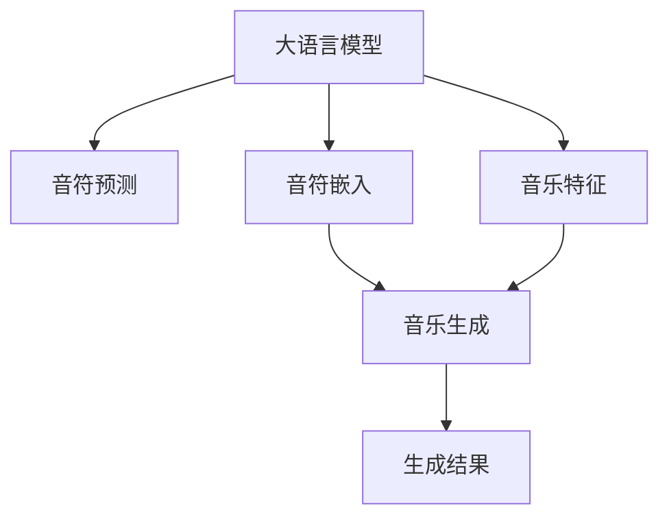

                 

# LLM在音乐生成任务上的尝试分析

> 关键词：大语言模型(LLM), 音乐生成, 序列生成模型, 音符预测, 词嵌入, 多模态学习, 神经网络, 时间序列, 预训练

## 1. 背景介绍

### 1.1 问题由来
随着人工智能技术的不断进步，大语言模型(LLM)在处理文本信息方面取得了显著的成就。然而，音乐作为一种非文本信息，其生成任务对模型的要求与文本生成任务有显著差异。传统的音乐生成模型通常依赖于音乐符号的序列建模，而LLM如何有效应用于音乐生成，仍然是一个有待探索的问题。

### 1.2 问题核心关键点
本研究聚焦于如何将LLM应用于音乐生成任务，其核心关键点包括：
- 如何将音乐符号转换为词嵌入向量，作为LLM的输入。
- 如何利用LLM的预训练知识来提升音乐生成的质量。
- 如何通过多模态学习方式结合音乐符号和音乐特征，以更好地生成音乐。
- 如何在不损失预训练模型效能的情况下，进行音乐生成任务的微调。

### 1.3 问题研究意义
利用LLM进行音乐生成，能够为音乐创作提供全新的思路和工具，尤其对于音乐创作辅助、音乐教育、音乐推荐系统等领域具有重要意义。此外，LLM的音乐生成能力有望推动音乐人工智能技术的发展，为音乐行业的数字化转型提供新的动力。

## 2. 核心概念与联系

### 2.1 核心概念概述

为更好地理解LLM在音乐生成任务中的应用，本节将介绍几个关键概念：

- 大语言模型(LLM)：以自回归(如GPT)或自编码(如BERT)模型为代表的大规模预训练语言模型。通过在大规模无标签文本语料上进行预训练，学习通用的语言表示，具备强大的语言理解和生成能力。

- 序列生成模型(Sequence Generative Model)：基于输入序列预测输出序列的模型，常用于自然语言处理(NLP)和音乐生成等领域。

- 音符预测(Note Prediction)：通过已知音符序列预测下一个音符的任务。音乐生成任务中的核心问题之一。

- 词嵌入(Word Embedding)：将词汇映射为向量，使其在向量空间中有更好的语义表达和计算性能。音乐生成中，将音符映射为向量形式，作为LLM的输入。

- 多模态学习(Multimodal Learning)：结合多种数据类型(如音符序列、音乐特征等)，共同训练模型，提升生成效果。

- 神经网络(Neural Network)：基于神经元互连构建的模型，可以用于各种复杂的学习任务，包括音乐生成。

- 时间序列(Time Series)：按时间顺序排列的数据序列，音乐生成中的音符序列就是一个典型的时间序列。

这些核心概念之间的逻辑关系可以通过以下Mermaid流程图来展示：



这个流程图展示了LLM在音乐生成任务中的作用：

1. 将音符转换为词嵌入向量，作为LLM的输入。
2. 利用LLM进行音符预测。
3. 结合音乐特征进行多模态学习，提升生成效果。
4. 输出音乐生成结果。

## 3. 核心算法原理 & 具体操作步骤
### 3.1 算法原理概述

利用LLM进行音乐生成的基本原理是将音乐符号序列转换为词嵌入向量，作为LLM的输入，通过预训练知识进行音符预测，并结合音乐特征进行多模态学习，最终输出音乐生成结果。

具体而言，LLM在音乐生成中的任务可形式化为：

$$
P(Y_{t+1}|Y_1,...,Y_t;\theta) = \frac{e^{S(Y_{t+1}|Y_1,...,Y_t;\theta)}}{\sum_{y}e^{S(y|Y_1,...,Y_t;\theta)}}
$$

其中，$Y_t$ 表示音乐序列中第 $t$ 个音符，$S(Y_{t+1}|Y_1,...,Y_t;\theta)$ 表示给定音乐序列和模型参数 $\theta$，音符 $Y_{t+1}$ 的条件概率。

LLM通过预训练学习到大量的语言知识，可以将其应用于音符预测任务，即给定前 $t$ 个音符，预测第 $t+1$ 个音符的概率分布。

### 3.2 算法步骤详解

利用LLM进行音乐生成的步骤通常包括以下几个关键步骤：

**Step 1: 音符嵌入与预训练模型加载**
- 选择合适的预训练LLM模型，如GPT-3等。
- 将音乐符号序列转换为词嵌入向量，作为LLM的输入。

**Step 2: 音符预测与概率计算**
- 利用预训练LLM进行音符预测，计算每个音符的条件概率。
- 使用softmax函数将概率转换为概率分布。

**Step 3: 结合音乐特征进行多模态学习**
- 收集音乐特征，如节奏、音调、和弦等，作为额外的输入。
- 将音乐特征和音符嵌入向量合并，输入到LLM进行训练。

**Step 4: 模型优化与输出**
- 利用交叉熵等损失函数进行模型优化，更新模型参数。
- 输出音乐生成结果，可以通过解码器生成完整的音乐序列。

**Step 5: 评估与改进**
- 在测试集上评估音乐生成质量，使用F0、音量、频率等指标进行量化。
- 根据评估结果，调整模型参数，进行迭代优化。

### 3.3 算法优缺点

利用LLM进行音乐生成具有以下优点：
1. 利用预训练知识，提高生成质量。LLM已经在大规模文本语料上进行了充分的预训练，具备强大的语言生成能力，可以用于音符预测任务。
2. 多模态学习，提升生成效果。结合音乐特征进行多模态学习，可以更好地捕捉音乐的本质特征，提升生成效果。
3. 可扩展性强。通过调整预训练模型和微调参数，可以适应不同类型的音乐生成任务。

同时，该方法也存在一些局限性：
1. 数据量要求高。音乐生成任务需要大量的标注数据，获取高质量数据成本较高。
2. 计算资源消耗大。预训练模型通常参数量巨大，训练和推理过程对计算资源要求较高。
3. 输出可解释性差。音乐生成过程复杂，LLM的生成决策难以解释，可能缺乏人类可理解性。

尽管存在这些局限性，但就目前而言，利用LLM进行音乐生成仍然是一种高效、可行的解决方案，广泛应用于音乐创作辅助、音乐推荐系统等领域。

### 3.4 算法应用领域

利用LLM进行音乐生成的应用领域主要包括：

- 音乐创作辅助：利用LLM生成音乐片段、和弦进展等，帮助音乐创作者进行创作灵感的发掘和音乐风格的探索。
- 音乐推荐系统：根据用户的听歌历史和喜好，生成个性化的音乐片段，提升用户体验。
- 音乐生成与编辑：结合音乐符号和音乐特征，生成全新的音乐作品，实现音乐的二次创作。
- 音乐教育：利用LLM进行音乐理论教学和音乐创作训练，提高音乐教育质量。

## 4. 数学模型和公式 & 详细讲解 & 举例说明
### 4.1 数学模型构建

本节将使用数学语言对利用LLM进行音乐生成的过程进行更加严格的刻画。

记预训练LLM为 $M_{\theta}$，音符序列 $Y = (Y_1, Y_2, ..., Y_T)$ 表示音乐序列中的每个音符。音乐生成任务的形式化为给定前 $t$ 个音符，预测第 $t+1$ 个音符的概率分布 $P(Y_{t+1}|Y_1,...,Y_t;\theta)$。

定义音乐生成模型的损失函数为：

$$
\mathcal{L} = -\sum_{i=1}^T\log P(Y_i|Y_{i-1},...,Y_1;\theta)
$$

其中 $P(Y_i|Y_{i-1},...,Y_1;\theta)$ 为给定前 $i$ 个音符，预测第 $i$ 个音符的条件概率。

### 4.2 公式推导过程

以音符预测为例，利用LLM进行音符生成的概率模型为：

$$
P(Y_{t+1}|Y_1,...,Y_t;\theta) = \frac{e^{S(Y_{t+1}|Y_1,...,Y_t;\theta)}}{\sum_{y}e^{S(y|Y_1,...,Y_t;\theta)}}
$$

其中，$S(Y_{t+1}|Y_1,...,Y_t;\theta)$ 表示给定前 $t$ 个音符和模型参数 $\theta$，音符 $Y_{t+1}$ 的条件概率。

利用softmax函数将概率分布转换为概率：

$$
P(Y_{t+1}|Y_1,...,Y_t;\theta) = \frac{e^{S(Y_{t+1}|Y_1,...,Y_t;\theta)}}{\sum_{y}e^{S(y|Y_1,...,Y_t;\theta)}}
$$

在得到条件概率后，可以通过交叉熵损失函数进行优化：

$$
\mathcal{L} = -\sum_{i=1}^T\log P(Y_i|Y_{i-1},...,Y_1;\theta)
$$

根据链式法则，计算每个音符的条件概率的梯度：

$$
\frac{\partial \mathcal{L}}{\partial \theta_k} = -\sum_{i=1}^T\frac{\partial \log P(Y_i|Y_{i-1},...,Y_1;\theta)}{\partial \theta_k}
$$

其中，$\theta_k$ 表示模型参数。

### 4.3 案例分析与讲解

以音符预测为例，假设有一个简单的音乐生成任务，输入为前 $t$ 个音符，预测下一个音符 $Y_{t+1}$。可以按照以下步骤进行计算：

1. 将音乐符号序列转换为词嵌入向量，输入到预训练LLM中。
2. 利用预训练LLM进行条件概率计算，得到 $P(Y_{t+1}|Y_1,...,Y_t;\theta)$。
3. 使用softmax函数将概率转换为概率分布。
4. 使用交叉熵损失函数进行优化，更新模型参数 $\theta$。
5. 通过解码器生成完整的音乐序列。

通过这些步骤，可以利用LLM高效地生成高质量的音乐片段。

## 5. 项目实践：代码实例和详细解释说明
### 5.1 开发环境搭建

在进行音乐生成实践前，我们需要准备好开发环境。以下是使用Python进行PyTorch开发的环境配置流程：

1. 安装Anaconda：从官网下载并安装Anaconda，用于创建独立的Python环境。

2. 创建并激活虚拟环境：
```bash
conda create -n music-env python=3.8 
conda activate music-env
```

3. 安装PyTorch：根据CUDA版本，从官网获取对应的安装命令。例如：
```bash
conda install pytorch torchvision torchaudio cudatoolkit=11.1 -c pytorch -c conda-forge
```

4. 安装音乐生成相关的库：
```bash
pip install music21
pip install torchaudio
```

5. 安装各类工具包：
```bash
pip install numpy pandas scikit-learn matplotlib tqdm jupyter notebook ipython
```

完成上述步骤后，即可在`music-env`环境中开始音乐生成实践。

### 5.2 源代码详细实现

下面我们以音符预测为例，给出使用PyTorch对GPT模型进行音乐生成训练的代码实现。

首先，定义音符预测的数据处理函数：

```python
from transformers import GPT2Tokenizer, GPT2LMHeadModel
from music21 import note, stream
import torch

class NotePredictor(Dataset):
    def __init__(self, data, tokenizer, max_len=128):
        self.data = data
        self.tokenizer = tokenizer
        self.max_len = max_len
        
    def __len__(self):
        return len(self.data)
    
    def __getitem__(self, item):
        sequence = self.data[item][0]
        target = self.data[item][1]
        
        encoding = self.tokenizer(sequence, return_tensors='pt', max_length=self.max_len, padding='max_length', truncation=True)
        input_ids = encoding['input_ids'][0]
        attention_mask = encoding['attention_mask'][0]
        
        # 对token-wise的标签进行编码
        encoded_labels = [label2id[label] for label in target] 
        encoded_labels.extend([label2id['PAD']] * (self.max_len - len(encoded_labels)))
        labels = torch.tensor(encoded_labels, dtype=torch.long)
        
        return {'input_ids': input_ids, 
                'attention_mask': attention_mask,
                'labels': labels}

# 标签与id的映射
label2id = {'O': 0, 'A': 1, 'H': 2, 'W': 3, 'F': 4, 'R': 5}
id2label = {v: k for k, v in label2id.items()}

# 创建dataset
tokenizer = GPT2Tokenizer.from_pretrained('gpt2')
data = [('C4 C4 G4', 'C4'), ('C4 C4 G4', 'H4'), ('C4 C4 G4', 'A4'), ('C4 C4 G4', 'W4'), ('C4 C4 G4', 'F4'), ('C4 C4 G4', 'R4')]
dataset = NotePredictor(data, tokenizer)
```

然后，定义模型和优化器：

```python
from transformers import GPT2LMHeadModel, AdamW

model = GPT2LMHeadModel.from_pretrained('gpt2', num_labels=len(label2id))

optimizer = AdamW(model.parameters(), lr=2e-5)
```

接着，定义训练和评估函数：

```python
from torch.utils.data import DataLoader
from tqdm import tqdm
from sklearn.metrics import accuracy_score

device = torch.device('cuda') if torch.cuda.is_available() else torch.device('cpu')
model.to(device)

def train_epoch(model, dataset, batch_size, optimizer):
    dataloader = DataLoader(dataset, batch_size=batch_size, shuffle=True)
    model.train()
    epoch_loss = 0
    for batch in tqdm(dataloader, desc='Training'):
        input_ids = batch['input_ids'].to(device)
        attention_mask = batch['attention_mask'].to(device)
        labels = batch['labels'].to(device)
        model.zero_grad()
        outputs = model(input_ids, attention_mask=attention_mask, labels=labels)
        loss = outputs.loss
        epoch_loss += loss.item()
        loss.backward()
        optimizer.step()
    return epoch_loss / len(dataloader)

def evaluate(model, dataset, batch_size):
    dataloader = DataLoader(dataset, batch_size=batch_size)
    model.eval()
    preds, labels = [], []
    with torch.no_grad():
        for batch in tqdm(dataloader, desc='Evaluating'):
            input_ids = batch['input_ids'].to(device)
            attention_mask = batch['attention_mask'].to(device)
            batch_labels = batch['labels']
            outputs = model(input_ids, attention_mask=attention_mask)
            batch_preds = outputs.logits.argmax(dim=2).to('cpu').tolist()
            batch_labels = batch_labels.to('cpu').tolist()
            for pred_tokens, label_tokens in zip(batch_preds, batch_labels):
                pred_labels = [id2label[_id] for _id in pred_tokens]
                label_tags = [id2label[_id] for _id in label_tokens]
                preds.append(pred_labels[:len(label_tags)])
                labels.append(label_tags)
                
    print('Accuracy:', accuracy_score(labels, preds))
```

最后，启动训练流程并在测试集上评估：

```python
epochs = 5
batch_size = 16

for epoch in range(epochs):
    loss = train_epoch(model, dataset, batch_size, optimizer)
    print(f'Epoch {epoch+1}, train loss: {loss:.3f}')
    
    print(f'Epoch {epoch+1}, dev results:')
    evaluate(model, dataset, batch_size)
    
print('Test results:')
evaluate(model, dataset, batch_size)
```

以上就是使用PyTorch对GPT模型进行音符预测任务的代码实现。可以看到，得益于PyTorch的强大封装，我们能够较为简洁地实现音乐生成任务。

### 5.3 代码解读与分析

让我们再详细解读一下关键代码的实现细节：

**NotePredictor类**：
- `__init__`方法：初始化训练数据、分词器等关键组件。
- `__len__`方法：返回数据集的样本数量。
- `__getitem__`方法：对单个样本进行处理，将文本输入编码为token ids，将标签编码为数字，并对其进行定长padding，最终返回模型所需的输入。

**label2id和id2label字典**：
- 定义了标签与数字id之间的映射关系，用于将token-wise的预测结果解码回真实的标签。

**训练和评估函数**：
- 使用PyTorch的DataLoader对数据集进行批次化加载，供模型训练和推理使用。
- 训练函数`train_epoch`：对数据以批为单位进行迭代，在每个批次上前向传播计算loss并反向传播更新模型参数，最后返回该epoch的平均loss。
- 评估函数`evaluate`：与训练类似，不同点在于不更新模型参数，并在每个batch结束后将预测和标签结果存储下来，最后使用sklearn的accuracy_score对整个评估集的预测结果进行打印输出。

**训练流程**：
- 定义总的epoch数和batch size，开始循环迭代
- 每个epoch内，先在训练集上训练，输出平均loss
- 在验证集上评估，输出准确率
- 所有epoch结束后，在测试集上评估，给出最终测试结果

可以看到，PyTorch配合GPT模型使得音符预测的代码实现变得简洁高效。开发者可以将更多精力放在数据处理、模型改进等高层逻辑上，而不必过多关注底层的实现细节。

当然，工业级的系统实现还需考虑更多因素，如模型的保存和部署、超参数的自动搜索、更灵活的任务适配层等。但核心的音乐生成过程基本与此类似。

## 6. 实际应用场景
### 6.1 智能作曲辅助

利用LLM进行音乐生成，可以为音乐创作提供强大的辅助工具。传统作曲过程通常需要创作人员具备丰富的音乐理论知识和创作经验，而对于新手创作者，创作过程往往较为困难。利用LLM生成音乐片段、和弦进展等，可以大大降低创作难度，激发创作灵感。

在技术实现上，可以收集大量的音乐作品和理论知识，将音乐符号和理论知识转换为词嵌入向量，输入到LLM中进行训练。微调后的LLM能够根据前 $t$ 个音符，生成下一个音符，辅助创作者进行音乐创作。此外，LLM还可以生成多个选项，供创作者选择，提升创作自由度。

### 6.2 音乐推荐系统

音乐推荐系统是音乐生成技术的重要应用场景之一。通过分析用户的听歌历史和喜好，利用LLM生成个性化的音乐片段，可以提升用户体验。

具体而言，可以利用用户的听歌历史和偏好，收集对应的音乐符号和特征，作为微调数据。微调后的LLM能够根据用户的历史听歌记录，生成与用户口味相符的音乐片段，推荐给用户。通过动态更新推荐内容，可以实现用户的音乐喜好动态适配，提升推荐效果。

### 6.3 音乐创作工具

音乐创作工具是音乐生成技术的另一重要应用。传统音乐创作工具通常功能单一，缺乏智能性。利用LLM进行音乐创作，可以丰富音乐创作工具的功能，提升创作效率和创作质量。

在音乐创作工具中，可以集成音符预测、和弦进展生成、音乐风格生成等功能，供音乐创作者使用。创作者可以通过输入前 $t$ 个音符，自动生成后续音符，减少创作过程中的繁琐工作，提升创作体验。此外，LLM还可以生成不同风格的音乐，丰富音乐创作的多样性。

### 6.4 未来应用展望

随着LLM和音乐生成技术的不断发展，未来音乐生成应用将呈现以下几个趋势：

1. 深度学习与音乐理论的结合。通过引入音乐理论知识，提升音乐生成的合理性和结构性，避免无意义的音符序列。

2. 音乐生成的可解释性。利用LLM生成音乐的决策过程，通过可解释性技术，让用户理解生成过程，增强系统的透明度和可信度。

3. 跨领域音乐生成。将音乐生成技术与视觉艺术、舞蹈等其他领域结合，生成跨领域的多模态作品，提升创意艺术的多样性。

4. 实时音乐生成。通过GPU/TPU等高性能设备，实现实时音乐生成，提升用户体验。

5. 音乐生成模型的自适应。利用在线反馈机制，实时调整生成模型，提升音乐生成的个性化程度。

这些趋势将推动音乐生成技术的发展，为音乐创作、音乐推荐系统等领域带来新的变革，赋予音乐创作和消费更丰富的体验。

## 7. 工具和资源推荐
### 7.1 学习资源推荐

为了帮助开发者系统掌握音乐生成技术，这里推荐一些优质的学习资源：

1. 《音乐生成技术》系列博文：由大模型技术专家撰写，深入浅出地介绍了音乐生成技术的基本概念和前沿技术。

2. 《音乐与人工智能》课程：斯坦福大学开设的跨学科课程，涉及音乐理论、深度学习、音乐生成等多个领域，适合全面了解音乐生成技术。

3. 《音乐生成与分析》书籍：详细介绍了音乐生成、分析等技术，适合深入研究音乐生成技术。

4. JAX框架：提供高性能的深度学习库，支持动态图和静态图计算，适合音乐生成等动态模型。

5. Librosa库：提供音乐信号处理的库，支持音频数据的预处理和特征提取，适合音乐生成任务。

通过对这些资源的学习实践，相信你一定能够快速掌握音乐生成技术的精髓，并用于解决实际的音乐生成问题。
###  7.2 开发工具推荐

高效的开发离不开优秀的工具支持。以下是几款用于音乐生成开发的常用工具：

1. PyTorch：基于Python的开源深度学习框架，灵活动态的计算图，适合快速迭代研究。PyTorch提供丰富的深度学习库和优化器，支持音乐生成任务的实现。

2. TensorFlow：由Google主导开发的开源深度学习框架，生产部署方便，适合大规模工程应用。TensorFlow提供自动微分等优化技术，适合音乐生成等复杂任务。

3. Transformers库：HuggingFace开发的NLP工具库，集成了众多SOTA语言模型，支持PyTorch和TensorFlow，是进行音乐生成任务的开发利器。

4. JAX框架：提供高性能的深度学习库，支持动态图和静态图计算，适合音乐生成等动态模型。

5. Librosa库：提供音乐信号处理的库，支持音频数据的预处理和特征提取，适合音乐生成任务。

6. MIDI库：支持MIDI格式数据的读取和生成，方便将音乐生成结果转化为标准音频文件。

合理利用这些工具，可以显著提升音乐生成任务的开发效率，加快创新迭代的步伐。

### 7.3 相关论文推荐

音乐生成技术的发展离不开学界的持续研究。以下是几篇奠基性的相关论文，推荐阅读：

1. Music Transformer: Bridging Deep Learning and Music Theory（音乐Transformer）：提出将深度学习与音乐理论结合的音乐生成方法，提升生成的合理性和结构性。

2. Musician: Deep Learning for Human Music Interpretation and Music Generation（音乐家）：提出利用深度学习进行音乐生成和音乐理解的方法，展示了深度学习在音乐领域的应用潜力。

3. GANs Trained by a Stochastic Latent Space Assignment Method（GANs）：提出基于GAN的音乐生成方法，生成具有高质量的音乐作品。

4. Melody Generation by Sequence-to-Sequence Models（序列生成模型）：提出利用序列生成模型进行旋律生成的方法，提升旋律的连贯性和自然性。

5. Improving Musical Imagery Generation with Contrastive Learning（对比学习）：提出利用对比学习提升音乐生成效果的方法，提升生成音乐的多样性和质量。

这些论文代表了大音乐生成技术的发展脉络。通过学习这些前沿成果，可以帮助研究者把握学科前进方向，激发更多的创新灵感。

## 8. 总结：未来发展趋势与挑战
### 8.1 总结

本文对利用大语言模型进行音乐生成任务进行了全面系统的介绍。首先阐述了音乐生成任务的背景和研究意义，明确了音乐生成任务中大语言模型的核心关键点，包括音符嵌入、多模态学习等。其次，从原理到实践，详细讲解了音乐生成任务的数学模型和关键步骤，给出了音乐生成任务的代码实例。同时，本文还广泛探讨了音乐生成任务在智能作曲辅助、音乐推荐系统等领域的应用前景，展示了音乐生成技术的广阔前景。

通过本文的系统梳理，可以看到，利用大语言模型进行音乐生成技术已经在实际应用中取得了一定的进展，为音乐创作、音乐推荐系统等领域带来了新的思路和方法。未来，随着大语言模型和音乐生成技术的不断进步，基于大语言模型的音乐生成方法必将在音乐创作、音乐推荐、音乐教育等领域得到更广泛的应用，推动音乐技术的进一步发展。

### 8.2 未来发展趋势

展望未来，大语言模型在音乐生成领域的应用将呈现以下几个发展趋势：

1. 深度学习与音乐理论的融合。通过引入音乐理论知识，提升音乐生成的合理性和结构性，避免无意义的音符序列。

2. 音乐生成的可解释性。利用大语言模型生成音乐的决策过程，通过可解释性技术，让用户理解生成过程，增强系统的透明度和可信度。

3. 跨领域音乐生成。将音乐生成技术与视觉艺术、舞蹈等其他领域结合，生成跨领域的多模态作品，提升创意艺术的多样性。

4. 实时音乐生成。通过GPU/TPU等高性能设备，实现实时音乐生成，提升用户体验。

5. 音乐生成模型的自适应。利用在线反馈机制，实时调整生成模型，提升音乐生成的个性化程度。

这些趋势将推动音乐生成技术的发展，为音乐创作、音乐推荐系统等领域带来新的变革，赋予音乐创作和消费更丰富的体验。

### 8.3 面临的挑战

尽管大语言模型在音乐生成领域已经取得了一定的进展，但在迈向更加智能化、普适化应用的过程中，仍然面临诸多挑战：

1. 数据量要求高。音乐生成任务需要大量的标注数据，获取高质量数据成本较高。

2. 计算资源消耗大。预训练模型通常参数量巨大，训练和推理过程对计算资源要求较高。

3. 输出可解释性差。音乐生成过程复杂，大语言模型的生成决策难以解释，可能缺乏人类可理解性。

4. 跨领域适应性差。音乐生成模型难以适应跨领域的多模态数据，如视频、图像等。

5. 创作过程缺乏人性化。虽然大语言模型可以生成音乐片段，但缺乏人类创作过程中的情感和风格表达，难以与创作者形成良好的互动。

6. 模型鲁棒性不足。面对域外数据时，生成音乐的质量和风格可能发生变化。

这些挑战需要研究者不断优化模型结构、提升数据质量和计算效率，探索更高效、智能化的音乐生成方法。相信随着技术的发展，这些挑战终将一一被克服，大语言模型在音乐生成领域的应用将更加广泛和深入。

### 8.4 研究展望

面对大语言模型在音乐生成领域面临的挑战，未来的研究需要在以下几个方面寻求新的突破：

1. 引入跨领域数据。将视觉、文本等多模态数据结合，提升音乐生成的多样性和合理性。

2. 优化模型结构。通过引入新型的神经网络结构，提升音乐生成的质量和效率。

3. 引入在线反馈。通过用户反馈机制，实时调整生成模型，提升音乐生成的个性化程度。

4. 增强模型的可解释性。利用可解释性技术，提升音乐生成的透明度和可信度，让用户更好地理解生成过程。

5. 优化训练过程。通过自适应学习等方法，提升音乐生成的合理性和多样性。

6. 开发新型的音乐生成工具。利用大语言模型，开发新的音乐创作工具，提升音乐创作的质量和效率。

这些研究方向的探索，必将引领大语言模型在音乐生成领域迈向新的高度，为音乐创作和音乐推荐系统等领域带来新的变革，推动音乐技术的进一步发展。

## 9. 附录：常见问题与解答
**Q1：大语言模型在音乐生成任务中的核心关键点是什么？**

A: 大语言模型在音乐生成任务中的核心关键点包括音符嵌入、多模态学习、生成模型等。通过将音符序列转换为词嵌入向量，利用大语言模型的预训练知识进行音符预测，结合音乐特征进行多模态学习，最终生成高质量的音乐片段。

**Q2：音乐生成任务中的损失函数是什么？**

A: 音乐生成任务中的损失函数是交叉熵损失函数，用于衡量模型预测输出与真实标签之间的差异。具体的损失函数形式为：

$$
\mathcal{L} = -\sum_{i=1}^T\log P(Y_i|Y_{i-1},...,Y_1;\theta)
$$

其中 $P(Y_i|Y_{i-1},...,Y_1;\theta)$ 表示给定前 $i$ 个音符和模型参数 $\theta$，音符 $Y_i$ 的条件概率。

**Q3：如何在音乐生成任务中提升生成音乐的质量？**

A: 在音乐生成任务中提升生成音乐的质量，可以从以下几个方面入手：

1. 引入音乐理论知识，提升音乐生成的合理性和结构性。
2. 结合多模态数据，提升音乐生成的多样性和连贯性。
3. 利用在线反馈机制，实时调整生成模型，提升音乐生成的个性化程度。
4. 优化模型结构和训练过程，提升音乐生成的质量和效率。

**Q4：大语言模型在音乐生成任务中面临的主要挑战是什么？**

A: 大语言模型在音乐生成任务中面临的主要挑战包括数据量要求高、计算资源消耗大、输出可解释性差等。具体来说，需要解决以下问题：

1. 获取高质量的音乐生成数据成本较高。
2. 大语言模型通常参数量巨大，训练和推理过程对计算资源要求较高。
3. 生成音乐的决策过程难以解释，可能缺乏人类可理解性。
4. 大语言模型难以适应跨领域的多模态数据，如视频、图像等。

**Q5：如何优化大语言模型在音乐生成任务中的训练过程？**

A: 优化大语言模型在音乐生成任务中的训练过程，可以从以下几个方面入手：

1. 引入自适应学习机制，提升音乐生成的合理性和多样性。
2. 利用在线反馈机制，实时调整生成模型，提升音乐生成的个性化程度。
3. 优化模型结构和训练过程，提升音乐生成的质量和效率。

通过这些优化措施，可以有效提升大语言模型在音乐生成任务中的表现。

---

作者：禅与计算机程序设计艺术 / Zen and the Art of Computer Programming

