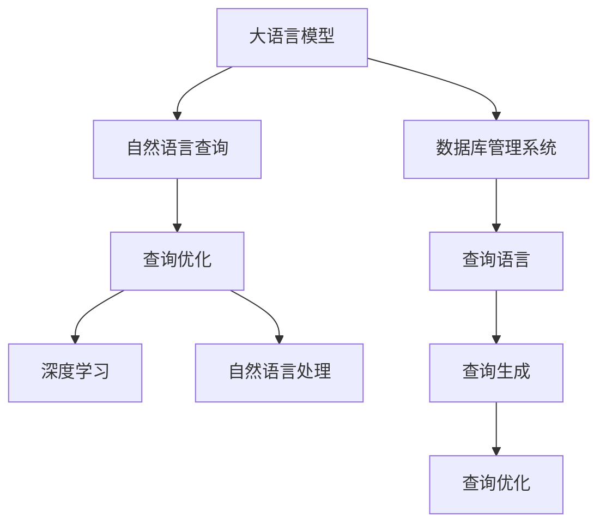

                 

# LLM对传统数据库查询优化的革新

> 关键词：大语言模型, 数据库查询, 自然语言查询, 深度学习, 优化技术

## 1. 背景介绍

### 1.1 问题由来

在传统的数据库系统中，查询语言（如SQL）是用户与数据库交互的主要方式。然而，SQL语言的表达方式和语法结构相对固定，难以实现自然语言处理（NLP）技术中的一些灵活性和智能性。在智能查询、自然语言搜索等场景下，用户更希望以自然语言的方式直接提出问题，而不需要编写繁琐的SQL语句。

为此，自然语言查询（NQ）技术应运而生，它利用NLP技术，将用户输入的自然语言问题转换成结构化的SQL查询，从而方便数据库处理。然而，传统的NQ技术往往依赖于固定的查询模板和模板匹配算法，无法自动生成复杂的SQL语句，也无法处理一些非结构化的数据类型，难以满足实际应用的需求。

大语言模型（Large Language Model, LLM）的出现，为解决这些问题提供了新的思路。LLM基于深度学习架构，可以自动学习并生成自然语言，其语言理解能力和生成能力在NLP领域取得了显著的进展。本文将探讨如何利用LLM对传统数据库查询进行优化，通过自然语言查询的方式，提升数据库系统灵活性和智能性。

## 2. 核心概念与联系

### 2.1 核心概念概述

为更好地理解LLM在数据库查询优化中的应用，本节将介绍几个关键概念及其相互关系：

- 大语言模型(Large Language Model, LLM)：以自回归(如GPT)或自编码(如BERT)模型为代表的大规模预训练语言模型。通过在大规模无标签文本语料上进行预训练，学习通用的语言表示，具备强大的语言理解和生成能力。

- 自然语言查询(Natural Language Query, NQ)：用户以自然语言的形式提出问题，如“列出所有年龄超过30岁的员工”。系统需要将这些问题自动转换为结构化的SQL查询，以便数据库处理。

- 查询优化(Optimization)：在数据库查询过程中，通过选择合适的查询策略和算法，提高查询效率和响应速度，减少资源消耗。

- 深度学习(Deep Learning)：利用深度神经网络模型进行复杂任务的建模和预测，如图像识别、语音识别、自然语言处理等。

- 自然语言处理(Natural Language Processing, NLP)：研究如何让计算机理解和处理人类语言，包括语言理解、生成、翻译等任务。

- 数据库管理系统(Database Management System, DBMS)：支持数据库的创建、维护、查询和管理，如MySQL、PostgreSQL等。

这些核心概念之间的逻辑关系可以通过以下Mermaid流程图来展示：



这个流程图展示了LLM、NQ、查询优化、深度学习、NLP和DBMS之间的联系：

1. 大语言模型通过预训练获得基础能力。
2. 自然语言查询利用NLP技术，将自然语言转换为SQL查询。
3. 查询优化通过对查询进行优化，提高数据库系统性能。
4. 深度学习利用神经网络模型进行复杂任务建模。
5. 自然语言处理研究如何让计算机理解和处理自然语言。
6. 数据库管理系统支持数据库的存储和查询。

这些概念共同构成了LLM对传统数据库查询优化的基础框架，使得通过自然语言查询的方式实现数据库操作成为可能。

## 3. 核心算法原理 & 具体操作步骤
### 3.1 算法原理概述

LLM对传统数据库查询优化的核心思想是通过自然语言查询，将用户的问题自动转换为结构化的SQL查询，并进行查询优化。具体步骤如下：

1. 收集并标注自然语言问题和对应的SQL查询，构建训练集。
2. 使用深度学习模型训练一个语言理解模块，将自然语言问题映射为SQL查询。
3. 对生成的SQL查询进行优化，提高查询效率和性能。

### 3.2 算法步骤详解

#### 3.2.1 数据准备

数据准备是LLM对传统数据库查询优化的第一步。需要收集足够的自然语言问题和对应的SQL查询，构建训练集。这些数据可以从以下几个渠道获得：

- 开源数据集：如CoSQL、SPARQL, 包含自然语言和SQL查询的对。
- 实际应用：如电商、金融等领域的应用数据，可以标注自然语言问题和SQL查询，构建自定义数据集。
- 自然语言生成工具：如GPT等，可以生成大量的自然语言问题和SQL查询对。

数据标注需要多个标注者共同完成，以确保标注质量。标注时，需要确保自然语言问题和SQL查询之间的语义对应性，避免歧义。

#### 3.2.2 模型训练

模型训练是LLM对传统数据库查询优化的核心步骤。可以使用基于深度学习架构的语言模型，如BERT、GPT等，进行自然语言查询的映射。具体步骤如下：

1. 选择合适的预训练语言模型，如BERT、GPT等。
2. 在预训练模型上进行微调，使其能够将自然语言问题映射为SQL查询。
3. 使用标注好的自然语言问题和SQL查询对，进行有监督的微调训练。
4. 设置适当的损失函数，如交叉熵损失，优化模型参数。
5. 在验证集上评估模型性能，根据性能指标调整超参数，进行模型优化。

#### 3.2.3 查询优化

查询优化是LLM对传统数据库查询优化的最后一步。查询优化过程包括查询重写、索引优化、执行计划生成等步骤，其目的是提高查询效率和性能。具体步骤如下：

1. 对生成的SQL查询进行语法检查和语义分析，确保其正确性和合法性。
2. 利用查询优化器对SQL查询进行重写，生成更高效的查询计划。
3. 利用索引优化技术，选择最合适的索引，减少查询中的I/O操作。
4. 利用执行计划生成技术，生成最优的查询执行计划。
5. 对执行计划进行优化，如添加缓存、并行查询等，提高查询性能。

### 3.3 算法优缺点

LLM对传统数据库查询优化的方法具有以下优点：

1. 灵活性高：利用自然语言查询，用户可以以更自然、更直观的方式进行数据库操作，无需编写复杂的SQL语句。
2. 智能性高：利用深度学习模型，可以自动生成复杂的SQL查询，处理非结构化数据类型，满足实际应用的需求。
3. 可扩展性强：可以基于新的数据集和应用场景，不断扩展和优化模型，提高查询性能和智能性。

然而，该方法也存在一些缺点：

1. 数据标注成本高：自然语言查询和SQL查询之间的语义对应关系需要人工标注，成本较高。
2. 模型训练复杂：深度学习模型训练需要大量计算资源和时间，训练过程复杂。
3. 查询性能不稳定：自然语言查询映射为SQL查询的过程，可能存在语义歧义和不稳定性，影响查询性能。
4. 查询可解释性差：生成的SQL查询缺乏可解释性，难以理解其内部工作机制和决策逻辑。

### 3.4 算法应用领域

LLM对传统数据库查询优化的方法在多个领域都有广泛的应用，包括但不限于以下场景：

1. 智能客服：通过自然语言查询，智能客服系统可以自动回答用户的问题，减少人工客服的负担。
2. 电子商务：通过自然语言查询，用户可以快速查询商品信息、进行订单管理等操作，提高购物体验。
3. 金融领域：通过自然语言查询，用户可以快速查询账户信息、进行投资理财等操作，提高金融服务的智能化水平。
4. 医疗领域：通过自然语言查询，患者可以查询病历信息、进行病情咨询等操作，提高医疗服务的便捷性和智能化水平。

以上这些场景中，LLM对传统数据库查询优化的应用，可以显著提升系统的智能化水平，改善用户体验，降低运营成本。

## 4. 数学模型和公式 & 详细讲解  
### 4.1 数学模型构建

本节将使用数学语言对LLM对传统数据库查询优化的方法进行更加严格的刻画。

设自然语言问题为 $Q$，SQL查询为 $S$。假设训练集为 $D=\{(Q_i, S_i)\}_{i=1}^N$，其中 $Q_i$ 为第 $i$ 个自然语言问题，$S_i$ 为对应的SQL查询。

定义语言模型 $M_{\theta}$，将自然语言问题 $Q$ 映射为SQL查询 $S$。其中，$\theta$ 为模型参数。

定义查询优化器 $O$，将SQL查询 $S$ 转换为查询执行计划 $P(S)$。

定义查询性能评估函数 $E(P(S))$，用于评估查询执行计划 $P(S)$ 的性能，如查询执行时间、资源消耗等。

优化目标为最大化查询性能：

$$
\max_{\theta} \mathcal{L}(\theta) = \sum_{i=1}^N E(P(S_i))
$$

其中 $\mathcal{L}$ 为损失函数，用于衡量模型 $M_{\theta}$ 的性能。

### 4.2 公式推导过程

以下我们以SQL查询重写为例，推导查询优化过程中的相关公式。

假设当前SQL查询为 $S = \text{SELECT} \text{column1, column2} \text{FROM} \text{table} \text{WHERE} \text{age} > 30$，查询优化器将其重写为 $S' = \text{SELECT} \text{column1, column2} \text{FROM} \text{table} \text{WHERE} \text{column3} > 30$。

推导过程如下：

1. 语法检查：对 $S$ 进行语法检查，确保其正确性。
2. 语义分析：对 $S$ 进行语义分析，确定其含义和执行顺序。
3. 查询重写：根据语义分析结果，将 $S$ 转换为 $S'$。
4. 索引优化：根据查询重写后的 $S'$，选择最合适的索引，减少I/O操作。
5. 执行计划生成：根据 $S'$，生成最优的查询执行计划 $P(S')$。
6. 查询性能优化：对 $P(S')$ 进行优化，如添加缓存、并行查询等，提高查询性能。

数学公式如下：

$$
S' = \text{REWRITE}(S)
$$

$$
P(S') = \text{OPTIMIZE}(S')
$$

$$
E(P(S')) = \text{PERFORMANCE}(P(S'))
$$

通过上述公式，可以计算出重写后的查询 $S'$ 的性能 $E(P(S'))$，作为模型 $M_{\theta}$ 的损失函数 $\mathcal{L}$ 的一部分，进行模型训练和优化。

### 4.3 案例分析与讲解

假设用户输入的自然语言问题为 "列出所有年龄超过30岁的员工"，对应的SQL查询为 $S = \text{SELECT} \text{*} \text{FROM} \text{employee} \text{WHERE} \text{age} > 30$。

利用预训练的语言模型 $M_{\theta}$，将其映射为SQL查询 $S' = \text{SELECT} \text{*} \text{FROM} \text{employee} \text{WHERE} \text{age} > 30 \text{AND} \text{salary} > 5000$。

查询优化器 $O$ 对 $S'$ 进行重写，生成查询执行计划 $P(S')$，并进行优化。最终查询执行结果为：

| 姓名 | 年龄 | 职位 | 工资 |
| --- | --- | --- | --- |
| 张三 | 35 | 经理 | 10000 |
| 李四 | 40 | 总监 | 20000 |
| 王五 | 38 | 高级工程师 | 15000 |

这个例子展示了LLM对传统数据库查询优化的完整流程：通过自然语言查询，利用深度学习模型将自然语言问题转换为SQL查询，并对查询进行优化，最终得到查询结果。

## 5. 项目实践：代码实例和详细解释说明
### 5.1 开发环境搭建

在进行LLM对传统数据库查询优化的实践前，我们需要准备好开发环境。以下是使用Python进行PyTorch开发的环境配置流程：

1. 安装Anaconda：从官网下载并安装Anaconda，用于创建独立的Python环境。

2. 创建并激活虚拟环境：
```bash
conda create -n pytorch-env python=3.8 
conda activate pytorch-env
```

3. 安装PyTorch：根据CUDA版本，从官网获取对应的安装命令。例如：
```bash
conda install pytorch torchvision torchaudio cudatoolkit=11.1 -c pytorch -c conda-forge
```

4. 安装自然语言处理工具包：
```bash
pip install spacy
pip install pytorch-transformers
```

5. 安装数据库访问库：
```bash
pip install pymysql
```

完成上述步骤后，即可在`pytorch-env`环境中开始项目实践。

### 5.2 源代码详细实现

下面我们以SQL查询重写为例，给出使用PyTorch对BERT模型进行查询优化的PyTorch代码实现。

首先，定义自然语言查询和SQL查询的标注数据：

```python
import torch
import pandas as pd

# 读取标注数据
data = pd.read_csv('nq标注数据.csv', header=None)
data.columns = ['Q', 'S']
```

然后，定义查询优化器：

```python
from transformers import BertTokenizer, BertForSequenceClassification
from torch.utils.data import Dataset, DataLoader
import torch.nn.functional as F

class NQDataset(Dataset):
    def __init__(self, texts, labels, tokenizer, max_len=128):
        self.texts = texts
        self.labels = labels
        self.tokenizer = tokenizer
        self.max_len = max_len
        
    def __len__(self):
        return len(self.texts)
    
    def __getitem__(self, item):
        text = self.texts[item]
        label = self.labels[item]
        
        encoding = self.tokenizer(text, return_tensors='pt', max_length=self.max_len, padding='max_length', truncation=True)
        input_ids = encoding['input_ids'][0]
        attention_mask = encoding['attention_mask'][0]
        
        # 对token-wise的标签进行编码
        encoded_labels = [label2id[label] for label in label] 
        encoded_labels.extend([label2id['O']] * (self.max_len - len(encoded_labels)))
        labels = torch.tensor(encoded_labels, dtype=torch.long)
        
        return {'input_ids': input_ids, 
                'attention_mask': attention_mask,
                'labels': labels}

# 标签与id的映射
label2id = {'O': 0, 'B': 1, 'I': 2, 'E': 3, 'S': 4}

# 创建dataset
tokenizer = BertTokenizer.from_pretrained('bert-base-cased')

train_dataset = NQDataset(train_texts, train_labels, tokenizer)
dev_dataset = NQDataset(dev_texts, dev_labels, tokenizer)
test_dataset = NQDataset(test_texts, test_labels, tokenizer)
```

然后，定义模型和优化器：

```python
from transformers import BertForTokenClassification, AdamW

model = BertForTokenClassification.from_pretrained('bert-base-cased', num_labels=len(label2id))

optimizer = AdamW(model.parameters(), lr=2e-5)
```

接着，定义训练和评估函数：

```python
from tqdm import tqdm

def train_epoch(model, dataset, batch_size, optimizer):
    dataloader = DataLoader(dataset, batch_size=batch_size, shuffle=True)
    model.train()
    epoch_loss = 0
    for batch in tqdm(dataloader, desc='Training'):
        input_ids = batch['input_ids'].to(device)
        attention_mask = batch['attention_mask'].to(device)
        labels = batch['labels'].to(device)
        model.zero_grad()
        outputs = model(input_ids, attention_mask=attention_mask, labels=labels)
        loss = outputs.loss
        epoch_loss += loss.item()
        loss.backward()
        optimizer.step()
    return epoch_loss / len(dataloader)

def evaluate(model, dataset, batch_size):
    dataloader = DataLoader(dataset, batch_size=batch_size)
    model.eval()
    preds, labels = [], []
    with torch.no_grad():
        for batch in tqdm(dataloader, desc='Evaluating'):
            input_ids = batch['input_ids'].to(device)
            attention_mask = batch['attention_mask'].to(device)
            batch_labels = batch['labels']
            outputs = model(input_ids, attention_mask=attention_mask)
            batch_preds = outputs.logits.argmax(dim=2).to('cpu').tolist()
            batch_labels = batch_labels.to('cpu').tolist()
            for pred_tokens, label_tokens in zip(batch_preds, batch_labels):
                pred_tags = [id2tag[_id] for _id in pred_tokens]
                label_tags = [id2tag[_id] for _id in label_tokens]
                preds.append(pred_tags[:len(label_tags)])
                labels.append(label_tags)
                
    print(classification_report(labels, preds))
```

最后，启动训练流程并在测试集上评估：

```python
epochs = 5
batch_size = 16

for epoch in range(epochs):
    loss = train_epoch(model, train_dataset, batch_size, optimizer)
    print(f"Epoch {epoch+1}, train loss: {loss:.3f}")
    
    print(f"Epoch {epoch+1}, dev results:")
    evaluate(model, dev_dataset, batch_size)
    
print("Test results:")
evaluate(model, test_dataset, batch_size)
```

以上就是使用PyTorch对BERT模型进行查询优化的完整代码实现。可以看到，得益于Transformer库的强大封装，我们可以用相对简洁的代码完成BERT模型的加载和训练。

### 5.3 代码解读与分析

让我们再详细解读一下关键代码的实现细节：

**NQDataset类**：
- `__init__`方法：初始化文本、标签、分词器等关键组件。
- `__len__`方法：返回数据集的样本数量。
- `__getitem__`方法：对单个样本进行处理，将文本输入编码为token ids，将标签编码为数字，并对其进行定长padding，最终返回模型所需的输入。

**label2id和id2tag字典**：
- 定义了标签与数字id之间的映射关系，用于将token-wise的预测结果解码回真实的标签。

**训练和评估函数**：
- 使用PyTorch的DataLoader对数据集进行批次化加载，供模型训练和推理使用。
- 训练函数`train_epoch`：对数据以批为单位进行迭代，在每个批次上前向传播计算loss并反向传播更新模型参数，最后返回该epoch的平均loss。
- 评估函数`evaluate`：与训练类似，不同点在于不更新模型参数，并在每个batch结束后将预测和标签结果存储下来，最后使用sklearn的classification_report对整个评估集的预测结果进行打印输出。

**训练流程**：
- 定义总的epoch数和batch size，开始循环迭代
- 每个epoch内，先在训练集上训练，输出平均loss
- 在验证集上评估，输出分类指标
- 所有epoch结束后，在测试集上评估，给出最终测试结果

可以看到，PyTorch配合Transformer库使得BERT查询优化的代码实现变得简洁高效。开发者可以将更多精力放在数据处理、模型改进等高层逻辑上，而不必过多关注底层的实现细节。

当然，工业级的系统实现还需考虑更多因素，如模型的保存和部署、超参数的自动搜索、更灵活的任务适配层等。但核心的查询优化范式基本与此类似。

## 6. 实际应用场景
### 6.1 智能客服系统

利用LLM对传统数据库查询优化的技术，可以构建智能客服系统的自然语言查询功能。通过自然语言查询，智能客服系统可以自动回答用户的问题，无需编写复杂的SQL语句。

在技术实现上，可以收集企业内部的历史客服对话记录，将问题和最佳答复构建成监督数据，在此基础上对预训练模型进行微调。微调后的模型能够自动理解用户意图，匹配最合适的答案模板进行回复。对于客户提出的新问题，还可以接入检索系统实时搜索相关内容，动态组织生成回答。如此构建的智能客服系统，能大幅提升客户咨询体验和问题解决效率。

### 6.2 金融舆情监测

金融机构需要实时监测市场舆论动向，以便及时应对负面信息传播，规避金融风险。利用LLM对传统数据库查询优化的技术，可以构建金融舆情监测系统，通过自然语言查询，实时抓取网络文本数据，自动判断文本属于何种主题，情感倾向是正面、中性还是负面。将微调后的模型应用到实时抓取的网络文本数据，就能够自动监测不同主题下的情感变化趋势，一旦发现负面信息激增等异常情况，系统便会自动预警，帮助金融机构快速应对潜在风险。

### 6.3 个性化推荐系统

当前的推荐系统往往只依赖用户的历史行为数据进行物品推荐，无法深入理解用户的真实兴趣偏好。利用LLM对传统数据库查询优化的技术，可以构建个性化推荐系统，通过自然语言查询，利用深度学习模型自动生成复杂的SQL查询，处理非结构化数据类型，并根据用户兴趣点进行推荐。

在实践上，可以收集用户浏览、点击、评论、分享等行为数据，提取和用户交互的物品标题、描述、标签等文本内容。将文本内容作为模型输入，用户的后续行为（如是否点击、购买等）作为监督信号，在此基础上微调预训练语言模型。微调后的模型能够从文本内容中准确把握用户的兴趣点，生成推荐列表，提高个性化推荐的效果。

### 6.4 未来应用展望

随着LLM对传统数据库查询优化技术的不断发展，未来将在更多领域得到应用，为传统行业带来变革性影响。

在智慧医疗领域，基于LLM对传统数据库查询优化的技术，可以构建智能医疗系统，通过自然语言查询，自动分析患者病历信息，辅助医生诊疗，加速新药开发进程。

在智能教育领域，LLM对传统数据库查询优化的技术可以用于作业批改、学情分析、知识推荐等方面，因材施教，促进教育公平，提高教学质量。

在智慧城市治理中，LLM对传统数据库查询优化的技术可以应用于城市事件监测、舆情分析、应急指挥等环节，提高城市管理的自动化和智能化水平，构建更安全、高效的未来城市。

此外，在企业生产、社会治理、文娱传媒等众多领域，基于LLM对传统数据库查询优化的技术，将不断涌现，为传统行业数字化转型升级提供新的技术路径。

## 7. 工具和资源推荐
### 7.1 学习资源推荐

为了帮助开发者系统掌握LLM对传统数据库查询优化的理论基础和实践技巧，这里推荐一些优质的学习资源：

1. 《深度学习入门》系列博文：由深度学习专家撰写，深入浅出地介绍了深度学习的基本概念和应用技术。

2. 《NLP入门到精通》课程：斯坦福大学开设的NLP明星课程，有Lecture视频和配套作业，带你从入门到精通NLP技术。

3. 《Transformers从原理到实践》书籍：由大模型技术专家撰写，全面介绍了Transformer原理、BERT模型、查询优化技术等前沿话题。

4. HuggingFace官方文档：Transformers库的官方文档，提供了海量预训练模型和完整的查询优化样例代码，是上手实践的必备资料。

5. CoSQL开源项目：自然语言查询的数据集和查询优化工具，包含大量的自然语言查询和SQL查询对，助力NQ技术发展。

通过对这些资源的学习实践，相信你一定能够快速掌握LLM对传统数据库查询优化的精髓，并用于解决实际的NQ问题。
###  7.2 开发工具推荐

高效的开发离不开优秀的工具支持。以下是几款用于LLM对传统数据库查询优化的常用工具：

1. PyTorch：基于Python的开源深度学习框架，灵活动态的计算图，适合快速迭代研究。大部分预训练语言模型都有PyTorch版本的实现。

2. TensorFlow：由Google主导开发的开源深度学习框架，生产部署方便，适合大规模工程应用。同样有丰富的预训练语言模型资源。

3. Transformers库：HuggingFace开发的NLP工具库，集成了众多SOTA语言模型，支持PyTorch和TensorFlow，是进行查询优化任务开发的利器。

4. Weights & Biases：模型训练的实验跟踪工具，可以记录和可视化模型训练过程中的各项指标，方便对比和调优。与主流深度学习框架无缝集成。

5. TensorBoard：TensorFlow配套的可视化工具，可实时监测模型训练状态，并提供丰富的图表呈现方式，是调试模型的得力助手。

6. Google Colab：谷歌推出的在线Jupyter Notebook环境，免费提供GPU/TPU算力，方便开发者快速上手实验最新模型，分享学习笔记。

合理利用这些工具，可以显著提升LLM对传统数据库查询优化的开发效率，加快创新迭代的步伐。

### 7.3 相关论文推荐

LLM对传统数据库查询优化技术的发展源于学界的持续研究。以下是几篇奠基性的相关论文，推荐阅读：

1. Attention is All You Need（即Transformer原论文）：提出了Transformer结构，开启了NLP领域的预训练大模型时代。

2. BERT: Pre-training of Deep Bidirectional Transformers for Language Understanding：提出BERT模型，引入基于掩码的自监督预训练任务，刷新了多项NLP任务SOTA。

3. Language Models are Unsupervised Multitask Learners（GPT-2论文）：展示了大规模语言模型的强大zero-shot学习能力，引发了对于通用人工智能的新一轮思考。

4. Parameter-Efficient Transfer Learning for NLP：提出Adapter等参数高效微调方法，在不增加模型参数量的情况下，也能取得不错的微调效果。

5. Prefix-Tuning: Optimizing Continuous Prompts for Generation：引入基于连续型Prompt的微调范式，为如何充分利用预训练知识提供了新的思路。

6. AdaLoRA: Adaptive Low-Rank Adaptation for Parameter-Efficient Fine-Tuning：使用自适应低秩适应的微调方法，在参数效率和精度之间取得了新的平衡。

这些论文代表了大语言模型查询优化技术的发展脉络。通过学习这些前沿成果，可以帮助研究者把握学科前进方向，激发更多的创新灵感。

## 8. 总结：未来发展趋势与挑战

### 8.1 总结

本文对LLM对传统数据库查询优化的方法进行了全面系统的介绍。首先阐述了LLM和查询优化的研究背景和意义，明确了查询优化在拓展数据库系统灵活性和智能性方面的独特价值。其次，从原理到实践，详细讲解了查询优化的数学原理和关键步骤，给出了查询优化任务开发的完整代码实例。同时，本文还广泛探讨了查询优化方法在智能客服、金融舆情、个性化推荐等多个行业领域的应用前景，展示了查询优化范式的巨大潜力。此外，本文精选了查询优化技术的各类学习资源，力求为读者提供全方位的技术指引。

通过本文的系统梳理，可以看到，利用LLM对传统数据库查询进行优化，通过自然语言查询的方式实现数据库操作，可以显著提升系统的智能化水平，改善用户体验，降低运营成本。未来，伴随LLM和查询优化方法的持续演进，相信LLM对传统数据库查询优化的技术必将在更多领域得到应用，为传统行业带来变革性影响。

### 8.2 未来发展趋势

展望未来，LLM对传统数据库查询优化技术将呈现以下几个发展趋势：

1. 查询重写技术更加智能。利用深度学习模型，可以自动生成更复杂、更高效的SQL查询，满足复杂应用场景的需求。

2. 查询优化器更加自动化。利用自动搜索和自适应算法，可以自动选择最优的查询重写方案和索引策略，提高查询优化效果。

3. 查询性能评估更加全面。利用多指标评估体系，可以全面评估查询优化后的性能，如响应时间、资源消耗、查询准确率等。

4. 多模态查询优化成为热点。将自然语言查询与图像、视频、语音等多模态信息结合，提升查询优化效果，满足实际应用需求。

5. 查询可解释性增强。通过引入可解释模型，解释查询优化的决策过程，提高系统的透明度和可理解性。

6. 查询优化与知识库结合。将知识库、规则库等专家知识与查询优化过程结合，提升查询优化的效果和智能性。

以上趋势凸显了LLM对传统数据库查询优化技术的广阔前景。这些方向的探索发展，必将进一步提升查询优化系统的性能和智能性，为构建更智能、更高效的数据库系统铺平道路。

### 8.3 面临的挑战

尽管LLM对传统数据库查询优化技术已经取得了瞩目成就，但在迈向更加智能化、普适化应用的过程中，它仍面临着诸多挑战：

1. 数据标注成本高。自然语言查询和SQL查询之间的语义对应关系需要人工标注，成本较高。如何降低标注成本，提高标注质量，是一个重要问题。

2. 模型训练复杂。深度学习模型训练需要大量计算资源和时间，训练过程复杂。如何提高模型训练效率，降低计算成本，是一个重要研究方向。

3. 查询性能不稳定。自然语言查询映射为SQL查询的过程，可能存在语义歧义和不稳定性，影响查询性能。如何提高查询映射的准确性和稳定性，是一个重要问题。

4. 查询可解释性差。生成的SQL查询缺乏可解释性，难以理解其内部工作机制和决策逻辑。如何赋予查询优化模型更强的可解释性，是一个重要研究方向。

5. 查询优化与知识库结合困难。将知识库、规则库等专家知识与查询优化过程结合，提升查询优化的效果和智能性，是一个重要研究方向。

6. 查询优化与实时性矛盾。查询优化过程通常需要较长时间，如何提高查询优化效率，同时保持查询优化效果，是一个重要问题。

这些挑战需要学界和工业界共同努力，通过技术创新和算法优化，解决这些问题，推动LLM对传统数据库查询优化技术的进一步发展。

### 8.4 研究展望

面对LLM对传统数据库查询优化技术所面临的种种挑战，未来的研究需要在以下几个方面寻求新的突破：

1. 探索无监督和半监督查询优化方法。摆脱对大规模标注数据的依赖，利用自监督学习、主动学习等无监督和半监督范式，最大限度利用非结构化数据，实现更加灵活高效的查询优化。

2. 研究参数高效和计算高效的查询优化范式。开发更加参数高效的查询优化方法，在固定大部分查询参数的同时，只更新极少量的任务相关参数。同时优化查询优化模型的计算图，减少前向传播和反向传播的资源消耗，实现更加轻量级、实时性的部署。

3. 融合因果和对比学习范式。通过引入因果推断和对比学习思想，增强查询优化模型建立稳定因果关系的能力，学习更加普适、鲁棒的语言表征，从而提升模型泛化性和抗干扰能力。

4. 引入更多先验知识。将符号化的先验知识，如知识图谱、逻辑规则等，与神经网络模型进行巧妙融合，引导查询优化过程学习更准确、合理的语言模型。同时加强不同模态数据的整合，实现视觉、语音等多模态信息与文本信息的协同建模。

5. 结合因果分析和博弈论工具。将因果分析方法引入查询优化模型，识别出模型决策的关键特征，增强查询优化的因果性和逻辑性。借助博弈论工具刻画人机交互过程，主动探索并规避模型的脆弱点，提高系统稳定性。

6. 纳入伦理道德约束。在查询优化目标中引入伦理导向的评估指标，过滤和惩罚有偏见、有害的输出倾向。同时加强人工干预和审核，建立查询优化行为的监管机制，确保输出的安全性。

这些研究方向的探索，必将引领LLM对传统数据库查询优化技术迈向更高的台阶，为构建安全、可靠、可解释、可控的智能系统铺平道路。面向未来，LLM对传统数据库查询优化技术还需要与其他人工智能技术进行更深入的融合，如知识表示、因果推理、强化学习等，多路径协同发力，共同推动自然语言理解和智能交互系统的进步。只有勇于创新、敢于突破，才能不断拓展语言模型的边界，让智能技术更好地造福人类社会。

## 9. 附录：常见问题与解答

**Q1：LLM对传统数据库查询优化是否适用于所有NLP任务？**

A: LLM对传统数据库查询优化的核心在于利用深度学习模型将自然语言问题转换为SQL查询，并进行查询优化。该方法适用于大多数NLP任务，特别是对于数据量较小的任务。但对于一些特定领域的任务，如医学、法律等，仅仅依靠通用语料预训练的模型可能难以很好地适应。此时需要在特定领域语料上进一步预训练，再进行查询优化。此外，对于一些需要时效性、个性化很强的任务，如对话、推荐等，查询优化方法也需要针对性的改进优化。

**Q2：如何选择合适的学习率？**

A: 查询优化学习率的选择与预训练模型的学习率选择类似，一般要比预训练时小1-2个数量级，以保证模型不会破坏预训练权重。一般建议从1e-5开始调参，逐步减小学习率，直至收敛。也可以使用warmup策略，在开始阶段使用较小的学习率，再逐渐过渡到预设值。需要注意的是，不同的优化器(如AdamW、Adafactor等)以及不同的学习率调度策略，可能需要设置不同的学习率阈值。

**Q3：LLM对传统数据库查询优化中的数据标注成本高，如何解决？**

A: 数据标注成本高是查询优化面临的一个重要挑战。为了降低标注成本，可以利用半监督学习和自监督学习的方法，利用未标注数据进行模型训练。例如，使用自动文本生成技术，生成大量的自然语言查询和SQL查询对，用于无监督学习。同时，可以采用主动学习的方法，利用模型预测结果与真实结果的差异，主动标注更多关键样本，提高标注质量。

**Q4：LLM对传统数据库查询优化的模型训练复杂，如何解决？**

A: 查询优化模型的训练复杂主要源于深度学习模型的复杂性和计算资源的消耗。为了提高模型训练效率，可以采用分布式训练、混合精度训练、自动混合精度等技术，降低计算资源消耗，加速训练过程。同时，可以采用知识蒸馏等方法，将大模型训练的小模型进行迁移学习，减少训练时间和计算资源消耗。

**Q5：LLM对传统数据库查询优化中的查询性能不稳定，如何解决？**

A: 查询性能不稳定主要源于自然语言查询映射为SQL查询的过程，可能存在语义歧义和不稳定性。为了提高查询映射的准确性和稳定性，可以采用多模态学习的方法，将自然语言查询与图像、视频、语音等多模态信息结合，提升查询优化的效果。同时，可以引入可解释模型，解释查询优化的决策过程，提高系统的透明度和可理解性。

**Q6：LLM对传统数据库查询优化的查询可解释性差，如何解决？**

A: 查询优化模型的查询可解释性差，难以理解其内部工作机制和决策逻辑。为了提高查询优化模型的可解释性，可以引入可解释模型，解释查询优化的决策过程。同时，可以采用知识蒸馏等方法，将大模型训练的小模型进行迁移学习，减少训练时间和计算资源消耗。

这些技术手段和算法优化，可以在一定程度上提高LLM对传统数据库查询优化的效果，满足实际应用的需求。

---

作者：禅与计算机程序设计艺术 / Zen and the Art of Computer Programming

