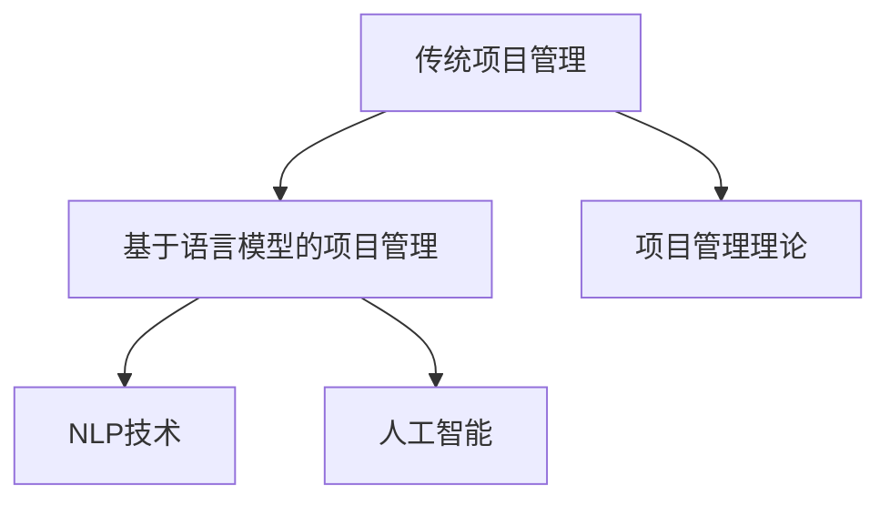

                 

# LLM对传统项目管理方法的挑战与改进

## 1. 背景介绍

项目管理（Project Management）是确保项目按时、按预算、按质量完成的重要工具和方法。随着技术的发展，尤其是人工智能和自然语言处理技术的进步，一种新兴的项目管理工具——基于语言模型（Language Model, LM）的项目管理，正在逐步进入人们的研究视野。然而，这种以人工智能为基础的项目管理方法，对于传统的项目管理方法提出了许多挑战，也带来了巨大的改进潜力。

## 2. 核心概念与联系

### 2.1 核心概念概述

- **传统项目管理方法**：基于经典的项目管理理论，如项目管理（PMI）、敏捷管理（Scrum）等，强调计划、执行、监控、反馈和改进的循环。
- **基于语言模型的项目管理（LLM-PM）**：通过语言模型，如GPT系列、BERT、T5等，利用自然语言理解和生成能力，自动完成项目规划、执行、监控和反馈等任务。
- **自然语言处理（NLP）**：一种使计算机能够理解、解释和生成人类语言的技术，是LLM-PM的基础。
- **人工智能（AI）**：利用算法和数据，模拟、延伸和扩展人的智能，LLM-PM是AI在项目管理中的应用之一。

### 2.2 核心概念原理和架构的 Mermaid 流程图



这个流程图展示了大语言模型项目管理与传统项目管理方法、自然语言处理技术和人工智能技术之间的关系。

## 3. 核心算法原理 & 具体操作步骤

### 3.1 算法原理概述

基于语言模型的项目管理方法，利用大语言模型处理自然语言的能力，自动实现项目管理任务。其核心思想是通过自然语言处理技术，将项目管理的各个环节映射为自然语言处理任务，由大语言模型自动处理。例如：

- **项目规划**：将项目目标、时间表、预算等映射为自然语言描述，大语言模型自动生成规划文档。
- **项目执行**：将任务分配、进度更新等映射为自然语言指令，大语言模型自动执行。
- **项目监控**：将项目状态、风险等映射为自然语言报告，大语言模型自动生成。
- **项目反馈**：将项目评估、改进建议等映射为自然语言意见，大语言模型自动生成。

### 3.2 算法步骤详解

1. **需求获取**：通过问卷、访谈等方式，获取项目的详细信息和目标。
2. **任务分解**：将项目目标和需求映射为自然语言描述，由大语言模型自动分解为可执行任务。
3. **规划生成**：将任务分解结果、时间表、预算等映射为自然语言描述，由大语言模型自动生成项目规划文档。
4. **执行管理**：将任务分配、进度更新等映射为自然语言指令，由大语言模型自动管理。
5. **监控报告**：将项目状态、风险等映射为自然语言描述，由大语言模型自动生成监控报告。
6. **反馈生成**：将项目评估、改进建议等映射为自然语言意见，由大语言模型自动生成反馈文档。

### 3.3 算法优缺点

**优点**：
- **自动化程度高**：大语言模型可以自动处理大量自然语言文本，减少人工干预。
- **灵活性高**：大语言模型能够根据项目需求自动调整任务分解和规划，灵活适应项目变化。
- **效率高**：自动化处理自然语言文本，减少人工处理时间和误差。

**缺点**：
- **数据依赖性强**：大语言模型的性能依赖于高质量的训练数据，数据质量不佳可能导致模型表现差。
- **依赖技术成熟度**：大语言模型需要较高级的技术支持，对技术要求高。
- **缺乏人性关怀**：大语言模型在执行任务时可能缺乏人类的直觉和灵活性。

### 3.4 算法应用领域

基于大语言模型的项目管理方法，已经成功应用于以下几个领域：

- **软件开发**：通过自然语言处理技术，实现软件项目的自动规划、执行和监控。
- **市场营销**：利用自然语言生成技术，自动生成市场分析和营销策略。
- **供应链管理**：将供应链管理任务映射为自然语言处理任务，实现自动化管理。
- **公共卫生**：通过自然语言处理技术，实现公共卫生项目的信息收集和分析。
- **人力资源管理**：自动处理招聘、培训等任务，提升人力资源管理效率。

## 4. 数学模型和公式 & 详细讲解 & 举例说明

### 4.1 数学模型构建

基于大语言模型的项目管理方法，可以构建以下数学模型：

- **项目目标模型**：将项目目标和需求映射为自然语言描述，使用语言模型计算最优方案。
- **任务分解模型**：将项目目标和需求映射为自然语言描述，使用语言模型自动分解任务。
- **规划生成模型**：将任务分解结果、时间表、预算等映射为自然语言描述，使用语言模型生成规划文档。
- **执行管理模型**：将任务分配、进度更新等映射为自然语言指令，使用语言模型自动执行。
- **监控报告模型**：将项目状态、风险等映射为自然语言描述，使用语言模型生成监控报告。
- **反馈生成模型**：将项目评估、改进建议等映射为自然语言意见，使用语言模型生成反馈文档。

### 4.2 公式推导过程

以项目规划模型为例，假设项目目标为 $T$，需求为 $R$，时间表为 $S$，预算为 $B$。则项目规划生成的公式为：

$$
P = \text{argmax}_{P} \log(P|T, R, S, B)
$$

其中 $P$ 表示规划文档，$\log$ 表示语言模型的对数似然函数，$T$、$R$、$S$、$B$ 分别为项目目标、需求、时间表和预算。

### 4.3 案例分析与讲解

假设有一个软件开发项目，目标为在6个月内开发一款新应用，需求包括用户需求、功能需求和设计需求。时间表为6个月，预算为100万元。

1. **项目目标模型**：
   - 目标：开发一款新应用
   - 需求：用户需求、功能需求、设计需求
   - 时间表：6个月
   - 预算：100万元
2. **任务分解模型**：
   - 任务1：需求收集
   - 任务2：功能设计
   - 任务3：系统开发
   - 任务4：测试与部署
3. **规划生成模型**：
   - 生成文档：项目开发计划、时间表、预算分配表等
4. **执行管理模型**：
   - 分配任务：需求收集组、功能设计组、系统开发组、测试与部署组
   - 进度更新：每日任务报告、每周进度报告
5. **监控报告模型**：
   - 生成报告：项目进度报告、风险评估报告等
6. **反馈生成模型**：
   - 生成反馈：项目评估报告、改进建议报告等

## 5. 项目实践：代码实例和详细解释说明

### 5.1 开发环境搭建

要实现基于大语言模型的项目管理，需要搭建如下开发环境：

1. **Python环境**：安装Python 3.8及以上版本。
2. **Transformers库**：用于大语言模型的处理。
3. **OpenAI GPT-3 API**：用于自然语言处理和生成。
4. **TensorFlow或PyTorch**：用于模型的训练和推理。

### 5.2 源代码详细实现

以下是一个简单的Python代码示例，展示如何使用GPT-3进行项目规划的自动生成：

```python
from transformers import GPT3Tokenizer, GPT3Model

# 加载模型和tokenizer
tokenizer = GPT3Tokenizer.from_pretrained('gpt3-medium')
model = GPT3Model.from_pretrained('gpt3-medium')

# 项目目标和需求
project_target = "开发一款新应用"
project_requirements = ["用户需求", "功能需求", "设计需求"]
project_timeline = "6个月"
project_budget = "100万元"

# 构造自然语言描述
project_description = f"项目目标：{project_target}\n需求：{project_requirements}\n时间表：{project_timeline}\n预算：{project_budget}"

# 将描述转换为token ids
tokens = tokenizer.encode(project_description, return_tensors='pt')

# 使用模型生成规划文档
outputs = model.generate(tokens)
generated_text = tokenizer.decode(outputs[0], skip_special_tokens=True)

# 打印生成的规划文档
print(generated_text)
```

### 5.3 代码解读与分析

这个代码示例展示了如何使用GPT-3自动生成项目规划文档。首先，通过Transformer库加载GPT-3模型和tokenizer，然后构造项目的自然语言描述，将其转换为token ids。最后，使用模型生成规划文档，并通过tokenizer将输出解码为自然语言。

## 6. 实际应用场景

### 6.1 软件开发

在软件开发项目中，基于大语言模型的项目管理可以显著提升效率和质量。例如，自动生成项目规划、任务分配、进度报告等，减少人工处理时间和误差。

### 6.2 市场营销

市场营销人员可以利用自然语言生成技术，自动生成市场分析和营销策略。例如，自动生成市场报告、营销方案、广告文案等，提升工作效率和创意水平。

### 6.3 供应链管理

供应链管理涉及大量复杂的自然语言文本处理，例如合同条款、采购订单、库存管理等。大语言模型可以有效处理这些文本，自动生成供应链管理文档，提升供应链管理效率。

### 6.4 公共卫生

公共卫生项目需要处理大量的自然语言数据，例如病历记录、公共卫生报告等。大语言模型可以有效处理这些数据，自动生成公共卫生项目报告，提升公共卫生项目的管理效率。

### 6.5 人力资源管理

人力资源管理涉及大量自然语言文本处理，例如招聘信息、培训资料、员工反馈等。大语言模型可以有效处理这些文本，自动生成招聘、培训、员工反馈等文档，提升人力资源管理效率。

## 7. 工具和资源推荐

### 7.1 学习资源推荐

1. **《自然语言处理综述》**：由斯坦福大学提供的在线课程，详细讲解NLP的理论和实践。
2. **《深度学习与自然语言处理》**：Coursera提供的深度学习与NLP的入门课程，涵盖NLP的基础知识和实践。
3. **《Python NLP Cookbook》**：一本介绍NLP库和工具的书籍，适合实际项目开发。
4. **《Transformers 2.0》**：介绍Transformers库的使用和NLP任务开发的书籍。

### 7.2 开发工具推荐

1. **Python**：Python是最流行的NLP开发语言，拥有丰富的自然语言处理库和工具。
2. **Transformers库**：由Hugging Face提供，支持大语言模型的训练和推理。
3. **OpenAI GPT-3 API**：提供自然语言处理和生成的API，方便使用大语言模型。
4. **TensorFlow或PyTorch**：深度学习框架，支持大语言模型的训练和推理。

### 7.3 相关论文推荐

1. **《GPT-3 in Task-Oriented Language Processing》**：介绍GPT-3在自然语言处理任务中的应用。
2. **《Using Language Models for Project Management》**：介绍基于大语言模型的项目管理方法的研究。
3. **《Natural Language Processing in Agile Software Development》**：介绍NLP在敏捷软件开发中的应用。

## 8. 总结：未来发展趋势与挑战

### 8.1 研究成果总结

基于大语言模型的项目管理方法，已经在多个领域展示了其优越性。通过自动处理自然语言文本，显著提升了项目管理的工作效率和质量，减少人工处理的时间和误差。

### 8.2 未来发展趋势

未来，基于大语言模型的项目管理方法将继续发展，展现出以下趋势：

1. **更智能的自然语言处理**：随着深度学习技术的发展，大语言模型将具备更强的自然语言处理能力，能够处理更复杂的自然语言文本。
2. **更高效的自动化流程**：大语言模型将能够自动处理更多项目管理任务，进一步提升项目管理效率。
3. **更智能的任务调度**：通过自然语言处理技术，大语言模型能够自动调整任务优先级和分配，提升项目执行效率。
4. **更智能的风险管理**：通过自然语言处理技术，大语言模型能够自动识别和评估项目风险，提供风险应对建议。

### 8.3 面临的挑战

尽管基于大语言模型的项目管理方法展现了巨大的潜力，但也面临以下挑战：

1. **数据质量问题**：大语言模型的性能依赖于高质量的训练数据，数据质量不佳可能导致模型表现差。
2. **技术成熟度问题**：大语言模型需要较高级的技术支持，对技术要求高。
3. **隐私和安全问题**：自然语言处理涉及敏感信息，需要加强数据隐私和安全保护。
4. **模型可解释性问题**：大语言模型往往是“黑盒”系统，缺乏透明度和可解释性。
5. **适应性问题**：大语言模型需要适应不同的项目需求和场景，需要更多的自定义训练和微调。

### 8.4 研究展望

未来，基于大语言模型的项目管理方法需要在以下几个方面进行深入研究：

1. **数据质量优化**：研究如何提高数据质量，减少数据噪声对模型性能的影响。
2. **模型可解释性提升**：研究如何提高模型的可解释性，增加透明性和可控性。
3. **多领域模型开发**：研究如何开发适用于不同领域的大语言模型，提升模型的适应性。
4. **隐私保护技术**：研究如何加强数据隐私和安全保护，确保敏感数据的安全。
5. **混合模型融合**：研究如何将传统项目管理方法和基于大语言模型的项目管理方法融合，发挥各自优势。

## 9. 附录：常见问题与解答

**Q1：大语言模型项目管理是否适用于所有类型的项目？**

A: 大语言模型项目管理适用于数据量大、自然语言文本处理需求高的项目，如软件开发、市场营销、供应链管理等。对于高度依赖领域知识和专业知识的项目，可能需要结合领域专家知识，进行更加定制化的开发。

**Q2：如何评估大语言模型在项目管理中的性能？**

A: 评估大语言模型在项目管理中的性能，可以通过以下几个指标：
1. **准确性**：评估模型生成的文档是否符合项目需求和目标。
2. **效率**：评估模型生成文档的时间，是否优于人工处理时间。
3. **一致性**：评估模型在不同时间生成的文档的一致性，是否符合项目管理规范。
4. **可解释性**：评估模型输出的可解释性，是否符合项目管理人员的理解和需求。

**Q3：如何提高大语言模型在项目管理中的泛化能力？**

A: 提高大语言模型在项目管理中的泛化能力，可以通过以下几个方法：
1. **多样化训练数据**：使用更多样化的项目管理数据进行训练，提升模型对不同项目的适应能力。
2. **多任务训练**：在训练过程中加入多个项目管理任务，提升模型的泛化能力。
3. **领域特定微调**：针对特定领域的项目管理任务，进行微调，提升模型的领域适应性。

**Q4：大语言模型项目管理如何结合传统项目管理方法？**

A: 大语言模型项目管理可以与传统项目管理方法结合，发挥各自优势。例如，使用自然语言处理技术自动生成项目管理文档，同时结合项目管理专家的经验和知识，进行人工审核和调整。

**Q5：如何应对大语言模型在项目管理中的技术挑战？**

A: 应对大语言模型在项目管理中的技术挑战，可以通过以下几个方法：
1. **数据质量优化**：提高数据质量，减少数据噪声对模型性能的影响。
2. **模型可解释性提升**：研究如何提高模型的可解释性，增加透明性和可控性。
3. **多领域模型开发**：研究如何开发适用于不同领域的大语言模型，提升模型的适应性。

**Q6：如何加强大语言模型在项目管理中的隐私和安全保护？**

A: 加强大语言模型在项目管理中的隐私和安全保护，可以通过以下几个方法：
1. **数据匿名化**：对项目数据进行匿名化处理，减少隐私泄露风险。
2. **数据加密**：对项目数据进行加密处理，确保数据安全。
3. **访问控制**：对模型访问进行严格控制，确保只有授权人员能够访问和管理模型。

**Q7：如何提升大语言模型在项目管理中的性能？**

A: 提升大语言模型在项目管理中的性能，可以通过以下几个方法：
1. **数据增强**：通过数据增强技术，提高模型对自然语言文本的鲁棒性和泛化能力。
2. **模型优化**：通过模型优化技术，提高模型的训练效率和性能。
3. **参数调整**：通过参数调整，提高模型的适应性和泛化能力。

作者：禅与计算机程序设计艺术 / Zen and the Art of Computer Programming

