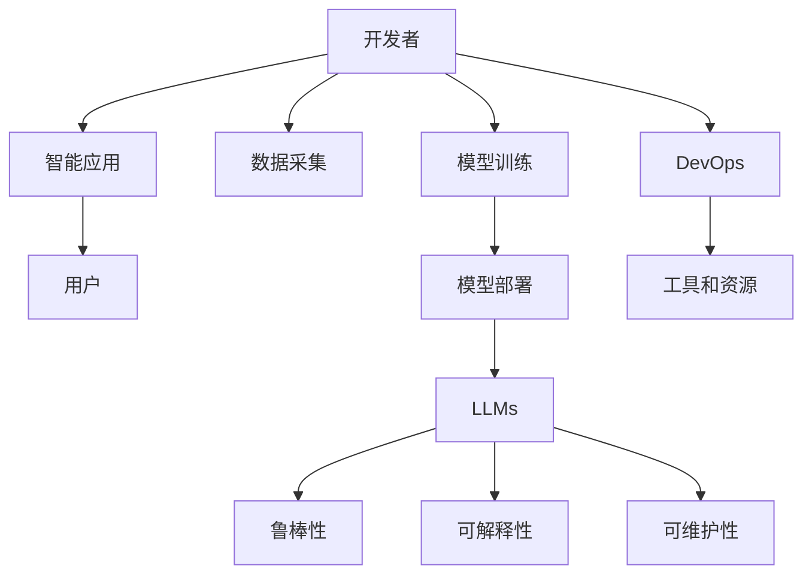

                 

# LLM生态:智能应用的繁荣土壤

> 关键词：
- 大语言模型(Large Language Model, LLM)
- 智能应用(Smart Application)
- 生态系统(Ecosystem)
- 开发者(Developer)
- 用户(User)
- 数据(Data)
- 部署(DevOps)
- 鲁棒性(Robustness)
- 可解释性(Explainability)
- 可维护性(Maintainability)

## 1. 背景介绍

### 1.1 问题由来

大语言模型(LLMs)作为人工智能(AI)领域的前沿技术，近年来在自然语言处理(NLP)、计算机视觉(CV)等多个领域取得了显著的进展。这些大模型通常基于自回归或自编码架构，通过在大量无标签数据上进行预训练，学习到通用语言表示和特征。基于LLMs的应用范围不断扩大，涵盖文本分类、问答系统、机器翻译、对话生成等多个领域，为智能应用的开发提供了强大的工具。

然而，尽管大语言模型的表现令人振奋，但其应用仍面临诸多挑战。数据采集、模型训练、模型部署等环节需要大量的人力物力投入，开发者需要不断优化模型性能，以适应实际应用场景。因此，如何构建一个繁荣的LLM生态系统，使开发者和用户都能高效地使用LLMs，成为当前的紧迫任务。

### 1.2 问题核心关键点

构建LLM生态系统的关键点包括：

- **数据采集**：获取高质量、多样化的数据，以便大模型能够学习到更加丰富、全面的知识。
- **模型训练**：优化模型训练过程，提高模型训练效率和性能，同时确保模型的鲁棒性和可解释性。
- **模型部署**：通过有效的DevOps技术，使模型能够稳定、高效地在实际应用中运行。
- **开发者社区**：构建一个活跃的开发者社区，促进知识交流、技术共享，推动LLM生态的快速发展。
- **用户需求满足**：满足不同用户的多样化需求，使大模型能够在各行各业中发挥作用。

## 2. 核心概念与联系

### 2.1 核心概念概述

为更好地理解LLM生态系统的构建，本节将介绍几个密切相关的核心概念：

- **大语言模型(LLMs)**：以自回归(如GPT)或自编码(如BERT)模型为代表的大规模预训练语言模型。通过在大量无标签数据上进行预训练，学习到通用的语言表示，具备强大的语言理解和生成能力。

- **智能应用(Smart Applications)**：利用LLMs进行开发的应用，如问答系统、文本分类、翻译、对话系统等。

- **生态系统(Ecosystem)**：一个由开发者、用户、数据、技术工具等多方组成的系统，各部分互相依赖、协同工作。

- **开发者(Developers)**：使用LLMs进行智能应用开发的专业人士。

- **用户(User)**：智能应用服务的最终用户，受益于LLMs的智能功能。

- **数据(Data)**：用于训练和优化LLMs的数据集，包括文本、图像、音频等多种类型。

- **部署(DevOps)**：从模型训练到实际应用部署的全流程管理，包括版本控制、自动化测试、持续集成等。

- **鲁棒性(Robustness)**：指模型在面对噪声、对抗样本等情况下的稳定性和可靠性。

- **可解释性(Explainability)**：指模型输出结果的可理解性和透明性，便于开发者和用户进行调试和优化。

- **可维护性(Maintainability)**：指模型和应用系统的易修改、易扩展性，以便持续改进和优化。

这些核心概念之间的逻辑关系可以通过以下Mermaid流程图来展示：



这个流程图展示了大语言模型的核心概念及其之间的关系：

1. 开发者使用数据采集工具获取大量数据，进行模型训练，得到大语言模型。
2. 开发者根据用户需求，使用LLMs开发智能应用，并部署到生产环境。
3. 用户使用智能应用，享受LLMs带来的便利。
4. DevOps工具保障模型训练和部署的顺利进行。
5. 鲁棒性、可解释性和可维护性是多方面保障模型应用效果的机制。

## 3. 核心算法原理 & 具体操作步骤

### 3.1 算法原理概述

基于LLMs的智能应用开发，其核心算法原理包括：

- **数据采集和处理**：从不同渠道获取数据，并进行预处理，清洗噪声，划分训练集、验证集和测试集。

- **模型训练**：使用无监督学习(如掩码语言模型)或监督学习(如分类、匹配、生成等)任务对LLMs进行预训练和微调，优化模型参数。

- **模型部署**：将训练好的模型部署到生产环境，进行实时推理预测，集成到应用系统中。

- **DevOps技术**：使用容器化、持续集成、自动化测试等技术，保障模型训练和部署的连续性和稳定性。

### 3.2 算法步骤详解

以下是对智能应用开发的一般步骤详解：

**Step 1: 数据采集和预处理**

1. 收集与应用相关的文本、图像、音频等数据，例如客户服务对话、产品评价、新闻报道等。

2. 对数据进行清洗，去除噪声、去除重复、进行标注，确保数据质量。

3. 划分训练集、验证集和测试集，确保模型训练和评估的科学性。

**Step 2: 模型训练**

1. 选择合适的预训练模型，如BERT、GPT-3等，并使用掩码语言模型等无监督任务进行预训练。

2. 根据应用需求，设计任务适配层，使用监督学习任务进行微调。

3. 设置模型超参数，如学习率、批大小、迭代轮数等，选择优化算法如AdamW、SGD等。

4. 执行梯度训练，不断更新模型参数，直到模型收敛。

**Step 3: 模型部署**

1. 将训练好的模型部署到服务器或云端环境。

2. 使用API接口、SDK等工具，使模型能够被其他系统调用。

3. 对模型进行性能监控，确保稳定运行。

**Step 4: DevOps集成**

1. 使用DevOps工具如Jenkins、Docker等进行自动化测试、持续集成。

2. 建立版本控制，确保代码和模型的版本管理。

3. 配置CI/CD流水线，自动化训练和部署过程。

### 3.3 算法优缺点

基于LLMs的智能应用开发具有以下优点：

- **高效性**：使用预训练模型可以显著减少从头训练所需的计算资源和时间。

- **普适性**：LLMs具备通用语言表示能力，可以适应多种类型的智能应用。

- **灵活性**：开发者可以根据需求设计不同的任务适配层，灵活应用LLMs。

- **可扩展性**：LLMs可以通过不断训练和微调，提升应用性能和鲁棒性。

然而，基于LLMs的智能应用开发也存在以下缺点：

- **数据依赖**：需要大量标注数据，数据获取和标注成本较高。

- **模型复杂性**：大模型参数量庞大，内存占用和计算资源需求较高。

- **部署挑战**：模型部署和维护需要专业的DevOps知识，可能存在性能和稳定性问题。

- **可解释性不足**：大模型通常作为"黑盒"存在，其决策过程难以解释和调试。

- **鲁棒性不足**：模型对噪声和对抗样本的鲁棒性较差，可能存在误判和过拟合风险。

### 3.4 算法应用领域

基于LLMs的智能应用广泛应用在多个领域，例如：

- **客户服务**：智能客服系统，使用自然语言理解(NLU)技术处理用户咨询，提供实时响应和解决方案。

- **医疗健康**：医疗问答系统，通过问答和推荐技术，辅助医生进行疾病诊断和治疗方案推荐。

- **金融服务**：智能投顾，通过自然语言处理和推荐系统，为投资者提供个性化投资建议。

- **教育培训**：智能答疑系统，通过问答技术解答学生问题，提供个性化学习方案。

- **内容推荐**：智能推荐系统，根据用户行为和兴趣，推荐新闻、商品、视频等内容。

- **工业制造**：智能运维系统，通过自然语言处理技术，监控设备状态，提供故障诊断和维护建议。

以上这些领域都展示了LLMs的广泛应用和巨大潜力。随着技术的不断演进，LLMs在更多场景中的应用将不断拓展，为各行各业带来新的发展机遇。

## 4. 数学模型和公式 & 详细讲解 & 举例说明

### 4.1 数学模型构建

我们以文本分类任务为例，展示如何使用LLMs进行智能应用开发。

假设输入文本为 $x$，对应的标签为 $y \in \{1, 2, \ldots, K\}$。在LLMs模型中，使用掩码语言模型对文本进行编码，得到表示向量 $h \in \mathbb{R}^d$。根据任务需求，在模型顶层添加一个全连接层，输出一个 $K$ 维的概率分布 $p(h)$。

数学模型构建如下：

$$
\hat{y} = \text{softmax}(hW + b)
$$

其中 $W$ 和 $b$ 为全连接层的权重和偏置。

### 4.2 公式推导过程

基于掩码语言模型的预训练过程如下：

1. 给定一段文本 $x$，随机掩盖部分词汇，生成掩码向量 $m \in \{0, 1\}^{|x|}$。

2. 将 $x$ 编码成隐状态 $h$，根据 $m$ 生成掩码输入 $m^m(x)$，并计算掩码输出 $h^m(x)$。

3. 使用自回归损失函数 $L(x, m^m(x))$ 进行训练，最小化 $h$ 和 $h^m(x)$ 之间的差距。

4. 在预训练完成后，将模型用于下游任务的微调，训练一个二分类器或分类器。

数学公式如下：

$$
L(x, m^m(x)) = -\sum_{i \in \text{masked\_indices}} \log p(x_i | h)
$$

### 4.3 案例分析与讲解

以BERT模型的文本分类为例，其核心流程如下：

1. 将输入文本进行分词和编码，得到序列表示 $h$。

2. 通过线性变换和softmax层，得到标签概率分布 $p(h)$。

3. 定义交叉熵损失函数 $L$，用于衡量模型预测与真实标签之间的差距。

4. 使用梯度下降等优化算法，更新模型参数，最小化损失函数。

数学公式如下：

$$
L = -\frac{1}{N}\sum_{i=1}^N [y_i\log p(h_i) + (1-y_i)\log(1-p(h_i))]
$$

## 5. 项目实践：代码实例和详细解释说明

### 5.1 开发环境搭建

在进行LLM应用开发前，需要准备好开发环境。以下是使用Python进行PyTorch开发的环境配置流程：

1. 安装Anaconda：从官网下载并安装Anaconda，用于创建独立的Python环境。

2. 创建并激活虚拟环境：
```bash
conda create -n pytorch-env python=3.8 
conda activate pytorch-env
```

3. 安装PyTorch：根据CUDA版本，从官网获取对应的安装命令。例如：
```bash
conda install pytorch torchvision torchaudio cudatoolkit=11.1 -c pytorch -c conda-forge
```

4. 安装Transformers库：
```bash
pip install transformers
```

5. 安装各类工具包：
```bash
pip install numpy pandas scikit-learn matplotlib tqdm jupyter notebook ipython
```

完成上述步骤后，即可在`pytorch-env`环境中开始LLM应用开发。

### 5.2 源代码详细实现

下面我们以BERT模型进行文本分类任务的代码实现为例：

首先，定义数据处理函数：

```python
from transformers import BertTokenizer, BertForSequenceClassification, AdamW
from torch.utils.data import Dataset, DataLoader
import torch

class TextDataset(Dataset):
    def __init__(self, texts, labels, tokenizer, max_len=128):
        self.texts = texts
        self.labels = labels
        self.tokenizer = tokenizer
        self.max_len = max_len
        
    def __len__(self):
        return len(self.texts)
    
    def __getitem__(self, item):
        text = self.texts[item]
        label = self.labels[item]
        
        encoding = self.tokenizer(text, return_tensors='pt', max_length=self.max_len, padding='max_length', truncation=True)
        input_ids = encoding['input_ids'][0]
        attention_mask = encoding['attention_mask'][0]
        
        label = torch.tensor(label, dtype=torch.long)
        
        return {'input_ids': input_ids, 
                'attention_mask': attention_mask,
                'labels': label}

# 标签与id的映射
label2id = {1: 0, 2: 1}
id2label = {v: k for k, v in label2id.items()}

# 创建dataset
tokenizer = BertTokenizer.from_pretrained('bert-base-cased')

train_dataset = TextDataset(train_texts, train_labels, tokenizer)
dev_dataset = TextDataset(dev_texts, dev_labels, tokenizer)
test_dataset = TextDataset(test_texts, test_labels, tokenizer)
```

然后，定义模型和优化器：

```python
from transformers import BertForSequenceClassification

model = BertForSequenceClassification.from_pretrained('bert-base-cased', num_labels=2)

optimizer = AdamW(model.parameters(), lr=2e-5)
```

接着，定义训练和评估函数：

```python
from tqdm import tqdm

device = torch.device('cuda') if torch.cuda.is_available() else torch.device('cpu')
model.to(device)

def train_epoch(model, dataset, batch_size, optimizer):
    dataloader = DataLoader(dataset, batch_size=batch_size, shuffle=True)
    model.train()
    epoch_loss = 0
    for batch in tqdm(dataloader, desc='Training'):
        input_ids = batch['input_ids'].to(device)
        attention_mask = batch['attention_mask'].to(device)
        labels = batch['labels'].to(device)
        model.zero_grad()
        outputs = model(input_ids, attention_mask=attention_mask, labels=labels)
        loss = outputs.loss
        epoch_loss += loss.item()
        loss.backward()
        optimizer.step()
    return epoch_loss / len(dataloader)

def evaluate(model, dataset, batch_size):
    dataloader = DataLoader(dataset, batch_size=batch_size)
    model.eval()
    preds, labels = [], []
    with torch.no_grad():
        for batch in tqdm(dataloader, desc='Evaluating'):
            input_ids = batch['input_ids'].to(device)
            attention_mask = batch['attention_mask'].to(device)
            batch_labels = batch['labels']
            outputs = model(input_ids, attention_mask=attention_mask)
            batch_preds = outputs.logits.argmax(dim=1).to('cpu').tolist()
            batch_labels = batch_labels.to('cpu').tolist()
            for pred, label in zip(batch_preds, batch_labels):
                preds.append(pred)
                labels.append(label)
                
    print(classification_report(labels, preds))
```

最后，启动训练流程并在测试集上评估：

```python
epochs = 5
batch_size = 16

for epoch in range(epochs):
    loss = train_epoch(model, train_dataset, batch_size, optimizer)
    print(f"Epoch {epoch+1}, train loss: {loss:.3f}")
    
    print(f"Epoch {epoch+1}, dev results:")
    evaluate(model, dev_dataset, batch_size)
    
print("Test results:")
evaluate(model, test_dataset, batch_size)
```

以上就是使用PyTorch进行BERT模型文本分类任务的完整代码实现。可以看到，通过Transformers库，我们可以用相对简洁的代码完成BERT模型的加载和微调。

### 5.3 代码解读与分析

让我们再详细解读一下关键代码的实现细节：

**TextDataset类**：
- `__init__`方法：初始化文本、标签、分词器等关键组件。
- `__len__`方法：返回数据集的样本数量。
- `__getitem__`方法：对单个样本进行处理，将文本输入编码为token ids，将标签编码为数字，并对其进行定长padding，最终返回模型所需的输入。

**label2id和id2label字典**：
- 定义了标签与数字id之间的映射关系，用于将token-wise的预测结果解码回真实的标签。

**训练和评估函数**：
- 使用PyTorch的DataLoader对数据集进行批次化加载，供模型训练和推理使用。
- 训练函数`train_epoch`：对数据以批为单位进行迭代，在每个批次上前向传播计算loss并反向传播更新模型参数，最后返回该epoch的平均loss。
- 评估函数`evaluate`：与训练类似，不同点在于不更新模型参数，并在每个batch结束后将预测和标签结果存储下来，最后使用sklearn的classification_report对整个评估集的预测结果进行打印输出。

**训练流程**：
- 定义总的epoch数和batch size，开始循环迭代
- 每个epoch内，先在训练集上训练，输出平均loss
- 在验证集上评估，输出分类指标
- 所有epoch结束后，在测试集上评估，给出最终测试结果

可以看到，PyTorch配合Transformers库使得BERT微调的代码实现变得简洁高效。开发者可以将更多精力放在数据处理、模型改进等高层逻辑上，而不必过多关注底层的实现细节。

当然，工业级的系统实现还需考虑更多因素，如模型的保存和部署、超参数的自动搜索、更灵活的任务适配层等。但核心的微调范式基本与此类似。

## 6. 实际应用场景

### 6.1 智能客服系统

基于BERT模型的智能客服系统，可以高效地处理客户咨询，提升客户满意度。传统客服依赖人工处理，高峰期响应慢、效率低。而智能客服系统能够7x24小时不间断服务，快速响应客户问题，用自然流畅的语言解答各类常见问题。

在技术实现上，可以收集企业内部的历史客服对话记录，将问题和最佳答复构建成监督数据，在此基础上对BERT模型进行微调。微调后的模型能够自动理解用户意图，匹配最合适的答案模板进行回复。对于客户提出的新问题，还可以接入检索系统实时搜索相关内容，动态组织生成回答。如此构建的智能客服系统，能大幅提升客户咨询体验和问题解决效率。

### 6.2 金融舆情监测

金融机构需要实时监测市场舆论动向，以便及时应对负面信息传播，规避金融风险。传统的人工监测方式成本高、效率低，难以应对网络时代海量信息爆发的挑战。基于BERT模型的文本分类和情感分析技术，为金融舆情监测提供了新的解决方案。

具体而言，可以收集金融领域相关的新闻、报道、评论等文本数据，并对其进行主题标注和情感标注。在此基础上对BERT模型进行微调，使其能够自动判断文本属于何种主题，情感倾向是正面、中性还是负面。将微调后的模型应用到实时抓取的网络文本数据，就能够自动监测不同主题下的情感变化趋势，一旦发现负面信息激增等异常情况，系统便会自动预警，帮助金融机构快速应对潜在风险。

### 6.3 个性化推荐系统

当前的推荐系统往往只依赖用户的历史行为数据进行物品推荐，无法深入理解用户的真实兴趣偏好。基于BERT模型的个性化推荐系统可以更好地挖掘用户行为背后的语义信息，从而提供更精准、多样的推荐内容。

在实践中，可以收集用户浏览、点击、评论、分享等行为数据，提取和用户交互的物品标题、描述、标签等文本内容。将文本内容作为模型输入，用户的后续行为（如是否点击、购买等）作为监督信号，在此基础上微调BERT模型。微调后的模型能够从文本内容中准确把握用户的兴趣点。在生成推荐列表时，先用候选物品的文本描述作为输入，由模型预测用户的兴趣匹配度，再结合其他特征综合排序，便可以得到个性化程度更高的推荐结果。

### 6.4 未来应用展望

随着BERT模型的不断发展，基于BERT的智能应用将进一步深化和拓展。未来，BERT模型有望在更多领域得到应用，为各行各业带来新的变革。

在智慧医疗领域，基于BERT模型的医疗问答、病历分析、药物研发等应用将提升医疗服务的智能化水平，辅助医生诊疗，加速新药开发进程。

在智能教育领域，BERT模型可应用于作业批改、学情分析、知识推荐等方面，因材施教，促进教育公平，提高教学质量。

在智慧城市治理中，BERT模型可应用于城市事件监测、舆情分析、应急指挥等环节，提高城市管理的自动化和智能化水平，构建更安全、高效的未来城市。

此外，在企业生产、社会治理、文娱传媒等众多领域，基于BERT模型的智能应用也将不断涌现，为经济社会发展注入新的动力。相信随着BERT模型的不断发展，其在更多领域的应用将不断拓展，为各行各业带来新的发展机遇。

## 7. 工具和资源推荐

### 7.1 学习资源推荐

为了帮助开发者系统掌握BERT模型的开发和应用，这里推荐一些优质的学习资源：

1. 《Transformers from Principles to Practice》系列博文：由BERT技术专家撰写，深入浅出地介绍了BERT原理、微调技术等前沿话题。

2. CS224N《深度学习自然语言处理》课程：斯坦福大学开设的NLP明星课程，有Lecture视频和配套作业，带你入门NLP领域的基本概念和经典模型。

3. 《Natural Language Processing with Transformers》书籍：BERT模型的作者所著，全面介绍了如何使用Transformers库进行NLP任务开发，包括微调在内的诸多范式。

4. HuggingFace官方文档：BERT模型的官方文档，提供了海量预训练模型和完整的微调样例代码，是上手实践的必备资料。

5. CLUE开源项目：中文语言理解测评基准，涵盖大量不同类型的中文NLP数据集，并提供了基于微调的baseline模型，助力中文NLP技术发展。

通过对这些资源的学习实践，相信你一定能够快速掌握BERT模型的精髓，并用于解决实际的NLP问题。

### 7.2 开发工具推荐

高效的开发离不开优秀的工具支持。以下是几款用于BERT模型微调开发的常用工具：

1. PyTorch：基于Python的开源深度学习框架，灵活动态的计算图，适合快速迭代研究。BERT模型都有PyTorch版本的实现。

2. TensorFlow：由Google主导开发的开源深度学习框架，生产部署方便，适合大规模工程应用。同样有丰富的BERT模型资源。

3. Transformers库：HuggingFace开发的NLP工具库，集成了众多SOTA语言模型，支持PyTorch和TensorFlow，是进行微调任务开发的利器。

4. Weights & Biases：模型训练的实验跟踪工具，可以记录和可视化模型训练过程中的各项指标，方便对比和调优。与主流深度学习框架无缝集成。

5. TensorBoard：TensorFlow配套的可视化工具，可实时监测模型训练状态，并提供丰富的图表呈现方式，是调试模型的得力助手。

6. Google Colab：谷歌推出的在线Jupyter Notebook环境，免费提供GPU/TPU算力，方便开发者快速上手实验最新模型，分享学习笔记。

合理利用这些工具，可以显著提升BERT模型微调的开发效率，加快创新迭代的步伐。

### 7.3 相关论文推荐

BERT模型的发展源于学界的持续研究。以下是几篇奠基性的相关论文，推荐阅读：

1. Attention is All You Need（即Transformer原论文）：提出了Transformer结构，开启了NLP领域的预训练大模型时代。

2. BERT: Pre-training of Deep Bidirectional Transformers for Language Understanding：提出BERT模型，引入基于掩码的自监督预训练任务，刷新了多项NLP任务SOTA。

3. Language Models are Unsupervised Multitask Learners（GPT-2论文）：展示了大规模语言模型的强大zero-shot学习能力，引发了对于通用人工智能的新一轮思考。

4. Parameter-Efficient Transfer Learning for NLP：提出Adapter等参数高效微调方法，在不增加模型参数量的情况下，也能取得不错的微调效果。

5. Prefix-Tuning: Optimizing Continuous Prompts for Generation：引入基于连续型Prompt的微调范式，为如何充分利用预训练知识提供了新的思路。

6. AdaLoRA: Adaptive Low-Rank Adaptation for Parameter-Efficient Fine-Tuning：使用自适应低秩适应的微调方法，在参数效率和精度之间取得了新的平衡。

这些论文代表了大语言模型微调技术的发展脉络。通过学习这些前沿成果，可以帮助研究者把握学科前进方向，激发更多的创新灵感。

## 8. 总结：未来发展趋势与挑战

### 8.1 总结

本文对基于BERT模型的智能应用开发进行了全面系统的介绍。首先阐述了BERT模型和智能应用的背景，明确了模型训练和微调在智能应用开发中的关键作用。其次，从原理到实践，详细讲解了BERT模型训练和微调的数学原理和关键步骤，给出了微调任务开发的完整代码实例。同时，本文还广泛探讨了BERT模型在智能客服、金融舆情、个性化推荐等多个行业领域的应用前景，展示了BERT模型的广泛应用和巨大潜力。

通过本文的系统梳理，可以看到，基于BERT模型的智能应用开发具备高效性、普适性和灵活性，能够在多领域实现高效开发和落地。未来，随着BERT模型的不断演进，其应用范围将进一步拓展，为各行各业带来新的变革和发展机遇。

### 8.2 未来发展趋势

展望未来，BERT模型的发展呈现以下几个趋势：

1. **模型规模持续增大**：随着算力成本的下降和数据规模的扩张，BERT模型的参数量还将持续增长。超大规模BERT模型蕴含的丰富语言知识，有望支撑更加复杂多变的下游任务微调。

2. **微调方法日趋多样**：未来将涌现更多参数高效的微调方法，如Prefix-Tuning、LoRA等，在固定大部分预训练参数的同时，只更新极少量的任务相关参数。

3. **持续学习成为常态**：随着数据分布的不断变化，微调模型也需要持续学习新知识以保持性能。如何在不遗忘原有知识的同时，高效吸收新样本信息，将成为重要的研究课题。

4. **标注样本需求降低**：受启发于提示学习(Prompt-based Learning)的思路，未来的微调方法将更好地利用BERT模型的语言理解能力，通过更加巧妙的任务描述，在更少的标注样本上也能实现理想的微调效果。

5. **多模态微调崛起**：未来的BERT模型将拓展到图像、视频、语音等多模态数据微调。多模态信息的融合，将显著提升BERT模型的表达能力和泛化性。

6. **通用性增强**：经过海量数据的预训练和多领域任务的微调，未来的BERT模型将具备更强大的常识推理和跨领域迁移能力，逐步迈向通用人工智能(AGI)的目标。

以上趋势凸显了BERT模型微调技术的广阔前景。这些方向的探索发展，必将进一步提升智能应用系统的性能和应用范围，为各行各业带来新的发展机遇。

### 8.3 面临的挑战

尽管BERT模型的微调技术已经取得了瞩目成就，但在迈向更加智能化、普适化应用的过程中，它仍面临诸多挑战：

1. **数据依赖**：需要大量标注数据，数据获取和标注成本较高。如何进一步降低微调对标注样本的依赖，将是一大难题。

2. **模型鲁棒性不足**：模型对噪声和对抗样本的鲁棒性较差，可能存在误判和过拟合风险。如何提高BERT模型的鲁棒性，避免灾难性遗忘，还需要更多理论和实践的积累。

3. **部署挑战**：模型部署和维护需要专业的DevOps知识，可能存在性能和稳定性问题。如何优化模型部署流程，提高部署效率，将是重要的优化方向。

4. **可解释性不足**：BERT模型通常作为"黑盒"存在，其决策过程难以解释和调试。如何赋予BERT模型更强的可解释性，将是亟待攻克的难题。

5. **安全性有待保障**：预训练BERT模型难免会学习到有偏见、有害的信息，通过微调传递到下游任务，产生误导性、歧视性的输出，给实际应用带来安全隐患。如何从数据和算法层面消除模型偏见，避免恶意用途，确保输出的安全性，也将是重要的研究课题。

6. **知识整合能力不足**：现有的BERT模型往往局限于任务内数据，难以灵活吸收和运用更广泛的先验知识。如何让BERT模型更好地与外部知识库、规则库等专家知识结合，形成更加全面、准确的信息整合能力，还有很大的想象空间。

正视BERT模型微调面临的这些挑战，积极应对并寻求突破，将是大语言模型微调走向成熟的必由之路。相信随着学界和产业界的共同努力，这些挑战终将一一被克服，BERT模型微调必将在构建安全、可靠、可解释、可控的智能系统铺平道路。

### 8.4 研究展望

面向未来，BERT模型微调技术需要在以下几个方面寻求新的突破：

1. **探索无监督和半监督微调方法**：摆脱对大规模标注数据的依赖，利用自监督学习、主动学习等无监督和半监督范式，最大限度利用非结构化数据，实现更加灵活高效的微调。

2. **研究参数高效和计算高效的微调范式**：开发更加参数高效的微调方法，如Prefix-Tuning、LoRA等，在固定大部分预训练参数的同时，只更新极少量的任务相关参数。同时优化微调模型的计算图，减少前向传播和反向传播的资源消耗，实现更加轻量级、实时性的部署。

3. **融合因果和对比学习范式**：通过引入因果推断和对比学习思想，增强BERT模型建立稳定因果关系的能力，学习更加普适、鲁棒的语言表征，从而提升模型泛化性和抗干扰能力。

4. **引入更多先验知识**：将符号化的先验知识，如知识图谱、逻辑规则等，与神经网络模型进行巧妙融合，引导BERT模型学习更准确、合理的语言模型。同时加强不同模态数据的整合，实现视觉、语音等多模态信息与文本信息的协同建模。

5. **结合因果分析和博弈论工具**：将因果分析方法引入BERT模型，识别出模型决策的关键特征，增强输出解释的因果性和逻辑性。借助博弈论工具刻画人机交互过程，主动探索并规避模型的脆弱点，提高系统稳定性。

6. **纳入伦理道德约束**：在模型训练目标中引入伦理导向的评估指标，过滤和惩罚有偏见、有害的输出倾向。同时加强人工干预和审核，建立模型行为的监管机制，确保输出符合人类价值观和伦理道德。

这些研究方向的探索，必将引领BERT模型微调技术迈向更高的台阶，为构建安全、可靠、可解释、可控的智能系统铺平道路。面向未来，BERT模型微调技术还需要与其他人工智能技术进行更深入的融合，如知识表示、因果推理、强化学习等，多路径协同发力，共同推动自然语言理解和智能交互系统的进步。只有勇于创新、敢于突破，才能不断拓展语言模型的边界，让智能技术更好地造福人类社会。

## 9. 附录：常见问题与解答

**Q1：BERT模型微调是否适用于所有NLP任务？**

A: BERT模型在大多数NLP任务上都能取得不错的效果，特别是对于数据量较小的任务。但对于一些特定领域的任务，如医学、法律等，仅仅依靠通用语料预训练的模型可能难以很好地适应。此时需要在特定领域语料上进一步预训练，再进行微调，才能获得理想效果。此外，对于一些需要时效性、个性化很强的任务，如对话、推荐等，微调方法也需要针对性的改进优化。

**Q2：微调过程中如何选择合适的学习率？**

A: BERT模型微调的学习率一般要比预训练时小1-2个数量级，如果使用过大的学习率，容易破坏预训练权重，导致过拟合。一般建议从1e-5开始调参，逐步减小学习率，直至收敛。也可以使用warmup策略，在开始阶段使用较小的学习率，再逐渐过渡到预设值。需要注意的是，不同的优化器(如AdamW、Adafactor等)以及不同的学习率调度策略，可能需要设置不同的学习率阈值。

**Q3：采用BERT模型微调时会面临哪些资源瓶颈？**

A: 目前主流的BERT模型动辄以亿计的参数规模，对算力、内存、存储都提出了很高的要求。GPU/TPU等高性能设备是必不可少的，但即便如此，超大批次的训练和推理也可能遇到显存不足的问题。因此需要采用一些资源优化技术，如梯度积累、混合精度训练、模型并行等，来突破硬件瓶颈。同时，模型的存储和读取也可能占用大量时间和空间，需要采用模型压缩、稀疏化存储等方法进行优化。

**Q4：如何缓解BERT模型微调过程中的过拟合问题？**

A: 过拟合是BERT模型微调面临的主要挑战，尤其是在标注数据不足的情况下。常见的缓解策略包括：
1. 数据增强：通过回译、近义替换等方式扩充训练集
2. 正则化：使用L2正则、Dropout、Early Stopping等避免过拟合
3. 对抗训练：引入对抗样本，提高模型鲁棒性
4. 参数高效微调：只调整少量参数(如Adapter、Prefix等)，减小过拟合风险
5. 多模型集成：训练多个微调模型，取平均输出，抑制过拟合

这些策略往往需要根据具体任务和数据特点进行灵活组合。只有在数据、模型、训练、推理等各环节进行全面优化，才能最大限度地发挥BERT模型的性能。

**Q5：BERT模型在落地部署时需要注意哪些问题？**

A: 将BERT模型转化为实际应用，还需要考虑以下因素：
1. 模型裁剪：去除不必要的层和参数，减小模型尺寸，加快推理速度
2. 量化加速：将浮点模型转为定点模型，压缩存储空间，提高计算效率
3. 服务化封装：将模型封装为标准化服务接口，便于集成调用
4. 弹性伸缩：根据请求流量动态调整资源配置，平衡服务质量和成本
5. 监控告警：实时采集系统指标，设置异常告警阈值，确保服务稳定性
6. 安全防护：采用访问鉴权、数据脱敏等措施，保障数据和模型安全

合理利用这些工具，可以显著提升BERT模型微调的开发效率，加快创新迭代的步伐。当然，工业级的系统实现还需考虑更多因素，如模型的保存和部署、超参数的自动搜索、更灵活的任务适配层等。但核心的微调范式基本与此类似。

总之，通过本文的系统梳理，可以看到，基于BERT模型的智能应用开发具备高效性、普适性和灵活性，能够在多领域实现高效开发和落地。未来，随着BERT模型的不断演进，其应用范围将进一步拓展，为各行各业带来新的变革和发展机遇。

---

作者：禅与计算机程序设计艺术 / Zen and the Art of Computer Programming

