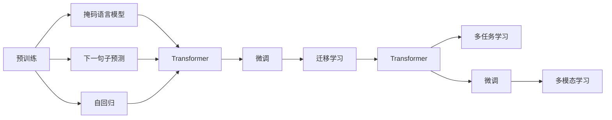

                 

# LLM生态演进:从芽到枝繁叶茂

> 关键词：

## 1. 背景介绍

### 1.1 问题由来
人工智能（AI）正迅速改变着我们生活的方方面面，而其中最引人瞩目的进展之一即是语言模型（Language Model, LM）的突破。近年来，大规模语言模型（Large Language Models, LLMs）如OpenAI的GPT-3、Google的BERT和T5等，因其卓越的性能，引起了广泛的研究和应用热潮。这些模型基于海量的无标签文本数据预训练，能够捕捉到丰富的语言知识，通过微调（Fine-Tuning）可以适应多种下游任务，如问答、翻译、摘要等。然而，如此蓬勃发展的背后，是开发者、研究人员及产业界的共同努力，以及对新兴生态系统的不断打磨。本文将回顾和探讨这一生态演进过程，从早期的芽苗初露，到如今的枝繁叶茂，进而展望其未来的成长方向。

### 1.2 问题核心关键点
LLM生态演进的核心在于其不断地自我更新、优化与拓展。这一过程包括了：
- 预训练模型的发展与演进。
- 微调技术的提升与多样化。
- 硬件资源的优化与适配。
- 应用场景的拓展与创新。

这些关键点不仅推动了模型的性能提升，也促进了其在更多行业和场景中的落地应用。

### 1.3 问题研究意义
回顾和分析LLM生态演进，有助于：
- 了解技术演进的脉络与背后的驱动因素。
- 掌握当前技术的优缺点，指导未来研究与开发。
- 预测未来趋势，为产业应用提供指导。

## 2. 核心概念与联系

### 2.1 核心概念概述

为更好地理解LLM生态演进，本节将介绍几个核心概念：

- **预训练**（Pre-training）：指在大规模无标签数据上训练模型，使其能够泛化到各种任务。例如，使用掩码语言模型（Masked Language Model, MLM）、下一句子预测（Next Sentence Prediction, NSP）等自监督任务训练。
- **微调**（Fine-tuning）：指在预训练模型的基础上，利用有标签数据进行小规模任务特定的训练，优化模型性能。微调通常涉及调整顶层结构或添加特定的任务适配层。
- **迁移学习**（Transfer Learning）：指将一个领域学到的知识迁移到另一个相关领域，以提升模型在新任务上的表现。预训练-微调即是一种迁移学习方法。
- **Transformer**：一种深度学习架构，在NLP领域中占据主导地位，具有高效的自注意力机制，广泛用于构建预训练模型。
- **BERT**（Bidirectional Encoder Representations from Transformers）：由Google开发，采用了双向Transformer编码器，在预训练时使用了掩码语言模型和下一句子预测任务，广泛应用于NLP任务中。
- **GPT**（Generative Pre-trained Transformer）：OpenAI开发的预训练模型系列，通过自回归的方式预测下一词或下一句，用于生成式任务如文本生成和对话生成。
- **MAML**（Meta-Learning）：一种元学习框架，用于在有限的训练数据上，学习一种适应新任务的快速适应能力。
- **Scikit-learn**：Python的一个机器学习库，包含大量常用的模型和算法，用于处理和训练各种任务。

这些概念构成了LLM生态演进的基础，彼此之间紧密联系，共同推动着生态系统的进步。

### 2.2 核心概念原理和架构的 Mermaid 流程图



这个流程图展示了从预训练到微调，再到迁移学习、多任务学习、多模态学习等LLM生态演进的主要步骤。

## 3. 核心算法原理 & 具体操作步骤

### 3.1 算法原理概述

LLM的演进核心在于预训练模型的不断优化与微调技术的发展。其基本原理如下：

- 在大规模无标签数据上训练预训练模型，学习语言的一般规律。
- 通过微调，将模型应用于特定任务，进一步优化模型。
- 利用迁移学习，将已学知识迁移到新任务中，提升模型泛化能力。
- 引入多模态学习、多任务学习等，进一步丰富模型的应用场景与能力。

预训练模型通常采用Transformer架构，结合掩码语言模型、自回归、双向编码器等自监督学习方法，在大规模无标签数据上预训练。而微调则通过下游任务的有标签数据进行，通常包括重新训练顶层网络、添加特定的任务适配层、调整超参数等。

### 3.2 算法步骤详解

以下是基于监督学习的LLM微调的基本步骤：

1. **数据准备**：
   - 收集下游任务的标注数据，将数据划分为训练集、验证集和测试集。
   - 数据预处理，包括分词、编码、归一化等操作。

2. **模型初始化**：
   - 使用预训练模型或自监督模型作为初始模型。
   - 在模型顶层添加特定的任务适配层。

3. **模型微调**：
   - 选择适当的优化器，如Adam、SGD等。
   - 设定合适的学习率和正则化参数。
   - 在训练集上进行前向传播和反向传播，更新模型参数。
   - 在验证集上定期评估模型性能，避免过拟合。

4. **模型评估**：
   - 在测试集上评估模型性能，对比微调前后的效果。
   - 分析模型的优缺点，进行优化迭代。

### 3.3 算法优缺点

基于监督学习的LLM微调方法具有以下优点：

- **高效性**：仅需少量标注数据，可以快速适应新任务。
- **泛化能力强**：利用预训练的知识，提升模型在新数据上的泛化能力。
- **易用性**：模型结构简单，易于实现和调试。

但其缺点也显而易见：

- **依赖标注数据**：微调效果依赖标注数据的数量与质量。
- **计算资源需求高**：大规模预训练模型与微调所需的计算资源巨大。
- **模型复杂度**：微调后的模型往往包含多个层次，复杂度高，调试难度大。
- **模型鲁棒性**：模型对输入数据的微小变化敏感，易过拟合。

### 3.4 算法应用领域

基于监督学习的LLM微调方法广泛用于以下几个领域：

- **自然语言理解与生成**：如情感分析、文本分类、文本摘要、问答系统、机器翻译等。
- **智能客服**：通过对话模型解答客户咨询，提供24小时不间断服务。
- **金融舆情监测**：对金融市场舆论进行监测，预警潜在风险。
- **个性化推荐**：根据用户行为数据，推荐个性化内容。
- **多模态学习**：结合文本、图像、音频等多模态数据，提升模型能力。

## 4. 数学模型和公式 & 详细讲解 & 举例说明

### 4.1 数学模型构建

基于监督学习的LLM微调，数学模型通常采用二分类交叉熵损失函数：

$$
\mathcal{L} = -\frac{1}{N}\sum_{i=1}^N(y_i \log p(y_i|x_i) + (1-y_i) \log (1-p(y_i|x_i)))
$$

其中，$y_i$为样本的标签，$p(y_i|x_i)$为模型预测概率。

### 4.2 公式推导过程

以二分类任务为例，推导交叉熵损失函数：

1. **预测概率**：使用softmax函数计算预测概率。
2. **损失函数**：将真实标签与预测概率的交叉熵作为损失函数。
3. **梯度计算**：计算损失函数对模型参数的梯度。

具体推导过程如下：

$$
p(y_i|x_i) = \frac{\exp(\mathbf{W}^T \mathbf{h}(x_i) + b)}{\sum_j \exp(\mathbf{W}^T \mathbf{h}(x_i) + b_j)}
$$

$$
\mathcal{L} = -\frac{1}{N}\sum_{i=1}^N[y_i \log p(y_i|x_i) + (1-y_i) \log (1-p(y_i|x_i))]
$$

$$
\frac{\partial \mathcal{L}}{\partial \mathbf{W}} = -\frac{1}{N}\sum_{i=1}^N[y_i (\mathbf{h}(x_i) - \mathbf{p}(y_i|x_i)) \mathbf{h}(x_i)^T]
$$

其中，$\mathbf{h}(x_i)$为输入$x_i$的表示，$\mathbf{p}(y_i|x_i)$为预测概率向量。

### 4.3 案例分析与讲解

以情感分析为例，分析基于监督学习的LLM微调过程：

1. **数据准备**：收集电影评论数据集，分为训练集、验证集和测试集。
2. **模型初始化**：使用预训练的BERT模型，在顶层添加全连接层和softmax层。
3. **模型微调**：设定学习率为2e-5，在训练集上进行微调。
4. **模型评估**：在测试集上评估模型精度，对比微调前后的结果。

## 5. 项目实践：代码实例和详细解释说明

### 5.1 开发环境搭建

进行LLM微调开发，需要搭建Python环境，安装必要的库和工具。具体步骤如下：

1. 安装Python 3.x及依赖库。
2. 安装PyTorch和Transformers库。
3. 安装Scikit-learn库。
4. 设置环境变量，配置GPU/TPU等硬件。

### 5.2 源代码详细实现

以下是一个简单的情感分析微调示例代码：

```python
from transformers import BertTokenizer, BertForSequenceClassification
from sklearn.model_selection import train_test_split
import torch
import pandas as pd
import numpy as np
import torch.nn as nn
import torch.optim as optim

# 数据准备
df = pd.read_csv('movie_reviews.csv')
X = df['text'].tolist()
y = df['label'].tolist()

# 分词
tokenizer = BertTokenizer.from_pretrained('bert-base-uncased')
X = [tokenizer.encode(text, add_special_tokens=True) for text in X]
X = [torch.tensor(x, dtype=torch.long) for x in X]

# 划分数据集
X_train, X_test, y_train, y_test = train_test_split(X, y, test_size=0.2)

# 模型初始化
model = BertForSequenceClassification.from_pretrained('bert-base-uncased', num_labels=2)
device = torch.device('cuda' if torch.cuda.is_available() else 'cpu')
model.to(device)

# 模型微调
optimizer = torch.optim.Adam(model.parameters(), lr=2e-5)
loss_fn = nn.CrossEntropyLoss()
criterion = nn.CrossEntropyLoss()

def train_epoch(model, data, batch_size, optimizer):
    model.train()
    losses = []
    for batch in data:
        input_ids = batch[0].to(device)
        attention_mask = batch[1].to(device)
        labels = batch[2].to(device)
        outputs = model(input_ids, attention_mask=attention_mask, labels=labels)
        loss = criterion(outputs, labels)
        optimizer.zero_grad()
        loss.backward()
        optimizer.step()
        losses.append(loss.item())
    return np.mean(losses)

# 训练
train_loader = DataLoader(X_train, batch_size=16, shuffle=True)
val_loader = DataLoader(X_test, batch_size=16, shuffle=True)

num_epochs = 5
for epoch in range(num_epochs):
    train_loss = train_epoch(model, train_loader, batch_size, optimizer)
    val_loss = train_epoch(model, val_loader, batch_size, optimizer)
    print(f"Epoch {epoch+1}, train loss: {train_loss:.3f}, val loss: {val_loss:.3f}")

# 模型评估
val_loader = DataLoader(X_test, batch_size=16, shuffle=True)

model.eval()
with torch.no_grad():
    predictions = []
    labels = []
    for batch in val_loader:
        input_ids = batch[0].to(device)
        attention_mask = batch[1].to(device)
        labels = batch[2].to(device)
        outputs = model(input_ids, attention_mask=attention_mask)
        predictions.append(outputs.argmax(dim=1).cpu().numpy())
        labels.append(labels.cpu().numpy())

print(classification_report(labels, predictions))
```

### 5.3 代码解读与分析

**情感分析微调代码分析**：

- **数据准备**：读取电影评论数据集，进行预处理，包括分词、编码、划分数据集。
- **模型初始化**：使用预训练的BERT模型，并添加全连接层和softmax层。
- **模型微调**：在训练集上进行微调，设定学习率，使用Adam优化器。
- **模型评估**：在测试集上评估模型精度，并输出分类报告。

## 6. 实际应用场景

### 6.1 智能客服系统

智能客服系统通过微调对话模型，实现自然语言处理与理解，自动解答客户咨询。系统通过对话历史进行学习，生成恰当的回复，大幅提升客服响应速度与质量，降低人力成本。

### 6.2 金融舆情监测

金融舆情监测系统通过微调文本分类模型，实时监测金融市场舆情，及时发现负面信息，帮助金融机构规避风险。系统能够对新闻、评论、社交媒体等文本进行自动分类，评估舆情变化趋势。

### 6.3 个性化推荐系统

个性化推荐系统通过微调生成式模型，生成个性化推荐内容，提升用户体验。系统根据用户浏览记录和行为数据，生成定制化推荐列表，提升点击率和转化率。

### 6.4 未来应用展望

基于LLM的微调技术，未来将在更多领域得到应用，为各行各业带来变革性影响：

- **智慧医疗**：微调医疗问答、病历分析、药物研发等应用，提升医疗服务的智能化水平。
- **智能教育**：微调作业批改、学情分析、知识推荐等应用，因材施教，促进教育公平。
- **智慧城市治理**：微调城市事件监测、舆情分析、应急指挥等应用，提高城市管理的自动化和智能化水平。

## 7. 工具和资源推荐

### 7.1 学习资源推荐

- **《深度学习》课程**：斯坦福大学开设的深度学习课程，涵盖深度学习基础与实践。
- **《Transformer模型》系列博客**：由大模型技术专家撰写，深入浅出介绍Transformer模型原理与微调技术。
- **HuggingFace官方文档**：提供丰富的预训练模型和微调样例，是学习的宝贵资源。
- **CLUE开源项目**：包含中文NLP数据集，可用于微调中文大模型。

### 7.2 开发工具推荐

- **PyTorch**：Python深度学习框架，支持动态计算图，适合快速迭代研究。
- **TensorFlow**：Google开源深度学习框架，适合大规模工程应用。
- **Transformers**：HuggingFace开发的NLP工具库，提供预训练模型和微调支持。
- **Weights & Biases**：实验跟踪工具，记录和可视化模型训练过程。
- **TensorBoard**：TensorFlow配套的可视化工具，监测模型训练状态。

### 7.3 相关论文推荐

- **BERT: Pre-training of Deep Bidirectional Transformers for Language Understanding**：介绍BERT模型及其预训练-微调方法。
- **Attention is All You Need**：提出Transformer模型，奠定NLP大模型基础。
- **Parameter-Efficient Transfer Learning for NLP**：提出Adapter等参数高效微调方法，减少微调对计算资源的需求。
- **Scikit-learn官方文档**：Python机器学习库，包含多种模型和算法。

## 8. 总结：未来发展趋势与挑战

### 8.1 总结

本文回顾了大语言模型演进过程中关键的概念与技术，详细讲解了预训练、微调和迁移学习等核心算法原理与操作步骤。通过项目实践和案例分析，展示了微调技术在不同实际场景中的应用。最后，结合当前研究进展，探讨了未来发展趋势与面临的挑战。

通过本文的全面梳理，我们能够更清晰地理解LLM生态演进的脉络，掌握其优缺点和应用方向。面向未来，我们需持续关注模型的性能提升、硬件资源的优化以及多模态、多任务等前沿技术的进展，才能更好地推动LLM技术的发展。

### 8.2 未来发展趋势

未来，大语言模型将在以下几个方向进一步发展：

- **模型规模的持续增大**：随着算力的提升和数据的增加，预训练模型的参数量将进一步增大，提升模型的泛化能力和理解能力。
- **微调方法的不断创新**：出现更多参数高效的微调方法，如Adapter、Prefix等，以减少计算资源消耗。
- **多模态与多任务学习**：结合文本、图像、语音等多模态数据，拓展模型应用场景，提升模型的综合能力。
- **持续学习与终身学习**：模型需要持续学习新数据，避免过拟合，保持性能的稳定性。
- **可解释性与伦理考量**：提升模型的可解释性，确保输出符合伦理道德规范，增强系统的信任度。

### 8.3 面临的挑战

尽管LLM取得了显著进展，但依然面临诸多挑战：

- **标注数据的依赖**：微调效果依赖高质量标注数据，获取标注数据成本较高。
- **模型鲁棒性不足**：模型对新数据的泛化能力有限，容易受到输入噪声的影响。
- **计算资源消耗大**：预训练和微调所需资源巨大，需优化硬件资源使用。
- **可解释性不足**：模型如黑盒系统，难以解释内部决策过程，影响应用的可信度。
- **安全与隐私问题**：模型可能学习有害信息，输出存在安全隐患，需加强监管。

### 8.4 研究展望

为解决上述挑战，未来研究需要在以下几个方面寻求突破：

- **无监督与半监督学习**：探索无标注数据的利用方式，降低对标注数据的依赖。
- **参数高效的微调方法**：开发更多参数高效的微调算法，提升模型计算效率。
- **元学习与自适应学习**：引入元学习框架，提升模型在新任务上的适应能力。
- **多模态学习**：结合多模态数据，提升模型理解与生成能力。
- **因果推断与博弈论**：引入因果推断与博弈论工具，增强模型决策的合理性与鲁棒性。
- **可解释性与伦理导向**：引入可解释性模型，确保输出符合伦理道德规范。

## 9. 附录：常见问题与解答

### Q1：如何选择合适的预训练模型？

A: 选择合适的预训练模型需要考虑任务的复杂度、数据的规模和特征等因素。一般建议选择与任务相关的预训练模型，如情感分析选择BERT，对话生成选择GPT。

### Q2：预训练模型和微调模型的区别是什么？

A: 预训练模型在大规模无标签数据上进行训练，学习到语言的一般规律。微调模型在预训练模型的基础上，利用有标签数据进行优化，适应特定任务。预训练模型可以通用，微调模型更具体化。

### Q3：微调过程中如何避免过拟合？

A: 避免过拟合的方法包括：
1. 数据增强：通过回译、近义替换等方式扩充训练集。
2. 正则化：使用L2正则、Dropout等技术。
3. 早停策略：在验证集上评估性能，提前停止训练。
4. 参数共享：只微调顶层结构，保留底层的通用知识。

### Q4：微调模型在生产环境中的部署策略是什么？

A: 微调模型在生产环境中的部署策略包括：
1. 模型裁剪：去除不必要的层和参数，减小模型尺寸。
2. 量化加速：将浮点模型转为定点模型，压缩存储空间。
3. 服务化封装：将模型封装为标准化服务接口。
4. 弹性伸缩：根据请求流量动态调整资源配置。
5. 监控告警：实时采集系统指标，设置异常告警阈值。

### Q5：如何在LLM微调过程中提高模型的泛化能力？

A: 提高模型泛化能力的方法包括：
1. 数据多样性：增加训练集的多样性，避免数据过拟合。
2. 正则化：使用L2正则、Dropout等技术，减少过拟合。
3. 迁移学习：利用预训练模型学习到的知识，提升新任务的泛化能力。
4. 多任务学习：结合多个任务训练模型，提高模型的泛化能力。

---

作者：禅与计算机程序设计艺术 / Zen and the Art of Computer Programming

