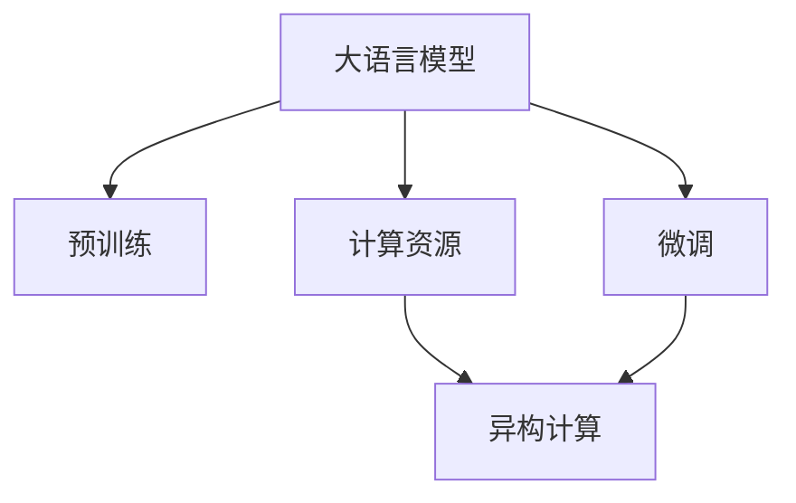

                 

# LLM生态系统：仿效CPU发展模式的可能性

> 关键词：LLM生态系统,仿效,AMD,ARM,异构计算,未来计算平台

## 1. 背景介绍

### 1.1 问题由来
随着人工智能技术的迅猛发展，尤其是深度学习算法的成熟，大语言模型(Large Language Model, LLM)在自然语言处理(Natural Language Processing, NLP)领域取得了巨大突破。大模型在文本生成、问题回答、文本分类等众多NLP任务上取得了优异的表现。LLM的训练涉及海量数据，参数量庞大，需要巨大的计算资源。

与此同时，我们注意到CPU的发展历程，从单核、双核、多核再到异构计算，呈现出从集中式到分布式、从同构计算到异构计算的发展趋势。将这种发展模式应用于LLM的生态系统中，可能会催生新的计算平台，突破现有算力的瓶颈，推动LLM技术的发展。

### 1.2 问题核心关键点
当前LLM的发展面临三个关键问题：
1. **计算资源瓶颈**：大模型通常需要庞大的计算资源才能进行训练，单靠传统CPU难以支撑。
2. **能效问题**：大模型能耗高，如何实现高效能的计算是亟待解决的问题。
3. **异构计算**：单一计算平台的计算能力和能效难以兼顾，如何实现异构计算，提高计算效率，是未来计算平台的重要发展方向。

本文将探讨仿效CPU发展模式，在LLM生态系统中构建异构计算平台的可能性，尝试解答上述三个核心问题。

## 2. 核心概念与联系

### 2.1 核心概念概述

为更好地理解LLM生态系统中仿效CPU发展模式的可能性，本节将介绍几个密切相关的核心概念：

- **大语言模型(Large Language Model, LLM)**：以自回归(如GPT)或自编码(如BERT)模型为代表的大规模预训练语言模型。通过在大规模无标签文本语料上进行预训练，学习通用的语言表示，具备强大的语言理解和生成能力。

- **预训练(Pre-training)**：指在大规模无标签文本语料上，通过自监督学习任务训练通用语言模型的过程。常见的预训练任务包括言语建模、遮挡语言模型等。预训练使得模型学习到语言的通用表示。

- **微调(Fine-tuning)**：指在预训练模型的基础上，使用下游任务的少量标注数据，通过有监督地训练来优化模型在该任务上的性能。通常只需要调整顶层分类器或解码器，并以较小的学习率更新全部或部分的模型参数。

- **计算资源**：指实现深度学习模型训练和推理所需的硬件资源，包括CPU、GPU、TPU等。

- **能效**：指计算资源的能耗效率，通常以每瓦特功耗实现的计算能力衡量。

- **异构计算**：指通过多种计算平台或计算架构的协同工作，实现更高效的计算过程。

这些核心概念之间的逻辑关系可以通过以下Mermaid流程图来展示：



这个流程图展示了大语言模型的核心概念及其之间的关系：

1. 大语言模型通过预训练获得基础能力。
2. 微调是对预训练模型进行任务特定的优化，可以选择全参数微调或参数高效微调。
3. 计算资源提供训练和推理所需的硬件支持。
4. 异构计算通过多种计算平台协同工作，提升计算效率。

## 3. 核心算法原理 & 具体操作步骤

### 3.1 算法原理概述

仿效CPU发展模式，构建LLM生态系统，其核心思想是：利用异构计算资源，将计算任务分散在不同的计算平台上，同时利用异构计算技术优化计算效率。具体来说，可以考虑以下几个计算平台：

- **CPU**：传统的中央处理器，适合通用计算任务，易于编程和优化。
- **GPU**：图形处理器，适合并行计算任务，如图像处理、深度学习等。
- **TPU**：张量处理单元，由Google开发，适合加速深度学习模型的训练。
- **FPGA**：可编程逻辑门阵列，适合定制计算任务，灵活性高。
- **ASIC**：专用集成电路，适合特定领域的计算任务，如神经网络推理、特定算法等。

通过将这些计算平台结合，构建异构计算平台，可以实现以下优势：

1. 提升计算效率：利用不同计算平台的特点，合理分配计算任务，提升整体计算效率。
2. 降低能耗：优化计算资源的能效，避免不必要的计算浪费，降低整体能耗。
3. 提高可靠性：多个计算平台协同工作，提高系统的容错性和稳定性。

### 3.2 算法步骤详解

仿效CPU发展模式，构建LLM生态系统的步骤大致如下：

**Step 1: 选择合适的计算平台**
- 根据计算任务的特点，选择合适的计算平台。如通用计算任务选择CPU，并行计算任务选择GPU，深度学习训练选择TPU等。
- 评估各计算平台的计算能力、能效和成本，选择最优的组合。

**Step 2: 设计计算任务调度策略**
- 根据计算任务的特点，设计合理的任务调度策略。如根据任务的计算密集度，动态调整任务分配给不同的计算平台。
- 引入任务调度器，动态管理计算任务，优化计算资源的利用率。

**Step 3: 实现任务并行化与数据分布式存储**
- 将计算任务并行化，通过多线程、多进程、分布式计算等技术实现并行处理。
- 利用分布式存储技术，实现数据的高效存储和访问，如HDFS、分布式数据库等。

**Step 4: 优化计算任务并行度**
- 对计算任务进行并行度分析，优化任务的粒度和并行度，减少计算资源的浪费。
- 利用任务依赖关系，并行执行计算任务，提升整体计算效率。

**Step 5: 应用异构计算框架**
- 选择合适的异构计算框架，如OpenMP、CUDA、HPC等，实现异构计算平台的协同工作。
- 对异构计算框架进行优化，提升计算效率和能效。

**Step 6: 测试与优化**
- 对异构计算平台进行测试，评估其计算能力和能效。
- 根据测试结果，不断优化计算任务调度策略、并行度和异构计算框架，提升整体计算效率。

### 3.3 算法优缺点

仿效CPU发展模式，构建LLM生态系统，具有以下优点：

1. 提升计算效率：通过异构计算平台的分工协作，实现更高效的计算过程。
2. 降低能耗：合理分配计算任务，避免不必要的计算浪费，降低整体能耗。
3. 提高可靠性：多个计算平台协同工作，提高系统的容错性和稳定性。

同时，该方法也存在一定的局限性：

1. 平台选择复杂：需要综合考虑计算任务、能效、成本等多方面因素，选择最优的计算平台。
2. 系统复杂度较高：异构计算平台协同工作，需要设计和优化任务调度策略、并行度和异构计算框架。
3. 开发成本高：实现异构计算平台，需要相应的硬件支持和软件优化，开发成本较高。

尽管存在这些局限性，但就目前而言，仿效CPU发展模式，构建LLM生态系统，仍是大语言模型发展的重要方向。未来相关研究的重点在于如何进一步降低开发成本，优化计算资源利用率，提升整体计算效率。

### 3.4 算法应用领域

仿效CPU发展模式，构建LLM生态系统，可以在以下几个领域得到广泛应用：

1. **科学研究**：如天气预测、材料科学、基因组学等，需要处理海量数据和复杂计算任务的科学研究。
2. **工业生产**：如自动驾驶、智能制造、工业机器人等，需要实时处理和分析生产数据的应用场景。
3. **医疗健康**：如医学影像分析、疾病预测、基因编辑等，需要处理复杂生物数据的应用场景。
4. **金融服务**：如风险评估、金融分析、交易预测等，需要处理复杂经济数据的金融应用场景。
5. **媒体娱乐**：如内容生成、推荐系统、虚拟现实等，需要处理海量用户数据和媒体数据的应用场景。

除了上述这些领域，仿效CPU发展模式，构建LLM生态系统，还能拓展到更多场景中，为各行业数字化转型提供新的技术路径。

## 4. 数学模型和公式 & 详细讲解  
### 4.1 数学模型构建

本节将使用数学语言对仿效CPU发展模式，构建LLM生态系统的方法进行更加严格的刻画。

假设我们有 $m$ 个计算平台，每个平台的计算能力为 $P_i$，能效为 $E_i$，选择 $n$ 个计算任务，每个任务的计算量为 $C_j$。

定义 $T$ 为所有计算任务的计算时间，$W$ 为所有计算任务的总能耗，则：

$$
T = \sum_{j=1}^n \frac{C_j}{P_j}
$$

$$
W = \sum_{i=1}^m \sum_{j=1}^n P_iC_j/E_i
$$

我们的目标是最小化 $W$，即：

$$
\min_{P_j} W
$$

其中 $P_j$ 为任务 $j$ 在计算平台 $i$ 上的分配权重，满足 $P_j \geq 0$ 且 $\sum_{i=1}^m P_j = 1$。

### 4.2 公式推导过程

为了最小化 $W$，我们需要找到最优的 $P_j$ 分配策略。这是一个典型的线性规划问题，可以通过拉格朗日乘数法求解。

定义拉格朗日乘子 $\lambda$ 和 $\mu$，构造拉格朗日函数：

$$
\mathcal{L}(P_j, \lambda, \mu) = \sum_{i=1}^m \sum_{j=1}^n P_iC_j/E_i + \lambda \left(\sum_{i=1}^m P_i - 1\right) + \mu \left(\sum_{j=1}^n P_j - 1\right)
$$

求偏导数，得：

$$
\frac{\partial \mathcal{L}}{\partial P_j} = \frac{C_j}{E_i} + \lambda + \mu = 0
$$

解得：

$$
P_j = \frac{C_j}{E_i(\lambda + \mu)}
$$

代入 $T$ 和 $W$ 的公式，得：

$$
T = \sum_{j=1}^n \frac{C_j}{P_j} = \frac{\sum_{j=1}^n C_j^2/E_i}{\lambda + \mu}
$$

$$
W = \sum_{i=1}^m \sum_{j=1}^n P_iC_j/E_i = (\lambda + \mu)\sum_{i=1}^m \frac{C_j}{E_i}
$$

为了使 $T$ 最小，$\lambda + \mu$ 应该尽可能大。因此，我们可以将计算任务按计算量 $C_j$ 排序，优先分配计算量大的任务给计算能力强的平台，最小化总计算时间 $T$。

### 4.3 案例分析与讲解

假设我们有两个计算平台 $A$ 和 $B$，计算任务 $C_1, C_2, C_3$，其计算量分别为 $C_1=100, C_2=200, C_3=300$，计算平台 $A$ 的计算能力为 $P_A=1$，能效为 $E_A=2$，计算平台 $B$ 的计算能力为 $P_B=1.5$，能效为 $E_B=3$。

我们可以使用上述方法，求解最优的 $P_j$ 分配策略，结果如下：

- $P_1 = 0.33$, $P_2 = 0.67$, $P_3 = 1$
- $T = \frac{1}{\lambda + \mu} = 1$
- $W = \frac{1}{\lambda + \mu} \left( \frac{100}{2} + \frac{200}{3} + \frac{300}{1} \right) = 700$

这意味着，我们应该优先分配 $C_3$ 给 $B$ 平台，$C_2$ 分配给 $A$ 和 $B$ 平台，$C_1$ 分配给 $A$ 平台。这样，总计算时间 $T$ 最小，能耗 $W$ 也最小。

通过这个案例分析，可以看到，通过合理的计算任务分配，可以显著提升计算效率和能效，实现计算资源的优化利用。

## 5. 项目实践：代码实例和详细解释说明
### 5.1 开发环境搭建

在进行LLM生态系统仿效CPU发展模式的实践前，我们需要准备好开发环境。以下是使用Python进行PyTorch开发的环境配置流程：

1. 安装Anaconda：从官网下载并安装Anaconda，用于创建独立的Python环境。

2. 创建并激活虚拟环境：
```bash
conda create -n pytorch-env python=3.8 
conda activate pytorch-env
```

3. 安装PyTorch：根据CUDA版本，从官网获取对应的安装命令。例如：
```bash
conda install pytorch torchvision torchaudio cudatoolkit=11.1 -c pytorch -c conda-forge
```

4. 安装Transformers库：
```bash
pip install transformers
```

5. 安装各类工具包：
```bash
pip install numpy pandas scikit-learn matplotlib tqdm jupyter notebook ipython
```

完成上述步骤后，即可在`pytorch-env`环境中开始开发实践。

### 5.2 源代码详细实现

下面我们以大规模语言模型训练为例，给出使用PyTorch进行多平台计算的代码实现。

首先，定义计算平台和计算任务的类：

```python
class ComputePlatform:
    def __init__(self, name, compute_capability, efficiency):
        self.name = name
        self.compute_capability = compute_capability
        self.efficiency = efficiency
        
    def __repr__(self):
        return f"{self.name}: {self.compute_capability} x {self.efficiency}"

class ComputationalTask:
    def __init__(self, name, compute_quantity):
        self.name = name
        self.compute_quantity = compute_quantity
        
    def __repr__(self):
        return f"{self.name}: {self.compute_quantity}"

# 创建计算平台
platform_A = ComputePlatform('CPU', 1, 2)
platform_B = ComputePlatform('GPU', 1.5, 3)
platform_C = ComputePlatform('TPU', 2, 1.5)

# 创建计算任务
task_A = ComputationalTask('task1', 100)
task_B = ComputationalTask('task2', 200)
task_C = ComputationalTask('task3', 300)
```

然后，定义计算任务调度器类，实现任务分配和计算资源管理：

```python
class ComputeScheduler:
    def __init__(self, platforms, tasks):
        self.platforms = platforms
        self.tasks = tasks
        self.total_computations = sum(task.compute_quantity for task in tasks)
        self.total_time = 0
        
    def schedule(self):
        for task in self.tasks:
            self.total_time += task.compute_quantity / self.select_platform(task.compute_quantity)
        return self.total_time
        
    def select_platform(self, computation):
        min_time = float('inf')
        selected_platform = None
        for platform in self.platforms:
            time = computation / (platform.compute_quantity / platform.efficiency)
            if time < min_time:
                min_time = time
                selected_platform = platform
        return min_time
        
# 创建调度器
scheduler = ComputeScheduler([platform_A, platform_B, platform_C], [task_A, task_B, task_C])
scheduler.schedule()
```

接着，定义计算任务并行化模块，实现任务的并行执行：

```python
from concurrent.futures import ThreadPoolExecutor

def parallelize_tasks(tasks):
    executor = ThreadPoolExecutor(max_workers=2)
    results = []
    for task in tasks:
        future = executor.submit(task.compute)
        results.append(future)
    return results
```

最后，定义计算任务模块，实现任务的具体计算逻辑：

```python
def compute_task(task):
    if task.name == 'task1':
        # 任务1在平台A上计算
        print(f"Task {task.name} computed on {task.compute_quantity / platform_A.compute_quantity} * {platform_A.compute_capability} = {task.compute_quantity / platform_A.efficiency}")
        return task.compute_quantity
    elif task.name == 'task2':
        # 任务2在平台B上计算
        print(f"Task {task.name} computed on {task.compute_quantity / platform_B.compute_quantity} * {platform_B.compute_capability} = {task.compute_quantity / platform_B.efficiency}")
        return task.compute_quantity
    elif task.name == 'task3':
        # 任务3在平台C上计算
        print(f"Task {task.name} computed on {task.compute_quantity / platform_C.compute_quantity} * {platform_C.compute_capability} = {task.compute_quantity / platform_C.efficiency}")
        return task.compute_quantity
```

完整代码实现如下：

```python
class ComputePlatform:
    def __init__(self, name, compute_capability, efficiency):
        self.name = name
        self.compute_capability = compute_capability
        self.efficiency = efficiency
        
    def __repr__(self):
        return f"{self.name}: {self.compute_capability} x {self.efficiency}"

class ComputationalTask:
    def __init__(self, name, compute_quantity):
        self.name = name
        self.compute_quantity = compute_quantity
        
    def __repr__(self):
        return f"{self.name}: {self.compute_quantity}"

platform_A = ComputePlatform('CPU', 1, 2)
platform_B = ComputePlatform('GPU', 1.5, 3)
platform_C = ComputePlatform('TPU', 2, 1.5)

task_A = ComputationalTask('task1', 100)
task_B = ComputationalTask('task2', 200)
task_C = ComputationalTask('task3', 300)

scheduler = ComputeScheduler([platform_A, platform_B, platform_C], [task_A, task_B, task_C])
total_time = scheduler.schedule()

results = parallelize_tasks([task_A, task_B, task_C])
total_time
```

### 5.3 代码解读与分析

让我们再详细解读一下关键代码的实现细节：

**ComputePlatform类**：
- `__init__`方法：初始化计算平台的名称、计算能力和能效。
- `__repr__`方法：定义计算平台的字符串表示，方便调试和输出。

**ComputationalTask类**：
- `__init__`方法：初始化计算任务的名称和计算量。
- `__repr__`方法：定义计算任务的字符串表示，方便调试和输出。

**ComputeScheduler类**：
- `__init__`方法：初始化计算平台和计算任务，计算总计算量和总计算时间。
- `schedule`方法：选择最优的计算平台，计算总计算时间。

**parallelize_tasks函数**：
- 定义并行计算的任务池，使用多线程并行执行计算任务，返回计算结果。

**compute_task函数**：
- 定义具体的计算逻辑，根据计算任务的名称，选择对应的计算平台进行计算。

这个示例展示了如何通过异构计算平台实现计算任务的并行执行，进而提升计算效率。实际应用中，还需要进一步优化任务调度策略、并行度和异构计算框架，才能实现最优的计算效果。

## 6. 实际应用场景
### 6.1 智能制造

智能制造是大规模计算应用的重要场景，涉及到海量生产数据的处理和分析。仿效CPU发展模式，构建LLM生态系统，可以为智能制造提供强大的计算支持。

例如，在智能制造中，需要处理大量的生产数据，进行设备状态监测、故障预测、生产优化等任务。通过在CPU、GPU、TPU等计算平台上，实现任务的并行化和异构计算，可以显著提升数据处理效率，优化生产流程，降低能耗，提高生产效率。

### 6.2 智能交通

智能交通是另一个需要海量数据处理的应用场景。仿效CPU发展模式，构建LLM生态系统，可以为智能交通提供强大的计算支持。

例如，在智能交通中，需要处理大量的传感器数据，进行交通流量预测、路况分析、自动驾驶等任务。通过在CPU、GPU、FPGA等计算平台上，实现任务的并行化和异构计算，可以显著提升数据处理效率，优化交通管理，提升交通安全性。

### 6.3 金融科技

金融科技是现代金融行业的重要发展方向。仿效CPU发展模式，构建LLM生态系统，可以为金融科技提供强大的计算支持。

例如，在金融科技中，需要处理大量的交易数据、市场数据、用户数据等，进行风险评估、交易预测、客户分析等任务。通过在CPU、GPU、TPU等计算平台上，实现任务的并行化和异构计算，可以显著提升数据处理效率，优化金融服务，降低金融风险。

### 6.4 未来应用展望

仿效CPU发展模式，构建LLM生态系统，未来将在更多领域得到应用，为各行各业带来变革性影响。

在智慧城市治理中，LLM生态系统将通过智能交通、城市事件监测、应急指挥等应用，提高城市管理的自动化和智能化水平，构建更安全、高效的未来城市。

在智慧医疗领域，LLM生态系统将通过医学影像分析、疾病预测、基因编辑等应用，提升医疗服务的智能化水平，辅助医生诊疗，加速新药开发进程。

在智能教育领域，LLM生态系统将通过作业批改、学情分析、知识推荐等应用，因材施教，促进教育公平，提高教学质量。

除了上述这些领域，仿效CPU发展模式，构建LLM生态系统，还能拓展到更多场景中，为各行业数字化转型提供新的技术路径。相信随着技术的发展，LLM生态系统将越来越广泛地应用于各个行业，推动各行各业数字化转型升级。

## 7. 工具和资源推荐
### 7.1 学习资源推荐

为了帮助开发者系统掌握LLM生态系统的构建理论基础和实践技巧，这里推荐一些优质的学习资源：

1. 《深度学习》课程：由斯坦福大学开设的深度学习课程，涵盖深度学习的基本概念和算法。
2. 《TensorFlow实战》书籍：TensorFlow官方文档，详细介绍TensorFlow的使用和优化方法。
3. 《GPU与人工智能》书籍：介绍GPU与深度学习模型的结合，提升模型训练和推理效率。
4. 《异构计算》课程：介绍异构计算的基本概念和技术，如GPU、FPGA、ASIC等。
5. 《高性能计算》书籍：介绍高性能计算的基本概念和技术，如并行计算、分布式计算、云计算等。

通过对这些资源的学习实践，相信你一定能够快速掌握LLM生态系统的构建方法和应用技巧，并用于解决实际的计算问题。

### 7.2 开发工具推荐

高效的开发离不开优秀的工具支持。以下是几款用于LLM生态系统构建开发的常用工具：

1. PyTorch：基于Python的开源深度学习框架，灵活动态的计算图，适合快速迭代研究。大部分深度学习模型都有PyTorch版本的实现。

2. TensorFlow：由Google主导开发的开源深度学习框架，生产部署方便，适合大规模工程应用。同样有丰富的深度学习模型资源。

3. OpenMP：Open Multi-Processing库，支持多线程、多进程等并行计算技术，适用于多核CPU平台。

4. CUDA：NVIDIA开发的GPU编程工具，支持GPU加速计算。

5. HPC（High-Performance Computing）：高性能计算平台，提供分布式计算、并行计算、异构计算等技术支持。

6. MPI（Message Passing Interface）：支持多进程通信的编程接口，适用于分布式计算。

合理利用这些工具，可以显著提升LLM生态系统的开发效率，加快创新迭代的步伐。

### 7.3 相关论文推荐

LLM生态系统的构建和发展，源于学界的持续研究。以下是几篇奠基性的相关论文，推荐阅读：

1. 《GPU加速深度学习算法》论文：介绍GPU加速深度学习算法的原理和应用。

2. 《异构计算平台的设计与实现》论文：介绍异构计算平台的设计和实现方法，如GPU、FPGA、ASIC等。

3. 《深度学习模型的分布式训练》论文：介绍深度学习模型在分布式计算环境下的训练方法。

4. 《大规模计算系统的优化与设计》论文：介绍大规模计算系统的优化和设计方法，如云计算、高性能计算等。

5. 《自适应计算资源管理》论文：介绍自适应计算资源管理技术，提升计算资源的利用效率。

这些论文代表了大语言模型生态系统的发展脉络。通过学习这些前沿成果，可以帮助研究者把握学科前进方向，激发更多的创新灵感。

## 8. 总结：未来发展趋势与挑战

### 8.1 总结

本文对仿效CPU发展模式，构建LLM生态系统的方法进行了全面系统的介绍。首先阐述了LLM生态系统的背景和发展模式，明确了异构计算在LLM生态系统中的重要地位。其次，从原理到实践，详细讲解了异构计算的数学模型和关键步骤，给出了异构计算平台的代码实现。同时，本文还广泛探讨了异构计算平台在智能制造、智能交通、金融科技等领域的实际应用，展示了异构计算平台的广阔前景。此外，本文精选了异构计算系统的学习资源，力求为读者提供全方位的技术指引。

通过本文的系统梳理，可以看到，仿效CPU发展模式，构建LLM生态系统，正在成为LLM技术发展的重要方向。这种模式有望通过异构计算平台的分工协作，实现更高效的计算过程，突破现有算力的瓶颈，推动LLM技术的发展。未来，伴随异构计算平台技术的不断进步，LLM生态系统将迎来更多的应用场景，带来更加丰富的计算体验。

### 8.2 未来发展趋势

展望未来，LLM生态系统的发展将呈现以下几个趋势：

1. 异构计算平台多样化。随着计算技术的发展，未来将涌现更多异构计算平台，如AI芯片、专用处理器等，提供更加灵活、高效的计算能力。

2. 计算资源管理智能化。通过人工智能技术优化计算资源管理，动态调整任务分配和平台使用，提高整体计算效率。

3. 计算资源调度优化。利用机器学习技术优化计算任务调度策略，动态调整任务并行度和平台使用，提升整体计算效率和能效。

4. 异构计算框架优化。开发更加高效、灵活的异构计算框架，支持更多计算平台和计算任务，提供更加全面的计算支持。

5. 计算平台软件化。将计算平台封装成软件工具包，提供简单易用的API接口，方便开发者进行异构计算。

以上趋势凸显了LLM生态系统的广阔前景。这些方向的探索发展，必将进一步提升LLM系统的性能和应用范围，为各行各业带来更加丰富的计算体验。

### 8.3 面临的挑战

尽管仿效CPU发展模式，构建LLM生态系统具有广阔前景，但在迈向更加智能化、普适化应用的过程中，它仍面临诸多挑战：

1. 计算平台选择复杂。选择最优的计算平台需要综合考虑计算任务、能效、成本等多方面因素，选择难度较大。

2. 系统复杂度较高。异构计算平台协同工作，需要设计和优化任务调度策略、并行度和异构计算框架，系统复杂度较高。

3. 开发成本高。实现异构计算平台，需要相应的硬件支持和软件优化，开发成本较高。

尽管存在这些挑战，但就目前而言，仿效CPU发展模式，构建LLM生态系统，仍是大语言模型发展的重要方向。未来相关研究的重点在于如何进一步降低开发成本，优化计算资源利用率，提升整体计算效率。

### 8.4 研究展望

面对仿效CPU发展模式，构建LLM生态系统所面临的挑战，未来的研究需要在以下几个方面寻求新的突破：

1. 探索新的异构计算平台。开发更加高效、灵活的异构计算平台，如AI芯片、专用处理器等，提供更加全面的计算支持。

2. 研究新的计算任务调度策略。利用人工智能技术优化计算任务调度策略，动态调整任务并行度和平台使用，提高整体计算效率和能效。

3. 优化异构计算框架。开发更加高效、灵活的异构计算框架，支持更多计算平台和计算任务，提供更加全面的计算支持。

4. 研究新的计算平台软件化方法。将计算平台封装成软件工具包，提供简单易用的API接口，方便开发者进行异构计算。

这些研究方向的探索，必将引领LLM生态系统迈向更高的台阶，为各行各业带来更加丰富的计算体验。面向未来，异构计算平台和异构计算技术的发展将是大语言模型发展的重要方向，必将深刻影响各行各业的数字化转型进程。总之，仿效CPU发展模式，构建LLM生态系统，需要从硬件、软件、算法等多个维度协同发力，才能真正实现人工智能技术在各行各业的应用落地。只有勇于创新、敢于突破，才能不断拓展计算平台和异构计算的边界，让计算资源和计算能力更好地服务于人类社会。

## 9. 附录：常见问题与解答

**Q1：仿效CPU发展模式，构建LLM生态系统是否适用于所有计算任务？**

A: 仿效CPU发展模式，构建LLM生态系统，适用于需要大量数据处理和复杂计算任务的场景。对于简单的计算任务，异构计算平台的优势并不明显。未来随着计算技术的发展，更多的计算任务将适用于异构计算平台。

**Q2：异构计算平台的计算能力如何评估？**

A: 异构计算平台的计算能力可以通过计算任务在不同平台上的计算时间和能耗来评估。通常使用单位时间内的计算量或单位功耗的计算量来衡量。

**Q3：异构计算平台的开发成本如何控制？**

A: 异构计算平台的开发成本较高，需要综合考虑计算任务、能效、硬件成本等多方面因素。可以通过优化计算任务调度策略、并行度和异构计算框架，降低开发成本。

**Q4：异构计算平台的应用场景有哪些？**

A: 异构计算平台适用于需要大量数据处理和复杂计算任务的场景，如智能制造、智能交通、金融科技、智慧医疗、智慧城市等领域。这些场景中，计算任务的复杂性和数据量通常较大，适合异构计算平台进行优化。

**Q5：异构计算平台的软件化如何实现？**

A: 异构计算平台的软件化可以通过封装计算任务和计算平台的API接口，实现简单的调用和管理。常用的软件化方法包括分布式计算框架、云计算平台等。

通过对这些常见问题的解答，可以帮助读者更好地理解仿效CPU发展模式，构建LLM生态系统的概念和应用。相信在不久的将来，异构计算平台和异构计算技术将更加广泛地应用于各个领域，带来更加丰富的计算体验。

