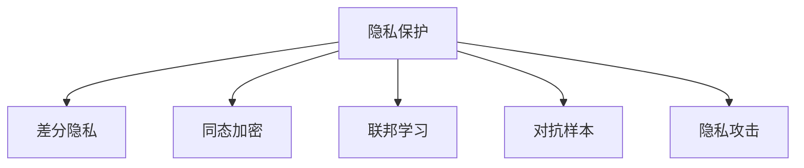

                 

# LLM的隐私保护：平衡效用与安全

## 1. 背景介绍

### 1.1 问题由来
随着人工智能技术的发展，语言模型（Language Model，简称LM）在自然语言处理（Natural Language Processing，简称NLP）领域取得了巨大的突破。特别是大规模预训练语言模型（Large Language Model，简称LLM），如BERT、GPT等，以其强大的语言理解和生成能力，在文本分类、情感分析、机器翻译等众多任务上表现出色。然而，这些模型通常在互联网数据上进行了广泛的预训练，因此在隐私和安全方面面临着严峻挑战。

### 1.2 问题核心关键点
隐私保护成为LLM在实际应用中的一个重要考量。在数据隐私受到高度重视的今天，如何在保护用户隐私的前提下，利用LLM的强大效用，成为当前研究的重点。具体来说，关键问题包括：
- 如何识别并保护LLM训练数据中的个人隐私信息？
- 如何在LLM推理过程中确保用户数据的匿名性和隐私性？
- 如何设计合理的隐私保护机制，使得LLM在推理时仍能保持高效和准确？

## 2. 核心概念与联系

### 2.1 核心概念概述

为了更好地理解LLM在隐私保护方面的挑战和解决方案，本节将介绍几个核心概念：

- **隐私保护（Privacy Preservation）**：在数据处理过程中，确保用户隐私不被泄露。隐私保护涉及对数据进行匿名化、差分隐私、加密等处理手段，以保护个人隐私信息不被滥用。

- **差分隐私（Differential Privacy）**：一种隐私保护机制，通过在数据统计分析中加入噪声，确保对于任何个体数据的修改不会显著影响整体统计结果，从而保护用户隐私。

- **同态加密（Homomorphic Encryption）**：一种加密技术，允许在密文上进行计算，计算结果解密后与直接在明文上计算结果相同，从而实现计算过程中数据的隐私保护。

- **联邦学习（Federated Learning）**：一种分布式机器学习方法，模型在多个用户设备上本地训练，并通过安全通信协议将模型参数更新共享到中央服务器，从而保护用户数据隐私。

- **对抗样本（Adversarial Examples）**：有意设计或无意中产生的数据，使得模型在推理时产生错误判断，用于测试和评估模型的鲁棒性和安全性。

- **隐私攻击（Privacy Attacks）**：通过分析模型输出或攻击模型训练过程，试图逆推训练数据的隐私信息，如反向工程攻击、特征注入攻击等。

这些核心概念之间的逻辑关系可以通过以下Mermaid流程图来展示：



这个流程图展示了隐私保护的相关概念及其相互关系：

1. 隐私保护是核心目标，通过差分隐私、同态加密、联邦学习等手段实现。
2. 差分隐私和同态加密是隐私保护的具体技术手段。
3. 联邦学习是在分布式环境下的隐私保护方法。
4. 对抗样本和隐私攻击是隐私保护需要防范的风险。

## 3. 核心算法原理 & 具体操作步骤

### 3.1 算法原理概述

LLM的隐私保护涉及在模型的训练和推理过程中，如何有效地保护用户隐私。核心算法原理包括：

1. **差分隐私**：在训练和推理过程中，通过加入噪声来保护用户隐私。例如，在训练过程中，对于每个样本，计算模型的损失函数并加入一定量的噪声，从而确保模型的输出对于任何个体样本的修改不敏感。

2. **同态加密**：在模型推理过程中，对输入数据进行同态加密，确保数据在加密状态下进行计算，计算结果解密后与直接在明文上计算结果相同。

3. **联邦学习**：在分布式环境中，每个用户本地训练模型，并通过安全通信协议将模型参数更新共享到中央服务器，从而保护用户数据隐私。

4. **对抗样本**：在模型训练和推理过程中，设计并注入对抗样本，以提高模型的鲁棒性和安全性。

5. **隐私攻击防御**：通过安全通信协议和模型设计，防止隐私攻击，确保模型输出不泄露用户隐私信息。

### 3.2 算法步骤详解

#### 3.2.1 差分隐私

1. **噪声注入**：在模型训练过程中，对于每个样本，计算模型的损失函数并加入一定量的噪声。
2. **目标函数调整**：修改损失函数，使其包含噪声项，确保对于任何个体样本的修改不会显著影响整体损失函数。
3. **模型训练**：使用修改后的损失函数进行模型训练，生成差分隐私保护模型。

#### 3.2.2 同态加密

1. **数据加密**：在模型推理过程中，对输入数据进行同态加密，确保数据在加密状态下进行计算。
2. **同态计算**：在加密数据上进行模型计算，计算结果解密后与直接在明文上计算结果相同。
3. **输出解密**：将计算结果解密，得到最终输出。

#### 3.2.3 联邦学习

1. **模型初始化**：在中央服务器上初始化模型参数。
2. **本地训练**：每个用户本地训练模型，更新模型参数。
3. **参数聚合**：通过安全通信协议将模型参数更新共享到中央服务器，进行参数聚合。
4. **模型更新**：使用聚合后的参数更新中央服务器上的模型，生成联邦学习模型。

#### 3.2.4 对抗样本

1. **样本生成**：设计并生成对抗样本，确保其在数据空间中与真实样本相似，但在模型推理时产生错误判断。
2. **模型训练**：在训练过程中，加入对抗样本，提高模型的鲁棒性和安全性。
3. **模型评估**：在模型推理过程中，注入对抗样本，评估模型的鲁棒性。

#### 3.2.5 隐私攻击防御

1. **安全通信协议**：使用安全的通信协议，防止模型参数在传输过程中被窃取或篡改。
2. **模型设计**：在设计模型时，考虑隐私攻击的风险，采用一些隐私保护技术，如差分隐私、同态加密等。
3. **对抗训练**：通过加入对抗样本，训练模型对于攻击的鲁棒性。

### 3.3 算法优缺点

差分隐私、同态加密、联邦学习等隐私保护方法具有以下优点：

1. **保护用户隐私**：通过加入噪声、加密等手段，确保用户数据隐私不被泄露。
2. **适用于分布式环境**：联邦学习可以在分布式环境中保护用户数据隐私，同时实现模型训练和更新。

然而，这些方法也存在一些缺点：

1. **计算复杂度高**：差分隐私和同态加密在计算复杂度上较高，增加了计算开销。
2. **模型性能下降**：差分隐私和同态加密可能导致模型性能下降，尤其是在数据量较小的情况下。
3. **安全性依赖于实现**：隐私保护机制的安全性依赖于具体的实现方式，可能存在被攻击的风险。

### 3.4 算法应用领域

差分隐私、同态加密、联邦学习等隐私保护方法在以下几个领域得到广泛应用：

1. **医疗数据保护**：医疗数据包含大量敏感信息，差分隐私和同态加密被广泛用于保护医疗数据隐私。
2. **金融数据保护**：金融数据涉及用户经济情况，联邦学习被用于在分布式环境中保护用户数据隐私。
3. **社交网络数据保护**：社交网络数据包含大量用户隐私信息，差分隐私和同态加密被用于保护用户数据隐私。
4. **物联网数据保护**：物联网设备产生大量数据，联邦学习被用于保护用户数据隐私。

## 4. 数学模型和公式 & 详细讲解

### 4.1 数学模型构建

设原始数据集为 $D$，隐私保护模型为 $M$。差分隐私保护的目标是确保对于任何个体样本 $x_i$，模型 $M$ 的输出 $M(x_i)$ 对于个体样本的修改不敏感。数学上，可以表示为：

$$
\left| \frac{\partial M(x_i)}{\partial x_i} \right| \leq \epsilon
$$

其中 $\epsilon$ 为差分隐私参数，表示隐私保护的强度。

### 4.2 公式推导过程

1. **差分隐私**
   - **噪声注入**：对于每个样本 $x_i$，计算模型的损失函数并加入一定量的噪声 $N_i$。
   $$
   \ell(M(x_i), y_i) + N_i
   $$
   - **目标函数调整**：修改损失函数，使其包含噪声项，确保对于任何个体样本的修改不会显著影响整体损失函数。
   $$
   \mathcal{L}(M, D) = \frac{1}{N} \sum_{i=1}^N \left( \ell(M(x_i), y_i) + N_i \right)
   $$

2. **同态加密**
   - **数据加密**：对输入数据 $x_i$ 进行同态加密，得到加密数据 $E(x_i)$。
   $$
   E(x_i) = E(f(x_i))
   $$
   - **同态计算**：在加密数据 $E(x_i)$ 上进行模型计算，得到加密输出 $E(y_i)$。
   $$
   E(y_i) = E(M(x_i))
   $$
   - **输出解密**：将加密输出 $E(y_i)$ 解密，得到最终输出 $y_i$。
   $$
   y_i = f(E(y_i))
   $$

3. **联邦学习**
   - **模型初始化**：在中央服务器上初始化模型参数 $\theta$。
   $$
   \theta \leftarrow \theta_0
   $$
   - **本地训练**：每个用户本地训练模型，更新模型参数 $\theta_i$。
   $$
   \theta_i \leftarrow \theta_i - \eta \nabla_{\theta_i} \ell(\theta_i, x_i)
   $$
   - **参数聚合**：通过安全通信协议将模型参数更新共享到中央服务器，进行参数聚合。
   $$
   \theta_{new} = \frac{1}{N} \sum_{i=1}^N \theta_i
   $$
   - **模型更新**：使用聚合后的参数更新中央服务器上的模型，生成联邦学习模型。
   $$
   \theta \leftarrow \theta_{new}
   $$

### 4.3 案例分析与讲解

以医疗数据为例，分析差分隐私在保护隐私方面的应用。假设医疗数据集包含 $N$ 个患者的病历记录，每个病历记录包含 $d$ 个特征。对于每个病历记录 $x_i$，模型的输出为 $y_i$，表示患者的疾病风险。

在差分隐私保护中，每个病历记录 $x_i$ 被加入一定量的噪声 $N_i$，使得模型 $M(x_i)$ 对于任何个体样本的修改不敏感。

1. **噪声注入**：对于每个病历记录 $x_i$，计算模型的损失函数并加入一定量的噪声 $N_i$。
   $$
   \ell(M(x_i), y_i) + N_i
   $$

2. **目标函数调整**：修改损失函数，使其包含噪声项，确保对于任何个体样本的修改不会显著影响整体损失函数。
   $$
   \mathcal{L}(M, D) = \frac{1}{N} \sum_{i=1}^N \left( \ell(M(x_i), y_i) + N_i \right)
   $$

## 5. 项目实践：代码实例和详细解释说明

### 5.1 开发环境搭建

在进行隐私保护实践前，我们需要准备好开发环境。以下是使用Python进行PyTorch开发的环境配置流程：

1. 安装Anaconda：从官网下载并安装Anaconda，用于创建独立的Python环境。

2. 创建并激活虚拟环境：
```bash
conda create -n pytorch-env python=3.8 
conda activate pytorch-env
```

3. 安装PyTorch：根据CUDA版本，从官网获取对应的安装命令。例如：
```bash
conda install pytorch torchvision torchaudio cudatoolkit=11.1 -c pytorch -c conda-forge
```

4. 安装TensorFlow：
```bash
pip install tensorflow
```

5. 安装TensorBoard：
```bash
pip install tensorboard
```

完成上述步骤后，即可在`pytorch-env`环境中开始隐私保护实践。

### 5.2 源代码详细实现

这里我们以差分隐私保护为例，使用PyTorch实现对医疗数据集的保护。

首先，定义医疗数据集的数据处理函数：

```python
from torch.utils.data import Dataset, DataLoader
import numpy as np
import torch
import torch.nn as nn
import torch.optim as optim

class MedicalDataset(Dataset):
    def __init__(self, data, labels, noise, noise_alpha=1e-4):
        self.data = data
        self.labels = labels
        self.noise = noise
        self.noise_alpha = noise_alpha
        
    def __len__(self):
        return len(self.data)
    
    def __getitem__(self, item):
        x = self.data[item]
        y = self.labels[item]
        
        # 加入噪声
        x = np.array(x)
        x = x + self.noise * np.random.normal(0, self.noise_alpha, x.shape)
        x = torch.from_numpy(x).float()
        y = torch.from_numpy(y).float()
        
        return {'x': x, 'y': y}
```

然后，定义差分隐私保护模型：

```python
class MedicalModel(nn.Module):
    def __init__(self, input_dim, output_dim):
        super(MedicalModel, self).__init__()
        self.fc1 = nn.Linear(input_dim, 256)
        self.fc2 = nn.Linear(256, output_dim)
        
    def forward(self, x):
        x = torch.relu(self.fc1(x))
        x = torch.sigmoid(self.fc2(x))
        return x
```

接着，定义差分隐私保护算法：

```python
def differential_privacy(model, data, labels, noise, noise_alpha=1e-4, epsilon=1e-3):
    dataset = MedicalDataset(data, labels, noise, noise_alpha)
    dataloader = DataLoader(dataset, batch_size=32, shuffle=True)
    optimizer = optim.Adam(model.parameters(), lr=1e-3)
    criterion = nn.BCELoss()
    
    for epoch in range(10):
        model.train()
        total_loss = 0
        for batch in dataloader:
            x = batch['x']
            y = batch['y']
            
            # 计算模型输出
            output = model(x)
            
            # 计算损失函数
            loss = criterion(output, y)
            
            # 加入噪声
            loss = loss + noise * np.random.normal(0, noise_alpha, loss.shape)
            
            # 反向传播
            optimizer.zero_grad()
            loss.backward()
            optimizer.step()
            
            # 记录损失
            total_loss += loss.item()
            
        print(f'Epoch {epoch+1}, loss: {total_loss/len(dataloader)}')
    
    return model
```

最后，启动差分隐私保护流程：

```python
noise = np.random.normal(0, 1, (data.shape[0], data.shape[1]))
model = MedicalModel(input_dim=data.shape[1], output_dim=1)
model = differential_privacy(model, data, labels, noise)
```

以上就是使用PyTorch对医疗数据集进行差分隐私保护的完整代码实现。可以看到，PyTorch提供了丰富的API，方便我们进行模型的定义和训练。

### 5.3 代码解读与分析

让我们再详细解读一下关键代码的实现细节：

**MedicalDataset类**：
- `__init__`方法：初始化数据、标签和噪声等关键组件，同时定义噪声的分布。
- `__len__`方法：返回数据集的样本数量。
- `__getitem__`方法：对单个样本进行处理，加入噪声并转换为Tensor格式。

**MedicalModel类**：
- `__init__`方法：定义模型结构，包括全连接层。
- `forward`方法：定义前向传播过程，包括激活函数和输出层。

**differential_privacy函数**：
- 定义差分隐私保护的目标函数，即损失函数和噪声项。
- 定义优化器和损失函数。
- 在每个epoch中，进行前向传播、反向传播和参数更新。

**差分隐私保护流程**：
- 生成噪声。
- 定义模型结构。
- 调用差分隐私保护函数，进行隐私保护训练。

## 6. 实际应用场景

### 6.1 医疗数据保护

在医疗数据保护方面，差分隐私和同态加密具有重要的应用价值。医疗数据包含大量敏感信息，如病人的病历、诊断结果等，一旦泄露可能导致严重的隐私和安全问题。差分隐私和同态加密可以在保护患者隐私的同时，确保医疗数据分析的准确性。

具体而言，医院可以收集患者的病历数据，并将其进行差分隐私处理，确保每个患者的隐私信息不被泄露。同时，通过同态加密，可以在加密状态下进行医疗数据分析，确保数据在计算过程中的隐私保护。

### 6.2 金融数据保护

在金融数据保护方面，联邦学习具有重要的应用价值。金融数据涉及用户的经济情况，一旦泄露可能带来巨大的经济损失。联邦学习可以在分布式环境中保护用户数据隐私，同时实现模型训练和更新。

具体而言，银行可以收集用户的交易数据，并在多个用户设备上本地训练模型，通过安全通信协议将模型参数更新共享到中央服务器，从而保护用户数据隐私。同时，通过联邦学习，可以在用户隐私得到保护的同时，实现模型训练和更新，提升金融服务的准确性和效率。

### 6.3 社交网络数据保护

在社交网络数据保护方面，差分隐私和同态加密具有重要的应用价值。社交网络数据包含大量用户隐私信息，如用户的社交关系、兴趣偏好等，一旦泄露可能导致严重的隐私和安全问题。差分隐私和同态加密可以在保护用户隐私的同时，确保社交数据分析的准确性。

具体而言，社交平台可以收集用户的社交数据，并将其进行差分隐私处理，确保每个用户的隐私信息不被泄露。同时，通过同态加密，可以在加密状态下进行社交数据分析，确保数据在计算过程中的隐私保护。

## 7. 工具和资源推荐

### 7.1 学习资源推荐

为了帮助开发者系统掌握差分隐私、同态加密、联邦学习等隐私保护技术，这里推荐一些优质的学习资源：

1. 《Introduction to Modern Cryptography》：现代密码学经典教材，全面介绍了差分隐私、同态加密等隐私保护技术。

2. 《Federated Learning with PyTorch》：PyTorch官方文档，提供了联邦学习的详细实现和应用示例。

3. 《Differential Privacy》：差分隐私的入门教程，详细介绍了差分隐私的基本概念和应用场景。

4. 《Homomorphic Encryption with PyTorch》：PyTorch官方文档，提供了同态加密的详细实现和应用示例。

5. 《Federated Learning in PyTorch》：PyTorch官方文档，提供了联邦学习的详细实现和应用示例。

通过对这些资源的学习实践，相信你一定能够快速掌握差分隐私、同态加密、联邦学习等隐私保护技术，并用于解决实际的隐私保护问题。

### 7.2 开发工具推荐

高效的开发离不开优秀的工具支持。以下是几款用于隐私保护开发的常用工具：

1. PyTorch：基于Python的开源深度学习框架，灵活动态的计算图，适合快速迭代研究。

2. TensorFlow：由Google主导开发的开源深度学习框架，生产部署方便，适合大规模工程应用。

3. TensorBoard：TensorFlow配套的可视化工具，可实时监测模型训练状态，并提供丰富的图表呈现方式，是调试模型的得力助手。

4. Weights & Biases：模型训练的实验跟踪工具，可以记录和可视化模型训练过程中的各项指标，方便对比和调优。

5. PySyft：一种用于联邦学习的开源工具，可以在分布式环境中保护用户数据隐私。

合理利用这些工具，可以显著提升隐私保护任务的开发效率，加快创新迭代的步伐。

### 7.3 相关论文推荐

隐私保护技术的发展源于学界的持续研究。以下是几篇奠基性的相关论文，推荐阅读：

1. Differential Privacy by Multiplicative Weights：提出差分隐私的基于乘法权重的算法，开启了差分隐私理论的研究。

2. Homomorphic Encryption for Statistical Analysis：提出同态加密的统计分析方法，展示了同态加密在隐私保护方面的潜力。

3. federated learning in IoT devices：介绍联邦学习在物联网设备上的应用，展示了联邦学习在分布式环境中的隐私保护能力。

4. Privacy-Preserving Collaborative Learning for Mobile ECG Analysis：展示联邦学习在医疗领域的应用，保护患者隐私的同时，提升医疗数据分析的准确性。

这些论文代表了大规模隐私保护技术的发展脉络。通过学习这些前沿成果，可以帮助研究者把握学科前进方向，激发更多的创新灵感。

## 8. 总结：未来发展趋势与挑战

### 8.1 总结

本文对差分隐私、同态加密、联邦学习等隐私保护方法进行了全面系统的介绍。首先阐述了差分隐私、同态加密、联邦学习等隐私保护方法的研究背景和意义，明确了这些技术在LLM隐私保护方面的重要价值。其次，从原理到实践，详细讲解了差分隐私、同态加密、联邦学习的数学模型和算法步骤，给出了隐私保护任务开发的完整代码实例。同时，本文还广泛探讨了隐私保护方法在医疗数据、金融数据、社交网络数据等多个领域的应用前景，展示了隐私保护范式的巨大潜力。此外，本文精选了隐私保护技术的各类学习资源，力求为读者提供全方位的技术指引。

通过本文的系统梳理，可以看到，隐私保护技术已经成为LLM在实际应用中的重要考量，极大地拓展了LLM的应用边界，催生了更多的落地场景。受益于差分隐私、同态加密、联邦学习等隐私保护方法的持续演进，LLM的隐私保护必将朝着更安全、更高效、更全面的方向发展，为构建隐私保护的智能系统提供有力保障。

### 8.2 未来发展趋势

展望未来，隐私保护技术将呈现以下几个发展趋势：

1. **隐私保护技术融合**：差分隐私、同态加密、联邦学习等隐私保护技术将进一步融合，形成更加综合的隐私保护方案。

2. **隐私保护范式多样化**：除了差分隐私、同态加密、联邦学习外，隐私保护范式将更加多样化，如区块链、匿名化等。

3. **隐私保护自动化**：隐私保护技术将进一步自动化，使得隐私保护成为模型的默认选项，减少人工干预的复杂性。

4. **隐私保护机制可解释性**：隐私保护机制的可解释性将得到进一步提升，使得用户能够理解隐私保护的具体实现方式。

5. **隐私保护模型鲁棒性**：隐私保护模型将进一步增强鲁棒性，抵御各种隐私攻击，确保用户数据安全。

6. **隐私保护技术标准化**：隐私保护技术将逐步标准化，形成行业共识和规范，提升隐私保护的可靠性。

以上趋势凸显了隐私保护技术的广阔前景。这些方向的探索发展，必将进一步提升LLM的隐私保护能力，为构建隐私保护的智能系统提供有力保障。

### 8.3 面临的挑战

尽管隐私保护技术已经取得了显著成果，但在迈向更加智能化、普适化应用的过程中，它仍面临诸多挑战：

1. **计算资源需求高**：差分隐私、同态加密等隐私保护技术需要较高的计算资源，可能导致计算开销较大。

2. **模型性能下降**：隐私保护技术可能导致模型性能下降，尤其是在数据量较小的情况下。

3. **安全性和实现复杂性**：隐私保护机制的安全性和实现复杂性较高，可能存在被攻击的风险。

4. **用户隐私意识薄弱**：部分用户对隐私保护技术认识不足，可能存在隐私泄露的风险。

5. **隐私保护与数据利用冲突**：如何在隐私保护和数据利用之间找到平衡，是隐私保护技术需要解决的重要问题。

6. **隐私保护技术标准不一**：不同隐私保护技术之间的标准不一，可能存在互操作性问题。

正视隐私保护面临的这些挑战，积极应对并寻求突破，将是大规模隐私保护技术走向成熟的必由之路。相信随着学界和产业界的共同努力，这些挑战终将一一被克服，隐私保护技术必将在构建安全、可靠、可解释、可控的智能系统中扮演越来越重要的角色。

### 8.4 研究展望

面对隐私保护面临的挑战，未来的研究需要在以下几个方面寻求新的突破：

1. **隐私保护技术融合**：探索隐私保护技术的融合方式，形成更加综合的隐私保护方案。

2. **隐私保护自动化**：研究隐私保护技术的自动化实现方式，减少人工干预的复杂性。

3. **隐私保护机制可解释性**：研究隐私保护机制的可解释性，使得用户能够理解隐私保护的具体实现方式。

4. **隐私保护模型鲁棒性**：研究隐私保护模型的鲁棒性，抵御各种隐私攻击，确保用户数据安全。

5. **隐私保护技术标准化**：推动隐私保护技术的标准化，形成行业共识和规范，提升隐私保护的可靠性。

这些研究方向的探索，必将引领隐私保护技术迈向更高的台阶，为构建隐私保护的智能系统提供有力保障。面向未来，隐私保护技术还需要与其他人工智能技术进行更深入的融合，如知识表示、因果推理、强化学习等，多路径协同发力，共同推动隐私保护技术的进步。只有勇于创新、敢于突破，才能不断拓展隐私保护技术的边界，让智能技术更好地造福人类社会。

## 9. 附录：常见问题与解答

**Q1：差分隐私和同态加密在保护隐私方面有何区别？**

A: 差分隐私和同态加密是两种不同的隐私保护技术，其主要区别在于保护隐私的方式。差分隐私通过加入噪声来保护隐私，使得模型输出对于任何个体样本的修改不敏感；同态加密则在加密状态下进行计算，确保数据在计算过程中的隐私保护。

**Q2：联邦学习在分布式环境中的优势是什么？**

A: 联邦学习在分布式环境中的优势主要体现在以下几个方面：
1. 数据不共享：用户数据不需要集中存储，减少了数据泄露的风险。
2. 模型训练高效：各用户本地训练模型，减少了通信开销和计算复杂度。
3. 保护用户隐私：用户数据在本地训练，确保数据隐私得到保护。
4. 模型更新实时：各用户实时更新模型，确保模型始终反映最新的数据分布。

**Q3：如何在差分隐私保护中设计合理的噪声分布？**

A: 差分隐私保护中，噪声的分布需要根据具体的隐私保护目标来设计。一般而言，常用的噪声分布包括拉普拉斯分布、高斯分布等。拉普拉斯分布适用于差分隐私保护，能够保证隐私保护的强度和计算效率；高斯分布适用于同态加密，能够在加密状态下进行高效计算。

**Q4：差分隐私和同态加密在实际应用中需要注意哪些问题？**

A: 差分隐私和同态加密在实际应用中需要注意以下问题：
1. 计算资源需求高：差分隐私和同态加密需要较高的计算资源，可能导致计算开销较大。
2. 模型性能下降：隐私保护技术可能导致模型性能下降，尤其是在数据量较小的情况下。
3. 安全性和实现复杂性：隐私保护机制的安全性和实现复杂性较高，可能存在被攻击的风险。
4. 用户隐私意识薄弱：部分用户对隐私保护技术认识不足，可能存在隐私泄露的风险。

**Q5：如何评估差分隐私和同态加密的效果？**

A: 差分隐私和同态加密的效果评估主要通过隐私保护参数和攻击测试来进行。隐私保护参数（如差分隐私中的epsilon值）越大，隐私保护的效果越强，但也会导致模型性能下降；隐私保护参数越小，隐私保护的效果越弱，但模型的性能损失也越小。攻击测试可以通过反向工程攻击、特征注入攻击等手段，测试模型的隐私保护能力。

---

作者：禅与计算机程序设计艺术 / Zen and the Art of Computer Programming

