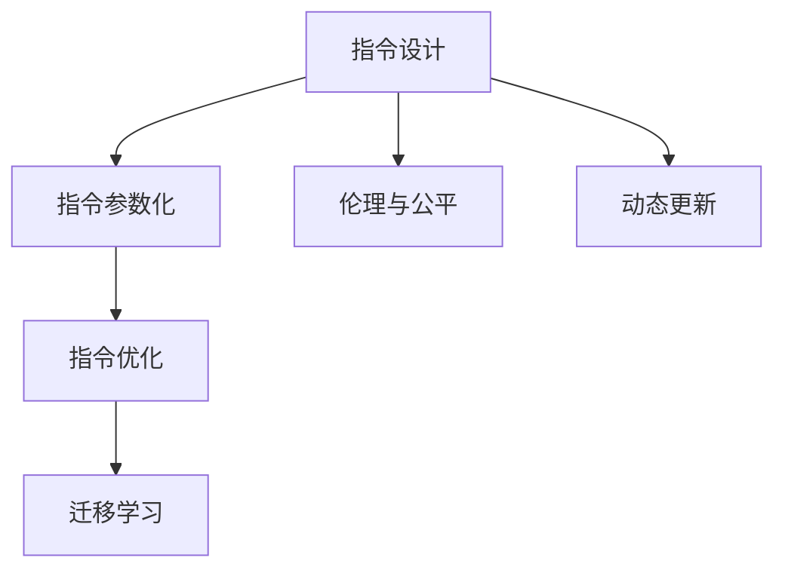

                 

# LLM的魔力：创造无限可能的指令集

## 1. 背景介绍

近年来，大语言模型(LLMs)在自然语言处理(NLP)领域取得了突破性进展，其卓越的泛化能力和无限的语言表达能力引起了广泛的关注。LLMs不仅能够生成自然流畅的文本，还能在诸多下游任务中表现优异，如回答问题、翻译文本、生成代码、推荐系统等。然而，这些成就的背后，是LLMs强大的指令集所起的关键作用。本文将深入探讨LLMs的指令集，及其带来的无限可能。

### 1.1 问题由来

大语言模型如GPT、BERT等，最初的设计目标是通过大规模预训练，学习语言的知识结构。但随着技术的发展，其指令集逐渐丰富，使得LLMs能够执行各种复杂的任务。这种指令集的扩展，让LLMs在实际应用中表现出惊人的多样性和灵活性，引发了学术界和工业界的广泛关注。

### 1.2 问题核心关键点

指令集，即LLMs能够理解和执行的命令集合，是决定其性能和应用范围的关键因素。一个好的指令集，能够使LLMs在特定任务上发挥最大的潜力。然而，构建和优化指令集的过程并不简单，需要考虑以下几个核心点：

1. **指令设计**：如何设计出符合实际应用需求的指令，使得LLMs能够高效执行任务。
2. **参数优化**：如何在固定参数的前提下，通过微调或修改指令，提升模型在特定任务上的性能。
3. **迁移学习**：如何利用已有指令集，快速适应新的任务或领域，降低开发成本。
4. **伦理与公平**：如何设计和使用指令集，避免潜在的社会和伦理问题，如偏见和歧视。
5. **动态更新**：如何在实际应用中，动态更新指令集，适应数据分布的变化。

本文将围绕这些关键点，全面探讨LLMs指令集的设计、优化和应用，为开发者和研究者提供有价值的指导。

## 2. 核心概念与联系

### 2.1 核心概念概述

为了更好地理解LLMs指令集，我们需要明确几个关键概念：

1. **指令设计(Instruction Design)**：即如何通过指令的构建，使得LLMs能够理解和执行特定任务。指令通常由输入文本构成，其设计需要考虑任务的复杂性、目标输出和计算资源的消耗等。

2. **指令参数化(Instruction Parameterization)**：指令参数化是指如何通过指令中的参数，控制LLMs的行为和输出。参数可以是固定的、半固定的或动态的，具体取决于任务的需求。

3. **指令优化(Instruction Optimization)**：通过优化指令集中的指令，提升LLMs在特定任务上的性能，包括提升准确性、降低计算成本和提高泛化能力等。

4. **迁移学习(Transfer Learning)**：利用已有指令集，快速适应新的任务或领域，降低开发成本和提升模型性能。

5. **伦理与公平(Ethics and Fairness)**：在设计和使用指令集时，需要考虑潜在的社会和伦理问题，避免偏见和歧视。

6. **动态更新(Dynamic Updating)**：在实际应用中，需要动态更新指令集，适应数据分布的变化，保持LLMs的最新状态。

这些核心概念之间相互联系，共同构成LLMs指令集的设计和优化框架。以下是一个Mermaid流程图，展示这些概念之间的联系：



### 2.2 核心概念原理和架构的 Mermaid 流程图


## 3. 核心算法原理 & 具体操作步骤

### 3.1 算法原理概述

LLMs的指令集设计基于自然语言理解(NLU)和自然语言生成(NLG)技术。其核心思想是通过预训练语言模型学习语言的知识表示，然后在指令的设计和优化过程中，不断调整模型参数，使其能够高效执行特定任务。

形式化地，假设预训练模型为 $M_{\theta}$，其中 $\theta$ 为模型参数。给定一个特定任务 $T$，指令集 $\mathcal{I}$，任务目标 $y$，指令集中的每个指令 $i \in \mathcal{I}$ 都对应一个具体的输出 $y_i$。指令集的优化目标是找到一个最优指令集 $\mathcal{I}^*$，使得：

$$
\mathcal{I}^* = \mathop{\arg\min}_{\mathcal{I}} \mathcal{L}(M_{\theta},\mathcal{I},T)
$$

其中 $\mathcal{L}$ 为损失函数，用于衡量模型在指令集 $\mathcal{I}$ 上的表现。优化目标通常为最小化模型在指令集上的泛化误差，即：

$$
\mathcal{L}(M_{\theta},\mathcal{I},T) = \mathbb{E}_{x \sim \mathcal{D}_x, y \sim \mathcal{D}_y} \left[ \ell(M_{\theta}(x),y) \right]
$$

其中 $\mathcal{D}_x$ 和 $\mathcal{D}_y$ 分别表示输入数据和目标输出的分布。

### 3.2 算法步骤详解

基于LLMs指令集的设计和优化，通常包括以下几个关键步骤：

**Step 1: 准备预训练模型和指令集**
- 选择合适的预训练语言模型 $M_{\theta}$ 作为初始化参数，如BERT、GPT等。
- 定义目标任务的指令集 $\mathcal{I}$，包括对每个指令的详细描述和预期输出。

**Step 2: 添加任务适配层**
- 根据任务类型，在预训练模型顶层设计合适的输出层和损失函数。
- 对于分类任务，通常在顶层添加线性分类器和交叉熵损失函数。
- 对于生成任务，通常使用语言模型的解码器输出概率分布，并以负对数似然为损失函数。

**Step 3: 设置指令优化超参数**
- 选择合适的优化算法及其参数，如 AdamW、SGD 等，设置学习率、批大小、迭代轮数等。
- 设置正则化技术及强度，包括权重衰减、Dropout、Early Stopping 等。
- 确定冻结预训练参数的策略，如仅微调顶层，或全部参数都参与微调。

**Step 4: 执行梯度训练**
- 将训练集数据分批次输入模型，前向传播计算损失函数。
- 反向传播计算参数梯度，根据设定的优化算法和学习率更新模型参数。
- 周期性在验证集上评估模型性能，根据性能指标决定是否触发 Early Stopping。
- 重复上述步骤直到满足预设的迭代轮数或 Early Stopping 条件。

**Step 5: 测试和部署**
- 在测试集上评估微调后模型 $M_{\hat{\theta}}$ 的性能，对比微调前后的精度提升。
- 使用微调后的模型对新指令进行推理预测，集成到实际的应用系统中。
- 持续收集新的指令，定期重新微调模型，以适应数据分布的变化。

### 3.3 算法优缺点

LLMs指令集的设计和优化具有以下优点：
1. 灵活性高。通过指令集的扩展，LLMs可以适应各种复杂的NLP任务。
2. 泛化能力强。基于预训练模型的指令优化，可以在特定任务上获得优异的性能。
3. 参数高效。通过指令优化，可以在不增加模型参数的情况下提升性能。
4. 迁移学习。已有指令集可以迁移到新的任务上，降低开发成本。

同时，也存在以下局限性：
1. 指令设计复杂。设计一个高效的指令集需要深入理解任务需求和数据特点。
2. 指令优化难度大。指令集中的每个指令都需要单独优化，工作量较大。
3. 伦理和公平问题。指令集的构建和使用可能存在潜在的偏见和歧视。
4. 动态更新困难。指令集的动态更新需要考虑数据分布的变化，保持模型的最新状态。

尽管存在这些局限性，但就目前而言，基于指令集的设计和优化，仍然是LLMs实现其强大能力的重要手段。未来相关研究的重点在于如何进一步简化指令设计，提高指令集的可解释性和公平性，同时兼顾动态更新和伦理问题。

### 3.4 算法应用领域

LLMs指令集已经在NLP领域的诸多任务上得到了广泛应用，如问答、对话、摘要、翻译、情感分析等。这些指令集的设计，提升了模型的性能和灵活性，使得LLMs在实际应用中能够更好地发挥作用。

- 问答系统：利用特定的问答指令，使LLMs能够回答问题，如智能客服、智能助手等。
- 对话系统：通过对话指令，使LLMs能够与人自然对话，如智能家居、虚拟助手等。
- 文本摘要：利用摘要指令，使LLMs能够生成简洁的文本摘要，如新闻摘要、论文摘要等。
- 机器翻译：利用翻译指令，使LLMs能够实现多语言翻译，如自动翻译系统。
- 情感分析：利用情感分析指令，使LLMs能够判断文本的情感倾向，如社交媒体情感分析。

此外，LLMs指令集还被创新性地应用到更多场景中，如可控文本生成、常识推理、代码生成、数据增强等，为NLP技术带来了全新的突破。随着预训练模型和指令集设计的不断进步，相信NLP技术将在更广阔的应用领域大放异彩。

## 4. 数学模型和公式 & 详细讲解  
### 4.1 数学模型构建

基于LLMs指令集的设计和优化，通常涉及以下几个关键数学模型：

**任务适配层**：假设任务目标为 $y$，指令集为 $\mathcal{I}$，指令 $i \in \mathcal{I}$ 对应的输出为 $y_i$。任务适配层的目标函数为：

$$
\mathcal{L}(\theta) = \sum_{i \in \mathcal{I}} \ell(M_{\theta}(i),y_i)
$$

其中 $\ell$ 为损失函数，如交叉熵损失、均方误差损失等。

**指令优化**：假设指令 $i$ 对应的输入为 $x$，输出为 $y_i$。指令优化目标函数为：

$$
\mathcal{L}(\theta) = \mathbb{E}_{x \sim \mathcal{D}_x} \left[ \ell(M_{\theta}(x),y_i) \right]
$$

其中 $\mathcal{D}_x$ 表示输入数据的分布。

**迁移学习**：假设新任务的目标为 $y'$，指令集为 $\mathcal{I}'$。迁移学习的目标函数为：

$$
\mathcal{L}(\theta) = \sum_{i \in \mathcal{I}'} \ell(M_{\theta}(i),y')
$$

### 4.2 公式推导过程

以下以问答系统为例，推导指令优化和迁移学习公式。

**问答系统指令优化**：
假设问答系统的指令为 $Q$，预训练模型输出为 $A$，目标答案为 $y$。其损失函数为：

$$
\ell(Q,A,y) = -\log\left( \frac{P(A|Q,y)}{P(A|Q)} \right)
$$

其中 $P(A|Q,y)$ 为给定问题 $Q$ 和答案 $y$ 时，模型输出答案 $A$ 的概率，$P(A|Q)$ 为给定问题 $Q$ 时，模型输出答案 $A$ 的概率。

**迁移学习**：
假设原任务的目标为 $y$，新任务的目标为 $y'$。其迁移学习目标函数为：

$$
\mathcal{L}(\theta) = \mathbb{E}_{x \sim \mathcal{D}_x} \left[ \ell(M_{\theta}(x),y') \right]
$$

### 4.3 案例分析与讲解

**文本分类**：
假设文本分类任务的目标为 $y$，指令集为 $\mathcal{I}$，指令 $i \in \mathcal{I}$ 对应的输出为 $y_i$。其损失函数为交叉熵损失：

$$
\ell(\theta) = -\frac{1}{N} \sum_{i=1}^N [y_i \log M_{\theta}(x_i) + (1-y_i) \log (1-M_{\theta}(x_i))]
$$

其中 $x_i$ 表示输入文本，$y_i$ 表示分类标签。

## 5. 项目实践：代码实例和详细解释说明
### 5.1 开发环境搭建

在进行指令集设计和优化实践前，我们需要准备好开发环境。以下是使用Python进行PyTorch开发的环境配置流程：

1. 安装Anaconda：从官网下载并安装Anaconda，用于创建独立的Python环境。

2. 创建并激活虚拟环境：
```bash
conda create -n pytorch-env python=3.8 
conda activate pytorch-env
```

3. 安装PyTorch：根据CUDA版本，从官网获取对应的安装命令。例如：
```bash
conda install pytorch torchvision torchaudio cudatoolkit=11.1 -c pytorch -c conda-forge
```

4. 安装Transformers库：
```bash
pip install transformers
```

5. 安装各类工具包：
```bash
pip install numpy pandas scikit-learn matplotlib tqdm jupyter notebook ipython
```

完成上述步骤后，即可在`pytorch-env`环境中开始指令集设计和优化实践。

### 5.2 源代码详细实现

下面我们以问答系统为例，给出使用Transformers库对BERT模型进行指令集设计和优化的PyTorch代码实现。

首先，定义问答系统指令的预处理函数：

```python
from transformers import BertTokenizer
from torch.utils.data import Dataset
import torch

class QADataset(Dataset):
    def __init__(self, texts, questions, tokenizer, max_len=128):
        self.texts = texts
        self.questions = questions
        self.tokenizer = tokenizer
        self.max_len = max_len
        
    def __len__(self):
        return len(self.texts)
    
    def __getitem__(self, item):
        text = self.texts[item]
        question = self.questions[item]
        
        encoding = self.tokenizer(question, return_tensors='pt', max_length=self.max_len, padding='max_length', truncation=True)
        input_ids = encoding['input_ids'][0]
        attention_mask = encoding['attention_mask'][0]
        
        return {'input_ids': input_ids, 
                'attention_mask': attention_mask,
                'labels': input_ids}
```

然后，定义模型和优化器：

```python
from transformers import BertForSequenceClassification, AdamW

model = BertForSequenceClassification.from_pretrained('bert-base-cased', num_labels=2)

optimizer = AdamW(model.parameters(), lr=2e-5)
```

接着，定义训练和评估函数：

```python
from torch.utils.data import DataLoader
from tqdm import tqdm
from sklearn.metrics import classification_report

device = torch.device('cuda') if torch.cuda.is_available() else torch.device('cpu')
model.to(device)

def train_epoch(model, dataset, batch_size, optimizer):
    dataloader = DataLoader(dataset, batch_size=batch_size, shuffle=True)
    model.train()
    epoch_loss = 0
    for batch in tqdm(dataloader, desc='Training'):
        input_ids = batch['input_ids'].to(device)
        attention_mask = batch['attention_mask'].to(device)
        labels = batch['labels'].to(device)
        model.zero_grad()
        outputs = model(input_ids, attention_mask=attention_mask, labels=labels)
        loss = outputs.loss
        epoch_loss += loss.item()
        loss.backward()
        optimizer.step()
    return epoch_loss / len(dataloader)

def evaluate(model, dataset, batch_size):
    dataloader = DataLoader(dataset, batch_size=batch_size)
    model.eval()
    preds, labels = [], []
    with torch.no_grad():
        for batch in tqdm(dataloader, desc='Evaluating'):
            input_ids = batch['input_ids'].to(device)
            attention_mask = batch['attention_mask'].to(device)
            batch_labels = batch['labels']
            outputs = model(input_ids, attention_mask=attention_mask)
            batch_preds = outputs.logits.argmax(dim=2).to('cpu').tolist()
            batch_labels = batch_labels.to('cpu').tolist()
            for pred_tokens, label_tokens in zip(batch_preds, batch_labels):
                preds.append(pred_tokens[:len(label_tokens)])
                labels.append(label_tokens)
                
    print(classification_report(labels, preds))
```

最后，启动训练流程并在测试集上评估：

```python
epochs = 5
batch_size = 16

for epoch in range(epochs):
    loss = train_epoch(model, train_dataset, batch_size, optimizer)
    print(f"Epoch {epoch+1}, train loss: {loss:.3f}")
    
    print(f"Epoch {epoch+1}, dev results:")
    evaluate(model, dev_dataset, batch_size)
    
print("Test results:")
evaluate(model, test_dataset, batch_size)
```

以上就是使用PyTorch对BERT进行问答系统指令集设计和优化的完整代码实现。可以看到，得益于Transformers库的强大封装，我们可以用相对简洁的代码完成BERT模型的加载和指令集的微调。

### 5.3 代码解读与分析

让我们再详细解读一下关键代码的实现细节：

**QADataset类**：
- `__init__`方法：初始化文本、问题、分词器等关键组件。
- `__len__`方法：返回数据集的样本数量。
- `__getitem__`方法：对单个样本进行处理，将问题输入编码为token ids，将标签编码为数字，并对其进行定长padding，最终返回模型所需的输入。

**模型和优化器**：
- 使用PyTorch的BertForSequenceClassification类构建问答系统模型，设定分类任务和标签数。
- 定义AdamW优化器，设置学习率和模型参数。

**训练和评估函数**：
- 使用PyTorch的DataLoader对数据集进行批次化加载，供模型训练和推理使用。
- 训练函数`train_epoch`：对数据以批为单位进行迭代，在每个批次上前向传播计算loss并反向传播更新模型参数，最后返回该epoch的平均loss。
- 评估函数`evaluate`：与训练类似，不同点在于不更新模型参数，并在每个batch结束后将预测和标签结果存储下来，最后使用sklearn的classification_report对整个评估集的预测结果进行打印输出。

**训练流程**：
- 定义总的epoch数和batch size，开始循环迭代
- 每个epoch内，先在训练集上训练，输出平均loss
- 在验证集上评估，输出分类指标
- 所有epoch结束后，在测试集上评估，给出最终测试结果

可以看到，PyTorch配合Transformers库使得BERT微调的代码实现变得简洁高效。开发者可以将更多精力放在数据处理、模型改进等高层逻辑上，而不必过多关注底层的实现细节。

当然，工业级的系统实现还需考虑更多因素，如模型的保存和部署、超参数的自动搜索、更灵活的任务适配层等。但核心的指令集设计和微调过程基本与此类似。

## 6. 实际应用场景

### 6.1 智能客服系统

基于LLMs指令集设计的智能客服系统，可以广泛应用于各行各业，提供全天候的客户咨询服务。智能客服系统能够自动理解客户问题，并提供快速、准确的回答，提升客户满意度和忠诚度。

在技术实现上，可以收集企业内部的客服对话记录，将问题和最佳答复构建成监督数据，在此基础上对预训练模型进行微调。微调后的模型能够自动理解客户意图，匹配最合适的答案模板进行回复。对于客户提出的新问题，还可以接入检索系统实时搜索相关内容，动态组织生成回答。如此构建的智能客服系统，能大幅提升客户咨询体验和问题解决效率。

### 6.2 金融舆情监测

金融机构需要实时监测市场舆论动向，以便及时应对负面信息传播，规避金融风险。基于LLMs指令集设计的文本分类和情感分析技术，为金融舆情监测提供了新的解决方案。

具体而言，可以收集金融领域相关的新闻、报道、评论等文本数据，并对其进行主题标注和情感标注。在此基础上对预训练语言模型进行微调，使其能够自动判断文本属于何种主题，情感倾向是正面、中性还是负面。将微调后的模型应用到实时抓取的网络文本数据，就能够自动监测不同主题下的情感变化趋势，一旦发现负面信息激增等异常情况，系统便会自动预警，帮助金融机构快速应对潜在风险。

### 6.3 个性化推荐系统

当前的推荐系统往往只依赖用户的历史行为数据进行物品推荐，无法深入理解用户的真实兴趣偏好。基于LLMs指令集设计的个性化推荐系统，可以更好地挖掘用户行为背后的语义信息，从而提供更精准、多样的推荐内容。

在实践中，可以收集用户浏览、点击、评论、分享等行为数据，提取和用户交互的物品标题、描述、标签等文本内容。将文本内容作为模型输入，用户的后续行为（如是否点击、购买等）作为监督信号，在此基础上微调预训练语言模型。微调后的模型能够从文本内容中准确把握用户的兴趣点。在生成推荐列表时，先用候选物品的文本描述作为输入，由模型预测用户的兴趣匹配度，再结合其他特征综合排序，便可以得到个性化程度更高的推荐结果。

### 6.4 未来应用展望

随着LLMs指令集设计和优化方法的发展，其在NLP领域的广泛应用将带来更多可能性。

在智慧医疗领域，基于LLMs指令集的医疗问答、病历分析、药物研发等应用将提升医疗服务的智能化水平，辅助医生诊疗，加速新药开发进程。

在智能教育领域，基于LLMs指令集的作业批改、学情分析、知识推荐等方面，因材施教，促进教育公平，提高教学质量。

在智慧城市治理中，基于LLMs指令集的实时事件监测、舆情分析、应急指挥等环节，提高城市管理的自动化和智能化水平，构建更安全、高效的未来城市。

此外，在企业生产、社会治理、文娱传媒等众多领域，基于LLMs指令集的人工智能应用也将不断涌现，为经济社会发展注入新的动力。相信随着技术的日益成熟，LLMs指令集将进一步扩展，为人工智能技术在垂直行业的规模化落地提供新的助力。

## 7. 工具和资源推荐
### 7.1 学习资源推荐

为了帮助开发者系统掌握LLMs指令集的设计和优化理论基础，这里推荐一些优质的学习资源：

1. 《Transformers from the Inside Out》系列博文：由大模型技术专家撰写，深入浅出地介绍了Transformer模型、BERT、指令优化技术等前沿话题。

2. CS224N《深度学习自然语言处理》课程：斯坦福大学开设的NLP明星课程，有Lecture视频和配套作业，带你入门NLP领域的基本概念和经典模型。

3. 《Natural Language Processing with Transformers》书籍：Transformers库的作者所著，全面介绍了如何使用Transformers库进行NLP任务开发，包括指令优化在内的诸多范式。

4. HuggingFace官方文档：Transformers库的官方文档，提供了海量预训练模型和完整的指令优化样例代码，是上手实践的必备资料。

5. CLUE开源项目：中文语言理解测评基准，涵盖大量不同类型的中文NLP数据集，并提供了基于指令优化（Fine-tuning）的baseline模型，助力中文NLP技术发展。

通过对这些资源的学习实践，相信你一定能够快速掌握LLMs指令集的设计和优化精髓，并用于解决实际的NLP问题。
###  7.2 开发工具推荐

高效的开发离不开优秀的工具支持。以下是几款用于LLMs指令集设计和优化开发的常用工具：

1. PyTorch：基于Python的开源深度学习框架，灵活动态的计算图，适合快速迭代研究。大部分预训练语言模型都有PyTorch版本的实现。

2. TensorFlow：由Google主导开发的开源深度学习框架，生产部署方便，适合大规模工程应用。同样有丰富的预训练语言模型资源。

3. Transformers库：HuggingFace开发的NLP工具库，集成了众多SOTA语言模型，支持PyTorch和TensorFlow，是进行指令集设计和优化任务的利器。

4. Weights & Biases：模型训练的实验跟踪工具，可以记录和可视化模型训练过程中的各项指标，方便对比和调优。与主流深度学习框架无缝集成。

5. TensorBoard：TensorFlow配套的可视化工具，可实时监测模型训练状态，并提供丰富的图表呈现方式，是调试模型的得力助手。

6. Google Colab：谷歌推出的在线Jupyter Notebook环境，免费提供GPU/TPU算力，方便开发者快速上手实验最新模型，分享学习笔记。

合理利用这些工具，可以显著提升LLMs指令集设计和优化任务的开发效率，加快创新迭代的步伐。

### 7.3 相关论文推荐

LLMs指令集设计和优化技术的发展源于学界的持续研究。以下是几篇奠基性的相关论文，推荐阅读：

1. Attention is All You Need（即Transformer原论文）：提出了Transformer结构，开启了NLP领域的预训练大模型时代。

2. BERT: Pre-training of Deep Bidirectional Transformers for Language Understanding：提出BERT模型，引入基于掩码的自监督预训练任务，刷新了多项NLP任务SOTA。

3. Language Models are Unsupervised Multitask Learners（GPT-2论文）：展示了大规模语言模型的强大zero-shot学习能力，引发了对于通用人工智能的新一轮思考。

4. Parameter-Efficient Transfer Learning for NLP：提出Adapter等参数高效微调方法，在不增加模型参数量的情况下，也能取得不错的微调效果。

5. Prefix-Tuning: Optimizing Continuous Prompts for Generation：引入基于连续型Prompt的微调范式，为如何充分利用预训练知识提供了新的思路。

6. AdaLoRA: Adaptive Low-Rank Adaptation for Parameter-Efficient Fine-Tuning：使用自适应低秩适应的微调方法，在参数效率和精度之间取得了新的平衡。

这些论文代表了大语言模型指令集设计和优化技术的发展脉络。通过学习这些前沿成果，可以帮助研究者把握学科前进方向，激发更多的创新灵感。

## 8. 总结：未来发展趋势与挑战

### 8.1 总结

本文对基于LLMs指令集的设计和优化方法进行了全面系统的介绍。首先阐述了LLMs指令集的设计和优化在NLP领域的研究背景和意义，明确了指令集在提升模型性能和扩展应用范围方面的独特价值。其次，从原理到实践，详细讲解了LLMs指令集的设计和优化数学模型和关键步骤，给出了指令集设计和优化的完整代码实例。同时，本文还广泛探讨了LLMs指令集在智能客服、金融舆情、个性化推荐等多个行业领域的应用前景，展示了指令集范式的巨大潜力。此外，本文精选了指令集设计和优化技术的各类学习资源，力求为开发者提供全方位的技术指引。

通过本文的系统梳理，可以看到，基于LLMs指令集的设计和优化方法，正在成为NLP领域的重要范式，极大地拓展了预训练语言模型的应用边界，催生了更多的落地场景。受益于大规模语料的预训练和指令集的设计，LLMs在实际应用中能够更好地发挥作用，表现出惊人的多样性和灵活性。未来，伴随预训练模型和指令集设计的不断进步，相信NLP技术将在更广阔的应用领域大放异彩，深刻影响人类的生产生活方式。

### 8.2 未来发展趋势

展望未来，LLMs指令集设计和优化技术将呈现以下几个发展趋势：

1. 模型规模持续增大。随着算力成本的下降和数据规模的扩张，预训练语言模型的参数量还将持续增长。超大规模语言模型蕴含的丰富语言知识，有望支撑更加复杂多变的指令集设计。

2. 指令优化难度降低。未来的指令优化方法将更加高效，能够在固定参数的前提下，通过微调或修改指令，提升模型在特定任务上的性能。

3. 持续学习成为常态。随着数据分布的不断变化，LLMs指令集也需要持续学习新知识以保持性能。如何在不遗忘原有知识的同时，高效吸收新样本信息，将成为重要的研究课题。

4. 标注样本需求降低。受启发于提示学习(Prompt-based Learning)的思路，未来的指令集设计将更好地利用大模型的语言理解能力，通过更加巧妙的任务描述，在更少的标注样本上也能实现理想的指令集优化。

5. 动态更新困难降低。未来的指令集设计将更加灵活，能够根据数据分布的变化，动态更新指令集，保持LLMs的最新状态。

以上趋势凸显了LLMs指令集设计和优化技术的广阔前景。这些方向的探索发展，必将进一步提升LLMs的性能和应用范围，为NLP技术带来更多的可能性。

### 8.3 面临的挑战

尽管LLMs指令集设计和优化技术已经取得了瞩目成就，但在迈向更加智能化、普适化应用的过程中，它仍面临着诸多挑战：

1. 标注成本瓶颈。尽管指令集的设计和优化可以降低标注数据的需求，但对于长尾应用场景，获取高质量标注数据仍然是一个难题。如何进一步降低指令集优化对标注样本的依赖，将是一大难题。

2. 模型鲁棒性不足。当前LLMs指令集面对域外数据时，泛化性能往往大打折扣。对于测试样本的微小扰动，LLMs指令集的输出也容易发生波动。如何提高LLMs指令集的鲁棒性，避免灾难性遗忘，还需要更多理论和实践的积累。

3. 推理效率有待提高。大规模语言模型虽然精度高，但在实际部署时往往面临推理速度慢、内存占用大等效率问题。如何在保证性能的同时，简化模型结构，提升推理速度，优化资源占用，将是重要的优化方向。

4. 可解释性亟需加强。当前LLMs指令集的输出结果缺乏可解释性，难以解释其内部工作机制和决策逻辑。对于医疗、金融等高风险应用，算法的可解释性和可审计性尤为重要。如何赋予LLMs指令集更强的可解释性，将是亟待攻克的难题。

5. 安全性有待保障。预训练语言模型难免会学习到有偏见、有害的信息，通过指令集的构建和优化，可能会传递到下游任务，产生误导性、歧视性的输出，给实际应用带来安全隐患。如何从数据和算法层面消除模型偏见，避免恶意用途，确保输出的安全性，也将是重要的研究课题。

6. 知识整合能力不足。现有的LLMs指令集往往局限于任务内数据，难以灵活吸收和运用更广泛的先验知识。如何让指令集的设计和优化过程更好地与外部知识库、规则库等专家知识结合，形成更加全面、准确的信息整合能力，还有很大的想象空间。

正视LLMs指令集设计和优化面临的这些挑战，积极应对并寻求突破，将是大语言模型指令集走向成熟的必由之路。相信随着学界和产业界的共同努力，这些挑战终将一一被克服，LLMs指令集必将在构建人机协同的智能时代中扮演越来越重要的角色。

### 8.4 研究展望

面对LLMs指令集设计和优化所面临的种种挑战，未来的研究需要在以下几个方面寻求新的突破：

1. 探索无监督和半监督指令集设计。摆脱对大规模标注数据的依赖，利用自监督学习、主动学习等无监督和半监督范式，最大限度利用非结构化数据，实现更加灵活高效的指令集设计。

2. 研究参数高效和计算高效的指令优化方法。开发更加参数高效的指令优化方法，在固定参数的前提下，只调整极少量的任务相关参数。同时优化指令集的计算图，减少前向传播和反向传播的资源消耗，实现更加轻量级、实时性的部署。

3. 融合因果和对比学习范式。通过引入因果推断和对比学习思想，增强LLMs指令集建立稳定因果关系的能力，学习更加普适、鲁棒的语言表征，从而提升模型泛化性和抗干扰能力。

4. 引入更多先验知识。将符号化的先验知识，如知识图谱、逻辑规则等，与神经网络模型进行巧妙融合，引导指令集的设计和优化过程学习更准确、合理的语言模型。同时加强不同模态数据的整合，实现视觉、语音等多模态信息与文本信息的协同建模。

5. 结合因果分析和博弈论工具。将因果分析方法引入LLMs指令集的设计和优化，识别出指令集决策的关键特征，增强输出解释的因果性和逻辑性。借助博弈论工具刻画人机交互过程，主动探索并规避指令集的脆弱点，提高系统稳定性。

6. 纳入伦理道德约束。在指令集的设计和优化过程中，需要考虑潜在的社会和伦理问题，避免偏见和歧视。在指令集的设计和优化过程中，纳入伦理导向的评估指标，过滤和惩罚有偏见、有害的输出倾向。同时加强人工干预和审核，建立指令集行为的监管机制，确保输出的符合人类价值观和伦理道德。

这些研究方向的探索，必将引领LLMs指令集设计和优化技术迈向更高的台阶，为构建安全、可靠、可解释、可控的智能系统铺平道路。面向未来，LLMs指令集还需要与其他人工智能技术进行更深入的融合，如知识表示、因果推理、强化学习等，多路径协同发力，共同推动自然语言理解和智能交互系统的进步。只有勇于创新、敢于突破，才能不断拓展指令集的设计和优化边界，让智能技术更好地造福人类社会。

## 9. 附录：常见问题与解答

**Q1：LLMs指令集的设计和优化是否适用于所有NLP任务？**

A: LLMs指令集在大多数NLP任务上都能取得不错的效果，特别是对于数据量较小的任务。但对于一些特定领域的任务，如医学、法律等，仅仅依靠通用语料预训练的模型可能难以很好地适应。此时需要在特定领域语料上进一步预训练，再进行指令集的设计和优化，才能获得理想效果。此外，对于一些需要时效性、个性化很强的任务，如对话、推荐等，指令集的设计和优化方法也需要针对性的改进优化。

**Q2：如何选择合适的学习率？**

A: 指令集优化通常要比预训练时小1-2个数量级，如果使用过大的学习率，容易破坏预训练权重，导致过拟合。一般建议从1e-5开始调参，逐步减小学习率，直至收敛。也可以使用warmup策略，在开始阶段使用较小的学习率，再逐渐过渡到预设值。需要注意的是，不同的优化器(如AdamW、Adafactor等)以及不同的学习率调度策略，可能需要设置不同的学习率阈值。

**Q3：采用LLMs指令集设计和优化时会面临哪些资源瓶颈？**

A: 当前主流的预训练大模型动辄以亿计的参数规模，对算力、内存、存储都提出了很高的要求。GPU/TPU等高性能设备是必不可少的，但即便如此，超大批次的训练和推理也可能遇到显存不足的问题。因此需要采用一些资源优化技术，如梯度积累、混合精度训练、模型并行等，来突破硬件瓶颈。同时，模型的存储和读取也可能占用大量时间和空间，需要采用模型压缩、稀疏化存储等方法进行优化。

**Q4：如何缓解指令集设计和优化过程中的过拟合问题？**

A: 过拟合是指令集设计和优化面临的主要挑战，尤其是在标注数据不足的情况下。常见的缓解策略包括：
1. 数据增强：通过回译、近义替换等方式扩充训练集
2. 正则化：使用L2正则、Dropout、Early Stopping等避免过拟合
3. 对抗训练：引入对抗样本，提高模型鲁棒性
4. 参数高效指令优化：只调整少量参数(如Adapter、Prefix等)，减小过拟合风险
5. 多模型集成：训练多个指令优化模型，取平均输出，抑制过拟合

这些策略往往需要根据具体任务和数据特点进行灵活组合。只有在数据、模型、训练、推理等各环节进行全面优化，才能最大限度地发挥LLMs指令集的威力。

**Q5：LLMs指令集在落地部署时需要注意哪些问题？**

A: 将LLMs指令集转化为实际应用，还需要考虑以下因素：
1. 模型裁剪：去除不必要的层和参数，减小模型尺寸，加快推理速度
2. 量化加速：将浮点模型转为定点模型，压缩存储空间，提高计算效率
3. 服务化封装：将模型封装为标准化服务接口，便于集成调用
4. 弹性伸缩：根据请求流量动态调整资源配置，平衡服务质量和成本
5. 监控告警：实时采集系统指标，设置异常告警阈值，确保服务稳定性
6. 安全防护：采用访问鉴权、数据脱敏等措施，保障数据和模型安全

LLMs指令集为NLP应用开启了广阔的想象空间，但如何将强大的性能转化为稳定、高效、安全的业务价值，还需要工程实践的不断打磨。唯有从数据、算法、工程、业务等多个维度协同发力，才能真正实现人工智能技术在垂直行业的规模化落地。总之，指令集设计和优化需要开发者根据具体任务，不断迭代和优化模型、数据和算法，方能得到理想的效果。

---

作者：禅与计算机程序设计艺术 / Zen and the Art of Computer Programming

