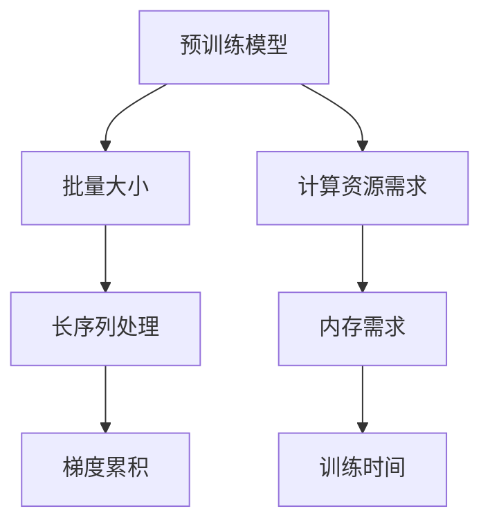
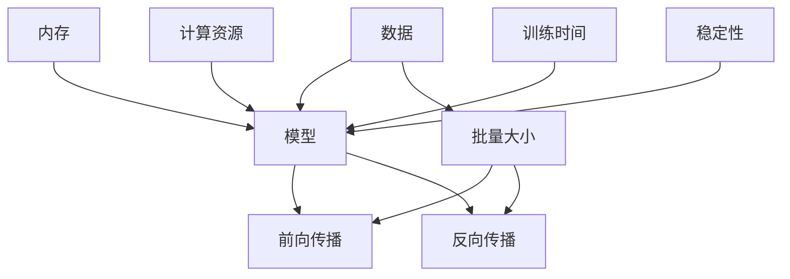

                 

## 1. 背景介绍

近年来，随着大规模预训练语言模型（LLMs）在自然语言处理（NLP）领域取得突破性进展，训练这些模型的需求愈发强烈。然而，LLMs的训练面临一些特殊挑战，比如大批量、长序列和梯度累积等问题。本文旨在深入探讨这些问题，并提供有效的训练技巧，帮助用户更高效地训练LLM模型。

### 1.1 问题由来
在训练大规模预训练语言模型时，由于模型参数量巨大，对计算资源的需求也异常高。特别是当模型被应用于长序列（如文本）处理时，这些问题变得更为显著。

### 1.2 问题核心关键点
本节将介绍几个核心概念及其相互关系，以便读者更好地理解背景和后续内容。

- **大规模预训练语言模型（LLMs）**：指在无标签的文本数据上预训练的模型，如GPT系列、BERT等，通过大规模自监督学习获取通用语言表示能力。
- **批量大小（Batch Size）**：指模型一次训练的样本数量。大批量训练可以加速收敛，但也需要更多内存和计算资源。
- **序列长度（Sequence Length）**：指输入模型的文本序列长度。长序列处理需要处理大量数据，对计算资源和内存要求高。
- **梯度累积（Gradient Accumulation）**：指在多次小批量训练的梯度之间进行累积，以减少每次更新的步幅，提高稳定性和收敛速度。

这些概念之间的联系可以通过以下Mermaid流程图表示：



该图展示了预训练模型、批量大小、长序列处理、梯度累积和计算资源需求、内存需求以及训练时间之间的联系和相互作用。

## 2. 核心概念与联系

### 2.1 核心概念概述

- **预训练模型**：如GPT系列、BERT等，在大规模无标签文本上预训练，学习语言表示能力。
- **批量大小**：模型一次训练的样本数量，影响内存和计算资源的消耗。
- **序列长度**：模型输入的文本序列长度，长序列处理要求更高的计算和内存资源。
- **梯度累积**：将多次小批量训练的梯度累积起来，以减少每次更新的步幅，提高模型稳定性。

这些概念对LLM模型的训练至关重要。了解它们的原理和相互关系，是训练高效率、高质量模型不可或缺的一部分。

### 2.2 核心概念原理和架构的 Mermaid 流程图



该图展示了数据、模型、批量大小、前向传播、反向传播、内存、计算资源、训练时间、模型稳定性之间的关系。

## 3. 核心算法原理 & 具体操作步骤

### 3.1 算法原理概述

基于大规模预训练语言模型训练的算法原理包括：

- **批量大小**：通过选择合适的批量大小，平衡计算速度和资源利用率。
- **长序列处理**：对长序列数据进行分块处理，减少内存占用和计算开销。
- **梯度累积**：通过累积小批量梯度，减少每次更新的步幅，提高模型稳定性和收敛速度。

这些技术共同构成LLM模型的高效训练框架。

### 3.2 算法步骤详解

#### 3.2.1 批量大小选择

选择合适的批量大小是确保训练效率的关键。一般来说，大批量大小可以加速收敛，但需要更大的计算资源和内存。可以通过以下步骤选择批量大小：

1. **确定模型参数大小**：计算模型参数数量，如$N$。
2. **计算所需内存**：根据模型参数大小和批量大小，计算所需的内存大小，如$M = \frac{N}{B}$，其中$B$为批量大小。
3. **选择合适的设备**：根据计算资源和内存需求，选择适合的设备（如GPU、TPU）。
4. **调整批量大小**：在保证计算资源和内存的前提下，调整批量大小，平衡计算速度和资源利用率。

#### 3.2.2 长序列处理

长序列处理是训练LLM模型的另一个挑战。长序列数据通常需要分块处理，以减少内存占用和计算开销。以下是长序列处理的详细步骤：

1. **分块处理**：将长序列数据分成多个子序列，每个子序列长度不超过批量大小。
2. **并行处理**：对每个子序列进行并行处理，减少计算时间。
3. **拼接输出**：将各个子序列的输出拼接起来，得到完整序列的处理结果。

#### 3.2.3 梯度累积

梯度累积技术通过累积多次小批量训练的梯度，减少每次更新的步幅，提高模型稳定性和收敛速度。具体步骤如下：

1. **累积梯度**：将多次小批量训练的梯度相加，得到累积梯度。
2. **计算更新**：使用累积梯度进行一次模型更新，而不是每次都进行一次更新。
3. **调整学习率**：根据累积梯度的累积次数，调整学习率，确保模型稳定收敛。

### 3.3 算法优缺点

#### 3.3.1 优点

1. **加速收敛**：大批量大小和梯度累积可以加速模型收敛，减少训练时间。
2. **提高稳定性**：通过累积梯度，减少每次更新的步幅，提高模型稳定性。
3. **降低内存需求**：分块处理和批量大小选择可以降低内存需求，提高计算资源利用率。

#### 3.3.2 缺点

1. **内存占用高**：大批量大小需要较大的内存，可能导致内存不足的问题。
2. **计算开销大**：长序列处理和梯度累积需要更多的计算资源，增加训练时间。
3. **参数调整复杂**：选择合适的批量大小和序列长度需要一定的经验和计算资源。

### 3.4 算法应用领域

大批量、长序列和梯度累积技术在多个NLP任务中都有应用，例如：

- **文本分类**：在长文本分类任务中，大批量和长序列处理可以提高模型性能。
- **机器翻译**：处理长序列翻译任务时，梯度累积可以提升模型稳定性。
- **问答系统**：大批量和长序列处理可以使模型更好地理解复杂问题和上下文。
- **摘要生成**：处理长文本摘要任务时，长序列处理和梯度累积可以提高模型生成质量。

这些应用展示了这些技术在大规模预训练语言模型训练中的广泛适用性。

## 4. 数学模型和公式 & 详细讲解 & 举例说明

### 4.1 数学模型构建

大批量、长序列和梯度累积模型的数学模型构建如下：

- **批量大小**：$B$
- **长序列长度**：$L$
- **模型参数**：$\theta$
- **梯度累积次数**：$k$
- **累积梯度**：$\hat{g}$

### 4.2 公式推导过程

假设模型损失函数为$\mathcal{L}$，每次小批量训练的梯度为$g$，累积梯度为$\hat{g} = g_1 + g_2 + ... + g_k$，则每次更新的参数更新公式为：

$$
\theta \leftarrow \theta - \frac{\hat{g}}{k}
$$

其中，$\frac{\hat{g}}{k}$为累积梯度的平均值。

### 4.3 案例分析与讲解

假设有一个BERT模型，需要处理长文本序列。采用大批量大小为16，梯度累积次数为4，计算累积梯度，然后进行更新。

**步骤1**：将长文本序列分成多个子序列，每个子序列长度为4。
**步骤2**：对每个子序列进行并行处理，计算梯度$g_1, g_2, g_3, g_4$。
**步骤3**：计算累积梯度$\hat{g} = g_1 + g_2 + g_3 + g_4$。
**步骤4**：使用累积梯度进行一次模型更新。

## 5. 项目实践：代码实例和详细解释说明

### 5.1 开发环境搭建

在进行大规模预训练语言模型训练时，需要搭建合适的开发环境。以下是使用PyTorch和Transformers库搭建开发环境的流程：

1. **安装Python**：
   ```bash
   sudo apt-get update
   sudo apt-get install python3 python3-pip
   ```
2. **创建虚拟环境**：
   ```bash
   python3 -m venv venv
   source venv/bin/activate
   ```
3. **安装依赖**：
   ```bash
   pip install torch torchtext transformers
   ```

### 5.2 源代码详细实现

以下是一个简单的PyTorch代码示例，展示了如何使用大批量、长序列和梯度累积技术训练BERT模型：

```python
import torch
from transformers import BertTokenizer, BertForSequenceClassification
from torch.utils.data import DataLoader
from tqdm import tqdm

# 初始化预训练模型和分词器
tokenizer = BertTokenizer.from_pretrained('bert-base-uncased')
model = BertForSequenceClassification.from_pretrained('bert-base-uncased', num_labels=2)

# 加载训练数据
train_dataset = ...

# 设置批量大小和梯度累积次数
batch_size = 16
k = 4

# 定义数据加载器
data_loader = DataLoader(train_dataset, batch_size=batch_size, collate_fn=collate_fn)

# 定义累积梯度
cumulative_grad = torch.zeros_like(model.parameters()[0])

# 训练循环
for epoch in range(num_epochs):
    model.train()
    for i, (input_ids, attention_mask, labels) in enumerate(data_loader):
        # 分块处理
        input_ids = input_ids.chunk(k)
        attention_mask = attention_mask.chunk(k)
        labels = labels.chunk(k)
        
        # 并行处理
        outputs = model(input_ids, attention_mask=attention_mask, labels=labels)
        
        # 计算梯度
        loss = outputs.loss
        grad = outputs[0].grad
        
        # 累积梯度
        cumulative_grad += grad
        
        # 每k步更新一次参数
        if (i+1) % k == 0:
            optimizer.step()
            optimizer.zero_grad()
            
            # 调整学习率
            new_lr = learning_rate * (1 + i) / (k + i)
            for param_group in optimizer.param_groups:
                param_group['lr'] = new_lr
```

### 5.3 代码解读与分析

- **批量大小和梯度累积**：通过批量大小和梯度累积，提高计算效率和模型稳定性。
- **长序列处理**：通过分块处理和并行处理，减少内存占用和计算开销。
- **学习率调整**：通过累积梯度的次数，动态调整学习率，确保模型稳定收敛。

## 6. 实际应用场景

### 6.1 智能客服系统

在智能客服系统中，处理长文本问答和对话非常常见。通过大批量、长序列和梯度累积技术，可以使模型更高效地处理复杂文本，提升客户咨询体验和问题解决效率。

### 6.2 金融舆情监测

金融舆情监测需要实时处理大量金融信息，长序列处理和梯度累积技术可以提高模型处理速度和稳定性，及时监测市场动态，辅助金融决策。

### 6.3 个性化推荐系统

个性化推荐系统需要处理用户浏览、点击、评论等长文本数据，通过大批量和长序列处理技术，可以有效提升推荐模型的性能和效果。

### 6.4 未来应用展望

随着大批量、长序列和梯度累积技术的不断发展，基于大规模预训练语言模型的应用场景将更加广泛。未来的发展趋势包括：

1. **模型规模增大**：超大模型参数量将带来更强大的语言表示能力。
2. **算法优化**：新的算法和模型结构将进一步提升训练效率和模型性能。
3. **应用场景扩展**：更多垂直领域的应用将受益于这些技术，如医疗、法律等。

## 7. 工具和资源推荐

### 7.1 学习资源推荐

1. **《Transformer从原理到实践》系列博文**：详细介绍了Transformer原理、BERT模型、微调技术等。
2. **CS224N《深度学习自然语言处理》课程**：斯坦福大学开设的NLP明星课程，涵盖NLP基础和经典模型。
3. **《Natural Language Processing with Transformers》书籍**：Transformers库作者所著，介绍了NLP任务开发。
4. **HuggingFace官方文档**：提供了预训练模型和微调样例，帮助用户快速上手。
5. **CLUE开源项目**：提供了中文NLP数据集和基线模型，助力中文NLP技术发展。

### 7.2 开发工具推荐

1. **PyTorch**：灵活的动态计算图，适合快速迭代研究。
2. **TensorFlow**：生产部署方便，适合大规模工程应用。
3. **Transformers库**：集成了SOTA语言模型，支持PyTorch和TensorFlow，方便微调任务开发。
4. **Weights & Biases**：模型训练实验跟踪工具，记录和可视化训练指标。
5. **TensorBoard**：可视化工具，监测训练状态，提供图表呈现方式。

### 7.3 相关论文推荐

1. **Attention is All You Need**：Transformer原论文，开创了NLP预训练大模型时代。
2. **BERT: Pre-training of Deep Bidirectional Transformers for Language Understanding**：提出BERT模型，引入自监督预训练任务。
3. **Language Models are Unsupervised Multitask Learners**：展示大语言模型的零样本学习能力。
4. **Parameter-Efficient Transfer Learning for NLP**：提出Adapter等参数高效微调方法。
5. **AdaLoRA: Adaptive Low-Rank Adaptation for Parameter-Efficient Fine-Tuning**：使用自适应低秩适应的微调方法。
6. **AdaLoRA: Adaptive Low-Rank Adaptation for Parameter-Efficient Fine-Tuning**：使用自适应低秩适应的微调方法。

## 8. 总结：未来发展趋势与挑战

### 8.1 总结

本文详细介绍了大规模预训练语言模型训练中的大批量、长序列和梯度累积技术，并提供了实际应用场景和工具推荐。这些技术显著提高了模型训练效率和性能，有助于NLP技术在各个领域的应用。

### 8.2 未来发展趋势

未来，大批量、长序列和梯度累积技术将进一步发展，应用于更多NLP任务和领域，如医疗、法律等。新技术的出现，如模型压缩、混合精度训练等，将进一步优化训练过程，提升模型性能。

### 8.3 面临的挑战

尽管这些技术带来了显著的优势，但还面临一些挑战，如：

1. **内存和计算资源消耗**：大批量和长序列处理需要更多的内存和计算资源。
2. **模型参数调整**：选择合适的批量大小和序列长度需要一定的经验和计算资源。
3. **模型稳定性和收敛**：过拟合和灾难性遗忘是常见问题，需要进一步研究解决。

### 8.4 研究展望

未来研究将集中在以下几个方向：

1. **无监督和半监督微调**：探索如何降低对标注样本的依赖，利用非结构化数据进行微调。
2. **参数高效和计算高效**：开发更高效的微调方法，减少计算资源消耗，提高训练效率。
3. **融合多模态信息**：将视觉、语音等多模态信息与文本信息结合，提升模型的理解和生成能力。
4. **知识库和规则库结合**：将知识库和规则库与模型结合，提升模型的常识推理能力。
5. **伦理和安全性**：确保模型输出符合伦理道德，避免有害信息传播。

## 9. 附录：常见问题与解答

**Q1: 什么是大批量大小？**

A: 大批量大小指模型一次训练的样本数量。选择合适的大批量大小，可以平衡计算速度和资源利用率。

**Q2: 什么是长序列处理？**

A: 长序列处理指将长文本序列分成多个子序列，进行并行处理，减少内存占用和计算开销。

**Q3: 什么是梯度累积？**

A: 梯度累积指多次小批量训练的梯度累积起来进行一次模型更新，减少每次更新的步幅，提高模型稳定性和收敛速度。

**Q4: 如何选择合适的批量大小？**

A: 选择合适的批量大小需要考虑模型参数大小、计算资源和内存需求。建议先计算所需的内存大小，再选择合适的设备。

**Q5: 如何处理长序列？**

A: 将长序列数据分块处理，每个子序列长度不超过批量大小，然后进行并行处理。

**Q6: 什么是学习率调整？**

A: 学习率调整指根据累积梯度的次数，动态调整学习率，确保模型稳定收敛。

通过本文的学习和实践，相信你能够更好地掌握大规模预训练语言模型训练中的大批量、长序列和梯度累积技术，并应用于实际项目中，提升模型性能和训练效率。

