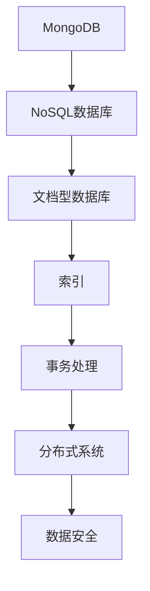

                 

# MongoDB原理与代码实例讲解

> 关键词：MongoDB, NoSQL数据库, 文档型数据库, 查询语言, 索引, 事务处理, 分布式系统, 数据安全

## 1. 背景介绍

### 1.1 问题由来
在传统的关系型数据库(Relational Database)中，数据以表和行的形式存在，并按照严格定义的数据模型进行操作。然而，随着数据规模的不断增长和应用场景的多样化，关系型数据库的复杂性和限制性开始显现。尤其是在处理半结构化、非结构化数据时，传统的关系型数据库的局限性愈发明显。

### 1.2 问题核心关键点
为应对这些问题，NoSQL数据库应运而生。NoSQL（Not Only SQL）泛指一系列非关系型数据库，如文档型数据库（Document-Oriented Database）、键值对数据库（Key-Value Database）、图形数据库（Graph Database）等。其中，文档型数据库以其灵活性和易用性受到广泛关注。MongoDB是文档型数据库的杰出代表，以其高性能、易扩展和灵活的数据模型成为互联网和移动应用的重要选择。

### 1.3 问题研究意义
MongoDB作为一种主流的文档型数据库，能够提供强大的数据存储和查询能力，适用于各种Web应用、移动应用、物联网设备等场景。理解MongoDB的核心原理和应用实践，对于掌握现代数据库技术、提升数据处理效率具有重要意义。本文将深入探讨MongoDB的工作原理、核心概念和代码实践，以期为MongoDB的学习和应用提供详细指导。

## 2. 核心概念与联系

### 2.1 核心概念概述

为更好地理解MongoDB，本节将介绍几个关键概念：

- MongoDB：一款流行的开源文档型数据库，提供高性能、可扩展的数据存储和查询能力。
- NoSQL数据库：非关系型数据库的缩写，指不使用传统SQL语言进行数据操作的数据库。
- 文档型数据库：基于文档存储的数据库，文档可以是JSON或BSON格式，每个文档是一个独立的实体。
- 索引：用于提高查询效率的辅助数据结构，支持对文档的快速访问。
- 事务处理：一组操作的原子性保证，确保数据一致性。
- 分布式系统：多台计算机协同工作，共同提供高可用性和高性能的分布式服务。
- 数据安全：保护数据库中的数据免受未授权访问、篡改和损坏。

这些概念之间的逻辑关系可以通过以下Mermaid流程图来展示：



这个流程图展示了一个MongoDB系统中的核心概念及其之间的关系：

1. MongoDB是基于NoSQL数据库的文档型数据库。
2. MongoDB中的文档可以包含任意键值对，灵活存储结构化、半结构化数据。
3. 索引是MongoDB中用于优化查询性能的关键组件。
4. MongoDB支持事务处理，确保数据一致性。
5. MongoDB在设计上支持分布式系统，适用于高并发和高可扩展性场景。
6. MongoDB提供了数据安全的多种措施，保障数据完整性。

这些概念共同构成了MongoDB的完整技术框架，使其能够在各种场景下发挥强大的数据管理能力。通过理解这些核心概念，我们可以更好地把握MongoDB的工作原理和优化方向。

## 3. 核心算法原理 & 具体操作步骤
### 3.1 算法原理概述

MongoDB的核心算法和操作流程包括以下几个关键环节：

- 数据存储：MongoDB将数据以文档的形式存储，每个文档是一个独立的实体，可以包含任意键值对。
- 索引支持：MongoDB支持多种索引类型，如单字段索引、复合索引、全文索引等，用于加速查询操作。
- 查询语言：MongoDB使用基于JSON格式的查询语言，支持丰富的查询操作符和聚合操作，方便进行复杂数据查询。
- 事务处理：MongoDB提供ACID事务支持，确保数据操作的原子性和一致性。
- 分布式系统：MongoDB设计为分布式系统，通过分片和副本集机制实现高可用性和性能优化。
- 数据安全：MongoDB提供数据加密、用户认证、审计日志等安全措施，保障数据安全。

### 3.2 算法步骤详解

MongoDB的核心算法步骤大致如下：

1. 数据存储：MongoDB将数据以文档的形式存储在磁盘上，每个文档是一个独立的JSON对象，包含多个键值对。

2. 索引优化：MongoDB通过B+树等数据结构实现索引，对查询操作进行优化，提高查询效率。

3. 查询执行：MongoDB使用查询语言进行数据检索，通过解析查询语句，执行对应的查询操作，并返回查询结果。

4. 事务处理：MongoDB支持ACID事务，确保数据操作的原子性和一致性，支持多文档事务。

5. 分布式操作：MongoDB通过分片和副本集机制，将数据分散存储在多个节点上，实现高可用性和性能优化。

6. 安全防护：MongoDB提供数据加密、用户认证、审计日志等安全措施，保护数据安全。

### 3.3 算法优缺点

MongoDB作为一种文档型数据库，具有以下优点：

1. 灵活存储：MongoDB支持灵活的数据模型，可以存储任意类型的文档，适用于多种应用场景。
2. 高可用性：MongoDB支持分布式系统，通过分片和副本集机制，确保数据的高可用性和高性能。
3. 高性能：MongoDB使用索引和查询优化技术，支持高效的数据检索和聚合操作。
4. 简单易用：MongoDB的查询语言基于JSON，与多种编程语言兼容，开发效率高。
5. 扩展性强：MongoDB支持水平扩展，可轻松应对数据量和并发量的增加。

同时，MongoDB也存在一些缺点：

1. 数据一致性：MongoDB在分布式环境下，数据一致性问题较为复杂，可能存在一定的延迟和数据不一致性。
2. 数据量限制：MongoDB对单个文档的大小有限制，可能不适合存储大规模结构化数据。
3. 性能瓶颈：在高并发环境下，MongoDB的性能可能会受到锁机制的影响，导致性能瓶颈。
4. 学习成本：MongoDB的概念和操作方式与传统关系型数据库不同，学习曲线较陡峭。

尽管存在这些缺点，MongoDB在Web应用、移动应用、物联网等领域得到了广泛应用，其强大的数据存储和查询能力使其成为许多企业数据管理的首选。

### 3.4 算法应用领域

MongoDB在多个领域中得到了广泛应用，涵盖以下几个主要方面：

1. Web应用：MongoDB因其高性能和易扩展性，成为Web应用的理想选择，广泛应用于社交网络、电子商务、内容管理等领域。

2. 移动应用：MongoDB支持多种编程语言和数据模型，在移动应用中得到广泛应用，如移动广告、位置服务、社交网络等。

3. 物联网：MongoDB支持海量数据存储和高效查询，适用于物联网设备的数据管理，如智能家居、智慧城市等。

4. 大数据分析：MongoDB支持丰富的查询语言和聚合操作，适用于大数据分析场景，如日志分析、实时监控等。

5. 实时应用：MongoDB支持高并发和高可用性，适用于实时应用场景，如在线游戏、金融交易等。

除了这些主要应用领域外，MongoDB还被广泛应用于许多其他场景，如文档型数据库的替代品、地理信息系统(GIS)、时间序列数据管理等。随着MongoDB技术的不断演进，其应用范围将进一步扩展。

## 4. 数学模型和公式 & 详细讲解  
### 4.1 数学模型构建

MongoDB的核心算法可以通过数学模型进行更加严格的刻画。

设MongoDB存储的文档集为 $D=\{d_1, d_2, \ldots, d_n\}$，其中每个文档 $d_i$ 包含多个键值对，表示为 $d_i = \{k_1:v_1, k_2:v_2, \ldots, k_m:v_m\}$。

MongoDB使用B+树索引对数据进行组织和管理，索引结构包含以下两个关键部分：

1. 节点：B+树的节点包含多个键值对和指向子节点的指针。
2. 叶子节点：叶子节点存储实际的数据文档。

MongoDB的查询语言基于JSON格式，其核心查询操作符包括：

1. 等值查询：$eq(k, v)$，表示查询键 $k$ 等于 $v$ 的文档。
2. 范围查询：$gte(k, v)$ 和 $lt(k, v)$，表示查询键 $k$ 大于等于 $v$ 或小于 $v$ 的文档。
3. 逻辑查询：$and(k_1, v_1) \wedge and(k_2, v_2) \wedge \ldots$，表示多个查询条件的逻辑与。
4. 聚合操作：$group_by(k)$、$sort_by(k)$、$limit(n)$，表示对查询结果进行分组、排序和限制。

### 4.2 公式推导过程

MongoDB的查询过程可以通过以下步骤进行数学推导：

1. 文档查找：将查询条件与文档进行匹配，找到符合条件的文档。
2. 索引扫描：在索引树中进行查找，快速定位符合条件的文档。
3. 结果合并：将匹配到的文档进行合并，返回最终的查询结果。

以一个简单的等值查询 $eq(k, v)$ 为例，MongoDB的查询过程如下：

- 文档查找：从存储引擎中读取所有文档，找到键值对 $(k, v)$ 匹配的文档。
- 索引扫描：在B+树索引中查找键值对 $(k, v)$，快速定位到文档位置。
- 结果合并：将匹配到的文档合并，返回最终的结果集。

通过上述查询过程，MongoDB能够在保证高效性的同时，提供灵活的数据检索能力。

### 4.3 案例分析与讲解

以下是一个MongoDB查询的示例：

```python
db.users.find({"age": {"$gte": 18, "$lt": 30}, "gender": "male"})
```

这个查询语句使用了MongoDB的查询语言，其中：

- $gte: 表示大于等于。
- $lt: 表示小于。
- $and: 表示逻辑与。

该查询将返回年龄在18到30岁之间，性别为男性的所有用户文档。

在查询过程中，MongoDB通过索引树快速定位到符合条件的文档，并返回结果集。这个示例展示了MongoDB灵活的查询语言和高效的查询能力。

## 5. 项目实践：代码实例和详细解释说明
### 5.1 开发环境搭建

在进行MongoDB开发前，我们需要准备好开发环境。以下是使用Python进行MongoDB开发的环境配置流程：

1. 安装MongoDB：从官网下载安装MongoDB社区版或企业版，并按照官方文档进行安装。
2. 安装MongoDB驱动程序：使用Python的PyMongo驱动程序，方便进行MongoDB操作。
```python
pip install pymongo
```
3. 启动MongoDB服务：启动MongoDB服务器，可以通过命令行或图形界面进行操作。
4. 连接MongoDB数据库：使用Python的PyMongo驱动程序连接MongoDB数据库，获取数据库和集合对象。

```python
from pymongo import MongoClient

client = MongoClient("mongodb://localhost:27017")
db = client["mydatabase"]
collection = db["mycollection"]
```

完成上述步骤后，即可在Python环境中开始MongoDB开发。

### 5.2 源代码详细实现

下面我们以MongoDB的数据插入和查询操作为例，给出Python代码实现。

首先，定义MongoDB的数据模型：

```python
class User:
    def __init__(self, name, age, gender):
        self.name = name
        self.age = age
        self.gender = gender
```

然后，定义MongoDB的插入和查询函数：

```python
from pymongo import MongoClient

# 插入数据
def insert_user(name, age, gender):
    db = MongoClient()["mydatabase"]["mycollection"]
    user = User(name, age, gender)
    db.insert_one(user)

# 查询数据
def find_users(age, gender):
    db = MongoClient()["mydatabase"]["mycollection"]
    result = db.find({"age": {"$gte": age, "$lt": age+10}, "gender": gender})
    return [User(x["name"], x["age"], x["gender"]) for x in result]
```

最后，启动数据插入和查询流程：

```python
# 插入数据
insert_user("张三", 20, "male")
insert_user("李四", 25, "male")
insert_user("王五", 30, "male")

# 查询数据
users = find_users(20, "male")
for user in users:
    print(user.name, user.age, user.gender)
```

以上就是使用Python进行MongoDB数据插入和查询操作的完整代码实现。可以看到，通过PyMongo驱动程序，我们可以方便地进行MongoDB的操作。

### 5.3 代码解读与分析

让我们再详细解读一下关键代码的实现细节：

**User类**：
- `__init__`方法：初始化用户对象，包含姓名、年龄、性别等属性。

**insert_user函数**：
- 使用MongoDB的驱动程序连接数据库，并插入用户对象。

**find_users函数**：
- 查询符合条件的用户文档，返回查询结果集。

**查询流程**：
- 先插入一些用户数据。
- 使用find_users函数查询符合条件的用户。
- 遍历查询结果，打印用户信息。

可以看到，MongoDB的查询操作与传统关系型数据库的SQL语句有所不同，但通过PyMongo驱动程序，我们仍然可以方便地进行数据操作。

当然，MongoDB的实际应用场景远不止数据插入和查询。开发者可以根据具体需求，进一步利用MongoDB的丰富特性，如索引、聚合、事务等，进行更复杂的数据操作。

## 6. 实际应用场景
### 6.1 智慧城市

MongoDB在智慧城市治理中得到了广泛应用，如城市事件监测、舆情分析、应急指挥等环节。MongoDB的高可用性和高性能，使其能够支撑大规模的城市数据管理需求。

在城市事件监测中，MongoDB可以实时存储和处理各类传感器数据，如交通流量、环境监测等。通过使用索引和查询语言，MongoDB可以高效地进行数据分析和可视化，帮助城市管理者及时发现和应对突发事件。

在舆情分析中，MongoDB可以存储各类社交媒体数据，如微博、微信、论坛等。通过使用全文索引和聚合操作，MongoDB可以对海量数据进行快速分析和挖掘，帮助城市管理者了解公众情绪和社会热点。

在应急指挥中，MongoDB可以存储各类应急数据，如气象信息、警情通报等。通过使用分布式系统和事务处理，MongoDB可以确保数据的可靠性和一致性，帮助城市管理者快速决策和指挥。

### 6.2 在线广告

MongoDB在在线广告领域得到了广泛应用，如广告投放、点击率分析、用户行为追踪等。MongoDB的高性能和易扩展性，使其能够支撑大规模的广告数据管理需求。

在广告投放中，MongoDB可以实时存储和处理广告点击数据，如广告ID、点击次数等。通过使用索引和查询语言，MongoDB可以高效地进行数据分析和统计，帮助广告主优化广告投放策略。

在点击率分析中，MongoDB可以存储各类用户点击数据，如用户ID、广告ID、点击时间等。通过使用聚合操作和统计函数，MongoDB可以对点击数据进行分析和挖掘，帮助广告主优化广告内容。

在用户行为追踪中，MongoDB可以存储各类用户行为数据，如浏览记录、点击记录等。通过使用索引和查询语言，MongoDB可以高效地进行数据分析和追踪，帮助广告主了解用户行为和偏好。

### 6.3 智能推荐

MongoDB在智能推荐系统中也得到了广泛应用，如商品推荐、内容推荐、用户画像等。MongoDB的高性能和灵活性，使其能够支撑复杂的推荐算法和数据管理需求。

在商品推荐中，MongoDB可以存储各类商品数据，如商品ID、商品描述、用户评分等。通过使用索引和查询语言，MongoDB可以高效地进行商品推荐和用户画像，帮助电商企业提升用户满意度。

在内容推荐中，MongoDB可以存储各类内容数据，如文章ID、文章标题、用户评分等。通过使用索引和查询语言，MongoDB可以高效地进行内容推荐和用户画像，帮助内容平台提升用户留存率。

在用户画像中，MongoDB可以存储各类用户数据，如用户ID、用户行为、用户评分等。通过使用索引和查询语言，MongoDB可以高效地进行用户画像和个性化推荐，帮助企业提升用户忠诚度和转化率。

### 6.4 未来应用展望

随着MongoDB技术的不断演进，其应用范围将进一步扩展。未来，MongoDB将在更多领域得到应用，为各行各业带来变革性影响。

在智慧医疗领域，MongoDB可以存储各类医疗数据，如病历、检查报告等。通过使用索引和查询语言，MongoDB可以高效地进行数据分析和挖掘，帮助医生提升诊疗水平。

在智能教育领域，MongoDB可以存储各类教育数据，如学生成绩、课程评价等。通过使用索引和查询语言，MongoDB可以高效地进行数据分析和追踪，帮助教育机构提升教学效果。

在金融领域，MongoDB可以存储各类金融数据，如交易记录、账户余额等。通过使用索引和查询语言，MongoDB可以高效地进行数据分析和统计，帮助金融机构提升风险控制和决策能力。

除了这些主要应用领域外，MongoDB还被广泛应用于许多其他场景，如物联网、大数据分析、实时应用等。随着MongoDB技术的不断演进，其应用范围将进一步扩展，为各行各业带来更多的创新和机遇。

## 7. 工具和资源推荐
### 7.1 学习资源推荐

为了帮助开发者系统掌握MongoDB的核心原理和应用实践，这里推荐一些优质的学习资源：

1. MongoDB官方文档：MongoDB官方提供的详细文档，涵盖了MongoDB的各类功能和API使用指南。

2. MongoDB入门教程：MongoDB官方网站提供的入门教程，适合初学者快速上手MongoDB。

3. MongoDB实战指南：《MongoDB实战指南》一书，深入浅出地介绍了MongoDB的原理、应用和实践，是学习MongoDB的经典教材。

4. MongoDB高级技术：《MongoDB高级技术》一书，深入探讨了MongoDB的高级功能和优化技术，适合进阶学习。

5. MongoDB课程：Coursera、Udemy等在线平台提供的MongoDB课程，涵盖从入门到高级的各类知识。

通过对这些资源的学习实践，相信你一定能够快速掌握MongoDB的核心原理和应用实践，并用于解决实际的业务问题。

### 7.2 开发工具推荐

高效的开发离不开优秀的工具支持。以下是几款用于MongoDB开发常用的工具：

1. MongoDB Compass：MongoDB官方提供的可视化管理工具，方便进行数据管理和查询操作。

2. PyMongo：Python官方提供的MongoDB驱动程序，方便进行MongoDB的操作。

3. MongoDB Atlas：MongoDB官方提供的云数据库服务，支持分布式部署和高可用性。

4. Robo 3T：一款基于Web的MongoDB管理工具，支持多数据库管理和可视化操作。

5. JetBrains MongoDB插件：为IntelliJ IDEA、PyCharm等IDE提供的MongoDB插件，方便进行MongoDB的开发和调试。

合理利用这些工具，可以显著提升MongoDB的开发效率，加快创新迭代的步伐。

### 7.3 相关论文推荐

MongoDB作为一种流行的NoSQL数据库，其核心技术和应用方法得到了广泛的研究。以下是几篇奠基性的相关论文，推荐阅读：

1. MongoDB: The Definitive Guide to MongoDB: A Complete Reference（《MongoDB权威指南》）：MongoDB权威指南，详细介绍了MongoDB的各类功能和API使用。

2. Optimizing Performance: Database Design Techniques and Best Practices for NoSQL Databases：探讨MongoDB的性能优化技术，提升MongoDB的性能和可靠性。

3. Large Scale Data Storage Management: An Analytical Review of NoSQL Databases: A Review of Large Scale Data Storage Management Using NoSQL Databases: An Analytical Review of NoSQL Databases（《NoSQL数据库存储管理综述》）：综述性论文，详细介绍了MongoDB等NoSQL数据库的存储管理技术。

4. MongoDB in Practice：MongoDB实战指南，深入探讨MongoDB的各类功能和应用实践，是学习MongoDB的经典教材。

这些论文代表了大数据存储管理领域的最新研究，为MongoDB的学习和应用提供了理论指导。

## 8. 总结：未来发展趋势与挑战

### 8.1 总结

本文对MongoDB的核心原理和应用实践进行了全面系统的介绍。首先阐述了MongoDB的工作原理和应用场景，明确了MongoDB在现代数据库技术中的重要地位。其次，从数据存储、索引优化、查询语言等方面，详细讲解了MongoDB的核心算法和操作步骤，给出了MongoDB的操作代码实例。同时，本文还广泛探讨了MongoDB在智慧城市、在线广告、智能推荐等多个领域的应用前景，展示了MongoDB的广泛适用性。

通过本文的系统梳理，可以看到，MongoDB作为一种文档型数据库，具有强大的数据存储和查询能力，适用于多种应用场景。理解MongoDB的核心原理和应用实践，对于掌握现代数据库技术、提升数据处理效率具有重要意义。

### 8.2 未来发展趋势

展望未来，MongoDB数据库将呈现以下几个发展趋势：

1. 分布式系统：MongoDB将继续优化其分布式系统架构，通过分片和副本集机制，支持更大规模的数据存储和查询。

2. 数据安全性：MongoDB将加强数据安全防护，提供更多的安全措施，如数据加密、用户认证等，保障数据安全。

3. 性能优化：MongoDB将继续优化其查询语言和索引机制，提升查询效率和数据处理能力。

4. 新型数据模型：MongoDB将探索更多新型数据模型，如时间序列数据、文档关系等，适应更加复杂的数据存储需求。

5. 云服务支持：MongoDB将继续拓展其云服务支持，提供更多的云数据库服务和解决方案，方便用户部署和管理。

这些趋势将使MongoDB在未来继续保持其高性能和易扩展性，成为更多行业和企业的首选数据库技术。

### 8.3 面临的挑战

尽管MongoDB在数据存储和查询方面具有强大优势，但在其发展过程中，也面临以下挑战：

1. 数据一致性：MongoDB在分布式环境下，数据一致性问题较为复杂，可能存在一定的延迟和数据不一致性。

2. 性能瓶颈：在高并发环境下，MongoDB的性能可能会受到锁机制的影响，导致性能瓶颈。

3. 学习曲线：MongoDB的概念和操作方式与传统关系型数据库不同，学习曲线较陡峭。

4. 安全防护：MongoDB需要不断提升其安全防护能力，避免数据泄露和篡改。

5. 扩展性限制：MongoDB对单个文档的大小有限制，可能不适合存储大规模结构化数据。

正视MongoDB面临的这些挑战，积极应对并寻求突破，将使MongoDB在未来的发展中不断完善和提升。

### 8.4 研究展望

面对MongoDB面临的这些挑战，未来的研究需要在以下几个方面寻求新的突破：

1. 分布式系统优化：进一步优化MongoDB的分布式系统架构，通过分片和副本集机制，支持更大规模的数据存储和查询。

2. 数据安全防护：加强MongoDB的数据安全防护，提供更多的安全措施，如数据加密、用户认证等，保障数据安全。

3. 性能优化：优化MongoDB的查询语言和索引机制，提升查询效率和数据处理能力。

4. 新型数据模型探索：探索更多新型数据模型，如时间序列数据、文档关系等，适应更加复杂的数据存储需求。

5. 云服务支持拓展：拓展MongoDB的云服务支持，提供更多的云数据库服务和解决方案，方便用户部署和管理。

这些研究方向的探索，将使MongoDB在未来继续保持其高性能和易扩展性，成为更多行业和企业的首选数据库技术。

## 9. 附录：常见问题与解答

**Q1：MongoDB与传统关系型数据库有哪些区别？**

A: MongoDB与传统关系型数据库的主要区别在于数据模型和查询语言。MongoDB采用文档型数据模型，每个文档包含任意键值对，而传统关系型数据库采用表格型数据模型，数据存储在固定模式的表格中。MongoDB的查询语言基于JSON格式，而传统关系型数据库使用SQL语言。

**Q2：MongoDB支持哪些数据类型？**

A: MongoDB支持多种数据类型，包括字符串、整数、浮点数、布尔值、日期、二进制数据等。对于复杂数据类型，MongoDB使用JSON格式存储，支持嵌套和数组。

**Q3：MongoDB如何进行数据分片？**

A: MongoDB通过分片机制实现数据分布存储，将数据分散存储在多个节点上，以支持高可用性和性能优化。MongoDB的分片机制支持按键和范围分片，可根据数据特性灵活配置。

**Q4：MongoDB支持哪些索引类型？**

A: MongoDB支持多种索引类型，包括单字段索引、复合索引、全文索引、地理空间索引等，可以根据查询需求选择合适的索引类型。

**Q5：MongoDB如何进行事务处理？**

A: MongoDB支持ACID事务处理，确保数据操作的原子性和一致性。MongoDB的事务处理机制支持多文档事务，可以在多个集合中进行原子性操作。

这些问答展示了MongoDB的核心概念和应用特性，帮助读者更好地理解MongoDB的工作原理和应用实践。

---

作者：禅与计算机程序设计艺术 / Zen and the Art of Computer Programming

