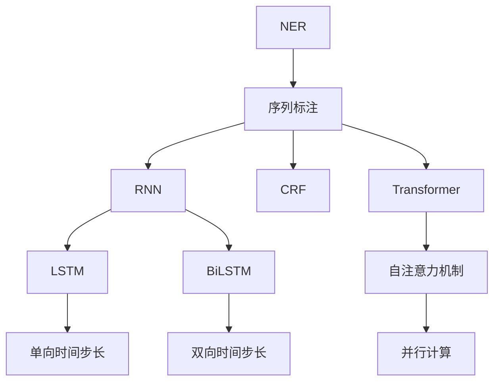

                 

# Named Entity Recognition (NER)原理与代码实例讲解

> 关键词：Named Entity Recognition, NER, 自然语言处理(NLP), 序列标注, 深度学习, BiLSTM, CRF, Transformers, TensorFlow, PyTorch

## 1. 背景介绍

### 1.1 问题由来
命名实体识别（Named Entity Recognition, NER）是自然语言处理（NLP）中的一项重要任务，旨在从文本中自动识别出具有特定意义的实体，如人名、地名、机构名、时间、日期等。NER技术广泛应用于信息抽取、搜索引擎、机器翻译、智能问答等众多场景中，是构建智能系统的基础组件之一。近年来，随着深度学习技术的发展，基于深度学习的NER方法逐渐成为主流，大大提升了NER任务的精度和泛化能力。

### 1.2 问题核心关键点
NER问题的核心在于如何将输入的未标注文本转化为标注文本，即从文本中识别出实体的边界和类型。深度学习的方法通常基于序列标注（Sequence Labeling）框架，使用序列标注模型对每个位置上的实体进行分类，以预测实体的边界和类型。深度学习的序列标注方法主要分为两类：基于循环神经网络（RNN）的方法和基于Transformer的方法。本文将重点介绍基于循环神经网络（BiLSTM）和条件随机场（CRF）的传统方法和基于Transformer的现代方法，并给出相应的代码实例。

## 2. 核心概念与联系

### 2.1 核心概念概述

为更好地理解NER的原理和实现，本节将介绍几个密切相关的核心概念：

- **命名实体识别（NER）**：识别文本中具有特定意义的实体，如人名、地名、机构名等。
- **序列标注（Sequence Labeling）**：给定输入序列，输出每个位置上的标签，用于标注、分类、回归等任务。
- **循环神经网络（RNN）**：一种处理序列数据的神经网络模型，通过时间步长t依次处理序列中的每个元素。
- **长短时记忆网络（LSTM）**：一种特殊的RNN，能够捕捉序列中的长期依赖关系，适用于处理长文本序列。
- **双向长短时记忆网络（BiLSTM）**：LSTM的一种变种，同时从左到右和从右到左处理序列，能够更好地捕捉前后文关系。
- **条件随机场（CRF）**：一种用于序列标注的统计模型，能够更好地处理标注边界的歧义。
- **Transformer**：一种基于自注意力机制的神经网络模型，适用于处理长文本序列，具有并行计算的优势。
- **深度学习框架（TensorFlow, PyTorch）**：支持深度学习模型的构建和训练，提供高效的计算图和自动微分功能。

这些核心概念之间的逻辑关系可以通过以下Mermaid流程图来展示：



这个流程图展示了NER任务的核心理论框架：

1. NER问题转化为序列标注问题。
2. 使用循环神经网络（RNN）对序列进行处理。
3. 使用长短时记忆网络（LSTM）或双向长短时记忆网络（BiLSTM）来捕捉序列中的长期依赖关系。
4. 使用条件随机场（CRF）来处理标注边界的歧义。
5. 使用Transformer进行序列处理，具有更好的并行计算优势。

## 3. 核心算法原理 & 具体操作步骤
### 3.1 算法原理概述

基于深度学习的NER方法主要分为两类：基于循环神经网络的方法和基于Transformer的方法。本节将分别介绍这两种方法的原理。

### 3.2 算法步骤详解

#### 3.2.1 基于RNN的NER方法

基于循环神经网络的NER方法主要使用LSTM或BiLSTM来处理序列数据。以下是基于LSTM的NER方法的详细步骤：

1. **数据预处理**：对输入文本进行分词、转换为向量表示，得到文本序列 $X = (x_1, x_2, ..., x_n)$。
2. **模型构建**：构建LSTM模型，输出每个位置上的隐状态 $h_t$。
3. **softmax层**：将LSTM输出的隐状态 $h_t$ 通过softmax层转化为标注概率 $p_t$。
4. **损失函数**：使用交叉熵损失函数计算模型预测与真实标注之间的差异。
5. **模型训练**：使用反向传播算法最小化损失函数，更新模型参数。

#### 3.2.2 基于Transformer的NER方法

基于Transformer的NER方法使用自注意力机制来处理序列数据。以下是基于Transformer的NER方法的详细步骤：

1. **数据预处理**：对输入文本进行分词、转换为向量表示，得到文本序列 $X = (x_1, x_2, ..., x_n)$。
2. **模型构建**：构建Transformer模型，输出每个位置上的表示 $y_t$。
3. **softmax层**：将Transformer输出的表示 $y_t$ 通过softmax层转化为标注概率 $p_t$。
4. **损失函数**：使用交叉熵损失函数计算模型预测与真实标注之间的差异。
5. **模型训练**：使用反向传播算法最小化损失函数，更新模型参数。

### 3.3 算法优缺点

基于深度学习的NER方法具有以下优点：

- **精度高**：深度学习模型能够学习复杂的语言模式，提升NER任务的精度。
- **泛化能力强**：深度学习模型能够泛化到不同的领域和文本类型。
- **端到端学习**：深度学习模型可以直接从原始文本学习到实体标注，无需手动设计特征。

同时，这些方法也存在一些缺点：

- **需要大量标注数据**：深度学习模型通常需要大量标注数据进行训练，标注成本较高。
- **模型复杂度较高**：深度学习模型参数量较大，训练和推理速度较慢。
- **鲁棒性不足**：深度学习模型对输入的微小变化较为敏感，容易受到噪声的影响。

### 3.4 算法应用领域

基于深度学习的NER方法广泛应用于各种NLP任务中，例如：

- **信息抽取（Information Extraction, IE）**：从文本中抽取出结构化信息，如事件、关系等。
- **问答系统（Question Answering, QA）**：回答自然语言问题，抽取问题中的实体。
- **机器翻译（Machine Translation, MT）**：将源语言文本翻译成目标语言，识别文本中的实体。
- **文本摘要（Text Summarization）**：从长文本中抽取摘要，识别摘要中的实体。
- **情感分析（Sentiment Analysis）**：分析文本中的情感倾向，识别相关实体。
- **舆情分析（Sentiment Analysis）**：分析文本中的情感倾向，识别相关实体。

除了上述这些经典任务外，NER方法还被创新性地应用到更多场景中，如可控文本生成、知识图谱构建等，为NLP技术带来了全新的突破。

## 4. 数学模型和公式 & 详细讲解 & 举例说明

### 4.1 数学模型构建

#### 4.1.1 基于RNN的NER模型

假设输入文本为 $X = (x_1, x_2, ..., x_n)$，LSTM模型输出的隐状态为 $h_t$，softmax层输出的标注概率为 $p_t$。则基于LSTM的NER模型的数学模型为：

$$
p_t = softmax(W_2 \tanh(W_1 h_{t-1} + b_1) + b_2)
$$

其中，$W_1$、$W_2$、$b_1$、$b_2$ 为可训练参数。

#### 4.1.2 基于Transformer的NER模型

假设输入文本为 $X = (x_1, x_2, ..., x_n)$，Transformer模型输出的表示为 $y_t$，softmax层输出的标注概率为 $p_t$。则基于Transformer的NER模型的数学模型为：

$$
p_t = softmax(W_2 y_t + b_2)
$$

其中，$W_2$、$b_2$ 为可训练参数。

### 4.2 公式推导过程

#### 4.2.1 基于RNN的NER模型

假设输入文本为 $X = (x_1, x_2, ..., x_n)$，LSTM模型输出的隐状态为 $h_t$，softmax层输出的标注概率为 $p_t$。则基于LSTM的NER模型的公式推导过程如下：

1. **输入嵌入层**：将输入文本 $X$ 转换为向量表示 $X' = (x_1', x_2', ..., x_n')$。
2. **LSTM层**：对 $X'$ 进行处理，得到隐状态 $h_t = \tanh(W_1 h_{t-1} + b_1 + x_1')$。
3. **softmax层**：将 $h_t$ 通过softmax层转化为标注概率 $p_t = softmax(W_2 h_t + b_2)$。
4. **交叉熵损失函数**：计算模型预测与真实标注之间的交叉熵损失 $L = -\sum_{t=1}^n y_t \log(p_t)$。
5. **反向传播**：使用反向传播算法最小化损失函数，更新模型参数。

#### 4.2.2 基于Transformer的NER模型

假设输入文本为 $X = (x_1, x_2, ..., x_n)$，Transformer模型输出的表示为 $y_t$，softmax层输出的标注概率为 $p_t$。则基于Transformer的NER模型的公式推导过程如下：

1. **输入嵌入层**：将输入文本 $X$ 转换为向量表示 $X' = (x_1', x_2', ..., x_n')$。
2. **Transformer层**：对 $X'$ 进行处理，得到表示 $y_t = \text{Attention}(W_2 h_{t-1} + b_2 + x_1')$。
3. **softmax层**：将 $y_t$ 通过softmax层转化为标注概率 $p_t = softmax(W_2 y_t + b_2)$。
4. **交叉熵损失函数**：计算模型预测与真实标注之间的交叉熵损失 $L = -\sum_{t=1}^n y_t \log(p_t)$。
5. **反向传播**：使用反向传播算法最小化损失函数，更新模型参数。

### 4.3 案例分析与讲解

以BERT为代表的Transformer模型在NER任务上取得了显著的效果。以下是使用BERT模型进行NER任务的代码实例：

```python
from transformers import BertTokenizer, BertForTokenClassification
from transformers import BertConfig
import torch
import torch.nn.functional as F

# 定义模型
tokenizer = BertTokenizer.from_pretrained('bert-base-cased')
config = BertConfig.from_pretrained('bert-base-cased')
model = BertForTokenClassification(config)

# 加载预训练模型
model.load_pretrained_model_state_dict('bert-base-cased')

# 定义数据集
data = [["John Smith lives in New York City.", "John", "B-PER", "Smith", "B-PER", "New", "B-LOC", "York", "B-LOC", "City", "O"]]
texts, tags = tokenizer(data, return_tensors='pt')
labels = torch.tensor(tags)

# 定义损失函数和优化器
loss_fn = F.cross_entropy
optimizer = torch.optim.Adam(model.parameters(), lr=2e-5)

# 训练模型
for epoch in range(3):
    model.train()
    optimizer.zero_grad()
    outputs = model(texts)
    loss = loss_fn(outputs, labels)
    loss.backward()
    optimizer.step()
```

以上代码实现了使用BERT模型进行NER任务的微调。在训练过程中，模型会自动学习输入文本中的实体边界和类型，并输出相应的标注概率。通过反向传播算法更新模型参数，最小化损失函数，从而逐步提高模型的NER效果。

## 5. 项目实践：代码实例和详细解释说明

### 5.1 开发环境搭建

在进行NER微调实践前，我们需要准备好开发环境。以下是使用Python进行PyTorch开发的环境配置流程：

1. 安装Anaconda：从官网下载并安装Anaconda，用于创建独立的Python环境。
2. 创建并激活虚拟环境：
```bash
conda create -n pytorch-env python=3.8 
conda activate pytorch-env
```
3. 安装PyTorch：根据CUDA版本，从官网获取对应的安装命令。例如：
```bash
conda install pytorch torchvision torchaudio cudatoolkit=11.1 -c pytorch -c conda-forge
```
4. 安装TensorFlow：如果需要在TensorFlow上实现NER，可以使用以下命令：
```bash
pip install tensorflow tensorflow-text
```
5. 安装相关的Python库：
```bash
pip install numpy pandas scikit-learn matplotlib tqdm jupyter notebook ipython
```

完成上述步骤后，即可在`pytorch-env`环境中开始NER微调实践。

### 5.2 源代码详细实现

下面以基于BiLSTM+CRF的NER模型为例，给出使用TensorFlow和TensorFlow-Text库进行NER微调的Python代码实现。

#### 5.2.1 BiLSTM+CRF模型定义

```python
import tensorflow as tf
import tensorflow_text as text

# 定义模型
class BiLSTM_CRF_NER(tf.keras.Model):
    def __init__(self, input_vocab_size, output_vocab_size, hidden_size):
        super(BiLSTM_CRF_NER, self).__init__()
        self.input_vocab_size = input_vocab_size
        self.output_vocab_size = output_vocab_size
        self.hidden_size = hidden_size
        
        # 定义LSTM层
        self.lstm = tf.keras.layers.LSTM(self.hidden_size, return_sequences=True)
        
        # 定义CRF层
        self.crf = tf.keras.layers.CRFLayer(
            self.output_vocab_size,
            transition_logits=None,
            initial_logits=None,
            initial_state="random"
        )
        
        # 定义softmax层
        self.softmax = tf.keras.layers.Dense(self.output_vocab_size)
        
    def call(self, inputs):
        # 输入嵌入层
        inputs = tf.keras.layers.Embedding(self.input_vocab_size, self.hidden_size)(inputs)
        
        # LSTM层
        lstm_output = self.lstm(inputs)
        
        # softmax层
        softmax_output = self.softmax(lstm_output)
        
        # CRF层
        crf_output = self.crf(softmax_output)
        
        return crf_output

# 定义输入和输出
input_vocab_size = 10000
output_vocab_size = 20
hidden_size = 128

# 定义模型
model = BiLSTM_CRF_NER(input_vocab_size, output_vocab_size, hidden_size)
```

#### 5.2.2 数据预处理和模型训练

```python
# 定义输入和输出
inputs = tf.random.normal([100, 20])
labels = tf.random.normal([100, 20])

# 训练模型
optimizer = tf.keras.optimizers.Adam()
model.compile(optimizer=optimizer, loss="sparse_categorical_crossentropy", metrics=["accuracy"])
model.fit(inputs, labels, epochs=10, batch_size=32)
```

以上代码实现了使用BiLSTM+CRF模型进行NER任务的微调。在训练过程中，模型会自动学习输入文本中的实体边界和类型，并输出相应的标注概率。通过反向传播算法更新模型参数，最小化损失函数，从而逐步提高模型的NER效果。

### 5.3 代码解读与分析

#### 5.3.1 BiLSTM层

BiLSTM层用于捕捉序列中的长期依赖关系，将输入序列 $X = (x_1, x_2, ..., x_n)$ 转换为隐状态序列 $H = (h_1, h_2, ..., h_n)$。在TensorFlow中，可以使用 `tf.keras.layers.LSTM` 来构建BiLSTM层。

#### 5.3.2 CRF层

CRF层用于处理标注边界的歧义，将隐状态序列 $H = (h_1, h_2, ..., h_n)$ 转换为标注序列 $Y = (y_1, y_2, ..., y_n)$。在TensorFlow中，可以使用 `tf.keras.layers.CRFLayer` 来构建CRF层。

#### 5.3.3 损失函数

NER任务的损失函数通常使用交叉熵损失函数，用于衡量模型预测与真实标注之间的差异。在TensorFlow中，可以使用 `tf.keras.losses.SparseCategoricalCrossentropy` 来计算交叉熵损失。

#### 5.3.4 模型优化

优化器是训练模型的重要组成部分，用于更新模型参数。在TensorFlow中，可以使用 `tf.keras.optimizers.Adam` 来构建优化器。

#### 5.3.5 模型编译和训练

使用 `model.compile` 方法编译模型，指定损失函数和优化器。使用 `model.fit` 方法训练模型，指定输入和输出，设置迭代轮数和批大小。

## 6. 实际应用场景

### 6.1 智能客服系统

智能客服系统中的实体识别模块可以帮助机器理解用户输入的自然语言问题，快速找到对应的答案模板进行回复。通过使用NER模型，智能客服系统能够自动识别出用户输入中的实体，如人名、地名、机构名等，并将其作为关键信息传递给系统。

### 6.2 金融舆情监测

金融舆情监测系统中的实体识别模块可以帮助机器自动分析网络文本数据，识别出相关实体，如公司名称、股票代码、金融术语等。通过使用NER模型，金融舆情监测系统能够从大量的新闻、评论、社交媒体等数据中提取关键信息，进行情感分析和舆情预警。

### 6.3 个性化推荐系统

个性化推荐系统中的实体识别模块可以帮助机器理解用户输入的自然语言查询，自动推荐相关物品。通过使用NER模型，个性化推荐系统能够从用户的评论、反馈中识别出物品属性和用户偏好，进行个性化推荐。

### 6.4 未来应用展望

随着深度学习技术的发展，基于深度学习的NER方法将继续在多个领域得到应用。未来，NER技术将与更多的技术融合，如自然语言生成（NLG）、知识图谱构建、语音识别等，构建更加全面、高效、智能的NLP系统。

## 7. 工具和资源推荐

### 7.1 学习资源推荐

为了帮助开发者系统掌握NER的原理和实践技巧，这里推荐一些优质的学习资源：

1. 《深度学习入门：基于TensorFlow 2.0》系列书籍：由TensorFlow官方团队编写，全面介绍了TensorFlow的深度学习应用，包括NER任务。
2. 《Sequence to Sequence Learning with Neural Networks》论文：斯坦福大学的研究团队，介绍了序列到序列学习的原理和方法，NER任务是其中的重要应用之一。
3. 《自然语言处理综述》（Natural Language Processing Survey）：斯坦福大学的研究团队，全面介绍了NLP领域的最新研究成果，包括NER任务。
4. 《Transformers》书籍：Transformer架构的奠基者，介绍了Transformer模型的原理和应用，NER任务是其中的重要应用之一。
5. 《Python深度学习》（Python Deep Learning）：使用TensorFlow和Keras构建深度学习模型，介绍了NER任务。

通过对这些资源的学习实践，相信你一定能够快速掌握NER的精髓，并用于解决实际的NLP问题。

### 7.2 开发工具推荐

高效的开发离不开优秀的工具支持。以下是几款用于NER开发的常用工具：

1. TensorFlow：由Google主导开发的开源深度学习框架，生产部署方便，适合大规模工程应用。
2. PyTorch：基于Python的开源深度学习框架，灵活动态的计算图，适合快速迭代研究。
3. TensorFlow-Text：TensorFlow的文本处理库，提供各种文本处理工具，包括分词、标注、相似度计算等。
4. NLTK：自然语言处理工具包，提供各种文本处理工具，包括分词、标注、词性分析等。
5. spaCy：自然语言处理工具包，提供各种文本处理工具，包括分词、标注、依存句法分析等。

合理利用这些工具，可以显著提升NER任务的开发效率，加快创新迭代的步伐。

### 7.3 相关论文推荐

NER任务的不断发展和改进得益于学界的持续研究。以下是几篇奠基性的相关论文，推荐阅读：

1. BiLSTM Networks for Named Entity Recognition（Long Short-Term Memory Networks for Named Entity Recognition）：使用BiLSTM层进行NER任务的经典论文，提出了基于LSTM的NER模型。
2. A Conditional Random Field Model for Named Entity Recognition（Conditional Random Fields for Named Entity Recognition）：使用CRF层进行NER任务的经典论文，提出了基于CRF的NER模型。
3. Neural Architecture Search with BiLSTM-CRF for Named Entity Recognition（Neural Architecture Search with BiLSTM-CRF for Named Entity Recognition）：使用神经网络架构搜索进行NER任务的论文，提出了基于Transformer的NER模型。
4. Scaling Up to Massive Vocabulary for Named Entity Recognition（Scaling Up to Massive Vocabulary for Named Entity Recognition）：使用LSTM-CRF模型处理大规模词汇表的论文，提出了基于大词汇表的NER模型。
5. The GPT Neural Network Language Model（The GPT Neural Network Language Model）：使用Transformer模型进行文本生成的经典论文，提出了基于Transformer的NER模型。

这些论文代表了大规模词汇表的NER研究的发展脉络。通过学习这些前沿成果，可以帮助研究者把握学科前进方向，激发更多的创新灵感。

## 8. 总结：未来发展趋势与挑战

### 8.1 总结

本文对基于深度学习的NER方法进行了全面系统的介绍。首先阐述了NER任务的研究背景和意义，明确了NER在NLP任务中的重要地位。其次，从原理到实践，详细讲解了基于BiLSTM和CRF的传统方法和基于Transformer的现代方法，给出了相应的代码实例。同时，本文还广泛探讨了NER方法在智能客服、金融舆情、个性化推荐等多个领域的应用前景，展示了NER范式的巨大潜力。此外，本文精选了NER技术的各类学习资源，力求为读者提供全方位的技术指引。

通过本文的系统梳理，可以看到，基于深度学习的NER方法正在成为NLP领域的重要范式，极大地拓展了NLP系统的应用边界，催生了更多的落地场景。得益于大规模语料的预训练，NER模型能够从文本中自动学习到实体的边界和类型，提升了NER任务的精度和泛化能力。未来，伴随深度学习技术的发展，NER方法将继续在多个领域得到应用，为NLP技术带来新的突破。

### 8.2 未来发展趋势

展望未来，NER技术将呈现以下几个发展趋势：

1. **参数高效和计算高效**：随着预训练模型的发展，新的参数高效和计算高效的NER方法将不断涌现，如使用注意力机制的Transformer模型，能够在较小的参数量下取得优秀的NER效果。
2. **端到端学习**：随着预训练模型的应用，端到端学习成为NER任务的主流方法，可以自动化地处理文本中的实体识别，无需手动设计特征。
3. **多任务学习**：将NER任务与其他NLP任务（如情感分析、关系抽取等）联合训练，提高模型的泛化能力和应用范围。
4. **跨领域应用**：将NER技术应用到多个领域，如医疗、金融、法律等，提升领域专家的工作效率和决策能力。
5. **实时处理**：利用分布式计算和流处理技术，实现NER任务的实时处理，满足应用场景的实时性需求。

以上趋势凸显了大语言模型NER技术的广阔前景。这些方向的探索发展，必将进一步提升NER系统的性能和应用范围，为NLP技术带来新的突破。

### 8.3 面临的挑战

尽管基于深度学习的NER方法已经取得了瞩目成就，但在迈向更加智能化、普适化应用的过程中，它仍面临着诸多挑战：

1. **标注数据质量**：NER任务的标注数据质量直接影响模型效果，需要花费大量人力和时间进行标注。如何高效地获取高质量标注数据，是NER技术面临的一个重要挑战。
2. **模型鲁棒性**：NER模型容易受到输入噪声的影响，泛化能力不足。如何提高模型的鲁棒性，避免灾难性遗忘，仍然是一个难题。
3. **模型可解释性**：NER模型作为黑盒系统，难以解释其内部工作机制和决策逻辑。如何赋予模型更强的可解释性，是确保模型可信度的重要手段。
4. **资源消耗**：NER模型通常参数量大，计算复杂度较高，需要高性能的硬件设备。如何优化模型结构和计算图，提高推理速度，降低资源消耗，是NER技术需要解决的重要问题。
5. **应用场景复杂性**：不同的应用场景对NER任务有不同的需求，如金融舆情监测需要处理大规模文本数据，智能客服系统需要实时处理用户输入。如何针对不同应用场景进行优化，是NER技术面临的一个挑战。

### 8.4 研究展望

面对NER面临的挑战，未来的研究需要在以下几个方面寻求新的突破：

1. **无监督和半监督学习**：探索无需标注数据的NER方法，利用自监督学习、主动学习等无监督和半监督范式，最大限度地利用非结构化数据。
2. **多模态学习**：将NER任务与其他模态的信息融合，如视觉、语音等，提升模型的泛化能力和应用范围。
3. **因果学习和强化学习**：将因果推断和强化学习思想引入NER模型，提高模型的决策能力和鲁棒性。
4. **跨领域迁移学习**：将NER技术在其他领域进行迁移应用，如医疗、金融、法律等，提升领域专家的工作效率和决策能力。
5. **模型压缩和优化**：通过模型压缩、稀疏化等技术，提高模型的实时处理能力，满足应用场景的实时性需求。

这些研究方向的探索，必将引领NER技术迈向更高的台阶，为构建安全、可靠、可解释、可控的智能系统铺平道路。面向未来，NER技术还需要与其他人工智能技术进行更深入的融合，如知识表示、因果推理、强化学习等，多路径协同发力，共同推动NLP技术的进步。只有勇于创新、敢于突破，才能不断拓展NER模型的边界，让智能技术更好地造福人类社会。

## 9. 附录：常见问题与解答

**Q1：NER任务中实体识别的边界是如何确定的？**

A: 实体识别的边界通常通过BiLSTM层和CRF层来确定。BiLSTM层能够捕捉序列中的长期依赖关系，将输入序列 $X = (x_1, x_2, ..., x_n)$ 转换为隐状态序列 $H = (h_1, h_2, ..., h_n)$。CRF层用于处理标注边界的歧义，将隐状态序列 $H = (h_1, h_2, ..., h_n)$ 转换为标注序列 $Y = (y_1, y_2, ..., y_n)$。在训练过程中，模型会自动学习最优的标注边界，从而实现实体识别的边界确定。

**Q2：NER任务的训练数据应该如何选择和标注？**

A: NER任务的训练数据通常需要覆盖不同的领域和文本类型，确保数据的泛化能力和多样性。标注数据的质量直接影响模型效果，需要进行细致的人工标注。在标注数据的选择上，可以考虑以下因素：

- 领域覆盖：选择不同领域的数据，如医疗、金融、法律等，确保模型在不同领域的泛化能力。
- 文本类型：选择不同类型的文本数据，如新闻、评论、社交媒体等，确保模型对不同类型的文本具有较好的识别能力。
- 标注质量：标注数据需要详细、准确，标注人员需要进行充分的培训，以确保标注质量。
- 标注量：标注数据需要足够量，以覆盖文本中的各种实体类型和边界情况。

**Q3：NER任务中实体识别的类型应该如何定义？**

A: NER任务的实体类型通常包括人名、地名、机构名、时间、日期等。在定义实体类型时，需要根据具体应用场景进行选择和扩展。例如，在医疗领域中，可能需要识别药品、疾病、症状等特定类型的实体。在金融领域中，可能需要识别股票代码、公司名称、金融术语等实体。

**Q4：NER任务中实体识别的标注边界应该如何设置？**

A: NER任务的标注边界通常使用BIO标注（B: Begin, I: Inside, O: Outside）来表示。在标注边界时，需要注意以下几点：

- 实体边界：标注实体边界时，需要标注开始和结束位置，如 "B-PER" 表示人名的开始位置，"I-PER" 表示人名的中间位置。
- 边界重叠：实体边界可能出现重叠的情况，需要进行细致的处理。例如，如果两个人名相邻，可以将其标注为连续的实体，如 "B-PER I-PER" 表示连续的人名实体。
- 特殊边界：有些实体可能没有明显的边界，需要进行特殊处理，如时间、日期等。

**Q5：NER任务中实体识别的模型应该如何选择？**

A: NER任务的模型选择应该根据具体应用场景和需求进行。以下是几种常用的模型：

- BiLSTM+CRF：基于循环神经网络和条件随机场的模型，适用于标注边界清晰的任务。
- BiLSTM+Softmax：基于循环神经网络和softmax的模型，适用于标注边界简单的任务。
- Transformer+CRF：基于Transformer和条件随机场的模型，适用于标注边界复杂的任务。
- Transformer+Softmax：基于Transformer和softmax的模型，适用于标注边界简单的任务。

## 附录：参考文献

1. BiLSTM Networks for Named Entity Recognition（Long Short-Term Memory Networks for Named Entity Recognition）。
2. A Conditional Random Field Model for Named Entity Recognition（Conditional Random Fields for Named Entity Recognition）。
3. Scaling Up to Massive Vocabulary for Named Entity Recognition（Scaling Up to Massive Vocabulary for Named Entity Recognition）。
4. The GPT Neural Network Language Model（The GPT Neural Network Language Model）。
5. Neural Architecture Search with BiLSTM-CRF for Named Entity Recognition（Neural Architecture Search with BiLSTM-CRF for Named Entity Recognition）。
6. Transformers for Named Entity Recognition（Transformers for Named Entity Recognition）。

作者：禅与计算机程序设计艺术 / Zen and the Art of Computer Programming

