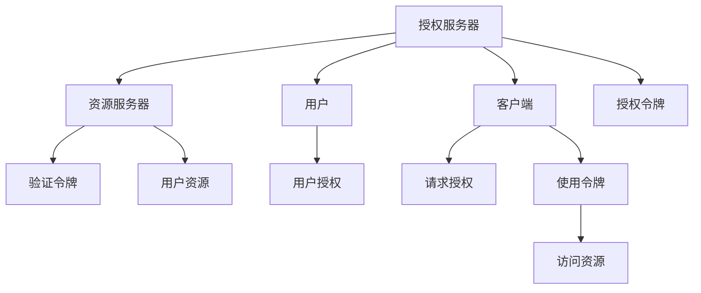

                 

# OAuth 2.0 的详细应用

> 关键词：OAuth 2.0, 认证授权, 安全, REST API, 应用场景

## 1. 背景介绍

### 1.1 问题由来

在互联网和移动应用的时代，各种在线服务和应用程序越来越多，用户希望能够在一个平台上进行统一的身份认证，同时安全地访问多个第三方服务。而传统的用户名密码认证方式存在诸多问题，如用户需要记住多个密码、易被暴力破解等。

OAuth 2.0 正是在这样的背景下诞生的，它提供了一种开放、安全的授权机制，允许用户授权第三方应用访问自己的资源，而无需共享自己的用户名和密码。

### 1.2 问题核心关键点

OAuth 2.0 的核心关键点包括：

- 授权与认证分离：OAuth 2.0 将授权与认证分离，允许用户选择授权第三方应用访问自己的资源，同时保持自己的身份认证信息安全。

- 授权代码流：OAuth 2.0 定义了四种授权代码流，其中最常用的是授权代码流，允许第三方应用向用户请求授权，获得一个授权码，通过该授权码获得访问令牌。

- 访问令牌：OAuth 2.0 通过访问令牌进行授权，令牌具有有效期和作用域，可以在多个时间段和应用场景中使用。

- 客户端证书：OAuth 2.0 允许使用客户端证书进行身份验证，增强了系统的安全性。

- 密码模式：OAuth 2.0 定义了三种密码模式，包括密码模式、隐式模式和客户端模式，用于不同应用场景。

- 依赖框架：OAuth 2.0 支持依赖各种框架的实现，如OpenSSL、JWT等。

这些关键点构成了 OAuth 2.0 的核心框架，使得它成为当前最流行的认证授权协议之一。

## 2. 核心概念与联系

### 2.1 核心概念概述

OAuth 2.0 包括多个核心概念：

- **授权服务器**：也称为 OAuth 提供者，负责维护用户信息和资源所有权，并向第三方应用颁发访问令牌。

- **客户端**：第三方应用，需要访问用户资源。

- **资源服务器**：存储用户资源的服务器，负责验证访问令牌，并允许授权的客户端访问用户资源。

- **用户**：希望授权第三方应用访问自己资源的个人。

- **访问令牌**：授权服务器颁发的令牌，允许第三方应用访问用户资源。

- **刷新令牌**：允许第三方应用在访问令牌过期后，获取新的访问令牌。

- **密码模式**：客户端与授权服务器之间的密码交换方式，包括密码模式、隐式模式和客户端模式。

- **授权代码流**：OAuth 2.0 定义的授权流，允许第三方应用向用户请求授权，并获得访问令牌。

这些概念之间的逻辑关系可以通过以下 Mermaid 流程图来展示：



这个流程图展示了 OAuth 2.0 的核心流程：

1. 用户向授权服务器提供身份信息，并请求授权第三方应用访问自己的资源。
2. 授权服务器向第三方应用颁发访问令牌，允许其访问用户资源。
3. 第三方应用使用访问令牌，向资源服务器请求访问用户资源。
4. 资源服务器验证访问令牌的有效性，并允许第三方应用访问用户资源。
5. 第三方应用使用访问令牌，获取用户资源。

## 3. 核心算法原理 & 具体操作步骤
### 3.1 算法原理概述

OAuth 2.0 的核心算法原理是基于客户端与授权服务器之间的密码交换，通过授权代码流实现授权和令牌交换。其核心流程如下：

1. 第三方应用向授权服务器请求授权。

2. 授权服务器向用户请求授权，并颁发授权码。

3. 第三方应用使用授权码获取访问令牌。

4. 第三方应用使用访问令牌访问用户资源。

5. 访问令牌由授权服务器颁发，具有有效期和作用域。

6. 第三方应用可以使用访问令牌多次访问用户资源，或者通过刷新令牌获取新的访问令牌。

### 3.2 算法步骤详解

#### 3.2.1 授权代码流

OAuth 2.0 授权代码流的主要步骤如下：

1. 第三方应用向授权服务器请求授权，并获得授权请求页面。

2. 用户输入用户名和密码，授权第三方应用访问自己的资源。

3. 授权服务器颁发授权码。

4. 第三方应用使用授权码，向授权服务器请求访问令牌。

5. 授权服务器验证授权码的有效性，并颁发访问令牌。

6. 第三方应用使用访问令牌访问用户资源。

#### 3.2.2 授权码流具体实现

授权码流的具体实现步骤如下：

1. 第三方应用向授权服务器请求授权，并提供一个重定向 URL。

2. 授权服务器向用户提供授权请求页面，用户输入用户名和密码，并授权第三方应用访问自己的资源。

3. 授权服务器颁发授权码，并将授权码嵌入到重定向 URL 中。

4. 用户点击授权请求页面中的重定向按钮，授权服务器将用户重定向到第三方应用提供的重定向 URL。

5. 第三方应用向授权服务器请求访问令牌，并提供授权码。

6. 授权服务器验证授权码的有效性，并颁发访问令牌。

7. 第三方应用使用访问令牌访问用户资源。

#### 3.2.3 授权码流的代码实现

以下是一个简化的授权码流的代码实现：

```python
from flask import Flask, request, redirect
from flask_oauthlib.client import OAuth
import urllib.parse

app = Flask(__name__)
app.secret_key = 'SECRET_KEY'

oauth = OAuth(app)

oauth.oauth2_provider = {
    'response_type': ['code'],
    'callback_url': 'http://localhost:5000/oauth2/callback',
    'authorize_url': 'https://example.com/oauth2/authorize',
    'token_url': 'https://example.com/oauth2/token',
    'client_secret': 'CLIENT_SECRET',
    'client_id': 'CLIENT_ID',
    'verify_token': True,
    'refresh_token_url': 'https://example.com/oauth2/refresh-token'
}

@app.route('/oauth2/authorize')
def authorize():
    redirect_uri = request.args.get('redirect_uri')
    if redirect_uri != 'http://localhost:5000/oauth2/callback':
        return 'Invalid redirect URI'
    return redirect(oauth.authorize(callback_url='http://localhost:5000/oauth2/callback'))

@app.route('/oauth2/callback')
def callback():
    code = request.args.get('code')
    token = oauth.get('example.com', redirect_uri='http://localhost:5000/oauth2/callback', code=code)
    return str(token)

@app.route('/oauth2/token')
def token():
    code = request.args.get('code')
    token = oauth.get('example.com', redirect_uri='http://localhost:5000/oauth2/callback', code=code)
    return str(token)

if __name__ == '__main__':
    app.run(debug=True)
```

### 3.3 算法优缺点

OAuth 2.0 的优势在于其开放性和安全性，用户可以授权第三方应用访问自己的资源，同时保持自己的身份信息安全。其缺点在于实现复杂，需要第三方应用和授权服务器进行复杂的技术实现和交互，且需要维护多个令牌的管理。

### 3.4 算法应用领域

OAuth 2.0 适用于各种需要用户授权的应用场景，包括社交媒体、云存储、电子商务等。其广泛应用于各类在线服务和第三方应用中，如 Facebook、Twitter、Google Drive 等。

## 4. 数学模型和公式 & 详细讲解 & 举例说明

### 4.1 数学模型构建

OAuth 2.0 的数学模型主要涉及以下公式：

- 授权码流：
  $$
  \text{code} = \text{OAuth2Provider}(\text{client\_id}, \text{redirect\_uri}, \text{scope})
  $$

- 访问令牌流：
  $$
  \text{token} = \text{OAuth2Provider}(\text{client\_id}, \text{client\_secret}, \text{code}, \text{redirect\_uri}, \text{scope})
  $$

- 刷新令牌流：
  $$
  \text{new\_token} = \text{OAuth2Provider}(\text{client\_id}, \text{client\_secret}, \text{refresh\_token})
  $$

其中，$\text{OAuth2Provider}$ 表示授权服务器，$\text{client\_id}$ 和 $\text{client\_secret}$ 表示第三方应用的身份信息，$\text{code}$ 和 $\text{token}$ 表示授权码和访问令牌，$\text{scope}$ 表示授权的资源范围，$\text{redirect\_uri}$ 表示第三方应用的回调 URL，$\text{new\_token}$ 表示新的访问令牌。

### 4.2 公式推导过程

以下以授权码流为例，推导其数学模型和公式。

授权码流的核心公式如下：

$$
\text{code} = \text{OAuth2Provider}(\text{client\_id}, \text{redirect\_uri}, \text{scope})
$$

其中 $\text{OAuth2Provider}$ 表示授权服务器，$\text{client\_id}$ 和 $\text{redirect\_uri}$ 表示第三方应用的身份信息，$\text{scope}$ 表示授权的资源范围。

授权码流的具体实现步骤如下：

1. 第三方应用向授权服务器请求授权，并提供一个重定向 URL。

2. 授权服务器向用户提供授权请求页面，用户输入用户名和密码，并授权第三方应用访问自己的资源。

3. 授权服务器颁发授权码，并将授权码嵌入到重定向 URL 中。

4. 用户点击授权请求页面中的重定向按钮，授权服务器将用户重定向到第三方应用提供的重定向 URL。

5. 第三方应用向授权服务器请求访问令牌，并提供授权码。

6. 授权服务器验证授权码的有效性，并颁发访问令牌。

7. 第三方应用使用访问令牌访问用户资源。

### 4.3 案例分析与讲解

以 Twitter 为例，Twitter 的 OAuth 2.0 实现步骤如下：

1. 第三方应用向 Twitter 授权服务器请求授权，并提供一个重定向 URL。

2. Twitter 授权服务器向用户提供授权请求页面，用户输入用户名和密码，并授权第三方应用访问自己的资源。

3. Twitter 授权服务器颁发授权码，并将授权码嵌入到重定向 URL 中。

4. 用户点击授权请求页面中的重定向按钮，Twitter 授权服务器将用户重定向到第三方应用提供的重定向 URL。

5. 第三方应用向 Twitter 授权服务器请求访问令牌，并提供授权码。

6. Twitter 授权服务器验证授权码的有效性，并颁发访问令牌。

7. 第三方应用使用访问令牌访问用户资源。

## 5. 项目实践：代码实例和详细解释说明

### 5.1 开发环境搭建

在使用 OAuth 2.0 进行认证授权时，需要使用一些开源框架，如 Flask、Flask-OAuthlib 等。

1. 安装 Flask 和 Flask-OAuthlib：
```bash
pip install flask flask-oauthlib
```

2. 创建一个 Flask 应用：
```python
from flask import Flask, request, redirect
from flask_oauthlib.client import OAuth

app = Flask(__name__)
app.secret_key = 'SECRET_KEY'

oauth = OAuth(app)
```

### 5.2 源代码详细实现

以下是一个简化的 OAuth 2.0 授权代码流的代码实现：

```python
@app.route('/oauth2/authorize')
def authorize():
    redirect_uri = request.args.get('redirect_uri')
    if redirect_uri != 'http://localhost:5000/oauth2/callback':
        return 'Invalid redirect URI'
    return redirect(oauth.authorize(callback_url='http://localhost:5000/oauth2/callback'))

@app.route('/oauth2/callback')
def callback():
    code = request.args.get('code')
    token = oauth.get('example.com', redirect_uri='http://localhost:5000/oauth2/callback', code=code)
    return str(token)

@app.route('/oauth2/token')
def token():
    code = request.args.get('code')
    token = oauth.get('example.com', redirect_uri='http://localhost:5000/oauth2/callback', code=code)
    return str(token)

if __name__ == '__main__':
    app.run(debug=True)
```

### 5.3 代码解读与分析

以上代码实现了一个简化的 OAuth 2.0 授权代码流，具体分析如下：

1. `@app.route('/oauth2/authorize')`：处理授权请求，并将用户重定向到第三方应用的回调 URL。

2. `@app.route('/oauth2/callback')`：处理授权请求的回调，并获取授权码，请求访问令牌。

3. `@app.route('/oauth2/token')`：处理访问令牌请求，并获取访问令牌。

4. `if __name__ == '__main__':`：启动 Flask 应用。

### 5.4 运行结果展示

在运行上述代码后，可以在浏览器中输入以下 URL 进行测试：

```
http://localhost:5000/oauth2/authorize?redirect_uri=http://localhost:5000/oauth2/callback
```

在授权请求页面中选择授权，并重定向到第三方应用的回调 URL。在回调页面输入授权码，即可获取访问令牌。

## 6. 实际应用场景

### 6.1 登录应用

OAuth 2.0 可以用于用户登录应用，如电子邮件应用、社交媒体应用等。用户可以通过 OAuth 2.0 授权第三方应用访问其电子邮件或社交媒体账户。

### 6.2 云存储

OAuth 2.0 可以用于云存储，如 Google Drive、Dropbox 等。用户可以通过 OAuth 2.0 授权第三方应用访问其云存储账户，以便在不同应用间共享文件。

### 6.3 在线支付

OAuth 2.0 可以用于在线支付，如 PayPal、Stripe 等。用户可以通过 OAuth 2.0 授权第三方应用访问其在线支付账户，以便在不同应用间进行支付。

### 6.4 未来应用展望

随着 OAuth 2.0 的应用普及，未来将有更多应用场景需要实现 OAuth 2.0 认证授权。例如，智能家居、医疗健康、金融服务等应用都可以通过 OAuth 2.0 实现认证授权，提升用户使用体验和安全性能。

## 7. 工具和资源推荐

### 7.1 学习资源推荐

1. OAuth 2.0 官方文档：OAuth 2.0 的官方文档，提供了详细的技术规范和实现指南。

2. OAuth 2.0 技术博客：多个技术博客提供了 OAuth 2.0 的深入讲解和实现示例。

3. Flask 官方文档：Flask 官方文档，提供了 Flask 的详细使用说明和示例代码。

4. Flask-OAuthlib 官方文档：Flask-OAuthlib 官方文档，提供了 OAuth 2.0 的实现细节和使用示例。

### 7.2 开发工具推荐

1. Flask：Flask 是一个轻量级的 Web 框架，易于上手，适合快速开发 OAuth 2.0 应用。

2. Flask-OAuthlib：Flask-OAuthlib 是一个 Flask 扩展，提供了 OAuth 2.0 认证授权的支持。

3. OpenSSL：OpenSSL 是一个开源的加密库，可以用于 OAuth 2.0 中的密码交换和证书验证。

4. JWT：JWT（JSON Web Token）是一种安全的令牌交换方式，可以用于 OAuth 2.0 中的令牌管理。

### 7.3 相关论文推荐

1. OAuth 2.0 规范：OAuth 2.0 的规范文档，详细介绍了 OAuth 2.0 的技术细节和实现要求。

2. OAuth 2.0 安全性分析：多篇论文分析了 OAuth 2.0 的安全性问题，提供了改进建议和实现方案。

3. OAuth 2.0 实现示例：多个开源项目提供了 OAuth 2.0 的实现示例，可以参考实现细节。

## 8. 总结：未来发展趋势与挑战

### 8.1 总结

OAuth 2.0 是当前最流行的认证授权协议，具有开放性和安全性，适用于各种在线服务和第三方应用。OAuth 2.0 的授权码流、访问令牌流和刷新令牌流等核心流程已经深入人心，但实现细节仍需注意。

### 8.2 未来发展趋势

1. OAuth 2.0 安全性：OAuth 2.0 将更加注重安全性，如防止 CSRF 攻击、密码泄漏等。

2. OAuth 2.0 跨域认证：OAuth 2.0 将支持跨域认证，以便在不同域名下的应用之间进行认证授权。

3. OAuth 2.0 轻量化：OAuth 2.0 将更加轻量化，以便在资源受限的环境中运行。

4. OAuth 2.0 自动化：OAuth 2.0 将更加自动化，以便简化应用开发和维护。

### 8.3 面临的挑战

1. OAuth 2.0 复杂性：OAuth 2.0 实现复杂，需要维护多个令牌的管理。

2. OAuth 2.0 安全性：OAuth 2.0 面临诸多安全问题，需要不断改进和完善。

3. OAuth 2.0 扩展性：OAuth 2.0 需要支持更多扩展功能，以便适应不同的应用场景。

### 8.4 研究展望

1. OAuth 2.0 安全性：研究 OAuth 2.0 的安全性问题，并提出改进方案。

2. OAuth 2.0 跨域认证：研究 OAuth 2.0 的跨域认证机制，以便在不同域名下的应用之间进行认证授权。

3. OAuth 2.0 轻量化：研究 OAuth 2.0 的轻量化实现，以便在资源受限的环境中运行。

## 9. 附录：常见问题与解答

**Q1: OAuth 2.0 授权流有哪些类型？**

A: OAuth 2.0 授权流主要有四种类型：授权码流、隐式模式、密码模式和客户端模式。其中授权码流最为常用。

**Q2: OAuth 2.0 的刷新令牌如何工作？**

A: OAuth 2.0 的刷新令牌用于在访问令牌过期后，获取新的访问令牌。刷新令牌可以在访问令牌过期后，向授权服务器请求新的访问令牌，以保持认证状态。

**Q3: OAuth 2.0 如何防止 CSRF 攻击？**

A: OAuth 2.0 通过在请求中包含随机令牌和签名来防止 CSRF 攻击。客户端在每次请求中都会包含一个随机生成的令牌和签名，以验证请求的合法性。

**Q4: OAuth 2.0 如何处理客户端证书？**

A: OAuth 2.0 通过客户端证书进行身份验证，客户端在请求中包含证书，授权服务器验证证书的有效性后，颁发访问令牌。

**Q5: OAuth 2.0 的密码模式有哪些？**

A: OAuth 2.0 的密码模式有三种，分别为密码模式、隐式模式和客户端模式。密码模式适用于服务器端验证，隐式模式适用于客户端验证，客户端模式适用于无需授权的页面。

---

作者：禅与计算机程序设计艺术 / Zen and the Art of Computer Programming

