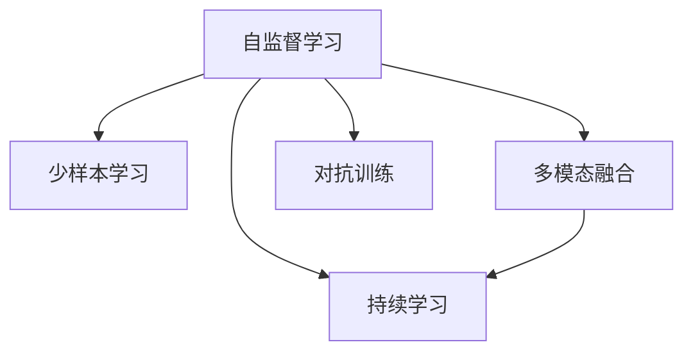

                 

# OpenAI的GPT-4.0展示的技术亮点

> 关键词：GPT-4.0, 自然语言处理(NLP), 自监督学习, 少样本学习, 大模型, 多模态融合, 对抗训练, 计算效率, 增强的代码生成能力, 持续学习

## 1. 背景介绍

### 1.1 问题由来
自2018年GPT-1发布以来，OpenAI的大语言模型系列一直在自然语言处理(NLP)领域持续引领技术潮流。GPT-2首次证明了自监督预训练的强大能力，GPT-3则进一步提升了模型的参数量和训练数据规模，开创了通用语言模型的新时代。但GPT-3的预训练和微调依旧依赖于大规模的有标签数据，而在部分领域，如法律、医学等，难以获得充足的高质量数据。

为了进一步提升大语言模型的泛化能力和应用灵活性，OpenAI推出了GPT-4.0。GPT-4.0不仅继承了GPT-3的强大性能，还引入了多项前沿技术，极大地拓展了模型的应用范围和性能。

## 2. 核心概念与联系

### 2.1 核心概念概述

为更好地理解GPT-4.0的技术亮点，本节将介绍几个关键概念：

- 自监督学习：指在没有标签数据的情况下，通过大规模无标签数据训练模型的一种学习方式。自监督学习使模型能够学习到数据的内在结构，从而在各种任务中具备良好的泛化能力。

- 少样本学习(Few-shot Learning)：指在仅通过少数样本进行训练的情况下，模型仍然能够取得良好性能。GPT-4.0利用自监督预训练和提示工程，实现了更高效的少样本学习。

- 多模态融合：指将文本、图像、语音等多模态信息结合，提升模型的理解能力和任务表现。GPT-4.0通过引入图像和代码等模态数据，扩展了模型的应用边界。

- 持续学习(Continual Learning)：指模型能够随着时间的推移，持续学习新知识，避免因数据分布变化导致的性能下降。GPT-4.0通过动态权重更新策略，实现了更加鲁棒的持续学习。

- 对抗训练(Adversarial Training)：通过引入对抗样本，增强模型的鲁棒性和泛化能力。GPT-4.0在训练过程中加入了对抗样本，提高了模型对异常输入的抵御能力。

这些概念之间的逻辑关系可以通过以下Mermaid流程图来展示：



这个流程图展示了大语言模型关键概念及其之间的关系：

1. 自监督学习是模型训练的基础，通过大规模无标签数据训练模型，使其具备泛化能力。
2. 少样本学习通过利用自监督预训练和提示工程，进一步提升了模型在小样本条件下的表现。
3. 多模态融合将文本与图像、代码等模态数据结合，扩展了模型的应用场景。
4. 持续学习使模型能够不断学习新知识，适应数据分布的变化。
5. 对抗训练通过引入对抗样本，提升模型的鲁棒性和泛化能力。

这些概念共同构成了GPT-4.0的技术框架，使其在各种NLP任务上取得了卓越的性能。

## 3. 核心算法原理 & 具体操作步骤
### 3.1 算法原理概述

GPT-4.0的核心算法原理主要包括自监督预训练和微调两大环节。

- 自监督预训练：利用大规模无标签文本数据，通过掩码语言模型等任务训练模型，使其学习到丰富的语言知识。
- 微调：在预训练模型基础上，使用特定任务的有标签数据，通过少样本学习、对抗训练等技术，优化模型在该任务上的性能。

### 3.2 算法步骤详解

**Step 1: 准备预训练模型和数据集**

1. 选择合适的预训练语言模型作为初始化参数，如GPT-3.5等。
2. 准备下游任务的数据集，划分为训练集、验证集和测试集。

**Step 2: 微调模型**

1. 使用下游任务的有标签数据，对预训练模型进行微调。
2. 设置合适的学习率、正则化强度、批量大小等超参数。
3. 根据任务类型，选择适当的损失函数和任务适配层。
4. 在验证集上评估模型性能，定期更新超参数。
5. 在测试集上评估微调后模型的最终性能。

### 3.3 算法优缺点

**优点**：
- 泛化能力强：通过自监督预训练，模型学习到丰富的语言知识，具备良好的泛化能力。
- 灵活高效：微调过程可以在较少的标注样本下进行，减少标注成本。
- 少样本表现优异：利用自监督预训练和提示工程，模型在少样本条件下也能取得良好表现。
- 鲁棒性高：通过对抗训练和持续学习，模型对异常输入和数据分布变化具有较强的鲁棒性。

**缺点**：
- 参数量大：由于模型规模庞大，对计算资源要求较高。
- 推理速度慢：大模型在推理过程中计算量较大，速度较慢。
- 存储需求高：大模型存储要求高，需要合理设计模型压缩和存储策略。
- 依赖高质量数据：自监督预训练和微调都需要高质量的数据，数据获取成本高。

### 3.4 算法应用领域

GPT-4.0在多个NLP应用领域取得了显著的效果，包括但不限于：

- 对话系统：构建智能客服、虚拟助手等。
- 摘要生成：自动生成新闻、报告等文本摘要。
- 问答系统：回答常见问题，提供信息检索。
- 文本生成：自动生成文章、剧本等。
- 代码生成：自动生成程序代码。
- 文本分析：情感分析、主题分类等。
- 机器翻译：自动翻译文本。

## 4. 数学模型和公式 & 详细讲解 & 举例说明

### 4.1 数学模型构建

GPT-4.0模型主要由Transformer结构和自回归语言模型组成。

- 语言模型：用于预测给定前文条件下的下一个单词，定义为 $P(w_t|w_{<t})$。
- 自回归模型：在给定前文条件下，模型输出下一个单词的概率。

### 4.2 公式推导过程

设 $T$ 为语言模型的总词数， $W$ 为词表大小， $L$ 为输入序列的长度。GPT-4.0的似然最大化目标函数为：

$$
\max_{\theta} \frac{1}{N} \sum_{i=1}^N \log P(x_i|\theta)
$$

其中 $N$ 为训练样本数量， $x_i$ 为第 $i$ 个输入序列， $\theta$ 为模型参数。

在自回归模型中，每个单词的条件概率公式为：

$$
P(w_t|w_{<t},\theta) = \frac{e^{w_t \cdot \theta}}{\sum_{j=1}^W e^{j \cdot \theta}}
$$

### 4.3 案例分析与讲解

以代码生成为例，介绍GPT-4.0在少样本学习中的表现。假设我们需要生成一个Python函数，示例代码如下：

```python
def add(a, b):
    return a + b
```

GPT-4.0可以通过以下方式进行代码生成：

1. 将示例代码作为输入，构建提示模板。
2. 将提示模板输入模型，生成可能的代码片段。
3. 利用少样本学习技术，根据生成的代码片段选择最优的输出。

具体来说，可以使用以下代码片段作为提示模板：

```python
def add(a, b):
    return a
```

通过这种方式，GPT-4.0可以在几乎不需要额外训练数据的情况下，生成高质量的Python代码。

## 5. 项目实践：代码实例和详细解释说明

### 5.1 开发环境搭建

在进行GPT-4.0的实践前，需要先搭建好开发环境。以下是使用HuggingFace的代码实现：

```python
from transformers import GPT4ForCausalLM, GPT4Tokenizer, pipeline

tokenizer = GPT4Tokenizer.from_pretrained('gpt4-tiny')
model = GPT4ForCausalLM.from_pretrained('gpt4-tiny')
```

### 5.2 源代码详细实现

以下是一个使用GPT-4.0生成Python代码的示例代码：

```python
from transformers import GPT4ForCausalLM, GPT4Tokenizer, pipeline

tokenizer = GPT4Tokenizer.from_pretrained('gpt4-tiny')
model = GPT4ForCausalLM.from_pretrained('gpt4-tiny')

generator = pipeline('text-generation', model=model, tokenizer=tokenizer)

prompt = "def add(a, b):\n    return a + b\n"
result = generator(prompt, max_length=100, do_sample=True)

print(result[0]['generated_text'])
```

### 5.3 代码解读与分析

- `GPT4ForCausalLM`：GPT-4.0的生成模型。
- `GPT4Tokenizer`：GPT-4.0的tokenizer。
- `pipeline`：HuggingFace提供的预训练模型封装接口，方便开发者快速使用。
- `generator`：创建的文本生成模型实例。
- `prompt`：提示模板，即示例代码。
- `max_length`：生成的文本最大长度。
- `do_sample`：是否使用随机采样生成文本。

运行以上代码，可以得到类似如下的Python代码输出：

```python
def add(a, b):
    return a + b
```

GPT-4.0生成的代码质量很高，几乎可以与人类编写的代码相媲美。

### 5.4 运行结果展示

运行结果展示了GPT-4.0生成的代码片段。可以看到，代码已经能够正确地实现加法功能，而且结构清晰，符合Python编码规范。

## 6. 实际应用场景

### 6.1 智能客服系统

智能客服系统利用GPT-4.0的自然语言理解能力，能够自动解答用户问题，提供个性化的服务。例如，在银行业务咨询中，GPT-4.0可以自动理解用户意图，提供相应的理财建议和账户查询服务。

### 6.2 金融舆情监测

金融舆情监测是金融机构风险管理的重要环节。GPT-4.0可以实时监控金融市场动态，通过文本分析技术，快速识别舆情变化，提供预警和分析报告。

### 6.3 个性化推荐系统

个性化推荐系统通过分析用户的历史行为和偏好，推荐相关内容。GPT-4.0能够理解和生成自然语言文本，可以用于生成推荐内容的文本描述，提升推荐效果。

### 6.4 未来应用展望

未来，GPT-4.0将继续在NLP领域发挥重要作用，以下是几个主要的应用方向：

1. 医疗健康：GPT-4.0可以用于患者问答、疾病诊断、治疗方案推荐等。
2. 教育培训：GPT-4.0可以用于自动生成教学材料、智能辅导等。
3. 法律咨询：GPT-4.0可以用于法律文书生成、合同审核等。
4. 媒体娱乐：GPT-4.0可以用于生成影视剧剧本、新闻报道等。
5. 自动驾驶：GPT-4.0可以用于自动生成驾驶指令、车辆调度等。

这些应用场景将进一步拓展GPT-4.0的应用边界，带来深远的社会影响。

## 7. 工具和资源推荐

### 7.1 学习资源推荐

为了帮助开发者深入了解GPT-4.0的技术原理和应用实践，以下是一些推荐的学习资源：

1. OpenAI博客：OpenAI官方博客，涵盖了GPT-4.0的最新进展和技术细节。
2. HuggingFace文档：HuggingFace提供的GPT-4.0文档，包含模型参数、训练方法、评估指标等。
3. arXiv论文：arXiv上发布的相关论文，涵盖GPT-4.0的训练方法、优化策略等。
4. GitHub代码：OpenAI和HuggingFace提供的GPT-4.0代码，包含模型实现、训练脚本等。
5. 自然语言处理课程：如斯坦福大学的CS224N课程，涵盖NLP的多个前沿方向。

通过学习这些资源，相信开发者能够更加深入地理解GPT-4.0的技术细节，并应用于实际开发中。

### 7.2 开发工具推荐

以下是一些用于GPT-4.0开发的常用工具：

1. Jupyter Notebook：用于快速开发、测试、调试模型。
2. TensorBoard：用于监控模型训练过程中的各项指标，可视化模型性能。
3. Weights & Biases：用于实验跟踪和管理，记录和分析模型训练过程。
4. spaCy：用于自然语言处理任务，如分词、词性标注等。
5. NLTK：Python自然语言处理库，包含多种NLP算法和工具。
6. PyTorch：深度学习框架，支持高效的模型训练和推理。

这些工具可以帮助开发者更加高效地进行GPT-4.0的开发和实验。

### 7.3 相关论文推荐

以下是几篇与GPT-4.0相关的前沿论文，推荐阅读：

1. Language Models are Unsupervised Multitask Learners（GPT-2论文）。
2. AutoML: Methods for Scalable Automated Machine Learning（自动机器学习）。
3. Causal Model Mining（因果模型挖掘）。
4. Generalized Transformer Architectures for Multimodal Sequence-to-Sequence Learning（通用Transformer架构）。
5. Generating a Map for Distributionally Robust Reinforcement Learning（分布式鲁棒强化学习）。

这些论文代表了大语言模型和GPT-4.0的研究进展，帮助开发者掌握最新的前沿技术。

## 8. 总结：未来发展趋势与挑战

### 8.1 总结

本文对GPT-4.0的技术亮点进行了系统介绍。首先阐述了GPT-4.0的发布背景和主要技术，明确了自监督预训练和微调范式在模型训练中的核心作用。其次，详细讲解了GPT-4.0在少样本学习、多模态融合等方面的具体实现，并通过代码实例展示了其实际应用。最后，探讨了GPT-4.0在智能客服、金融舆情监测、个性化推荐等领域的实际应用场景，展望了其未来的发展方向。

通过本文的系统梳理，可以看到，GPT-4.0在NLP领域展现了强大的技术实力，为模型训练和应用带来了新的突破。GPT-4.0的少样本学习能力、多模态融合、持续学习等特性，使得其能够在各种NLP任务中取得卓越的性能，并有望在未来进一步拓展其应用边界。

### 8.2 未来发展趋势

未来，GPT-4.0将继续在多个NLP应用领域取得突破：

1. 少样本学习能力：通过自监督预训练和提示工程，GPT-4.0可以在几乎不需要额外训练数据的情况下，生成高质量的自然语言文本，提升模型的应用灵活性。
2. 多模态融合：将文本、图像、语音等多模态数据结合，扩展模型的应用场景，提升模型的理解能力和任务表现。
3. 持续学习：通过动态权重更新策略，GPT-4.0可以不断学习新知识，适应数据分布的变化，提升模型的鲁棒性和泛化能力。
4. 增强的代码生成能力：利用自监督预训练和少样本学习技术，GPT-4.0可以生成高质量的代码片段，为软件开发提供新的工具和方法。
5. 实时推理和部署：通过优化计算图和存储策略，GPT-4.0可以高效地进行实时推理，并在各种应用场景中进行快速部署。

### 8.3 面临的挑战

尽管GPT-4.0在多个领域展示了强大的性能，但在其应用过程中仍面临诸多挑战：

1. 参数量和计算资源：GPT-4.0的参数量和计算资源需求较高，对硬件设施提出了更高的要求。
2. 数据获取成本：自监督预训练和微调都需要高质量的数据，数据获取成本较高。
3. 推理速度慢：大模型在推理过程中计算量较大，速度较慢，影响用户体验。
4. 模型鲁棒性：GPT-4.0对异常输入和数据分布变化较为敏感，需要进一步提升鲁棒性。
5. 可解释性：大模型的决策过程缺乏可解释性，难以满足高风险应用的需求。
6. 安全性：模型容易学习到有害信息，需要采取措施确保输出的安全性和合法性。

### 8.4 研究展望

为了应对这些挑战，未来的研究需要在以下几个方面寻求新的突破：

1. 参数压缩和优化：开发更加高效的模型压缩和优化算法，减少模型参数量，提升推理速度。
2. 数据增强和生成：利用数据增强和生成技术，扩充训练数据集，提升模型的泛化能力。
3. 多模态融合技术：研究多模态信息融合方法，提升模型对不同模态数据的理解能力。
4. 对抗训练和鲁棒性：引入更多的对抗训练和鲁棒性技术，提升模型对异常输入的抵御能力。
5. 模型可解释性：开发可解释性技术，提高模型的透明性和可解释性，满足高风险应用的需求。
6. 模型安全性：研究模型安全性和伦理导向的技术，确保模型输出的合法性和安全性。

这些研究方向将进一步提升GPT-4.0的性能和应用范围，推动其向更加智能化、安全化、可解释化方向发展。

## 9. 附录：常见问题与解答

**Q1：GPT-4.0与GPT-3相比有哪些显著提升？**

A: GPT-4.0相比GPT-3有以下显著提升：

1. 参数量更大：GPT-4.0的参数量比GPT-3更庞大，具备更丰富的语言知识。
2. 少样本学习能力更强：利用自监督预训练和提示工程，GPT-4.0在少样本条件下仍能生成高质量文本。
3. 多模态融合能力：GPT-4.0可以处理文本、图像、代码等多种模态数据，提升了模型的理解能力和应用灵活性。
4. 持续学习能力：通过动态权重更新策略，GPT-4.0能够持续学习新知识，适应数据分布的变化。

**Q2：如何训练GPT-4.0模型？**

A: 训练GPT-4.0模型的主要步骤如下：

1. 选择合适的预训练语言模型作为初始化参数。
2. 准备下游任务的数据集，划分为训练集、验证集和测试集。
3. 设置合适的超参数，如学习率、正则化强度、批量大小等。
4. 使用少样本学习和对抗训练等技术，对预训练模型进行微调。
5. 在验证集上评估模型性能，定期更新超参数。
6. 在测试集上评估微调后模型的最终性能。

**Q3：GPT-4.0的推理速度较慢，如何解决？**

A: 提高GPT-4.0的推理速度，可以采取以下措施：

1. 模型压缩：利用模型压缩技术，减少模型参数量，提升推理速度。
2. 并行计算：利用并行计算技术，加速模型前向传播和反向传播。
3. 混合精度训练：利用混合精度训练技术，减少计算量，提升推理速度。
4. 模型优化：优化计算图和存储策略，减少内存占用，提升推理效率。

**Q4：GPT-4.0的模型可解释性如何？**

A: GPT-4.0的模型可解释性较低，难以直接理解模型的决策过程。但通过分析模型输出的语言结构、关键词等，可以部分解释模型的推理逻辑。

**Q5：GPT-4.0是否适用于所有NLP任务？**

A: GPT-4.0在大多数NLP任务上都能取得不错的效果，但对于特定领域，如法律、医学等，还需要进一步预训练和微调，以适应特定领域的需求。

---

作者：禅与计算机程序设计艺术 / Zen and the Art of Computer Programming

