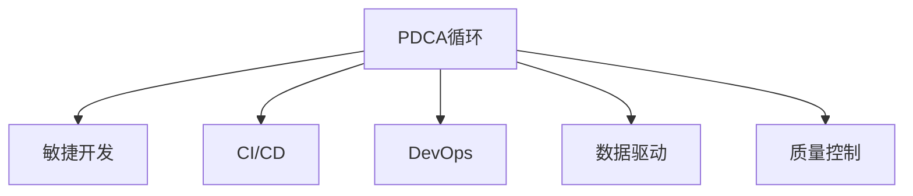

                 

# PDCA落地指南:持续改进的法宝

## 1. 背景介绍

### 1.1 问题由来
在信息技术领域，持续改进(Continuous Improvement)始终是追求卓越的核心驱动力。PDCA（Plan-Do-Check-Act）循环，作为一种结构化的持续改进框架，广泛应用于软件开发、项目管理、运营管理等领域，其以科学、系统的管理方法推动企业不断优化产品与服务，提升整体竞争力。

PDCA循环，又称为戴明环，是由著名统计学家和工程师沃尔特·阿曼德·休哈特在1930年代提出的。后来由日本的质量管理专家戴明（Edwards Deming）加以推广和实践，逐渐成为全球公认的管理原则。PDCA循环强调在持续改进中不断循环四个阶段：计划(Plan)、执行(Do)、检查(Check)和行动(Act)，通过循环迭代，实现从计划到实施再到反馈和修正的不断循环，最终实现整体提升。

然而，在信息技术项目中，特别是敏捷开发、持续集成和持续交付(CI/CD)等现代开发模式中，PDCA循环的全面落地仍面临不少挑战。如何在快速迭代和不断变化的IT项目中，有效应用PDCA循环，确保每个迭代周期都能实现高质量的改进，成为信息科技企业共同面临的重要课题。

### 1.2 问题核心关键点
实现PDCA循环落地的关键在于对PDCA循环的全面理解与灵活应用，需着重把握以下核心点：

1. **周期性**：PDCA循环需要定期进行，确保每次改进后都能进行回顾和优化，持续提升项目质量。
2. **反馈机制**：有效的反馈机制能够及时捕获项目进展中的问题和改进机会，为PDCA循环提供数据支持。
3. **质量评估**：需建立清晰的质量评估标准，用于衡量改进效果，确保每次改进都有实效。
4. **跨团队协作**：PDCA循环需要在各团队之间进行有效沟通和协作，确保改进措施在各个层级和环节得到实施。
5. **技术支撑**：现代信息技术工具和方法，如自动化测试、CI/CD、数据可视化和分析工具等，是PDCA循环落地的重要支撑。

### 1.3 问题研究意义
研究如何在信息技术项目中有效应用PDCA循环，对提升项目质量、提高团队效率和增强组织竞争力具有重要意义：

1. **提升项目质量**：通过定期回顾和改进，确保项目交付的产品和服务质量持续提升。
2. **提高团队效率**：通过优化流程和工具，提高团队的工作效率和响应速度。
3. **增强组织竞争力**：通过持续改进，提升组织在市场和技术上的竞争地位。
4. **促进敏捷发展**：通过PDCA循环的实施，推动敏捷开发和持续交付的持续优化。
5. **推动技术创新**：通过改进和优化，推动信息技术领域的创新，提升整体技术水平。

## 2. 核心概念与联系

### 2.1 核心概念概述

为更好地理解PDCA循环在信息技术项目中的应用，本节将介绍几个密切相关的核心概念：

- **PDCA循环**：由计划(Plan)、执行(Do)、检查(Check)和行动(Act)四个阶段组成，旨在通过循环迭代，实现不断优化和改进。
- **敏捷开发(Agile Development)**：一种以客户为中心、迭代交付的软件开发方法，强调团队协作、持续反馈和快速响应变化。
- **持续集成与持续交付(CI/CD)**：通过自动化工具和流程，实现代码的频繁集成、快速构建、测试和交付，提升软件交付效率和质量。
- **DevOps**：一种集成软件开发(Dev)和信息技术运维(Ops)的实践方法，强调团队协作、自动化和持续交付，提升整个IT运营效率。
- **数据驱动(Datadriven)**：通过收集、分析和利用数据，做出科学决策和持续改进，提升决策质量和效率。
- **质量控制(Quality Control)**：通过设定和评估质量标准，确保项目交付的产品或服务符合既定要求和期望。

这些核心概念之间的逻辑关系可以通过以下Mermaid流程图来展示：



这个流程图展示PDCA循环与敏捷开发、CI/CD、DevOps、数据驱动、质量控制等概念之间的紧密联系，它们共同构成了信息技术项目持续改进的基础框架。

## 3. 核心算法原理 & 具体操作步骤
### 3.1 算法原理概述

PDCA循环的核心思想是通过循环迭代的方式，对项目或任务进行持续优化和改进。在每个PDCA周期中，分别经历计划、执行、检查和行动四个阶段，最终实现整体提升。

具体来说，PDCA循环在每个周期内：
1. **计划阶段(Plan)**：定义目标和策略，设计改进方案。
2. **执行阶段(Do)**：实施改进方案，执行具体任务。
3. **检查阶段(Check)**：收集数据和反馈，评估改进效果。
4. **行动阶段(Act)**：根据检查结果，决定是否继续改进，或者进行新的改进。

PDCA循环以迭代和持续改进为核心，通过不断的PDCA循环，使得项目或任务的质量、效率和性能逐步提升。

### 3.2 算法步骤详解

下面详细介绍PDCA循环在信息技术项目中每个阶段的具体操作步骤：

**3.2.1 计划阶段(Plan)**

- **目标设定**：明确改进目标和期望效果，设定具体可衡量的指标。例如，提升代码质量、缩短交付时间、提高用户满意度等。
- **问题分析**：收集相关数据和信息，分析项目中存在的问题和改进机会。
- **方案设计**：根据问题分析结果，设计可行的改进方案，包括具体措施、责任人和时间表等。
- **资源分配**：评估资源需求，确保方案的可行性和实施条件。

**3.2.2 执行阶段(Do)**

- **任务分配**：将改进方案分配给相关团队和成员，明确具体任务和责任。
- **实施改进**：按照方案执行具体任务，确保每个任务按时完成。
- **工具支持**：利用自动化工具和技术，如CI/CD、测试工具、项目管理软件等，提高执行效率。

**3.2.3 检查阶段(Check)**

- **数据收集**：收集执行过程中的数据和反馈，包括测试结果、用户反馈、任务完成情况等。
- **结果评估**：使用既定标准和指标，对改进效果进行评估，确定是否达到了既定目标。
- **差距分析**：分析改进前后的差距，识别改进措施的成效和不足之处。

**3.2.4 行动阶段(Act)**

- **决定改进**：根据检查结果，决定是否继续改进或进行新的改进。若未达到预期效果，则需重新设计方案；若达到预期效果，则需巩固成果。
- **优化方案**：根据差距分析结果，优化和完善改进方案，确保下次改进更为高效和精确。
- **知识共享**：将改进经验和教训进行总结，形成文档或知识库，供后续改进参考。

### 3.3 算法优缺点

PDCA循环作为一种持续改进方法，具有以下优点：

1. **系统性**：通过循环迭代，确保每个改进措施都有系统性评估和反馈，避免盲目决策。
2. **灵活性**：能够根据实际情况进行调整和优化，适应项目变化和不确定性。
3. **持续改进**：通过不断循环，逐步提升项目质量和管理水平。
4. **数据驱动**：利用数据进行评估和改进，提高决策的科学性和准确性。

但同时也存在一些局限性：

1. **周期较长**：PDCA循环需要定期进行，周期较长，难以应对快速变化的项目需求。
2. **复杂性高**：需要收集和分析大量数据，工作量较大，对团队和资源要求较高。
3. **依赖管理**：需要团队良好的沟通和协作，依赖有效的项目管理。

尽管有这些局限性，PDCA循环仍然是信息技术项目管理中不可或缺的持续改进方法。

### 3.4 算法应用领域

PDCA循环在信息技术项目中广泛应用，涵盖软件开发、项目管理、运维管理等多个领域。以下是一些具体应用场景：

- **软件开发**：通过敏捷开发和CI/CD，利用PDCA循环对代码质量、交付速度、用户满意度等进行持续改进。
- **项目管理**：利用PDCA循环对项目进度、资源配置、风险管理等进行优化，提升项目管理效率和效果。
- **运维管理**：通过PDCA循环对系统性能、安全漏洞、用户反馈等进行持续监控和改进，提升运维质量。
- **数据分析**：利用PDCA循环对数据分析流程、模型效果、数据质量等进行持续优化，提高数据驱动决策的准确性。
- **业务流程**：对业务流程进行PDCA循环改进，提升业务运营效率和客户满意度。

PDCA循环的有效应用，能够在多个领域推动信息技术项目的持续优化和改进，提升整体项目质量和效率。

## 4. 数学模型和公式 & 详细讲解
### 4.1 数学模型构建

PDCA循环的实施，依赖于科学合理的数据分析和质量评估。本节将通过数学模型对PDCA循环进行详细构建。

定义改进目标为 $y$，影响因素为 $x_1, x_2, ..., x_n$。设改进方案为 $f(x_1, x_2, ..., x_n)$，具体措施为 $\{a_i\}_{i=1}^n$。

PDCA循环中的关键步骤可以表示为：

$$
y = f(x_1, x_2, ..., x_n) + \varepsilon
$$

其中 $\varepsilon$ 为随机误差项，表示其他不可控因素对改进目标的影响。

### 4.2 公式推导过程

在PDCA循环中，通过数据收集和分析，对改进效果进行评估。设改进前的数据为 $y_0$，改进后的数据为 $y_1$。设改进措施的效果为 $\Delta y = y_1 - y_0$。则改进效果的评估公式为：

$$
\Delta y = y_1 - y_0 = f(x_1, x_2, ..., x_n) - f(x_1', x_2', ..., x_n') = \sum_{i=1}^n (a_i - a_i') + \varepsilon
$$

其中 $a_i'$ 表示改进后的措施，$a_i'$ 与 $a_i$ 不同。

通过比较改进前后的数据，我们可以评估改进效果，并进行下一步的决策和行动。

### 4.3 案例分析与讲解

以下通过一个软件开发项目的例子，详细分析PDCA循环的实施过程。

**案例背景**：某软件开发公司需要提升代码质量，设定PDCA循环改进目标为“代码缺陷率下降20%”。通过问题分析，发现主要问题在于代码审查机制不完善，部分代码缺少自动化测试，导致缺陷率高。

**计划阶段**：设定改进方案，包括加强代码审查、增加自动化测试、优化代码规范等措施。分配具体任务，设定时间表和责任人。

**执行阶段**：实施改进方案，加强代码审查流程，引入自动化测试工具，优化代码规范。

**检查阶段**：收集代码缺陷率数据，评估改进效果。发现代码缺陷率下降15%，仍未达到目标。

**行动阶段**：决定进一步改进，优化自动化测试策略，加强代码规范培训，最终代码缺陷率下降20%，达到既定目标。

通过这个案例，我们可以看到PDCA循环在软件开发项目中的应用过程和效果。

## 5. 项目实践：代码实例和详细解释说明
### 5.1 开发环境搭建

在进行PDCA循环的实施和优化时，需要一个良好的开发环境。以下是Python开发环境的搭建步骤：

1. 安装Python：从官网下载安装包，按照安装向导完成Python的安装。
2. 安装虚拟环境：使用pip安装virtualenv或conda创建虚拟环境，隔离依赖包。
3. 安装相关库：安装常用的Python库，如numpy、pandas、matplotlib等，用于数据分析和可视化。
4. 配置环境：配置Python环境变量，确保能够正常运行Python脚本。

### 5.2 源代码详细实现

下面以敏捷开发项目为例，给出使用Python进行PDCA循环的数据分析和改进的代码实现。

**第一步：计划阶段**

定义改进目标和预期效果，建立数据收集和分析机制。例如，设定代码缺陷率为目标，使用GitHub issues和JIRA等工具进行问题记录和追踪。

```python
import pandas as pd
import numpy as np

# 设定目标
target_defect_rate = 20

# 收集问题数据
defect_data = pd.read_csv('defect_data.csv')

# 数据处理
defect_data['age'] = (pd.to_datetime('today') - defect_data['created_at']).dt.days
defect_data = defect_data.dropna()
```

**第二步：执行阶段**

定义具体改进措施，如加强代码审查、引入自动化测试等。

```python
# 加强代码审查
review_measures = {
    'review_rate': 1.5,  # 代码审查频率
    'reviewers': ['Alice', 'Bob']  # 参与审查的人员
}

# 引入自动化测试
test_measures = {
    'coverage': 90,  # 代码覆盖率目标
    'static_analysis': True  # 静态代码分析工具
}
```

**第三步：检查阶段**

收集数据，评估改进效果。

```python
# 收集数据
defect_count = defect_data['defect'].sum()
review_count = defect_data['review'].sum()
test_count = defect_data['test'].sum()

# 效果评估
defect_rate = defect_count / defect_data['sum']  # 缺陷率
```

**第四步：行动阶段**

根据检查结果，决定是否继续改进。

```python
if defect_rate < target_defect_rate:
    print("改进成功，达到目标")
else:
    print("改进失败，重新设计方案")
```

通过以上代码，可以简单实现PDCA循环的数据分析和改进效果评估。

### 5.3 代码解读与分析

PDCA循环的代码实现主要包括以下几个关键步骤：

**数据收集**：
- 通过Python读取CSV文件，收集问题数据和改进措施数据。
- 使用Pandas和NumPy进行数据处理和分析。

**改进措施**：
- 定义具体的改进措施，如代码审查频率、参与人员、自动化测试工具等。

**效果评估**：
- 计算改进前后的缺陷率，进行效果评估。

**行动决策**：
- 根据改进效果，决定是否进行下一步改进。

这些步骤覆盖了PDCA循环的每个阶段，为PDCA循环在信息技术项目中的应用提供了具体的实现方案。

### 5.4 运行结果展示

在实际项目中，PDCA循环的运行结果可以通过以下方式展示：

1. **改进前后对比图**：绘制改进前后的代码缺陷率对比图，直观展示改进效果。
2. **改进措施表**：列出每次改进的措施和责任人，形成改进记录表。
3. **改进趋势图**：绘制改进过程中每个阶段的效果评估图，展示改进趋势。

通过这些可视化展示，可以直观反映PDCA循环的实施效果和改进过程，为后续改进提供依据。

## 6. 实际应用场景
### 6.1 敏捷开发

PDCA循环在敏捷开发中发挥重要作用。敏捷开发强调快速迭代和持续改进，通过PDCA循环，可以不断优化开发流程，提高开发效率和代码质量。

例如，在敏捷开发中，团队通过PDCA循环不断改进代码审查流程、自动化测试策略、持续集成流程等，确保每次迭代都能提升代码质量和交付速度。

### 6.2 项目管理

在项目管理中，PDCA循环帮助团队不断优化项目进度、资源配置、风险管理等关键环节，确保项目按时交付。

例如，通过PDCA循环，项目经理可以定期评估项目进展，收集团队反馈，优化项目计划和资源分配，提升项目管理效率。

### 6.3 运维管理

运维管理中，PDCA循环主要用于系统性能优化、故障排除、安全加固等环节。

例如，通过PDCA循环，运维团队可以定期评估系统性能，优化代码和配置，加强安全防护措施，确保系统稳定运行。

### 6.4 数据分析

数据分析中，PDCA循环主要用于数据质量控制、模型效果优化、数据处理流程改进等环节。

例如，通过PDCA循环，数据分析师可以定期评估数据质量，优化数据处理流程，改进模型效果，确保数据分析结果的准确性和可靠性。

### 6.5 业务流程

业务流程中，PDCA循环主要用于业务流程优化、用户反馈处理、客户满意度提升等环节。

例如，通过PDCA循环，企业可以不断优化业务流程，收集用户反馈，提升客户满意度，增强市场竞争力。

## 7. 工具和资源推荐
### 7.1 学习资源推荐

为了帮助开发者系统掌握PDCA循环的理论基础和实践技巧，这里推荐一些优质的学习资源：

1. 《精益生产之道：PDCA循环实践指南》书籍：详细介绍了PDCA循环在制造业中的实际应用，帮助理解PDCA循环的核心思想和操作步骤。
2. 《敏捷开发：人员、流程、工具》书籍：介绍了敏捷开发的核心理念和最佳实践，与PDCA循环密切相关。
3. 《CI/CD最佳实践：持续集成与持续交付》课程：涵盖了CI/CD的各个环节，包括工具、流程、实践等，与PDCA循环结合紧密。
4. DevOps社区：DevOps社区提供了丰富的工具、实践和案例分享，帮助理解PDCA循环在IT运维中的应用。
5. GitHub issues和JIRA：项目管理工具，帮助收集和分析项目改进数据，支持PDCA循环的实施。

通过对这些资源的学习实践，相信你一定能够快速掌握PDCA循环的精髓，并用于解决实际的IT项目问题。

### 7.2 开发工具推荐

高效的开发离不开优秀的工具支持。以下是几款用于PDCA循环开发的常用工具：

1. JIRA：项目管理工具，支持问题追踪、任务分配和改进效果评估。
2. GitHub issues：问题管理工具，支持项目改进数据的收集和分析。
3. GitLab CI/CD：持续集成工具，支持自动化测试和持续交付。
4. Jenkins：开源自动化服务器，支持自定义流水线和持续交付。
5. TeamCity：商业化的持续集成工具，支持高度定制化的持续交付流程。

合理利用这些工具，可以显著提升PDCA循环的开发效率，加快改进迭代的速度。

### 7.3 相关论文推荐

PDCA循环的研究始于20世纪50年代，随着信息技术的发展，PDCA循环在IT项目中的应用日益广泛。以下是几篇奠基性的相关论文，推荐阅读：

1. 《实施PDCA循环的七步法则》：详细介绍PDCA循环的步骤和实施方法，为PDCA循环提供了系统性的指导。
2. 《敏捷开发与PDCA循环的结合》：探讨敏捷开发和PDCA循环的结合，提出敏捷开发的PDCA实施框架。
3. 《持续集成与PDCA循环：最佳实践》：详细介绍CI/CD与PDCA循环的结合，提出持续集成和持续交付的PDCA实践。
4. 《DevOps和PDCA循环：实践指南》：探讨DevOps和PDCA循环的结合，提出DevOps的PDCA实践框架。
5. 《数据分析与PDCA循环：应用案例》：详细介绍数据分析和PDCA循环的结合，提出数据分析的PDCA实践方法。

这些论文代表了大规模管理方法PDCA循环的发展脉络。通过学习这些前沿成果，可以帮助研究者把握学科前进方向，激发更多的创新灵感。

## 8. 总结：未来发展趋势与挑战
### 8.1 总结

本文对PDCA循环在信息技术项目中的应用进行了全面系统的介绍。首先阐述了PDCA循环的背景和意义，明确了PDCA循环在持续改进中的核心价值。其次，从原理到实践，详细讲解了PDCA循环的数学模型和操作步骤，给出了PDCA循环任务开发的完整代码实例。同时，本文还广泛探讨了PDCA循环在敏捷开发、项目管理、运维管理等领域的实际应用，展示了PDCA循环的广泛适用性。此外，本文精选了PDCA循环的学习资源、开发工具和相关论文，力求为读者提供全方位的技术指引。

通过本文的系统梳理，可以看到，PDCA循环在信息技术项目中具有重要的持续改进作用。它在敏捷开发、项目管理、运维管理等领域的应用，将极大提升项目质量和管理水平。未来，伴随技术工具的不断进步和创新，PDCA循环必将在更多领域得到应用，推动信息技术项目的持续优化和提升。

### 8.2 未来发展趋势

展望未来，PDCA循环将呈现以下几个发展趋势：

1. **技术融合**：PDCA循环将与其他信息技术方法，如敏捷开发、DevOps、持续集成等，进行深度融合，提升整体项目管理水平。
2. **自动化增强**：通过引入自动化工具和技术，提高PDCA循环的效率和效果，减少人工干预。
3. **数据分析驱动**：利用大数据和人工智能技术，提升PDCA循环的数据驱动能力，优化改进效果。
4. **跨团队协作**：促进跨部门、跨团队的协作，形成统一的PDCA循环框架，提升整体管理效率。
5. **用户体验优化**：通过PDCA循环，不断优化用户体验和满意度，提升客户粘性和忠诚度。
6. **技术标准化**：制定和推广PDCA循环的标准化流程和工具，形成行业最佳实践。

以上趋势凸显了PDCA循环的广泛应用前景，为信息技术项目的持续改进提供了新的方向和思路。

### 8.3 面临的挑战

尽管PDCA循环在信息技术项目中取得了显著效果，但仍面临诸多挑战：

1. **快速变化**：信息技术项目需求变化快，PDCA循环的周期较长，难以灵活应对。
2. **数据质量**：数据收集和分析的准确性和完整性直接影响改进效果，需要提高数据质量。
3. **团队协作**：PDCA循环依赖团队的紧密协作，需要克服沟通和协作障碍。
4. **资源消耗**：PDCA循环需要大量的人力和资源投入，需要平衡改进效果和成本消耗。
5. **技术门槛**：PDCA循环的实施需要一定的技术支持，需要提高团队的跨技术能力。
6. **文化适应**：PDCA循环需要企业文化和流程的配合，需要不断推广和渗透。

这些挑战需要在实践中不断克服和优化，才能真正实现PDCA循环的落地和持续改进效果。

### 8.4 研究展望

面对PDCA循环面临的挑战，未来的研究需要在以下几个方面寻求新的突破：

1. **敏捷与PDCA的结合**：研究敏捷开发和PDCA循环的结合方法，提升敏捷开发的质量和效率。
2. **自动化工具**：开发和优化自动化工具，提高PDCA循环的执行效率和效果。
3. **数据质量管理**：研究和推广数据质量管理方法，确保数据收集和分析的准确性和完整性。
4. **跨团队协作**：研究和推广跨团队协作方法，提升团队的协作效率和效果。
5. **技术支撑**：研究和推广技术工具和方法，提高PDCA循环的技术实现能力。
6. **文化建设**：研究和推广企业文化建设，形成PDCA循环的良好氛围。

这些研究方向的探索，将为PDCA循环在信息技术项目中的应用提供新的突破和创新，推动信息技术项目的持续改进和提升。

## 9. 附录：常见问题与解答

**Q1：PDCA循环是否可以应用于敏捷开发？**

A: 是的，PDCA循环可以与敏捷开发结合，通过持续改进提升敏捷开发的效率和效果。在敏捷开发中，通过PDCA循环不断优化代码审查、自动化测试、持续集成等环节，确保每次迭代都能提升质量。

**Q2：PDCA循环如何处理快速变化的项目需求？**

A: PDCA循环的周期性可能无法满足快速变化的项目需求。可以通过引入敏捷开发、持续交付等方法，将PDCA循环与快速迭代结合起来，实现快速响应变化。

**Q3：PDCA循环对数据质量有要求吗？**

A: 是的，PDCA循环依赖于准确和完整的数据，数据质量直接影响改进效果。在实施PDCA循环时，需要建立完善的数据收集和分析机制，确保数据的可靠性和有效性。

**Q4：PDCA循环需要团队协作吗？**

A: 是的，PDCA循环依赖团队的紧密协作，需要在团队内部建立有效的沟通和协作机制。可以通过项目管理工具、定期会议等手段，促进团队的协作和信息共享。

**Q5：PDCA循环需要投入大量资源吗？**

A: 是的，PDCA循环需要大量的人力和资源投入，包括数据收集、数据分析、改进措施的实施等。在实施PDCA循环时，需要合理规划资源，平衡改进效果和成本消耗。

**Q6：PDCA循环需要企业文化支持吗？**

A: 是的，PDCA循环需要企业文化和流程的配合，需要团队成员共同理解和支持PDCA循环的理念和实践。可以通过培训、宣传等方式，推动PDCA循环在企业中的落地和应用。

通过以上常见问题的解答，可以更好地理解PDCA循环在信息技术项目中的应用和实施方法。

---

作者：禅与计算机程序设计艺术 / Zen and the Art of Computer Programming

