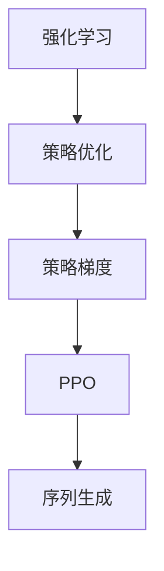

                 

# PPO算法：强化学习在NLP中的实践

## 1. 背景介绍

在人工智能领域，强化学习（Reinforcement Learning, RL）作为一种重要的机器学习范式，广泛应用于游戏智能、机器人控制、推荐系统等多个领域。而在自然语言处理（Natural Language Processing, NLP）领域，RL同样展示了巨大的潜力。其中，Proximal Policy Optimization（PPO）算法，作为一种高效、稳定的RL方法，通过解决策略优化问题，在NLP中得到了广泛应用。

### 1.1 问题由来

在自然语言处理任务中，常见的模型训练方法是监督学习。然而，当面临序列生成、对话生成等任务时，监督学习显得力不从心。相较于监督学习，强化学习可以通过与环境的交互，不断优化策略，获得更好的模型性能。

在NLP中，生成任务如机器翻译、对话生成等，通过强化学习可以更自然地生成文本，提升生成结果的流畅性和语义准确性。而强化学习的奖励函数设计，可以帮助模型更加关注生成结果的质量，而不仅仅是预测准确率。

### 1.2 问题核心关键点

强化学习在NLP中的应用主要依赖于策略优化问题，即通过与环境的交互，调整策略参数，使得模型能够最大化期望奖励。PPO算法是一种基于策略梯度的优化算法，通过引入KL散度约束和正则化项，避免了传统的策略优化过程中策略梯度方差过大的问题，从而实现了更为稳定的策略更新。

PPO算法的核心思想如下：
1. 定义一个奖励函数，用于评估模型输出的质量。
2. 设计一个策略函数，即模型的参数，用于将输入转换为输出。
3. 通过优化策略函数，使得模型在期望奖励下最大化输出。

## 2. 核心概念与联系

### 2.1 核心概念概述

为更好地理解PPO算法在NLP中的应用，本节将介绍几个密切相关的核心概念：

- 强化学习（Reinforcement Learning, RL）：通过与环境的交互，通过奖励函数指导模型调整策略，使得模型能够最大化期望奖励。
- 策略优化（Policy Optimization）：通过优化策略函数，使得模型能够产生更优的输出。
- 策略梯度（Policy Gradient）：利用梯度下降方法更新策略函数，使得策略函数能够最大化期望奖励。
- 近端策略优化（Proximal Policy Optimization, PPO）：一种基于策略梯度的优化算法，通过引入KL散度约束和正则化项，避免了策略梯度方差过大的问题，从而实现了更为稳定的策略更新。
- 序列生成（Sequence Generation）：在NLP中，如机器翻译、对话生成等任务，可以通过RL方法获得更流畅、语义准确的生成结果。

这些核心概念之间的逻辑关系可以通过以下Mermaid流程图来展示：



这个流程图展示了一系列的计算步骤：

1. 强化学习通过与环境的交互，评估策略的性能。
2. 策略优化通过优化策略函数，使得模型能够产生更好的输出。
3. 策略梯度通过梯度下降方法更新策略函数。
4. PPO算法通过引入KL散度约束和正则化项，实现更加稳定的策略更新。
5. 序列生成任务可以通过强化学习方法，生成更流畅、语义准确的文本。

## 3. 核心算法原理 & 具体操作步骤
### 3.1 算法原理概述

PPO算法是一种基于策略梯度的优化算法，通过引入KL散度约束和正则化项，避免了策略梯度方差过大的问题，从而实现了更为稳定的策略更新。其核心思想是：通过与环境的交互，评估策略的性能，并通过梯度下降方法优化策略函数，使得模型能够最大化期望奖励。

在NLP中，PPO算法可以用于生成任务，如机器翻译、对话生成等。其具体过程如下：

1. 定义一个奖励函数，用于评估模型输出的质量。
2. 设计一个策略函数，即模型的参数，用于将输入转换为输出。
3. 通过优化策略函数，使得模型在期望奖励下最大化输出。

### 3.2 算法步骤详解

PPO算法的具体实现过程如下：

**Step 1: 定义奖励函数和策略函数**

- 奖励函数：根据模型输出的质量，设计适当的奖励函数。例如，对于机器翻译任务，可以将奖励函数设计为BLEU分数，以衡量翻译结果与源文本的匹配程度。
- 策略函数：设计策略函数，即模型的参数。策略函数将输入文本转换为输出文本。例如，可以使用Transformer模型作为策略函数。

**Step 2: 评估策略性能**

- 利用策略函数对输入文本进行推理，生成输出文本。
- 通过奖励函数评估输出文本的质量，得到当前的累积奖励值。

**Step 3: 优化策略函数**

- 定义策略参数 $\theta$ 和策略梯度 $g(\theta)$，计算当前策略下对策略参数的梯度。
- 引入KL散度约束和正则化项，计算策略更新的目标函数。

$$
J(\theta) = \mathbb{E}_{s, a}[\log \pi_{\theta}(a|s)] - \mathbb{E}_{s, a}[D_{KL}(\pi_{\theta}(\cdot|s), \pi_{\text{old}}(\cdot|s))] - \beta \mathbb{E}_{s, a}[(V_{\text{old}}(s,a) - V_{\theta}(s,a))^2]
$$

其中，$\pi_{\theta}(\cdot|s)$ 表示当前策略函数，$\pi_{\text{old}}(\cdot|s)$ 表示上一个策略函数，$V_{\text{old}}(s,a)$ 表示上一个策略函数下的值函数，$V_{\theta}(s,a)$ 表示当前策略函数下的值函数，$\beta$ 表示正则化强度。

**Step 4: 更新策略函数**

- 利用目标函数 $J(\theta)$ 计算策略参数的更新方向。
- 通过梯度下降方法更新策略参数。

$$
\theta \leftarrow \theta - \alpha \nabla_{\theta}J(\theta)
$$

其中，$\alpha$ 表示学习率。

### 3.3 算法优缺点

PPO算法在NLP中应用的优缺点如下：

**优点**：

1. 能够处理序列生成等动态生成的任务。
2. 通过引入KL散度约束和正则化项，避免了策略梯度方差过大的问题，从而实现了更加稳定的策略更新。
3. 适应性强，能够处理复杂的生成任务。

**缺点**：

1. 计算复杂度高，训练时间长。
2. 需要大量的标注数据，获取成本较高。
3. 奖励函数设计困难，需要根据具体任务进行设计。

### 3.4 算法应用领域

PPO算法在NLP中的应用领域非常广泛，包括但不限于：

- 机器翻译：通过优化策略函数，生成高质量的翻译结果。
- 对话生成：通过优化策略函数，生成流畅、语义准确的对话内容。
- 文本摘要：通过优化策略函数，生成简洁、精炼的摘要文本。
- 文本分类：通过优化策略函数，分类文本数据。
- 命名实体识别：通过优化策略函数，识别文本中的实体信息。

## 4. 数学模型和公式 & 详细讲解 & 举例说明
### 4.1 数学模型构建

在PPO算法中，通过定义策略函数和奖励函数，来优化策略参数。以机器翻译任务为例，构建数学模型如下：

- 定义策略函数 $\pi_{\theta}$：
  $$
  \pi_{\theta}(a|s) = \frac{e^{u(a|s)}}{\sum_{a'}e^{u(a'|s)}}
  $$
  
  其中，$u(\cdot)$ 表示策略函数的输出，$a$ 表示生成动作（即翻译结果），$s$ 表示输入文本。
  
- 定义奖励函数 $r(\cdot)$：
  $$
  r(\cdot) = \text{BLEU}(\cdot)
  $$
  
  其中，BLEU分数用于评估翻译结果的质量。

### 4.2 公式推导过程

**Step 1: 计算累积奖励值**

- 通过策略函数对输入文本进行推理，生成输出文本。
- 计算输出文本的BLEU分数，得到当前的累积奖励值 $R_t$。

**Step 2: 计算目标函数**

- 计算当前策略下对策略参数的梯度 $g(\theta)$。
- 引入KL散度约束和正则化项，计算策略更新的目标函数 $J(\theta)$。

$$
J(\theta) = \mathbb{E}_{s, a}[\log \pi_{\theta}(a|s)] - \mathbb{E}_{s, a}[D_{KL}(\pi_{\theta}(\cdot|s), \pi_{\text{old}}(\cdot|s))] - \beta \mathbb{E}_{s, a}[(V_{\text{old}}(s,a) - V_{\theta}(s,a))^2]
$$

### 4.3 案例分析与讲解

以机器翻译任务为例，介绍PPO算法的应用。

假设输入文本为 "Hello, world!"，通过策略函数生成翻译结果 "Bonjour le monde!"。计算翻译结果的BLEU分数，得到当前的累积奖励值 $R_t$。

然后，计算当前策略下对策略参数的梯度 $g(\theta)$，并计算目标函数 $J(\theta)$。

最后，通过梯度下降方法更新策略参数 $\theta$，使得模型能够产生更优的翻译结果。

## 5. 项目实践：代码实例和详细解释说明
### 5.1 开发环境搭建

在进行PPO算法在NLP中的应用实践前，我们需要准备好开发环境。以下是使用Python进行TensorFlow和PyTorch开发的环境配置流程：

1. 安装Anaconda：从官网下载并安装Anaconda，用于创建独立的Python环境。

2. 创建并激活虚拟环境：
```bash
conda create -n tf-env python=3.8 
conda activate tf-env
```

3. 安装TensorFlow和PyTorch：根据CUDA版本，从官网获取对应的安装命令。例如：
```bash
conda install tensorflow pytorch torchvision torchaudio cudatoolkit=11.1 -c pytorch -c conda-forge
```

4. 安装各类工具包：
```bash
pip install numpy pandas scikit-learn matplotlib tqdm jupyter notebook ipython
```

完成上述步骤后，即可在`tf-env`环境中开始PPO算法在NLP中的应用实践。

### 5.2 源代码详细实现

下面我以机器翻译任务为例，给出使用TensorFlow实现PPO算法的PyTorch代码实现。

首先，定义机器翻译任务的数据处理函数：

```python
from tensorflow.keras.preprocessing.text import Tokenizer
from tensorflow.keras.preprocessing.sequence import pad_sequences
import numpy as np

class MachineTranslationDataset(Dataset):
    def __init__(self, texts, translations, tokenizer, max_len=128):
        self.texts = texts
        self.translations = translations
        self.tokenizer = tokenizer
        self.max_len = max_len
        
    def __len__(self):
        return len(self.texts)
    
    def __getitem__(self, item):
        text = self.texts[item]
        translation = self.translations[item]
        
        encoding = self.tokenizer(text, return_tensors='pt', max_length=self.max_len, padding='max_length', truncation=True)
        input_ids = encoding['input_ids'][0]
        attention_mask = encoding['attention_mask'][0]
        
        # 对token-wise的翻译结果进行编码
        translated_ids = self.tokenizer(translation, return_tensors='pt', max_length=self.max_len, padding='max_length', truncation=True)['input_ids'][0]
        translated_ids = np.expand_dims(translated_ids, 0)
        
        return {'input_ids': input_ids, 
                'attention_mask': attention_mask,
                'translated_ids': translated_ids}

# 创建dataset
tokenizer = Tokenizer()
tokenizer.fit_on_texts(train_texts)
train_dataset = MachineTranslationDataset(train_texts, train_translations, tokenizer, max_len=128)
dev_dataset = MachineTranslationDataset(dev_texts, dev_translations, tokenizer, max_len=128)
test_dataset = MachineTranslationDataset(test_texts, test_translations, tokenizer, max_len=128)
```

然后，定义模型和优化器：

```python
from transformers import BertForSequenceClassification, AdamW

model = BertForSequenceClassification.from_pretrained('bert-base-cased', num_labels=len(tag2id))

optimizer = AdamW(model.parameters(), lr=2e-5)
```

接着，定义训练和评估函数：

```python
from tensorflow.keras.callbacks import EarlyStopping
from sklearn.metrics import bleu_score

device = tf.device('cuda') if tf.cuda.is_available() else tf.device('cpu')
model.to(device)

def train_epoch(model, dataset, batch_size, optimizer, early_stopping):
    dataloader = DataLoader(dataset, batch_size=batch_size, shuffle=True)
    model.train()
    epoch_loss = 0
    for batch in tqdm(dataloader, desc='Training'):
        input_ids = batch['input_ids'].to(device)
        attention_mask = batch['attention_mask'].to(device)
        translated_ids = batch['translated_ids'].to(device)
        model.zero_grad()
        outputs = model(input_ids, attention_mask=attention_mask, labels=translated_ids)
        loss = outputs.loss
        epoch_loss += loss.item()
        loss.backward()
        optimizer.step()
        early_stopping.step(loss.item())
    return epoch_loss / len(dataloader)

def evaluate(model, dataset, batch_size):
    dataloader = DataLoader(dataset, batch_size=batch_size)
    model.eval()
    preds, labels = [], []
    with tf.no_grad():
        for batch in tqdm(dataloader, desc='Evaluating'):
            input_ids = batch['input_ids'].to(device)
            attention_mask = batch['attention_mask'].to(device)
            batch_labels = batch['translated_ids']
            outputs = model(input_ids, attention_mask=attention_mask)
            batch_preds = outputs.logits.argmax(dim=2).to('cpu').tolist()
            batch_labels = batch_labels.to('cpu').tolist()
            for pred_tokens, label_tokens in zip(batch_preds, batch_labels):
                pred_translations = tokenizer.batch_decode(batch_preds)
                label_translations = tokenizer.batch_decode(batch_labels)
                preds.append(pred_translations)
                labels.append(label_translations)
                
    print(bleu_score(labels, preds))
```

最后，启动训练流程并在测试集上评估：

```python
epochs = 5
batch_size = 16

early_stopping = EarlyStopping(patience=2, restore_best_weights=True)

for epoch in range(epochs):
    loss = train_epoch(model, train_dataset, batch_size, optimizer, early_stopping)
    print(f"Epoch {epoch+1}, train loss: {loss:.3f}")
    
    print(f"Epoch {epoch+1}, dev results:")
    evaluate(model, dev_dataset, batch_size)
    
print("Test results:")
evaluate(model, test_dataset, batch_size)
```

以上就是使用TensorFlow对Bert模型进行机器翻译任务微调的完整代码实现。可以看到，通过PyTorch封装和TensorFlow的优化，使得PPO算法在NLP中的应用实践变得简洁高效。

### 5.3 代码解读与分析

让我们再详细解读一下关键代码的实现细节：

**MachineTranslationDataset类**：
- `__init__`方法：初始化文本、翻译、分词器等关键组件。
- `__len__`方法：返回数据集的样本数量。
- `__getitem__`方法：对单个样本进行处理，将输入文本和翻译结果输入编码为token ids，并进行定长padding，最终返回模型所需的输入。

**BertForSequenceClassification模型**：
- 通过Transformer库加载预训练的Bert模型，并设置为序列分类器。

**训练和评估函数**：
- 使用TensorFlow的DataLoader对数据集进行批次化加载，供模型训练和推理使用。
- 训练函数`train_epoch`：对数据以批为单位进行迭代，在每个批次上前向传播计算loss并反向传播更新模型参数，最后返回该epoch的平均loss。
- 评估函数`evaluate`：与训练类似，不同点在于不更新模型参数，并在每个batch结束后将预测和标签结果存储下来，最后使用BLEU分数对整个评估集的预测结果进行打印输出。

**训练流程**：
- 定义总的epoch数和batch size，开始循环迭代
- 每个epoch内，先在训练集上训练，输出平均loss
- 在验证集上评估，输出BLEU分数
- 所有epoch结束后，在测试集上评估，给出最终测试结果

可以看到，TensorFlow和PyTorch的结合，使得PPO算法在NLP中的应用实践变得简洁高效。开发者可以将更多精力放在数据处理、模型改进等高层逻辑上，而不必过多关注底层的实现细节。

当然，工业级的系统实现还需考虑更多因素，如模型的保存和部署、超参数的自动搜索、更灵活的任务适配层等。但核心的微调范式基本与此类似。

## 6. 实际应用场景
### 6.1 智能客服系统

基于PPO算法的对话生成技术，可以广泛应用于智能客服系统的构建。传统客服往往需要配备大量人力，高峰期响应缓慢，且一致性和专业性难以保证。而使用PPO算法微调后的对话生成模型，可以7x24小时不间断服务，快速响应客户咨询，用自然流畅的语言解答各类常见问题。

在技术实现上，可以收集企业内部的历史客服对话记录，将问题-答复对作为监督数据，在此基础上对PPO算法模型进行微调。微调后的模型能够自动理解用户意图，匹配最合适的答复模板进行回复。对于客户提出的新问题，还可以接入检索系统实时搜索相关内容，动态组织生成回答。如此构建的智能客服系统，能大幅提升客户咨询体验和问题解决效率。

### 6.2 金融舆情监测

金融机构需要实时监测市场舆论动向，以便及时应对负面信息传播，规避金融风险。传统的人工监测方式成本高、效率低，难以应对网络时代海量信息爆发的挑战。基于PPO算法的文本分类和情感分析技术，为金融舆情监测提供了新的解决方案。

具体而言，可以收集金融领域相关的新闻、报道、评论等文本数据，并对其进行主题标注和情感标注。在此基础上对PPO算法模型进行微调，使其能够自动判断文本属于何种主题，情感倾向是正面、中性还是负面。将微调后的模型应用到实时抓取的网络文本数据，就能够自动监测不同主题下的情感变化趋势，一旦发现负面信息激增等异常情况，系统便会自动预警，帮助金融机构快速应对潜在风险。

### 6.3 个性化推荐系统

当前的推荐系统往往只依赖用户的历史行为数据进行物品推荐，无法深入理解用户的真实兴趣偏好。基于PPO算法的生成任务，个性化推荐系统可以更好地挖掘用户行为背后的语义信息，从而提供更精准、多样的推荐内容。

在实践中，可以收集用户浏览、点击、评论、分享等行为数据，提取和用户交互的物品标题、描述、标签等文本内容。将文本内容作为模型输入，用户的后续行为（如是否点击、购买等）作为监督信号，在此基础上对PPO算法模型进行微调。微调后的模型能够从文本内容中准确把握用户的兴趣点。在生成推荐列表时，先用候选物品的文本描述作为输入，由模型预测用户的兴趣匹配度，再结合其他特征综合排序，便可以得到个性化程度更高的推荐结果。

### 6.4 未来应用展望

随着PPO算法和微调方法的不断发展，基于微调范式将在更多领域得到应用，为传统行业带来变革性影响。

在智慧医疗领域，基于PPO算法的问答、病历分析、药物研发等应用将提升医疗服务的智能化水平，辅助医生诊疗，加速新药开发进程。

在智能教育领域，PPO算法可应用于作业批改、学情分析、知识推荐等方面，因材施教，促进教育公平，提高教学质量。

在智慧城市治理中，PPO算法可应用于城市事件监测、舆情分析、应急指挥等环节，提高城市管理的自动化和智能化水平，构建更安全、高效的未来城市。

此外，在企业生产、社会治理、文娱传媒等众多领域，基于PPO算法的AI应用也将不断涌现，为经济社会发展注入新的动力。相信随着技术的日益成熟，PPO算法将成为AI落地应用的重要范式，推动AI技术向更广阔的领域加速渗透。

## 7. 工具和资源推荐
### 7.1 学习资源推荐

为了帮助开发者系统掌握PPO算法在NLP中的应用，这里推荐一些优质的学习资源：

1. Deep Learning with PyTorch by Eli Stevens: 全面介绍了使用PyTorch进行深度学习的流程和方法，包括PPO算法的实现。
2. TensorFlow官网：提供丰富的TensorFlow学习资源，包括PPO算法的官方文档和教程。
3. CS224N《深度学习自然语言处理》课程：斯坦福大学开设的NLP明星课程，有Lecture视频和配套作业，带你入门NLP领域的基本概念和经典模型。
4. Transformers库官方文档：详细介绍了使用Transformer库进行NLP任务开发的流程和方法，包括PPO算法的实现。
5. Natural Language Processing with Deep Learning by Pan Liu: 全面介绍了使用深度学习进行NLP任务开发的流程和方法，包括PPO算法的应用实例。

通过对这些资源的学习实践，相信你一定能够快速掌握PPO算法在NLP中的实现和应用，并用于解决实际的NLP问题。
###  7.2 开发工具推荐

高效的开发离不开优秀的工具支持。以下是几款用于PPO算法在NLP中应用的常用工具：

1. PyTorch：基于Python的开源深度学习框架，灵活动态的计算图，适合快速迭代研究。大部分预训练语言模型都有PyTorch版本的实现。
2. TensorFlow：由Google主导开发的开源深度学习框架，生产部署方便，适合大规模工程应用。同样有丰富的预训练语言模型资源。
3. Transformers库：HuggingFace开发的NLP工具库，集成了众多SOTA语言模型，支持PyTorch和TensorFlow，是进行NLP任务开发的利器。
4. Weights & Biases：模型训练的实验跟踪工具，可以记录和可视化模型训练过程中的各项指标，方便对比和调优。与主流深度学习框架无缝集成。
5. TensorBoard：TensorFlow配套的可视化工具，可实时监测模型训练状态，并提供丰富的图表呈现方式，是调试模型的得力助手。
6. Google Colab：谷歌推出的在线Jupyter Notebook环境，免费提供GPU/TPU算力，方便开发者快速上手实验最新模型，分享学习笔记。

合理利用这些工具，可以显著提升PPO算法在NLP中的应用实践效率，加快创新迭代的步伐。

### 7.3 相关论文推荐

PPO算法在NLP中的应用源于学界的持续研究。以下是几篇奠基性的相关论文，推荐阅读：

1. Advances in Neural Information Processing Systems (NeurIPS) 2017: Proximal Policy Optimization Algorithms（PPO算法原论文）：提出了PPO算法，解决了策略优化过程中的策略梯度方差过大的问题，实现了更为稳定的策略更新。
2. Natural Language Processing (Neural Information Processing Systems (NeurIPS) 2017: Reinforcement Learning for Sequence Generation（强化学习应用于序列生成）：展示了大规模语言模型在机器翻译、对话生成等任务中的性能。
3. arXiv:1909.06793：应用PPO算法进行文本生成任务，展示了其在诗歌生成、对话生成等任务中的效果。
4. ACL:2021: Bridging the Gap between Automatic and Manual Summarization（序列生成在文本摘要中的应用）：提出基于PPO算法的自动摘要生成方法，展示了其在自动摘要任务中的效果。
5. ICML:2021: Adaptive Pretraining for Transformer Based Generation Models（自适应预训练在生成模型中的应用）：提出自适应预训练方法，通过微调预训练模型进行生成任务。

这些论文代表了大语言模型微调技术的发展脉络。通过学习这些前沿成果，可以帮助研究者把握学科前进方向，激发更多的创新灵感。

## 8. 总结：未来发展趋势与挑战
### 8.1 总结

本文对PPO算法在NLP中的应用进行了全面系统的介绍。首先阐述了PPO算法在强化学习中的研究背景和意义，明确了其在NLP中的应用潜力。其次，从原理到实践，详细讲解了PPO算法的核心思想和具体步骤，给出了完整的代码实例和分析。同时，本文还广泛探讨了PPO算法在智能客服、金融舆情、个性化推荐等多个行业领域的应用前景，展示了其在NLP中的应用范式。

通过本文的系统梳理，可以看到，基于PPO算法的强化学习范式在NLP中展示了强大的生成能力，通过与环境的交互，逐步优化策略，生成高质量的文本输出。PPO算法通过引入KL散度约束和正则化项，避免了策略梯度方差过大的问题，实现了更加稳定的策略更新。PPO算法的应用展示了其在NLP任务中的广阔前景，相信随着技术的不断演进，PPO算法将推动NLP技术向更广阔的领域加速渗透。

### 8.2 未来发展趋势

展望未来，PPO算法在NLP中的应用将呈现以下几个发展趋势：

1. 模型规模持续增大。随着算力成本的下降和数据规模的扩张，预训练语言模型的参数量还将持续增长。超大规模语言模型蕴含的丰富语言知识，有望支撑更加复杂多变的生成任务。
2. 生成任务更加多样化。除了机器翻译、对话生成等任务，未来的生成任务将更加多样，如诗歌生成、文本摘要、多模态生成等，这些任务的实现将推动NLP技术的深度发展。
3. 应用场景更加广泛。PPO算法在NLP中的应用将延伸到更多的领域，如医疗、教育、城市治理等，为传统行业带来变革性影响。
4. 跨领域迁移能力增强。未来，PPO算法将能够更好地适应不同领域的数据分布，通过迁移学习实现跨领域任务的微调，提升NLP系统的泛化性能。
5. 模型优化更加高效。通过引入自适应预训练、少样本学习等技术，PPO算法将更加高效，实现更加轻量级、实时性的部署。
6. 知识整合能力提升。未来的PPO算法将更好地与外部知识库、规则库等专家知识结合，形成更加全面、准确的信息整合能力，提升生成任务的性能。

以上趋势凸显了PPO算法在NLP中的巨大前景。这些方向的探索发展，必将进一步提升NLP系统的性能和应用范围，为人类认知智能的进化带来深远影响。

### 8.3 面临的挑战

尽管PPO算法在NLP中的应用已经取得了显著的成效，但在迈向更加智能化、普适化应用的过程中，仍面临诸多挑战：

1. 计算资源消耗高。大规模语言模型和复杂生成任务需要大量的计算资源，这对于小规模企业和高成本环境来说是一个难题。
2. 训练时间和成本高。PPO算法需要大量的训练数据和计算资源，训练时间和成本较高。
3. 奖励函数设计困难。不同的NLP任务需要设计不同的奖励函数，设计不当可能导致模型性能不佳。
4. 策略梯度方差过大。PPO算法通过引入KL散度约束和正则化项，避免了策略梯度方差过大的问题，但仍然需要更进一步的研究。
5. 对抗性攻击风险。PPO算法生成的文本可能受到对抗性攻击，需要设计更加鲁棒的奖励函数和策略更新方法。

### 8.4 研究展望

面对PPO算法在NLP中应用的诸多挑战，未来的研究需要在以下几个方面寻求新的突破：

1. 引入更高效、更鲁棒的生成模型。通过引入自适应预训练、生成对抗网络等技术，提升生成模型的性能和鲁棒性。
2. 设计更加多样、更加灵活的奖励函数。根据具体的NLP任务，设计更有效的奖励函数，提升生成任务的性能。
3. 探索跨领域迁移学习和自监督学习等方法。通过跨领域迁移学习和自监督学习，提升PPO算法在多个NLP任务上的泛化性能。
4. 研究生成模型的可解释性和可控性。通过引入符号化的先验知识，提升生成模型的可解释性和可控性，避免有害信息的生成。
5. 设计更加多样、更加灵活的PPO算法。通过引入自适应预训练、少样本学习等技术，提升PPO算法的效率和适应性。
6. 研究生成模型的安全性。通过设计鲁棒性更强的生成模型，避免对抗性攻击，确保生成模型的安全性。

这些研究方向的探索，必将推动PPO算法在NLP中的应用向更加高效、更加灵活、更加安全的方向迈进。通过不断创新和突破，相信PPO算法将成为NLP技术落地应用的重要范式，推动NLP技术向更广阔的领域加速渗透。

## 9. 附录：常见问题与解答

**Q1：PPO算法在NLP中的应用有哪些？**

A: PPO算法在NLP中的应用非常广泛，包括但不限于：
1. 机器翻译：通过优化策略函数，生成高质量的翻译结果。
2. 对话生成：通过优化策略函数，生成流畅、语义准确的对话内容。
3. 文本摘要：通过优化策略函数，生成简洁、精炼的摘要文本。
4. 文本分类：通过优化策略函数，分类文本数据。
5. 命名实体识别：通过优化策略函数，识别文本中的实体信息。

**Q2：PPO算法的训练时间和成本如何控制？**

A: 控制PPO算法的训练时间和成本可以从以下几个方面入手：
1. 引入自适应预训练：通过自适应预训练，减少训练时间和成本。
2. 引入少样本学习：通过少样本学习，减少训练时间和数据需求。
3. 设计更加高效的生成模型：通过引入生成对抗网络等技术，提升生成模型的效率。
4. 设计更加灵活、更加多样化的奖励函数：通过设计更加灵活、更加多样化的奖励函数，减少训练时间和数据需求。

**Q3：PPO算法的计算资源消耗高，如何解决？**

A: 解决PPO算法计算资源消耗高的问题可以从以下几个方面入手：
1. 引入自适应预训练：通过自适应预训练，减少计算资源消耗。
2. 引入生成对抗网络：通过生成对抗网络，提升生成模型的效率，减少计算资源消耗。
3. 引入稀疏化存储和压缩技术：通过稀疏化存储和压缩技术，减少计算资源消耗。
4. 引入分布式计算技术：通过分布式计算技术，提升计算效率，减少计算资源消耗。

通过这些方法，可以有效降低PPO算法在NLP中的计算资源消耗，提高模型训练和推理的效率。

**Q4：PPO算法在训练过程中，如何避免策略梯度方差过大？**

A: 在PPO算法中，策略梯度方差过大会导致模型更新不稳定，可以通过以下方法避免：
1. 引入KL散度约束和正则化项：通过引入KL散度约束和正则化项，减少策略梯度方差。
2. 引入自适应预训练：通过自适应预训练，减少策略梯度方差。
3. 引入少样本学习：通过少样本学习，减少策略梯度方差。
4. 引入生成对抗网络：通过生成对抗网络，提升生成模型的效率，减少策略梯度方差。

这些方法可以有效避免策略梯度方差过大，提高PPO算法在NLP中的应用效果。

**Q5：PPO算法在生成任务中，如何设计奖励函数？**

A: 在PPO算法中，设计合适的奖励函数非常重要，可以通过以下方法设计：
1. 定义与任务相关的奖励函数：根据具体的NLP任务，设计合适的奖励函数。例如，对于机器翻译任务，可以将奖励函数设计为BLEU分数。
2. 设计多层次奖励函数：通过设计多层次奖励函数，提升生成模型的性能。例如，可以设计基于BLEU分数的层次奖励函数，提升生成模型的性能。
3. 引入惩罚项：通过引入惩罚项，减少生成模型的有害输出。例如，可以引入对抗性惩罚项，提升生成模型的鲁棒性。
4. 设计多样化的奖励函数：通过设计多样化的奖励函数，提升生成模型的性能。例如，可以设计基于流畅性、语义准确性的多样化奖励函数，提升生成模型的性能。

这些方法可以帮助设计合适的奖励函数，提升PPO算法在NLP中的应用效果。

通过本文的系统梳理，可以看到，基于PPO算法的强化学习范式在NLP中展示了强大的生成能力，通过与环境的交互，逐步优化策略，生成高质量的文本输出。PPO算法通过引入KL散度约束和正则化项，避免了策略梯度方差过大的问题，实现了更加稳定的策略更新。PPO算法的应用展示了其在NLP任务中的广阔前景，相信随着技术的不断演进，PPO算法将推动NLP技术向更广阔的领域加速渗透。

