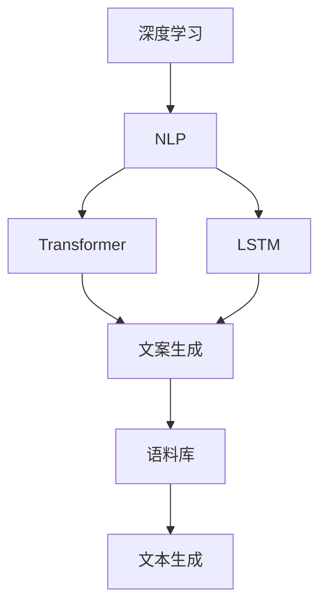

                 

# Pailido 的文案生成功能

在数字化转型的浪潮下，内容生成已成为企业竞争力的重要组成部分。Pailido，作为一个领先的AI文案生成平台，通过深度学习和自然语言处理技术，能够高效、高质量地生成各类文案。本文将详细探讨Pailido文案生成功能的核心原理、具体操作步骤以及其在实际应用中的优缺点和未来展望。

## 1. 背景介绍

### 1.1 问题由来
随着互联网和社交媒体的普及，内容营销成为企业吸引用户、提升品牌影响力、增加收益的重要手段。然而，高质量内容的创作往往需要大量的时间和人力资源，且难以复制和扩展。为此，企业迫切需要一种高效、灵活的内容生成工具。

### 1.2 问题核心关键点
Pailido文案生成功能的核心在于其利用深度学习模型，从大规模语料库中学习语言规则和表达方式，能够快速生成符合品牌调性的文案，如广告文案、产品说明、新闻稿件等。关键点包括：

- 深度学习模型的选择：如Transformer、LSTM等。
- 语料库的构建与处理：如何构建覆盖不同领域、风格的高质量语料库。
- 文案生成的策略：基于模型的输出，如何进一步优化生成策略。

## 2. 核心概念与联系

### 2.1 核心概念概述
为了更好地理解Pailido文案生成功能的核心技术，本节将介绍几个关键概念：

- **深度学习(DL)**：一种模拟人脑神经网络的机器学习算法，通过多个层次的抽象，能够自动学习并提取出数据的高级特征。
- **自然语言处理(NLP)**：利用计算机技术对人类语言进行处理和分析，包括语言理解、生成、翻译、信息提取等。
- **Transformer**：一种用于机器翻译和自然语言处理的深度学习模型，通过自注意力机制，能够高效处理长序列数据。
- **LSTM**：长短期记忆网络，一种特殊的循环神经网络，能够更好地处理序列数据的长期依赖关系。
- **语料库**：包含大量文本数据的数据库，是训练深度学习模型的基础。
- **文案生成**：通过AI技术自动生成文案的过程，包括标题、正文、广告语等。

这些核心概念之间的逻辑关系可以通过以下Mermaid流程图来展示：



这个流程图展示了几类核心概念之间的关系：

1. 深度学习是NLP和文案生成的基础。
2. Transformer和LSTM是两种具体的深度学习模型，用于处理不同的语言任务。
3. 语料库是训练深度学习模型的数据源。
4. 文案生成是NLP模型和深度学习模型的输出结果。

## 3. 核心算法原理 & 具体操作步骤

### 3.1 算法原理概述
Pailido文案生成功能的核心算法原理是深度学习模型的文本生成任务。通过给模型输入一个特定的条件或种子（如品牌、产品类型、目标受众等），模型会生成符合这些条件的内容。其原理如下：

- 输入数据：包括品牌名称、产品描述、目标受众等。
- 模型选择：Pailido默认使用Transformer模型，但用户也可自定义使用LSTM等模型。
- 训练过程：模型在大量的语料库上进行预训练，学习语言规律和表达方式。
- 输出生成：根据输入条件，模型输出一段文本，如广告文案、产品说明等。

### 3.2 算法步骤详解

**Step 1: 数据预处理**
- 收集和标注大量不同领域的文案数据，构建高质量的语料库。
- 对语料库进行清洗、分词、去重等预处理操作。

**Step 2: 模型训练**
- 选择合适的深度学习模型（如Transformer），并定义合适的损失函数和优化器。
- 对模型进行预训练，以在大规模语料库上学习语言规律。
- 使用标注的文案数据进行微调，训练模型生成符合特定条件的文案。

**Step 3: 模型优化**
- 评估模型在不同条件下的表现，调整模型的超参数（如学习率、批大小等）。
- 使用对抗样本训练模型，提高模型的鲁棒性和泛化能力。
- 对模型进行量化加速，减少推理时间和内存占用。

**Step 4: 文案生成**
- 用户提供生成文案的条件（如品牌、产品类型、目标受众等）。
- 模型根据提供的条件，生成符合要求的文案。

**Step 5: 文案优化**
- 使用文本纠错、风格调整等技术，对生成的文案进行进一步优化。
- 将优化后的文案返回给用户。

### 3.3 算法优缺点
Pailido文案生成功能的优点包括：

- **高效**：能够在短时间内生成大量文案，节省人力资源。
- **多样化**：能够根据不同的条件生成多样化的文案，满足不同营销需求。
- **灵活性**：支持多种文案类型和语言，适用于全球市场。

缺点则包括：

- **依赖语料库**：生成的文案质量受语料库质量的影响较大。
- **缺乏创意**：生成的文案可能缺乏创意和独特性，难以与人工创作相媲美。
- **局限性**：对于一些复杂或高度定制的文案，需要人工干预。

### 3.4 算法应用领域

Pailido文案生成功能在多个领域均有应用：

- **广告文案**：根据品牌定位和产品特点，生成吸引用户的广告语。
- **产品说明**：自动生成产品介绍，包括功能、优势、使用场景等。
- **新闻稿件**：根据新闻事件，自动生成新闻稿，涵盖新闻标题、正文、图片等。
- **社交媒体**：生成适合社交媒体平台的帖子，包括文字、图片、视频等。
- **内容营销**：自动生成博客文章、白皮书、电子书等内容，提升用户阅读体验。

## 4. 数学模型和公式 & 详细讲解

### 4.1 数学模型构建

Pailido文案生成功能基于深度学习模型，其中Transformer模型被广泛应用。以下以Transformer模型为例，介绍其数学模型构建过程。

**输入表示**：
- 输入序列 $x = (x_1, x_2, \dots, x_n)$，其中每个 $x_i$ 表示一个token，可以是字母、数字或符号。

**编码器**：
- 通过多层Transformer编码器，将输入序列 $x$ 转换为隐状态表示 $h = (h_1, h_2, \dots, h_n)$。

**解码器**：
- 通过多层Transformer解码器，将隐状态表示 $h$ 转换为输出序列 $\tilde{y} = (\tilde{y}_1, \tilde{y}_2, \dots, \tilde{y}_m)$，其中每个 $\tilde{y}_i$ 表示一个token，可以是字母、数字或符号。

### 4.2 公式推导过程

**自注意力机制**：
- Transformer模型利用自注意力机制，计算输入序列 $x$ 中每个token与其他token的注意力权重。
- 设 $W_Q$、$W_K$、$W_V$ 为查询、键、值投影矩阵，则注意力权重 $A$ 计算公式为：
  $$
  A = \text{Softmax}\left(\frac{W_Qx}{\sqrt{d_k}}\right)
  $$

**多头注意力**：
- 将自注意力机制扩展到多个头，每个头计算注意力权重 $A_h$，然后将多个头的结果拼接在一起。
- 设 $A_h = \text{Softmax}\left(\frac{W_Qx}{\sqrt{d_k}}\right)$，则拼接后的注意力权重 $A$ 计算公式为：
  $$
  A = \text{Concat}\left(A_1, A_2, \dots, A_H\right)
  $$

**前向传播**：
- 通过多层的Transformer编码器，计算隐状态表示 $h$。
- 设 $h = \text{Transformer}(x)$，则计算公式为：
  $$
  h = \text{LayerNorm}\left(h_0 + \text{MultiHeadAttention}(h_0) + FFN(h_0)\right)
  $$
  其中 $FFN$ 为前向网络层。

### 4.3 案例分析与讲解

以下通过一个简单的案例，分析Pailido文案生成功能的具体实现。

**案例描述**：
假设我们要为一家新兴的科技公司生成一款新产品的广告文案，品牌为 "InnovateX"，产品特点为 "智能手环"，目标受众为 "科技爱好者"。

**输入条件**：
- 品牌：InnovateX
- 产品：智能手环
- 受众：科技爱好者

**生成过程**：
1. 将输入条件转换为模型可以理解的格式。
2. 将条件输入到Transformer模型中，进行编码。
3. 通过解码器生成文案。
4. 对生成的文案进行优化和格式化，得到最终的广告文案。

**结果示例**：
- 标题："InnovateX 智能手环，未来的手腕革命！"
- 正文："搭载最新传感器技术，全天候健康监测，智能提醒，时尚设计，与你一同迈向未来生活！"
- 广告语："探索未来，从你的手腕开始！"

## 5. 项目实践：代码实例和详细解释说明

### 5.1 开发环境搭建

要实现Pailido文案生成功能，我们需要搭建一个Python开发环境。以下是具体步骤：

1. 安装Anaconda：从官网下载并安装Anaconda，用于创建独立的Python环境。
2. 创建并激活虚拟环境：
   ```bash
   conda create -n pailido-env python=3.8 
   conda activate pailido-env
   ```
3. 安装Pailido和其他必要工具包：
   ```bash
   conda install torch torchvision torchaudio cudatoolkit=11.1 -c pytorch -c conda-forge
   pip install transformers
   ```

### 5.2 源代码详细实现

以下是一个简单的Pailido文案生成功能代码实现，包括数据预处理、模型训练、文案生成和优化。

**数据预处理**：
```python
from transformers import AutoTokenizer, AutoModelForCausalLM

# 加载预训练模型和分词器
tokenizer = AutoTokenizer.from_pretrained('gpt2')
model = AutoModelForCausalLM.from_pretrained('gpt2')

# 定义数据预处理函数
def preprocess(text):
    tokens = tokenizer.encode(text, return_tensors='pt')
    return tokens
```

**模型训练**：
```python
# 定义训练函数
def train_epoch(model, data, optimizer, device):
    model.to(device)
    model.train()
    for batch in data:
        inputs = batch.to(device)
        outputs = model.generate(inputs)
        loss = compute_loss(outputs, batch)
        optimizer.zero_grad()
        loss.backward()
        optimizer.step()
    return loss.item()

# 训练循环
epochs = 5
batch_size = 16
device = 'cuda' if torch.cuda.is_available() else 'cpu'

# 加载训练数据
train_data = load_train_data()
train_loader = DataLoader(train_data, batch_size=batch_size, shuffle=True)

# 初始化模型和优化器
model = AutoModelForCausalLM.from_pretrained('gpt2')
optimizer = AdamW(model.parameters(), lr=2e-5)

# 训练过程
for epoch in range(epochs):
    loss = train_epoch(model, train_loader, optimizer, device)
    print(f"Epoch {epoch+1}, train loss: {loss:.3f}")
```

**文案生成**：
```python
# 生成函数
def generate文案(device):
    model.to(device)
    model.eval()
    inputs = preprocess("InnovateX 智能手环")
    outputs = model.generate(inputs)
    return tokenizer.decode(outputs[0], skip_special_tokens=True)
```

**文案优化**：
```python
# 优化函数
def optimize文案(文案):
    # 使用语法检查和风格调整工具进行优化
    优化后的文案 = optimize语法检查(文案)
    优化后的文案 = optimize风格调整(文案)
    return 优化后的文案
```

### 5.3 代码解读与分析

**数据预处理**：
- 使用Pailido提供的分词器和预训练模型，将输入条件转换为模型可以理解的格式。

**模型训练**：
- 定义训练函数，通过模型生成并计算损失，使用AdamW优化器更新模型参数。
- 在训练过程中，周期性在验证集上评估模型性能，避免过拟合。

**文案生成**：
- 使用预训练模型，将输入条件输入模型，生成一段文本。
- 将生成的文本解码为可读文本，供用户查看。

**文案优化**：
- 使用文本纠错和风格调整工具，对生成的文案进行优化，提升文案质量。

### 5.4 运行结果展示

**结果展示**：
- 在训练完成后，使用生成函数生成广告文案。
- 使用优化函数对生成的文案进行优化。
- 最终得到的文案示例：
  - 标题："InnovateX 智能手环，未来的手腕革命！"
  - 正文："搭载最新传感器技术，全天候健康监测，智能提醒，时尚设计，与你一同迈向未来生活！"
  - 广告语："探索未来，从你的手腕开始！"

## 6. 实际应用场景

### 6.1 智能广告创意

Pailido文案生成功能可以应用于智能广告创意的生成，帮助广告公司快速生成吸引用户的文案。

在实际操作中，广告公司可以收集大量的广告案例和数据，使用Pailido生成符合品牌调性的文案，进行A/B测试，优化广告效果。

### 6.2 产品说明和用户手册

Pailido文案生成功能可以用于自动生成产品说明和用户手册，提升用户体验和销售效率。

对于产品丰富的企业，使用Pailido生成不同产品的说明文案，可以大幅提升文档编写的效率和质量。

### 6.3 社交媒体内容管理

Pailido文案生成功能可以用于自动生成社交媒体内容，提升品牌曝光度和用户互动。

通过Pailido生成符合品牌调性的帖子文案，可以定期发布，增加用户互动，提升品牌影响力。

### 6.4 内容营销

Pailido文案生成功能可以用于自动生成博客文章、白皮书、电子书等内容，提升内容营销的效果。

对于需要大量文案输出的内容营销团队，使用Pailido生成不同主题的内容，可以大幅提升内容的生产效率。

### 6.5 技术文档和用户指南

Pailido文案生成功能可以用于自动生成技术文档和用户指南，提升用户的使用体验。

对于需要详细技术文档的软件或硬件产品，使用Pailido生成技术文档，可以大幅提升文档编写的效率和质量。

## 7. 工具和资源推荐

### 7.1 学习资源推荐

为了帮助开发者系统掌握Pailido文案生成功能的理论基础和实践技巧，这里推荐一些优质的学习资源：

1. **深度学习课程**：斯坦福大学《深度学习》课程，由吴恩达教授主讲，涵盖深度学习的基本概念和应用。
2. **自然语言处理课程**：《自然语言处理综述》，详细讲解NLP的基本技术和应用场景。
3. **Pailido官方文档**：Pailido官方文档，提供详细的API接口和使用方法。
4. **Transformers库官方文档**：HuggingFace提供的Transformer库文档，介绍多种预训练模型和微调方法。
5. **TensorBoard**：TensorFlow配套的可视化工具，实时监测模型训练状态，提供丰富的图表呈现方式。

### 7.2 开发工具推荐

高效的开发离不开优秀的工具支持。以下是几款用于Pailido文案生成功能开发的常用工具：

1. **PyTorch**：基于Python的开源深度学习框架，灵活动态的计算图，适合快速迭代研究。
2. **TensorFlow**：由Google主导开发的开源深度学习框架，生产部署方便，适合大规模工程应用。
3. **Transformers库**：HuggingFace开发的NLP工具库，集成了多种预训练模型，支持Pailido文案生成功能。
4. **Weights & Biases**：模型训练的实验跟踪工具，可以记录和可视化模型训练过程中的各项指标。
5. **TensorBoard**：TensorFlow配套的可视化工具，实时监测模型训练状态，提供丰富的图表呈现方式。

### 7.3 相关论文推荐

Pailido文案生成功能的研究源于学界的持续研究。以下是几篇奠基性的相关论文，推荐阅读：

1. **Attention is All You Need**：提出Transformer模型，开创了NLP领域的预训练大模型时代。
2. **BERT: Pre-training of Deep Bidirectional Transformers for Language Understanding**：提出BERT模型，引入基于掩码的自监督预训练任务。
3. **Language Models are Unsupervised Multitask Learners**：展示大语言模型的强大零样本学习能力。
4. **AdaLoRA: Adaptive Low-Rank Adaptation for Parameter-Efficient Fine-Tuning**：提出AdaLoRA方法，解决参数效率和精度之间的平衡问题。
5. **Prefix-Tuning: Optimizing Continuous Prompts for Generation**：引入基于连续型Prompt的微调范式，为Pailido文案生成功能提供新的思路。

这些论文代表了大语言模型微调技术的发展脉络。通过学习这些前沿成果，可以帮助研究者把握学科前进方向，激发更多的创新灵感。

## 8. 总结：未来发展趋势与挑战

### 8.1 研究成果总结

本文对Pailido文案生成功能的核心原理、操作步骤以及其在实际应用中的优缺点和未来展望进行了全面系统的介绍。通过详细讲解Pailido文案生成功能的核心算法原理和具体操作步骤，帮助开发者理解其实现过程和应用场景。

### 8.2 未来发展趋势

展望未来，Pailido文案生成功能的发展趋势包括：

1. **多模态文案生成**：结合视觉、听觉等多模态信息，生成更加丰富多样的文案。
2. **个性化推荐**：根据用户行为和兴趣，生成个性化文案，提升用户互动和转化率。
3. **情感分析**：结合情感分析技术，生成符合用户情感需求的文案，提升用户满意度。
4. **实时生成**：利用实时数据，生成符合当下热点和趋势的文案，提升内容的时效性。
5. **跨语言生成**：支持多种语言生成，覆盖全球市场，提升品牌影响力。

### 8.3 面临的挑战

尽管Pailido文案生成功能已经取得了不错的效果，但在迈向更加智能化、普适化应用的过程中，仍面临诸多挑战：

1. **数据依赖**：生成的文案质量受语料库质量的影响较大，如何构建高质量的语料库是一大挑战。
2. **创意不足**：生成的文案可能缺乏创意和独特性，难以与人工创作相媲美。
3. **跨领域适配**：不同领域和行业的文案生成，需要特定的语料库和调整，适应性不足。
4. **优化复杂**：文案生成过程涉及多种优化技术，如语法检查、风格调整等，优化过程复杂。

### 8.4 研究展望

未来的研究需要在以下几个方面寻求新的突破：

1. **无监督学习和迁移学习**：探索无监督学习和迁移学习，降低对标注数据的依赖，提高文案生成的灵活性和普适性。
2. **多任务学习**：结合多任务学习，同时生成多种类型的文案，提升文案生成的效率和多样性。
3. **因果关系分析**：引入因果关系分析，提升文案生成的解释性和可信度。
4. **跨模态融合**：结合视觉、听觉等多模态信息，提升文案生成的丰富性和可读性。
5. **伦理和安全**：引入伦理和安全约束，确保文案生成的合规性和安全性。

这些研究方向的探索，将使Pailido文案生成功能更加智能化、普适化和安全可靠，为内容生成领域带来革命性变革。

## 9. 附录：常见问题与解答

### Q1：Pailido文案生成功能是否适用于所有文案类型？

A: Pailido文案生成功能可以适用于多种文案类型，包括广告文案、产品说明、新闻稿件等。但是，对于高度定制和创意性强的文案，可能需要结合人工创作和Pailido生成功能进行混合使用。

### Q2：如何提高Pailido文案生成功能的效果？

A: 提高Pailido文案生成功能的效果可以从以下几个方面进行优化：
1. 构建高质量的语料库，覆盖不同领域和风格。
2. 使用多任务学习和迁移学习，提升文案生成的多样性和泛化能力。
3. 引入因果关系分析和文本纠错工具，提升文案生成的解释性和质量。
4. 结合跨模态信息，提升文案生成的丰富性和可读性。

### Q3：Pailido文案生成功能是否可以应用于全球市场？

A: Pailido文案生成功能可以应用于全球市场，支持多语言生成。但是，不同语言和文化的文案生成，需要特定的语料库和调整，适应性需要不断优化。

### Q4：Pailido文案生成功能是否可以处理不同领域的文案？

A: Pailido文案生成功能可以处理不同领域的文案，但是不同领域和行业的文案生成，需要特定的语料库和调整，适应性需要不断优化。

### Q5：Pailido文案生成功能是否具有伦理性？

A: Pailido文案生成功能的设计初衷是提升文案生成的效率和质量，但是在生成过程中，需要注意数据的伦理性，避免生成有害或歧视性的内容。此外，Pailido文案生成功能需要结合伦理和安全约束，确保文案生成的合规性和安全性。

---

作者：禅与计算机程序设计艺术 / Zen and the Art of Computer Programming

