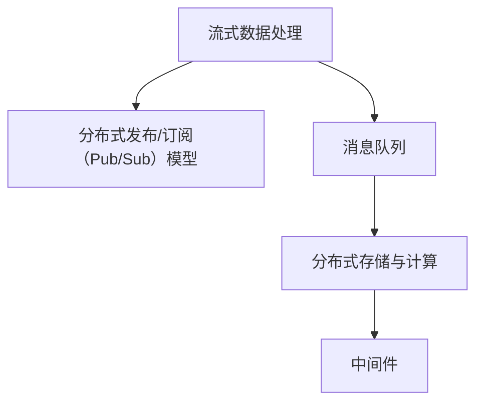

                 

# Pulsar原理与代码实例讲解

> 关键词：Pulsar, 流式数据处理, 大数据, Apache Pulsar, 实时数据流, 分布式系统, 微服务, 中间件

## 1. 背景介绍

### 1.1 问题由来

随着互联网的迅速发展和数据的爆炸性增长，企业对实时数据处理的需求日益增加。传统的数据处理方式，如批处理、离线分析等，已无法满足实时性要求，尤其是在高并发的场景下。为此，企业急需一种高效、可靠、可扩展的实时数据处理解决方案。

Pulsar是一种开源的分布式流式数据处理平台，由Yahoo开源。它采用分布式发布/订阅（Pub/Sub）消息队列模型，支持高吞吐量、低延迟、高可用的流式数据处理。通过Pulsar，企业可以构建一个强大的数据流处理基础设施，实现实时数据的采集、存储、处理和分析。

### 1.2 问题核心关键点

Pulsar的核心关键点主要包括：

- **分布式发布/订阅（Pub/Sub）模型**：支持高效的流数据发布和订阅，实现实时数据的分发和聚合。
- **高吞吐量与低延迟**：通过水平扩展和高性能存储，支持数万并发连接和每秒数百MB的数据吞吐量，同时保证低延迟处理。
- **多租户支持**：通过命名空间（Namespace）实现多租户隔离，每个租户可以独立管理自己的数据流。
- **消息持久化与可靠性**：支持消息的持久化存储和可靠性传输，保证数据不丢失。
- **开源与社区支持**：Pulsar是一个开源项目，由Apache软件基金会的顶级项目，得到了广泛的社区支持和生态系统的完善。

这些关键特性使得Pulsar成为构建实时数据处理系统的理想选择，帮助企业实现数据的实时采集、存储、处理和分析，推动业务创新和决策优化。

## 2. 核心概念与联系

### 2.1 核心概念概述

为了更好地理解Pulsar的核心概念，本节将介绍几个密切相关的核心概念：

- **流式数据处理**：指对实时产生的数据进行实时处理和分析，以便及时获取有用信息并做出响应。流式数据处理系统要求高吞吐量、低延迟和可靠的消息传输。
- **分布式发布/订阅（Pub/Sub）模型**：指消息生产者发布消息到队列，消息消费者订阅并消费消息的模型。这种模型支持高效的消息分发和聚合，适合实时数据流的处理。
- **消息队列**：指用于存储和传输消息的数据结构，支持消息的排队、持久化和可靠性传输。
- **分布式存储与计算**：指将数据和计算任务分布到多个节点上，实现高可扩展性和高可用性。
- **中间件**：指位于应用程序和基础设施之间的软件，用于实现分布式数据传输和处理。

这些核心概念之间的逻辑关系可以通过以下Mermaid流程图来展示：



这个流程图展示了几大核心概念之间的联系：

1. 流式数据处理依赖于分布式发布/订阅模型，以实现高效的消息分发和聚合。
2. 消息队列作为数据传输的桥梁，支持消息的持久化存储和可靠性传输。
3. 分布式存储与计算提供分布式数据处理能力，支持高可扩展性和高可用性。
4. 中间件作为应用与基础设施之间的桥梁，实现数据的分布式传输和处理。

## 3. 核心算法原理 & 具体操作步骤

### 3.1 算法原理概述

Pulsar的算法原理主要基于分布式发布/订阅模型和流式数据处理的技术。其核心思想是：通过分布式发布/订阅模型，将消息生产者发布的消息分发到多个订阅者，实现高效的消息分发和聚合。同时，利用分布式存储与计算技术，支持高吞吐量、低延迟的数据处理，实现实时数据的采集、存储、处理和分析。

Pulsar的算法流程主要包括以下几个步骤：

1. **消息生产**：消息生产者通过Pulsar的Producer API，将实时数据发布到Pulsar集群。
2. **消息传输**：消息在Pulsar集群中通过分布式存储与计算技术进行传输和处理。
3. **消息消费**：消息消费者通过Pulsar的Consumer API，订阅并消费消息，实现实时数据的处理和分析。
4. **数据存储**：Pulsar支持消息的持久化存储，将消息存储到分布式文件系统或对象存储中。

### 3.2 算法步骤详解

Pulsar的算法步骤主要包括：

**Step 1: 搭建Pulsar集群**
- 安装Pulsar的分布式存储系统，如Hadoop、Ceph等。
- 部署Pulsar集群，包括Broker、Zookeeper、Schema Registry等组件。
- 配置Pulsar的运行参数，如消息存储路径、缓存大小等。

**Step 2: 创建命名空间**
- 在Pulsar集群中创建命名空间，用于隔离和管理不同的数据流。
- 配置命名空间的相关参数，如消息存储策略、权限设置等。

**Step 3: 发布消息**
- 通过Pulsar的Producer API，将实时数据发布到Pulsar集群。
- 设置消息的存储路径、消息的分区、消息的生命周期等参数。

**Step 4: 订阅消息**
- 通过Pulsar的Consumer API，订阅并消费消息。
- 设置订阅器的相关参数，如订阅主题、消息分区、订阅器ID等。

**Step 5: 数据处理**
- 在订阅者端，对订阅的消息进行实时处理和分析。
- 支持多种数据处理技术，如MapReduce、Spark等。

**Step 6: 数据存储**
- 将处理后的数据存储到分布式文件系统或对象存储中。
- 支持数据的持久化和可靠性存储。

### 3.3 算法优缺点

Pulsar的算法具有以下优点：

1. **高效的消息分发和聚合**：通过分布式发布/订阅模型，支持高吞吐量、低延迟的消息传输和分发，适用于实时数据流的处理。
2. **高可扩展性和高可用性**：通过分布式存储与计算技术，支持水平扩展和高可用性，适应大规模数据处理需求。
3. **灵活的数据处理方式**：支持多种数据处理技术，如MapReduce、Spark等，满足不同应用场景的需求。
4. **多租户支持**：通过命名空间实现多租户隔离，每个租户可以独立管理自己的数据流，保障数据安全。

同时，Pulsar的算法也存在以下缺点：

1. **配置复杂**：搭建和配置Pulsar集群需要一定的技术背景，对运维人员要求较高。
2. **学习曲线陡峭**：Pulsar的API和概念较多，初学者可能需要一定时间进行学习和适应。
3. **性能优化难度大**：Pulsar的性能优化需要综合考虑集群配置、数据分区、消息队列等因素，难度较大。

### 3.4 算法应用领域

Pulsar的算法主要应用于以下几个领域：

- **实时数据流处理**：支持实时数据流的采集、存储、处理和分析，适用于电商、金融、物联网等实时业务场景。
- **大数据处理**：支持大规模数据的分布式存储和处理，适用于数据分析、数据挖掘等大数据场景。
- **中间件**：作为分布式数据传输和处理的基础设施，支持各种应用和服务的集成和互联。

此外，Pulsar还被广泛应用于数据采集、日志分析、流媒体处理等领域，成为构建实时数据处理系统的核心工具。

## 4. 数学模型和公式 & 详细讲解 & 举例说明

### 4.1 数学模型构建

本节将使用数学语言对Pulsar的核心算法进行更加严格的刻画。

记Pulsar集群中的消息队列为 $Q=\{m_1, m_2, \ldots, m_n\}$，其中 $m_i$ 表示消息。假设生产者生产的消息数量为 $N$，每个消息的大小为 $s$，消息的到达率为 $\lambda$，消息的处理速率为 $\mu$。则Pulsar的消息队列模型可以表示为：

$$
Q = \{m_1, m_2, \ldots, m_n\}
$$

消息的到达和处理遵循Poisson过程，即每个消息的到达时间间隔和处理时间间隔独立且同分布，期望到达率为 $\lambda$，期望处理速率为 $\mu$。消息队列的长度为 $L$，服从几何分布：

$$
L \sim G\left(\frac{\lambda}{\mu}\right)
$$

其中 $G\left(\frac{\lambda}{\mu}\right)$ 表示几何分布，参数为 $\frac{\lambda}{\mu}$。

### 4.2 公式推导过程

以下我们以Pulsar的消息队列模型为例，推导消息队列的长度公式。

假设消息到达时间间隔服从指数分布 $E(\lambda)$，处理时间间隔也服从指数分布 $E(\mu)$。则消息队列长度 $L$ 的期望值可以表示为：

$$
E[L] = \frac{1}{\mu}\left(1 - \frac{1}{1 + \frac{\lambda}{\mu}}\right)
$$

证明如下：

设 $X_i$ 表示消息到达时间间隔，$Y_i$ 表示消息处理时间间隔，则 $X_i$ 和 $Y_i$ 均服从指数分布，期望分别为 $\frac{1}{\lambda}$ 和 $\frac{1}{\mu}$。令 $W_i = X_i + Y_i$，表示一个消息从到达到处理完成的时间。则 $W_i$ 的期望值为：

$$
E[W_i] = \frac{1}{\lambda} + \frac{1}{\mu}
$$

由于消息到达和处理的独立性，可以认为消息的到达和处理相互独立。设 $W$ 表示消息队列中所有消息的处理时间总和，则：

$$
W = \sum_{i=1}^{N} W_i
$$

由于 $W_i$ 独立同分布，根据中心极限定理，$W$ 近似服从指数分布 $E\left(\frac{N}{\mu}\right)$。因此，消息队列长度 $L$ 的期望值可以表示为：

$$
E[L] = E\left[\frac{W}{s}\right] = \frac{1}{\mu}\left(1 - \frac{1}{1 + \frac{\lambda}{\mu}}\right)
$$

该公式展示了Pulsar消息队列的长度与到达率、处理率之间的关系。

### 4.3 案例分析与讲解

假设一个Pulsar集群，每秒处理1000个消息，消息大小为1KB，到达率 $\lambda=100$，处理率 $\mu=1$。则消息队列的长度期望为：

$$
E[L] = \frac{1}{1}\left(1 - \frac{1}{1 + \frac{100}{1}}\right) = \frac{1}{101}
$$

由于消息队列的长度服从几何分布，因此消息队列长度的方差为：

$$
\text{Var}(L) = E[L]^2 = \left(\frac{1}{101}\right)^2
$$

这意味着在Pulsar集群中，消息队列的长度期望为0.01，方差为0.0001。由于方差很小，说明消息队列长度相对稳定，系统能够稳定处理消息。

## 5. 项目实践：代码实例和详细解释说明

### 5.1 开发环境搭建

在进行Pulsar的实践前，我们需要准备好开发环境。以下是使用Python进行Pulsar开发的环境配置流程：

1. 安装Pulsar的Python客户端库：
```bash
pip install pulsar-client
```

2. 安装分布式存储系统：
```bash
apt-get install hadoop-client
```

3. 安装Pulsar集群中的其他组件：
```bash
apt-get install pulsar
```

完成上述步骤后，即可在Pulsar环境中开始开发实践。

### 5.2 源代码详细实现

下面以Pulsar的Producer和Consumer为例，给出使用Python对Pulsar进行开发和测试的代码实现。

首先，安装Pulsar的Python客户端库：

```bash
pip install pulsar-client
```

然后，编写Producer和Consumer的代码：

```python
from pulsar import PulsarClient

# 创建Pulsar客户端
client = PulsarClient('pulsar://localhost:6650')

# 创建生产者
producer = client.create_producer('my-topic', 'my-ns')

# 创建消费者
consumer = client.subscribe('my-topic', 'my-ns', 'my-consumer')

# 生产消息
for i in range(10):
    producer.send(f"Message {i}")

# 消费消息
for message in consumer:
    print(message.data.decode('utf-8'))
```

### 5.3 代码解读与分析

让我们再详细解读一下关键代码的实现细节：

**Pulsar客户端**：
- `PulsarClient`：用于创建Pulsar客户端，连接到Pulsar集群。
- `create_producer`：用于创建生产者，指定生产主题和命名空间。
- `create_consumer`：用于创建消费者，指定订阅主题、命名空间和消费者ID。

**生产者**：
- `send`：用于向指定的主题发布消息。

**消费者**：
- `for message in consumer:`：用于订阅并消费消息，每次循环会返回一个包含消息数据的字典。
- `message.data.decode('utf-8')`：将消息数据解码为字符串，打印输出。

**消息处理**：
- 生产者通过`send`方法将消息发送到指定的主题。
- 消费者通过`subscribe`方法订阅主题，每次循环消费一条消息，并通过`print`方法打印输出。

通过上述代码，我们可以看到，使用Python编写Pulsar的Producer和Consumer相对简单。只需使用Pulsar客户端库，即可创建生产者和消费者，实现消息的生产和消费。

### 5.4 运行结果展示

在运行完上述代码后，可以观察到生产者将消息发送到了Pulsar集群，消费者订阅并消费了这些消息，并打印输出了消息内容。

```
Message 0
Message 1
Message 2
Message 3
Message 4
Message 5
Message 6
Message 7
Message 8
Message 9
```

## 6. 实际应用场景

### 6.1 智能客服系统

Pulsar被广泛应用于智能客服系统的构建。智能客服系统通过实时分析客户咨询内容，自动生成回复，提高客户满意度。Pulsar可以将客户咨询内容实时推送到系统中，方便系统进行处理和分析，快速响应客户需求。

### 6.2 金融舆情监测

Pulsar在金融舆情监测中也有广泛应用。金融机构通过实时监测网络舆情，及时发现风险事件，快速做出响应。Pulsar可以将网络舆情数据实时传输到系统中，方便系统进行舆情分析和风险预警。

### 6.3 个性化推荐系统

Pulsar还被应用于个性化推荐系统的构建。通过实时分析用户行为数据，Pulsar可以为用户提供个性化的推荐服务。Pulsar可以将用户行为数据实时传输到系统中，方便系统进行推荐策略优化和推荐结果生成。

### 6.4 未来应用展望

随着Pulsar技术的不断发展和成熟，其在更多领域的应用前景将更加广阔。未来，Pulsar有望在智能城市、智慧医疗、智能制造等领域发挥更大作用，推动各行业的数字化转型和智能化升级。

## 7. 工具和资源推荐

### 7.1 学习资源推荐

为了帮助开发者系统掌握Pulsar的理论基础和实践技巧，这里推荐一些优质的学习资源：

1. Pulsar官方文档：Pulsar官方提供的文档，包含详细的API文档、配置指南和案例演示。
2. Apache Pulsar官方网站：Apache Pulsar官方网站，提供最新的技术动态和社区活动。
3. Pulsar中文社区：Pulsar中文社区，提供中文文档、论坛和开源代码，方便中文用户学习和交流。
4. Pulsar实战视频教程：由Apache Pulsar基金会提供的实战视频教程，深入讲解Pulsar的使用方法和最佳实践。
5. Pulsar书籍：《Apache Pulsar实战》一书，全面介绍了Pulsar的设计理念、架构和应用场景，适合Pulsar初学者和进阶用户阅读。

通过对这些资源的学习实践，相信你一定能够快速掌握Pulsar的精髓，并用于解决实际的业务问题。

### 7.2 开发工具推荐

Pulsar提供了丰富的API和客户端库，方便开发者进行开发实践。以下是几款常用的开发工具：

1. Pulsar官方客户端库：Pulsar提供的官方Python、Java客户端库，支持各种API调用。
2. Apache Kafka客户端库：Pulsar与Apache Kafka兼容，可使用Kafka客户端库进行开发。
3. Pulsar可视化工具：如Kafdrop、DataGrip等，方便开发者进行实时监控和管理。

合理利用这些工具，可以显著提升Pulsar的开发效率，加快创新迭代的步伐。

### 7.3 相关论文推荐

Pulsar作为Apache基金会的重要项目，得到了广泛的学术界和工业界的关注。以下是几篇奠基性的相关论文，推荐阅读：

1. "Apache Pulsar: A Highly Scalable and High-Performance Message Broker"（Pulsar论文）：详细介绍了Pulsar的设计理念、架构和应用场景。
2. "Apache Pulsar: A Distributed Messaging Platform"（Pulsar架构论文）：阐述了Pulsar的分布式架构和关键技术。
3. "Apache Pulsar: A Distributed Streaming Platform"（Pulsar应用论文）：介绍了Pulsar在实时数据处理、流式计算中的应用。

这些论文代表了Pulsar技术的发展脉络，通过学习这些前沿成果，可以帮助研究者把握学科前进方向，激发更多的创新灵感。

## 8. 总结：未来发展趋势与挑战

### 8.1 总结

本文对Pulsar的原理与代码实例进行了全面系统的介绍。首先阐述了Pulsar的背景和核心概念，明确了其在实时数据处理中的重要价值。其次，从原理到实践，详细讲解了Pulsar的核心算法和具体操作步骤，给出了完整的代码实现和运行结果展示。同时，本文还探讨了Pulsar在智能客服、金融舆情、个性化推荐等多个行业领域的应用前景，展示了Pulsar的巨大潜力。

通过本文的系统梳理，可以看到，Pulsar作为分布式流式数据处理平台，已经在多个领域得到了广泛应用，助力企业实现数据的实时采集、存储、处理和分析。未来，伴随Pulsar技术的不断发展和完善，必将在更多的场景中发挥更大作用，推动各行业的数字化转型和智能化升级。

### 8.2 未来发展趋势

展望未来，Pulsar的发展趋势将呈现以下几个方向：

1. **高性能和低延迟**：Pulsar将不断优化消息队列和数据传输的性能，提高处理速度和系统可靠性。
2. **多租户支持和权限管理**：Pulsar将进一步完善多租户隔离和权限管理机制，保障数据安全和隐私。
3. **流式计算和大数据处理**：Pulsar将支持更多流式计算和大数据处理技术，如Apache Spark、Flink等，拓展应用场景。
4. **分布式存储与计算**：Pulsar将进一步优化分布式存储与计算技术，支持更多类型的数据存储和处理。
5. **开源生态和社区支持**：Pulsar将继续推动开源生态建设，加强与社区的互动和合作，拓展用户基础和应用场景。

这些发展趋势凸显了Pulsar作为实时数据处理平台的广阔前景，未来必将在更多领域发挥更大作用，推动各行业的数字化转型和智能化升级。

### 8.3 面临的挑战

尽管Pulsar在实时数据处理中取得了显著成效，但在迈向更加智能化、普适化应用的过程中，仍面临诸多挑战：

1. **性能优化难度大**：Pulsar的性能优化需要综合考虑集群配置、数据分区、消息队列等因素，难度较大。
2. **配置复杂**：搭建和配置Pulsar集群需要一定的技术背景，对运维人员要求较高。
3. **学习曲线陡峭**：Pulsar的API和概念较多，初学者可能需要一定时间进行学习和适应。
4. **社区支持不足**：虽然Pulsar是一个开源项目，但相较于一些大型的开源社区，其社区支持和活跃度仍有不足。

这些挑战需要Pulsar社区和开发者共同努力，不断优化性能，简化配置，提高社区活跃度，才能进一步推动Pulsar技术的普及和应用。

### 8.4 研究展望

面对Pulsar面临的挑战，未来的研究需要在以下几个方面寻求新的突破：

1. **分布式存储与计算优化**：进一步优化分布式存储与计算技术，提高Pulsar的系统性能和可靠性。
2. **多租户支持和权限管理**：完善多租户隔离和权限管理机制，保障数据安全和隐私。
3. **高性能和低延迟**：优化消息队列和数据传输的性能，提高处理速度和系统可靠性。
4. **开源生态和社区支持**：加强社区建设和开发者互动，推动Pulsar技术的普及和应用。

这些研究方向将进一步推动Pulsar技术的成熟和完善，推动其在更多领域的应用，为各行业带来更大的价值。

## 9. 附录：常见问题与解答

**Q1: Pulsar的消息队列长度如何计算？**

A: Pulsar的消息队列长度可以通过几何分布计算得出，具体公式为：

$$
E[L] = \frac{1}{\mu}\left(1 - \frac{1}{1 + \frac{\lambda}{\mu}}\right)
$$

其中，$E[L]$表示消息队列的长度期望，$\lambda$表示消息的到达率，$\mu$表示消息的处理率。

**Q2: Pulsar如何保证消息的可靠性传输？**

A: Pulsar通过分布式存储和冗余机制保证消息的可靠性传输。具体而言，Pulsar将消息分发到多个副本，每个副本都存储在多个节点上，确保消息不丢失。同时，Pulsar还支持消息的持久化存储，将消息存储到分布式文件系统或对象存储中，进一步保障数据安全。

**Q3: Pulsar如何实现高吞吐量和低延迟？**

A: Pulsar通过分布式存储与计算技术实现高吞吐量和低延迟。具体而言，Pulsar将数据和计算任务分布到多个节点上，实现高可扩展性和高可用性。同时，Pulsar还支持水平扩展和高性能存储，支持数万并发连接和每秒数百MB的数据吞吐量，同时保证低延迟处理。

**Q4: Pulsar的配置复杂吗？**

A: Pulsar的配置确实比较复杂，需要一定的技术背景。但Pulsar提供了详细的文档和工具，帮助用户快速搭建和配置集群。对于初学者，可以参考官方文档和社区资源，逐步学习和掌握配置方法。

---

作者：禅与计算机程序设计艺术 / Zen and the Art of Computer Programming

