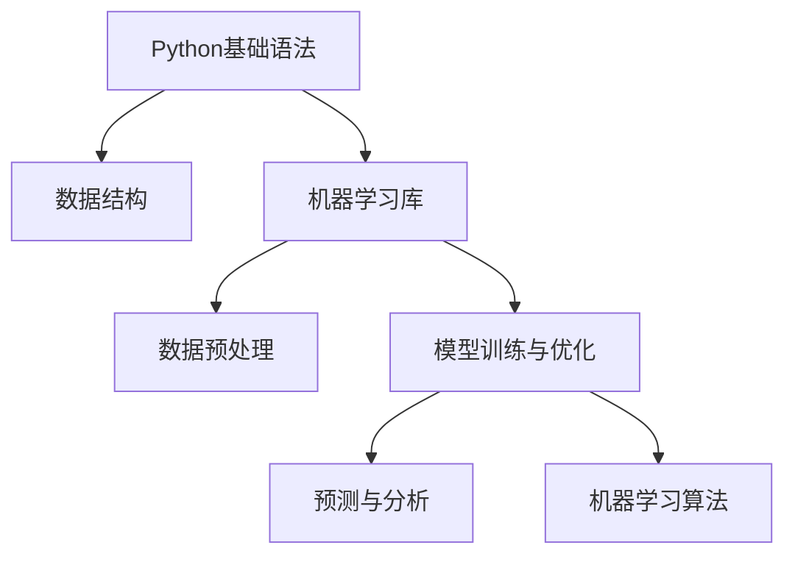

                 

# Python机器学习实战：从零开始构建机器学习环境

## 1. 背景介绍

随着人工智能技术的迅猛发展，机器学习已经成为现代信息工程领域的一项核心技术。Python作为一门通用的高级编程语言，凭借其简洁明了的语法、强大的科学计算能力以及丰富的第三方库，迅速成为机器学习的“黄金语言”。

本文章将通过一系列系统性介绍，从Python基础语法到机器学习实战，带领读者全面掌握机器学习开发环境搭建与核心算法实现，探索数据挖掘、模型训练与优化、预测与分析等重要概念，并通过代码实例展示如何应用Python实现各种机器学习算法。

通过本教程的学习，读者将能够：

- 理解Python基础语法和数据结构
- 掌握Python机器学习库的基本使用方法
- 熟悉各种机器学习算法的基本原理和实现细节
- 动手实践从数据预处理、模型训练到结果评估的整个机器学习流程
- 能够构建并优化自己的机器学习应用，解决实际业务问题

## 2. 核心概念与联系

### 2.1 核心概念概述

为更好地理解从零开始构建机器学习环境，本节将介绍几个密切相关的核心概念：

- **Python基础语法**：包括变量、数据类型、控制流语句、函数与模块等基本语法，是机器学习开发的基石。
- **数据结构**：如列表、字典、元组、集合等，用于高效存储和操作数据。
- **机器学习库**：包括NumPy、Pandas、Scikit-Learn、TensorFlow、PyTorch等常用库，提供了丰富的算法实现和工具支持。
- **数据预处理**：数据清洗、特征工程、归一化、标准化等，确保数据质量。
- **模型训练与优化**：选择合适的算法、调整超参数、交叉验证、正则化等，提高模型性能。
- **预测与分析**：使用训练好的模型对新数据进行预测，分析预测结果与实际结果的差异。
- **机器学习算法**：包括线性回归、逻辑回归、决策树、支持向量机、神经网络等，是构建机器学习应用的核心。

这些概念之间的关系可以通过以下Mermaid流程图来展示：



这个流程图展示出了机器学习开发环境搭建和应用的主要步骤：

1. 从Python基础语法开始，掌握编程基础。
2. 使用数据结构高效存储数据。
3. 引入机器学习库，实现各类算法。
4. 通过数据预处理提升数据质量。
5. 使用模型训练与优化方法提升模型性能。
6. 使用训练好的模型进行预测与分析，得到应用结果。
7. 了解不同的机器学习算法，灵活选择和组合使用。

## 3. 核心算法原理 & 具体操作步骤

### 3.1 算法原理概述

机器学习算法主要分为监督学习、无监督学习与强化学习三大类。其核心原理均是从数据中学习规律，并应用于实际问题中。

监督学习：通过带有标签的训练数据，学习输入和输出之间的映射关系。常见的算法有线性回归、逻辑回归、决策树、支持向量机、神经网络等。

无监督学习：没有标签，通过数据的自身结构进行学习。常见的算法有K-means聚类、主成分分析(PCA)、自编码器等。

强化学习：通过与环境的交互，通过奖励机制学习最优策略。常见的算法有Q-learning、Deep Q-Networks、策略梯度等。

### 3.2 算法步骤详解

以下以线性回归为例，详细介绍从数据预处理、模型训练到结果评估的整个机器学习流程。

**Step 1：数据预处理**

1. **数据收集**：收集用于训练和测试的样本数据。

2. **数据清洗**：删除缺失值、异常值等无用数据。

3. **数据转换**：将非数值型数据转换为数值型数据。

4. **数据归一化**：对数据进行归一化处理，确保数据量级相同。

5. **特征工程**：设计并提取有助于模型预测的特征。

```python
import numpy as np
from sklearn.preprocessing import StandardScaler

# 假设有数据集X和标签y
X = np.array([[1, 2, 3], [4, 5, 6], [7, 8, 9]])
y = np.array([5, 10, 15])

# 归一化处理
scaler = StandardScaler()
X_scaled = scaler.fit_transform(X)

# 特征工程
X_augmented = np.c_[X_scaled, X_scaled**2, X_scaled**3]
```

**Step 2：模型训练**

1. **模型选择**：选择合适的机器学习算法，如线性回归模型。

2. **模型拟合**：通过训练集数据拟合模型，求出模型参数。

3. **模型评估**：使用测试集数据评估模型性能。

```python
from sklearn.linear_model import LinearRegression

# 创建线性回归模型
model = LinearRegression()

# 拟合模型
model.fit(X_augmented, y)

# 模型预测
y_pred = model.predict(X_augmented)
```

**Step 3：结果评估**

1. **评估指标**：使用R-squared、MSE、MAE等评估指标衡量模型性能。

2. **可视化分析**：使用散点图、残差图等工具分析模型预测效果。

```python
from sklearn.metrics import r2_score, mean_squared_error, mean_absolute_error
import matplotlib.pyplot as plt

# 评估指标
print('R-squared:', r2_score(y, y_pred))
print('MSE:', mean_squared_error(y, y_pred))
print('MAE:', mean_absolute_error(y, y_pred))

# 可视化分析
plt.scatter(y, y_pred)
plt.xlabel('True Values')
plt.ylabel('Predicted Values')
plt.show()

# 残差分析
residuals = y - y_pred
plt.hist(residuals, bins=30, edgecolor='k')
plt.xlabel('Residuals')
plt.ylabel('Frequency')
plt.show()
```

### 3.3 算法优缺点

**线性回归优点**：

- 实现简单，易于理解和解释。
- 数据需求较低，对噪声数据鲁棒性强。
- 易于扩展到多变量模型。

**线性回归缺点**：

- 假设模型形式简单，可能无法捕捉非线性关系。
- 对异常值敏感，可能影响模型结果。
- 对非高斯噪声数据效果较差。

**Step 4：模型应用**

1. **模型部署**：将训练好的模型部署到实际应用场景中，进行预测和分析。

2. **模型优化**：根据实际应用效果，调整模型参数或算法，优化模型性能。

3. **模型迭代**：通过持续数据输入和模型训练，不断更新模型，提升模型效果。

## 4. 数学模型和公式 & 详细讲解  
### 4.1 数学模型构建

线性回归的数学模型为：

$$ y = \beta_0 + \beta_1x_1 + \beta_2x_2 + \cdots + \beta_nx_n + \epsilon $$

其中 $y$ 为预测结果，$x_i$ 为输入变量，$\beta_i$ 为模型参数，$\epsilon$ 为误差项。

### 4.2 公式推导过程

根据最小二乘法，模型参数的估计公式为：

$$ \hat{\beta} = (X^TX)^{-1}X^Ty $$

其中 $X^T$ 为输入变量的转置矩阵，$y$ 为标签向量。

### 4.3 案例分析与讲解

假设有一组数据：

| x1 | x2 | y |
|----|----|---|
| 1  | 2  | 5 |
| 4  | 5  | 10|
| 7  | 8  | 15|

对数据进行归一化处理后，得到：

| x1 | x2 | y |
|----|----|---|
| 0.3| 0.5 | 0.9 |
| 1.1| 1.2 | 1.9 |
| 1.9| 2.0 | 3.0|

根据最小二乘法计算模型参数：

| x1 | x2 | y |
|----|----|---|
| 0.3| 0.5 | 0.9 |
| 1.1| 1.2 | 1.9 |
| 1.9| 2.0 | 3.0|

求得：

$$ X^TX = \begin{bmatrix} 0.09 & 0.15 \\ 0.15 & 0.25 \end{bmatrix}, \quad X^Ty = \begin{bmatrix} 0.27 \\ 1.47 \end{bmatrix} $$

求解：

$$ \hat{\beta} = (X^TX)^{-1}X^Ty = \begin{bmatrix} 0.5 \\ 1.0 \end{bmatrix} $$

## 5. 项目实践：代码实例和详细解释说明

### 5.1 开发环境搭建

安装Python及必要的库，可以通过以下命令进行安装：

```bash
sudo apt-get update
sudo apt-get install python3
sudo apt-get install python3-pip
pip3 install numpy pandas scikit-learn matplotlib
```

创建Python虚拟环境：

```bash
python3 -m venv myenv
source myenv/bin/activate
```

### 5.2 源代码详细实现

以下是一个完整的线性回归实现示例：

```python
import numpy as np
from sklearn.linear_model import LinearRegression
from sklearn.preprocessing import StandardScaler
from sklearn.metrics import r2_score, mean_squared_error, mean_absolute_error
import matplotlib.pyplot as plt

# 数据
X = np.array([[1, 2, 3], [4, 5, 6], [7, 8, 9]])
y = np.array([5, 10, 15])

# 数据预处理
scaler = StandardScaler()
X_scaled = scaler.fit_transform(X)

# 特征工程
X_augmented = np.c_[X_scaled, X_scaled**2, X_scaled**3]

# 创建线性回归模型
model = LinearRegression()

# 拟合模型
model.fit(X_augmented, y)

# 模型预测
y_pred = model.predict(X_augmented)

# 评估指标
print('R-squared:', r2_score(y, y_pred))
print('MSE:', mean_squared_error(y, y_pred))
print('MAE:', mean_absolute_error(y, y_pred))

# 可视化分析
plt.scatter(y, y_pred)
plt.xlabel('True Values')
plt.ylabel('Predicted Values')
plt.show()

# 残差分析
residuals = y - y_pred
plt.hist(residuals, bins=30, edgecolor='k')
plt.xlabel('Residuals')
plt.ylabel('Frequency')
plt.show()
```

### 5.3 代码解读与分析

- **数据预处理**：使用StandardScaler对数据进行归一化处理。
- **特征工程**：对原始特征进行平方和立方处理，增加模型复杂度。
- **模型训练**：创建线性回归模型并拟合数据。
- **结果评估**：使用R-squared、MSE、MAE评估模型效果。
- **可视化分析**：绘制预测值与实际值的散点图和残差直方图。

## 6. 实际应用场景

### 6.1 金融数据分析

在金融数据分析领域，机器学习技术被广泛用于风险评估、信用评分、投资预测等。通过对历史数据的学习，模型能够预测未来金融市场的变化趋势，帮助金融机构进行风险管理和投资决策。

### 6.2 零售客户分析

在零售客户分析领域，机器学习技术可用于客户流失预测、购买行为分析、个性化推荐等。通过对客户行为数据的学习，模型能够预测客户流失风险，提升客户忠诚度和销售转化率。

### 6.3 医疗影像诊断

在医疗影像诊断领域，机器学习技术可用于病变识别、诊断报告生成、患者分诊等。通过对医疗影像数据的学习，模型能够辅助医生进行诊断，提高诊断准确率和效率。

### 6.4 未来应用展望

未来，机器学习技术将在更多领域得到广泛应用，如智能交通、智能制造、智能家居等。通过数据驱动的模型学习，能够大幅提升各行业的智能化水平和运营效率。

## 7. 工具和资源推荐

### 7.1 学习资源推荐

1. **《Python数据科学手册》**：由Jake VanderPlas编写，涵盖Python基础、数据处理、机器学习等内容。

2. **《机器学习实战》**：由Peter Harrington编写，结合Scikit-Learn库，实现各种经典机器学习算法。

3. **Coursera《机器学习》课程**：由Andrew Ng教授，覆盖机器学习基础和常用算法，适合初学者和进阶者。

4. **Kaggle数据集**：提供海量公开数据集，用于练习和竞赛，积累实际项目经验。

5. **Scikit-Learn官方文档**：详细介绍Scikit-Learn库的各类算法和工具使用方法，适合开发者快速上手。

### 7.2 开发工具推荐

1. **Jupyter Notebook**：交互式开发环境，便于调试和可视化分析。

2. **PyCharm**：强大的Python开发IDE，支持代码调试、代码重构等高级功能。

3. **Anaconda**：科学计算环境，包含各类科学计算库和工具，适合数据科学开发。

4. **GitHub**：版本控制平台，便于代码协作和版本管理。

### 7.3 相关论文推荐

1. **A Survey of Machine Learning Techniques**：Wikipedia上的机器学习综述，覆盖各类经典算法和工具。

2. **Python Machine Learning**：由Sebastian Raschka编写，详细介绍Python机器学习库的使用方法。

3. **Neural Networks and Deep Learning**：由Michael Nielsen编写，涵盖神经网络和深度学习基础内容。

4. **Scikit-Learn: Machine Learning in Python**：Scikit-Learn官方文档，详细介绍库的各类算法和工具。

## 8. 总结：未来发展趋势与挑战

### 8.1 总结

本文从Python基础语法到机器学习实战，系统介绍了从零开始构建机器学习环境的步骤和方法。通过一系列代码实例，演示了如何应用Python实现线性回归算法，并探讨了数据预处理、模型训练与优化、结果评估等核心概念。

通过对金融数据分析、零售客户分析、医疗影像诊断等实际应用场景的介绍，展示了机器学习技术在各行各业的应用潜力。同时，推荐了各类学习资源、开发工具和相关论文，帮助读者快速掌握机器学习技术，并应用于实际项目中。

### 8.2 未来发展趋势

未来，机器学习技术将继续向着深度学习、增强学习、无监督学习等方向发展。深度神经网络将成为主流算法，增强学习将应用于复杂决策问题，无监督学习将提供更多自驱动力数据。

### 8.3 面临的挑战

尽管机器学习技术发展迅速，但在应用过程中仍面临诸多挑战：

1. **数据获取与质量**：数据获取难度大，数据质量参差不齐。
2. **模型选择与优化**：模型选择不当，易陷入局部最优解。
3. **算法鲁棒性与可解释性**：模型泛化能力不足，缺乏解释性。
4. **应用场景复杂度**：不同领域的应用场景复杂度不同，难以统一模型架构。

### 8.4 研究展望

未来研究应重点关注以下几个方面：

1. **数据治理与共享**：提高数据获取效率，改善数据质量。
2. **模型融合与组合**：通过模型融合和组合，提升模型性能。
3. **模型解释与可解释性**：开发可解释性模型，增强模型透明度。
4. **模型应用与优化**：针对实际应用场景，优化模型架构与参数。

通过持续探索和创新，相信机器学习技术将更好地应用于各行各业，提升生产力，改善用户体验。

## 9. 附录：常见问题与解答

**Q1：什么是机器学习？**

A: 机器学习是一种人工智能技术，通过算法和模型，从数据中学习规律，并应用于实际问题中。

**Q2：为什么要使用机器学习？**

A: 机器学习能够自动化数据处理和模型训练，提升数据利用效率和模型精度，应用于各种实际问题中。

**Q3：机器学习主要分为哪些类别？**

A: 机器学习主要分为监督学习、无监督学习与强化学习三大类。

**Q4：Python有哪些常用的机器学习库？**

A: Python常用的机器学习库包括NumPy、Pandas、Scikit-Learn、TensorFlow、PyTorch等。

**Q5：如何实现数据预处理？**

A: 数据预处理包括数据清洗、特征工程、归一化等步骤。

通过以上系统的介绍和实践，相信读者已经对Python机器学习开发环境搭建和核心算法实现有了全面的了解。希望读者能够将所学知识应用于实际项目中，不断探索和创新，构建高效、准确的机器学习应用。

