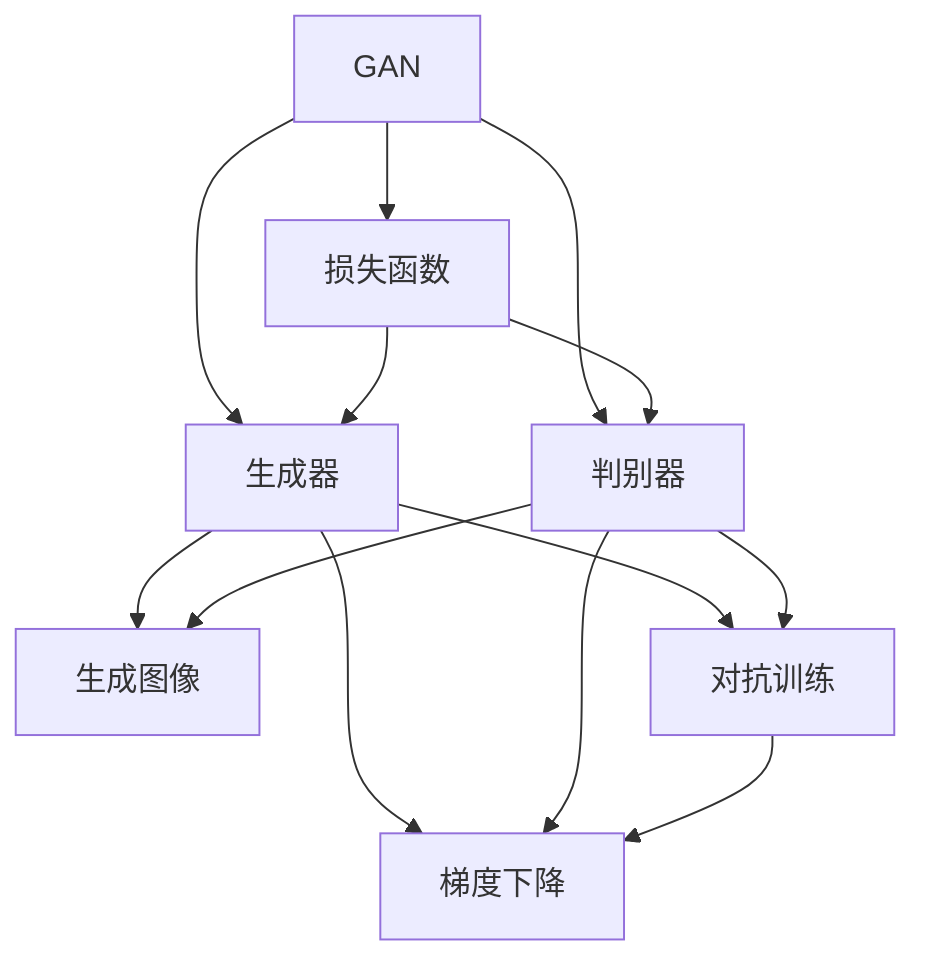

                 

# Python机器学习实战：生成对抗网络(GAN)的原理与应用

> 关键词：生成对抗网络(GAN),机器学习,深度学习,图像生成,图像修复,深度伪造,图像增强

## 1. 背景介绍

### 1.1 问题由来
生成对抗网络（Generative Adversarial Networks，GAN）是近年来深度学习领域中极具影响力的模型之一，因其在图像生成、图像修复、图像增强等领域中的出色表现而受到广泛关注。GAN模型由生成器和判别器两个神经网络构成，两者通过对抗学习的方式训练，实现从噪声生成高质量的图像。这一技术不仅在计算机视觉领域有重要应用，也为机器学习提供了全新的视角。

GAN的提出可以追溯到2014年Ian Goodfellow等人在论文《Generative Adversarial Nets》中的工作，他们提出的GAN模型通过生成器和判别器之间的对抗学习，生成逼真的图像。这一模型由于其新颖的训练方式和在图像生成中的卓越表现，迅速成为机器学习领域的研究热点。此后，许多改进的GAN模型，如DCGAN、WGAN、CycleGAN等陆续被提出，并在图像生成、图像修复、图像增强等领域取得突破性进展。

### 1.2 问题核心关键点
GAN模型的核心思想是通过对抗学习的方式，使生成器能够生成高质量的图像，而判别器能够准确区分生成图像与真实图像，两者的对抗学习过程不断优化，逐步提升生成器生成图像的质量。GAN模型的训练过程复杂且容易收敛到局部最优，因此需要精心设计模型架构和训练策略。

GAN模型的主要挑战包括：
- 对抗训练：生成器和判别器之间复杂的对抗学习过程，容易导致训练不稳定。
- 模式崩溃：在训练过程中，生成器可能会生成单一模式的图像，即模式崩溃现象。
- 训练效率：GAN模型的训练时间较长，且容易陷入局部最优。
- 图像质量：生成图像的质量受到模型参数和训练策略的影响。

尽管存在这些挑战，GAN模型在图像生成等任务中的表现依然卓越，为计算机视觉领域的进一步研究提供了新的方向。

### 1.3 问题研究意义
GAN模型的研究对于计算机视觉领域具有重要意义：

1. 生成逼真图像：GAN模型能够生成高质量、逼真的图像，广泛应用于图像生成、图像修复等领域。
2. 提升图像质量：通过GAN模型的图像增强，可以提升图像质量，改善视觉体验。
3. 增加数据多样性：GAN模型可以从噪声生成图像，丰富数据集，促进深度学习模型的训练和应用。
4. 促进领域创新：GAN模型为计算机视觉领域带来了新的思路和方法，推动了深度学习技术的进步。

## 2. 核心概念与联系

### 2.1 核心概念概述

为了更好地理解GAN模型的原理和应用，本节将介绍几个密切相关的核心概念：

- **生成对抗网络(GAN)**：由生成器（Generator）和判别器（Discriminator）两个神经网络构成的模型，通过对抗学习的方式训练，生成逼真的图像。

- **生成器（Generator）**：负责从噪声中生成图像，其目标是最大化欺骗判别器，使其误认为生成的图像是真实的。

- **判别器（Discriminator）**：负责区分真实图像和生成图像，其目标是最大化区分真实图像和生成图像的能力。

- **对抗学习（Adversarial Learning）**：生成器和判别器之间的对抗训练过程，通过优化生成器和判别器之间的损失函数，使得生成器能够生成逼真的图像，判别器能够准确区分真实图像和生成图像。

- **损失函数**：用于衡量生成器和判别器的性能，常见的损失函数包括交叉熵损失、感知损失等。

- **梯度下降（Gradient Descent）**：一种优化算法，用于在损失函数下降最快的方向上更新模型参数。

- **梯度上升（Gradient Ascent）**：一种优化算法，用于在损失函数上升最快的方向上更新判别器的参数。

这些核心概念之间的逻辑关系可以通过以下Mermaid流程图来展示：



这个流程图展示了GAN模型的核心组件和训练过程：

1. 通过生成器和判别器的对抗学习，生成逼真的图像。
2. 判别器不断优化，以区分真实图像和生成图像。
3. 生成器不断优化，以欺骗判别器。
4. 两者共同优化损失函数，逐步提升生成图像的质量。

## 3. 核心算法原理 & 具体操作步骤
### 3.1 算法原理概述

GAN模型的核心思想是通过对抗学习的方式，使生成器能够生成高质量的图像，而判别器能够准确区分生成图像与真实图像，两者的对抗学习过程不断优化，逐步提升生成器生成图像的质量。

具体而言，GAN模型由两个神经网络组成：生成器（Generator）和判别器（Discriminator）。生成器的输入为随机噪声，输出为图像；判别器的输入为图像，输出为判别概率，表示输入图像为真实图像的概率。

在训练过程中，生成器和判别器交替进行训练。首先，生成器生成一批随机噪声，将其转化为图像；然后，判别器对这批图像进行分类，判断其真实性；接着，生成器根据判别器的分类结果进行优化，使其生成的图像能够欺骗判别器；最后，判别器根据生成器的优化结果进行优化，使其能够更准确地分类真实图像和生成图像。

这种对抗学习的过程不断迭代，直至生成器生成的图像能够欺骗判别器，即判别器无法准确区分真实图像和生成图像。

### 3.2 算法步骤详解

基于GAN模型的训练通常包括以下几个关键步骤：

**Step 1: 准备数据集**

- 收集并预处理训练数据集，将其分为训练集和验证集。
- 将图像数据标准化，并进行归一化处理。

**Step 2: 设计模型架构**

- 设计生成器和判别器的网络结构，一般采用卷积神经网络（CNN）。
- 定义损失函数，常用的损失函数包括交叉熵损失、感知损失等。
- 选择合适的优化器，如Adam、RMSprop等。

**Step 3: 初始化模型参数**

- 生成器和判别器初始化随机权重，设定学习率和迭代次数。
- 设定判别器为批量更新，生成器为单次更新。

**Step 4: 对抗训练过程**

- 生成器生成一批随机噪声，将其转化为图像。
- 判别器对这批图像进行分类，输出判别概率。
- 根据判别器的分类结果，生成器更新权重，优化生成的图像。
- 判别器更新权重，优化判别真实图像和生成图像的能力。

**Step 5: 验证与测试**

- 在验证集上评估生成器的生成效果，判断生成图像的质量。
- 在测试集上进一步验证生成器的性能，确保生成图像的质量。

### 3.3 算法优缺点

GAN模型在图像生成、图像修复等领域表现出色，但同时也存在一些局限性：

- **优点**：
  - 能够生成高质量、逼真的图像，广泛应用于图像生成、图像修复等领域。
  - 生成图像的多样性丰富，有助于数据增强和数据扩展。
  - 能够实现高效的图像增强，提升图像质量。

- **缺点**：
  - 训练不稳定，容易陷入局部最优，导致训练过程收敛困难。
  - 生成图像存在模式崩溃现象，即生成图像过于单一。
  - 生成图像质量受模型参数和训练策略的影响较大。
  - 计算资源消耗较大，训练时间较长。

尽管存在这些缺点，GAN模型在图像生成等领域的表现依然卓越，为计算机视觉领域带来了新的突破。

### 3.4 算法应用领域

GAN模型在计算机视觉领域的应用非常广泛，具体包括：

- **图像生成**：通过GAN模型生成逼真、高质量的图像，广泛应用于游戏、电影、艺术等领域。
- **图像修复**：通过GAN模型修复损坏的图像，使其恢复原有的质量和细节。
- **图像增强**：通过GAN模型增强图像质量，提升视觉体验。
- **图像转换**：通过GAN模型实现图像风格的转换，如将照片转换为油画风格。
- **图像生成对抗网络（Image-to-Image GAN）**：通过GAN模型实现图像之间的转换和生成，如将街景图像转换为夜视图。
- **人脸生成**：通过GAN模型生成逼真的人脸图像，广泛应用于虚拟现实、动画制作等领域。

除了图像领域，GAN模型在其他领域也有广泛应用，如语音生成、文本生成等。

## 4. 数学模型和公式 & 详细讲解 & 举例说明

### 4.1 数学模型构建

GAN模型的数学模型可以描述为：

- 生成器（Generator）：将随机噪声 $z$ 映射为图像 $G(z)$。
- 判别器（Discriminator）：输入图像 $x$，输出判别概率 $D(x)$，表示 $x$ 为真实图像的概率。

GAN模型的训练目标函数为：

$$
\min_G \max_D V(G, D) = \mathbb{E}_{x\sim p_{data}(x)}\log D(x) + \mathbb{E}_{z\sim p(z)}\log(1-D(G(z)))
$$

其中，$V(G, D)$ 表示生成器和判别器的对抗损失函数。

### 4.2 公式推导过程

在GAN模型中，生成器和判别器的损失函数分别为：

- 生成器的损失函数：

$$
L_G = -\mathbb{E}_{z\sim p(z)}\log D(G(z))
$$

- 判别器的损失函数：

$$
L_D = -\mathbb{E}_{x\sim p_{data}(x)}\log D(x) - \mathbb{E}_{z\sim p(z)}\log(1-D(G(z)))
$$

在训练过程中，通过优化生成器和判别器的损失函数，使得生成器能够生成逼真的图像，判别器能够准确区分真实图像和生成图像。

### 4.3 案例分析与讲解

以下是一个简单的GAN模型示例，使用TensorFlow实现图像生成：

```python
import tensorflow as tf
from tensorflow.keras import layers

# 定义生成器
def make_generator_model():
    model = tf.keras.Sequential()
    model.add(layers.Dense(256, use_bias=False, input_shape=(100,)))
    model.add(layers.BatchNormalization())
    model.add(layers.LeakyReLU())
    model.add(layers.Dense(512))
    model.add(layers.BatchNormalization())
    model.add(layers.LeakyReLU())
    model.add(layers.Dense(1024))
    model.add(layers.BatchNormalization())
    model.add(layers.LeakyReLU())
    model.add(layers.Dense(784, activation='tanh'))
    model.add(layers.Reshape((28, 28, 1)))
    return model

# 定义判别器
def make_discriminator_model():
    model = tf.keras.Sequential()
    model.add(layers.Flatten(input_shape=(28, 28, 1)))
    model.add(layers.Dense(1024))
    model.add(layers.LeakyReLU())
    model.add(layers.Dropout(0.2))
    model.add(layers.Dense(512))
    model.add(layers.LeakyReLU())
    model.add(layers.Dropout(0.2))
    model.add(layers.Dense(1, activation='sigmoid'))
    return model

# 定义损失函数
cross_entropy = tf.keras.losses.BinaryCrossentropy(from_logits=True)

# 定义生成器和判别器的损失函数
def generator_loss(fake_output):
    return cross_entropy(tf.ones_like(fake_output), fake_output)

def discriminator_loss(real_output, fake_output):
    real_loss = cross_entropy(tf.ones_like(real_output), real_output)
    fake_loss = cross_entropy(tf.zeros_like(fake_output), fake_output)
    return real_loss + fake_loss

# 定义优化器
generator_optimizer = tf.keras.optimizers.Adam(1e-4)
discriminator_optimizer = tf.keras.optimizers.Adam(1e-4)

# 定义训练过程
@tf.function
def train_step(images):
    noise = tf.random.normal([BATCH_SIZE, 100])

    with tf.GradientTape() as gen_tape, tf.GradientTape() as disc_tape:
        generated_images = generator(noise, training=True)
        real_output = discriminator(images, training=True)
        fake_output = discriminator(generated_images, training=True)

        gen_loss = generator_loss(fake_output)
        disc_loss = discriminator_loss(real_output, fake_output)

    gradients_of_generator = gen_tape.gradient(gen_loss, generator.trainable_variables)
    gradients_of_discriminator = disc_tape.gradient(disc_loss, discriminator.trainable_variables)

    generator_optimizer.apply_gradients(zip(gradients_of_generator, generator.trainable_variables))
    discriminator_optimizer.apply_gradients(zip(gradients_of_discriminator, discriminator.trainable_variables))
```

在这个示例中，生成器和判别器的网络结构采用卷积神经网络，生成器接受随机噪声作为输入，输出经过Reshape层后形成图像；判别器接受图像作为输入，输出判别概率。训练过程中，使用交叉熵损失函数和Adam优化器进行优化。

## 5. 项目实践：代码实例和详细解释说明

### 5.1 开发环境搭建

在进行GAN项目实践前，我们需要准备好开发环境。以下是使用Python进行TensorFlow开发的Python 3环境配置流程：

1. 安装Anaconda：从官网下载并安装Anaconda，用于创建独立的Python环境。

2. 创建并激活虚拟环境：
```bash
conda create -n py3k python=3.8 
conda activate py3k
```

3. 安装TensorFlow：根据CUDA版本，从官网获取对应的安装命令。例如：
```bash
conda install tensorflow -c pytorch -c conda-forge
```

4. 安装Numpy和Matplotlib等工具包：
```bash
pip install numpy matplotlib scikit-learn tqdm jupyter notebook ipython
```

完成上述步骤后，即可在`py3k`环境中开始GAN项目实践。

### 5.2 源代码详细实现

下面我们以MNIST手写数字生成为例，给出使用TensorFlow对GAN模型进行训练的代码实现。

首先，定义GAN模型的生成器和判别器：

```python
import tensorflow as tf
from tensorflow.keras import layers

class Generator(tf.keras.Model):
    def __init__(self):
        super(Generator, self).__init__()
        self.dense1 = layers.Dense(256, input_shape=(100,), use_bias=False)
        self.bn1 = layers.BatchNormalization()
        self.leakyrelu1 = layers.LeakyReLU(alpha=0.2)
        self.dense2 = layers.Dense(512)
        self.bn2 = layers.BatchNormalization()
        self.leakyrelu2 = layers.LeakyReLU(alpha=0.2)
        self.dense3 = layers.Dense(1024)
        self.bn3 = layers.BatchNormalization()
        self.leakyrelu3 = layers.LeakyReLU(alpha=0.2)
        self.dense4 = layers.Dense(784, activation='tanh')
        self.reshape = layers.Reshape((28, 28, 1))

    def call(self, x):
        x = self.dense1(x)
        x = self.bn1(x)
        x = self.leakyrelu1(x)
        x = self.dense2(x)
        x = self.bn2(x)
        x = self.leakyrelu2(x)
        x = self.dense3(x)
        x = self.bn3(x)
        x = self.leakyrelu3(x)
        x = self.dense4(x)
        x = self.reshape(x)
        return x

class Discriminator(tf.keras.Model):
    def __init__(self):
        super(Discriminator, self).__init__()
        self.flatten = layers.Flatten(input_shape=(28, 28, 1))
        self.dense1 = layers.Dense(1024)
        self.leakyrelu1 = layers.LeakyReLU(alpha=0.2)
        self.dropout1 = layers.Dropout(0.2)
        self.dense2 = layers.Dense(512)
        self.leakyrelu2 = layers.LeakyReLU(alpha=0.2)
        self.dropout2 = layers.Dropout(0.2)
        self.dense3 = layers.Dense(1, activation='sigmoid')

    def call(self, x):
        x = self.flatten(x)
        x = self.dense1(x)
        x = self.leakyrelu1(x)
        x = self.dropout1(x)
        x = self.dense2(x)
        x = self.leakyrelu2(x)
        x = self.dropout2(x)
        logits = self.dense3(x)
        return logits
```

然后，定义GAN模型的训练函数：

```python
import numpy as np
import matplotlib.pyplot as plt

BATCH_SIZE = 32
LATENT_DIM = 100

def train(G, D, G_opt, D_opt, train_dataset, epochs=100):
    for epoch in range(epochs):
        for batch in train_dataset:
            # 从训练数据集中获取一批图像数据
            real_images = batch[0].numpy().reshape(-1, 28, 28, 1).astype(np.float32)

            # 使用生成器生成一批随机噪声
            noise = tf.random.normal([BATCH_SIZE, LATENT_DIM])

            # 生成器生成图像
            with tf.GradientTape() as gen_tape:
                gen_images = G(noise, training=True)

            # 判别器评估真实图像和生成图像
            with tf.GradientTape() as disc_tape:
                real_loss = D(real_images, training=True)
                fake_loss = D(gen_images, training=True)

            # 计算损失函数
            gen_loss = gen_loss = generator_loss(fake_loss)
            disc_loss = discriminator_loss(real_loss, fake_loss)

            # 更新生成器和判别器参数
            gen_gradients = gen_tape.gradient(gen_loss, G.trainable_variables)
            disc_gradients = disc_tape.gradient(disc_loss, D.trainable_variables)

            G_opt.apply_gradients(zip(gen_gradients, G.trainable_variables))
            D_opt.apply_gradients(zip(disc_gradients, D.trainable_variables))

            # 可视化
            if epoch % 10 == 0:
                plt.figure(figsize=(16, 16))
                plt.subplot(4, 4, 1)
                plt.title('Real Images')
                plt.imshow(np.squeeze(real_images[0]))
                for i in range(1, BATCH_SIZE):
                    plt.subplot(4, 4, i + 1)
                    plt.title('Generated Images')
                    plt.imshow(np.squeeze(gen_images[i].numpy().reshape(28, 28)))
                plt.show()
```

最后，进行模型训练和可视化：

```python
G = Generator()
D = Discriminator()
G_opt = tf.keras.optimizers.Adam(1e-4)
D_opt = tf.keras.optimizers.Adam(1e-4)

train_dataset = tf.data.Dataset.from_tensor_slices((real_images, real_labels)).batch(32)
train(G, D, G_opt, D_opt, train_dataset, epochs=100)

plt.figure(figsize=(16, 16))
plt.subplot(4, 4, 1)
plt.title('Real Images')
plt.imshow(np.squeeze(real_images[0]))
for i in range(1, BATCH_SIZE):
    plt.subplot(4, 4, i + 1)
    plt.title('Generated Images')
    plt.imshow(np.squeeze(gen_images[i].numpy().reshape(28, 28)))
plt.show()
```

以上就是使用TensorFlow对GAN模型进行MNIST手写数字生成的代码实现。可以看到，TensorFlow的Keras API使得模型的定义和训练过程变得简洁高效。

### 5.3 代码解读与分析

让我们再详细解读一下关键代码的实现细节：

**Generator类**：
- `__init__`方法：定义生成器的网络结构，包括多个全连接层和激活函数。
- `call`方法：实现生成器的前向传播，将随机噪声转换为图像。

**Discriminator类**：
- `__init__`方法：定义判别器的网络结构，包括多个全连接层和激活函数。
- `call`方法：实现判别器的前向传播，将图像转换为判别概率。

**train函数**：
- 从训练数据集中获取一批图像数据，将其标准化。
- 使用生成器生成一批随机噪声，并生成图像。
- 判别器对真实图像和生成图像分别进行评估，计算损失函数。
- 使用生成器和判别器的损失函数更新模型参数。
- 每10个epoch进行一次可视化，展示训练过程中的图像变化。

**MNIST手写数字生成**：
- 定义生成器和判别器的网络结构。
- 使用TensorFlow的Keras API定义损失函数和优化器。
- 定义训练函数，对模型进行训练，并可视化生成图像。

通过这个简单的例子，我们可以看到，使用TensorFlow实现GAN模型非常简单高效。只需要定义生成器和判别器，设置损失函数和优化器，并编写训练函数即可。

当然，工业级的系统实现还需考虑更多因素，如模型的保存和部署、超参数的自动搜索、更灵活的网络结构设计等。但核心的GAN模型构建过程基本与此类似。

## 6. 实际应用场景
### 6.1 图像生成

GAN模型在图像生成领域的应用最为广泛。通过GAN模型，可以从噪声生成高质量、逼真的图像，广泛应用于游戏、电影、艺术等领域。

在实际应用中，可以将图像数据作为训练数据集，训练GAN模型，生成逼真的图像。例如，可以将自然风景、人物、动物等图像数据输入GAN模型，生成高质量的图像，用于游戏制作、电影特效等。此外，GAN模型还可以用于生成艺术风格的图像，如将照片转换为油画风格、水彩风格等。

### 6.2 图像修复

GAN模型在图像修复领域也有广泛应用。通过GAN模型，可以从损坏的图像中恢复原始图像，使其恢复原有的质量和细节。

在实际应用中，可以将损坏的图像作为训练数据集，训练GAN模型，生成修复后的图像。例如，可以将破损的图像输入GAN模型，生成修复后的高质量图像，用于数字文物保护、历史文档修复等。此外，GAN模型还可以用于视频修复，从损坏的视频片段中恢复原始视频。

### 6.3 图像增强

GAN模型在图像增强领域也有广泛应用。通过GAN模型，可以增强图像质量，提升视觉体验。

在实际应用中，可以将原始图像作为训练数据集，训练GAN模型，生成增强后的图像。例如，可以将原始的黑白图像输入GAN模型，生成增强后的彩色图像，用于医学图像增强、历史图片修复等。此外，GAN模型还可以用于提升图像分辨率，生成更高质量的图像。

### 6.4 未来应用展望

随着GAN模型的不断发展，其应用范围将不断拓展，带来更多的创新和突破：

1. **多模态生成**：GAN模型可以应用于多模态数据的生成，如音频、视频、文本等。例如，可以通过GAN模型生成逼真的语音、视频，用于虚拟现实、游戏制作等领域。
2. **三维生成**：GAN模型可以应用于三维数据的生成，如生成逼真的三维模型、人物、场景等。例如，可以用于虚拟现实、游戏制作等领域。
3. **跨领域应用**：GAN模型可以应用于跨领域的数据生成，如将文本转换为图像、将图像转换为音乐等。例如，可以通过GAN模型生成逼真的音乐，用于游戏制作、音乐创作等领域。
4. **联合训练**：GAN模型可以与其他深度学习模型联合训练，提升生成效果。例如，可以联合训练GAN模型和目标检测模型，提升生成图像的质量和准确性。
5. **实时生成**：GAN模型可以应用于实时生成，如生成逼真的视频、音频等。例如，可以用于实时生成视频特效、实时生成音乐等。

这些应用方向将进一步拓展GAN模型的应用场景，推动其在更广泛领域的应用。

## 7. 工具和资源推荐
### 7.1 学习资源推荐

为了帮助开发者系统掌握GAN模型的理论基础和实践技巧，这里推荐一些优质的学习资源：

1. **《Generative Adversarial Networks: An Overview》**：Ian Goodfellow等人在ICLR 2017上发表的综述性论文，全面介绍了GAN模型的原理和应用。

2. **《Deep Learning with Python》**：Francois Chollet所著的深度学习入门书籍，包括GAN模型的基本概念和实现方法。

3. **TensorFlow官方文档**：TensorFlow的官方文档，提供了详细的GAN模型实现示例和API接口。

4. **PyTorch官方文档**：PyTorch的官方文档，提供了GAN模型的实现示例和API接口。

5. **Kaggle数据集**：Kaggle平台提供了丰富的GAN模型训练数据集，包括图像生成、图像修复、图像增强等。

通过这些资源的学习实践，相信你一定能够快速掌握GAN模型的精髓，并用于解决实际的计算机视觉问题。

### 7.2 开发工具推荐

高效的开发离不开优秀的工具支持。以下是几款用于GAN模型开发的常用工具：

1. **TensorFlow**：由Google主导开发的深度学习框架，生产部署方便，适合大规模工程应用。

2. **PyTorch**：由Facebook开发的深度学习框架，灵活易用，适合研究性工作。

3. **Keras**：由Francois Chollet开发的深度学习框架，简单易用，适合快速迭代原型设计。

4. **OpenCV**：开源计算机视觉库，提供了图像处理、视频处理等常用功能。

5. **Matplotlib**：开源图形库，提供了丰富的绘图功能，适合数据可视化。

6. **Jupyter Notebook**：交互式编程环境，支持代码编写、数据处理、模型训练等，适合数据科学应用。

合理利用这些工具，可以显著提升GAN模型的开发效率，加快创新迭代的步伐。

### 7.3 相关论文推荐

GAN模型的研究源于学界的持续研究。以下是几篇奠基性的相关论文，推荐阅读：

1. **《Generative Adversarial Nets》**：Ian Goodfellow等人在NIPS 2014年发表的GAN模型原始论文。

2. **《Improved Techniques for Training GANs》**：Radford等人在arXiv 2016年发表的改进GAN模型训练的方法。

3. **《Unsupervised Representation Learning with Deep Convolutional Generative Adversarial Networks》**：Radford等人在arXiv 2015年发表的DCGAN模型。

4. **《Wasserstein GAN》**：Arjovsky等人在ICLR 2017年发表的WGAN模型。

5. **《Learning Transferable Image Models with Multi-task Learning》**：Ghifary等人在CVPR 2017年发表的多任务学习GAN模型。

这些论文代表了大GAN模型的发展脉络。通过学习这些前沿成果，可以帮助研究者把握学科前进方向，激发更多的创新灵感。

## 8. 总结：未来发展趋势与挑战

### 8.1 总结

本文对GAN模型的原理和应用进行了全面系统的介绍。首先阐述了GAN模型的研究背景和意义，明确了GAN模型在图像生成、图像修复、图像增强等领域的重要价值。其次，从原理到实践，详细讲解了GAN模型的数学模型和关键训练步骤，给出了GAN模型训练的完整代码实例。同时，本文还探讨了GAN模型在实际应用中的场景和未来发展方向，展示了GAN模型在计算机视觉领域的广阔前景。

通过本文的系统梳理，可以看到，GAN模型在图像生成、图像修复等领域表现出色，推动了计算机视觉领域的发展。未来，伴随GAN模型的持续演进，其在多模态生成、三维生成等领域的应用也将不断拓展，为计算机视觉领域带来新的突破。

### 8.2 未来发展趋势

展望未来，GAN模型的研究将呈现以下几个发展趋势：

1. **多模态生成**：GAN模型可以应用于多模态数据的生成，如音频、视频、文本等。例如，可以通过GAN模型生成逼真的语音、视频，用于虚拟现实、游戏制作等领域。
2. **三维生成**：GAN模型可以应用于三维数据的生成，如生成逼真的三维模型、人物、场景等。例如，可以用于虚拟现实、游戏制作等领域。
3. **跨领域应用**：GAN模型可以应用于跨领域的数据生成，如将文本转换为图像、将图像转换为音乐等。例如，可以通过GAN模型生成逼真的音乐，用于游戏制作、音乐创作等领域。
4. **联合训练**：GAN模型可以与其他深度学习模型联合训练，提升生成效果。例如，可以联合训练GAN模型和目标检测模型，提升生成图像的质量和准确性。
5. **实时生成**：GAN模型可以应用于实时生成，如生成逼真的视频、音频等。例如，可以用于实时生成视频特效、实时生成音乐等。

这些趋势将进一步拓展GAN模型的应用场景，推动其在更广泛领域的应用。

### 8.3 面临的挑战

尽管GAN模型在图像生成等领域表现出色，但在迈向更加智能化、普适化应用的过程中，它仍面临诸多挑战：

1. **训练不稳定**：GAN模型的训练过程容易陷入局部最优，导致训练过程收敛困难。如何提升训练稳定性，避免过拟合，是未来的一个重要研究方向。
2. **模式崩溃**：GAN模型在训练过程中可能会生成单一模式的图像，即模式崩溃现象。如何避免模式崩溃，提升生成图像的多样性，是未来的一个重要研究方向。
3. **计算资源消耗大**：GAN模型的训练时间较长，且容易陷入局部最优。如何降低计算资源消耗，提升训练效率，是未来的一个重要研究方向。
4. **生成图像质量不稳定**：GAN模型生成的图像质量受到模型参数和训练策略的影响较大。如何提升生成图像质量，增强模型的鲁棒性，是未来的一个重要研究方向。
5. **数据质量要求高**：GAN模型对训练数据的质量要求较高，需要高质量、多样性的数据集。如何降低对训练数据的依赖，提升数据集的质量，是未来的一个重要研究方向。

尽管存在这些挑战，GAN模型在图像生成等领域的表现依然卓越，为计算机视觉领域带来了新的突破。未来，伴随GAN模型的持续演进，这些问题有望逐步解决，GAN模型必将在更广泛领域带来更多的创新和突破。

### 8.4 研究展望

面对GAN模型面临的诸多挑战，未来的研究需要在以下几个方面寻求新的突破：

1. **改进生成器结构**：改进生成器的网络结构，提升生成图像的多样性和质量。例如，可以引入ResNet、CNN等结构，提升生成器的网络深度和复杂度。
2. **改进判别器结构**：改进判别器的网络结构，提升判别器的鲁棒性和准确性。例如，可以引入更多的卷积层和激活函数，提升判别器的复杂度和准确性。
3. **引入更多先验知识**：将符号化的先验知识，如知识图谱、逻辑规则等，与神经网络模型进行巧妙融合，引导GAN模型生成更加多样、逼真的图像。
4. **引入因果推理**：引入因果推理思想，提升GAN模型的生成效果。例如，可以引入因果推理网络，提升生成图像的因果关系和逻辑性。
5. **引入对抗训练策略**：引入对抗训练策略，提升GAN模型的鲁棒性和泛化能力。例如，可以引入随机噪声和对抗样本，提升GAN模型的鲁棒性和泛化能力。

这些研究方向将推动GAN模型的进一步发展，为计算机视觉领域带来更多的创新和突破。相信随着学界和产业界的共同努力，这些挑战终将逐步解决，GAN模型必将在更广泛的领域带来更多的创新和突破。

## 9. 附录：常见问题与解答

**Q1：GAN模型训练过程中如何避免模式崩溃现象？**

A: 模式崩溃现象是GAN模型训练过程中常见的问题。为了避免模式崩溃，可以采取以下措施：

1. **多任务学习**：在GAN模型训练过程中，引入多个任务，使生成器生成多模态数据。例如，可以同时生成彩色图像和黑白图像，提升生成图像的多样性。
2. **随机噪声**：在训练过程中，引入随机噪声，避免生成器产生单一模式的图像。例如，可以引入不同尺度的噪声，提升生成图像的多样性。
3. **数据增强**：在训练过程中，引入数据增强技术，提升生成图像的多样性。例如，可以旋转、缩放、裁剪训练数据，提升生成图像的多样性。
4. **联合训练**：与其他深度学习模型联合训练，提升生成图像的多样性。例如，可以联合训练GAN模型和目标检测模型，提升生成图像的多样性。

通过这些措施，可以有效避免模式崩溃现象，提升GAN模型的生成效果。

**Q2：GAN模型训练过程中如何提升训练稳定性？**

A: 提升GAN模型的训练稳定性是GAN模型研究的重要方向之一。以下是一些提升训练稳定性的方法：

1. **使用优化器**：使用合适的优化器，如Adam、RMSprop等，可以有效提升训练稳定性。例如，可以调整学习率、动量等参数，提升训练稳定性。
2. **引入正则化**：在训练过程中，引入正则化技术，如L2正则、Dropout等，可以有效避免过拟合，提升训练稳定性。
3. **使用批量标准化**：在训练过程中，使用批量标准化技术，可以有效提升训练稳定性。例如，可以引入BatchNormalization层，提升训练稳定性。
4. **引入对抗训练**：在训练过程中，引入对抗训练策略，可以有效提升训练稳定性。例如，可以引入对抗样本，提升GAN模型的鲁棒性。
5. **使用混合精度训练**：在训练过程中，使用混合精度训练技术，可以有效提升训练稳定性。例如，可以使用半精度浮点数进行训练，提升训练效率。

通过这些方法，可以有效提升GAN模型的训练稳定性，避免局部最优，提升生成图像的质量。

**Q3：GAN模型在图像生成过程中如何提升生成图像的质量？**

A: 提升GAN模型的生成图像质量是GAN模型研究的重要方向之一。以下是一些提升生成图像质量的方法：

1. **改进生成器结构**：改进生成器的网络结构，提升生成图像的质量。例如，可以引入更多的卷积层和激活函数，提升生成器的网络深度和复杂度。
2. **改进判别器结构**：改进判别器的网络结构，提升判别器的鲁棒性和准确性。例如，可以引入更多的卷积层和激活函数，提升判别器的复杂度和准确性。
3. **引入更多先验知识**：将符号化的先验知识，如知识图谱、逻辑规则等，与神经网络模型进行巧妙融合，引导GAN模型生成更加多样、逼真的图像。
4. **引入因果推理**：引入因果推理思想，提升GAN模型的生成效果。例如，可以引入因果推理网络，提升生成图像的因果关系和逻辑性。
5. **引入对抗训练策略**：引入对抗训练策略，提升GAN模型的鲁棒性和泛化能力。例如，可以引入随机噪声和对抗样本，提升GAN模型的鲁棒性和泛化能力。

通过这些方法，可以有效提升GAN模型的生成图像质量，增强模型的鲁棒性和泛化能力。

**Q4：GAN模型在图像生成过程中如何降低计算资源消耗？**

A: 降低GAN模型的计算资源消耗是GAN模型研究的重要方向之一。以下是一些降低计算资源消耗的方法：

1. **使用优化器**：使用合适的优化器，如Adam、RMSprop等，可以有效降低计算资源消耗。例如，可以调整学习率、动量等参数，降低计算资源消耗。
2. **使用批量标准化**：在训练过程中，使用批量标准化技术，可以有效降低计算资源消耗。例如，可以引入BatchNormalization层，降低计算资源消耗。
3. **使用混合精度训练**：在训练过程中，使用混合精度训练技术，可以有效降低计算资源消耗。例如，可以使用半精度浮点数进行训练，降低计算资源消耗。
4. **使用预训练模型**：在训练过程中，使用预训练模型，可以有效降低计算资源消耗。例如，可以预先训练一个较小的GAN模型，然后在此基础上进行微调，降低计算资源消耗。
5. **使用多GPU训练**：在训练过程中，使用多GPU训练，可以有效降低计算资源消耗。例如，可以使用多个GPU进行训练，提升训练效率，降低计算资源消耗。

通过这些方法，可以有效降低GAN模型的计算资源消耗，提升训练效率。

---

作者：禅与计算机程序设计艺术 / Zen and the Art of Computer Programming

