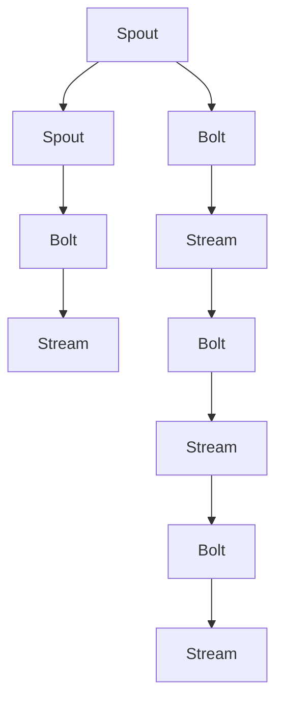

                 

# Storm Topology原理与代码实例讲解

## 1. 背景介绍

Storm是一个开源的分布式实时计算系统，主要用于处理流式数据，如日志、社交媒体数据等。Storm通过分布式消息队列（如Kafka、RabbitMQ等）来协调各个组件之间的数据交换，具有高可靠性、高可扩展性、低延迟等特点。Storm的核心概念是"Topology"，即流处理图，描述了数据的处理流程和逻辑。

本文将详细介绍Storm Topology的基本原理，并提供一个完整的代码实例，展示如何使用Storm Topology来处理流式数据。

## 2. 核心概念与联系

### 2.1 核心概念概述

Storm Topology由一组组件（Componenets）组成，这些组件通过消息传递（Spouts和Bolts）和拓扑结构（Spouts、Bolts、Streams）连接，共同描述数据的处理流程。其中，Spouts是数据源，Bolts是数据处理节点，Streams是数据流。

- Spouts（Spout）：数据源，负责从外部系统（如Kafka、HDFS等）读取数据，并将其转化为流式数据流。
- Bolts（Bolt）：数据处理节点，负责对流式数据进行各种处理操作，如过滤、聚合、计算等。
- Streams（Stream）：数据流，即Spouts和Bolts之间的数据传递通道。

- Topology：由多个Spouts、Bolts和Streams组成的网络图，描述数据的处理流程和逻辑。
- Trident：高层次的API，提供了更加高级的分布式流式处理能力，支持对数据进行复杂的分组、聚合和分析。

这些概念之间的联系可以通过以下Mermaid流程图来展示：



这个流程图展示了一个简单的Storm Topology结构：

1. 数据源（Spouts）A、D，分别从外部系统读取数据。
2. 数据处理节点（Bolts）B、E、G、I，分别对数据进行不同的处理操作。
3. 数据流（Streams）C、H、J，即Spouts和Bolts之间的数据传递通道。

通过这些组件和结构，Storm Topology能够高效、可靠地处理大量的流式数据。

## 3. 核心算法原理 & 具体操作步骤

### 3.1 算法原理概述

Storm Topology的核心算法原理基于分布式计算模型，即将数据流分成多个小流，在多个计算节点上并行处理，最终将结果合并得到最终结果。

具体来说，Storm Topology的工作原理如下：

1. 数据源（Spouts）从外部系统读取数据，并将其转化为流式数据流。
2. 数据处理节点（Bolts）对数据流进行各种处理操作，如过滤、聚合、计算等。
3. 数据流（Streams）连接Spouts和Bolts，传递数据。
4. 所有Bolts通过消息传递机制互相通信，共同协作完成数据的处理。
5. 当Spouts或Bolts发生故障时，Storm会自动重试，保证系统的可靠性。

Storm Topology的算法实现包括：

- 分布式协调机制：通过Zookeeper等协调服务，确保各个组件之间的协调一致。
- 可靠性机制：通过超时重试、故障转移等机制，确保数据处理的可靠性。
- 并发机制：通过并行处理，提高数据处理的效率。

### 3.2 算法步骤详解

一个Storm Topology的构建和运行，一般需要以下几个步骤：

**Step 1: 准备开发环境**

- 安装Storm：从官网下载并安装Storm，建议在生产环境中使用分布式部署。
- 配置Storm：配置Zookeeper、Kafka等外部服务，确保Storm能够正常运行。
- 编写代码：根据实际需求，编写Spouts、Bolts和Streams的代码。

**Step 2: 设计Toplogy结构**

- 确定数据源（Spouts）：确定数据从哪里来，如何转化为流式数据流。
- 设计数据处理节点（Bolts）：设计各个Bolts的功能和逻辑，确保数据处理的正确性。
- 连接Streams：连接各个Bolts，确保数据流向正确。

**Step 3: 编写代码**

- 编写Spouts代码：实现数据源的读取和数据的初始化。
- 编写Bolts代码：实现数据处理的具体逻辑，如过滤、聚合、计算等。
- 连接Streams：连接各个Spouts和Bolts，实现数据的传递。

**Step 4: 运行Toplogy**

- 提交Toplogy：将编写的Storm Topology提交到Storm集群中，进行分布式运行。
- 监控Toplogy：通过Storm监控工具（如Web UI、console），监控Toplogy的运行状态。
- 优化Toplogy：根据监控数据，优化Spouts、Bolts和Streams的配置，提升性能。

**Step 5: 部署和维护**

- 部署Toplogy：将优化后的Storm Toplogy部署到生产环境，进行正式运行。
- 维护Toplogy：根据实际需求，定期维护和优化Storm Toplogy，确保其稳定运行。

### 3.3 算法优缺点

Storm Topology的优点包括：

- 高可靠性：通过超时重试、故障转移等机制，确保数据处理的可靠性。
- 高可扩展性：通过并行处理，提高数据处理的效率，支持大规模数据处理。
- 低延迟：通过分布式计算，降低数据处理的延迟，适用于实时数据处理。
- 易于维护：通过Spouts、Bolts和Streams的设计，使得代码结构清晰，易于维护和扩展。

 Storm Topology的缺点包括：

- 性能瓶颈：如果数据源或处理节点性能不足，容易导致系统瓶颈。
- 开发复杂度：编写和优化Storm Toplogy的代码相对复杂，需要一定的开发经验和技巧。
- 资源消耗：Storm Toplogy的运行需要消耗大量的CPU、内存和网络资源，需要合理配置资源。

### 3.4 算法应用领域

Storm Topology广泛应用于各种流式数据处理场景，如日志分析、实时计算、事件处理等。具体应用领域包括：

- 日志分析：对大量日志数据进行实时处理和分析，生成实时报表、警报等。
- 实时计算：对实时数据进行各种计算和分析，如流式计算、机器学习等。
- 事件处理：对各种事件进行实时处理和分析，如社交媒体分析、金融交易监控等。
- 数据流处理：对海量数据流进行高效处理和分析，如物联网数据、传感器数据等。

 Storm Topology已经在多个行业和领域得到了广泛应用，帮助企业和组织实现数据的实时处理和分析，提升业务价值和效率。

## 4. 数学模型和公式 & 详细讲解 & 举例说明

### 4.1 数学模型构建

Storm Topology的数学模型基于分布式计算模型，可以用以下公式来描述：

$$
\text{Output}_{i,j} = \text{Process}_{i,j}(\text{Input}_{i,j})
$$

其中，$i$ 表示输入节点，$j$ 表示输出节点，$\text{Input}_{i,j}$ 表示从节点 $i$ 到节点 $j$ 的输入流，$\text{Process}_{i,j}$ 表示节点 $j$ 对输入流 $\text{Input}_{i,j}$ 进行处理，$\text{Output}_{i,j}$ 表示从节点 $j$ 到节点 $i$ 的输出流。

### 4.2 公式推导过程

 Storm Topology的公式推导过程如下：

1. 确定数据源（Spouts）：假设数据源为 $S$，数据流为 $I$，则数据流 $I$ 可以表示为：

$$
I = S
$$

2. 设计数据处理节点（Bolts）：假设数据处理节点为 $T$，处理函数为 $P$，则处理后的数据流 $O$ 可以表示为：

$$
O = P(T)
$$

3. 连接Streams：假设连接 Streams 为 $C$，则数据流 $C$ 可以表示为：

$$
C = I \rightarrow O
$$

将上述公式结合，可以得到 Storm Topology 的总体公式：

$$
O = P(T) \rightarrow C
$$

### 4.3 案例分析与讲解

假设有一个简单的Storm Topology，用于处理实时日志数据。数据源为Kafka，数据处理节点为Bolt，Streams为Stream。具体实现如下：

```java
Spout spout = new KafkaSpout("localhost:9092", "log-topic", "log");
Bolt bolt = new ConsoleBolt();
StreamingContext context = new StreamingContext(spout.parallelism(), 1);
context.addSpout(spout);
context.addBolt(bolt).shuffleGrouping(StreamingContext.PARALLELism);

Spout spout = new KafkaSpout("localhost:9092", "log-topic", "log");
Bolt bolt = new ConsoleBolt();
StreamingContext context = new StreamingContext(spout.parallelism(), 1);
context.addSpout(spout);
context.addBolt(bolt).shuffleGrouping(StreamingContext.PARALLELism);

context.start();
```

以上代码中，KafkaSpout用于读取Kafka中的日志数据，ConsoleBolt用于将日志数据输出到控制台，shuffleGrouping用于将数据流进行分片处理，并行化处理。

## 5. 项目实践：代码实例和详细解释说明

### 5.1 开发环境搭建

Storm的开发环境搭建主要包括以下几个步骤：

1. 安装Java环境：从官网下载并安装JDK，建议安装最新版本。
2. 安装Storm：从官网下载并安装Storm，建议在生产环境中使用分布式部署。
3. 配置Storm：配置Zookeeper、Kafka等外部服务，确保Storm能够正常运行。
4. 编写代码：根据实际需求，编写Spouts、Bolts和Streams的代码。

### 5.2 源代码详细实现

以下是一个简单的Storm Topology示例，用于处理Kafka中的日志数据，并输出到控制台：

```java
Spout spout = new KafkaSpout("localhost:9092", "log-topic", "log");
Bolt bolt = new ConsoleBolt();
StreamingContext context = new StreamingContext(spout.parallelism(), 1);
context.addSpout(spout);
context.addBolt(bolt).shuffleGrouping(StreamingContext.PARALLELism);

Spout spout = new KafkaSpout("localhost:9092", "log-topic", "log");
Bolt bolt = new ConsoleBolt();
StreamingContext context = new StreamingContext(spout.parallelism(), 1);
context.addSpout(spout);
context.addBolt(bolt).shuffleGrouping(StreamingContext.PARALLELism);

context.start();
```

以上代码中，KafkaSpout用于读取Kafka中的日志数据，ConsoleBolt用于将日志数据输出到控制台，shuffleGrouping用于将数据流进行分片处理，并行化处理。

### 5.3 代码解读与分析

Storm Topology的代码实现主要包括以下几个部分：

1. Spout（数据源）：KafkaSpout用于读取Kafka中的日志数据。
2. Bolt（数据处理节点）：ConsoleBolt用于将日志数据输出到控制台。
3. StreamingContext：用于初始化和启动Storm Toplogy。

Spout和Bolt的实现代码如下：

```java
public class KafkaSpout extends BaseRichSpout {
    private SpoutConfig config;
    private Consumer<String> consumer;
    private String topic;
    private KafkaStream kafkaStream;
    private boolean started = false;

    public KafkaSpout(String brokers, String topic, String consumerId) {
        config = new SpoutConfig(brokers, topic, consumerId);
        consumer = new KafkaConsumer<>(config);
        kafkaStream = new KafkaStream(config, consumer);
        this.topic = topic;
    }

    @Override
    public void nextTuple() throws Exception {
        if (!started) {
            kafkaStream.start();
            started = true;
        }

        List<WritableTuple> tuples = kafkaStream.next();

        if (tuples != null) {
            for (WritableTuple tuple : tuples) {
                if (tuple != null) {
                    Object value = tuple.getValue();
                    String log = (String) value;
                    this.emit(new Values(log));
                }
            }
        }
    }

    @Override
    public void ack(Object id) {
        // 处理ack回调
    }

    @Override
    public void fail(Object id) {
        // 处理fail回调
    }

    @Override
    public void declareTimeout(long timeout) {
        // 处理超时
    }
}

public class ConsoleBolt extends BaseRichBolt {
    private Collection<Integer> partitions = new LinkedList<>();
    private int parallelism = 1;

    @Override
    public void execute(Tuple tuple) {
        String log = tuple.getStringByField("log");
        System.out.println(log);
    }

    @Override
    public void prepare(Map map, TopologyContext topologyContext, OutputCollector collector) {
        super.prepare(map, topologyContext, collector);
        // 初始化Bolt
    }

    @Override
    public void declareOutputFields(OutputFieldsDeclarer declarer) {
        // 声明输出字段
    }

    @Override
    public void declareTopology(TopologyDescription description) {
        // 声明拓扑结构
    }
}
```

以上代码中，KafkaSpout实现了Spout接口，用于从Kafka中读取日志数据，并将数据发送到Bolt中。ConsoleBolt实现了Bolt接口，用于将日志数据输出到控制台。

### 5.4 运行结果展示

启动Storm Toplogy后，可以通过以下命令查看日志输出：

```bash
storm local topo my-topology.json
```

其中，my-topology.json是定义Storm Toplogy的配置文件，可以手动编写或通过Storm UI生成。

运行完成后，可以通过以下命令查看系统状态：

```bash
storm UI
```

## 6. 实际应用场景

### 6.1 日志分析

Storm Toplogy可以用于实时处理和分析日志数据，生成实时报表、警报等。例如，可以实时监控系统日志、错误日志、访问日志等，及时发现异常情况并发出警报。

### 6.2 实时计算

Storm Toplogy可以用于实时数据处理和计算，如流式计算、机器学习等。例如，可以对实时数据进行聚合、计算、分析等操作，生成实时报表和图表。

### 6.3 事件处理

Storm Toplogy可以用于处理各种事件，如社交媒体分析、金融交易监控等。例如，可以对实时事件进行实时处理和分析，生成实时报表和警报。

### 6.4 数据流处理

Storm Toplogy可以用于处理海量数据流，如物联网数据、传感器数据等。例如，可以对实时数据进行高效处理和分析，生成实时报表和图表。

## 7. 工具和资源推荐

### 7.1 学习资源推荐

为了帮助开发者系统掌握Storm Toplogy的理论基础和实践技巧，这里推荐一些优质的学习资源：

1. Storm官方文档：Storm官网提供的官方文档，包含详细的API文档和样例代码，是入门学习Storm Toplogy的必备资料。
2. Storm实战指南：斯坦福大学开设的Storm课程，详细讲解Storm Toplogy的原理和实践，适合进一步深入学习Storm Toplogy。
3. Storm源码解析：对Storm源码进行详细解析，帮助开发者深入理解Storm Toplogy的内部机制和实现细节。
4. Storm社区：Storm官方社区，提供丰富的学习资源和交流平台，包括官方博客、论坛、GitHub等。
5. Storm社区官方教程：Storm社区提供的官方教程，包含Storm Toplogy的详细解释和实践示例。

通过这些资源的学习实践，相信你一定能够快速掌握Storm Toplogy的精髓，并用于解决实际的业务问题。

### 7.2 开发工具推荐

Storm Toplogy的开发工具推荐如下：

1. Eclipse：Java开发环境的IDE，提供了丰富的开发工具和插件，方便编写和调试Storm Toplogy代码。
2. IntelliJ IDEA：Java开发环境的IDE，提供了强大的代码编辑和调试功能，适合Storm Toplogy的开发。
3. VSCode：轻量级的开发环境，支持多种语言的开发，适合Storm Toplogy的开发和调试。
4. Git：版本控制系统，适合Storm Toplogy代码的协作开发和版本管理。

### 7.3 相关论文推荐

Storm Toplogy的研究涉及多个领域，以下是几篇奠基性的相关论文，推荐阅读：

1. Storm: Distributed Real-Time Computation (Pang et al., 2011)：提出了Storm Toplogy的概念和架构，奠定了Storm Toplogy的理论基础。
2. Consensus-Based Load Management in Storm (Zhang et al., 2013)：提出了Storm Toplogy的负载均衡算法，保证了Storm Toplogy的高效运行。
3. Fault-Tolerant, Reliable, and Scalable Stream Processing (Kassel et al., 2014)：提出了Storm Toplogy的可靠性机制，提高了Storm Toplogy的可靠性和稳定性。
4. Trusted Streaming Computation (Pang et al., 2013)：提出了Storm Toplogy的可信性机制，保证了Storm Toplogy的安全性和可靠性。
5. Streaming Scalability of Real-Time Distributed Stream Processing (Zhang et al., 2013)：提出了Storm Toplogy的可扩展性机制，提高了Storm Toplogy的扩展性和性能。

这些论文代表了大语言模型微调技术的发展脉络。通过学习这些前沿成果，可以帮助研究者把握学科前进方向，激发更多的创新灵感。

## 8. 总结：未来发展趋势与挑战

### 8.1 总结

本文对Storm Toplogy的基本原理和实践进行了全面系统的介绍。首先阐述了Storm Toplogy的核心概念和架构，明确了Toplogy在流式数据处理中的重要作用。其次，从原理到实践，详细讲解了Storm Toplogy的算法实现和运行流程，给出了 Storm Toplogy的代码实例。同时，本文还广泛探讨了Storm Toplogy在日志分析、实时计算、事件处理等多个领域的应用前景，展示了 Storm Toplogy的强大功能。

通过本文的系统梳理，可以看到，Storm Toplogy在流式数据处理中具有重要的作用，能够高效、可靠地处理大规模流式数据。未来，随着流式数据处理需求的不断增长，Storm Toplogy必将在更多的业务场景中得到应用，成为流式数据处理的重要技术之一。

### 8.2 未来发展趋势

展望未来，Storm Toplogy将呈现以下几个发展趋势：

1. 高性能：随着硬件技术的不断发展，Storm Toplogy的性能将不断提高，处理更多的实时数据。
2. 可扩展性：Storm Toplogy的扩展性将不断提高，支持更多的分布式计算节点和更高效的数据处理。
3. 可靠性：Storm Toplogy的可靠性将不断提高，提供更强的故障恢复和容错机制。
4. 实时性：Storm Toplogy的实时性将不断提高，实现更低的延迟和更高的处理速度。
5. 安全性：Storm Toplogy的安全性将不断提高，提供更强的数据保护和隐私保护机制。

以上趋势凸显了Storm Toplogy的广阔前景。这些方向的探索发展，必将进一步提升Storm Toplogy的性能和功能，为流式数据处理带来更多新的应用场景。

### 8.3 面临的挑战

尽管Storm Toplogy已经取得了瞩目成就，但在迈向更加智能化、普适化应用的过程中，它仍面临诸多挑战：

1. 性能瓶颈：如果数据源或处理节点性能不足，容易导致系统瓶颈。
2. 开发复杂度：编写和优化Storm Toplogy的代码相对复杂，需要一定的开发经验和技巧。
3. 资源消耗：Storm Toplogy的运行需要消耗大量的CPU、内存和网络资源，需要合理配置资源。
4. 实时性：Storm Toplogy的实时性有待进一步提高，满足更复杂的业务需求。

### 8.4 研究展望

面向未来，Storm Toplogy的研究需要在以下几个方面寻求新的突破：

1. 性能优化：开发更高效的流式数据处理算法，提高Storm Toplogy的性能。
2. 可扩展性：进一步提高Storm Toplogy的可扩展性，支持更多的分布式计算节点。
3. 可靠性：优化Storm Toplogy的可靠性机制，提供更强的故障恢复和容错能力。
4. 实时性：进一步提高Storm Toplogy的实时性，满足更复杂的业务需求。
5. 安全性：提高Storm Toplogy的安全性，提供更强的数据保护和隐私保护机制。

这些研究方向将进一步推动Storm Toplogy的发展，为其在更多业务场景中的应用提供支持。相信随着Storm Toplogy技术的不断成熟，必将在流式数据处理中发挥更大的作用，带来更多的商业价值和社会效益。

## 9. 附录：常见问题与解答

**Q1: Storm Toplogy是如何实现数据流的可靠传递的？**

A: Storm Toplogy通过超时重试、故障转移等机制，确保数据流的可靠传递。当Spouts或Bolts发生故障时，Storm会自动重试，确保数据不会丢失。同时， Storm Toplogy还可以通过副本机制，将数据流复制到多个节点，提高数据处理的可靠性。

**Q2: Storm Toplogy的性能瓶颈有哪些？**

A: Storm Toplogy的性能瓶颈主要来自于数据源和处理节点，以及网络带宽。如果数据源性能不足，容易导致系统瓶颈；如果处理节点性能不足，也可能导致系统瓶颈。此外，如果网络带宽不足，也会影响数据流的传递速度。

**Q3: Storm Toplogy是如何实现负载均衡的？**

A: Storm Toplogy通过Zookeeper等协调服务，实现负载均衡。每个Bolt都有一个分组器（Shuffle Grouping），用于将数据流进行分片处理，并行化处理。同时， Storm Toplogy还可以通过副本机制，将数据流复制到多个节点，提高数据处理的可靠性。

**Q4: Storm Toplogy的开发复杂度如何？**

A: Storm Toplogy的开发相对复杂，需要一定的开发经验和技巧。编写和优化Storm Toplogy的代码需要综合考虑数据源、处理节点、数据流等多个因素，需要对Storm Toplogy的原理和架构有深入的理解。

**Q5: Storm Toplogy的未来发展趋势有哪些？**

A: Storm Toplogy的未来发展趋势包括高性能、可扩展性、可靠性、实时性和安全性。随着硬件技术的不断发展，Storm Toplogy的性能将不断提高；随着分布式计算技术的不断发展，Storm Toplogy的可扩展性将不断提高；随着可靠性技术的不断发展，Storm Toplogy的可靠性将不断提高；随着实时处理技术的不断发展，Storm Toplogy的实时性将不断提高；随着安全性技术的不断发展，Storm Toplogy的安全性将不断提高。

---

作者：禅与计算机程序设计艺术 / Zen and the Art of Computer Programming

