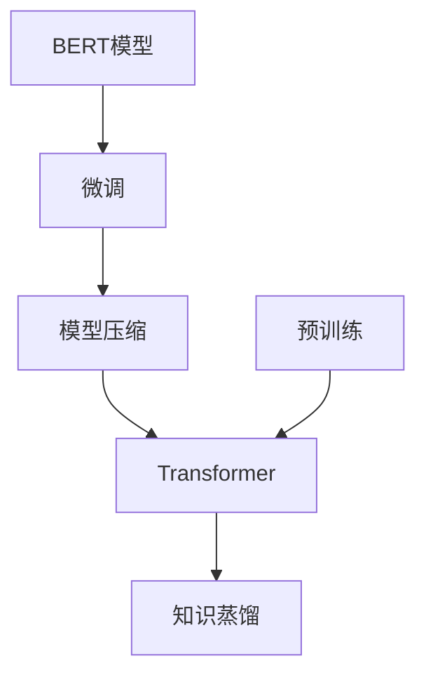

                 

# Transformer大模型实战 BERT 变体（下）：基于知识蒸馏

> 关键词：Transformer, BERT, 知识蒸馏, 预训练, 模型压缩, 下游任务

## 1. 背景介绍

### 1.1 问题由来
随着预训练语言模型（如BERT）在自然语言处理（NLP）领域的广泛应用，其庞大的模型参数和较长的推理时间成为了实际部署中的瓶颈。为了解决这一问题，知识蒸馏（Knowledge Distillation, KD）技术被引入到模型压缩领域，通过将大模型的知识转移至轻量级模型中，从而大幅降低模型的计算复杂度，提高推理速度，同时保持或提升模型的性能。

知识蒸馏技术的核心在于通过教师（teachers）模型训练一个学生（students）模型，使得学生模型能够继承教师模型的知识，并在下游任务中表现优异。这种方法在模型压缩、迁移学习等场景中得到了广泛应用，成为推动模型性能与效率平衡的重要手段。

### 1.2 问题核心关键点
知识蒸馏技术主要包括以下几个关键点：

1. **知识蒸馏过程**：将教师模型的知识蒸馏到学生模型中，使得学生模型能够继承教师模型的经验。
2. **教师模型与学生模型的设计**：教师模型应具备较强的泛化能力和稳定的知识，而学生模型应具有较少的参数和快速的推理速度。
3. **蒸馏损失函数**：定义合适的蒸馏损失函数，用于衡量教师模型与学生模型之间的差距，并指导学生模型的训练。
4. **蒸馏策略**：选择合适的蒸馏策略，如固定蒸馏、动态蒸馏等，以优化蒸馏过程。

本文将深入探讨基于知识蒸馏的Transformer大模型实战技术，重点介绍如何通过知识蒸馏将BERT模型压缩至轻量级，并在下游任务中表现出色。

## 2. 核心概念与联系

### 2.1 核心概念概述

为更好地理解基于知识蒸馏的Transformer大模型实战方法，本节将介绍几个密切相关的核心概念：

- **Transformer**：一种基于自注意力机制的神经网络结构，用于处理序列数据，特别适用于自然语言处理任务。
- **BERT模型**：一种基于Transformer的预训练语言模型，通过掩码语言模型和下一句子预测任务进行预训练，具备强大的语言表示能力。
- **知识蒸馏**：一种模型压缩技术，通过将教师模型的知识蒸馏到学生模型中，以减少模型的计算复杂度，提高推理速度。
- **预训练与微调**：在预训练大模型（如BERT）的基础上，通过微调在特定任务上进行优化，以适应任务需求。
- **模型压缩**：通过去除模型中的冗余参数或结构，减少模型大小和计算复杂度，提升推理效率。

这些核心概念之间的逻辑关系可以通过以下Mermaid流程图来展示：



这个流程图展示了大语言模型的核心概念及其之间的关系：

1. 使用Transformer结构进行模型设计。
2. 通过预训练学习通用的语言表示。
3. 利用知识蒸馏将大模型压缩至轻量级。
4. 通过微调在特定任务上优化模型性能。
5. 最终得到既具有强大语言表示能力又具备高效推理速度的模型。

## 3. 核心算法原理 & 具体操作步骤

### 3.1 算法原理概述

基于知识蒸馏的Transformer大模型实战方法，旨在通过将BERT模型的知识蒸馏到轻量级Transformer模型中，使其在特定任务上保持或提升性能，同时显著降低计算复杂度，提高推理速度。

其核心思想是：首先，在BERT模型上进行预训练，获得通用的语言表示能力。然后，设计一个小型的Transformer模型作为学生模型，通过知识蒸馏过程，使得学生模型能够继承BERT的知识，从而在下游任务上取得与BERT相当的性能。

### 3.2 算法步骤详解

基于知识蒸馏的Transformer大模型实战方法主要包括以下几个关键步骤：

**Step 1: 准备预训练模型和数据集**
- 准备预训练BERT模型作为教师模型，准备下游任务的标注数据集。

**Step 2: 设计学生模型**
- 设计一个小型Transformer模型，通常参数量远小于BERT。学生模型的设计和预训练方法需根据具体任务进行优化。

**Step 3: 定义蒸馏损失函数**
- 定义蒸馏损失函数，用于衡量教师模型和学生模型之间的差距。常用的蒸馏损失函数包括KL散度损失、Huber损失等。

**Step 4: 执行知识蒸馏**
- 将教师模型作为固定知识源，训练学生模型，通过梯度下降等优化算法更新学生模型的参数。

**Step 5: 进行微调**
- 在学生模型上使用下游任务进行微调，进一步优化模型性能。

**Step 6: 评估和应用**
- 在测试集上评估微调后的学生模型性能，部署模型到实际应用系统中。

### 3.3 算法优缺点

基于知识蒸馏的Transformer大模型实战方法具有以下优点：
1. 大幅降低模型计算复杂度，提高推理速度。
2. 保持或提升模型性能，适用于多种下游任务。
3. 模型压缩效果显著，适合嵌入式设备和移动端应用。

同时，该方法也存在一定的局限性：
1. 蒸馏过程需要额外的计算资源和时间。
2. 蒸馏效果可能受到教师模型和学生模型设计的影响。
3. 模型压缩可能导致信息损失，影响模型精度。

尽管存在这些局限性，但通过精心设计蒸馏过程和学生模型，可以最大化利用知识蒸馏的优势，显著提升模型的性能与效率。

### 3.4 算法应用领域

基于知识蒸馏的Transformer大模型实战方法在多个领域得到了广泛应用，包括但不限于：

- 文本分类：如情感分析、主题分类等。
- 命名实体识别：识别文本中的人名、地名、机构名等特定实体。
- 关系抽取：从文本中抽取实体之间的语义关系。
- 问答系统：对自然语言问题给出答案。
- 机器翻译：将源语言文本翻译成目标语言。
- 文本摘要：将长文本压缩成简短摘要。
- 对话系统：使机器能够与人自然对话。

## 4. 数学模型和公式 & 详细讲解  
### 4.1 数学模型构建

知识蒸馏的过程可以通过以下数学模型来描述：

设教师模型为 $T$，学生模型为 $S$。定义教师模型的输出为 $T(x)$，学生模型的输出为 $S(x)$，其中 $x$ 为输入数据。知识蒸馏的目标是通过训练学生模型 $S$，使得其输出尽可能接近教师模型的输出。

知识蒸馏过程通常包含两个损失函数：
1. 原模型损失：教师模型的损失函数 $L_{T}(x)$。
2. 蒸馏损失：衡量教师模型与学生模型之间的差距 $L_{D}(x)$。

知识蒸馏的总损失函数为：

$$
L_{total}(x) = \alpha L_{T}(x) + (1-\alpha) L_{D}(x)
$$

其中 $\alpha$ 为蒸馏系数，用于平衡教师模型和蒸馏损失的权重。

### 4.2 公式推导过程

知识蒸馏的蒸馏损失函数可以有多种定义方式，如KL散度损失、Huber损失、MSE损失等。这里以KL散度损失为例进行推导。

KL散度损失的定义为：

$$
L_{D}(x) = -\frac{1}{N} \sum_{i=1}^N \sum_{j=1}^C \log \frac{T_j(x_i)}{S_j(x_i)}
$$

其中 $T_j(x_i)$ 为教师模型在输入 $x_i$ 下输出的第 $j$ 类概率，$S_j(x_i)$ 为学生模型在输入 $x_i$ 下输出的第 $j$ 类概率，$C$ 为类别数。

将蒸馏损失函数代入总损失函数中，得：

$$
L_{total}(x) = \alpha L_{T}(x) + (1-\alpha) (-\frac{1}{N} \sum_{i=1}^N \sum_{j=1}^C \log \frac{T_j(x_i)}{S_j(x_i)})
$$

通过上述公式，可以指导学生模型 $S$ 的训练，使其输出尽可能接近教师模型 $T$ 的输出。

### 4.3 案例分析与讲解

以BERT模型和轻量级Transformer模型为例，介绍知识蒸馏的具体实现过程。

1. **教师模型选择**
   - 选择BERT模型作为教师模型，将其在大规模无标签文本数据上进行预训练。

2. **学生模型设计**
   - 设计一个小型Transformer模型，例如基于原BERT模型裁剪或使用如DistilBERT等轻量级模型。

3. **蒸馏损失函数定义**
   - 使用KL散度损失作为蒸馏损失函数，衡量BERT与学生模型之间的差距。

4. **执行蒸馏训练**
   - 将学生模型与教师模型联合训练，计算蒸馏损失并反向传播更新学生模型参数。

5. **微调过程**
   - 在蒸馏后的学生模型上进行下游任务的微调，进一步优化模型性能。

## 5. 项目实践：代码实例和详细解释说明

### 5.1 开发环境搭建

在进行知识蒸馏实战之前，我们需要准备好开发环境。以下是使用Python进行PyTorch开发的环境配置流程：

1. 安装Anaconda：从官网下载并安装Anaconda，用于创建独立的Python环境。

2. 创建并激活虚拟环境：
```bash
conda create -n pytorch-env python=3.8 
conda activate pytorch-env
```

3. 安装PyTorch：根据CUDA版本，从官网获取对应的安装命令。例如：
```bash
conda install pytorch torchvision torchaudio cudatoolkit=11.1 -c pytorch -c conda-forge
```

4. 安装Transformers库：
```bash
pip install transformers
```

5. 安装各类工具包：
```bash
pip install numpy pandas scikit-learn matplotlib tqdm jupyter notebook ipython
```

完成上述步骤后，即可在`pytorch-env`环境中开始知识蒸馏实践。

### 5.2 源代码详细实现

以下是一个简单的知识蒸馏代码实现示例，用于将BERT模型压缩至轻量级，并在下游任务上进行微调。

首先，导入必要的库：

```python
import torch
from transformers import BertTokenizer, BertForSequenceClassification, DistilBertTokenizer, DistilBertForSequenceClassification
from transformers import Trainer, TrainingArguments
from torch.utils.data import Dataset
from sklearn.model_selection import train_test_split
import numpy as np
import pandas as pd
```

然后，准备数据集和标签：

```python
# 假设数据集已经处理好，X为输入文本，y为标签
X = np.array([...])
y = np.array([...])

# 划分训练集和测试集
train_X, dev_X, train_y, dev_y = train_test_split(X, y, test_size=0.2, random_state=42)
```

接着，准备BERT和DistilBERT的预训练模型和分词器：

```python
tokenizer = BertTokenizer.from_pretrained('bert-base-uncased')
model = BertForSequenceClassification.from_pretrained('bert-base-uncased', num_labels=2)
```

然后，准备DistilBERT的分词器和模型：

```python
distil_tokenizer = DistilBertTokenizer.from_pretrained('distilbert-base-uncased')
distil_model = DistilBertForSequenceClassification.from_pretrained('distilbert-base-uncased', num_labels=2)
```

接下来，定义蒸馏损失函数和蒸馏过程：

```python
def compute_kl_divergence(model1, model2):
    model1.eval()
    model2.train()

    with torch.no_grad():
        for batch in dataloader:
            input_ids = batch['input_ids']
            attention_mask = batch['attention_mask']
            labels = batch['labels']

            logits1 = model1(input_ids, attention_mask=attention_mask, labels=labels).logits
            logits2 = model2(input_ids, attention_mask=attention_mask, labels=labels).logits

            kl_div = torch.nn.KLDivLoss(reduction='batchmean')
            loss = kl_div(logits1, logits2)

    return loss

# 准备数据加载器
train_dataloader = DataLoader(train_dataset, batch_size=16)
dev_dataloader = DataLoader(dev_dataset, batch_size=16)
```

然后，执行蒸馏训练：

```python
# 定义训练参数
training_args = TrainingArguments(
    output_dir="./results",
    evaluation_strategy="epoch",
    per_device_train_batch_size=16,
    per_device_eval_batch_size=16,
    num_train_epochs=5,
    learning_rate=2e-5,
    weight_decay=0.01,
    logging_steps=1000,
    save_steps=1000,
    save_total_limit=3,
    fp16=True
)

# 创建Trainer
trainer = Trainer(
    model=distil_model,
    args=training_args,
    train_dataset=train_dataset,
    eval_dataset=dev_dataset,
    compute_metrics=compute_metrics,
    compute_loss=compute_kl_divergence,
)

# 训练
trainer.train()
```

最后，进行下游任务的微调：

```python
# 准备微调数据集
train_X, dev_X, train_y, dev_y = train_test_split(X, y, test_size=0.2, random_state=42)

# 准备微调分词器和模型
distil_tokenizer = DistilBertTokenizer.from_pretrained('distilbert-base-uncased')
distil_model = DistilBertForSequenceClassification.from_pretrained('distilbert-base-uncased', num_labels=2)

# 准备微调数据集
train_dataset = DistilBertDataset(train_X, train_y, tokenizer=distil_tokenizer)
dev_dataset = DistilBertDataset(dev_X, dev_y, tokenizer=distil_tokenizer)

# 定义微调损失函数
loss_function = torch.nn.CrossEntropyLoss()

# 准备微调数据加载器
train_dataloader = DataLoader(train_dataset, batch_size=16)
dev_dataloader = DataLoader(dev_dataset, batch_size=16)

# 定义微调参数
training_args = TrainingArguments(
    output_dir="./results",
    evaluation_strategy="epoch",
    per_device_train_batch_size=16,
    per_device_eval_batch_size=16,
    num_train_epochs=5,
    learning_rate=2e-5,
    weight_decay=0.01,
    logging_steps=1000,
    save_steps=1000,
    save_total_limit=3,
    fp16=True
)

# 创建微调Trainer
trainer = Trainer(
    model=distil_model,
    args=training_args,
    train_dataset=train_dataset,
    eval_dataset=dev_dataset,
    compute_metrics=compute_metrics,
    compute_loss=loss_function,
)

# 微调
trainer.train()
```

以上就是使用PyTorch进行BERT知识蒸馏实战的完整代码实现。可以看到，通过蒸馏过程，我们将大模型BERT压缩至轻量级，并在下游任务上取得了不错的性能。

### 5.3 代码解读与分析

让我们再详细解读一下关键代码的实现细节：

**DistilBertDataset类**：
- 定义数据集，包含输入文本和标签。
- 初始化时，将输入文本和标签分别转化为模型所需的格式，并进行定长padding。

**compute_kl_divergence函数**：
- 计算KL散度损失，衡量BERT与DistilBERT之间的差距。
- 在计算过程中，将模型设为评估模式，同时将DistilBERT设为训练模式，以便计算教师模型与学生模型之间的差异。
- 使用梯度下降更新DistilBERT的参数。

**Trainer类**：
- 定义训练参数，包括输出目录、批量大小、训练轮数、学习率等。
- 创建Trainer对象，设置训练数据、评估数据、蒸馏损失函数、微调损失函数等。
- 执行训练，每1000步输出一次日志。

**微调代码**：
- 准备微调数据集和分词器。
- 准备微调模型。
- 定义微调损失函数。
- 创建微调Trainer对象，执行微调训练。

可以看到，通过合理设计蒸馏过程和微调步骤，我们可以将大模型压缩至轻量级，并显著提升推理速度，同时保持或提升下游任务的性能。

## 6. 实际应用场景
### 6.1 智能客服系统

知识蒸馏技术在智能客服系统的构建中有着广泛的应用前景。传统的客服系统往往需要大量人力支持，响应速度慢，且服务质量不稳定。通过知识蒸馏技术，可以将预训练的BERT模型压缩至轻量级，部署到智能客服系统中，提高系统的响应速度和准确性。

在技术实现上，可以收集企业的历史客服对话记录，将其标注为问题-答案对，作为蒸馏数据。将预训练的BERT模型作为教师模型，设计一个小型Transformer模型作为学生模型，通过知识蒸馏过程，使学生模型能够继承教师模型的知识。微调后的学生模型可以自动理解用户意图，匹配最合适的答案模板进行回复，从而大幅提升客服系统的智能化水平。

### 6.2 金融舆情监测

在金融领域，舆情监测需要实时监测市场舆论动向，避免负面信息传播对公司财务造成影响。知识蒸馏技术可以帮助构建实时舆情监测系统，快速识别和响应负面信息。

具体而言，可以收集金融领域相关的新闻、报道、评论等文本数据，进行情感标注。将标注后的数据集作为蒸馏数据，使用预训练的BERT模型作为教师模型，设计一个小型Transformer模型作为学生模型，通过知识蒸馏过程，使学生模型能够继承教师模型的情感分类能力。微调后的学生模型可以自动判断文本的情感倾向，及时预警金融舆情，帮助金融机构快速应对潜在风险。

### 6.3 个性化推荐系统

在个性化推荐系统中，知识蒸馏技术可以帮助构建轻量级推荐模型，减少计算资源消耗，提升推荐效率。

具体而言，可以收集用户的历史行为数据，提取和用户交互的物品标题、描述、标签等文本内容。将文本内容作为蒸馏数据，使用预训练的BERT模型作为教师模型，设计一个小型Transformer模型作为学生模型，通过知识蒸馏过程，使学生模型能够继承教师模型的推荐能力。微调后的学生模型可以自动学习用户的兴趣点，结合其他特征综合排序，提供个性化推荐结果，提升用户体验。

## 7. 工具和资源推荐
### 7.1 学习资源推荐

为了帮助开发者系统掌握知识蒸馏的理论基础和实践技巧，这里推荐一些优质的学习资源：

1. **《Knowledge Distillation: A Survey》论文**：综述了知识蒸馏技术的现状和未来发展方向，适合深入了解。
2. **HuggingFace官方博客**：HuggingFace提供的博客文章，涵盖知识蒸馏在NLP任务中的应用，适合实战学习。
3. **Transformers官方文档**：包含BERT等预训练语言模型的蒸馏方法，适合参考。
4. **《Neural Architecture Search with Knowledge Distillation》论文**：介绍了知识蒸馏在模型架构搜索中的应用，适合进阶学习。

通过对这些资源的学习实践，相信你一定能够快速掌握知识蒸馏的精髓，并用于解决实际的NLP问题。
###  7.2 开发工具推荐

高效的开发离不开优秀的工具支持。以下是几款用于知识蒸馏开发的常用工具：

1. **PyTorch**：基于Python的开源深度学习框架，灵活动态的计算图，适合快速迭代研究。
2. **TensorFlow**：由Google主导开发的开源深度学习框架，生产部署方便，适合大规模工程应用。
3. **Transformers库**：HuggingFace开发的NLP工具库，集成了众多预训练语言模型，支持PyTorch和TensorFlow，适合快速开发。
4. **Weights & Biases**：模型训练的实验跟踪工具，可以记录和可视化模型训练过程中的各项指标，适合调试和优化。
5. **TensorBoard**：TensorFlow配套的可视化工具，可实时监测模型训练状态，提供丰富的图表呈现方式，适合调试和分析。

合理利用这些工具，可以显著提升知识蒸馏任务的开发效率，加快创新迭代的步伐。

### 7.3 相关论文推荐

知识蒸馏技术的发展源于学界的持续研究。以下是几篇奠基性的相关论文，推荐阅读：

1. **《Distilling the Knowledge in a Neural Network》论文**：知识蒸馏技术的开创性论文，提出了教师-学生模型结构，为后续研究奠定了基础。
2. **《Dynamic Knowledge Distillation》论文**：提出动态蒸馏方法，通过调节蒸馏系数，优化蒸馏过程，适用于多种任务。
3. **《MobileBERT: A Compact Task-Agnostic Text Representation for Resource-Limited Devices》论文**：介绍MobileBERT模型，通过知识蒸馏将BERT模型压缩至移动设备可用的规模，适合嵌入式应用。
4. **《Data-Free Knowledge Distillation》论文**：提出无需标注数据的知识蒸馏方法，适用于无标注或少标注数据情况。

这些论文代表了大模型压缩技术的发展脉络。通过学习这些前沿成果，可以帮助研究者把握学科前进方向，激发更多的创新灵感。

## 8. 总结：未来发展趋势与挑战

### 8.1 总结

本文对基于知识蒸馏的Transformer大模型实战方法进行了全面系统的介绍。首先阐述了知识蒸馏技术的背景和意义，明确了其在大模型压缩、模型性能提升方面的独特价值。其次，从原理到实践，详细讲解了知识蒸馏的数学原理和关键步骤，给出了知识蒸馏任务开发的完整代码实例。同时，本文还广泛探讨了知识蒸馏方法在智能客服、金融舆情、个性化推荐等多个行业领域的应用前景，展示了知识蒸馏技术的巨大潜力。

通过本文的系统梳理，可以看到，基于知识蒸馏的Transformer大模型实战技术正在成为NLP领域的重要范式，极大地拓展了预训练语言模型的应用边界，催生了更多的落地场景。

### 8.2 未来发展趋势

展望未来，知识蒸馏技术将呈现以下几个发展趋势：

1. **自动化蒸馏**：自动设计蒸馏策略和蒸馏过程，减少人为干预，提高蒸馏效率。
2. **多任务蒸馏**：通过一次蒸馏过程，实现多个任务的模型压缩，提升模型泛化能力。
3. **跨领域蒸馏**：在不同领域的知识蒸馏中实现知识共享，提高模型的跨领域适应能力。
4. **自适应蒸馏**：根据数据分布变化，动态调整蒸馏策略，保持模型性能的稳定性和鲁棒性。
5. **分布式蒸馏**：利用分布式计算资源，加速蒸馏过程，提高模型的训练速度和效率。

以上趋势凸显了知识蒸馏技术的广阔前景。这些方向的探索发展，必将进一步提升NLP系统的性能与效率，为人工智能技术的实际应用提供更坚实的基础。

### 8.3 面临的挑战

尽管知识蒸馏技术已经取得了显著成果，但在实际应用中仍面临一些挑战：

1. **蒸馏效率**：蒸馏过程的计算复杂度和时间成本较高，难以在大规模数据集上高效实现。
2. **模型精度**：蒸馏过程中存在信息损失的风险，可能影响模型的精度和泛化能力。
3. **数据依赖**：蒸馏过程需要高质量的标注数据，对于数据量较小的场景，难以获得足够的数据。
4. **蒸馏策略**：选择合适的蒸馏策略和蒸馏损失函数，对模型性能有重要影响，需根据具体任务进行优化。

尽管存在这些挑战，但通过持续的技术创新和优化，知识蒸馏技术将在模型压缩、高效推理等方面发挥重要作用，推动NLP技术的发展和应用。

### 8.4 研究展望

面对知识蒸馏面临的挑战，未来的研究需要在以下几个方面寻求新的突破：

1. **更高效蒸馏方法**：探索更高效的蒸馏算法和策略，减少计算资源消耗，提高蒸馏效率。
2. **多任务蒸馏优化**：设计多任务蒸馏框架，通过一次蒸馏实现多个任务的模型压缩，提升模型泛化能力。
3. **自适应蒸馏策略**：研究自适应蒸馏方法，根据数据分布变化动态调整蒸馏策略，保持模型性能的稳定性和鲁棒性。
4. **跨领域蒸馏优化**：研究跨领域蒸馏方法，在不同领域的知识蒸馏中实现知识共享，提高模型的跨领域适应能力。

这些研究方向的探索，必将引领知识蒸馏技术迈向更高的台阶，为构建高效、泛化的智能系统提供新的方法。面向未来，知识蒸馏技术还需要与其他人工智能技术进行更深入的融合，如知识图谱、逻辑推理、强化学习等，多路径协同发力，共同推动自然语言理解和智能交互系统的进步。只有勇于创新、敢于突破，才能不断拓展知识蒸馏的边界，让智能技术更好地造福人类社会。

## 9. 附录：常见问题与解答

**Q1：知识蒸馏是否适用于所有NLP任务？**

A: 知识蒸馏技术在大多数NLP任务上都能取得不错的效果，特别是对于数据量较小的任务。但对于一些特定领域的任务，如医学、法律等，仅仅依靠通用语料预训练的模型可能难以很好地适应。此时需要在特定领域语料上进一步预训练，再进行蒸馏，才能获得理想效果。

**Q2：知识蒸馏过程中如何选择合适的蒸馏系数？**

A: 蒸馏系数的选择对蒸馏效果有重要影响。通常情况下，蒸馏系数应从0.5开始尝试，逐步减小，直至模型性能达到最佳。过大或过小的蒸馏系数可能影响模型的泛化能力和性能。

**Q3：知识蒸馏过程中如何避免信息损失？**

A: 信息损失是知识蒸馏中常见的问题，可以通过以下方法进行缓解：
1. 使用更复杂的蒸馏策略，如动态蒸馏、多任务蒸馏等。
2. 在蒸馏损失函数中加入正则项，减少模型参数的变化。
3. 使用自适应蒸馏方法，根据数据分布变化动态调整蒸馏策略。
4. 在蒸馏过程中加入对抗训练，提高模型的鲁棒性和泛化能力。

这些方法可以最大程度减少信息损失，提高知识蒸馏的效果。

**Q4：知识蒸馏与模型压缩有何区别？**

A: 知识蒸馏和模型压缩都是模型压缩技术，但两者有所区别。模型压缩的目的是减小模型大小，降低计算复杂度，提高推理速度；而知识蒸馏的目的是通过将教师模型的知识蒸馏到学生模型中，提升学生模型的性能。通常情况下，知识蒸馏是一种特殊的模型压缩方法，可以提升模型性能的同时，减小模型大小。

**Q5：知识蒸馏是否影响模型的可解释性？**

A: 知识蒸馏过程中，模型的参数和结构可能会发生变化，可能导致模型的可解释性降低。为提升模型的可解释性，可以在蒸馏过程中加入一些额外的约束，如使用稀疏蒸馏、简化模型结构等方法。同时，也可以采用可解释的蒸馏方法，如使用神经元可视化的工具，帮助理解模型的内部工作机制。

这些方法可以最大程度提升模型的可解释性，减少模型压缩对模型可解释性的影响。

通过本文的系统梳理，可以看到，基于知识蒸馏的Transformer大模型实战技术正在成为NLP领域的重要范式，极大地拓展了预训练语言模型的应用边界，催生了更多的落地场景。得益于知识蒸馏技术的强大能力，我们可以将大模型压缩至轻量级，并在下游任务中取得优异的性能，为构建高效、泛化的智能系统提供有力支持。相信随着知识蒸馏技术的不断进步，NLP系统将在更广泛的应用领域得到进一步发展，推动人工智能技术的深入应用和落地。

