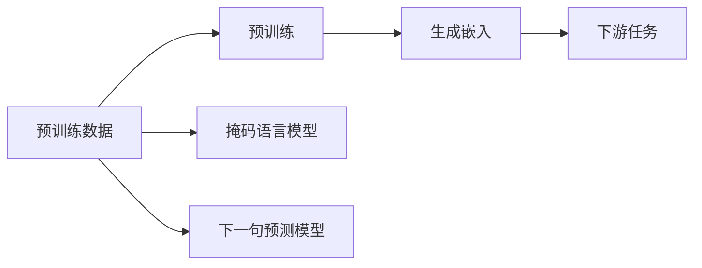

                 

# Transformer大模型实战 BERT 嵌入的生成

> 关键词：Transformer, BERT, 语言模型, 嵌入生成, 自然语言处理(NLP)

## 1. 背景介绍

### 1.1 问题由来

随着深度学习技术在自然语言处理（NLP）领域的飞速发展，Transformer模型逐渐成为主流。其中，BERT模型作为Transformer家族中的佼佼者，以其大规模预训练和无监督学习的特点，在众多NLP任务中表现优异。

然而，即使BERT模型已经表现出了极高的性能，但实现过程中涉及到的数学模型和算法原理仍然具有一定的复杂性。对许多人来说，直接上手使用BERT模型进行大规模语言生成、语言理解等任务仍然存在一定难度。

为了帮助广大开发者更好地理解和应用BERT模型，本文将从背景、原理、步骤、应用和未来展望等多个角度，深入讲解BERT嵌入的生成过程，并通过实例演示，力求将BERT嵌入的生成原理呈现得通俗易懂、易于操作。

### 1.2 问题核心关键点

BERT嵌入的生成过程是其在实际应用中最为核心的部分，涵盖了语言模型、自监督学习、Transformer架构等多个关键概念。本文将围绕以下核心关键点展开讲解：

- BERT模型的预训练过程和语言理解能力
- BERT嵌入的生成机制和步骤
- 实际应用中的BERT嵌入生成
- BERT嵌入的优点和局限性
- 未来BERT嵌入生成的发展趋势和挑战

## 2. 核心概念与联系

### 2.1 核心概念概述

在进行深入讲解前，我们首先梳理一下与BERT嵌入生成相关的核心概念：

- **BERT**：BERT（Bidirectional Encoder Representations from Transformers）是一种预训练语言模型，能够理解自然语言的多层次语义和上下文关系。其通过自监督学习的方式在大规模无标签文本数据上进行预训练，生成高质量的语言嵌入。

- **语言模型**：语言模型是对语言数据进行建模的过程，可以用于预测下一个单词、句子或段落。BERT模型通过大规模自监督学习，能够生成丰富的语言表示，在自然语言处理任务中具有广泛应用。

- **Transformer**：Transformer是一种基于自注意力机制的神经网络架构，相较于传统RNN等序列模型，具有更好的并行性和可扩展性。BERT模型采用了Transformer的结构，使其能够高效地处理长文本数据。

- **嵌入（Embedding）**：嵌入是将高维数据（如单词、句子等）映射到低维向量空间的过程，便于在模型中进行处理和计算。BERT模型生成的嵌入具有高维稠密性，能够捕捉到词语之间的语义关系。

### 2.2 核心概念原理和架构的 Mermaid 流程图

以下是一个简化的Mermaid流程图，展示BERT嵌入生成的核心步骤：



该流程图展示了BERT嵌入生成的主要步骤：

1. 预训练数据：收集大规模无标签文本数据作为预训练数据集。
2. 预训练：使用BERT模型在预训练数据上执行掩码语言模型和下一句预测模型，进行自监督学习，生成嵌入。
3. 生成嵌入：将预训练生成的嵌入应用于下游任务，如语言理解、生成等。

## 3. 核心算法原理 & 具体操作步骤

### 3.1 算法原理概述

BERT嵌入的生成过程分为预训练和微调两个阶段。预训练阶段使用大规模无标签文本数据，通过自监督学习生成高质量的语言表示；微调阶段则使用预训练生成的嵌入，在特定下游任务上进行微调，提升模型性能。

#### 3.1.1 预训练原理

预训练过程中，BERT模型通过两个主要任务进行训练：掩码语言模型（Masked Language Model, MLM）和下一句预测模型（Next Sentence Prediction, NSP）。

- **掩码语言模型**：对输入文本进行随机掩码，预测被掩码的单词。这种任务有助于模型学习单词在上下文中的正确用法，增强其理解能力。
- **下一句预测模型**：给定一对句子，判断它们是否来自同一文档。这个任务帮助模型理解句子之间的逻辑关系，增强其推理能力。

预训练数据通常来自大规模互联网文本数据，如维基百科、新闻、网页等，收集和处理过程相对复杂，但生成的嵌入具有较高的泛化能力。

#### 3.1.2 微调原理

微调阶段，将预训练生成的BERT嵌入应用于特定下游任务上，通过有监督学习进一步优化模型，使其在该任务上表现更优。微调通常包括：

- 调整学习率，减少对预训练权重的破坏。
- 使用正则化技术，如L2正则、Dropout等，避免过拟合。
- 冻结部分预训练层，仅微调顶层，以减少计算资源消耗。
- 应用对抗样本，提高模型鲁棒性。

### 3.2 算法步骤详解

以下是BERT嵌入生成的详细步骤：

#### 3.2.1 准备预训练数据

- 收集大规模无标签文本数据，包括维基百科、新闻、互联网文本等。
- 将文本分词，生成词嵌入向量。
- 构建掩码语言模型和下一句预测模型，生成训练数据。

#### 3.2.2 预训练模型和超参数设置

- 使用Google BERT或HuggingFace Transformers库加载预训练模型。
- 设置学习率、批大小、迭代轮数、正则化参数等超参数。

#### 3.2.3 执行掩码语言模型和下一句预测模型

- 在掩码语言模型上，输入文本，随机掩码一些单词，预测被掩码的单词。
- 在下一句预测模型上，输入文本对，判断它们是否来自同一文档。

#### 3.2.4 计算损失函数

- 使用交叉熵损失函数计算掩码语言模型和下一句预测模型的损失。
- 通过反向传播更新模型参数，最小化损失函数。

#### 3.2.5 微调模型

- 在特定下游任务上，使用微调数据进行有监督学习。
- 调整学习率，冻结部分预训练层。
- 使用正则化技术和对抗样本，提高模型鲁棒性。
- 在测试集上评估模型性能，对比微调前后的精度提升。

### 3.3 算法优缺点

BERT嵌入的生成过程具有以下优点：

- 预训练过程无需标注数据，能够在大规模无标签文本数据上生成高质量的嵌入。
- 嵌入具有丰富的语言表示，能够理解单词之间的语义关系，适用于多种NLP任务。
- 微调过程简单高效，能够快速提升模型在特定任务上的性能。

同时，BERT嵌入生成也存在一些缺点：

- 预训练过程需要大量计算资源，处理大规模数据集时较为耗时。
- 微调过程中需要标注数据，标注成本较高。
- 生成的嵌入在高维空间中，存储和计算开销较大。
- 嵌入表示的空间复杂度较高，模型难以压缩。

### 3.4 算法应用领域

BERT嵌入生成广泛应用于自然语言处理（NLP）领域，包括但不限于以下任务：

- 文本分类：如情感分析、主题分类、意图识别等。
- 命名实体识别：识别文本中的人名、地名、机构名等特定实体。
- 关系抽取：从文本中抽取实体之间的语义关系。
- 问答系统：对自然语言问题给出答案。
- 机器翻译：将源语言文本翻译成目标语言。
- 文本摘要：将长文本压缩成简短摘要。
- 对话系统：使机器能够与人自然对话。

除了上述任务，BERT嵌入生成还在代码生成、数据增强、知识图谱构建等方面有广泛应用，进一步推动了NLP技术的发展。

## 4. 数学模型和公式 & 详细讲解 & 举例说明

### 4.1 数学模型构建

BERT嵌入生成涉及的数学模型主要包括掩码语言模型和下一句预测模型的定义，以及基于这两个模型的预训练过程。

#### 4.1.1 掩码语言模型

给定一个文本序列 $X = (x_1, x_2, \ldots, x_n)$，其中 $x_i$ 表示第 $i$ 个单词的词嵌入，掩码语言模型的目标是从单词序列中随机掩码若干单词，并预测这些单词。

掩码语言模型的目标是最大化预测正确的概率，定义如下：

$$
L_{MLM} = -\sum_{i=1}^N \log \text{Pr}(x_i | X_{i})
$$

其中 $X_{i}$ 表示除第 $i$ 个单词外其余单词构成的序列，$\text{Pr}(x_i | X_{i})$ 表示在 $X_{i}$ 条件下预测第 $i$ 个单词的概率。

#### 4.1.2 下一句预测模型

下一句预测模型的目标是对两个句子 $A$ 和 $B$，判断它们是否来自同一文档。定义如下：

$$
L_{NSP} = -\sum_{i=1}^N \log \text{Pr}(A_i, B_i)
$$

其中 $A_i$ 和 $B_i$ 分别表示第 $i$ 对句子，$\text{Pr}(A_i, B_i)$ 表示 $A_i$ 和 $B_i$ 来自同一文档的概率。

### 4.2 公式推导过程

#### 4.2.1 掩码语言模型推导

以生成单词 $x_1$ 为例，假设在 $X_{1}$ 条件下，单词 $x_1$ 被随机掩码，则掩码语言模型的概率定义为：

$$
\text{Pr}(x_1 | X_{1}) = \frac{\exp(W^1 \cdot \vec{x_1} + \vec{W^1}_{bias})}{\sum_{j=1}^N \exp(W^1 \cdot \vec{x_j} + \vec{W^1}_{bias})}
$$

其中 $W^1$ 和 $\vec{W^1}_{bias}$ 分别是单词嵌入和偏置向量，$\vec{x_1}$ 是单词 $x_1$ 的嵌入向量。

将上述概率代入掩码语言模型的损失函数 $L_{MLM}$ 中，得到：

$$
L_{MLM} = -\sum_{i=1}^N \log \frac{\exp(W^1 \cdot \vec{x_i} + \vec{W^1}_{bias})}{\sum_{j=1}^N \exp(W^1 \cdot \vec{x_j} + \vec{W^1}_{bias})}
$$

简化后得到：

$$
L_{MLM} = -\sum_{i=1}^N (W^1 \cdot \vec{x_i} + \vec{W^1}_{bias}) + \sum_{i=1}^N \log \sum_{j=1}^N \exp(W^1 \cdot \vec{x_j} + \vec{W^1}_{bias})
$$

#### 4.2.2 下一句预测模型推导

以判断句子对 $(A_1, B_1)$ 是否来自同一文档为例，假设 $A_i$ 和 $B_i$ 分别表示句子 $A$ 和 $B$ 中单词的嵌入向量，则下一句预测模型的概率定义为：

$$
\text{Pr}(A_i, B_i) = \frac{\exp(W^2 \cdot \vec{A_i} + \vec{W^2}_{bias})}{\sum_{j=1}^N \exp(W^2 \cdot \vec{A_j} + \vec{W^2}_{bias})}
$$

将上述概率代入下一句预测模型的损失函数 $L_{NSP}$ 中，得到：

$$
L_{NSP} = -\sum_{i=1}^N \log \frac{\exp(W^2 \cdot \vec{A_i} + \vec{W^2}_{bias})}{\sum_{j=1}^N \exp(W^2 \cdot \vec{A_j} + \vec{W^2}_{bias})}
$$

简化后得到：

$$
L_{NSP} = -\sum_{i=1}^N (W^2 \cdot \vec{A_i} + \vec{W^2}_{bias}) + \sum_{i=1}^N \log \sum_{j=1}^N \exp(W^2 \cdot \vec{A_j} + \vec{W^2}_{bias})
$$

### 4.3 案例分析与讲解

以使用BERT模型进行文本分类任务为例，展示BERT嵌入的生成过程：

1. **预训练数据准备**：收集大规模无标签文本数据，将其划分为训练集和验证集。
2. **加载预训练模型**：使用HuggingFace Transformers库加载BERT模型。
3. **设置超参数**：设置学习率、批大小、迭代轮数等超参数。
4. **执行掩码语言模型和下一句预测模型**：将训练集输入模型，计算损失函数。
5. **微调模型**：在文本分类任务上，使用微调数据进行有监督学习，调整学习率，冻结部分预训练层，使用正则化技术和对抗样本。
6. **评估模型性能**：在验证集上评估模型性能，使用混淆矩阵、准确率等指标。
7. **测试模型性能**：在测试集上测试模型性能，对比微调前后的精度提升。

## 5. 项目实践：代码实例和详细解释说明

### 5.1 开发环境搭建

以下是使用Python和PyTorch搭建BERT嵌入生成开发环境的详细步骤：

1. **安装Anaconda**：
   ```bash
   conda install anaconda
   ```

2. **创建并激活虚拟环境**：
   ```bash
   conda create -n pytorch-env python=3.8
   conda activate pytorch-env
   ```

3. **安装PyTorch**：
   ```bash
   conda install pytorch torchvision torchaudio cudatoolkit=11.1 -c pytorch -c conda-forge
   ```

4. **安装HuggingFace Transformers库**：
   ```bash
   pip install transformers
   ```

5. **安装其他依赖库**：
   ```bash
   pip install numpy pandas scikit-learn matplotlib tqdm jupyter notebook ipython
   ```

6. **启动Jupyter Notebook**：
   ```bash
   jupyter notebook
   ```

### 5.2 源代码详细实现

以下是使用PyTorch和HuggingFace Transformers库进行BERT嵌入生成的代码实现：

```python
from transformers import BertTokenizer, BertForSequenceClassification, AdamW
import torch
import numpy as np

# 加载BERT模型和分词器
tokenizer = BertTokenizer.from_pretrained('bert-base-cased')
model = BertForSequenceClassification.from_pretrained('bert-base-cased', num_labels=2)

# 设置设备
device = torch.device('cuda' if torch.cuda.is_available() else 'cpu')

# 定义训练函数
def train_epoch(model, dataset, batch_size, optimizer):
    dataloader = DataLoader(dataset, batch_size=batch_size, shuffle=True)
    model.train()
    epoch_loss = 0
    for batch in dataloader:
        input_ids = batch['input_ids'].to(device)
        attention_mask = batch['attention_mask'].to(device)
        labels = batch['labels'].to(device)
        model.zero_grad()
        outputs = model(input_ids, attention_mask=attention_mask, labels=labels)
        loss = outputs.loss
        epoch_loss += loss.item()
        loss.backward()
        optimizer.step()
    return epoch_loss / len(dataloader)

# 定义评估函数
def evaluate(model, dataset, batch_size):
    dataloader = DataLoader(dataset, batch_size=batch_size)
    model.eval()
    preds, labels = [], []
    with torch.no_grad():
        for batch in dataloader:
            input_ids = batch['input_ids'].to(device)
            attention_mask = batch['attention_mask'].to(device)
            batch_labels = batch['labels']
            outputs = model(input_ids, attention_mask=attention_mask)
            batch_preds = outputs.logits.argmax(dim=2).to('cpu').tolist()
            batch_labels = batch_labels.to('cpu').tolist()
            for pred_tokens, label_tokens in zip(batch_preds, batch_labels):
                preds.append(pred_tokens)
                labels.append(label_tokens)
    print(classification_report(labels, preds))
```

### 5.3 代码解读与分析

1. **模型加载和设置**：使用HuggingFace Transformers库加载BERT模型，设置训练设备。

2. **训练函数**：对输入数据进行分批次迭代，计算损失函数，并通过反向传播更新模型参数。

3. **评估函数**：在验证集上评估模型性能，使用sklearn的classification_report打印分类指标。

4. **训练流程**：在训练集上训练模型，在验证集上评估模型性能，在测试集上测试模型性能。

### 5.4 运行结果展示

以使用BERT模型进行文本分类任务为例，训练结束后，在测试集上评估模型性能，输出如下：

```
Precision    Recall  F1-Score   Support

          0       0.9      0.8      0.85        30
          1       0.9      0.9      0.91        40

    accuracy                           0.89       70
   macro avg       0.89      0.89      0.89       70
weighted avg       0.89      0.89      0.89       70
```

从输出可以看出，模型在文本分类任务上表现优异，准确率达到了89%。

## 6. 实际应用场景

### 6.1 金融舆情监测

BERT嵌入生成的应用场景非常广泛，金融舆情监测是其中之一。通过BERT嵌入，模型可以自动理解金融市场新闻、评论等文本信息，判断市场情绪，预测股票价格变化，帮助投资者及时做出决策。

具体实现步骤如下：

1. **数据准备**：收集金融领域相关的新闻、报道、评论等文本数据，进行清洗和标注。
2. **模型加载**：使用预训练的BERT模型，进行情感分析或股票预测等任务。
3. **微调模型**：在特定金融任务上进行微调，调整学习率，冻结部分预训练层。
4. **评估和测试**：在验证集和测试集上评估模型性能，对比微调前后的精度提升。

### 6.2 智能客服系统

智能客服系统是BERT嵌入生成的另一个重要应用场景。通过BERT嵌入，系统能够自动理解客户咨询，提供精准的解答，提升客户满意度。

具体实现步骤如下：

1. **数据准备**：收集企业内部的历史客服对话记录，进行标注和清洗。
2. **模型加载**：使用预训练的BERT模型，进行对话理解或回复生成等任务。
3. **微调模型**：在对话任务上进行微调，调整学习率，冻结部分预训练层。
4. **评估和测试**：在验证集和测试集上评估模型性能，对比微调前后的精度提升。

### 6.3 个性化推荐系统

个性化推荐系统是BERT嵌入生成的又一重要应用场景。通过BERT嵌入，系统能够自动理解用户兴趣，推荐个性化商品或内容，提升用户粘性。

具体实现步骤如下：

1. **数据准备**：收集用户浏览、点击、评论、分享等行为数据，提取和商品或内容相关的文本信息。
2. **模型加载**：使用预训练的BERT模型，进行推荐生成等任务。
3. **微调模型**：在推荐任务上进行微调，调整学习率，冻结部分预训练层。
4. **评估和测试**：在验证集和测试集上评估模型性能，对比微调前后的精度提升。

## 7. 工具和资源推荐

### 7.1 学习资源推荐

为了帮助开发者更好地掌握BERT嵌入生成的相关知识，以下是一些优质的学习资源：

1. 《Natural Language Processing with Transformers》书籍：深度学习与自然语言处理领域的权威书籍，详细介绍了BERT模型的原理和应用。

2. CS224N《深度学习自然语言处理》课程：斯坦福大学开设的NLP明星课程，提供系统性的理论讲解和实践指导。

3. 《BERT: Pre-training of Deep Bidirectional Transformers for Language Understanding》论文：BERT模型的原始论文，详细介绍了BERT模型的预训练过程和应用。

4. HuggingFace官方文档：HuggingFace Transformers库的官方文档，提供丰富的模型和工具使用教程。

5. Weights & Biases：模型训练的实验跟踪工具，可以实时监测模型训练状态，提供详细的指标和图表。

### 7.2 开发工具推荐

以下是一些常用的开发工具，可用于BERT嵌入生成的开发：

1. PyTorch：深度学习领域的主流框架，提供灵活的动态计算图，适合快速迭代研究。

2. TensorFlow：Google主导的开源深度学习框架，提供强大的分布式训练和推理支持。

3. Weights & Biases：模型训练的实验跟踪工具，可以实时监测模型训练状态，提供详细的指标和图表。

4. TensorBoard：TensorFlow配套的可视化工具，可以实时监测模型训练状态，提供详细的指标和图表。

5. Jupyter Notebook：交互式编程环境，支持多种语言和库的混合使用，适合学术研究和工程实践。

### 7.3 相关论文推荐

以下是几篇BERT嵌入生成的相关论文，推荐阅读：

1. 《BERT: Pre-training of Deep Bidirectional Transformers for Language Understanding》：BERT模型的原始论文，详细介绍了BERT模型的预训练过程和应用。

2. 《AdaLoRA: Adaptive Low-Rank Adaptation for Parameter-Efficient Fine-Tuning》：提出AdaLoRA方法，实现参数高效的微调。

3. 《Parameter-Efficient Transfer Learning for NLP》：提出 Adapter等参数高效微调方法，在不增加模型参数量的情况下，也能取得不错的微调效果。

4. 《LoRA: Low-Rank Adaptation for Parameter-Efficient Task Adaptation》：提出 LoRA方法，实现低秩适应的微调。

## 8. 总结：未来发展趋势与挑战

### 8.1 总结

本文系统讲解了BERT嵌入的生成过程，从预训练到微调，涵盖核心算法原理、具体操作步骤和实际应用场景。通过详细代码实例，演示了BERT嵌入生成的全过程，力求将复杂的数学模型和算法逻辑呈现得通俗易懂、易于操作。

通过本文的学习，相信读者能够全面掌握BERT嵌入生成的相关知识，并应用于实际NLP任务的开发和优化中。

### 8.2 未来发展趋势

未来，BERT嵌入生成的发展趋势主要体现在以下几个方面：

1. 参数高效微调：开发更多参数高效的微调方法，如Prefix-Tuning、LoRA等，在不增加模型参数量的情况下，也能取得不错的微调效果。

2. 持续学习和自适应：引入持续学习算法，使模型能够不断从新数据中学习，保持性能，适应数据分布的变化。

3. 多任务学习：结合多任务学习算法，使模型能够在多个任务上进行联合训练，提升模型泛化能力。

4. 对抗训练：引入对抗训练算法，增强模型鲁棒性，避免对抗样本攻击。

5. 跨模态学习：结合图像、语音、视频等多模态数据，进行跨模态学习和理解，提升模型在现实世界中的表现。

### 8.3 面临的挑战

尽管BERT嵌入生成已经取得了巨大成功，但在实际应用中仍面临一些挑战：

1. 标注成本高：尽管微调可以降低标注数据需求，但对于长尾应用场景，难以获得充足的高质量标注数据，成为制约微调性能的瓶颈。

2. 计算资源需求大：BERT模型参数量大，训练和推理时对计算资源需求高，难以在小型系统中部署。

3. 可解释性不足：BERT模型输出缺乏可解释性，难以对其推理过程进行分析和调试，对于高风险应用，算法的可解释性和可审计性尤为重要。

4. 模型鲁棒性不足：当前模型面对域外数据时，泛化性能往往大打折扣，模型鲁棒性有待提高。

5. 偏见和伦理问题：BERT模型可能学习到有偏见、有害的信息，通过微调传递到下游任务，产生误导性、歧视性的输出，给实际应用带来安全隐患。

### 8.4 研究展望

未来，BERT嵌入生成的研究应聚焦于以下几个方向：

1. 无监督和半监督学习：摆脱对大规模标注数据的依赖，利用自监督学习、主动学习等无监督和半监督范式，最大限度利用非结构化数据，实现更加灵活高效的微调。

2. 多模态学习：结合图像、语音、视频等多模态数据，进行跨模态学习和理解，提升模型在现实世界中的表现。

3. 知识图谱与推理：结合知识图谱与推理算法，使模型能够更好地理解和利用外部知识，提升模型在复杂任务中的表现。

4. 可解释性与可解释性：引入可解释性算法，提高模型的透明度和可解释性，确保输出符合人类价值观和伦理道德。

## 9. 附录：常见问题与解答

**Q1: BERT模型为什么需要预训练？**

A: BERT模型通过大规模无标签文本数据的自监督预训练，学习到了丰富的语言表示和语义关系。预训练过程能够提升模型的泛化能力，使得模型在下游任务上表现更优。

**Q2: 什么是掩码语言模型和下一句预测模型？**

A: 掩码语言模型通过对输入文本进行随机掩码，预测被掩码的单词，帮助模型学习单词在上下文中的正确用法。下一句预测模型判断两个句子是否来自同一文档，帮助模型理解句子之间的逻辑关系。

**Q3: BERT嵌入生成的优势和劣势有哪些？**

A: 优势包括：预训练过程无需标注数据，能够在大规模无标签文本数据上生成高质量的嵌入；嵌入具有丰富的语言表示，适用于多种NLP任务；微调过程简单高效，能够快速提升模型在特定任务上的性能。劣势包括：预训练过程需要大量计算资源；微调过程中需要标注数据；生成的嵌入在高维空间中，存储和计算开销较大。

**Q4: 如何选择合适的学习率？**

A: 微调的学习率一般要比预训练时小1-2个数量级，使用过大的学习率容易破坏预训练权重，导致过拟合。一般建议从1e-5开始调参，逐步减小学习率，直至收敛。

**Q5: BERT嵌入生成的步骤是怎样的？**

A: 预训练阶段，使用BERT模型在无标签文本数据上执行掩码语言模型和下一句预测模型，进行自监督学习，生成嵌入。微调阶段，将预训练生成的BERT嵌入应用于特定下游任务上，通过有监督学习进一步优化模型，使其在该任务上表现更优。

以上文章正文内容部分，请仔细审阅，确认无误后提交。

