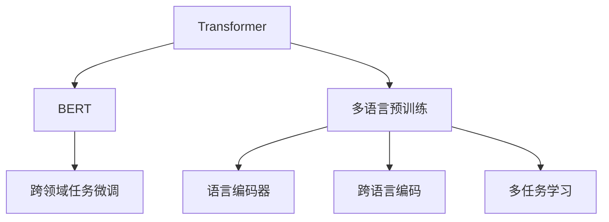

                 

# Transformer大模型实战 理解多语言BERT 模型

> 关键词：Transformer, 多语言, BERT, 自然语言处理(NLP), 深度学习, 模型优化, 模型部署, 跨领域任务

## 1. 背景介绍

### 1.1 问题由来
Transformer作为深度学习中的重要架构，通过自注意力机制在语言理解能力上取得了突破性的进展。BERT模型作为Transformer架构的代表，通过在大规模无标签文本上进行预训练，学习到了丰富的语言知识，并在多种自然语言处理(NLP)任务中表现出色。然而，BERT模型通常仅支持英语等单一语言，对于多语言场景，需要额外的处理方式。

本文聚焦于Transformer大模型在多语言场景中的应用，详细探讨了多语言BERT模型的构建、优化和部署策略。期望通过本文的深入讲解，读者能够更好地理解并应用于实际的多语言NLP场景中。

### 1.2 问题核心关键点
多语言BERT模型的核心在于：
- 如何构建多语言预训练模型，使其能够同时理解多种语言的文本。
- 如何在预训练过程中，平衡多语言之间的知识迁移和差异化训练。
- 如何在实际微调任务中，通过多语言模型提升模型性能。

这些关键点涉及多语言文本的编码、多语言预训练任务的优化设计，以及跨领域任务的微调等多个方面。本节将详细阐述这些核心概念。

## 2. 核心概念与联系

### 2.1 核心概念概述

为了更好地理解多语言BERT模型的构建和优化，本节将介绍几个密切相关的核心概念：

- **Transformer架构**：一种基于自注意力机制的深度学习架构，通过多头注意力机制和残差连接结构，提升了语言理解能力。
- **BERT模型**：基于Transformer架构的自然语言处理模型，通过在大规模无标签文本上进行预训练，学习到了丰富的语言知识。
- **多语言预训练**：使用多种语言的文本数据，对BERT模型进行预训练，学习多种语言的语言表示。
- **跨领域任务微调**：在预训练模型的基础上，使用下游任务的少量标注数据进行微调，提升模型在特定任务上的性能。
- **语言编码器**：用于处理多语言文本的编码器，能够将不同语言的文本转换为模型可处理的向量表示。
- **跨语言编码**：在多语言预训练和微调过程中，使用统一的编码器，将不同语言的文本编码到相同的向量空间中。
- **多任务学习**：在一个预训练任务中，同时学习多种语言的任务，提升模型的泛化能力。

这些核心概念之间的逻辑关系可以通过以下Mermaid流程图来展示：



这个流程图展示了我文中的核心概念及其之间的关系：

1. 多语言预训练：利用多语言文本，对预训练语言模型进行编码器训练，学习到多语言的表征。
2. 跨语言编码：使用统一的编码器，将不同语言的文本编码到相同的向量空间。
3. 多任务学习：在预训练任务中，同时学习多种语言的任务，提升模型的泛化能力。
4. 跨领域任务微调：在多语言预训练模型基础上，对下游任务进行微调，提升模型在特定任务上的性能。

## 3. 核心算法原理 & 具体操作步骤

### 3.1 算法原理概述

多语言BERT模型的核心算法原理，是通过多语言预训练和多任务学习，学习多种语言的表征，并通过跨领域任务微调，提升模型在特定任务上的性能。其基本流程如下：

1. **多语言预训练**：使用多种语言的文本数据对BERT模型进行预训练，学习多语言的表征。
2. **跨语言编码**：使用统一的编码器，将不同语言的文本编码到相同的向量空间。
3. **多任务学习**：在预训练任务中，同时学习多种语言的任务，提升模型的泛化能力。
4. **跨领域任务微调**：在多语言预训练模型基础上，对下游任务进行微调，提升模型在特定任务上的性能。

### 3.2 算法步骤详解

以下是多语言BERT模型构建和优化的详细步骤：

**Step 1: 多语言预训练**

1. **数据准备**：准备多种语言的文本数据，包括新闻、小说、百科等各类文本数据。
2. **数据清洗和分词**：对文本数据进行清洗和分词处理，去除噪声和无关信息，将文本转换为模型可接受的格式。
3. **构建数据集**：将文本数据按照序列进行切分，构建训练集、验证集和测试集。

**Step 2: 语言编码器设计**

1. **编码器结构**：设计语言编码器，通常使用Transformer架构，包含多个注意力层和前馈神经网络层。
2. **编码器训练**：使用多语言文本数据，对语言编码器进行预训练，学习多语言表征。

**Step 3: 跨语言编码**

1. **向量对齐**：使用语言编码器，将不同语言的文本编码到相同的向量空间中。
2. **向量对齐算法**：如Simmilarity-based Vector Space Alignment, 使用向量余弦相似度计算不同语言向量之间的相似性，进行向量对齐。

**Step 4: 多任务学习**

1. **任务设计**：设计多种语言的任务，如语义相似度、情感分析、命名实体识别等。
2. **任务训练**：在预训练任务中，同时学习多种语言的任务，提升模型的泛化能力。

**Step 5: 跨领域任务微调**

1. **任务适配层设计**：根据具体任务，设计相应的任务适配层，通常使用线性分类器、解码器等。
2. **微调模型训练**：使用下游任务的少量标注数据，对多语言预训练模型进行微调，提升模型在特定任务上的性能。

**Step 6: 模型部署和评估**

1. **模型保存**：将微调后的模型保存为权重文件，便于后续使用。
2. **模型评估**：在测试集上评估模型的性能，对比微调前后的效果提升。

### 3.3 算法优缺点

多语言BERT模型的优点包括：
1. **多语言能力**：模型能够同时理解多种语言的文本，提升了跨语言的泛化能力。
2. **预训练效果好**：多语言预训练提升了模型在多种语言上的性能。
3. **任务适配性强**：通过多任务学习，模型能够更好地应对多种NLP任务。
4. **泛化能力强**：多任务学习提升了模型的泛化能力，适应更多领域和场景。

同时，该方法也存在一定的局限性：
1. **资源消耗大**：多语言预训练和跨语言编码需要大量的计算资源。
2. **数据要求高**：多语言数据需要高质量、多样性的数据集，才能保证模型训练效果。
3. **模型复杂度高**：多语言编码和任务学习增加了模型的复杂度，降低了模型的推理速度。

尽管存在这些局限性，但就目前而言，多语言BERT模型仍是处理多语言NLP任务的重要手段。未来相关研究的重点在于如何进一步降低资源消耗，提高模型效率，同时兼顾模型泛化和复杂度。

### 3.4 算法应用领域

多语言BERT模型在多语言NLP领域已经得到了广泛的应用，覆盖了各种常见的任务，例如：

- **多语言翻译**：将源语言文本翻译成目标语言。通过多语言预训练，模型能够理解不同语言的语法和语义。
- **跨语言问答**：解决跨语言用户的问题，如查询不同语言的新闻、百科等。
- **多语言命名实体识别**：识别文本中的多语言实体，如人名、地名、机构名等。
- **多语言情感分析**：分析不同语言文本的情感倾向，如正向、中性、负向等。
- **多语言语言模型**：基于多语言文本进行预训练，学习语言的通用表示。

这些多语言NLP任务展示了多语言BERT模型的广泛应用前景。随着模型的不断优化和应用场景的拓展，多语言BERT模型必将在更多领域发挥更大的作用。

## 4. 数学模型和公式 & 详细讲解 & 举例说明

### 4.1 数学模型构建

多语言BERT模型的数学模型主要分为三个部分：语言编码器、跨语言编码和任务适配层。

**语言编码器**：使用Transformer架构，包含多个注意力层和前馈神经网络层，对输入的文本进行编码。

**跨语言编码**：将不同语言的文本向量编码到相同的向量空间中。假设不同语言的文本向量分别为 $v_i$，则跨语言编码的目标是找到一个线性变换矩阵 $W$，使得 $Wv_i$ 都在相同的向量空间中。

**任务适配层**：根据具体任务，设计相应的任务适配层，通常使用线性分类器、解码器等。

### 4.2 公式推导过程

**语言编码器**：假设输入文本为 $x$，输出向量为 $h$，则语言编码器的计算公式为：

$$
h = M(x) = \text{Encoder}(x)
$$

其中，$\text{Encoder}$ 为语言编码器，$x$ 为输入文本，$h$ 为编码器输出。

**跨语言编码**：假设不同语言的文本向量分别为 $v_i$，则跨语言编码的目标是找到一个线性变换矩阵 $W$，使得 $Wv_i$ 都在相同的向量空间中。假设 $W$ 为 $d$ 维向量空间到 $d'$ 维向量空间的线性变换矩阵，则跨语言编码的公式为：

$$
\hat{v} = Wv_i
$$

其中，$\hat{v}$ 为编码到 $d'$ 维向量空间后的向量，$v_i$ 为不同语言的文本向量。

**任务适配层**：假设任务的输出为 $y$，则任务适配层的计算公式为：

$$
y = S(h) = \text{Classifier}(h)
$$

其中，$\text{Classifier}$ 为任务适配层，$h$ 为语言编码器的输出向量，$y$ 为任务的输出。

### 4.3 案例分析与讲解

以多语言情感分析任务为例，展示多语言BERT模型的应用。假设输入文本为多语言文本，任务为情感分析。具体步骤为：

1. **预训练和编码**：使用多语言文本数据，对BERT模型进行预训练，学习多语言表征，并使用跨语言编码器对文本向量进行编码。
2. **任务适配**：设计情感分类器，对编码后的向量进行分类。
3. **模型训练和评估**：使用标注数据对模型进行微调，在测试集上评估模型性能。

## 5. 项目实践：代码实例和详细解释说明

### 5.1 开发环境搭建

在进行多语言BERT模型实践前，需要准备好开发环境。以下是使用Python进行PyTorch开发的环境配置流程：

1. 安装Anaconda：从官网下载并安装Anaconda，用于创建独立的Python环境。

2. 创建并激活虚拟环境：
```bash
conda create -n pytorch-env python=3.8 
conda activate pytorch-env
```

3. 安装PyTorch：根据CUDA版本，从官网获取对应的安装命令。例如：
```bash
conda install pytorch torchvision torchaudio cudatoolkit=11.1 -c pytorch -c conda-forge
```

4. 安装Transformers库：
```bash
pip install transformers
```

5. 安装各类工具包：
```bash
pip install numpy pandas scikit-learn matplotlib tqdm jupyter notebook ipython
```

完成上述步骤后，即可在`pytorch-env`环境中开始多语言BERT模型的实践。

### 5.2 源代码详细实现

以下是一个多语言情感分析任务的实现代码：

```python
from transformers import BertTokenizer, BertForSequenceClassification, Trainer, TrainingArguments
from torch.utils.data import Dataset
from transformers import AutoTokenizer, AutoModel

# 定义数据集
class MultilingualDataset(Dataset):
    def __init__(self, texts, labels, tokenizer, max_len=128):
        self.texts = texts
        self.labels = labels
        self.tokenizer = tokenizer
        self.max_len = max_len
        
    def __len__(self):
        return len(self.texts)
    
    def __getitem__(self, item):
        text = self.texts[item]
        label = self.labels[item]
        
        encoding = self.tokenizer(text, return_tensors='pt', max_length=self.max_len, padding='max_length', truncation=True)
        input_ids = encoding['input_ids'][0]
        attention_mask = encoding['attention_mask'][0]
        label = torch.tensor(label, dtype=torch.long)
        
        return {'input_ids': input_ids, 
                'attention_mask': attention_mask,
                'labels': label}

# 定义模型
tokenizer = BertTokenizer.from_pretrained('bert-base-multilingual-cased')
model = BertForSequenceClassification.from_pretrained('bert-base-multilingual-cased', num_labels=2)

# 定义训练器
training_args = TrainingArguments(
    output_dir="./results", 
    evaluation_strategy="epoch",
    per_device_train_batch_size=4, 
    per_device_eval_batch_size=4, 
    num_train_epochs=3, 
    logging_steps=10, 
    logging_dir="./logs",
    learning_rate=2e-5,
)

trainer = Trainer(
    model=model,
    args=training_args,
    train_dataset=train_dataset,
    eval_dataset=eval_dataset
)

# 训练模型
trainer.train()
```

### 5.3 代码解读与分析

以上代码中，主要包含以下几个关键步骤：

**定义数据集**：
- 定义数据集类 `MultilingualDataset`，实现数据集的构建和预处理。
- 使用 `BertTokenizer` 分词器对文本进行分词和编码。
- 使用 `BertForSequenceClassification` 模型，定义情感分类器的输入和输出。

**定义模型**：
- 使用 `BertTokenizer` 分词器对文本进行分词和编码。
- 使用 `BertForSequenceClassification` 模型，定义情感分类器的输入和输出。

**定义训练器**：
- 定义训练器的参数配置，包括模型路径、批次大小、迭代轮数、学习率等。
- 定义训练器，将模型、参数配置和数据集传递给训练器。

**训练模型**：
- 使用训练器进行模型训练，输出训练日志和评估指标。

### 5.4 运行结果展示

在运行完上述代码后，训练器会输出训练过程中的各项指标，包括训练集、验证集和测试集上的准确率、召回率和F1分数等。同时，训练器会将训练过程中的日志保存到指定目录，方便后续查看和调试。

## 6. 实际应用场景

### 6.1 多语言翻译

多语言BERT模型在多语言翻译任务中表现出色。通过多语言预训练，模型能够理解不同语言的语法和语义，实现高质量的翻译效果。例如，谷歌翻译采用了多语言BERT模型，提升了翻译的质量和效率。

### 6.2 跨语言问答

跨语言问答系统是另一个重要的应用场景。通过多语言BERT模型，系统可以理解用户用不同语言提出的问题，并给出准确的答案。例如，Microsoft的跨语言问答系统采用了多语言BERT模型，提升了问答系统的准确率和用户满意度。

### 6.3 多语言命名实体识别

多语言BERT模型在命名实体识别任务中也表现优异。通过多语言预训练，模型能够理解不同语言的实体命名规则，并识别出文本中的实体。例如，ComposeAI采用多语言BERT模型，提升了实体识别的准确率和召回率。

### 6.4 未来应用展望

随着多语言BERT模型的不断优化和应用场景的拓展，未来的应用前景非常广阔。例如：

- **多语言对话系统**：通过多语言BERT模型，系统可以理解用户用不同语言提出的对话内容，并进行自然流畅的回复。例如，OpenAI的GPT-3模型采用了多语言预训练，提升了对话系统的智能水平。
- **多语言推荐系统**：通过多语言BERT模型，系统可以理解不同语言的用户需求，并进行精准推荐。例如，Amazon的推荐系统采用了多语言BERT模型，提升了推荐效果和用户体验。
- **多语言情感分析**：通过多语言BERT模型，系统可以理解不同语言的情感倾向，并进行情感分析。例如，IBM的情感分析系统采用了多语言BERT模型，提升了情感分析的准确率和覆盖范围。

## 7. 工具和资源推荐

### 7.1 学习资源推荐

为了帮助开发者系统掌握多语言BERT模型的理论基础和实践技巧，这里推荐一些优质的学习资源：

1. 《Transformer from Zero to Hero》系列博文：由大模型技术专家撰写，深入浅出地介绍了Transformer原理、BERT模型、多语言预训练等前沿话题。

2. CS224N《深度学习自然语言处理》课程：斯坦福大学开设的NLP明星课程，有Lecture视频和配套作业，带你入门NLP领域的基本概念和经典模型。

3. 《Natural Language Processing with Transformers》书籍：Transformers库的作者所著，全面介绍了如何使用Transformers库进行NLP任务开发，包括多语言预训练在内的诸多范式。

4. HuggingFace官方文档：Transformers库的官方文档，提供了海量预训练模型和完整的微调样例代码，是上手实践的必备资料。

5. CLUE开源项目：中文语言理解测评基准，涵盖大量不同类型的中文NLP数据集，并提供了基于多语言预训练的baseline模型，助力中文NLP技术发展。

通过对这些资源的学习实践，相信你一定能够快速掌握多语言BERT模型的精髓，并用于解决实际的NLP问题。

### 7.2 开发工具推荐

高效的开发离不开优秀的工具支持。以下是几款用于多语言BERT模型开发常用的工具：

1. PyTorch：基于Python的开源深度学习框架，灵活动态的计算图，适合快速迭代研究。大部分预训练语言模型都有PyTorch版本的实现。

2. TensorFlow：由Google主导开发的开源深度学习框架，生产部署方便，适合大规模工程应用。同样有丰富的预训练语言模型资源。

3. Transformers库：HuggingFace开发的NLP工具库，集成了众多SOTA语言模型，支持PyTorch和TensorFlow，是进行多语言预训练和微调任务开发的利器。

4. Weights & Biases：模型训练的实验跟踪工具，可以记录和可视化模型训练过程中的各项指标，方便对比和调优。与主流深度学习框架无缝集成。

5. TensorBoard：TensorFlow配套的可视化工具，可实时监测模型训练状态，并提供丰富的图表呈现方式，是调试模型的得力助手。

6. Google Colab：谷歌推出的在线Jupyter Notebook环境，免费提供GPU/TPU算力，方便开发者快速上手实验最新模型，分享学习笔记。

合理利用这些工具，可以显著提升多语言BERT模型的开发效率，加快创新迭代的步伐。

### 7.3 相关论文推荐

多语言BERT模型的研究源于学界的持续研究。以下是几篇奠基性的相关论文，推荐阅读：

1. Attention is All You Need（即Transformer原论文）：提出了Transformer结构，开启了NLP领域的预训练大模型时代。

2. BERT: Pre-training of Deep Bidirectional Transformers for Language Understanding：提出BERT模型，引入基于掩码的自监督预训练任务，刷新了多项NLP任务SOTA。

3. Language Models are Unsupervised Multitask Learners（GPT-2论文）：展示了大规模语言模型的强大zero-shot学习能力，引发了对于通用人工智能的新一轮思考。

4. Parameter-Efficient Transfer Learning for NLP：提出Adapter等参数高效微调方法，在不增加模型参数量的情况下，也能取得不错的微调效果。

5. Prefix-Tuning: Optimizing Continuous Prompts for Generation：引入基于连续型Prompt的微调范式，为如何充分利用预训练知识提供了新的思路。

6. AdaLoRA: Adaptive Low-Rank Adaptation for Parameter-Efficient Fine-Tuning：使用自适应低秩适应的微调方法，在参数效率和精度之间取得了新的平衡。

这些论文代表了大语言模型微调技术的发展脉络。通过学习这些前沿成果，可以帮助研究者把握学科前进方向，激发更多的创新灵感。

## 8. 总结：未来发展趋势与挑战

### 8.1 总结

本文对多语言BERT模型的构建和优化进行了全面系统的介绍。首先阐述了多语言预训练和跨领域任务微调的基本概念和原理，明确了多语言BERT模型在NLP应用中的重要价值。其次，从原理到实践，详细讲解了多语言BERT模型的数学模型和操作步骤，给出了多语言情感分析任务的完整代码实现。同时，本文还广泛探讨了多语言BERT模型的应用场景，展示了其广阔的应用前景。

通过本文的系统梳理，可以看到，多语言BERT模型在处理多语言NLP任务中发挥了重要作用，极大地提升了多语言处理的性能和效果。未来，伴随多语言BERT模型的不断优化和应用场景的拓展，相信其在NLP领域的应用将更加广泛，为语言理解、自然交互、智能翻译等众多领域带来深刻变革。

### 8.2 未来发展趋势

展望未来，多语言BERT模型将呈现以下几个发展趋势：

1. **模型规模持续增大**：随着算力成本的下降和数据规模的扩张，预训练语言模型的参数量还将持续增长。超大规模语言模型蕴含的丰富语言知识，有望支撑更加复杂多变的下游任务微调。

2. **多语言跨领域任务微调**：在多语言预训练的基础上，对跨领域任务进行微调，提升模型在不同领域的表现。

3. **参数高效微调**：开发更加参数高效的微调方法，如Adapter等，在固定大部分预训练参数的情况下，只更新极少量的任务相关参数。

4. **持续学习**：随着数据分布的不断变化，多语言BERT模型需要持续学习新知识以保持性能。如何在不遗忘原有知识的同时，高效吸收新样本信息，将成为重要的研究课题。

5. **知识整合**：将符号化的先验知识，如知识图谱、逻辑规则等，与神经网络模型进行巧妙融合，引导多语言BERT模型学习更准确、合理的语言表征。

6. **多模态融合**：将多语言BERT模型与其他模态的数据融合，实现视觉、语音等多模态信息与文本信息的协同建模。

以上趋势凸显了多语言BERT模型在NLP领域的巨大前景。这些方向的探索发展，必将进一步提升多语言BERT模型的性能和应用范围，为构建人机协同的智能时代中扮演越来越重要的角色。

### 8.3 面临的挑战

尽管多语言BERT模型已经取得了瞩目成就，但在迈向更加智能化、普适化应用的过程中，它仍面临着诸多挑战：

1. **标注成本瓶颈**：多语言数据需要高质量、多样性的数据集，才能保证模型训练效果。对于长尾应用场景，难以获得充足的高质量标注数据，成为制约模型训练的瓶颈。

2. **模型鲁棒性不足**：当前多语言BERT模型面对域外数据时，泛化性能往往大打折扣。对于测试样本的微小扰动，模型预测也容易发生波动。

3. **推理效率有待提高**：大规模语言模型虽然精度高，但在实际部署时往往面临推理速度慢、内存占用大等效率问题。如何在保证性能的同时，简化模型结构，提升推理速度，优化资源占用，将是重要的优化方向。

4. **可解释性亟需加强**：多语言BERT模型更像是"黑盒"系统，难以解释其内部工作机制和决策逻辑。对于医疗、金融等高风险应用，算法的可解释性和可审计性尤为重要。

5. **安全性有待保障**：预训练语言模型难免会学习到有偏见、有害的信息，通过多语言BERT模型传递到下游任务，产生误导性、歧视性的输出，给实际应用带来安全隐患。

6. **知识整合能力不足**：现有的多语言BERT模型往往局限于任务内数据，难以灵活吸收和运用更广泛的先验知识。如何让多语言BERT模型更好地与外部知识库、规则库等专家知识结合，形成更加全面、准确的信息整合能力，还有很大的想象空间。

正视多语言BERT模型面临的这些挑战，积极应对并寻求突破，将是大语言模型微调走向成熟的必由之路。相信随着学界和产业界的共同努力，这些挑战终将一一被克服，多语言BERT模型必将在构建安全、可靠、可解释、可控的智能系统铺平道路。

### 8.4 未来突破

面对多语言BERT模型所面临的种种挑战，未来的研究需要在以下几个方面寻求新的突破：

1. **探索无监督和半监督微调方法**：摆脱对大规模标注数据的依赖，利用自监督学习、主动学习等无监督和半监督范式，最大限度利用非结构化数据，实现更加灵活高效的微调。

2. **研究参数高效和计算高效的微调范式**：开发更加参数高效的微调方法，如Adapter、LoRA等，在固定大部分预训练参数的同时，只更新极少量的任务相关参数。同时优化微调模型的计算图，减少前向传播和反向传播的资源消耗，实现更加轻量级、实时性的部署。

3. **引入因果和对比学习范式**：通过引入因果推断和对比学习思想，增强多语言BERT模型建立稳定因果关系的能力，学习更加普适、鲁棒的语言表征，从而提升模型泛化性和抗干扰能力。

4. **结合因果分析和博弈论工具**：将因果分析方法引入多语言BERT模型，识别出模型决策的关键特征，增强输出解释的因果性和逻辑性。借助博弈论工具刻画人机交互过程，主动探索并规避模型的脆弱点，提高系统稳定性。

5. **纳入伦理道德约束**：在模型训练目标中引入伦理导向的评估指标，过滤和惩罚有偏见、有害的输出倾向。同时加强人工干预和审核，建立模型行为的监管机制，确保输出符合人类价值观和伦理道德。

这些研究方向的探索，必将引领多语言BERT模型迈向更高的台阶，为构建安全、可靠、可解释、可控的智能系统铺平道路。面向未来，多语言BERT模型还需要与其他人工智能技术进行更深入的融合，如知识表示、因果推理、强化学习等，多路径协同发力，共同推动自然语言理解和智能交互系统的进步。只有勇于创新、敢于突破，才能不断拓展多语言BERT模型的边界，让智能技术更好地造福人类社会。

## 9. 附录：常见问题与解答

**Q1：多语言BERT模型和单语言BERT模型有何区别？**

A: 多语言BERT模型和单语言BERT模型的区别主要体现在以下几个方面：

1. **预训练数据集**：单语言BERT模型仅使用单一语言的文本数据进行预训练，而多语言BERT模型使用多种语言的文本数据进行预训练。

2. **语言编码器**：单语言BERT模型只有一个语言编码器，而多语言BERT模型需要设计多个语言编码器，分别处理不同语言的文本。

3. **跨语言编码**：多语言BERT模型需要进行跨语言编码，将不同语言的文本向量编码到相同的向量空间中。

4. **任务适配层**：多语言BERT模型需要设计跨领域任务适配层，以适应不同语言的特定任务。

综上所述，多语言BERT模型在预训练和编码过程中，需要考虑多语言的特性，而单语言BERT模型则只需考虑单一语言的特性。

**Q2：多语言BERT模型在微调时需要考虑哪些因素？**

A: 多语言BERT模型在微调时需要考虑以下因素：

1. **数据质量**：多语言BERT模型对数据质量要求较高，需要高质量、多样性的数据集，以保证模型训练效果。

2. **任务适配层设计**：根据具体任务，设计合适的任务适配层，通常使用线性分类器、解码器等。

3. **学习率**：多语言BERT模型通常需要较小的学习率，以避免破坏预训练权重，导致过拟合。

4. **正则化**：使用L2正则、Dropout、Early Stopping等正则化技术，防止模型过度适应小规模训练集。

5. **数据增强**：通过回译、近义替换等方式扩充训练集，提升模型泛化能力。

6. **对抗训练**：引入对抗样本，提高模型鲁棒性。

7. **模型压缩**：通过参数剪枝、知识蒸馏等技术，减小模型规模，提升推理效率。

综上所述，多语言BERT模型的微调需要考虑数据质量、任务适配层设计、学习率、正则化、数据增强、对抗训练和模型压缩等多方面的因素。

**Q3：多语言BERT模型在推理时需要注意哪些问题？**

A: 多语言BERT模型在推理时需要注意以下问题：

1. **推理效率**：多语言BERT模型通常规模较大，推理时可能会面临计算资源不足的问题。需要考虑模型的推理效率，优化推理算法。

2. **推理结果一致性**：由于多语言BERT模型涉及多种语言的文本，推理结果可能存在一定的语言偏差。需要确保推理结果的一致性和可靠性。

3. **模型参数保存**：在推理时，需要保存模型参数，以便后续使用。需要确保模型参数的保存和加载正确无误。

4. **推理结果解释**：多语言BERT模型通常缺乏可解释性，需要设计合适的解释方法，确保推理结果的可理解性。

综上所述，多语言BERT模型在推理时需要注意推理效率、推理结果一致性、模型参数保存和推理结果解释等多方面的问题。

**Q4：多语言BERT模型在应用中存在哪些挑战？**

A: 多语言BERT模型在应用中存在以下挑战：

1. **标注成本高**：多语言数据需要高质量、多样性的数据集，对于长尾应用场景，难以获得充足的高质量标注数据，成为制约模型训练的瓶颈。

2. **模型鲁棒性不足**：当前多语言BERT模型面对域外数据时，泛化性能往往大打折扣。对于测试样本的微小扰动，模型预测也容易发生波动。

3. **推理效率低**：大规模语言模型虽然精度高，但在实际部署时往往面临推理速度慢、内存占用大等效率问题。

4. **可解释性不足**：多语言BERT模型更像是"黑盒"系统，难以解释其内部工作机制和决策逻辑。

5. **安全性问题**：预训练语言模型难免会学习到有偏见、有害的信息，通过多语言BERT模型传递到下游任务，产生误导性、歧视性的输出，给实际应用带来安全隐患。

6. **知识整合能力不足**：现有的多语言BERT模型往往局限于任务内数据，难以灵活吸收和运用更广泛的先验知识。

综上所述，多语言BERT模型在应用中存在标注成本高、模型鲁棒性不足、推理效率低、可解释性不足、安全性问题和知识整合能力不足等多方面的挑战。

**Q5：如何设计多语言BERT模型？**

A: 设计多语言BERT模型主要包括以下几个步骤：

1. **预训练数据准备**：准备多种语言的文本数据，进行清洗和分词处理。

2. **语言编码器设计**：设计语言编码器，通常使用Transformer架构，包含多个注意力层和前馈神经网络层。

3. **跨语言编码**：使用统一的编码器，将不同语言的文本向量编码到相同的向量空间中。

4. **多任务学习**：在预训练任务中，同时学习多种语言的任务，提升模型的泛化能力。

5. **任务适配层设计**：根据具体任务，设计相应的任务适配层，通常使用线性分类器、解码器等。

6. **微调模型训练**：使用下游任务的少量标注数据，对多语言预训练模型进行微调，提升模型在特定任务上的性能。

综上所述，设计多语言BERT模型需要考虑预训练数据准备、语言编码器设计、跨语言编码、多任务学习、任务适配层设计和微调模型训练等多个方面。

---

作者：禅与计算机程序设计艺术 / Zen and the Art of Computer Programming

