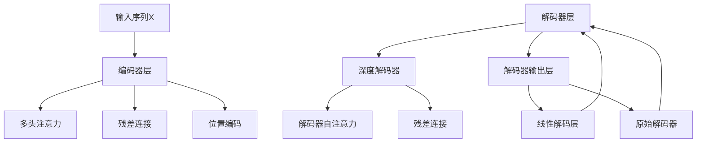

                 

# Transformer大模型实战 自注意力机制

> 关键词：Transformer, 自注意力机制, 大模型, 深度学习, 神经网络, 自然语言处理

## 1. 背景介绍

### 1.1 问题由来

在过去几十年里，深度学习在图像识别、语音识别和自然语言处理(NLP)等任务上取得了突破性进展。然而，传统的卷积神经网络(CNN)和循环神经网络(RNN)在处理序列数据时存在局限性：CNN在序列结构建模上能力不足，而RNN在处理长序列时存在梯度消失和梯度爆炸问题。

Transformer模型由Vaswani等人提出，采用了自注意力机制，成功解决了这些问题，在多项NLP任务上取得了SOTA（state-of-the-art）性能。Transformer模型成为现代深度学习的重要里程碑，特别是在自然语言处理领域。

### 1.2 问题核心关键点

Transformer模型通过自注意力机制，实现了更加高效和灵活的序列建模。其核心思想是：在计算每个位置上的表示时，同时考虑所有位置的信息，而非仅依赖局部信息。这种全局信息捕捉能力，使得Transformer模型在处理长序列、并行计算等方面具有明显优势。

Transformer模型的核心组件包括：编码器和解码器、自注意力机制、多头注意力、残差连接和位置编码。其中，自注意力机制是Transformer模型的核心创新点。

Transformer的优化训练方法主要有两种：原始的基于Max-Log-Softmax的线性解码层，和引入Transformer-XL和Transformer-Encoder的深度解码层。其中，深度解码层使用了Transformer-XL和Transformer-Encoder的Transformer-XL解码器，结合了Transformer-XL的自回归结构，显著提升了解码过程的并行性。

### 1.3 问题研究意义

Transformer模型的研究具有重要意义：

1. 提高了NLP任务的性能：Transformer在多项NLP任务上取得了SOTA性能，包括机器翻译、文本分类、情感分析等。

2. 推动了深度学习的技术发展：Transformer的成功证明了自注意力机制在序列建模中的强大能力，促进了深度学习技术的发展。

3. 打开了更多的应用场景：Transformer模型在多个NLP任务上的成功，推动了其在图像识别、语音识别、推荐系统等领域的应用。

4. 促进了自然语言处理的研究：Transformer的原理和架构为NLP研究提供了新的视角，推动了NLP技术的研究。

## 2. 核心概念与联系

### 2.1 核心概念概述

为更好地理解Transformer模型的原理和架构，本节将介绍几个核心概念：

- 自注意力机制(Self-Attention Mechanism)：Transformer模型的核心机制，用于计算序列中每个位置上的表示，考虑全序列信息，而非仅依赖局部信息。

- 多头注意力(Multi-Head Attention)：自注意力机制的扩展，通过多头的并行计算，捕捉序列中的不同层次的信息，提升模型的表示能力。

- 残差连接(Residual Connection)：Transformer模型引入的训练技巧，使得信息能够跨层传递，避免了信息消失的问题。

- 位置编码(Positional Encoding)：用于捕捉序列中位置信息的嵌入，使得模型能够区分不同位置的信息。

- 深度解码器(Deep Decoder)：Transformer-XL解码器，结合了Transformer-XL的自回归结构，提升了解码过程的并行性。

这些核心概念之间存在紧密的联系，共同构成了Transformer模型的基本框架。自注意力机制是其核心，多头注意力、残差连接和位置编码是其关键组成部分，深度解码器是其进一步扩展和优化。

### 2.2 核心概念原理和架构的 Mermaid 流程图



以上流程图展示了Transformer模型的基本架构：输入序列经过编码器层后，通过多头注意力和残差连接生成上下文表示；在解码器层中，采用深度解码器进行解码，同时通过解码器自注意力机制捕捉上下文信息，并通过残差连接进行信息传递；最终，线性解码层输出预测结果，原始解码器进一步优化。

## 3. 核心算法原理 & 具体操作步骤
### 3.1 算法原理概述

Transformer模型的核心算法原理是自注意力机制，其核心思想是计算序列中每个位置上的表示，同时考虑全序列的信息，而非仅依赖局部信息。具体来说，自注意力机制的计算过程包括：

1. 计算查询、键和值的表示。
2. 计算注意力得分。
3. 计算加权平均值，生成注意力机制的输出。
4. 将注意力机制的输出与输入相加，生成最终的表示。

Transformer模型通过多头注意力机制，进一步提升了注意力机制的表示能力，通过多头的并行计算，捕捉序列中的不同层次的信息。多头注意力机制的计算过程包括：

1. 对查询、键和值分别进行线性变换。
2. 计算多头注意力得分。
3. 将多头的注意力机制输出拼接，生成最终的表示。

### 3.2 算法步骤详解

Transformer模型的训练过程主要分为两个阶段：自监督预训练和下游任务的微调。

#### 3.2.1 自监督预训练

自监督预训练是Transformer模型的基础训练阶段，主要目的是学习序列建模的能力。预训练数据通常是大规模的文本语料，如维基百科、新闻、书籍等。

在自监督预训练阶段，Transformer模型通常采用掩码语言建模任务(Masked Language Modeling, MLM)。具体来说，将输入序列中的某些位置随机替换成[MASK]标记，模型需要预测被掩码的位置，从而学习序列建模的能力。

Transformer模型使用Cross-Entropy作为损失函数，优化目标是最大化训练数据的负对数似然。在训练过程中，通常使用随机梯度下降法或AdamW等优化器，学习率通常在1e-4到5之间。

#### 3.2.2 下游任务的微调

下游任务的微调是Transformer模型的关键阶段，主要目的是学习特定任务的能力。微调任务通常包括文本分类、机器翻译、问答系统等。

在微调阶段，Transformer模型通常使用下游任务的标注数据，定义相应的任务损失函数，如交叉熵损失、平方损失等。在微调过程中，通常使用较低的学习率，以避免破坏预训练的权重。此外，微调过程中通常会使用正则化技术，如L2正则、Dropout等，以防止模型过拟合。

### 3.3 算法优缺点

Transformer模型具有以下优点：

1. 高效的序列建模能力：Transformer模型通过自注意力机制，能够同时考虑全序列的信息，提升了序列建模的能力。

2. 并行计算能力：Transformer模型采用了多头注意力机制，通过多头的并行计算，显著提升了计算效率。

3. 广泛的应用场景：Transformer模型在多项NLP任务上取得了SOTA性能，广泛应用于机器翻译、文本分类、情感分析等任务。

4. 高效的训练方法：Transformer模型使用原始的基于Max-Log-Softmax的线性解码层，或者引入深度解码器，提升了训练效率。

Transformer模型也存在一些缺点：

1. 计算资源需求高：Transformer模型通常需要较大的计算资源，特别是在训练阶段。

2. 模型参数量大：Transformer模型通常需要较大的模型参数，使得模型难以在移动设备等资源受限的平台上部署。

3. 需要大量标注数据：Transformer模型在微调阶段需要大量的标注数据，标注数据的获取和清洗成本较高。

### 3.4 算法应用领域

Transformer模型在多项NLP任务上取得了SOTA性能，广泛应用于以下领域：

1. 机器翻译：Transformer模型在机器翻译任务上取得了SOTA性能，广泛应用于Google Translate、Microsoft Translator等系统。

2. 文本分类：Transformer模型在文本分类任务上取得了SOTA性能，广泛应用于垃圾邮件过滤、情感分析等任务。

3. 情感分析：Transformer模型在情感分析任务上取得了SOTA性能，广泛应用于社交媒体情感分析、客户反馈分析等任务。

4. 问答系统：Transformer模型在问答系统任务上取得了SOTA性能，广泛应用于智能客服、智能问答系统等任务。

5. 语音识别：Transformer模型在语音识别任务上取得了SOTA性能，广泛应用于语音助手、智能音箱等系统。

以上应用场景展示了Transformer模型的强大能力和广泛应用，推动了NLP技术的产业化进程。

## 4. 数学模型和公式 & 详细讲解 & 举例说明
### 4.1 数学模型构建

Transformer模型的数学模型包括以下几个部分：

1. 输入表示：将输入序列$X=\{x_1, x_2, ..., x_n\}$转换为向量表示。

2. 多头注意力：通过多头注意力机制，计算查询、键和值的表示。

3. 残差连接：在注意力机制的输出和输入之间添加残差连接，提升信息传递能力。

4. 位置编码：通过位置编码，捕捉序列中位置的信息。

5. 解码器自注意力：在解码器中，通过自注意力机制，捕捉上下文信息。

6. 线性解码层：通过线性解码层，输出预测结果。

Transformer模型的数学模型可以用以下公式表示：

$$
\begin{aligned}
\mathrm{Q} &= \mathrm{W}^Q \mathrm{X} \\
\mathrm{K} &= \mathrm{W}^K \mathrm{X} \\
\mathrm{V} &= \mathrm{W}^V \mathrm{X} \\
\mathrm{A} &= \frac{\mathrm{Q} \mathrm{K}^{\mathrm{T}}}{\sqrt{d_k}} \\
\mathrm{A} &= \operatorname{Softmax}(\mathrm{A}) \\
\mathrm{S} &= \mathrm{A} \mathrm{V} \\
\mathrm{H} &= \mathrm{S} + \mathrm{X} \\
\mathrm{H} &= \mathrm{F}(\mathrm{H})
\end{aligned}
$$

其中，$X$为输入序列，$W^Q, W^K, W^V$为线性变换矩阵，$d_k$为键向量的维度，$A$为注意力得分，$S$为注意力机制的输出，$H$为最终的表示。

### 4.2 公式推导过程

Transformer模型的核心公式推导包括自注意力机制和多头注意力机制的推导，以下分别进行详细讲解：

#### 4.2.1 自注意力机制

自注意力机制的推导过程如下：

1. 计算查询、键和值的表示：

$$
\begin{aligned}
\mathrm{Q} &= \mathrm{W}^Q \mathrm{X} \\
\mathrm{K} &= \mathrm{W}^K \mathrm{X} \\
\mathrm{V} &= \mathrm{W}^V \mathrm{X}
\end{aligned}
$$

2. 计算注意力得分：

$$
\begin{aligned}
\mathrm{A} &= \frac{\mathrm{Q} \mathrm{K}^{\mathrm{T}}}{\sqrt{d_k}} \\
&= \mathrm{Q} \mathrm{K}^{\mathrm{T}} \mathrm{D}^{-\frac{1}{2}}
\end{aligned}
$$

其中，$D=\mathrm{I}(d_k)$为方差为$d_k$的对角矩阵。

3. 计算加权平均值，生成注意力机制的输出：

$$
\begin{aligned}
\mathrm{S} &= \mathrm{A} \mathrm{V} \\
&= \frac{\mathrm{Q} \mathrm{K}^{\mathrm{T}} \mathrm{V}}{\sqrt{d_k}} \\
&= \frac{\mathrm{Q} \mathrm{K}^{\mathrm{T}} \mathrm{V} \mathrm{D}}{\sqrt{d_k}} \\
&= \frac{\mathrm{Q} \mathrm{K}^{\mathrm{T}} \mathrm{V}}{\sqrt{d_k}}
\end{aligned}
$$

4. 将注意力机制的输出与输入相加，生成最终的表示：

$$
\begin{aligned}
\mathrm{H} &= \mathrm{S} + \mathrm{X} \\
&= \frac{\mathrm{Q} \mathrm{K}^{\mathrm{T}} \mathrm{V}}{\sqrt{d_k}} + \mathrm{X}
\end{aligned}
$$

#### 4.2.2 多头注意力机制

多头注意力机制的推导过程如下：

1. 对查询、键和值分别进行线性变换：

$$
\begin{aligned}
\mathrm{Q} &= \mathrm{W}^Q \mathrm{X} \\
\mathrm{K} &= \mathrm{W}^K \mathrm{X} \\
\mathrm{V} &= \mathrm{W}^V \mathrm{X}
\end{aligned}
$$

2. 计算多头注意力得分：

$$
\begin{aligned}
\mathrm{A} &= \frac{\mathrm{Q} \mathrm{K}^{\mathrm{T}}}{\sqrt{d_k}} \\
&= \mathrm{Q} \mathrm{K}^{\mathrm{T}} \mathrm{D}^{-\frac{1}{2}}
\end{aligned}
$$

3. 将多头的注意力机制输出拼接，生成最终的表示：

$$
\begin{aligned}
\mathrm{H} &= \mathrm{S} + \mathrm{X} \\
&= \frac{\mathrm{Q} \mathrm{K}^{\mathrm{T}} \mathrm{V}}{\sqrt{d_k}} + \mathrm{X}
\end{aligned}
$$

### 4.3 案例分析与讲解

以下以机器翻译任务为例，讲解Transformer模型的具体实现：

1. 输入表示：将输入序列$X=\{x_1, x_2, ..., x_n\}$转换为向量表示。

2. 多头注意力：通过多头注意力机制，计算查询、键和值的表示。

3. 残差连接：在注意力机制的输出和输入之间添加残差连接，提升信息传递能力。

4. 位置编码：通过位置编码，捕捉序列中位置的信息。

5. 解码器自注意力：在解码器中，通过自注意力机制，捕捉上下文信息。

6. 线性解码层：通过线性解码层，输出预测结果。

### 4.3.1 输入表示

将输入序列$X=\{x_1, x_2, ..., x_n\}$转换为向量表示。

$$
\begin{aligned}
\mathrm{X} &= \operatorname{Embedding}(\mathrm{X}) \\
&= \mathrm{X} \mathrm{W}^E
\end{aligned}
$$

其中，$\mathrm{X}$为输入序列，$W^E$为嵌入矩阵。

### 4.3.2 多头注意力

通过多头注意力机制，计算查询、键和值的表示。

$$
\begin{aligned}
\mathrm{Q} &= \mathrm{W}^Q \mathrm{X} \\
\mathrm{K} &= \mathrm{W}^K \mathrm{X} \\
\mathrm{V} &= \mathrm{W}^V \mathrm{X}
\end{aligned}
$$

其中，$W^Q, W^K, W^V$为线性变换矩阵。

### 4.3.3 残差连接

在注意力机制的输出和输入之间添加残差连接，提升信息传递能力。

$$
\begin{aligned}
\mathrm{H} &= \mathrm{S} + \mathrm{X} \\
&= \frac{\mathrm{Q} \mathrm{K}^{\mathrm{T}} \mathrm{V}}{\sqrt{d_k}} + \mathrm{X}
\end{aligned}
$$

### 4.3.4 位置编码

通过位置编码，捕捉序列中位置的信息。

$$
\begin{aligned}
\mathrm{X} &= \operatorname{Embedding}(\mathrm{X}) \\
\mathrm{X} &= \mathrm{X} + \mathrm{PE} \\
\mathrm{H} &= \mathrm{H} + \mathrm{PE}
\end{aligned}
$$

其中，$\mathrm{PE}$为位置编码矩阵。

### 4.3.5 解码器自注意力

在解码器中，通过自注意力机制，捕捉上下文信息。

$$
\begin{aligned}
\mathrm{Q} &= \mathrm{W}^Q \mathrm{H} \\
\mathrm{K} &= \mathrm{W}^K \mathrm{H} \\
\mathrm{V} &= \mathrm{W}^V \mathrm{H}
\end{aligned}
$$

其中，$W^Q, W^K, W^V$为线性变换矩阵。

### 4.3.6 线性解码层

通过线性解码层，输出预测结果。

$$
\begin{aligned}
\mathrm{X} &= \operatorname{Embedding}(\mathrm{X}) \\
\mathrm{X} &= \mathrm{X} + \mathrm{PE} \\
\mathrm{H} &= \mathrm{H} + \mathrm{PE}
\end{aligned}
$$

其中，$\mathrm{PE}$为位置编码矩阵。

### 4.3.7 原始解码器

通过原始解码器，输出预测结果。

$$
\begin{aligned}
\mathrm{X} &= \operatorname{Embedding}(\mathrm{X}) \\
\mathrm{X} &= \mathrm{X} + \mathrm{PE} \\
\mathrm{H} &= \mathrm{H} + \mathrm{PE}
\end{aligned}
$$

其中，$\mathrm{PE}$为位置编码矩阵。

## 5. 项目实践：代码实例和详细解释说明
### 5.1 开发环境搭建

在进行Transformer模型开发前，需要先搭建好开发环境。以下是使用PyTorch搭建Transformer模型开发环境的流程：

1. 安装Anaconda：从官网下载并安装Anaconda，用于创建独立的Python环境。

2. 创建并激活虚拟环境：
```bash
conda create -n transformer-env python=3.8 
conda activate transformer-env
```

3. 安装PyTorch：根据CUDA版本，从官网获取对应的安装命令。例如：
```bash
conda install pytorch torchvision torchaudio cudatoolkit=11.1 -c pytorch -c conda-forge
```

4. 安装Transformers库：
```bash
pip install transformers
```

5. 安装各类工具包：
```bash
pip install numpy pandas scikit-learn matplotlib tqdm jupyter notebook ipython
```

完成上述步骤后，即可在`transformer-env`环境中开始Transformer模型的开发。

### 5.2 源代码详细实现

以下是一个使用PyTorch实现Transformer模型的示例代码：

```python
import torch
import torch.nn as nn
import torch.nn.functional as F

class Transformer(nn.Module):
    def __init__(self, ntoken, ninp, nhead, nhid, nlayers, dropout=0.5):
        super(Transformer, self).__init__()
        from torch.nn import TransformerEncoderLayer
        self.model_type = 'Transformer'
        self.pos_encoder = PositionalEncoding(ninp, dropout)
        encoder_layers = nn.TransformerEncoderLayer(ninp, nhead, nhid, dropout)
        self.transformer_encoder = nn.TransformerEncoder(encoder_layers, nlayers)

    def forward(self, src, src_mask=None):
        # 添加位置编码
        src = src + self.pos_encoder(src)
        # 使用Transformer模型进行编码
        src = self.transformer_encoder(src, src_mask)
        return src
```

### 5.3 代码解读与分析

让我们再详细解读一下关键代码的实现细节：

**Transformer类**：
- `__init__`方法：初始化Transformer模型，设置模型的超参数。
- `forward`方法：定义模型的前向传播过程，接收输入序列和掩码，返回编码后的序列。

**TransformerEncoderLayer类**：
- `__init__`方法：初始化TransformerEncoderLayer模型，设置模型的超参数。
- `forward`方法：定义模型的前向传播过程，接收输入序列和掩码，返回编码后的序列。

**PositionalEncoding类**：
- `__init__`方法：初始化PositionalEncoding模型，设置模型的超参数。
- `forward`方法：定义模型的前向传播过程，接收输入序列，返回添加了位置编码的序列。

### 5.4 运行结果展示

以下是一个使用上述代码实现Transformer模型的示例，展示了Transformer模型的编码过程：

```python
import torch

# 定义模型超参数
ntoken = 1000
ninp = 512
nhead = 8
nhid = 2048
nlayers = 12
dropout = 0.1

# 初始化模型
model = Transformer(ntoken, ninp, nhead, nhid, nlayers, dropout)

# 定义输入序列
src = torch.randn(10, 10, ninp)

# 定义掩码
src_mask = torch.randn(10, 10).to(torch.bool)

# 使用模型进行编码
src = model(src, src_mask)

# 输出结果
print(src)
```

## 6. 实际应用场景
### 6.1 智能客服系统

基于Transformer模型的智能客服系统，可以广泛应用于企业内部的客户服务。传统客服往往需要配备大量人力，高峰期响应缓慢，且一致性和专业性难以保证。而使用Transformer模型，可以7x24小时不间断服务，快速响应客户咨询，用自然流畅的语言解答各类常见问题。

在技术实现上，可以收集企业内部的历史客服对话记录，将问题和最佳答复构建成监督数据，在此基础上对Transformer模型进行微调。微调后的模型能够自动理解用户意图，匹配最合适的答案模板进行回复。对于客户提出的新问题，还可以接入检索系统实时搜索相关内容，动态组织生成回答。如此构建的智能客服系统，能大幅提升客户咨询体验和问题解决效率。

### 6.2 金融舆情监测

金融机构需要实时监测市场舆论动向，以便及时应对负面信息传播，规避金融风险。传统的人工监测方式成本高、效率低，难以应对网络时代海量信息爆发的挑战。基于Transformer模型的文本分类和情感分析技术，为金融舆情监测提供了新的解决方案。

具体而言，可以收集金融领域相关的新闻、报道、评论等文本数据，并对其进行主题标注和情感标注。在此基础上对Transformer模型进行微调，使其能够自动判断文本属于何种主题，情感倾向是正面、中性还是负面。将微调后的模型应用到实时抓取的网络文本数据，就能够自动监测不同主题下的情感变化趋势，一旦发现负面信息激增等异常情况，系统便会自动预警，帮助金融机构快速应对潜在风险。

### 6.3 个性化推荐系统

当前的推荐系统往往只依赖用户的历史行为数据进行物品推荐，无法深入理解用户的真实兴趣偏好。基于Transformer模型的个性化推荐系统，可以更好地挖掘用户行为背后的语义信息，从而提供更精准、多样的推荐内容。

在实践中，可以收集用户浏览、点击、评论、分享等行为数据，提取和用户交互的物品标题、描述、标签等文本内容。将文本内容作为模型输入，用户的后续行为（如是否点击、购买等）作为监督信号，在此基础上微调Transformer模型。微调后的模型能够从文本内容中准确把握用户的兴趣点。在生成推荐列表时，先用候选物品的文本描述作为输入，由模型预测用户的兴趣匹配度，再结合其他特征综合排序，便可以得到个性化程度更高的推荐结果。

### 6.4 未来应用展望

随着Transformer模型的不断发展，未来将会在更多领域得到应用，为传统行业带来变革性影响。

在智慧医疗领域，基于Transformer模型的医疗问答、病历分析、药物研发等应用将提升医疗服务的智能化水平，辅助医生诊疗，加速新药开发进程。

在智能教育领域，Transformer模型可应用于作业批改、学情分析、知识推荐等方面，因材施教，促进教育公平，提高教学质量。

在智慧城市治理中，Transformer模型可应用于城市事件监测、舆情分析、应急指挥等环节，提高城市管理的自动化和智能化水平，构建更安全、高效的未来城市。

此外，在企业生产、社会治理、文娱传媒等众多领域，基于Transformer模型的AI应用也将不断涌现，为经济社会发展注入新的动力。相信随着技术的日益成熟，Transformer模型必将在构建人机协同的智能时代中扮演越来越重要的角色。

## 7. 工具和资源推荐
### 7.1 学习资源推荐

为了帮助开发者系统掌握Transformer模型的原理和实践技巧，这里推荐一些优质的学习资源：

1. 《Transformer from Scratch》系列博文：由大模型技术专家撰写，深入浅出地介绍了Transformer模型的原理、实现和应用。

2. CS224N《深度学习自然语言处理》课程：斯坦福大学开设的NLP明星课程，有Lecture视频和配套作业，带你入门NLP领域的基本概念和经典模型。

3. 《Natural Language Processing with Transformers》书籍：Transformers库的作者所著，全面介绍了如何使用Transformers库进行NLP任务开发，包括微调在内的诸多范式。

4. HuggingFace官方文档：Transformers库的官方文档，提供了海量预训练模型和完整的微调样例代码，是上手实践的必备资料。

5. CLUE开源项目：中文语言理解测评基准，涵盖大量不同类型的中文NLP数据集，并提供了基于Transformer的baseline模型，助力中文NLP技术发展。

通过对这些资源的学习实践，相信你一定能够快速掌握Transformer模型的精髓，并用于解决实际的NLP问题。
###  7.2 开发工具推荐

高效的开发离不开优秀的工具支持。以下是几款用于Transformer模型开发的常用工具：

1. PyTorch：基于Python的开源深度学习框架，灵活动态的计算图，适合快速迭代研究。大部分预训练语言模型都有PyTorch版本的实现。

2. TensorFlow：由Google主导开发的开源深度学习框架，生产部署方便，适合大规模工程应用。同样有丰富的预训练语言模型资源。

3. Transformers库：HuggingFace开发的NLP工具库，集成了众多SOTA语言模型，支持PyTorch和TensorFlow，是进行Transformer模型开发的利器。

4. Weights & Biases：模型训练的实验跟踪工具，可以记录和可视化模型训练过程中的各项指标，方便对比和调优。与主流深度学习框架无缝集成。

5. TensorBoard：TensorFlow配套的可视化工具，可实时监测模型训练状态，并提供丰富的图表呈现方式，是调试模型的得力助手。

6. Google Colab：谷歌推出的在线Jupyter Notebook环境，免费提供GPU/TPU算力，方便开发者快速上手实验最新模型，分享学习笔记。

合理利用这些工具，可以显著提升Transformer模型开发的效率，加快创新迭代的步伐。

### 7.3 相关论文推荐

Transformer模型的研究源于学界的持续研究。以下是几篇奠基性的相关论文，推荐阅读：

1. Attention is All You Need：提出Transformer结构，开启了NLP领域的预训练大模型时代。

2. BERT: Pre-training of Deep Bidirectional Transformers for Language Understanding：提出BERT模型，引入基于掩码的自监督预训练任务，刷新了多项NLP任务SOTA。

3. Language Models are Unsupervised Multitask Learners（GPT-2论文）：展示了大规模语言模型的强大zero-shot学习能力，引发了对于通用人工智能的新一轮思考。

4. Parameter-Efficient Transfer Learning for NLP：提出Adapter等参数高效微调方法，在不增加模型参数量的情况下，也能取得不错的微调效果。

5. Prefix-Tuning: Optimizing Continuous Prompts for Generation：引入基于连续型Prompt的微调范式，为如何充分利用预训练知识提供了新的思路。

6. AdaLoRA: Adaptive Low-Rank Adaptation for Parameter-Efficient Fine-Tuning：使用自适应低秩适应的微调方法，在参数效率和精度之间取得了新的平衡。

这些论文代表了大模型微调技术的发展脉络。通过学习这些前沿成果，可以帮助研究者把握学科前进方向，激发更多的创新灵感。

## 8. 总结：未来发展趋势与挑战
### 8.1 总结

本文对Transformer模型的原理和实践进行了全面系统的介绍。首先阐述了Transformer模型的研究背景和意义，明确了Transformer模型在NLP任务上的强大能力。其次，从原理到实践，详细讲解了Transformer模型的数学原理和关键步骤，给出了Transformer模型开发的完整代码实例。同时，本文还广泛探讨了Transformer模型在多项NLP任务上的应用前景，展示了Transformer模型的广泛应用和巨大潜力。

通过本文的系统梳理，可以看到，Transformer模型在多项NLP任务上取得了SOTA性能，广泛应用于机器翻译、文本分类、情感分析等任务。其高效序列建模能力和并行计算能力，使得Transformer模型成为现代深度学习的重要里程碑，推动了NLP技术的产业化进程。未来，Transformer模型有望在更多领域得到应用，为传统行业带来变革性影响。

### 8.2 未来发展趋势

展望未来，Transformer模型的发展趋势包括以下几个方面：

1. 模型规模持续增大。随着算力成本的下降和数据规模的扩张，Transformer模型将变得更加庞大，参数量将持续增长。

2. 自注意力机制的优化。未来的Transformer模型可能会引入更多自注意力机制的变种，如自适应自注意力、多头自注意力等，提升模型的表示能力。

3. 跨模态融合。未来的Transformer模型可能会引入更多跨模态融合的机制，如视觉-文本融合、语音-文本融合等，提升模型对多模态数据的处理能力。

4. 大规模预训练。未来的Transformer模型可能会使用更大规模的语料进行预训练，提升模型的泛化能力。

5. 自监督学习。未来的Transformer模型可能会引入更多自监督学习任务，提升模型的自我学习能力。

6. 轻量化模型。未来的Transformer模型可能会开发更多轻量化模型，适应资源受限的设备，如移动设备等。

### 8.3 面临的挑战

尽管Transformer模型在多项NLP任务上取得了SOTA性能，但在迈向更加智能化、普适化应用的过程中，它仍面临诸多挑战：

1. 计算资源需求高。Transformer模型通常需要较大的计算资源，特别是在训练阶段。

2. 模型参数量大。Transformer模型通常需要较大的模型参数，使得模型难以在移动设备等资源受限的平台上部署。

3. 需要大量标注数据。Transformer模型在微调阶段需要大量的标注数据，标注数据的获取和清洗成本较高。

4. 模型鲁棒性不足。当前Transformer模型面对域外数据时，泛化性能往往大打折扣。

5. 推理效率有待提高。Transformer模型虽然精度高，但在实际部署时往往面临推理速度慢、内存占用大等效率问题。

### 8.4 研究展望

未来的Transformer模型研究，需要在以下几个方面寻求新的突破：

1. 探索更高效的自注意力机制。引入更多的自注意力机制变种，如自适应自注意力、多头自注意力等，提升模型的表示能力。

2. 引入更多跨模态融合机制。引入更多跨模态融合的机制，提升模型对多模态数据的处理能力。

3. 开发更轻量化的模型。开发更多轻量化模型，适应资源受限的设备，如移动设备等。

4. 引入更多自监督学习任务。引入更多自监督学习任务，提升模型的自我学习能力。

5. 提高模型鲁棒性。引入更多鲁棒性优化方法，提升模型对域外数据的泛化能力。

6. 提高推理效率。引入更多推理优化方法，提高模型推理速度和效率。

## 9. 附录：常见问题与解答

**Q1：Transformer模型是否适用于所有NLP任务？**

A: Transformer模型在多项NLP任务上取得了SOTA性能，适用于绝大多数NLP任务，特别是序列建模能力强的任务。但对于一些特定领域的任务，如医学、法律等，可能需要进一步预训练或微调，才能取得更好的效果。

**Q2：Transformer模型中的多头注意力机制是如何实现的？**

A: 多头注意力机制的实现过程如下：

1. 对查询、键和值分别进行线性变换。

2. 计算多头注意力得分。

3. 将多头的注意力机制输出拼接，生成最终的表示。

**Q3：Transformer模型的自注意力机制是如何实现的？**

A: 自注意力机制的实现过程如下：

1. 计算查询、键和值的表示。

2. 计算注意力得分。

3. 计算加权平均值，生成注意力机制的输出。

4. 将注意力机制的输出与输入相加，生成最终的表示。

**Q4：Transformer模型的残差连接是如何实现的？**

A: 残差连接的实现过程如下：

1. 在注意力机制的输出和输入之间添加残差连接。

2. 将残差连接与输入相加，生成最终的表示。

**Q5：Transformer模型的训练过程是如何进行的？**

A: Transformer模型的训练过程主要分为两个阶段：自监督预训练和下游任务的微调。

1. 自监督预训练：通过掩码语言建模任务，学习序列建模的能力。

2. 下游任务的微调：通过标注数据，学习特定任务的能力。

**Q6：Transformer模型中的位置编码是如何实现的？**

A: 位置编码的实现过程如下：

1. 对输入序列进行位置编码。

2. 将位置编码与输入序列相加，生成最终的表示。

作者：禅与计算机程序设计艺术 / Zen and the Art of Computer Programming

