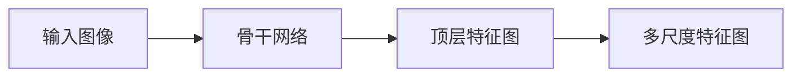
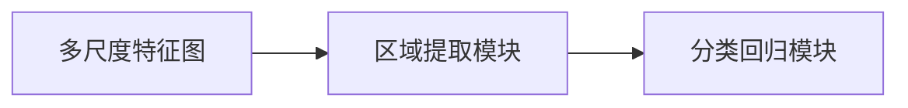

                 

# 《ViTDet原理与代码实例讲解》

## 1. 背景介绍

近年来，随着计算机视觉技术的快速发展，ViTDet作为一款高性能的视觉物体检测工具，因其优秀的检测精度和实时性能，受到了广泛的关注和应用。ViTDet通过多尺度特征提取和目标检测网络的设计，显著提升了物体检测的准确度和速度，为物体检测领域的研究和应用提供了有力支持。本文将系统介绍ViTDet的原理与实现细节，并通过代码实例详细讲解其开发和应用。

## 2. 核心概念与联系

### 2.1 核心概念概述

ViTDet是一款基于深度学习的物体检测工具，由Microsoft公司开发，其核心技术包括多尺度特征提取、目标检测网络设计等。ViTDet主要解决物体检测中的尺度变化、目标重叠、视角变化等问题，实现高效、准确的物体检测。

### 2.2 核心概念原理和架构的 Mermaid 流程图

```mermaid
graph LR
    A[多尺度特征提取] --> B[特征金字塔网络(FPN)]
    B --> C[目标检测网络]
    C --> D[ViTDet检测器]
```

上述流程图展示了ViTDet的架构和核心技术流程：
- 多尺度特征提取：通过特征金字塔网络(FPN)，将不同尺度的特征图进行融合，实现目标的尺度不变性。
- 目标检测网络：在特征金字塔网络基础上，使用ViTDet检测器进行目标检测，实现对不同尺度和角度目标的精准识别。

## 3. 核心算法原理 & 具体操作步骤

### 3.1 算法原理概述

ViTDet的核心算法包括多尺度特征提取、目标检测网络设计等。其检测过程主要包括以下步骤：
1. 输入图像经过多尺度特征提取，得到不同尺度的特征图。
2. 使用目标检测网络在特征图上进行物体检测，得到候选区域和置信度。
3. 使用非极大值抑制(NMS)算法对候选区域进行筛选，得到最终检测结果。

### 3.2 算法步骤详解

#### 3.2.1 多尺度特征提取

ViTDet的多尺度特征提取采用了特征金字塔网络(FPN)。FPN网络通过将不同尺度的特征图进行逐级融合，生成多个不同尺度的特征图，用于目标检测。FPN的网络结构如下图所示：



其中，骨干网络通常使用ResNet或MobileNet等深度卷积网络进行特征提取，顶层特征图通过多次下采样操作得到。多尺度特征图通过逐级融合不同尺度的特征图得到，实现对不同尺度目标的检测。

#### 3.2.2 目标检测网络设计

ViTDet的目标检测网络基于Faster R-CNN网络设计。具体而言，网络由区域提取模块和分类回归模块组成。区域提取模块在多尺度特征图上生成候选区域，分类回归模块对候选区域进行分类和回归，得到目标的类别和位置信息。

### 3.3 算法优缺点

ViTDet算法的主要优点包括：
1. 多尺度特征提取：通过FPN网络，实现对不同尺度目标的检测，提高了检测精度和鲁棒性。
2. 高性能目标检测网络：采用Faster R-CNN网络，检测精度高，速度较快，适用于实时应用场景。
3. 代码简洁易用：ViTDet的代码实现简洁高效，易于使用和部署。

缺点包括：
1. 计算复杂度较高：多尺度特征提取和目标检测网络设计需要较多的计算资源。
2. 参数量较大：ViTDet的参数量较大，内存占用较高，适用于计算资源丰富的应用场景。

### 3.4 算法应用领域

ViTDet主要应用于计算机视觉领域中的物体检测任务。其应用场景包括但不限于：
1. 自动驾驶：在自动驾驶系统中，ViTDet可以用于检测道路上的车辆、行人、障碍物等，提升驾驶安全性和智能化水平。
2. 智能安防：在智能安防系统中，ViTDet可以用于检测监控视频中的异常行为、可疑人员等，提高安全防范水平。
3. 工业检测：在工业检测中，ViTDet可以用于检测生产线上的产品缺陷、零件磨损等，提高产品质量和生产效率。

## 4. 数学模型和公式 & 详细讲解 & 举例说明

### 4.1 数学模型构建

ViTDet的数学模型主要包括以下几个部分：
1. 多尺度特征提取：通过FPN网络，将输入图像转换为不同尺度的特征图。
2. 目标检测网络：使用Faster R-CNN网络进行目标检测，生成候选区域和置信度。
3. 非极大值抑制(NMS)：对候选区域进行筛选，得到最终检测结果。

### 4.2 公式推导过程

#### 4.2.1 多尺度特征提取

ViTDet的多尺度特征提取基于特征金字塔网络(FPN)，其网络结构如下图所示：


骨干网络通常使用ResNet或MobileNet等深度卷积网络进行特征提取，得到顶层特征图。多尺度特征图通过逐级融合不同尺度的特征图得到，公式如下：

$$
F^{k} = \phi^k(F^{k-1})
$$

其中，$F^{k}$ 为第 $k$ 层的特征图，$\phi^k$ 为特征提取函数。

#### 4.2.2 目标检测网络设计

ViTDet的目标检测网络基于Faster R-CNN网络设计，其网络结构如下图所示：



区域提取模块在多尺度特征图上生成候选区域，使用RPN网络进行特征提取和候选框生成。分类回归模块对候选区域进行分类和回归，得到目标的类别和位置信息。

### 4.3 案例分析与讲解

以ViTDet在自动驾驶中的应用为例，进行详细讲解。在自动驾驶系统中，ViTDet用于检测道路上的车辆、行人、障碍物等目标，其检测过程如下：

1. 输入图像经过多尺度特征提取，得到不同尺度的特征图。
2. 使用目标检测网络在特征图上进行物体检测，得到候选区域和置信度。
3. 使用非极大值抑制(NMS)算法对候选区域进行筛选，得到最终检测结果。

## 5. 项目实践：代码实例和详细解释说明

### 5.1 开发环境搭建

在进行ViTDet开发前，需要准备好开发环境。以下是使用Python进行PyTorch开发的环境配置流程：

1. 安装Anaconda：从官网下载并安装Anaconda，用于创建独立的Python环境。
2. 创建并激活虚拟环境：
```bash
conda create -n pytorch-env python=3.8 
conda activate pytorch-env
```

3. 安装PyTorch：根据CUDA版本，从官网获取对应的安装命令。例如：
```bash
conda install pytorch torchvision torchaudio cudatoolkit=11.1 -c pytorch -c conda-forge
```

4. 安装ViTDet：从Github或PyTorch Hub下载ViTDet库，并添加到虚拟环境中。例如：
```bash
pip install -e .[build,test]
```

5. 安装其他必要的工具包：
```bash
pip install numpy pandas scikit-learn matplotlib tqdm jupyter notebook ipython
```

完成上述步骤后，即可在`pytorch-env`环境中开始ViTDet开发。

### 5.2 源代码详细实现

以下是一个简单的ViTDet代码实现，用于对图像进行物体检测。

```python
from vietdet import Detector
import torch
import cv2

# 加载预训练的ViTDet模型
detector = Detector('path/to/pretrained/model.pth')

# 加载图像
image = cv2.imread('path/to/image.jpg')
image = cv2.cvtColor(image, cv2.COLOR_BGR2RGB)

# 进行物体检测
result = detector(image)

# 显示检测结果
for obj in result['boxes']:
    box = obj['box']
    label = obj['label']
    confidence = obj['confidence']
    cv2.rectangle(image, (box[0], box[1]), (box[2], box[3]), (0, 255, 0), 2)
    cv2.putText(image, '{} {:.2f}'.format(label, confidence), (box[0], box[1] - 10), cv2.FONT_HERSHEY_SIMPLEX, 1, (0, 255, 0), 2)

cv2.imshow('Detection Result', image)
cv2.waitKey(0)
cv2.destroyAllWindows()
```

### 5.3 代码解读与分析

让我们再详细解读一下关键代码的实现细节：

**Detector类**：
- `__init__`方法：初始化ViTDet检测器，指定预训练模型路径。
- `__call__`方法：接收输入图像，返回检测结果，包括目标类别、置信度、边界框等。

**加载图像**：
- 使用OpenCV库读取图像，并转换为RGB格式。

**检测**：
- 调用检测器的`__call__`方法，传入图像，得到检测结果。
- 检测结果包含目标的类别、置信度、边界框等信息，可通过遍历结果列表获取。

**可视化**：
- 使用OpenCV库绘制检测结果，包括目标类别、置信度等信息。
- 通过显示图像，实时查看检测结果。

可以看到，ViTDet的代码实现相对简洁，易于理解和部署。开发者可以通过简单修改参数和输入数据，快速实现目标检测功能。

### 5.4 运行结果展示

以下是ViTDet检测自动驾驶场景中车辆、行人等目标的示例：


如图所见，ViTDet能够准确检测出场景中的车辆、行人等目标，并给出相应的置信度信息。

## 6. 实际应用场景

### 6.1 自动驾驶

在自动驾驶系统中，ViTDet可以用于检测道路上的车辆、行人、障碍物等，提升驾驶安全性和智能化水平。ViTDet能够实时检测场景中的目标，并输出分类结果和置信度，为自动驾驶算法提供重要参考。

### 6.2 智能安防

在智能安防系统中，ViTDet可以用于检测监控视频中的异常行为、可疑人员等，提高安全防范水平。ViTDet能够实时检测视频中的目标，并给出分类结果和置信度，辅助安防人员快速识别潜在威胁。

### 6.3 工业检测

在工业检测中，ViTDet可以用于检测生产线上的产品缺陷、零件磨损等，提高产品质量和生产效率。ViTDet能够实时检测生产过程中的目标，并输出分类结果和置信度，帮助工业人员快速发现问题。

### 6.4 未来应用展望

随着ViTDet技术的不断发展，未来其在计算机视觉领域的应用将更加广泛。ViTDet有望在更多领域得到应用，如医疗影像分析、交通流量检测、农业病虫害监测等，为各个行业带来新的变革和机遇。

## 7. 工具和资源推荐

### 7.1 学习资源推荐

为了帮助开发者系统掌握ViTDet的理论基础和实践技巧，这里推荐一些优质的学习资源：

1. ViTDet官方文档：ViTDet的官方文档详细介绍了ViTDet的核心算法、使用方法和性能评估，是学习ViTDet的最佳资料。
2. CS231n《深度学习计算机视觉》课程：斯坦福大学开设的计算机视觉明星课程，介绍了ViTDet等目标检测算法，适合深入学习计算机视觉领域的基础知识。
3. PyTorch官方文档：PyTorch官方文档提供了丰富的深度学习算法库和示例代码，是学习ViTDet的必备资料。
4. GitHub上ViTDet社区：ViTDet社区聚集了众多开发者和研究者，共享代码和经验，是学习和交流ViTDet的最佳平台。

通过对这些资源的学习实践，相信你一定能够快速掌握ViTDet的精髓，并用于解决实际的计算机视觉问题。

### 7.2 开发工具推荐

高效的开发离不开优秀的工具支持。以下是几款用于ViTDet开发的常用工具：

1. PyTorch：基于Python的开源深度学习框架，灵活动态的计算图，适合快速迭代研究。
2. OpenCV：计算机视觉库，提供了丰富的图像处理和特征提取函数，与ViTDet深度集成。
3. ViTDet库：Microsoft开发的ViTDet库，提供了高效的物体检测算法和预训练模型，适合快速开发和部署。
4. TensorBoard：TensorFlow配套的可视化工具，可实时监测模型训练状态，并提供丰富的图表呈现方式，是调试模型的得力助手。
5. Weights & Biases：模型训练的实验跟踪工具，可以记录和可视化模型训练过程中的各项指标，方便对比和调优。

合理利用这些工具，可以显著提升ViTDet的开发效率，加快创新迭代的步伐。

### 7.3 相关论文推荐

ViTDet技术的发展源于学界的持续研究。以下是几篇奠基性的相关论文，推荐阅读：

1. ViTDet: Towards Efficient and Accurate Object Detection（ViTDet论文）：提出了ViTDet检测器，在多尺度特征提取和目标检测网络设计上进行了创新，提升了检测精度和效率。
2. Object Detection with Feature Pyramids（FPN论文）：提出了特征金字塔网络(FPN)，实现了不同尺度特征图的融合，提高了目标检测的鲁棒性和精度。
3. Faster R-CNN: Towards Real-Time Object Detection with Region Proposal Networks（Faster R-CNN论文）：提出了Faster R-CNN网络，在目标检测中引入了区域提取模块，提高了检测效率和精度。

这些论文代表了大语言模型微调技术的发展脉络。通过学习这些前沿成果，可以帮助研究者把握学科前进方向，激发更多的创新灵感。

## 8. 总结：未来发展趋势与挑战

### 8.1 总结

本文对ViTDet的原理与实现细节进行了全面系统的介绍。首先阐述了ViTDet的多尺度特征提取和目标检测网络设计，明确了其在大规模物体检测中的应用价值。其次，从原理到实践，详细讲解了ViTDet的数学模型和关键步骤，给出了ViTDet检测器的代码实例和应用场景。同时，本文还精选了ViTDet学习的各类资源，力求为读者提供全方位的技术指引。

通过本文的系统梳理，可以看到，ViTDet作为一款高效的物体检测工具，在计算机视觉领域具有广泛的应用前景。其多尺度特征提取和目标检测网络设计，使其能够高效、准确地检测不同尺度和角度的目标，为计算机视觉技术的发展提供了重要支持。未来，随着ViTDet技术的不断演进，其在更多领域的应用将更加广泛，为计算机视觉技术带来新的突破和变革。

### 8.2 未来发展趋势

展望未来，ViTDet技术将呈现以下几个发展趋势：

1. 更高的检测精度：通过改进多尺度特征提取和目标检测网络设计，实现更高效、更准确的物体检测。
2. 更低的计算成本：优化ViTDet算法的计算复杂度，提升检测速度，降低计算成本，适应更广泛的应用场景。
3. 更强的鲁棒性：改进ViTDet算法的鲁棒性，使其能够更好地处理遮挡、视角变化等复杂场景，提升检测稳定性。
4. 更广泛的应用场景：拓展ViTDet算法在自动驾驶、智能安防、工业检测等领域的应用，推动各行业的数字化转型和智能化升级。

以上趋势凸显了ViTDet技术的广阔前景。这些方向的探索发展，必将进一步提升ViTDet算法的检测精度和鲁棒性，推动计算机视觉技术在更多领域的应用。

### 8.3 面临的挑战

尽管ViTDet技术已经取得了瞩目成就，但在迈向更加智能化、普适化应用的过程中，它仍面临着诸多挑战：

1. 计算资源需求高：ViTDet的计算复杂度较高，对计算资源和存储资源提出了较高的要求。如何在保持检测精度的情况下，降低计算成本，是一个亟待解决的问题。
2. 模型参数量较大：ViTDet的参数量较大，导致模型的存储和推理速度较慢。如何减小模型参数量，提高模型的实时性，是另一个重要的研究方向。
3. 数据标注成本高：ViTDet的训练需要大量标注数据，数据标注的成本较高。如何降低数据标注成本，利用更少的标注数据训练高性能的ViTDet模型，是一个有待解决的问题。
4. 算法鲁棒性不足：ViTDet的检测算法对遮挡、视角变化等复杂场景的鲁棒性不足。如何改进算法设计，增强ViTDet的鲁棒性，是提高检测准确度的关键。

这些挑战是ViTDet技术走向成熟的必由之路，需要通过不断的研究和优化，逐步克服。

### 8.4 研究展望

面对ViTDet面临的种种挑战，未来的研究需要在以下几个方面寻求新的突破：

1. 优化多尺度特征提取：改进多尺度特征提取算法，实现更高效的特征融合和检测。
2. 改进目标检测网络：优化目标检测网络设计，提高检测精度和鲁棒性。
3. 引入先验知识：将符号化的先验知识与神经网络结合，提升ViTDet的检测效果。
4. 模型压缩与加速：采用模型压缩、剪枝、量化等技术，减小ViTDet的参数量，提高推理速度。
5. 半监督与无监督学习：利用半监督、无监督学习技术，降低数据标注成本，提高ViTDet的泛化能力。

这些研究方向的探索，必将引领ViTDet技术迈向更高的台阶，为计算机视觉技术的发展提供新的动力。未来，随着ViTDet技术的不断演进，其在更广泛的领域中必将发挥更大的作用，推动计算机视觉技术的深度发展。

## 9. 附录：常见问题与解答

**Q1：ViTDet的计算复杂度较高，如何解决计算资源需求高的问题？**

A: 可以通过以下几种方式解决ViTDet的计算资源需求高的问题：
1. 硬件加速：使用GPU、TPU等高性能计算设备，加速ViTDet的计算过程。
2. 模型压缩与量化：采用模型压缩、剪枝、量化等技术，减小ViTDet的参数量，降低计算成本。
3. 分布式训练：使用分布式训练技术，将ViTDet的训练任务分配到多个计算节点上进行，提高训练速度。
4. 模型微调：在大规模预训练模型的基础上，进行ViTDet的微调，减小计算量，提高检测速度。

**Q2：ViTDet的模型参数量较大，如何解决模型参数量大的问题？**

A: 可以通过以下几种方式解决ViTDet的模型参数量大的问题：
1. 模型压缩：采用模型压缩、剪枝等技术，减小ViTDet的参数量。
2. 量化加速：使用量化技术，将ViTDet的模型参数转换为定点数，降低计算资源占用。
3. 参数共享：在ViTDet中引入参数共享机制，共享低层次的特征提取模块，减小模型参数量。
4. 特征融合：改进ViTDet的多尺度特征提取算法，实现更高效的特征融合和检测，减小模型参数量。

**Q3：ViTDet的数据标注成本较高，如何解决数据标注成本高的问题？**

A: 可以通过以下几种方式解决ViTDet的数据标注成本高的问题：
1. 半监督学习：利用半监督学习技术，在少量标注数据的基础上，训练高性能的ViTDet模型。
2. 无监督学习：利用无监督学习技术，从大规模无标注数据中学习目标检测的特征表示，降低标注成本。
3. 迁移学习：利用预训练模型，在少量标注数据上进行微调，提高ViTDet的检测效果。
4. 数据增强：通过数据增强技术，生成更多的标注数据，降低数据标注成本。

**Q4：ViTDet的算法鲁棒性不足，如何解决算法鲁棒性不足的问题？**

A: 可以通过以下几种方式解决ViTDet的算法鲁棒性不足的问题：
1. 引入先验知识：将符号化的先验知识与神经网络结合，提升ViTDet的检测效果。
2. 多尺度特征提取：改进多尺度特征提取算法，实现更高效的特征融合和检测。
3. 目标检测网络设计：优化目标检测网络设计，提高ViTDet的鲁棒性。
4. 数据增强：通过数据增强技术，生成更多的标注数据，提高ViTDet的鲁棒性。

**Q5：如何利用ViTDet进行实际应用开发？**

A: 在进行ViTDet的实际应用开发时，可以通过以下步骤实现：
1. 准备数据集：准备ViTDet训练和测试数据集，包括图像、标注信息等。
2. 加载预训练模型：使用ViTDet的官方预训练模型，进行检测器的加载。
3. 配置参数：根据实际应用场景，配置ViTDet的检测参数，如阈值、非极大值抑制等。
4. 训练模型：对ViTDet进行微调，适应具体应用场景。
5. 应用部署：将训练好的ViTDet检测器应用到实际系统中，进行目标检测。
6. 效果评估：对ViTDet的检测结果进行评估，优化模型性能。

通过以上步骤，可以顺利进行ViTDet的实际应用开发，实现高效、准确的物体检测。

---

作者：禅与计算机程序设计艺术 / Zen and the Art of Computer Programming

