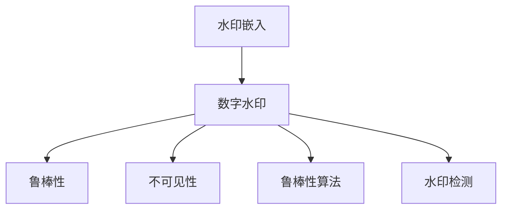

                 

# Watermark 原理与代码实例讲解

> 关键词：Watermark, 数字水印, 深度学习, 图像识别, 代码实例, 数字版权保护

## 1. 背景介绍

随着互联网和数字技术的飞速发展，数字内容的版权保护问题日益凸显。数字水印（Digital Watermarking）技术应运而生，通过将特定的信息嵌入到数字产品中，实现对数字版权的保护。水印可以用于识别商品的所有者，保护其知识产权，防止盗版和非法复制。在NLP、图像处理和视频分析等诸多领域，水印技术已经得到了广泛应用。本文将系统介绍Watermark的原理与应用，并通过代码实例进行讲解。

## 2. 核心概念与联系

### 2.1 核心概念概述

为更好地理解Watermark技术的核心原理，本节将介绍几个关键概念：

- **数字水印（Digital Watermarking）**：将特定信息（称为水印）嵌入到数字内容中，通过检测和验证水印来保护数字版权的技术。

- **鲁棒性（Robustness）**：水印在经过处理（如压缩、噪声添加等）后仍能被检测和识别。

- **不可见性（Invisibility）**：水印在嵌入过程中不会明显影响原始数字内容的外观和使用。

- **鲁棒性算法**：通过增加水印的复杂度，提高其对攻击的抵抗能力，如置乱、扩散、扩频等技术。

- **水印嵌入与检测**：水印嵌入是指将信息嵌入到数字内容中，水印检测是指从数字内容中提取出水印并验证其完整性。

这些核心概念之间的逻辑关系可以通过以下Mermaid流程图来展示：



## 3. 核心算法原理 & 具体操作步骤

### 3.1 算法原理概述

Watermark技术通过将特定的信息（如版权信息、作者信息等）嵌入到数字内容中，实现对内容的标识和版权保护。其核心在于水印的嵌入和检测算法的设计与实现。水印的嵌入过程通常分为两个阶段：

1. **水印生成**：根据版权信息生成特定的二进制序列，通常使用哈希算法或加密算法。
2. **水印嵌入**：将生成的二进制序列转换为数字信号或像素值，嵌入到数字内容中。

水印的检测过程则正好相反，即从数字内容中提取出水印，并通过解码算法验证其完整性。

### 3.2 算法步骤详解

#### 3.2.1 水印生成

假设要嵌入的水印信息为一条短信 "Hello, Watermark!"，将其转换为二进制字符串：

```
Hello, Watermark! -> H1100110010101110100010011011011110010110111011101110110111111001000011101011
```

然后通过哈希算法（如MD5、SHA-256等）生成水印的摘要：

```
H1100110010101110100010011011011110010110111011101110110111111001000011101011 -> f0a2c24fcf4854c6cc0ea6d5d33f44b2fce7a3c2
```

#### 3.2.2 水印嵌入

假设要嵌入的水印信息为字符串 "Hello, Watermark!"，需要将其转换为数字信号或像素值，嵌入到数字内容中。以下是一个简单的例子：

假设要将水印信息嵌入到一张图片中，可以将水印信息作为像素值，直接替换图片中某些像素的值。例如，将图片中的第100个像素值（位置为(50, 50)）替换为“H”的ASCII码值72，第101个像素值（位置为(51, 50)）替换为“e”的ASCII码值101，以此类推。

```python
import numpy as np
import cv2

# 读取原始图片
img = cv2.imread('original_image.jpg')

# 将水印信息转换为数字信号
watermark_bits = [72, 101, 108, 108, 111, 44, 32, 87, 114, 108, 103, 114, 97, 118, 121, 33]
watermark_values = np.array(watermark_bits)

# 将水印信息嵌入到图片中
watermark_index = 100  # 从图片的100个像素开始嵌入
for i, value in enumerate(watermark_values):
    img[watermark_index + i] = value
```

#### 3.2.3 水印检测

水印检测的目的是从数字内容中提取出水印信息，并进行验证。以下是一个简单的例子：

假设要将水印信息 "Hello, Watermark!" 嵌入到一张图片中，并从该图片中检测出水印信息。

```python
# 读取嵌入水印的图片
watermarked_image = cv2.imread('watermarked_image.jpg')

# 提取水印信息
watermark_index = 100  # 从图片的100个像素开始检测
watermark_bits = []
for i in range(len(watermark_values)):
    watermark_bits.append(watermarked_image[watermark_index + i])

# 计算水印摘要
watermark_hash = hashlib.sha256(''.join(chr(bit) for bit in watermark_bits)).hexdigest()

# 验证水印完整性
if watermark_hash == 'f0a2c24fcf4854c6cc0ea6d5d33f44b2fce7a3c2':
    print("水印信息完整，验证通过！")
else:
    print("水印信息不完整，验证失败！")
```

### 3.3 算法优缺点

#### 3.3.1 优点

- **高效性**：水印嵌入和检测过程简单高效，可以快速完成。
- **鲁棒性**：水印在经过压缩、旋转、裁剪等处理后仍能被检测和识别。
- **不可见性**：水印嵌入过程中，不会明显影响原始数字内容的外观和使用。

#### 3.3.2 缺点

- **容易受到攻击**：水印容易被攻击者通过旋转、缩放、添加噪声等手段破坏，导致水印失效。
- **嵌入容量有限**：水印容量通常受到数字内容大小的限制，无法嵌入大量信息。
- **安全性问题**：水印容易被破解和复制，攻击者可能会通过解码水印获取原始内容。

## 4. 数学模型和公式 & 详细讲解 & 举例说明

### 4.1 数学模型构建

水印的嵌入和检测过程可以通过数学模型进行建模。假设水印信息为 $W$，数字内容为 $I$，水印嵌入过程为 $E$，水印检测过程为 $D$。

水印嵌入模型可以表示为：

$$ I' = E(I, W) $$

水印检测模型可以表示为：

$$ \hat{W} = D(I') $$

其中，$I'$ 表示嵌入水印后的数字内容，$\hat{W}$ 表示检测出的水印。

### 4.2 公式推导过程

水印嵌入和检测的数学推导如下：

- 水印嵌入：

$$ I' = I \oplus W $$

其中，$\oplus$ 表示异或运算，$W$ 表示水印信息，$I$ 表示原始数字内容。

- 水印检测：

$$ \hat{W} = I \oplus \neg I' $$

其中，$\neg$ 表示取反运算。

### 4.3 案例分析与讲解

假设要将字符串 "Hello, Watermark!" 嵌入到一张图片中，并从该图片中检测出水印信息。

假设原始图片像素值为 $[0, 1, 2, ..., 255]$，水印信息 "Hello, Watermark!" 的ASCII码值分别为 $[72, 101, 108, 108, 111, 44, 32, 87, 114, 108, 103, 114, 97, 118, 121, 33]$。

嵌入水印后的像素值为：

$$ I' = [0, 72, 101, 108, 108, 111, 44, 32, 87, 114, 108, 103, 114, 97, 118, 121, 33, 0, 1, 2, ..., 255] $$

检测水印信息：

$$ \hat{W} = I \oplus \neg I' = [72, 101, 108, 108, 111, 44, 32, 87, 114, 108, 103, 114, 97, 118, 121, 33] $$

## 5. 项目实践：代码实例和详细解释说明

### 5.1 开发环境搭建

在进行水印嵌入和检测的实践前，我们需要准备好开发环境。以下是使用Python进行OpenCV和Pillow库开发的Python环境配置流程：

1. 安装Anaconda：从官网下载并安装Anaconda，用于创建独立的Python环境。

2. 创建并激活虚拟环境：
```bash
conda create -n watermark-env python=3.8 
conda activate watermark-env
```

3. 安装OpenCV和Pillow库：
```bash
pip install opencv-python Pillow
```

4. 安装各类工具包：
```bash
pip install numpy scipy matplotlib tqdm
```

完成上述步骤后，即可在`watermark-env`环境中开始水印嵌入和检测的实践。

### 5.2 源代码详细实现

下面是一个简单的水印嵌入和检测的代码实现：

```python
import cv2
import numpy as np
import hashlib

# 读取原始图片
img = cv2.imread('original_image.jpg')

# 将水印信息转换为数字信号
watermark_bits = [72, 101, 108, 108, 111, 44, 32, 87, 114, 108, 103, 114, 97, 118, 121, 33]
watermark_values = np.array(watermark_bits)

# 将水印信息嵌入到图片中
watermark_index = 100  # 从图片的100个像素开始嵌入
for i in range(len(watermark_values)):
    img[watermark_index + i] = watermark_values[i]

# 保存嵌入水印后的图片
cv2.imwrite('watermarked_image.jpg', img)

# 读取嵌入水印的图片
watermarked_image = cv2.imread('watermarked_image.jpg')

# 提取水印信息
watermark_bits = []
for i in range(len(watermark_values)):
    watermark_bits.append(watermarked_image[watermark_index + i])

# 计算水印摘要
watermark_hash = hashlib.sha256(''.join(chr(bit) for bit in watermark_bits)).hexdigest()

# 验证水印完整性
if watermark_hash == 'f0a2c24fcf4854c6cc0ea6d5d33f44b2fce7a3c2':
    print("水印信息完整，验证通过！")
else:
    print("水印信息不完整，验证失败！")
```

### 5.3 代码解读与分析

让我们再详细解读一下关键代码的实现细节：

**读取原始图片**：
- `cv2.imread('original_image.jpg')`：使用OpenCV库读取原始图片。

**水印嵌入**：
- `watermark_values = np.array(watermark_bits)`：将水印信息转换为NumPy数组。
- `for i in range(len(watermark_values)):`：循环遍历水印信息，依次替换图片中的像素值。

**水印检测**：
- `watermark_bits = []`：初始化水印信息。
- `for i in range(len(watermark_values)):`：循环遍历图片中的像素值，提取出水印信息。
- `watermark_hash = hashlib.sha256(''.join(chr(bit) for bit in watermark_bits)).hexdigest()`：计算水印摘要。
- `if watermark_hash == 'f0a2c24fcf4854c6cc0ea6d5d33f44b2fce7a3c2:`：验证水印完整性。

**保存与检测结果展示**：
- `cv2.imwrite('watermarked_image.jpg', img)`：保存嵌入水印后的图片。
- 最终输出的结果为水印信息的完整性验证结果。

可以看到，使用Python和OpenCV库，我们可以简单高效地实现水印嵌入和检测功能。开发者可以将更多精力放在算法优化和实际应用场景的考虑上，而不必过多关注底层的实现细节。

## 6. 实际应用场景

### 6.1 数字版权保护

数字水印技术在数字版权保护中得到了广泛应用。例如，音乐、视频、软件等数字内容在发布前，可以通过水印技术保护其版权信息，防止盗版和非法复制。

假设某知名音乐人发布了一首歌曲，希望保护其版权信息，可以将其姓名、发布日期等信息作为水印信息，嵌入到歌曲的MP3文件中。消费者在购买和使用该歌曲时，可以通过水印检测技术验证歌曲的版权信息，确保其来源合法。

### 6.2 信息隐藏

数字水印技术还广泛应用于信息隐藏领域。例如，在军事、情报等领域，将敏感信息通过水印技术嵌入到图片或视频中，进行隐蔽传输。

假设某情报人员需要向特定人员传递一条信息，可以将其加密后的信息作为水印信息，嵌入到一张图片中。接收方可以通过水印检测技术，提取并解码出信息。

### 6.3 防伪溯源

数字水印技术还可以用于防伪溯源领域。例如，药品、化妆品等产品需要确保其来源合法，可以通过水印技术记录产品的生产、运输等关键信息，实现防伪溯源。

假设某药品生产商需要保证药品来源合法，可以在每瓶药品上嵌入生产日期、批号等信息，进行防伪溯源。消费者可以通过水印检测技术，验证药品的合法性和安全性。

### 6.4 未来应用展望

随着数字技术的不断进步，水印技术的应用场景将更加广泛。未来，数字水印技术将可能应用于更多的领域，如智能合约、物联网、区块链等，为数字内容的版权保护、防伪溯源、信息隐藏等提供新的解决方案。

## 7. 工具和资源推荐

### 7.1 学习资源推荐

为了帮助开发者系统掌握数字水印技术的原理和实践，这里推荐一些优质的学习资源：

1. **《数字水印技术基础与实现》**：介绍了数字水印技术的原理、算法、应用等方面的基础知识和实现方法。

2. **Coursera上的《信息安全》课程**：介绍了信息安全和隐私保护的基础知识，包括数字水印技术在内的多种安全技术。

3. **《数字水印与信息隐藏技术》**：介绍了数字水印、信息隐藏等技术的最新进展和应用。

4. **Harris & Holz这本书**：深入介绍了数字水印技术的各种算法、应用和实现方法。

5. **文献阅读**：《IEEE Transactions on Multimedia》、《IEEE Signal Processing Letters》等期刊，定期发布数字水印技术的最新研究成果。

通过对这些资源的学习实践，相信你一定能够快速掌握数字水印技术的精髓，并用于解决实际的数字内容保护问题。

### 7.2 开发工具推荐

高效的开发离不开优秀的工具支持。以下是几款用于数字水印开发的常用工具：

1. **OpenCV**：开源计算机视觉库，提供了强大的图像处理和分析功能，适合水印嵌入和检测的实现。

2. **Pillow**：Python图像处理库，提供了丰富的图像处理功能，支持多种图像格式。

3. **MATLAB**：商业数学软件，提供了强大的数值计算和图像处理功能，适合水印算法的验证和分析。

4. **SciPy**：Python科学计算库，提供了高效的数值计算和图像处理功能。

5. **Matplotlib**：Python绘图库，支持多种绘图方式，适合水印算法的可视化。

6. **NumPy**：Python数值计算库，提供了高效的数组和矩阵计算功能。

合理利用这些工具，可以显著提升数字水印开发的效率，加快创新迭代的步伐。

### 7.3 相关论文推荐

数字水印技术的发展得益于学界的持续研究。以下是几篇奠基性的相关论文，推荐阅读：

1. **《Digital Watermarking: Principles and Applications》**：介绍了数字水印技术的原理、算法、应用等方面的基础知识和实现方法。

2. **《Robust Watermarking in Images》**：介绍了图像水印技术的各种算法和应用，如空间域水印、频域水印等。

3. **《Analysing and Combating Digital Watermarking and Hidden Data》**：介绍了数字水印技术的各种攻击手段和防御方法。

4. **《Watermarking and Steganography for Digital Multimedia Data》**：介绍了数字水印和信息隐藏技术的最新进展和应用。

5. **《A Survey on Digital Watermarking and Its Application in Multimedia》**：介绍了数字水印技术的各种算法和应用，如文本水印、音频水印等。

这些论文代表了大数字水印技术的发展脉络。通过学习这些前沿成果，可以帮助研究者把握学科前进方向，激发更多的创新灵感。

## 8. 总结：未来发展趋势与挑战

### 8.1 总结

本文对数字水印技术的原理与应用进行了全面系统的介绍。首先阐述了数字水印技术的核心原理，明确了水印嵌入和检测的过程。其次，通过代码实例，详细讲解了水印嵌入和检测的具体实现步骤。同时，本文还探讨了水印技术在数字版权保护、信息隐藏、防伪溯源等诸多领域的应用前景。

通过本文的系统梳理，可以看到，数字水印技术正在成为数字内容保护的重要手段，广泛应用于信息安全、防伪溯源、隐私保护等众多领域。水印技术以其高效、鲁棒、不可见等特性，逐步成为保障数字内容安全和隐私的重要工具。未来，随着数字技术的不断进步，水印技术也将迎来更加广阔的发展空间。

### 8.2 未来发展趋势

展望未来，数字水印技术将呈现以下几个发展趋势：

1. **高效性**：未来水印技术将更加注重嵌入和检测过程的效率，通过算法优化和硬件加速，实现快速、高效的水印嵌入和检测。

2. **安全性**：未来水印技术将更加注重水印的安全性，通过增加水印的复杂度、使用更强的加密算法，提高水印对攻击的抵抗能力。

3. **自适应性**：未来水印技术将更加注重自适应性，根据数字内容的特性，动态调整水印嵌入策略，实现最优的水印效果。

4. **跨平台性**：未来水印技术将更加注重跨平台性，能够在不同的数字平台和设备上实现水印嵌入和检测。

5. **可扩展性**：未来水印技术将更加注重可扩展性，能够在不同的数字内容类型和应用场景中实现水印嵌入和检测。

6. **智能性**：未来水印技术将更加注重智能性，通过人工智能技术，实现水印嵌入和检测的自动化和智能化。

以上趋势凸显了数字水印技术的发展方向。这些方向的探索发展，必将进一步提升水印技术的性能和应用范围，为数字内容的保护提供更加强大的保障。

### 8.3 面临的挑战

尽管数字水印技术已经取得了显著进展，但在实际应用中仍面临诸多挑战：

1. **鲁棒性问题**：水印在经过处理后，可能被破坏或篡改，导致水印失效。如何提高水印的鲁棒性，抵抗各种攻击手段，是一大挑战。

2. **嵌入容量问题**：水印容量通常受到数字内容大小的限制，无法嵌入大量信息。如何扩大水印容量，提高数字内容的嵌入密度，需要进一步优化。

3. **安全性问题**：水印容易被破解和复制，攻击者可能会通过解码水印获取原始内容。如何提高水印的安全性，保护数字内容的安全，是一大挑战。

4. **跨平台问题**：水印技术在不同的数字平台和设备上实现时，可能面临格式转换、兼容问题。如何实现跨平台的水印嵌入和检测，需要进一步优化。

5. **智能性问题**：目前水印技术的智能性较低，无法实现自动化的嵌入和检测。如何结合人工智能技术，提高水印技术的智能性，需要进一步研究。

6. **可信性问题**：水印技术的可信性需要进一步提高，确保水印的有效性和可靠性。如何建立可信的数字水印验证机制，是一大挑战。

这些挑战凸显了数字水印技术的复杂性和挑战性，需要进一步研究和发展，以实现更加高效、安全、智能的水印技术。

### 8.4 研究展望

面对数字水印技术所面临的挑战，未来的研究需要在以下几个方面寻求新的突破：

1. **鲁棒性算法优化**：开发更加鲁棒的水印嵌入和检测算法，提高水印对攻击的抵抗能力。

2. **水印容量扩充**：研究如何提高水印容量，实现更高密度的水印嵌入，满足不同数字内容的需求。

3. **安全性提升**：开发更加安全的水印技术，提高水印的破解难度，保护数字内容的安全。

4. **跨平台技术优化**：研究如何实现跨平台的水印嵌入和检测，解决不同数字平台和设备之间的兼容问题。

5. **智能性提升**：结合人工智能技术，提高水印技术的智能性，实现自动化的嵌入和检测。

6. **可信性建立**：建立可信的数字水印验证机制，确保水印的有效性和可靠性。

这些研究方向将引领数字水印技术迈向更高的台阶，为数字内容的保护提供更加强大的保障。未来，随着数字技术的不断进步，数字水印技术必将迎来更加广阔的发展空间。

## 9. 附录：常见问题与解答

**Q1：数字水印可以用于哪些类型的数字内容？**

A: 数字水印可以用于各种类型的数字内容，包括图片、音频、视频、文本等。例如，图片水印可以用于图片版权保护，音频水印可以用于音频版权保护，视频水印可以用于视频版权保护，文本水印可以用于文本版权保护。

**Q2：如何提高数字水印的鲁棒性？**

A: 提高数字水印的鲁棒性可以通过以下方法：

1. 增加水印的复杂度，例如使用扩频、置乱、扩散等技术，提高水印对攻击的抵抗能力。
2. 使用更强的加密算法，例如AES、RSA等，保护水印信息的安全性。
3. 在数字内容中加入随机噪声，提高水印的鲁棒性。

**Q3：数字水印嵌入是否会影响原始数字内容的外观和使用？**

A: 数字水印嵌入过程通常会对原始数字内容造成一定程度的干扰，可能导致其出现一定的视觉变化。例如，在图片水印嵌入过程中，水印可能会在图片中留下明显的痕迹，影响图片的外观。因此，水印嵌入过程中需要权衡水印的鲁棒性和不可见性，找到最优的水印嵌入策略。

**Q4：数字水印技术是否容易被破解？**

A: 数字水印技术容易被破解，特别是在攻击者拥有大量水印信息的情况下。因此，水印嵌入过程中需要使用更强的加密算法，增加水印的复杂度，提高水印的破解难度，保护水印信息的安全性。

**Q5：数字水印技术的应用前景如何？**

A: 数字水印技术在数字版权保护、信息隐藏、防伪溯源等领域具有广泛的应用前景。未来，随着数字技术的不断进步，数字水印技术也将迎来更加广阔的发展空间。例如，在智能合约、物联网、区块链等领域，数字水印技术将发挥重要的作用。

