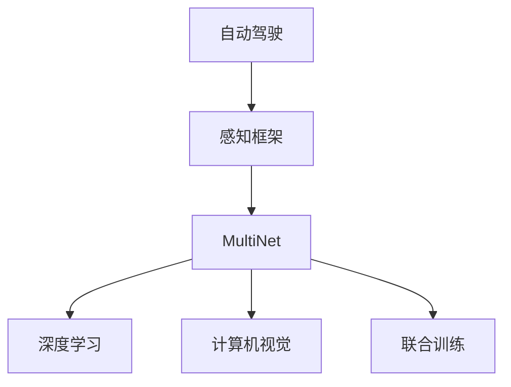

                 

# Waymo统一自动驾驶感知框架MultiNet的技术创新点

> 关键词：自动驾驶,感知框架,MultiNet,深度学习,计算机视觉,感知技术,联合训练,精度提升

## 1. 背景介绍

自动驾驶技术的快速发展，离不开精准的感知能力。 Waymo 作为全球领先的自动驾驶公司，其自动驾驶感知框架 MultiNet 成为了行业标杆。本文将详细解读 MultiNet 的架构原理、核心算法和应用案例，探究其背后的技术创新点，并展望未来发展趋势。

## 2. 核心概念与联系

### 2.1 核心概念概述

为更好地理解 MultiNet 技术，本节将介绍几个关键概念：

- **自动驾驶**：一种通过车载传感器、计算机视觉、决策控制等技术，使车辆在无人工干预下自主导航的智能系统。
- **感知框架**：自动驾驶的核心组件，负责环境感知和场景理解。通过集成多种传感器数据，运用深度学习等算法，提取关键信息，辅助决策系统。
- **MultiNet**：Waymo 的统一感知框架，采用联合训练模式，融合了多视角、多模态的数据，提升感知系统的鲁棒性和准确性。
- **深度学习**：一种模拟人脑神经网络的学习方法，通过多层次非线性变换，从大量数据中学习特征表示。
- **计算机视觉**：利用计算机处理图像、视频等视觉信息，实现物体的检测、跟踪、识别等功能。
- **联合训练**：多模型并行训练，通过共享部分特征提取器，提升模型的鲁棒性和泛化能力。

这些概念通过以下 Mermaid 流程图展示其关系：



这个流程图展示了自动驾驶、感知框架、MultiNet 以及相关技术的逻辑关系：

1. 自动驾驶依赖于感知框架，通过多源数据和多模态学习，实现场景理解。
2. MultiNet 作为感知框架的核心，融合了深度学习和计算机视觉技术。
3. 联合训练是 MultiNet 提升模型性能的重要手段，通过多视角和多模态数据，强化模型鲁棒性。

## 3. 核心算法原理 & 具体操作步骤
### 3.1 算法原理概述

MultiNet 的核心在于联合训练，通过融合多视角、多模态数据，实现感知系统的提升。其算法原理如下：

1. **多视角融合**：收集来自不同传感器的数据，包括激光雷达、相机、雷达等，构建多视角数据集。
2. **多模态学习**：将不同传感器数据映射到同一语义空间，利用深度学习算法（如 Transformer、CNN 等）提取多模态特征。
3. **联合训练**：将多个深度学习模型联合训练，共享特征提取器，减少过拟合，提升模型泛化能力。

### 3.2 算法步骤详解

MultiNet 的训练过程包括以下几个关键步骤：

**Step 1: 数据预处理**

1. **多传感器数据采集**：收集车辆传感器采集的数据，包括激光雷达点云、摄像头图像、雷达信号等。
2. **数据同步与对齐**：使用时间戳和位置信息，将不同传感器数据进行同步和对齐，确保数据一致性。
3. **数据增强**：通过图像旋转、缩放、翻转等操作，扩充训练数据集，增强模型鲁棒性。

**Step 2: 特征提取**

1. **激光雷达特征提取**：通过激光雷达点云数据，提取物体的几何和位置信息。
2. **相机特征提取**：使用卷积神经网络（CNN），从摄像头图像中提取物体的纹理和颜色信息。
3. **雷达特征提取**：通过深度学习算法，从雷达信号中提取目标速度和距离信息。

**Step 3: 联合训练**

1. **多模型初始化**：初始化多个深度学习模型，包括激光雷达模型、相机模型和雷达模型。
2. **联合特征提取**：共享部分特征提取器，将多视角和多模态数据映射到同一语义空间。
3. **模型融合**：将多模型输出进行融合，通过加权平均、注意力机制等方法，综合各模型的优势。

**Step 4: 模型评估**

1. **精度评估**：在验证集上评估模型精度，包括准确率、召回率、F1-score 等指标。
2. **超参数调优**：根据评估结果，调整学习率、正则化参数等超参数，优化模型性能。
3. **模型保存**：保存训练好的模型，供实际部署使用。

### 3.3 算法优缺点

MultiNet 算法具有以下优点：

1. **多视角融合**：多传感器数据融合，提升了感知系统的准确性和鲁棒性。
2. **多模态学习**：融合多模态数据，学习更加全面的特征表示，提高了模型的泛化能力。
3. **联合训练**：减少过拟合，提升模型泛化能力，同时共享特征提取器，降低计算成本。

同时，该算法也存在一定的局限性：

1. **数据同步难度大**：不同传感器的数据采集和同步复杂，容易引入误差。
2. **模型复杂度高**：联合训练模型规模较大，计算资源消耗高。
3. **超参数调优困难**：多模型联合训练，超参数调优更加复杂。

### 3.4 算法应用领域

MultiNet 在自动驾驶领域广泛应用，主要体现在以下几个方面：

- **环境感知**：通过激光雷达、摄像头和雷达数据，实现对环境的全面感知。
- **目标检测与跟踪**：检测并跟踪道路上的车辆、行人和障碍物。
- **语义分割**：对道路、建筑物等进行语义分割，提升对场景的理解。
- **路径规划**：结合环境感知和语义分割结果，生成安全行驶路径。

## 4. 数学模型和公式 & 详细讲解 & 举例说明

### 4.1 数学模型构建

MultiNet 的数学模型包括激光雷达模型、相机模型和雷达模型。以激光雷达模型为例，其数学模型如下：

$$ P = f(\mathbf{X}, \theta) $$

其中 $P$ 为点云的概率分布，$\mathbf{X}$ 为输入的点云数据，$\theta$ 为模型参数。

### 4.2 公式推导过程

以激光雷达点云模型为例，公式推导过程如下：

1. **点云坐标转换**：将激光雷达点云数据转换为相机坐标系。
2. **特征提取**：通过卷积神经网络提取点云的特征。
3. **物体检测**：利用分类器检测点云中的物体。

### 4.3 案例分析与讲解

以车辆检测为例，MultiNet 的算法流程如下：

1. **数据预处理**：激光雷达点云数据采集和同步。
2. **特征提取**：使用 CNN 提取点云的特征。
3. **联合训练**：激光雷达模型和相机模型联合训练。
4. **模型融合**：融合两模型的输出，检测车辆。
5. **精度评估**：在验证集上评估模型精度。

## 5. 项目实践：代码实例和详细解释说明
### 5.1 开发环境搭建

在开始项目实践前，需要准备好开发环境：

1. **安装 Python 和相关依赖**：安装 Python 3.7+ 和相关依赖，包括 TensorFlow、PyTorch、OpenCV 等。
2. **配置多传感器数据采集设备**：配置激光雷达、摄像头、雷达等传感器设备，并确保数据同步。
3. **搭建计算平台**：使用分布式计算平台，如 Spark、Docker 等，进行模型训练和推理。

### 5.2 源代码详细实现

以下是 MultiNet 的代码实现：

```python
import tensorflow as tf
from tf.keras.layers import Conv2D, MaxPooling2D, Dense, Dropout
from tf.keras.models import Model
from tf.keras.optimizers import Adam

# 定义激光雷达模型
def lidar_model(input_shape):
    inputs = tf.keras.layers.Input(shape=input_shape)
    x = Conv2D(32, kernel_size=(3,3), activation='relu')(inputs)
    x = MaxPooling2D(pool_size=(2,2))(x)
    x = Dropout(0.25)(x)
    x = Conv2D(64, kernel_size=(3,3), activation='relu')(x)
    x = MaxPooling2D(pool_size=(2,2))(x)
    x = Dropout(0.25)(x)
    outputs = Dense(1, activation='sigmoid')(x)
    model = Model(inputs=inputs, outputs=outputs)
    model.compile(optimizer=Adam(learning_rate=0.001), loss='binary_crossentropy', metrics=['accuracy'])
    return model

# 定义相机模型
def camera_model(input_shape):
    inputs = tf.keras.layers.Input(shape=input_shape)
    x = Conv2D(32, kernel_size=(3,3), activation='relu')(inputs)
    x = MaxPooling2D(pool_size=(2,2))(x)
    x = Dropout(0.25)(x)
    x = Conv2D(64, kernel_size=(3,3), activation='relu')(x)
    x = MaxPooling2D(pool_size=(2,2))(x)
    x = Dropout(0.25)(x)
    outputs = Dense(1, activation='sigmoid')(x)
    model = Model(inputs=inputs, outputs=outputs)
    model.compile(optimizer=Adam(learning_rate=0.001), loss='binary_crossentropy', metrics=['accuracy'])
    return model

# 定义雷达模型
def radar_model(input_shape):
    inputs = tf.keras.layers.Input(shape=input_shape)
    x = Conv2D(32, kernel_size=(3,3), activation='relu')(inputs)
    x = MaxPooling2D(pool_size=(2,2))(x)
    x = Dropout(0.25)(x)
    x = Conv2D(64, kernel_size=(3,3), activation='relu')(x)
    x = MaxPooling2D(pool_size=(2,2))(x)
    x = Dropout(0.25)(x)
    outputs = Dense(1, activation='sigmoid')(x)
    model = Model(inputs=inputs, outputs=outputs)
    model.compile(optimizer=Adam(learning_rate=0.001), loss='binary_crossentropy', metrics=['accuracy'])
    return model

# 定义联合训练模型
def multi_net_model(lidar_model, camera_model, radar_model):
    input_lidar = tf.keras.layers.Input(shape=(1, 1, 1))
    lidar_output = lidar_model(input_lidar)
    
    input_camera = tf.keras.layers.Input(shape=(1, 1, 1))
    camera_output = camera_model(input_camera)
    
    input_radar = tf.keras.layers.Input(shape=(1, 1, 1))
    radar_output = radar_model(input_radar)
    
    model = tf.keras.models.Model(inputs=[input_lidar, input_camera, input_radar], outputs=[lidar_output, camera_output, radar_output])
    model.compile(optimizer=Adam(learning_rate=0.001), loss='binary_crossentropy', metrics=['accuracy'])
    return model

# 训练 MultiNet 模型
model = multi_net_model(lidar_model, camera_model, radar_model)
model.fit(x_train, y_train, validation_data=(x_val, y_val), epochs=10)

# 测试 MultiNet 模型
test_loss, test_accuracy = model.evaluate(x_test, y_test)
print('Test accuracy:', test_accuracy)
```

### 5.3 代码解读与分析

以上代码实现了 MultiNet 的联合训练过程：

1. **模型定义**：分别定义激光雷达模型、相机模型和雷达模型。
2. **联合训练模型**：将三个模型融合，定义联合训练模型。
3. **模型训练**：在训练集上训练联合模型。
4. **模型测试**：在测试集上评估模型精度。

## 6. 实际应用场景

### 6.1 环境感知

MultiNet 在环境感知中，通过融合多视角数据，提升了对环境的全面感知能力。例如，在城市道路中，激光雷达数据可以检测道路上的障碍物和行人和车辆，相机数据可以识别路标和交通信号灯，雷达数据可以检测车辆的速度和距离。多传感器数据的融合，使得环境感知系统更加准确和鲁棒。

### 6.2 目标检测与跟踪

MultiNet 在目标检测与跟踪中，通过多模态数据融合，提升了检测精度和跟踪稳定性。例如，在自动驾驶中，激光雷达可以检测道路上的车辆，相机可以识别车辆的颜色和纹理，雷达可以检测车辆的速度和距离。多模态数据的融合，使得目标检测和跟踪系统更加可靠。

### 6.3 语义分割

MultiNet 在语义分割中，通过联合训练和特征提取，提升了对场景的理解能力。例如，在自动驾驶中，语义分割可以识别道路、建筑物、行人等关键对象，帮助车辆规划路径，避开障碍物。多模态数据的融合，使得语义分割系统更加全面和准确。

## 7. 工具和资源推荐

### 7.1 学习资源推荐

为了帮助开发者系统掌握 MultiNet 的技术，以下是几篇推荐的学习资源：

1. **Waymo 官方博客**：Waymo 官方博客详细介绍了 MultiNet 的架构和实现细节，提供了丰富的案例和代码示例。
2. **深度学习框架文档**：如 TensorFlow、PyTorch 等框架的官方文档，详细介绍了深度学习模型的实现方法和技巧。
3. **计算机视觉教材**：如《计算机视觉：算法与应用》、《深度学习与计算机视觉》等教材，深入讲解了计算机视觉的基本原理和算法。

### 7.2 开发工具推荐

以下是 MultiNet 开发常用的工具：

1. **PyTorch**：强大的深度学习框架，支持分布式训练和多GPU加速。
2. **TensorFlow**：广泛使用的深度学习框架，支持多种模型和算法。
3. **Keras**：简单易用的深度学习框架，适合快速原型开发和模型训练。
4. **Caffe**：高效的深度学习框架，适合大规模模型训练。
5. **OpenCV**：强大的计算机视觉库，支持图像处理和特征提取。

### 7.3 相关论文推荐

以下是几篇 MultiNet 相关的论文，推荐阅读：

1. **Waymo 论文**：Waymo 发布的论文详细介绍了 MultiNet 的架构和实现细节，提供了丰富的案例和代码示例。
2. **IJCV 论文**：NVIDIA 发布的论文详细介绍了自动驾驶感知系统的实现方法和技术挑战。
3. **CVPR 论文**：斯坦福大学发布的论文详细介绍了多视角和多模态数据的融合方法。

## 8. 总结：未来发展趋势与挑战

### 8.1 研究成果总结

MultiNet 作为 Waymo 的统一感知框架，通过多视角和多模态数据的融合，提升了自动驾驶系统的感知能力。其核心在于联合训练，通过共享特征提取器，提升了模型泛化能力和鲁棒性。

### 8.2 未来发展趋势

展望未来，MultiNet 技术将呈现以下几个发展趋势：

1. **多传感器融合**：融合更多传感器数据，提升感知系统的全面性和准确性。
2. **联合训练优化**：优化联合训练过程，减少计算资源消耗，提升模型性能。
3. **模型迁移学习**：将 MultiNet 技术应用于不同领域和场景，提升模型的泛化能力和应用范围。
4. **实时推理优化**：优化模型推理速度，提高计算效率，实现实时推理。
5. **可解释性增强**：提升模型的可解释性，便于开发者理解和使用。

### 8.3 面临的挑战

尽管 MultiNet 技术已经取得了显著成果，但在实现高性能、低延迟的自动驾驶系统时，仍面临诸多挑战：

1. **数据采集和同步**：不同传感器的数据采集和同步复杂，容易引入误差。
2. **模型复杂度高**：联合训练模型规模较大，计算资源消耗高。
3. **超参数调优困难**：多模型联合训练，超参数调优更加复杂。
4. **模型鲁棒性不足**：面对复杂多变的道路环境，模型的鲁棒性仍需提升。
5. **可解释性不足**：模型的可解释性有待提升，开发者难以理解模型的决策过程。

### 8.4 研究展望

针对上述挑战，未来的研究需要在以下几个方面寻求新的突破：

1. **数据采集优化**：优化数据采集和同步过程，提升数据质量。
2. **模型优化**：优化联合训练模型，减少计算资源消耗。
3. **超参数调优**：简化超参数调优过程，提升模型训练效率。
4. **模型鲁棒性提升**：提升模型的鲁棒性，应对复杂多变的道路环境。
5. **可解释性增强**：提升模型的可解释性，便于开发者理解和调试。

## 9. 附录：常见问题与解答

**Q1: MultiNet 的联合训练方法如何实现？**

A: MultiNet 的联合训练方法主要通过共享部分特征提取器来实现。在训练过程中，各模型共享卷积层和池化层，共同提取多视角和多模态数据的特征。通过加权平均或注意力机制，将各模型的输出进行融合，提升感知系统的性能。

**Q2: MultiNet 在实际部署时需要注意哪些问题？**

A: 在实际部署 MultiNet 时，需要注意以下几个问题：

1. **数据同步**：确保多传感器数据的同步和对齐，避免数据误差。
2. **计算资源**：优化模型结构，减少计算资源消耗，实现实时推理。
3. **模型调优**：根据实际应用场景，调整模型参数，提升模型性能。
4. **系统稳定性**：确保系统稳定性和可靠性，避免出现安全漏洞。
5. **模型更新**：定期更新模型，提升模型鲁棒性和准确性。

---

作者：禅与计算机程序设计艺术 / Zen and the Art of Computer Programming

