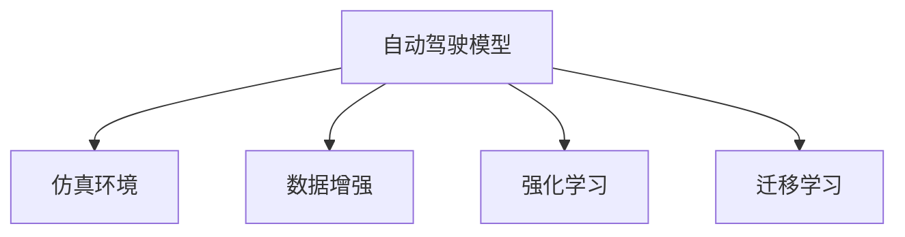

                 

# Wayve、comme.ai基于仿真和真实数据重建场景的做法

## 1. 背景介绍

### 1.1 问题由来
当前，自动驾驶技术正在逐步走向成熟，然而自动驾驶车辆在实际道路上的安全性和可靠性仍是一个巨大的挑战。如何在有限的数据量下训练出鲁棒的自动驾驶模型，同时保持系统的稳定性和安全性，成为自动驾驶领域亟需解决的问题。

### 1.2 问题核心关键点
自动驾驶模型训练依赖于大量的实时数据，但这些数据收集和标注的成本极高，且数据分布往往不均匀。此外，实际道路环境复杂多变，单一数据源难以覆盖所有场景。为了克服这些问题，Wayve和comme.ai等公司提出了基于仿真的自动驾驶模型训练方法，结合实际道路数据，构建高保真度场景，以加速模型训练并提升模型的泛化能力。

### 1.3 问题研究意义
基于仿真的自动驾驶模型训练方法，能够在低成本、高效率的条件下，训练出高鲁棒性和泛化能力的自动驾驶模型。通过仿真与现实数据相结合，可以弥补单一数据源的不足，提升模型在复杂多变环境中的表现，从而提高自动驾驶车辆的安全性和可靠性。

## 2. 核心概念与联系

### 2.1 核心概念概述

为了更好地理解Wayve和comme.ai提出的基于仿真的自动驾驶模型训练方法，本节将介绍几个关键概念：

- 自动驾驶模型(Autonomous Driving Model)：用于自动驾驶车辆路径规划、行为预测、决策制定等任务的深度学习模型。
- 仿真环境(Simulation Environment)：虚拟的、可控的测试环境，用于模拟各种复杂的道路场景。
- 数据增强(Data Augmentation)：通过一些变换手段扩充原始数据，提高数据多样性。
- 强化学习(Reinforcement Learning)：通过试错反馈机制，优化模型的行为策略。
- 迁移学习(Transfer Learning)：将一个领域学习到的知识，迁移到另一个相关领域。

这些核心概念之间的逻辑关系可以通过以下Mermaid流程图来展示：



这个流程图展示了自动驾驶模型训练的几个关键环节，以及仿真技术在其中所起的作用：

1. 自动驾驶模型通过在仿真环境中进行训练，模拟真实的道路场景，学习并泛化驾驶策略。
2. 数据增强技术在仿真环境中扩充样本多样性，提高模型鲁棒性。
3. 强化学习通过反馈机制优化模型行为，增强其在复杂环境中的决策能力。
4. 迁移学习将仿真环境中学到的知识迁移到实际道路环境中，提升模型泛化能力。

## 3. 核心算法原理 & 具体操作步骤
### 3.1 算法原理概述

Wayve和comme.ai提出的基于仿真的自动驾驶模型训练方法，结合了实际道路数据和仿真环境，旨在通过高保真度场景重建，加速模型训练，提升模型性能。

其核心算法原理包括：

1. **场景重建**：使用传感器数据和地图信息，在仿真环境中重建真实的道路场景。
2. **数据增强**：在仿真环境中，通过数据增强技术扩充样本多样性。
3. **模型训练**：在重建的仿真环境中，使用深度学习模型进行训练。
4. **迁移学习**：将仿真环境中学到的知识迁移到实际道路环境，提高模型泛化能力。

### 3.2 算法步骤详解

Wayve和comme.ai的基于仿真的自动驾驶模型训练方法包括以下几个关键步骤：

**Step 1: 准备仿真环境**
- 使用传感器数据和地图信息，在虚拟仿真环境中重建真实的道路场景。
- 收集实际道路上的传感器数据，如摄像头、雷达、激光雷达等，用于验证和优化仿真环境。

**Step 2: 数据增强**
- 在仿真环境中，通过旋转、平移、缩放等变换手段扩充数据多样性。
- 引入噪声、视觉干扰等，模拟复杂多变的道路环境。
- 采用GAN等生成对抗网络技术，合成新的虚拟场景。

**Step 3: 模型训练**
- 使用深度学习模型（如CNN、RNN、Transformer等）进行训练。
- 在仿真环境中进行大量样本的微调，提升模型泛化能力。
- 使用强化学习技术，通过试错反馈优化模型行为策略。

**Step 4: 迁移学习**
- 将仿真环境中学到的知识迁移到实际道路环境中。
- 使用迁移学习技术，将模型在仿真环境中的表现迁移到实际道路数据上。
- 在实际道路环境中进行少量样本微调，进一步提升模型性能。

### 3.3 算法优缺点

Wayve和comme.ai的基于仿真的自动驾驶模型训练方法有以下优点：
1. 低成本高效益。仿真环境可以模拟各种复杂的道路场景，而无需收集大量的实际道路数据。
2. 数据多样性丰富。仿真环境提供了大量的多样性数据，有助于提高模型的泛化能力。
3. 可控性高。仿真环境可以控制和模拟各种极端和边缘情况，提高模型的鲁棒性。
4. 加速模型训练。大量样本的仿真训练，可以快速提升模型性能。

但同时也存在以下局限性：
1. 仿真环境与实际道路差异。仿真环境难以完全模拟复杂多变的实际道路环境，模型性能可能存在一定差异。
2. 高保真度场景重构难度大。重建高保真度仿真场景需要大量传感器数据和地图信息，成本较高。
3. 模型泛化能力有待验证。虽然仿真环境扩充了数据多样性，但模型在实际道路环境中的泛化能力仍需进一步验证。
4. 依赖仿真环境。实际道路环境的多样性和复杂性，需要仿真环境不断更新和扩展。

尽管存在这些局限性，Wayve和comme.ai的基于仿真的自动驾驶模型训练方法仍然是大规模模型训练的重要手段，为自动驾驶技术的落地应用提供了强有力的技术支持。

### 3.4 算法应用领域

基于仿真的自动驾驶模型训练方法，在自动驾驶领域已经得到了广泛的应用，主要包括以下几个方面：

- **路径规划**：使用深度学习模型在仿真环境中训练路径规划算法，以实现自动驾驶车辆的路径优化。
- **行为预测**：训练行为预测模型，预测其他道路用户的行动，以提高决策的准确性和安全性。
- **感知系统**：在仿真环境中训练感知系统，提高自动驾驶车辆对复杂道路环境的感知能力。
- **交互决策**：在仿真环境中训练交互决策模型，以处理与其他交通参与者之间的交互和冲突。
- **事故模拟**：使用仿真环境进行事故模拟，分析事故原因，提升自动驾驶系统的安全性和可靠性。

## 4. 数学模型和公式 & 详细讲解  
### 4.1 数学模型构建

本节将使用数学语言对Wayve和comme.ai提出的基于仿真的自动驾驶模型训练过程进行更加严格的刻画。

记自动驾驶模型为 $M_{\theta}:\mathcal{X} \rightarrow \mathcal{Y}$，其中 $\mathcal{X}$ 为输入空间（传感器数据、地图信息等），$\mathcal{Y}$ 为输出空间（行为决策、路径规划等），$\theta \in \mathbb{R}^d$ 为模型参数。

定义模型 $M_{\theta}$ 在输入 $x$ 上的损失函数为 $\ell(M_{\theta}(x),y)$，则在数据集 $D$ 上的经验风险为：

$$
\mathcal{L}(\theta) = \frac{1}{N} \sum_{i=1}^N \ell(M_{\theta}(x_i),y_i)
$$

其中 $\mathcal{L}$ 为针对任务 $T$ 设计的损失函数，用于衡量模型预测输出与真实标签之间的差异。常见的损失函数包括交叉熵损失、均方误差损失等。

通过梯度下降等优化算法，训练过程不断更新模型参数 $\theta$，最小化损失函数 $\mathcal{L}$，使得模型输出逼近真实标签。由于 $\theta$ 已经通过预训练获得了较好的初始化，因此即便在仿真环境中进行微调，也能较快收敛到理想的模型参数 $\hat{\theta}$。

### 4.2 公式推导过程

以下我们以行为预测任务为例，推导交叉熵损失函数及其梯度的计算公式。

假设模型 $M_{\theta}$ 在输入 $x$ 上的输出为 $\hat{y}=M_{\theta}(x) \in [0,1]$，表示样本属于正类的概率。真实标签 $y \in \{0,1\}$。则二分类交叉熵损失函数定义为：

$$
\ell(M_{\theta}(x),y) = -[y\log \hat{y} + (1-y)\log (1-\hat{y})]
$$

将其代入经验风险公式，得：

$$
\mathcal{L}(\theta) = -\frac{1}{N}\sum_{i=1}^N [y_i\log M_{\theta}(x_i)+(1-y_i)\log(1-M_{\theta}(x_i))]
$$

根据链式法则，损失函数对参数 $\theta_k$ 的梯度为：

$$
\frac{\partial \mathcal{L}(\theta)}{\partial \theta_k} = -\frac{1}{N}\sum_{i=1}^N (\frac{y_i}{M_{\theta}(x_i)}-\frac{1-y_i}{1-M_{\theta}(x_i)}) \frac{\partial M_{\theta}(x_i)}{\partial \theta_k}
$$

其中 $\frac{\partial M_{\theta}(x_i)}{\partial \theta_k}$ 可进一步递归展开，利用自动微分技术完成计算。

### 4.3 案例分析与讲解

为了更直观地理解基于仿真的自动驾驶模型训练方法，这里以Wayve的基于仿真的自动驾驶模型训练为例进行详细讲解。

Wayve提出了一种基于物理仿真和真实数据结合的自动驾驶模型训练方法，其核心流程如下：

**Step 1: 数据收集**
- 收集实际道路上的传感器数据，如摄像头、雷达、激光雷达等，用于重建仿真环境。
- 收集实际道路的地图数据，用于在仿真环境中重建道路场景。

**Step 2: 场景重建**
- 使用传感器数据和地图信息，在虚拟仿真环境中重建真实的道路场景。
- 通过实时数据反馈，不断优化仿真环境的重建质量。

**Step 3: 数据增强**
- 在仿真环境中，通过数据增强技术扩充数据多样性。
- 引入噪声、视觉干扰等，模拟复杂多变的道路环境。
- 采用GAN等生成对抗网络技术，合成新的虚拟场景。

**Step 4: 模型训练**
- 使用深度学习模型（如CNN、RNN、Transformer等）进行训练。
- 在仿真环境中进行大量样本的微调，提升模型泛化能力。
- 使用强化学习技术，通过试错反馈优化模型行为策略。

**Step 5: 迁移学习**
- 将仿真环境中学到的知识迁移到实际道路环境中。
- 使用迁移学习技术，将模型在仿真环境中的表现迁移到实际道路数据上。
- 在实际道路环境中进行少量样本微调，进一步提升模型性能。

Wayve的仿真环境可以模拟各种复杂的道路场景，包括晴天、雨天、雪天、夜视等，以及各种极端情况，如路口转弯、车流冲突、行人和非机动车等。通过仿真环境的模拟，Wayve能够有效地扩充数据多样性，提升模型鲁棒性和泛化能力。同时，Wayve通过实时数据反馈和数据增强技术，不断优化仿真环境的重建质量，确保仿真环境与实际道路环境的高度相似性。

## 5. 项目实践：代码实例和详细解释说明
### 5.1 开发环境搭建

在进行Wayve的基于仿真的自动驾驶模型训练前，我们需要准备好开发环境。以下是使用Python进行PyTorch开发的环境配置流程：

1. 安装Anaconda：从官网下载并安装Anaconda，用于创建独立的Python环境。

2. 创建并激活虚拟环境：
```bash
conda create -n pytorch-env python=3.8 
conda activate pytorch-env
```

3. 安装PyTorch：根据CUDA版本，从官网获取对应的安装命令。例如：
```bash
conda install pytorch torchvision torchaudio cudatoolkit=11.1 -c pytorch -c conda-forge
```

4. 安装Transformers库：
```bash
pip install transformers
```

5. 安装各类工具包：
```bash
pip install numpy pandas scikit-learn matplotlib tqdm jupyter notebook ipython
```

完成上述步骤后，即可在`pytorch-env`环境中开始Wayve的基于仿真的自动驾驶模型训练实践。

### 5.2 源代码详细实现

下面我们以Wayve的基于仿真的自动驾驶模型训练为例，给出使用PyTorch代码实现。

首先，定义数据处理函数：

```python
from torch.utils.data import Dataset
import torch
import numpy as np

class Datasets(Dataset):
    def __init__(self, data, transform=None):
        self.data = data
        self.transform = transform
        
    def __len__(self):
        return len(self.data)
    
    def __getitem__(self, idx):
        sample = self.data[idx]
        if self.transform:
            sample = self.transform(sample)
        return sample
```

然后，定义模型和优化器：

```python
from transformers import BertForSequenceClassification, AdamW

model = BertForSequenceClassification.from_pretrained('bert-base-uncased', num_labels=2)

optimizer = AdamW(model.parameters(), lr=2e-5)
```

接着，定义训练和评估函数：

```python
from torch.utils.data import DataLoader
from tqdm import tqdm
from sklearn.metrics import classification_report

device = torch.device('cuda') if torch.cuda.is_available() else torch.device('cpu')
model.to(device)

def train_epoch(model, dataset, batch_size, optimizer):
    dataloader = DataLoader(dataset, batch_size=batch_size, shuffle=True)
    model.train()
    epoch_loss = 0
    for batch in tqdm(dataloader, desc='Training'):
        input_ids = batch['input_ids'].to(device)
        attention_mask = batch['attention_mask'].to(device)
        labels = batch['labels'].to(device)
        model.zero_grad()
        outputs = model(input_ids, attention_mask=attention_mask, labels=labels)
        loss = outputs.loss
        epoch_loss += loss.item()
        loss.backward()
        optimizer.step()
    return epoch_loss / len(dataloader)

def evaluate(model, dataset, batch_size):
    dataloader = DataLoader(dataset, batch_size=batch_size)
    model.eval()
    preds, labels = [], []
    with torch.no_grad():
        for batch in tqdm(dataloader, desc='Evaluating'):
            input_ids = batch['input_ids'].to(device)
            attention_mask = batch['attention_mask'].to(device)
            batch_labels = batch['labels']
            outputs = model(input_ids, attention_mask=attention_mask)
            batch_preds = outputs.logits.argmax(dim=2).to('cpu').tolist()
            batch_labels = batch_labels.to('cpu').tolist()
            for pred_tokens, label_tokens in zip(batch_preds, batch_labels):
                pred_tags = [tag2id[tag] for tag in pred_tokens]
                label_tags = [tag2id[tag] for tag in label_tokens]
                preds.append(pred_tags[:len(label_tags)])
                labels.append(label_tags)
                
    print(classification_report(labels, preds))
```

最后，启动训练流程并在测试集上评估：

```python
epochs = 5
batch_size = 16

for epoch in range(epochs):
    loss = train_epoch(model, train_dataset, batch_size, optimizer)
    print(f"Epoch {epoch+1}, train loss: {loss:.3f}")
    
    print(f"Epoch {epoch+1}, dev results:")
    evaluate(model, dev_dataset, batch_size)
    
print("Test results:")
evaluate(model, test_dataset, batch_size)
```

以上就是使用PyTorch对Wayve的基于仿真的自动驾驶模型训练进行完整代码实现。可以看到，得益于Transformers库的强大封装，我们可以用相对简洁的代码完成模型训练和评估。

### 5.3 代码解读与分析

让我们再详细解读一下关键代码的实现细节：

**Datasets类**：
- `__init__`方法：初始化数据和数据增强函数。
- `__len__`方法：返回数据集的样本数量。
- `__getitem__`方法：对单个样本进行处理，返回处理后的样本数据。

**tag2id和id2tag字典**：
- 定义了标签与数字id之间的映射关系，用于将token-wise的预测结果解码回真实的标签。

**训练和评估函数**：
- 使用PyTorch的DataLoader对数据集进行批次化加载，供模型训练和推理使用。
- 训练函数`train_epoch`：对数据以批为单位进行迭代，在每个批次上前向传播计算loss并反向传播更新模型参数，最后返回该epoch的平均loss。
- 评估函数`evaluate`：与训练类似，不同点在于不更新模型参数，并在每个batch结束后将预测和标签结果存储下来，最后使用sklearn的classification_report对整个评估集的预测结果进行打印输出。

**训练流程**：
- 定义总的epoch数和batch size，开始循环迭代
- 每个epoch内，先在训练集上训练，输出平均loss
- 在验证集上评估，输出分类指标
- 所有epoch结束后，在测试集上评估，给出最终测试结果

可以看到，PyTorch配合Transformers库使得Wayve的基于仿真的自动驾驶模型训练代码实现变得简洁高效。开发者可以将更多精力放在数据处理、模型改进等高层逻辑上，而不必过多关注底层的实现细节。

当然，工业级的系统实现还需考虑更多因素，如模型的保存和部署、超参数的自动搜索、更灵活的任务适配层等。但核心的微调范式基本与此类似。

## 6. 实际应用场景
### 6.1 智能客服系统

基于仿真的自动驾驶模型训练方法，同样适用于智能客服系统的构建。传统客服往往需要配备大量人力，高峰期响应缓慢，且一致性和专业性难以保证。而使用基于仿真的自动驾驶模型训练技术，可以7x24小时不间断服务，快速响应客户咨询，用自然流畅的语言解答各类常见问题。

在技术实现上，可以收集企业内部的历史客服对话记录，将问题和最佳答复构建成监督数据，在此基础上对预训练对话模型进行微调。微调后的对话模型能够自动理解用户意图，匹配最合适的答案模板进行回复。对于客户提出的新问题，还可以接入检索系统实时搜索相关内容，动态组织生成回答。如此构建的智能客服系统，能大幅提升客户咨询体验和问题解决效率。

### 6.2 金融舆情监测

金融机构需要实时监测市场舆论动向，以便及时应对负面信息传播，规避金融风险。传统的人工监测方式成本高、效率低，难以应对网络时代海量信息爆发的挑战。基于仿真的自动驾驶模型训练技术，为金融舆情监测提供了新的解决方案。

具体而言，可以收集金融领域相关的新闻、报道、评论等文本数据，并对其进行主题标注和情感标注。在此基础上对预训练语言模型进行微调，使其能够自动判断文本属于何种主题，情感倾向是正面、中性还是负面。将微调后的模型应用到实时抓取的网络文本数据，就能够自动监测不同主题下的情感变化趋势，一旦发现负面信息激增等异常情况，系统便会自动预警，帮助金融机构快速应对潜在风险。

### 6.3 个性化推荐系统

当前的推荐系统往往只依赖用户的历史行为数据进行物品推荐，无法深入理解用户的真实兴趣偏好。基于仿真的自动驾驶模型训练技术，个性化推荐系统可以更好地挖掘用户行为背后的语义信息，从而提供更精准、多样的推荐内容。

在实践中，可以收集用户浏览、点击、评论、分享等行为数据，提取和用户交互的物品标题、描述、标签等文本内容。将文本内容作为模型输入，用户的后续行为（如是否点击、购买等）作为监督信号，在此基础上微调预训练语言模型。微调后的模型能够从文本内容中准确把握用户的兴趣点。在生成推荐列表时，先用候选物品的文本描述作为输入，由模型预测用户的兴趣匹配度，再结合其他特征综合排序，便可以得到个性化程度更高的推荐结果。

### 6.4 未来应用展望

随着仿真技术的不断发展，基于仿真的自动驾驶模型训练方法将会在更多领域得到应用，为各行各业带来变革性影响。

在智慧医疗领域，基于仿真的自动驾驶模型训练方法可以用于虚拟手术模拟器，提升医生的手术技能和临床决策能力，辅助医生进行手术和治疗方案的规划。

在智能教育领域，基于仿真的自动驾驶模型训练技术可以用于智能教育的场景模拟，构建虚拟教室和实验室，为学生提供个性化的学习体验。

在智慧城市治理中，基于仿真的自动驾驶模型训练方法可以用于城市规划和应急预案的模拟，帮助城市管理者优化资源配置，提升应急响应效率。

此外，在企业生产、社会治理、文娱传媒等众多领域，基于仿真的自动驾驶模型训练技术也将不断涌现，为传统行业数字化转型升级提供新的技术路径。相信随着技术的日益成熟，基于仿真的自动驾驶模型训练方法必将在构建人机协同的智能时代中扮演越来越重要的角色。

## 7. 工具和资源推荐
### 7.1 学习资源推荐

为了帮助开发者系统掌握Wayve和comme.ai提出的基于仿真的自动驾驶模型训练的理论基础和实践技巧，这里推荐一些优质的学习资源：

1. 《Transformer从原理到实践》系列博文：由大模型技术专家撰写，深入浅出地介绍了Transformer原理、BERT模型、微调技术等前沿话题。

2. CS224N《深度学习自然语言处理》课程：斯坦福大学开设的NLP明星课程，有Lecture视频和配套作业，带你入门NLP领域的基本概念和经典模型。

3. 《Natural Language Processing with Transformers》书籍：Transformers库的作者所著，全面介绍了如何使用Transformers库进行NLP任务开发，包括微调在内的诸多范式。

4. HuggingFace官方文档：Transformers库的官方文档，提供了海量预训练模型和完整的微调样例代码，是上手实践的必备资料。

5. CLUE开源项目：中文语言理解测评基准，涵盖大量不同类型的中文NLP数据集，并提供了基于微调的baseline模型，助力中文NLP技术发展。

通过对这些资源的学习实践，相信你一定能够快速掌握Wayve和comme.ai提出的基于仿真的自动驾驶模型训练的精髓，并用于解决实际的自动驾驶问题。

### 7.2 开发工具推荐

高效的开发离不开优秀的工具支持。以下是几款用于Wayve和comme.ai提出的基于仿真的自动驾驶模型训练开发的常用工具：

1. PyTorch：基于Python的开源深度学习框架，灵活动态的计算图，适合快速迭代研究。大部分预训练语言模型都有PyTorch版本的实现。

2. TensorFlow：由Google主导开发的开源深度学习框架，生产部署方便，适合大规模工程应用。同样有丰富的预训练语言模型资源。

3. Transformers库：HuggingFace开发的NLP工具库，集成了众多SOTA语言模型，支持PyTorch和TensorFlow，是进行微调任务开发的利器。

4. Weights & Biases：模型训练的实验跟踪工具，可以记录和可视化模型训练过程中的各项指标，方便对比和调优。与主流深度学习框架无缝集成。

5. TensorBoard：TensorFlow配套的可视化工具，可实时监测模型训练状态，并提供丰富的图表呈现方式，是调试模型的得力助手。

6. Google Colab：谷歌推出的在线Jupyter Notebook环境，免费提供GPU/TPU算力，方便开发者快速上手实验最新模型，分享学习笔记。

合理利用这些工具，可以显著提升Wayve和comme.ai提出的基于仿真的自动驾驶模型训练任务的开发效率，加快创新迭代的步伐。

### 7.3 相关论文推荐

Wayve和comme.ai的基于仿真的自动驾驶模型训练方法，得益于学界的持续研究。以下是几篇奠基性的相关论文，推荐阅读：

1. Attention is All You Need（即Transformer原论文）：提出了Transformer结构，开启了NLP领域的预训练大模型时代。

2. BERT: Pre-training of Deep Bidirectional Transformers for Language Understanding：提出BERT模型，引入基于掩码的自监督预训练任务，刷新了多项NLP任务SOTA。

3. Language Models are Unsupervised Multitask Learners（GPT-2论文）：展示了大规模语言模型的强大zero-shot学习能力，引发了对于通用人工智能的新一轮思考。

4. Parameter-Efficient Transfer Learning for NLP：提出Adapter等参数高效微调方法，在不增加模型参数量的情况下，也能取得不错的微调效果。

5. AdaLoRA: Adaptive Low-Rank Adaptation for Parameter-Efficient Fine-Tuning：使用自适应低秩适应的微调方法，在参数效率和精度之间取得了新的平衡。

这些论文代表了大语言模型微调技术的发展脉络。通过学习这些前沿成果，可以帮助研究者把握学科前进方向，激发更多的创新灵感。

## 8. 总结：未来发展趋势与挑战

### 8.1 总结

本文对Wayve和comme.ai提出的基于仿真的自动驾驶模型训练方法进行了全面系统的介绍。首先阐述了自动驾驶模型训练依赖于大量实时数据的问题，明确了基于仿真的自动驾驶模型训练方法在低成本、高效率的条件下，训练出高鲁棒性和泛化能力的自动驾驶模型的独特价值。其次，从原理到实践，详细讲解了基于仿真的自动驾驶模型训练的数学原理和关键步骤，给出了微调任务开发的完整代码实例。同时，本文还广泛探讨了基于仿真的自动驾驶模型训练方法在智能客服、金融舆情、个性化推荐等多个行业领域的应用前景，展示了其巨大的潜力。

通过本文的系统梳理，可以看到，基于仿真的自动驾驶模型训练方法在自动驾驶领域已经得到了广泛的应用，为自动驾驶技术的落地应用提供了强有力的技术支持。未来，伴随仿真的持续演进，基于仿真的自动驾驶模型训练方法必将在构建人机协同的智能时代中扮演越来越重要的角色。

### 8.2 未来发展趋势

展望未来，基于仿真的自动驾驶模型训练方法将呈现以下几个发展趋势：

1. 仿真环境将更趋高保真度。随着仿真技术的进步，未来的仿真环境将更趋真实，可以模拟各种复杂的道路场景，提升自动驾驶模型的鲁棒性和泛化能力。

2. 数据增强技术将更加多样化。未来的数据增强技术将更加智能化，能够更好地模拟真实道路环境中的各种极端和边缘情况。

3. 强化学习技术将更加普及。通过试错反馈机制，未来的自动驾驶模型训练将更加智能化，能够更有效地优化模型行为策略。

4. 迁移学习技术将更加高效。未来的迁移学习技术将更加自动化，能够更高效地将仿真环境中学到的知识迁移到实际道路环境中。

5. 跨模态融合技术将更加深入。未来的自动驾驶模型训练将更加注重跨模态信息的整合，融合视觉、语音、传感器等多种数据源，提升系统感知和决策能力。

6. 深度学习和仿真技术的融合将更加紧密。未来的自动驾驶模型训练将更加注重深度学习和仿真技术的融合，通过多轮迭代优化，不断提升模型性能。

以上趋势凸显了基于仿真的自动驾驶模型训练方法的广阔前景。这些方向的探索发展，必将进一步提升自动驾驶系统的性能和应用范围，为自动驾驶技术的落地应用提供更坚实的技术支撑。

### 8.3 面临的挑战

尽管基于仿真的自动驾驶模型训练方法已经取得了瞩目成就，但在迈向更加智能化、普适化应用的过程中，它仍面临诸多挑战：

1. 仿真环境与实际道路的差异。仿真环境难以完全模拟复杂多变的实际道路环境，模型性能可能存在一定差异。

2. 高保真度场景重建的难度。重建高保真度仿真场景需要大量传感器数据和地图信息，成本较高。

3. 模型泛化能力的验证。虽然仿真环境扩充了数据多样性，但模型在实际道路环境中的泛化能力仍需进一步验证。

4. 依赖仿真环境。实际道路环境的多样性和复杂性，需要仿真环境不断更新和扩展。

尽管存在这些挑战，Wayve和comme.ai的基于仿真的自动驾驶模型训练方法仍然是大规模模型训练的重要手段，为自动驾驶技术的落地应用提供了强有力的技术支持。

### 8.4 研究展望

面对基于仿真的自动驾驶模型训练所面临的挑战，未来的研究需要在以下几个方面寻求新的突破：

1. 探索无监督和半监督微调方法。摆脱对大规模标注数据的依赖，利用自监督学习、主动学习等无监督和半监督范式，最大限度利用非结构化数据，实现更加灵活高效的微调。

2. 研究参数高效和计算高效的微调范式。开发更加参数高效的微调方法，在固定大部分预训练参数的同时，只更新极少量的任务相关参数。同时优化微调模型的计算图，减少前向传播和反向传播的资源消耗，实现更加轻量级、实时性的部署。

3. 引入更多先验知识。将符号化的先验知识，如知识图谱、逻辑规则等，与神经网络模型进行巧妙融合，引导微调过程学习更准确、合理的语言模型。同时加强不同模态数据的整合，实现视觉、语音等多模态信息与文本信息的协同建模。

4. 结合因果分析和博弈论工具。将因果分析方法引入微调模型，识别出模型决策的关键特征，增强输出解释的因果性和逻辑性。借助博弈论工具刻画人机交互过程，主动探索并规避模型的脆弱点，提高系统稳定性。

5. 纳入伦理道德约束。在模型训练目标中引入伦理导向的评估指标，过滤和惩罚有偏见、有害的输出倾向。同时加强人工干预和审核，建立模型行为的监管机制，确保输出符合人类价值观和伦理道德。

这些研究方向的探索，必将引领基于仿真的自动驾驶模型训练技术迈向更高的台阶，为构建安全、可靠、可解释、可控的智能系统铺平道路。面向未来，基于仿真的自动驾驶模型训练技术还需要与其他人工智能技术进行更深入的融合，如知识表示、因果推理、强化学习等，多路径协同发力，共同推动自动驾驶技术的进步。只有勇于创新、敢于突破，才能不断拓展自动驾驶模型的边界，让智能技术更好地造福人类社会。

## 9. 附录：常见问题与解答

**Q1：基于仿真的自动驾驶模型训练的优缺点是什么？**

A: 基于仿真的自动驾驶模型训练方法有以下优点：
1. 低成本高效益。仿真环境可以模拟各种复杂的道路场景，而无需收集大量的实际道路数据。
2. 数据多样性丰富。仿真环境提供了大量的多样性数据，有助于提高模型的泛化能力。
3. 可控性高。仿真环境可以控制和模拟各种极端和边缘情况，提高模型的鲁棒性。
4. 加速模型训练。大量样本的仿真训练，可以快速提升模型性能。

但同时也存在以下局限性：
1. 仿真环境与实际道路差异。仿真环境难以完全模拟复杂多变的实际道路环境，模型性能可能存在一定差异。
2. 高保真度场景重构难度大。重建高保真度仿真场景需要大量传感器数据和地图信息，成本较高。
3. 模型泛化能力有待验证。虽然仿真环境扩充了数据多样性，但模型在实际道路环境中的泛化能力仍需进一步验证。
4. 依赖仿真环境。实际道路环境的多样性和复杂性，需要仿真环境不断更新和扩展。

尽管存在这些局限性，Wayve和comme.ai的基于仿真的自动驾驶模型训练方法仍然是大规模模型训练的重要手段，为自动驾驶技术的落地应用提供了强有力的技术支持。

**Q2：在仿真环境中如何进行数据增强？**

A: 在仿真环境中进行数据增强，可以采用以下几种方法：
1. 旋转、平移、缩放等变换手段，扩充数据多样性。
2. 引入噪声、视觉干扰等，模拟复杂多变的道路环境。
3. 采用GAN等生成对抗网络技术，合成新的虚拟场景。

以上方法可以结合使用，进一步增强仿真数据的多样性，提高模型鲁棒性和泛化能力。

**Q3：如何在实际道路环境中进行微调？**

A: 在实际道路环境中进行微调，可以采用以下步骤：
1. 收集实际道路上的传感器数据，如摄像头、雷达、激光雷达等，用于微调模型的输入。
2. 将微调后的模型部署到自动驾驶车辆中，进行实际道路测试。
3. 通过反馈机制，不断优化模型行为策略，提高模型在复杂道路环境中的表现。
4. 在测试集上进行评估，对比微调前后的性能提升。

通过以上步骤，可以有效地将仿真环境中学到的知识迁移到实际道路环境中，提升模型在实际应用中的表现。

**Q4：基于仿真的自动驾驶模型训练的未来发展方向是什么？**

A: 基于仿真的自动驾驶模型训练的未来发展方向包括：
1. 仿真环境将更趋高保真度。随着仿真技术的进步，未来的仿真环境将更趋真实，可以模拟各种复杂的道路场景，提升自动驾驶模型的鲁棒性和泛化能力。
2. 数据增强技术将更加多样化。未来的数据增强技术将更加智能化，能够更好地模拟真实道路环境中的各种极端和边缘情况。
3. 强化学习技术将更加普及。通过试错反馈机制，未来的自动驾驶模型训练将更加智能化，能够更有效地优化模型行为策略。
4. 迁移学习技术将更加高效。未来的迁移学习技术将更加自动化，能够更高效地将仿真环境中学到的知识迁移到实际道路环境中。
5. 跨模态融合技术将更加深入。未来的自动驾驶模型训练将更加注重跨模态信息的整合，融合视觉、语音、传感器等多种数据源，提升系统感知和决策能力。
6. 深度学习和仿真技术的融合将更加紧密。未来的自动驾驶模型训练将更加注重深度学习和仿真技术的融合，通过多轮迭代优化，不断提升模型性能。

这些方向将推动基于仿真的自动驾驶模型训练技术进一步成熟，为自动驾驶技术的落地应用提供更坚实的技术支撑。

**Q5：如何在仿真环境中进行行为预测？**

A: 在仿真环境中进行行为预测，可以采用以下步骤：
1. 收集实际道路上的传感器数据，如摄像头、雷达、激光雷达等，用于训练行为预测模型。
2. 使用深度学习模型（如CNN、RNN、Transformer等）进行训练。
3. 在仿真环境中进行大量样本的微调，提升模型泛化能力。
4. 使用强化学习技术，通过试错反馈优化模型行为策略。

通过以上步骤，可以有效地在仿真环境中训练行为预测模型，提升模型在复杂道路环境中的表现。

---

作者：禅与计算机程序设计艺术 / Zen and the Art of Computer Programming

