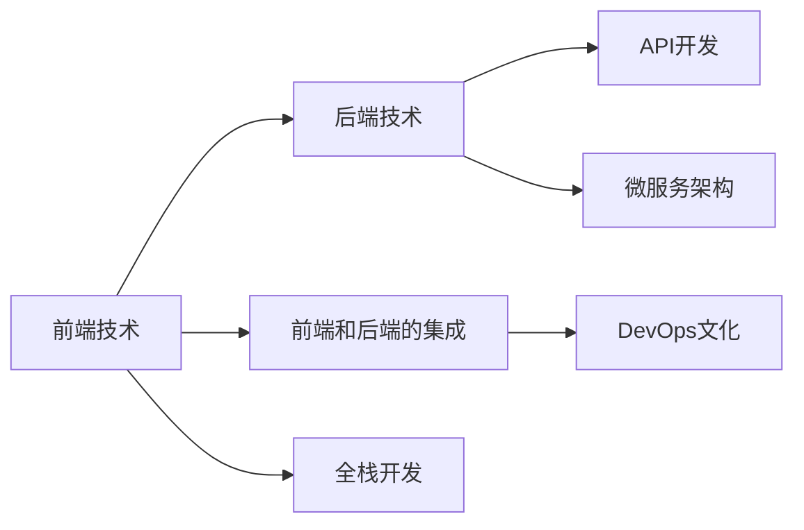

                 

# Web 应用程序开发：前端和后端

> 关键词：Web开发，前端技术，后端技术，前后端集成，全栈开发，前端框架，后端框架，API开发，DevOps，微服务，DevOps文化

## 1. 背景介绍

在当今数字化时代，Web应用程序开发已成为企业数字化转型的核心驱动力。无论是电商、社交媒体、在线教育，还是金融服务、医疗健康等领域，Web应用程序都在不断推动各行业向数字化方向迈进。然而，Web应用程序开发涉及到的技术栈复杂、协同团队多样，如何才能高效、顺畅地完成项目开发，成为每个Web开发者面临的重要问题。本文将从Web开发的基础概念、核心技术和前沿实践三个方面，系统梳理Web应用程序开发的知识体系，旨在为读者提供一条从入门到精通的全面指南。

## 2. 核心概念与联系

### 2.1 核心概念概述

Web开发的核心在于构建一个高效、稳定的Web应用程序，其核心概念包括：

- **前端技术**：负责用户交互和数据渲染。包括HTML、CSS、JavaScript等技术。
- **后端技术**：负责数据处理和业务逻辑。包括数据库、服务器、API等技术。
- **前端和后端的集成**：通过AJAX、WebSocket等技术实现数据交互。
- **全栈开发**：涵盖前端和后端的所有开发工作，需具备前后端知识。
- **前后端框架**：如React、Vue.js等前端框架，以及Node.js、Flask等后端框架。
- **API开发**：构建RESTful API，实现前后端数据交换。
- **DevOps文化**：持续集成、持续交付，提升开发效率和产品发布速度。
- **微服务架构**：将应用程序拆分为多个小服务，提升系统的扩展性和灵活性。

这些核心概念构成了Web应用程序开发的基础，相互关联、相互影响，共同构建起一个完整的Web开发生态。

### 2.2 核心概念原理和架构的 Mermaid 流程图



## 3. 核心算法原理 & 具体操作步骤

### 3.1 算法原理概述

Web应用程序开发涉及到多个技术栈和开发环节，包括前端技术、后端技术、API开发、DevOps实践等。核心算法原理主要围绕以下几个方面：

1. **前端技术**：使用HTML、CSS、JavaScript等技术，实现用户交互和数据渲染。
2. **后端技术**：通过数据库、服务器、API等技术，实现数据的处理和存储，以及业务逻辑的实现。
3. **前后端集成**：通过AJAX、WebSocket等技术，实现前后端数据交互。
4. **API开发**：构建RESTful API，实现前后端数据交换，提升数据共享效率。
5. **DevOps文化**：通过持续集成、持续交付等实践，提升开发效率和产品发布速度。
6. **微服务架构**：将应用程序拆分为多个小服务，提升系统的扩展性和灵活性。

### 3.2 算法步骤详解

以下是Web应用程序开发的核心算法步骤详解：

#### 3.2.1 前端开发

1. **需求分析**：与产品经理、用户代表等进行沟通，明确需求和功能。
2. **设计原型**：使用Sketch、Figma等工具设计前端原型。
3. **编写代码**：使用HTML、CSS、JavaScript等技术实现原型，添加交互效果。
4. **测试与优化**：在本地测试前端代码，发现并修复问题，提升用户体验。
5. **部署上线**：使用CI/CD工具，如GitHub Actions、Jenkins等，将前端代码部署到服务器。

#### 3.2.2 后端开发

1. **需求分析**：与产品经理、用户代表等进行沟通，明确需求和功能。
2. **设计架构**：设计后端架构，包括数据库设计、服务器选择等。
3. **编写代码**：使用Node.js、Python、Java等语言，实现后端逻辑和业务功能。
4. **测试与优化**：在本地测试后端代码，发现并修复问题，提升系统性能。
5. **部署上线**：使用CI/CD工具，如GitHub Actions、Jenkins等，将后端代码部署到服务器。

#### 3.2.3 API开发

1. **需求分析**：与产品经理、用户代表等进行沟通，明确API接口需求。
2. **设计接口**：设计RESTful API接口，包括接口地址、请求方法、参数等。
3. **编写代码**：使用Express、Flask等框架，实现API接口逻辑和业务功能。
4. **测试与优化**：使用Postman等工具测试API接口，发现并修复问题，提升接口性能。
5. **部署上线**：使用CI/CD工具，如GitHub Actions、Jenkins等，将API接口部署到服务器。

#### 3.2.4 DevOps实践

1. **版本控制**：使用Git等版本控制工具，管理代码变更。
2. **持续集成**：使用CI/CD工具，如Jenkins、GitHub Actions等，实现代码的自动化测试和构建。
3. **持续交付**：使用CD工具，将通过测试的代码部署到生产环境。
4. **监控告警**：使用ELK Stack、Prometheus等工具，实时监控系统状态，设置告警阈值。
5. **自动化运维**：使用Ansible、Puppet等工具，自动化系统配置和维护。

#### 3.2.5 微服务架构

1. **服务拆分**：将应用程序拆分为多个独立的服务，每个服务负责一部分功能。
2. **服务注册**：使用Eureka、Consul等工具，注册和管理微服务。
3. **服务发现**：使用Ribbon、Zuul等工具，实现微服务间的服务发现和路由。
4. **服务通信**：使用HTTP、gRPC等协议，实现微服务间的通信。
5. **服务治理**：使用Spring Cloud、Service Mesh等工具，实现微服务的治理和管理。

### 3.3 算法优缺点

#### 3.3.1 前端开发的优缺点

- **优点**：
  - **用户体验**：前端技术直接与用户交互，能够提供更好的用户体验。
  - **数据渲染**：前端技术能够动态更新页面，提升数据展示效率。
  - **技术灵活**：前端技术选择多样，能够满足不同项目的开发需求。

- **缺点**：
  - **开发复杂**：前端技术栈复杂，开发难度较大。
  - **性能瓶颈**：前端渲染逻辑复杂，可能导致性能瓶颈。
  - **兼容性问题**：不同浏览器和设备对前端技术支持不一致，可能导致兼容性问题。

#### 3.3.2 后端开发的优缺点

- **优点**：
  - **数据处理**：后端技术能够高效处理大量数据，提升系统性能。
  - **业务逻辑**：后端技术能够实现复杂的业务逻辑，满足业务需求。
  - **可扩展性**：后端技术能够通过水平扩展提升系统性能。

- **缺点**：
  - **开发周期长**：后端技术栈复杂，开发周期较长。
  - **接口设计**：API接口设计不合理可能导致前后端沟通不畅。
  - **系统复杂**：后端系统复杂，维护难度大。

#### 3.3.3 API开发的优缺点

- **优点**：
  - **数据共享**：API接口能够实现前后端数据共享，提升数据利用率。
  - **系统解耦**：API接口能够实现前后端的解耦，提升系统灵活性。
  - **扩展性**：API接口能够方便地扩展和优化，提升系统性能。

- **缺点**：
  - **接口设计**：API接口设计不合理可能导致前后端沟通不畅。
  - **安全性**：API接口安全性问题可能导致系统漏洞。
  - **性能问题**：API接口设计不合理可能导致性能瓶颈。

#### 3.3.4 DevOps实践的优缺点

- **优点**：
  - **提高效率**：通过自动化工具，提升开发和部署效率。
  - **降低风险**：通过持续集成和持续交付，降低系统上线风险。
  - **优化流程**：通过DevOps实践，优化开发和运维流程，提升系统稳定性。

- **缺点**：
  - **工具复杂**：DevOps工具复杂，需要较高的技术水平。
  - **学习成本**：DevOps实践需要一定的学习成本，可能需要较长的过渡期。
  - **技术壁垒**：DevOps实践需要具备较高的技术水平，可能导致技术壁垒。

#### 3.3.5 微服务架构的优缺点

- **优点**：
  - **灵活性**：微服务架构能够提升系统的灵活性和扩展性。
  - **可维护性**：微服务架构能够提升系统的可维护性和可扩展性。
  - **容错性**：微服务架构能够提升系统的容错性和可靠性。

- **缺点**：
  - **系统复杂**：微服务架构系统复杂，开发和维护难度大。
  - **网络通信**：微服务架构需要通过网络通信实现服务间的交互，可能导致网络延迟和带宽消耗。
  - **分布式问题**：微服务架构需要处理分布式系统带来的各种问题，如数据一致性、事务管理等。

### 3.4 算法应用领域

Web应用程序开发涉及到的技术栈和开发环节众多，应用领域也非常广泛，涵盖以下几个方面：

- **电商**：构建电商网站，实现商品展示、购物车、支付等功能。
- **社交媒体**：构建社交媒体平台，实现用户注册、消息推送、内容发布等功能。
- **在线教育**：构建在线教育平台，实现课程展示、互动教学、学习评估等功能。
- **金融服务**：构建金融服务平台，实现账户管理、交易服务、风险控制等功能。
- **医疗健康**：构建医疗健康平台，实现预约挂号、在线问诊、健康管理等功能。
- **物联网**：构建物联网平台，实现设备互联、数据采集、智能控制等功能。
- **智能制造**：构建智能制造平台，实现生产管理、设备监控、质量控制等功能。

## 4. 数学模型和公式 & 详细讲解 & 举例说明

### 4.1 数学模型构建

Web应用程序开发涉及到的数学模型包括：

- **前端技术**：主要涉及用户体验模型，如交互次数、点击率等。
- **后端技术**：主要涉及数据处理模型，如数据读取、存储、查询等。
- **API开发**：主要涉及接口调用模型，如请求次数、响应时间等。
- **DevOps实践**：主要涉及系统监控模型，如系统指标、告警阈值等。
- **微服务架构**：主要涉及服务治理模型，如服务注册、路由、负载均衡等。

### 4.2 公式推导过程

以下是Web应用程序开发涉及到的核心公式推导过程：

#### 4.2.1 前端技术公式推导

- **用户体验模型**：
  - 交互次数：$C = \sum_{i=1}^N c_i$，其中 $c_i$ 表示第 $i$ 次交互的次数。
  - 点击率：$CR = \frac{C}{N}$，其中 $N$ 表示总的交互次数。

#### 4.2.2 后端技术公式推导

- **数据处理模型**：
  - 数据读取时间：$T_r = \frac{N}{R}$，其中 $N$ 表示数据量，$R$ 表示读取速度。
  - 数据存储时间：$T_s = \frac{N}{S}$，其中 $S$ 表示存储速度。
  - 数据查询时间：$T_q = \frac{N}{Q}$，其中 $Q$ 表示查询速度。

#### 4.2.3 API开发公式推导

- **接口调用模型**：
  - 请求次数：$R = \sum_{i=1}^N r_i$，其中 $r_i$ 表示第 $i$ 次请求的次数。
  - 响应时间：$T = \sum_{i=1}^N t_i$，其中 $t_i$ 表示第 $i$ 次响应的时间。

#### 4.2.4 DevOps实践公式推导

- **系统监控模型**：
  - 系统指标：$M = \sum_{i=1}^N m_i$，其中 $m_i$ 表示第 $i$ 次系统指标的值。
  - 告警阈值：$T = \frac{M}{K}$，其中 $K$ 表示告警阈值。

#### 4.2.5 微服务架构公式推导

- **服务治理模型**：
  - 服务注册数量：$S = \sum_{i=1}^N s_i$，其中 $s_i$ 表示第 $i$ 个服务的注册数量。
  - 服务路由数量：$R = \sum_{i=1}^N r_i$，其中 $r_i$ 表示第 $i$ 个服务的路由数量。
  - 负载均衡数量：$L = \sum_{i=1}^N l_i$，其中 $l_i$ 表示第 $i$ 个服务的负载均衡数量。

### 4.3 案例分析与讲解

#### 4.3.1 电商网站开发

电商网站开发涉及到的主要技术栈包括HTML、CSS、JavaScript、Node.js、Express等。开发流程如下：

1. **需求分析**：与产品经理、用户代表等进行沟通，明确需求和功能。
2. **设计原型**：使用Sketch、Figma等工具设计前端原型。
3. **编写代码**：使用HTML、CSS、JavaScript等技术实现原型，添加交互效果。
4. **测试与优化**：在本地测试前端代码，发现并修复问题，提升用户体验。
5. **部署上线**：使用CI/CD工具，如GitHub Actions、Jenkins等，将前端代码部署到服务器。

#### 4.3.2 社交媒体平台开发

社交媒体平台开发涉及到的主要技术栈包括HTML、CSS、JavaScript、Node.js、React等。开发流程如下：

1. **需求分析**：与产品经理、用户代表等进行沟通，明确需求和功能。
2. **设计原型**：使用Sketch、Figma等工具设计前端原型。
3. **编写代码**：使用React等前端框架实现原型，添加交互效果。
4. **测试与优化**：在本地测试前端代码，发现并修复问题，提升用户体验。
5. **部署上线**：使用CI/CD工具，如GitHub Actions、Jenkins等，将前端代码部署到服务器。

#### 4.3.3 在线教育平台开发

在线教育平台开发涉及到的主要技术栈包括HTML、CSS、JavaScript、Node.js、Express、MongoDB等。开发流程如下：

1. **需求分析**：与产品经理、用户代表等进行沟通，明确需求和功能。
2. **设计原型**：使用Sketch、Figma等工具设计前端原型。
3. **编写代码**：使用Express等后端框架实现后端逻辑，使用MongoDB等数据库存储数据。
4. **测试与优化**：在本地测试前后端代码，发现并修复问题，提升系统性能。
5. **部署上线**：使用CI/CD工具，如GitHub Actions、Jenkins等，将前后端代码部署到服务器。

## 5. 项目实践：代码实例和详细解释说明

### 5.1 开发环境搭建

#### 5.1.1 前端开发环境搭建

- **安装Node.js**：
  ```bash
  sudo apt-get update
  sudo apt-get install nodejs
  ```

- **安装npm**：
  ```bash
  curl -sL https://deb.nodesource.com/setup_16.x | sudo -E bash -
  sudo apt-get install -y nodejs
  ```

- **安装npm**：
  ```bash
  sudo apt-get install npm
  ```

- **创建项目目录**：
  ```bash
  mkdir my-project
  cd my-project
  npm init
  ```

- **安装依赖**：
  ```bash
  npm install express ejs
  ```

#### 5.1.2 后端开发环境搭建

- **安装Node.js**：
  ```bash
  sudo apt-get update
  sudo apt-get install nodejs
  ```

- **安装npm**：
  ```bash
  curl -sL https://deb.nodesource.com/setup_16.x | sudo -E bash -
  sudo apt-get install -y nodejs
  ```

- **安装npm**：
  ```bash
  sudo apt-get install npm
  ```

- **创建项目目录**：
  ```bash
  mkdir my-project
  cd my-project
  npm init
  ```

- **安装依赖**：
  ```bash
  npm install express ejs
  ```

### 5.2 源代码详细实现

#### 5.2.1 前端代码实现

```html
<!DOCTYPE html>
<html>
<head>
  <title>电商网站</title>
</head>
<body>
  <h1>欢迎来到电商网站</h1>
  <ul id="product-list"></ul>
  <script src="app.js"></script>
</body>
</html>
```

#### 5.2.2 后端代码实现

```javascript
const express = require('express');
const app = express();

app.get('/products', (req, res) => {
  const products = [
    { id: 1, name: '产品A', price: 100 },
    { id: 2, name: '产品B', price: 200 },
    { id: 3, name: '产品C', price: 300 }
  ];
  res.json(products);
});

app.listen(3000, () => {
  console.log('Server started on port 3000');
});
```

### 5.3 代码解读与分析

#### 5.3.1 前端代码解读

- **HTML结构**：
  - `<!DOCTYPE html>`：声明文档类型为HTML5。
  - `<html>`：定义HTML文档。
  - `<head>`：定义文档头部，包括标题、元数据等。
  - `<body>`：定义文档主体，包括页面内容。
  - `<h1>`：定义页面标题。
  - `<ul>`：定义无序列表。
  - `<li>`：定义列表项。

- **JavaScript代码**：
  - `const products = ...`：定义一个产品列表数组。
  - `app.get('/products', ...)`：定义一个路由，当请求URL为`/products`时，返回产品列表。
  - `res.json(products)`：将产品列表作为JSON格式返回。

#### 5.3.2 后端代码解读

- **Node.js和Express框架**：
  - `const express = require('express')`：导入Express框架。
  - `const app = express()`：创建Express应用。
  - `app.get('/products', ...)`：定义一个路由，当请求URL为`/products`时，返回产品列表。
  - `res.json(products)`：将产品列表作为JSON格式返回。

- **请求和响应**：
  - `req`：表示请求对象，包含请求方法、URL、参数等。
  - `res`：表示响应对象，包含响应状态码、内容、类型等。

### 5.4 运行结果展示

- **前端结果**：
  ```html
  <h1>欢迎来到电商网站</h1>
  <ul id="product-list"></ul>
  ```

- **后端结果**：
  ```json
  [
    { id: 1, name: '产品A', price: 100 },
    { id: 2, name: '产品B', price: 200 },
    { id: 3, name: '产品C', price: 300 }
  ]
  ```

## 6. 实际应用场景

### 6.1 电商网站

电商网站是Web应用程序开发中最常见的应用场景之一。开发电商网站需要考虑以下几个关键点：

- **用户体验**：电商网站需要提供良好的用户体验，包括商品展示、购物车、支付等功能。
- **性能优化**：电商网站需要优化性能，提升页面加载速度和响应速度。
- **安全防护**：电商网站需要考虑数据安全，防止恶意攻击和数据泄露。
- **运营分析**：电商网站需要分析用户行为数据，优化运营策略。

### 6.2 社交媒体平台

社交媒体平台是Web应用程序开发的另一个重要应用场景。开发社交媒体平台需要考虑以下几个关键点：

- **用户管理**：社交媒体平台需要提供用户注册、登录、认证等功能。
- **内容发布**：社交媒体平台需要提供内容发布、评论、点赞等功能。
- **数据处理**：社交媒体平台需要处理大量的用户数据和内容数据。
- **系统扩展**：社交媒体平台需要考虑系统的扩展性和可维护性。

### 6.3 在线教育平台

在线教育平台是Web应用程序开发的另一个重要应用场景。开发在线教育平台需要考虑以下几个关键点：

- **课程展示**：在线教育平台需要提供课程展示、目录结构等功能。
- **互动教学**：在线教育平台需要提供互动教学、在线测试等功能。
- **学习评估**：在线教育平台需要提供学习评估、进度追踪等功能。
- **数据存储**：在线教育平台需要处理大量的学习数据和课程数据。

## 7. 工具和资源推荐

### 7.1 学习资源推荐

- **《Web开发入门指南》**：由知名开发者编写，全面介绍Web开发的基础知识和技术栈。
- **《Web开发实战》**：实战导向的Web开发书籍，涵盖前后端开发、DevOps实践、微服务架构等内容。
- **《JavaScript高级程序设计》**：JavaScript经典书籍，深入讲解JavaScript核心知识和技术。
- **《Node.js实战》**：Node.js实战书籍，涵盖Node.js基础、Express框架、MongoDB等内容。
- **《React官方文档》**：React官方文档，提供详细的API和示例代码。

### 7.2 开发工具推荐

- **Visual Studio Code**：功能强大的代码编辑器，支持多种编程语言和框架。
- **Git**：版本控制工具，支持分布式版本控制、分支管理等。
- **GitHub**：代码托管平台，提供代码协作、问题跟踪、持续集成等功能。
- **Jenkins**：持续集成工具，支持自动化构建、测试、部署等。
- **Kubernetes**：容器编排工具，支持容器集群管理、资源调度等。

### 7.3 相关论文推荐

- **《Web应用开发最佳实践》**：总结Web应用开发的成功经验和最佳实践，涵盖前后端开发、DevOps文化、微服务架构等内容。
- **《Web应用性能优化技术》**：详细介绍Web应用性能优化的技术和方法，涵盖缓存、压缩、CDN等。
- **《Web应用安全指南》**：全面介绍Web应用安全问题及防护措施，涵盖XSS、CSRF、SQL注入等。

## 8. 总结：未来发展趋势与挑战

### 8.1 研究成果总结

Web应用程序开发是一个不断演进的过程，涉及到的技术栈和开发环节众多。本文系统梳理了Web开发的知识体系，涵盖前端技术、后端技术、API开发、DevOps实践、微服务架构等内容。通过深入分析和详细讲解，读者可以全面了解Web应用程序开发的技术和实践，为后续的学习和实践奠定坚实基础。

### 8.2 未来发展趋势

Web应用程序开发在未来将继续向着更加智能化、自动化、高效化的方向发展。以下是未来发展的几个趋势：

- **人工智能和机器学习**：Web应用程序将越来越多地引入人工智能和机器学习技术，实现更加智能化的应用。
- **全栈开发**：Web开发者需要具备更加全面的技术能力，实现前端和后端的无缝集成。
- **DevOps文化**：持续集成、持续交付将成为Web开发的主流实践，提升开发效率和系统稳定性。
- **微服务架构**：微服务架构将进一步普及，提升系统的扩展性和灵活性。
- **云原生技术**：云原生技术将广泛应用于Web开发，提升系统的可扩展性和可靠性。

### 8.3 面临的挑战

Web应用程序开发在发展过程中也面临诸多挑战，以下是几个主要的挑战：

- **技术复杂性**：Web开发涉及到的技术栈众多，技术难度较大，开发难度大。
- **性能优化**：Web应用需要优化性能，提升页面加载速度和响应速度，但优化工作复杂。
- **数据安全**：Web应用需要保障数据安全，防止恶意攻击和数据泄露，但防护措施复杂。
- **资源消耗**：Web应用需要消耗大量资源，包括计算资源、存储资源等，成本较高。

### 8.4 研究展望

未来的Web应用程序开发需要从以下几个方面进行研究：

- **人工智能和机器学习**：引入人工智能和机器学习技术，提升Web应用的智能化水平。
- **全栈开发**：提升Web开发者的技术能力，实现前端和后端的无缝集成。
- **DevOps文化**：推广持续集成和持续交付，提升开发效率和系统稳定性。
- **微服务架构**：优化微服务架构，提升系统的扩展性和灵活性。
- **云原生技术**：推广云原生技术，提升系统的可扩展性和可靠性。

总之，Web应用程序开发是一个不断演进的过程，需要开发者不断学习新知识，掌握新技术，提升开发效率和系统稳定性，实现更加智能化的应用。

## 9. 附录：常见问题与解答

### 9.1 问题1：Web开发需要哪些技术栈？

**答案**：Web开发需要掌握的技术栈包括前端技术栈（如HTML、CSS、JavaScript、React、Vue等）和后端技术栈（如Node.js、Express、MongoDB等）。此外，还需要掌握API开发、DevOps实践和微服务架构等技术。

### 9.2 问题2：前端开发和后端开发有什么区别？

**答案**：前端开发主要关注用户体验和数据渲染，使用HTML、CSS、JavaScript等技术实现；后端开发主要关注数据处理和业务逻辑，使用Node.js、Express、MongoDB等技术实现。

### 9.3 问题3：如何提高Web应用性能？

**答案**：可以通过缓存、压缩、CDN等技术优化前端性能；通过数据库优化、缓存、负载均衡等技术优化后端性能。

### 9.4 问题4：DevOps文化有哪些优势？

**答案**：DevOps文化可以提高开发效率、提升系统稳定性、缩短产品发布周期、降低开发和运维成本等优势。

### 9.5 问题5：什么是微服务架构？

**答案**：微服务架构是一种将应用程序拆分为多个独立服务的技术架构，每个服务负责一部分功能，通过服务注册、路由、负载均衡等技术实现。

