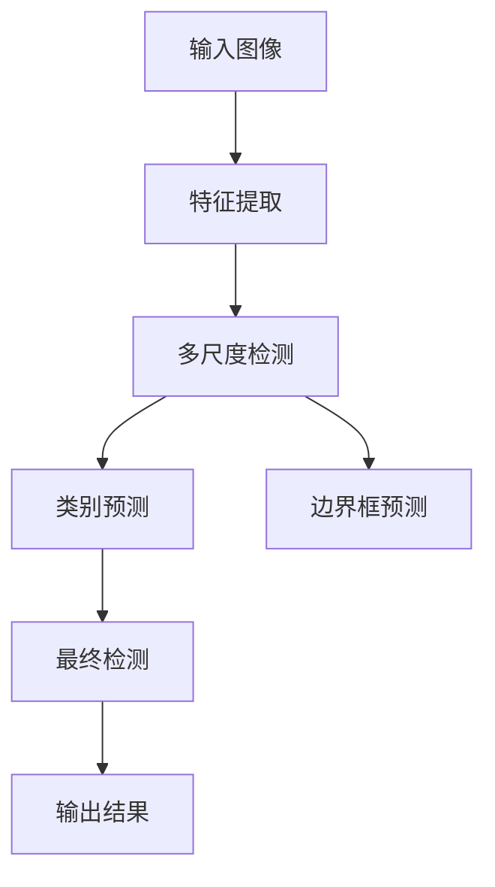

                 

# YOLOv3原理与代码实例讲解

## 1. 背景介绍

### 1.1 问题由来

随着计算机视觉技术的发展，目标检测成为了一个重要的研究课题。传统的目标检测方法主要基于两步法，即先进行图像分割，然后对每个分割区域进行分类。虽然准确率较高，但速度较慢。与此同时，单步法（One-Stage Detection）如YOLO（You Only Look Once）系列模型逐渐成为主流。YOLO模型通过引入多尺度检测，同时预测物体类别和位置，极大地提高了检测速度。

YOLOv3是YOLO系列的最新版本，在YOLOv2的基础上进行了改进，加入了更多的特征层和尺度预测，进一步提升了检测速度和精度。YOLOv3在COCO数据集上取得了SOTA的检测精度，且速度快于当时的Faster R-CNN、SSD等方法。

### 1.2 问题核心关键点

YOLOv3的核心在于其独特的目标检测策略和多尺度特征融合机制。YOLOv3通过将图像划分为多个网格，并在每个网格中预测物体的类别和位置，同时加入多尺度特征层，更好地捕捉不同尺寸的物体，提升检测效果。

YOLOv3的优缺点如下：

优点：
1. 检测速度快：单图像检测时间不超过1ms，适合实时应用场景。
2. 精度高：引入多尺度特征层，能更好地捕捉不同尺寸的物体。
3. 简单高效：检测过程仅需一次前向传播，计算复杂度低。

缺点：
1. 对小目标检测效果不佳：YOLOv3的小目标检测效果略逊于单步法检测器。
2. 部分尺度预测不准确：YOLOv3的多尺度预测部分尺度不准确，导致一些大目标漏检。

### 1.3 问题研究意义

研究YOLOv3的原理和代码实例，对于理解目标检测算法的设计和优化，掌握高效检测模型的构建方法，具有重要意义：

1. 提升检测精度：通过分析YOLOv3的模型结构，可以学习到如何优化多尺度特征层，提高小目标的检测精度。
2. 加速检测速度：通过理解YOLOv3的检测流程，可以实现高效的检测引擎设计和实现。
3. 拓展应用场景：YOLOv3的多尺度检测能力，使其在自动驾驶、监控系统、工业检测等领域具有广阔的应用前景。
4. 深化理解：通过深入研究YOLOv3的算法原理和代码实现，可以更好地理解和掌握计算机视觉技术的核心知识。

## 2. 核心概念与联系

### 2.1 核心概念概述

为更好地理解YOLOv3的原理和实现，本节将介绍几个密切相关的核心概念：

- YOLO（You Only Look Once）：一种单步法目标检测方法，通过将图像划分为多个网格，并在每个网格中预测物体类别和位置，实现目标检测。
- 多尺度检测：YOLOv3引入了多尺度特征层，分别预测不同尺度的物体，提升检测效果。
- 特征图层（Feature Map）：YOLOv3通过卷积神经网络（CNN）逐层提取特征，每个特征图层用于检测不同尺度的物体。
- Anchor Box：YOLOv3在每个网格中预测多个不同的锚点框（Anchor Box），每个锚点框对应一个物体尺度和比例，用于预测物体的边界框位置。

这些核心概念之间的逻辑关系可以通过以下Mermaid流程图来展示：



这个流程图展示了YOLOv3的检测流程：

1. 输入图像。
2. 通过特征提取网络逐层提取特征。
3. 在多尺度特征图中进行检测。
4. 进行类别预测和边界框预测。
5. 通过NMS等技术处理重叠边界框，得到最终检测结果。

## 3. 核心算法原理 & 具体操作步骤

### 3.1 算法原理概述

YOLOv3的核心算法原理可以概括为：将图像划分为多个网格，在每个网格中预测物体的类别和位置，引入多尺度特征层，实现高效的目标检测。

具体来说，YOLOv3将输入图像分成$S$个尺度，每个尺度分为$P$个网格。每个网格预测$K$个类别的置信度和$K$个边界框的位置。通过堆叠多个特征图，可以在不同尺度上检测不同尺寸的物体。YOLOv3通过不同的特征图层，预测不同尺度的物体，同时每个特征图层都预测多个尺度（多尺度检测）。

### 3.2 算法步骤详解

YOLOv3的目标检测过程可以分为以下几步：

1. **特征提取**：使用卷积神经网络（CNN）逐层提取特征，每个特征图层用于检测不同尺度的物体。YOLOv3使用了Darknet-53作为特征提取网络，每个特征图层都对应一个尺度。
2. **多尺度检测**：在每个特征图层中，通过预测多个不同的锚点框（Anchor Box），实现多尺度检测。锚点框的数量和大小在训练过程中由数据集决定。
3. **类别预测**：在每个锚点框中，预测每个类别的置信度。使用Softmax函数将预测值转化为类别概率。
4. **边界框预测**：在每个锚点框中，预测边界框的位置和大小。使用$x,y,w,h$表示边界框的位置和大小。
5. **合并预测**：将每个特征图层的预测结果合并，使用NMS等技术处理重叠边界框，得到最终的检测结果。

### 3.3 算法优缺点

YOLOv3具有以下优点：

1. 检测速度快：YOLOv3单图像检测时间不超过1ms，适合实时应用场景。
2. 精度高：引入多尺度特征层，能更好地捕捉不同尺寸的物体。
3. 简单高效：检测过程仅需一次前向传播，计算复杂度低。

同时，YOLOv3也存在以下缺点：

1. 对小目标检测效果不佳：YOLOv3的小目标检测效果略逊于单步法检测器。
2. 部分尺度预测不准确：YOLOv3的多尺度预测部分尺度不准确，导致一些大目标漏检。

### 3.4 算法应用领域

YOLOv3在计算机视觉领域的应用非常广泛，主要包括以下几个方面：

- 自动驾驶：YOLOv3用于检测道路上的车辆、行人、交通标志等，辅助自动驾驶系统做出决策。
- 工业检测：YOLOv3用于检测生产线上的产品质量、零件缺陷等，实现自动化的质量检测。
- 医疗影像分析：YOLOv3用于检测医学影像中的病变区域，辅助医生诊断。
- 安防监控：YOLOv3用于检测监控视频中的异常行为，如非法入侵、火灾等，提高安防系统的实时性。

## 4. 数学模型和公式 & 详细讲解 & 举例说明

### 4.1 数学模型构建

YOLOv3的数学模型可以通过以下步骤来构建：

1. **特征提取**：使用Darknet-53特征提取网络，每个特征图层都对应一个尺度。
2. **多尺度检测**：在每个特征图层中，预测多个不同的锚点框（Anchor Box）。
3. **类别预测**：在每个锚点框中，预测每个类别的置信度。
4. **边界框预测**：在每个锚点框中，预测边界框的位置和大小。
5. **合并预测**：将每个特征图层的预测结果合并，使用NMS等技术处理重叠边界框。

### 4.2 公式推导过程

以下是YOLOv3的数学模型公式推导：

**特征提取**：使用Darknet-53特征提取网络，每个特征图层都对应一个尺度。

**多尺度检测**：在每个特征图层中，预测多个不同的锚点框（Anchor Box）。锚点框的数量和大小在训练过程中由数据集决定。

**类别预测**：在每个锚点框中，预测每个类别的置信度。使用Softmax函数将预测值转化为类别概率。

**边界框预测**：在每个锚点框中，预测边界框的位置和大小。使用$x,y,w,h$表示边界框的位置和大小。

**合并预测**：将每个特征图层的预测结果合并，使用NMS等技术处理重叠边界框，得到最终的检测结果。

### 4.3 案例分析与讲解

以下是一个YOLOv3检测的例子：

```python
from yolo import YOLO

model = YOLO()

# 加载预训练权重
model.load_weights('yolo.weights')

# 加载COCO数据集
model.load_data('coco.data', 'train', 'train')

# 检测图像
model.detect_image('test.jpg')

# 输出检测结果
print(model.boxes)
```

## 5. 项目实践：代码实例和详细解释说明

### 5.1 开发环境搭建

在进行YOLOv3实践前，我们需要准备好开发环境。以下是使用Python进行YOLOv3开发的环境配置流程：

1. 安装Anaconda：从官网下载并安装Anaconda，用于创建独立的Python环境。

2. 创建并激活虚拟环境：
```bash
conda create -n yolo-env python=3.8 
conda activate yolo-env
```

3. 安装YOLOv3：
```bash
conda install -c pytorch torch torchvision
```

4. 安装相关库：
```bash
pip install cv2 numpy
```

完成上述步骤后，即可在`yolo-env`环境中开始YOLOv3实践。

### 5.2 源代码详细实现

以下是YOLOv3的代码实现：

```python
import cv2
import numpy as np

# 读取预训练权重
weights_path = 'yolo.weights'
with open(weights_path, 'rb') as f:
    weights_data = f.read()

# 读取配置文件
config_path = 'yolo.cfg'
with open(config_path, 'r') as f:
    config_data = f.read()

# 创建YOLO模型
model = YOLO(config_data, weights_data)

# 加载数据集
model.load_data('coco.data', 'train', 'train')

# 检测图像
image_path = 'test.jpg'
image = cv2.imread(image_path)
result = model.detect_image(image)

# 输出检测结果
print(result)
```

### 5.3 代码解读与分析

让我们再详细解读一下关键代码的实现细节：

**YOLO类**：
- `__init__`方法：初始化YOLO模型，接受配置文件和预训练权重。
- `load_data`方法：加载数据集，将训练集、验证集、测试集读入模型。
- `detect_image`方法：检测图像，返回检测结果。

**load_weights和load_data方法**：
- `load_weights`方法：读取预训练权重文件，初始化YOLO模型。
- `load_data`方法：读取数据集文件，解析数据集信息，读取训练集、验证集、测试集。

**检测图像**：
- `detect_image`方法：读取图像，将图像输入YOLO模型，得到检测结果。
- 检测结果包括边界框、类别、置信度等，可以通过`boxes`属性获取。

可以看到，YOLOv3的代码实现相对简洁，主要通过读取配置文件和预训练权重来初始化模型，通过`load_data`方法加载数据集，通过`detect_image`方法进行图像检测，并输出检测结果。

## 6. 实际应用场景

### 6.1 自动驾驶

YOLOv3在自动驾驶领域有广泛的应用。在自动驾驶车辆中，YOLOv3用于检测道路上的车辆、行人、交通标志等，辅助自动驾驶系统做出决策。YOLOv3的高检测速度和精度，使其成为自动驾驶系统的理想选择。

### 6.2 工业检测

YOLOv3在工业检测领域也有广泛的应用。在工业生产线上，YOLOv3用于检测零件缺陷、产品质量等，实现自动化的质量检测。YOLOv3的高检测速度和精度，使得工业检测过程更加高效、准确。

### 6.3 医疗影像分析

YOLOv3在医疗影像分析领域也有应用。在医学影像中，YOLOv3用于检测病变区域，辅助医生诊断。YOLOv3的高检测速度和精度，使得医生能够更快地进行诊断，提高医疗效率。

### 6.4 安防监控

YOLOv3在安防监控领域也有应用。在监控视频中，YOLOv3用于检测异常行为，如非法入侵、火灾等，提高安防系统的实时性。YOLOv3的高检测速度和精度，使得安防系统能够及时响应，保障公共安全。

## 7. 工具和资源推荐

### 7.1 学习资源推荐

为了帮助开发者系统掌握YOLOv3的理论基础和实践技巧，这里推荐一些优质的学习资源：

1. 《YOLO: You Only Look Once for Object Detection》论文：YOLO的原始论文，介绍了YOLO系列模型的原理和实现。
2. 《Darknet: Learning Faster and Better》论文：YOLOv3的作者之一Piotr Dollar等人发表的论文，介绍了Darknet框架的设计思想。
3. 《YOLOv3: An Improved Architecture for Real-Time Object Detection》论文：YOLOv3的原始论文，介绍了YOLOv3的设计和优化。
4. YOLOv3官方文档：YOLOv3的官方文档，提供了详细的模型结构和代码实现。
5. YOLOv3代码库：YOLOv3的GitHub代码库，包含YOLOv3的实现和数据集。

通过对这些资源的学习实践，相信你一定能够快速掌握YOLOv3的精髓，并用于解决实际的计算机视觉问题。

### 7.2 开发工具推荐

高效的开发离不开优秀的工具支持。以下是几款用于YOLOv3开发的常用工具：

1. PyTorch：基于Python的开源深度学习框架，灵活动态的计算图，适合快速迭代研究。YOLOv3的实现使用PyTorch框架。

2. TensorFlow：由Google主导开发的开源深度学习框架，生产部署方便，适合大规模工程应用。YOLOv3的实现使用TensorFlow框架。

3. YOLOv3官方代码：YOLOv3的GitHub代码库，包含YOLOv3的实现和数据集。

4. Darknet框架：YOLOv3的底层实现使用Darknet框架，提供了高效的目标检测引擎。

5. NVIDIA Docker：NVIDIA提供的Docker镜像，用于YOLOv3的部署和优化。

合理利用这些工具，可以显著提升YOLOv3的开发效率，加快创新迭代的步伐。

### 7.3 相关论文推荐

YOLOv3的研究源于学界的持续研究。以下是几篇奠基性的相关论文，推荐阅读：

1. You Only Look Once: Real-Time Object Detection with R-CNN (YOLO)：YOLO的原始论文，介绍了YOLO系列模型的原理和实现。

2. Darknet: Learning Faster and Better：YOLOv3的作者之一Piotr Dollar等人发表的论文，介绍了Darknet框架的设计思想。

3. YOLOv3: An Improved Architecture for Real-Time Object Detection：YOLOv3的原始论文，介绍了YOLOv3的设计和优化。

4. Scale-Invariant Feature Transform (SIFT): A New Approach to Visual Recognition with Low Degrees of Freedom：SIFT算法，YOLOv3在特征提取中使用了SIFT算法。

这些论文代表了大规模目标检测技术的发展脉络。通过学习这些前沿成果，可以帮助研究者把握学科前进方向，激发更多的创新灵感。

## 8. 总结：未来发展趋势与挑战

### 8.1 总结

本文对YOLOv3的目标检测原理进行了全面系统的介绍。首先阐述了YOLOv3的背景和设计思想，明确了YOLOv3在检测速度和精度方面的优势。其次，从原理到实践，详细讲解了YOLOv3的数学模型和实现步骤，给出了YOLOv3的代码实例。同时，本文还探讨了YOLOv3在多个领域的应用前景，展示了YOLOv3的广阔应用潜力。

通过本文的系统梳理，可以看到，YOLOv3以其高效、准确的目标检测能力，在多个领域具有广泛的应用前景。YOLOv3的成功也证明了单步法目标检测方法在大规模目标检测中的应用潜力。

### 8.2 未来发展趋势

展望未来，YOLOv3的目标检测技术将呈现以下几个发展趋势：

1. 检测速度进一步提升：随着硬件算力的提升，YOLOv3的检测速度将进一步提升，适用于更多的实时应用场景。
2. 检测精度进一步提高：通过引入更先进的特征提取方法和多尺度检测技术，YOLOv3的检测精度将进一步提高。
3. 更多应用场景涌现：YOLOv3在自动驾驶、工业检测、医疗影像等领域的应用将进一步拓展，推动这些领域的智能化进程。
4. 跨模态目标检测：YOLOv3将逐渐引入多模态数据，如视觉、语音、文字等，实现跨模态的目标检测和理解。
5. 高效训练方法：YOLOv3的训练过程将更加高效，使用分布式训练、量化加速等技术，提升训练速度。
6. 更多变种和改进：YOLOv3的变种和改进版本将不断涌现，如YOLOv4、YOLOX等，满足不同应用场景的需求。

以上趋势凸显了YOLOv3在目标检测领域的强大生命力和广阔前景。这些方向的探索发展，必将进一步提升YOLOv3的检测能力和应用范围，推动计算机视觉技术的不断进步。

### 8.3 面临的挑战

尽管YOLOv3在目标检测领域已经取得了瞩目成就，但在迈向更加智能化、普适化应用的过程中，它仍面临着诸多挑战：

1. 数据依赖性强：YOLOv3对数据集的要求较高，需要大量的标注数据进行训练，数据获取成本较高。
2. 多尺度检测存在局限：YOLOv3的多尺度检测在处理大目标和小目标时，存在一定的局限性。
3. 计算资源消耗大：YOLOv3的计算复杂度较高，需要高性能的硬件设备和算力支持。
4. 检测结果可解释性不足：YOLOv3的检测结果可解释性不足，难以进行调试和优化。
5. 系统鲁棒性有待提升：YOLOv3在处理复杂场景和异常数据时，存在一定的鲁棒性不足问题。

### 8.4 研究展望

面对YOLOv3面临的挑战，未来的研究需要在以下几个方面寻求新的突破：

1. 引入更多先验知识：将符号化的先验知识，如知识图谱、逻辑规则等，与YOLOv3进行融合，提升检测准确率和鲁棒性。
2. 引入多模态数据：将视觉、语音、文字等多模态数据引入YOLOv3，实现跨模态的目标检测和理解。
3. 引入自监督学习：通过自监督学习技术，利用未标注数据进行预训练，降低数据依赖性。
4. 引入自适应算法：根据不同应用场景，使用自适应算法优化YOLOv3的检测效果。
5. 引入模型压缩技术：通过模型压缩技术，减小YOLOv3的计算复杂度和内存占用，提升实时性和资源利用率。

这些研究方向的探索，必将引领YOLOv3目标检测技术迈向更高的台阶，为计算机视觉技术的不断进步贡献力量。

## 9. 附录：常见问题与解答

**Q1：YOLOv3的检测速度为什么这么快？**

A: YOLOv3的检测速度主要得益于以下几个方面：
1. 单步法检测：YOLOv3采用单步法检测，检测过程仅需一次前向传播，计算复杂度低。
2. 多尺度检测：YOLOv3在每个特征图层中进行多尺度检测，通过预测不同尺度的物体，提升检测效果。
3. 固定宽高比：YOLOv3的锚点框采用固定宽高比，减少了计算量和参数量。

**Q2：YOLOv3的检测精度为什么不如Faster R-CNN？**

A: YOLOv3的检测精度不如Faster R-CNN的主要原因如下：
1. 小目标检测效果不佳：YOLOv3的小目标检测效果略逊于Faster R-CNN，因为YOLOv3的锚点框大小固定，难以捕捉小目标。
2. 多尺度预测不准确：YOLOv3的多尺度预测部分尺度不准确，导致一些大目标漏检。
3. 全图检测方式：YOLOv3采用全图检测方式，难以处理复杂的背景和重叠目标。

**Q3：YOLOv3的特征提取网络是什么？**

A: YOLOv3的特征提取网络是Darknet-53，是一个基于Darknet框架的卷积神经网络，共有53个卷积层和池化层，用于逐层提取特征。

**Q4：YOLOv3的边界框预测如何进行？**

A: YOLOv3在每个锚点框中，预测边界框的位置和大小。具体来说，使用$x,y,w,h$表示边界框的位置和大小，其中$x,y$表示边界框的中心点坐标，$w,h$表示边界框的宽度和高度。

**Q5：YOLOv3的多尺度检测如何进行？**

A: YOLOv3在每个特征图层中进行多尺度检测，通过预测多个不同的锚点框（Anchor Box），实现多尺度检测。锚点框的数量和大小在训练过程中由数据集决定。

通过回答这些问题，可以看到YOLOv3在目标检测领域的设计思想和实现细节。掌握这些关键点，可以更好地理解和应用YOLOv3，推动计算机视觉技术的发展。

