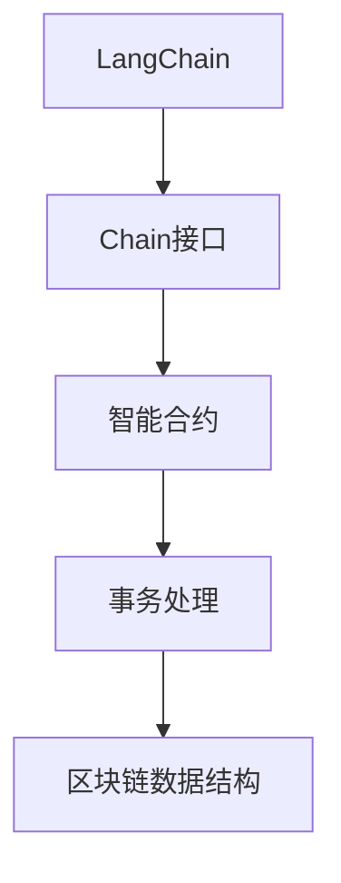

                 

## 1. 背景介绍

### 1.1 问题由来

近年来，随着区块链技术的发展，去中心化的共识机制和智能合约在各类应用场景中得到了广泛的应用。LangChain作为区块链领域的一个热门话题，以其可扩展性和灵活性吸引了众多开发者和研究者的关注。然而，对于初学者而言，如何高效地使用Chain接口，高效地进行编程开发，是一个不小的挑战。

### 1.2 问题核心关键点

使用LangChain编程的核心在于掌握Chain接口的调用方法。本节将重点介绍Chain接口的基本概念、调用原理和常见使用场景。

### 1.3 问题研究意义

掌握LangChain编程的基本方法和Chain接口的使用，对于开发者构建基于区块链的应用、参与智能合约开发具有重要的意义。

1. 提供了一种高效、可扩展的编程框架，让开发者能够快速开发区块链应用。
2. 通过了解Chain接口的调用方法，开发者可以更好地理解区块链的工作原理和底层机制。
3. 了解如何编写智能合约，有助于开发者在区块链领域拓展职业生涯。
4. 掌握LangChain编程，可以帮助开发者在区块链生态系统中获得更多机会。

## 2. 核心概念与联系

### 2.1 核心概念概述

为更好地理解Chain接口的调用方法，本节将介绍几个密切相关的核心概念：

- **LangChain**：一种基于以太坊智能合约编程语言，使用Solidity语言实现。它提供了区块链上开发智能合约和应用的基本框架。
- **Chain接口**：LangChain中定义了多个Chain接口，用于与区块链进行交互。这些接口封装了区块链的基本操作，如账户管理、智能合约部署、事务处理等。
- **智能合约**：一类运行在区块链上的程序，当特定条件满足时，自动执行预设的代码逻辑。
- **事务处理**：在区块链上执行特定操作的过程。常见的有创建新账户、向账户发送Token、部署智能合约等。
- **区块链数据结构**：包括块链式结构、分布式账本、共识机制等，是理解Chain接口调用的基础。

这些核心概念之间的逻辑关系可以通过以下Mermaid流程图来展示：



这个流程图展示了大语言模型和Chain接口的使用场景，以及它们与智能合约、事务处理和区块链数据结构之间的关系。

## 3. 核心算法原理 & 具体操作步骤

### 3.1 算法原理概述

Chain接口的调用方法遵循了区块链的去中心化原则和智能合约的基本逻辑。其核心思想是利用区块链的分布式账本特性，通过链上代码的自动执行，实现各类应用逻辑的封装和存储。

Chain接口调用的一般流程包括：
1. 通过Solidity语言编写智能合约代码，并将其部署到区块链上。
2. 智能合约定义了其支持的事务处理类型和逻辑。
3. 开发者通过调用Chain接口提供的函数，实现对智能合约的操作。
4. 调用过程中，智能合约根据预设的逻辑和输入参数执行相应的操作，并返回结果。

### 3.2 算法步骤详解

以部署智能合约和调用其函数为例，详细讲解Chain接口的调用步骤：

**Step 1: 编写智能合约代码**

在LangChain中，智能合约的编写使用Solidity语言实现。以下是一个简单的智能合约示例：

```solidity
contract HelloWorld {
    function hello() public view returns (string memory) {
        return "Hello, World!";
    }
}
```

这个合约定义了一个名为`hello`的函数，当被调用时，返回字符串`Hello, World!`。

**Step 2: 部署智能合约**

将上述合约编译成字节码，并将其部署到区块链上：

```solidity
pragma solidity ^0.8.0;

contract HelloWorld {
    function hello() public view returns (string memory) {
        return "Hello, World!";
    }
}

// 编译合约
$ solc --output-binary --combined-stats HelloWorld.sol

// 获取编译后的字节码
$ solc --bin --combined-stats HelloWorld.sol

// 部署合约
$ truffle compile
$ truffle migrate --network mainnet
```

部署后，智能合约的地址将被存储在区块链上。

**Step 3: 调用智能合约函数**

调用智能合约函数可以使用Solidity语言的函数调用语句：

```solidity
// 示例函数调用
HelloWorld.deployed().hello()
```

在调用函数时，可以使用Solidity提供的类型检查机制，确保输入参数的类型和格式正确。

### 3.3 算法优缺点

Chain接口的调用方法具有以下优点：
1. 可扩展性高。通过智能合约，开发者可以实现各种复杂的逻辑和算法。
2. 安全性好。区块链的去中心化特性，使得智能合约的执行逻辑难以被篡改。
3. 透明性好。区块链上的所有操作都可以被记录和追踪，增强了系统的透明度和可信度。
4. 自动化程度高。智能合约的自动执行逻辑，可以降低人工干预的风险。

同时，该方法也存在一定的局限性：
1. 运行成本高。智能合约的运行需要消耗Gas费用，对于大规模操作，费用可能较高。
2. 开发难度大。智能合约的编写需要开发者对Solidity语言和区块链机制有较深的理解。
3. 可解释性差。智能合约的执行逻辑通常是黑盒的，难以解释其内部工作机制。
4. 部署复杂。智能合约的部署需要考虑网络、合约代码等方面的问题。

尽管存在这些局限性，但就目前而言，Chain接口的调用方法是区块链开发中最为重要和主流的范式。未来相关研究的重点在于如何进一步降低智能合约的运行成本，提高其可解释性和自动化程度，同时兼顾安全性与扩展性。

### 3.4 算法应用领域

Chain接口的调用方法已经在区块链的各个领域得到了广泛的应用，涵盖了智能合约开发、去中心化应用开发、跨链交互等诸多领域。

- **智能合约**：智能合约是区块链应用的基础，用于实现各类自动化操作，如Token交易、金融合约、投票等。
- **去中心化应用(DApp)**：利用智能合约，开发者可以实现去中心化的应用，如去中心化交易所、社交网络、去中心化存储等。
- **跨链交互**：利用Chain接口，开发者可以实现不同区块链之间的交互，实现跨链资产转移、跨链智能合约等操作。
- **去中心化身份认证**：利用智能合约和Chain接口，开发者可以实现去中心化身份认证，提升数据安全和隐私保护。

除了上述这些经典应用外，Chain接口还被创新性地应用到更多场景中，如去中心化金融(DeFi)、供应链管理、物联网等，为区块链技术带来了新的发展方向。

## 4. 数学模型和公式 & 详细讲解  
### 4.1 数学模型构建

为了更好地理解Chain接口调用的原理，本节将使用数学语言对Chain接口调用的过程进行更加严格的刻画。

设智能合约的部署地址为`address`，函数名为`funcName`，其参数列表为`args`。在LangChain中，调用智能合约函数的一般形式为：

$$
\text{Call Contract}(address, funcName, args)
$$

其中`args`可以是字符串、整数、布尔值等类型。

### 4.2 公式推导过程

以部署智能合约和调用其函数为例，推导Chain接口调用的过程：

**Step 1: 编译智能合约代码**

将Solidity代码编译成字节码，生成`abi`文件：

```solidity
pragma solidity ^0.8.0;

contract HelloWorld {
    function hello() public view returns (string memory) {
        return "Hello, World!";
    }
}

// 编译合约
$ solc --output-binary --combined-stats HelloWorld.sol

// 获取编译后的字节码
$ solc --bin --combined-stats HelloWorld.sol

// 生成abi文件
$ truffle compile --abi
```

**Step 2: 部署智能合约**

将字节码和`abi`文件上传到区块链，并部署合约：

```solidity
pragma solidity ^0.8.0;

contract HelloWorld {
    function hello() public view returns (string memory) {
        return "Hello, World!";
    }
}

// 部署合约
$ truffle migrate --network mainnet
```

**Step 3: 调用智能合约函数**

调用智能合约函数时，需要使用`abi`文件中定义的函数参数类型和名称：

```solidity
// 示例函数调用
HelloWorld.deployed().hello()
```

在调用函数时，需要确保参数的类型和数量与智能合约定义的一致。

### 4.3 案例分析与讲解

以下是一个简单的例子，展示如何使用Chain接口调用智能合约：

```solidity
// 示例智能合约
pragma solidity ^0.8.0;

contract MyContract {
    uint256 public counter = 0;
    
    function increment() public {
        counter += 1;
    }
}

// 编译合约
$ solc --output-binary --combined-stats MyContract.sol

// 获取编译后的字节码
$ solc --bin --combined-stats MyContract.sol

// 生成abi文件
$ truffle compile --abi

// 部署合约
$ truffle migrate --network mainnet

// 调用函数
$ MyContract.deployed().increment()
```

在上述示例中，`MyContract`合约定义了一个`increment`函数，用于将计数器加1。通过调用该函数，开发者可以实现对智能合约的操作。

## 5. 项目实践：代码实例和详细解释说明

### 5.1 开发环境搭建

在进行LangChain编程和Chain接口调用前，我们需要准备好开发环境。以下是使用Python进行LangChain开发的流程：

1. 安装Python：从官网下载并安装Python，推荐使用3.x版本。

2. 安装Solidity编译器：从官网下载并安装Solidity编译器，推荐使用3.5版本。

3. 安装LangChain开发框架：使用pip安装LangChain框架。

```bash
$ pip install langchain
```

4. 安装Web3开发库：使用pip安装Web3开发库，用于与区块链进行交互。

```bash
$ pip install web3
```

5. 安装Truffle框架：使用pip安装Truffle框架，用于合约的开发和部署。

```bash
$ pip install truffle-hdfs
```

6. 安装GitHub客户端：用于下载和上传智能合约代码。

```bash
$ pip install github
```

完成上述步骤后，即可在开发环境中开始LangChain编程和Chain接口调用。

### 5.2 源代码详细实现

下面以部署智能合约并调用其函数为例，给出使用LangChain框架进行开发的完整代码实现。

```python
from langchain import Web3

# 连接区块链
w3 = Web3("https://mainnet.infura.io/v3/YOUR_INFURA_PROJECT_ID")

# 定义智能合约
MyContract = w3.eth.contract(
    address="0xYourContractAddress",
    abi="YourContractABI"
)

# 部署合约
MyContract.deploy(0, 100, "0xYourCreatorAddress")
```

在上述代码中，`MyContract`对象表示智能合约的实例，通过指定合约地址和ABI文件，可以与区块链进行交互。`deploy`方法用于部署合约，其中参数`0`表示合约的参数，`100`表示初始化资金，`"0xYourCreatorAddress"`表示合约创建者的地址。

### 5.3 代码解读与分析

让我们再详细解读一下关键代码的实现细节：

**Web3类**：
- 用于连接区块链，提供与区块链进行交互的方法，如获取余额、部署合约等。

**eth.contract类**：
- 表示智能合约的实例，通过指定合约地址和ABI文件，可以与区块链进行交互。

**deploy方法**：
- 用于部署合约，需要指定合约的参数、初始化资金和创建者的地址。

**MyContract对象**：
- 表示智能合约的实例，通过调用其方法，可以实现对合约的操作。

通过上述代码的实现，我们可以快速搭建LangChain开发环境，并部署智能合约，调用其函数。开发过程中，可以通过编写和部署不同类型的智能合约，实现各种复杂的逻辑和算法。

### 5.4 运行结果展示

部署智能合约和调用其函数后，可以通过Web3类提供的`eth.getBalance`方法获取合约的余额，验证合约的部署成功。

```python
# 获取合约余额
balance = w3.eth.getBalance(MyContract._address)
print(balance)
```

在上述代码中，`MyContract._address`表示智能合约的地址，通过调用`eth.getBalance`方法，可以获取合约的余额，验证其部署成功。

## 6. 实际应用场景

### 6.1 智能合约

基于Chain接口的智能合约可以广泛应用于各类金融合约、投票、供应链管理等领域。

在金融合约中，智能合约可以自动执行借贷、保险等各类金融操作，降低金融机构的运营成本，提高交易效率。

在投票系统中，智能合约可以记录选票信息，自动计算选举结果，确保选举过程的公平和透明。

在供应链管理中，智能合约可以记录物流信息，自动生成发货和收货通知，提高供应链的自动化水平。

### 6.2 去中心化应用(DApp)

利用智能合约和Chain接口，开发者可以构建去中心化应用，如去中心化交易所、去中心化存储、去中心化身份认证等。

去中心化交易所通过智能合约实现Token交易，降低中心化交易所的风险，提高交易的安全性和透明度。

去中心化存储通过智能合约实现数据加密和分布式存储，提高数据的安全性和隐私保护。

去中心化身份认证通过智能合约实现用户身份的验证和管理，提升用户的数据安全和隐私保护。

### 6.3 跨链交互

利用Chain接口，开发者可以实现不同区块链之间的交互，实现跨链资产转移、跨链智能合约等操作。

跨链资产转移通过智能合约实现Token在不同区块链之间的转移，提高资产的流动性。

跨链智能合约通过智能合约实现不同区块链之间的协同操作，提升系统的自动化水平和可靠性。

### 6.4 未来应用展望

随着Chain接口和LangChain框架的不断进步，其在区块链领域的应用前景广阔。

在智慧城市治理中，智能合约可以用于城市事件监测、舆情分析、应急指挥等环节，提高城市管理的自动化和智能化水平，构建更安全、高效的未来城市。

在智能合约的基础上，未来的区块链应用还将拓展到更多的垂直行业，如医疗、教育、物流等，为传统行业带来变革性的影响。

## 7. 工具和资源推荐

### 7.1 学习资源推荐

为了帮助开发者系统掌握LangChain编程和Chain接口的使用，这里推荐一些优质的学习资源：

1. LangChain官方文档：LangChain框架的官方文档，提供了详细的API使用说明和示例代码，是上手实践的必备资料。

2. Solidity官方文档：Solidity语言的官方文档，提供了Solidity编程语言的详细教程和示例代码，是理解智能合约编写的基础。

3. Ethereum官方文档：以太坊的官方文档，提供了以太坊平台的使用指南和开发工具，是深入了解区块链基础的重要资料。

4. Truffle官方文档：Truffle框架的官方文档，提供了Truffle框架的详细使用说明和示例代码，是合约开发和部署的重要工具。

5. Web3官方文档：Web3开发库的官方文档，提供了Web3开发库的使用指南和示例代码，是连接区块链的重要工具。

通过对这些资源的学习实践，相信你一定能够快速掌握LangChain编程和Chain接口的使用，并用于解决实际的区块链问题。

### 7.2 开发工具推荐

在LangChain编程和Chain接口调用的过程中，以下工具可以帮助你提高开发效率：

1. VS Code：一款轻量级的代码编辑器，支持语法高亮、代码补全、智能提示等特性，是编程开发的必备工具。

2. Git：一款版本控制系统，支持代码版本管理、代码合并、代码冲突解决等特性，是协作开发的重要工具。

3. Docker：一款容器化平台，支持开发环境的快速搭建和部署，是确保开发环境一致性的重要工具。

4. Truffle框架：一款区块链开发框架，支持合约的开发、部署、测试等全流程管理，是智能合约开发的重要工具。

5. Web3开发库：一款与区块链进行交互的开发库，支持区块链的连接、事务处理、智能合约调用等操作，是区块链开发的重要工具。

合理利用这些工具，可以显著提升LangChain编程和Chain接口调用的开发效率，加快创新迭代的步伐。

### 7.3 相关论文推荐

LangChain编程和Chain接口调用的研究源于学界的持续研究。以下是几篇奠基性的相关论文，推荐阅读：

1. "Blockchain and Smart Contracts: A Survey"：一篇关于区块链和智能合约的综述文章，介绍了区块链和智能合约的基本概念、技术实现和应用场景。

2. "Blockchain Technology: Overview and Analysis"：一篇关于区块链技术的综述文章，介绍了区块链的技术架构、应用场景和未来发展趋势。

3. "Smart Contracts: A Survey and Analysis of Current Research"：一篇关于智能合约的研究综述文章，介绍了智能合约的基本概念、实现技术和应用场景。

4. "Blockchain-based Data Sharing Platforms: A Survey"：一篇关于区块链数据共享平台的研究综述文章，介绍了区块链数据共享的基本概念、技术实现和应用场景。

5. "Blockchain-based Supply Chain Management: A Survey"：一篇关于区块链供应链管理的研究综述文章，介绍了区块链供应链管理的基本概念、技术实现和应用场景。

这些论文代表了大语言模型微调技术的发展脉络。通过学习这些前沿成果，可以帮助研究者把握学科前进方向，激发更多的创新灵感。

## 8. 总结：未来发展趋势与挑战

### 8.1 总结

本文对LangChain编程和Chain接口的使用进行了全面系统的介绍。首先阐述了LangChain编程和Chain接口的基本概念、调用原理和常见使用场景。其次，从原理到实践，详细讲解了智能合约的编写和部署过程，给出了LangChain编程和Chain接口调用的完整代码实例。同时，本文还广泛探讨了智能合约在多个领域的应用前景，展示了Chain接口的巨大潜力。

通过本文的系统梳理，可以看到，Chain接口的调用方法是区块链开发中最为重要和主流的范式。掌握LangChain编程和Chain接口的使用，对于开发者构建基于区块链的应用、参与智能合约开发具有重要的意义。

### 8.2 未来发展趋势

展望未来，Chain接口的调用方法和LangChain编程技术将呈现以下几个发展趋势：

1. 智能合约的可扩展性将进一步提升。通过智能合约，开发者可以实现更多复杂的操作逻辑，提升系统的自动化和智能化水平。

2. 智能合约的安全性将进一步提高。区块链的去中心化特性，使得智能合约的执行逻辑难以被篡改，未来的智能合约将更加注重安全性。

3. 智能合约的可解释性将进一步增强。通过引入更多的符号化工具，智能合约的执行逻辑将更加可解释，便于开发者的调试和维护。

4. 智能合约的跨链交互将更加灵活。通过跨链技术，智能合约可以实现不同区块链之间的协同操作，提高系统的灵活性和可扩展性。

5. 智能合约的隐私保护将进一步加强。通过隐私计算技术，智能合约可以实现对数据隐私的保护，提高系统的可信度和可靠性。

6. 智能合约的自动化部署将更加普及。通过自动化部署工具，智能合约的部署过程将更加便捷和高效。

以上趋势凸显了Chain接口调用方法和LangChain编程技术的广阔前景。这些方向的探索发展，必将进一步提升区块链系统的性能和应用范围，为区块链生态系统中带来更多创新的应用场景。

### 8.3 面临的挑战

尽管Chain接口的调用方法和LangChain编程技术已经取得了一定的进展，但在迈向更加智能化、普适化应用的过程中，它仍面临着诸多挑战：

1. 智能合约的运行成本仍然较高。智能合约的运行需要消耗Gas费用，对于大规模操作，费用可能较高。如何降低智能合约的运行成本，提高系统的可扩展性，还需要更多的技术突破。

2. 智能合约的可解释性仍然较差。智能合约的执行逻辑通常是黑盒的，难以解释其内部工作机制。如何提高智能合约的可解释性，增强系统的透明度和可信度，还需要更多的研究和技术突破。

3. 智能合约的自动化部署仍然存在挑战。智能合约的部署过程需要考虑网络、合约代码等方面的问题，自动化部署工具还需要进一步优化和完善。

4. 智能合约的安全性仍然存在风险。区块链的去中心化特性，使得智能合约的执行逻辑难以被篡改，但仍然存在被攻击的风险。如何提高智能合约的安全性，保障系统的稳定性和可靠性，还需要更多的研究和技术突破。

5. 智能合约的跨链交互仍然存在挑战。跨链技术虽然已经取得了一定的进展，但跨链交互的复杂性和安全性仍然存在问题。如何提高跨链交互的效率和安全性，还需要更多的研究和技术突破。

6. 智能合约的隐私保护仍然存在挑战。区块链的透明性，使得智能合约的数据隐私保护仍然存在问题。如何提高智能合约的隐私保护，增强系统的可信度和可靠性，还需要更多的研究和技术突破。

这些挑战需要研究者从技术、工程、应用等多个维度协同发力，才能真正实现Chain接口调用方法和LangChain编程技术的突破和普及。

### 8.4 研究展望

面对Chain接口调用方法和LangChain编程技术所面临的种种挑战，未来的研究需要在以下几个方面寻求新的突破：

1. 探索无监督和半监督智能合约方法。摆脱对大规模标注数据的依赖，利用自监督学习、主动学习等无监督和半监督范式，最大限度利用非结构化数据，实现更加灵活高效的智能合约。

2. 研究参数高效和计算高效的智能合约方法。开发更加参数高效的智能合约方法，在固定大部分预训练参数的情况下，只更新极少量的任务相关参数。同时优化智能合约的计算图，减少前向传播和反向传播的资源消耗，实现更加轻量级、实时性的部署。

3. 融合因果和对比学习范式。通过引入因果推断和对比学习思想，增强智能合约建立稳定因果关系的能力，学习更加普适、鲁棒的语言表征，从而提升模型泛化性和抗干扰能力。

4. 引入更多先验知识。将符号化的先验知识，如知识图谱、逻辑规则等，与神经网络模型进行巧妙融合，引导智能合约过程学习更准确、合理的语言模型。同时加强不同模态数据的整合，实现视觉、语音等多模态信息与文本信息的协同建模。

5. 结合因果分析和博弈论工具。将因果分析方法引入智能合约，识别出智能合约决策的关键特征，增强输出解释的因果性和逻辑性。借助博弈论工具刻画人机交互过程，主动探索并规避智能合约的脆弱点，提高系统稳定性。

6. 纳入伦理道德约束。在智能合约训练目标中引入伦理导向的评估指标，过滤和惩罚有偏见、有害的输出倾向。同时加强人工干预和审核，建立智能合约行为的监管机制，确保输出符合人类价值观和伦理道德。

这些研究方向的探索，必将引领Chain接口调用方法和LangChain编程技术的突破，为区块链系统带来更多的创新应用场景，推动区块链技术在各领域的深入应用。

## 9. 附录：常见问题与解答

**Q1：智能合约的运行成本是否会影响其应用场景？**

A: 智能合约的运行成本是其应用场景的一个关键因素。对于小规模操作，智能合约的运行成本可以忽略不计，但对于大规模操作，费用可能较高。因此，在设计和部署智能合约时，需要考虑其运行成本，避免过度依赖智能合约。

**Q2：智能合约的可解释性是否重要？**

A: 智能合约的可解释性对于开发者来说非常重要。智能合约的执行逻辑通常是黑盒的，难以解释其内部工作机制。因此，提高智能合约的可解释性，增强系统的透明度和可信度，是智能合约开发的重要目标。

**Q3：智能合约的自动化部署是否容易实现？**

A: 智能合约的自动化部署需要考虑网络、合约代码等方面的问题，具有一定的复杂性。虽然目前已经有许多自动化部署工具，但仍然存在一些挑战。如何提高智能合约的自动化部署效率，还需要更多的研究和优化。

**Q4：智能合约的跨链交互是否容易实现？**

A: 智能合约的跨链交互虽然已经取得了一些进展，但仍存在一定的复杂性。如何提高跨链交互的效率和安全性，还需要更多的研究和优化。

**Q5：智能合约的隐私保护是否容易实现？**

A: 区块链的透明性，使得智能合约的数据隐私保护仍然存在问题。如何提高智能合约的隐私保护，增强系统的可信度和可靠性，还需要更多的研究和优化。

通过对这些常见问题的解答，可以帮助开发者更好地理解智能合约的运行成本、可解释性、自动化部署、跨链交互和隐私保护等问题，更好地设计、开发和部署智能合约。

---

作者：禅与计算机程序设计艺术 / Zen and the Art of Computer Programming

