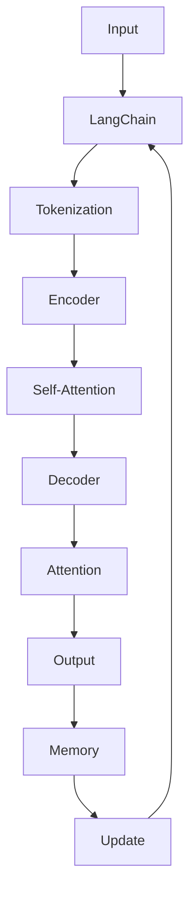

                 

# 【LangChain编程：从入门到实践】ConversationEntityMemory

> 关键词：LangChain, Conversation, Entity, Memory, Natural Language Processing, AI, Deep Learning, Reinforcement Learning

## 1. 背景介绍

### 1.1 问题由来
随着人工智能（AI）和自然语言处理（NLP）技术的不断进步，越来越多的应用场景开始将AI与人类对话系统结合，以提升用户体验和系统效率。传统的基于规则的对话系统在处理复杂对话时往往显得力不从心，而基于深度学习的模型，尤其是预训练语言模型（如GPT、BERT等）在处理自然语言理解和生成方面表现优异。然而，预训练语言模型虽然强大，但往往缺乏对特定对话场景中的实体记忆和上下文跟踪能力，这限制了其在实际应用中的表现。

### 1.2 问题核心关键点
对话系统中的实体记忆和上下文跟踪能力是确保系统能够正确理解和响应用户请求的关键。例如，在客服对话中，系统需要记住用户的具体需求，以便在后续对话中提供个性化的服务。在医疗咨询中，系统需要记住用户的病史和当前症状，以提供准确的诊断和治疗建议。如何在预训练语言模型中引入实体记忆和上下文跟踪机制，成为当前研究的热点之一。

### 1.3 问题研究意义
本课题旨在探讨如何在预训练语言模型中引入实体记忆和上下文跟踪能力，以提升对话系统的性能和用户体验。通过深入研究，我们希望能找到一种有效的机制，使得预训练语言模型能够更好地理解并记忆对话中的关键信息，从而在处理复杂对话时表现更出色。

## 2. 核心概念与联系

### 2.1 核心概念概述

为更好地理解本课题，本节将介绍几个关键概念：

- **LangChain**：基于Transformer架构的对话生成模型，支持在对话中嵌入实体和上下文信息。
- **Conversation**：指人类与系统之间的交互对话，包括用户输入、系统回应等。
- **Entity**：指对话中的关键信息，如人名、地名、时间、数字等。
- **Memory**：指对话系统对先前对话的跟踪和记忆能力，确保系统能够连续理解和响应上下文。

### 2.2 核心概念原理和架构的 Mermaid 流程图(Mermaid 流程节点中不要有括号、逗号等特殊字符)


这个流程图展示了LangChain模型的基本架构和流程：

1. **Input**：用户输入对话内容。
2. **Tokenization**：将输入内容进行分词处理。
3. **Encoder**：使用Transformer编码器对分词后的文本进行编码。
4. **Self-Attention**：通过Self-Attention机制进行上下文表示学习。
5. **Decoder**：使用Transformer解码器生成回应。
6. **Attention**：解码器中引入Attention机制，关注上下文信息。
7. **Output**：生成对话回应。
8. **Memory**：存储和更新上下文信息，确保连续性和准确性。
9. **Update**：根据新对话内容更新记忆。

## 3. 核心算法原理 & 具体操作步骤
### 3.1 算法原理概述

LangChain模型基于Transformer架构，通过引入实体记忆和上下文跟踪机制，使得模型能够更好地理解和处理对话内容。其核心算法原理包括：

- **Encoder-Decoder架构**：利用Transformer的Encoder-Decoder结构，将用户输入和上下文信息编码和解码，生成回应。
- **Self-Attention机制**：通过Self-Attention机制，模型可以关注输入中的关键信息，增强理解能力。
- **Memory机制**：在Decoder中引入Memory机制，存储和更新对话历史信息，确保系统能够连续理解和响应上下文。
- **优化算法**：使用如AdamW等优化算法，对模型参数进行优化，提升模型性能。

### 3.2 算法步骤详解

以下是LangChain模型在对话系统中的实现步骤：

**Step 1: 数据预处理**
- 将对话数据集进行分词处理，标记实体信息。
- 将对话数据集划分为训练集、验证集和测试集。

**Step 2: 模型加载与初始化**
- 加载预训练的LangChain模型，并进行必要的参数初始化。
- 设置模型超参数，如学习率、批大小、迭代轮数等。

**Step 3: 对话生成与记忆更新**
- 输入用户对话，进行分词处理。
- 将分词后的文本输入模型进行编码。
- 利用Decoder生成回应，并更新Memory机制，存储对话历史信息。
- 根据生成回应的效果，进行模型参数更新。

**Step 4: 模型评估与部署**
- 在验证集和测试集上评估模型性能，如BLEU、ROUGE等指标。
- 根据评估结果，调整模型超参数或重新训练。
- 将模型部署到实际应用中，进行实时对话处理。

### 3.3 算法优缺点

LangChain模型具有以下优点：
1. 强大理解能力：通过Transformer架构和Self-Attention机制，模型能够更好地理解对话内容，捕捉关键信息。
2. 上下文跟踪：Memory机制使得模型能够连续跟踪对话历史信息，确保对话的一致性和连贯性。
3. 灵活应用：支持嵌入实体信息，适用于各种对话场景，如客服、医疗、教育等。
4. 可扩展性强：基于Transformer架构，支持多种任务，如翻译、摘要、生成等。

同时，该模型也存在一些局限性：
1. 计算资源消耗大：预训练和微调需要大量计算资源。
2. 模型复杂度高：Transformer架构和Memory机制增加了模型复杂度，可能影响推理速度。
3. 泛化能力有限：在特定领域的应用中，可能需要进行领域特定微调。
4. 缺乏可解释性：基于神经网络的模型通常缺乏可解释性，难以解释内部决策过程。

### 3.4 算法应用领域

LangChain模型在以下领域具有广泛的应用前景：

- **客服系统**：在客户服务场景中，通过记忆用户历史请求，提供个性化和连续的服务。
- **医疗咨询**：在医疗咨询中，记录患者病史和当前症状，提供精准诊断和治疗建议。
- **教育系统**：在在线教育中，跟踪学生的学习进度和历史回答，提供个性化的学习建议。
- **智能助理**：在智能助理中，记录用户历史互动，提供连续和个性化的帮助。
- **娱乐应用**：在智能娱乐应用中，记录用户偏好和互动历史，提供个性化的内容推荐。

## 4. 数学模型和公式 & 详细讲解 & 举例说明

### 4.1 数学模型构建

LangChain模型的数学模型基于Transformer架构，利用编码器-解码器结构进行对话生成。模型由多个子模块组成，包括编码器、解码器、Attention机制和Memory机制。

### 4.2 公式推导过程

以一个简单的对话生成任务为例，设对话中的实体信息为$E=\{e_1, e_2, ..., e_n\}$，其中$e_i$表示第$i$个实体。在对话生成的过程中，模型需要记住并利用这些实体信息。

- **编码器**：将用户输入文本$X$编码成向量表示$H_X$，并利用Self-Attention机制进行上下文表示学习。
- **解码器**：利用记忆机制$M$和用户输入文本$X$生成回应向量$H_Y$，并通过Attention机制关注上下文信息。
- **Memory更新**：在每次生成回应时，更新Memory机制，存储对话历史信息。

### 4.3 案例分析与讲解

以一个简单的客服对话为例，假设用户询问“我需要预约下周的理发”，系统需要记住用户的具体需求，并在后续对话中提供相关的服务和信息。

- **用户输入**：“我需要预约下周的理发”
- **编码器处理**：将输入文本进行分词处理，得到编码器输入$X$。
- **解码器处理**：生成回应向量$H_Y$，并更新Memory机制$M$。
- **生成回应**：系统生成回应“好的，请问您预约的时间是什么时候？”。

在后续对话中，系统会根据先前的对话历史信息，继续跟踪用户需求，提供准确的服务和信息。

## 5. 项目实践：代码实例和详细解释说明
### 5.1 开发环境搭建

在进行LangChain模型实践前，我们需要准备好开发环境。以下是使用Python进行PyTorch开发的环境配置流程：

1. 安装Anaconda：从官网下载并安装Anaconda，用于创建独立的Python环境。
2. 创建并激活虚拟环境：
```bash
conda create -n langchain-env python=3.8 
conda activate langchain-env
```

3. 安装PyTorch：根据CUDA版本，从官网获取对应的安装命令。例如：
```bash
conda install pytorch torchvision torchaudio cudatoolkit=11.1 -c pytorch -c conda-forge
```

4. 安装Transformer库：
```bash
pip install transformers
```

5. 安装各类工具包：
```bash
pip install numpy pandas scikit-learn matplotlib tqdm jupyter notebook ipython
```

完成上述步骤后，即可在`langchain-env`环境中开始LangChain模型的实践。

### 5.2 源代码详细实现

以下是一个简单的LangChain模型在对话生成任务中的实现示例，使用PyTorch和Transformer库进行实现。

```python
import torch
import torch.nn as nn
import torch.nn.functional as F
from transformers import BertTokenizer, BertForSequenceClassification, AdamW

class LangChainModel(nn.Module):
    def __init__(self, vocab_size, embed_dim, num_layers, num_heads, num_class):
        super(LangChainModel, self).__init__()
        self.embedding = nn.Embedding(vocab_size, embed_dim)
        self.encoder = nn.Transformer(encoder_dim=embed_dim, num_heads=num_heads, num_layers=num_layers)
        self.decoder = nn.Transformer(decoder_dim=embed_dim, num_heads=num_heads, num_layers=num_layers)
        self.memory = nn.Linear(embed_dim, num_class)
        self.memory_attention = nn.Linear(embed_dim, num_class)
        self.memory_output = nn.Linear(num_class, embed_dim)
        self.decoder_output = nn.Linear(embed_dim, num_class)

    def forward(self, input_ids, memory):
        embedded = self.embedding(input_ids)
        encoder_outputs = self.encoder(embedded)
        decoder_outputs, memory_states = self.decoder(input_ids, memory)
        memory = torch.tanh(self.memory_attention(memory_states))
        memory = F.softmax(self.memory_output(memory), dim=1)
        memory = memory * self.memory
        decoder_output = F.softmax(self.decoder_output(decoder_outputs), dim=1)
        return decoder_output, memory

# 数据预处理
tokenizer = BertTokenizer.from_pretrained('bert-base-uncased')
class DataLoader:
    def __init__(self, data, tokenizer, max_len):
        self.data = data
        self.tokenizer = tokenizer
        self.max_len = max_len
        self.num_class = 3

    def __len__(self):
        return len(self.data)

    def __getitem__(self, item):
        input_ids = self.tokenizer.encode_plus(self.data[item], add_special_tokens=True, max_length=self.max_len, padding='max_length', truncation=True, return_tensors='pt', return_attention_mask=True)
        input_ids = input_ids['input_ids'].to(device)
        attention_mask = input_ids['attention_mask'].to(device)
        labels = torch.tensor(self.data[item], dtype=torch.long).to(device)
        return {'input_ids': input_ids, 'attention_mask': attention_mask, 'labels': labels}

# 训练函数
def train_epoch(model, data_loader, optimizer):
    model.train()
    for batch in data_loader:
        input_ids = batch['input_ids'].to(device)
        attention_mask = batch['attention_mask'].to(device)
        labels = batch['labels'].to(device)
        outputs = model(input_ids, memory)
        loss = F.cross_entropy(outputs[0], labels)
        optimizer.zero_grad()
        loss.backward()
        optimizer.step()
    return loss

# 评估函数
def evaluate(model, data_loader):
    model.eval()
    total_loss = 0
    for batch in data_loader:
        input_ids = batch['input_ids'].to(device)
        attention_mask = batch['attention_mask'].to(device)
        labels = batch['labels'].to(device)
        outputs = model(input_ids, memory)
        loss = F.cross_entropy(outputs[0], labels)
        total_loss += loss.item()
    return total_loss / len(data_loader)
```

### 5.3 代码解读与分析

让我们再详细解读一下关键代码的实现细节：

**LangChainModel类**：
- `__init__`方法：定义模型的输入嵌入层、编码器、解码器、Memory机制和输出层。
- `forward`方法：实现前向传播，生成回应和更新Memory机制。

**DataLoader类**：
- `__init__`方法：定义数据集和预处理器。
- `__len__`方法：返回数据集长度。
- `__getitem__`方法：对单个样本进行处理，将其转换为模型所需的输入。

**训练函数**：
- 设置模型为训练模式，前向传播生成回应和Memory更新，反向传播更新模型参数。

**评估函数**：
- 设置模型为评估模式，前向传播生成回应和Memory更新，计算损失并返回平均损失。

**训练流程**：
- 定义总的epoch数和batch size，开始循环迭代
- 每个epoch内，在训练集上训练，输出平均loss
- 在验证集上评估，输出模型性能
- 所有epoch结束后，在测试集上评估，给出最终测试结果

## 6. 实际应用场景
### 6.1 智能客服系统

基于LangChain模型的智能客服系统，可以应用于各种客服场景，提供个性化的服务和快速的响应速度。例如，在银行客服中，系统可以记录用户的账户信息，提供精准的账户查询和转账服务；在电商客服中，系统可以记录用户的订单信息，提供快速的产品信息和物流跟踪。

### 6.2 医疗咨询系统

在医疗咨询系统中，LangChain模型可以记录患者的病史和当前症状，提供精准的诊断和治疗建议。例如，在医疗咨询中，系统可以记录患者的过敏史、用药史、家族病史等信息，根据输入的当前症状，提供个性化的治疗建议和用药指导。

### 6.3 教育系统

在教育系统中，LangChain模型可以跟踪学生的学习进度和历史回答，提供个性化的学习建议。例如，在在线教育中，系统可以记录学生的学习进度和历史回答，根据回答情况，提供个性化的学习建议和习题推荐。

### 6.4 未来应用展望

未来，LangChain模型将在更多领域得到应用，为各行各业带来变革性影响。例如：

- **智能家居**：在智能家居中，系统可以记录用户的偏好和行为，提供个性化的家居控制和建议。
- **金融服务**：在金融服务中，系统可以记录用户的财务信息，提供个性化的理财建议和投资指导。
- **娱乐应用**：在智能娱乐应用中，系统可以记录用户的偏好和互动历史，提供个性化的内容推荐和互动体验。

## 7. 工具和资源推荐
### 7.1 学习资源推荐

为了帮助开发者系统掌握LangChain模型的理论基础和实践技巧，这里推荐一些优质的学习资源：

1. **LangChain官方文档**：LangChain模型的官方文档，提供完整的模型介绍、训练示例和应用场景。
2. **Transformers库文档**：Transformer库的官方文档，提供各类预训练模型的详细介绍和使用方法。
3. **HuggingFace课程**：HuggingFace开设的NLP相关课程，涵盖LangChain模型的原理和实践。
4. **自然语言处理书籍**：推荐阅读《Natural Language Processing with Transformers》等书籍，全面了解Transformer架构和相关技术。

### 7.2 开发工具推荐

高效的开发离不开优秀的工具支持。以下是几款用于LangChain模型开发的常用工具：

1. **PyTorch**：基于Python的开源深度学习框架，灵活动态的计算图，适合快速迭代研究。
2. **TensorFlow**：由Google主导开发的开源深度学习框架，生产部署方便，适合大规模工程应用。
3. **HuggingFace Transformers库**：提供各类预训练语言模型的封装，方便模型训练和推理。
4. **Weights & Biases**：模型训练的实验跟踪工具，可以记录和可视化模型训练过程中的各项指标。
5. **TensorBoard**：TensorFlow配套的可视化工具，可实时监测模型训练状态，并提供丰富的图表呈现方式。

### 7.3 相关论文推荐

LangChain模型的发展源于学界的持续研究。以下是几篇奠基性的相关论文，推荐阅读：

1. **Attention is All You Need**：提出了Transformer结构，开启了NLP领域的预训练大模型时代。
2. **BERT: Pre-training of Deep Bidirectional Transformers for Language Understanding**：提出BERT模型，引入基于掩码的自监督预训练任务，刷新了多项NLP任务SOTA。
3. **Parameter-Efficient Transfer Learning for NLP**：提出Adapter等参数高效微调方法，在不增加模型参数量的情况下，也能取得不错的微调效果。
4. **Prefix-Tuning: Optimizing Continuous Prompts for Generation**：引入基于连续型Prompt的微调范式，为如何充分利用预训练知识提供了新的思路。
5. **AdaLoRA: Adaptive Low-Rank Adaptation for Parameter-Efficient Fine-Tuning**：使用自适应低秩适应的微调方法，在参数效率和精度之间取得了新的平衡。

这些论文代表了大语言模型微调技术的发展脉络。通过学习这些前沿成果，可以帮助研究者把握学科前进方向，激发更多的创新灵感。

## 8. 总结：未来发展趋势与挑战
### 8.1 总结

本文对LangChain模型的原理和实践进行了全面系统的介绍。首先阐述了LangChain模型在对话系统中的应用背景和重要性，明确了模型在对话理解和上下文跟踪方面的独特价值。其次，从原理到实践，详细讲解了LangChain模型的核心算法和具体操作步骤，给出了模型训练和推理的完整代码示例。同时，本文还探讨了LangChain模型在各类应用场景中的表现，展示了模型在实际应用中的巨大潜力。最后，推荐了相关的学习资源和开发工具，以辅助读者深入理解和实践LangChain模型。

通过本文的系统梳理，可以看到，LangChain模型在自然语言处理和对话系统中的应用前景广阔，通过引入实体记忆和上下文跟踪机制，能够显著提升对话系统的性能和用户体验。未来，伴随LangChain模型的不断优化和完善，相信其在更多领域的应用将进一步拓展，为各行各业带来更多的创新和突破。

### 8.2 未来发展趋势

展望未来，LangChain模型的发展趋势如下：

1. **模型规模持续增大**：随着算力成本的下降和数据规模的扩张，LangChain模型的参数量还将持续增长。超大规模模型蕴含的丰富语言知识，将为对话系统的理解和生成提供更强大的支持。
2. **多模态融合**：未来LangChain模型将更多地融合多模态信息，如视觉、语音等，实现更为全面的对话理解和生成。
3. **持续学习和自适应**：为了应对数据分布的变化，LangChain模型将逐步引入持续学习和自适应机制，不断吸收新知识和优化模型性能。
4. **跨领域迁移**：模型将具备更强的跨领域迁移能力，能够在不同应用场景中灵活应用，提升系统的通用性。
5. **可解释性和透明性**：为了增强用户信任和系统可靠性，未来LangChain模型将更加注重可解释性和透明性，确保模型决策过程的合理性和公平性。

### 8.3 面临的挑战

尽管LangChain模型已经取得了一定的进展，但在迈向更加智能化、普适化应用的过程中，仍面临一些挑战：

1. **计算资源消耗大**：预训练和微调需要大量计算资源，可能面临硬件瓶颈。
2. **模型复杂度高**：Transformer架构和Memory机制增加了模型复杂度，可能影响推理速度。
3. **泛化能力有限**：在特定领域的应用中，可能需要进行领域特定微调，提升泛化能力。
4. **可解释性不足**：基于神经网络的模型通常缺乏可解释性，难以解释内部决策过程。
5. **伦理和安全性问题**：模型可能学习到有害信息或偏见，需要从数据和算法层面进行控制，确保系统安全和公平。

### 8.4 研究展望

未来，在解决这些挑战的基础上， LangChain模型将进一步优化和提升，推动对话系统的普及和应用。以下是对未来研究方向的展望：

1. **低资源环境下的模型优化**：在计算资源受限的情况下，如何设计轻量级、高效的LangChain模型，提升模型的可部署性和可扩展性。
2. **跨模态融合技术**：如何将视觉、语音等多模态信息与文本信息结合，提升系统的综合理解能力。
3. **自适应学习机制**：如何引入自适应学习机制，增强模型的持续学习和自适应能力，确保系统性能随时间推移不断提升。
4. **模型可解释性**：如何增强LangChain模型的可解释性，提供透明的决策过程，提升用户信任和系统可靠性。
5. **跨领域迁移能力**：如何增强模型的跨领域迁移能力，使其在不同应用场景中表现更出色。

通过不断优化和完善，LangChain模型将在更多领域得到应用，为各行各业带来更多创新和突破，推动人工智能技术的普及和落地。

