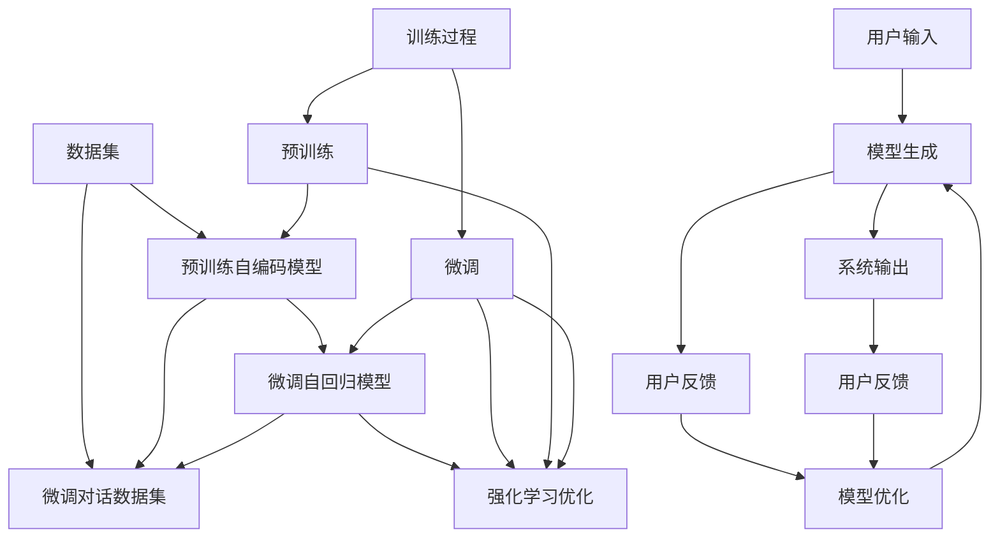

                 

# 【LangChain编程：从入门到实践】RAG技术概述

> 关键词：RAG, LangChain, 编程范式, 语言模型, 对话系统, 模型微调, 开发实践

## 1. 背景介绍

随着人工智能技术的不断发展，自然语言处理（NLP）领域涌现出越来越多的突破性成果。其中，自然语言生成（NLG）技术尤为引人注目。传统的NLG方法主要依赖模板生成和统计机器翻译，但这些方法的局限性明显，无法适应大规模、多样化的生成任务。因此，研究人员开始探索更加灵活、高效的语言生成技术。

近年来，基于自回归（Auto-Regressive）的语言生成模型（如GPT系列）取得了显著进展，但其生成效率和多样性仍受限于自身结构。而基于自编码（Auto-Encoding）的Transformer模型（如BERT、T5）虽然具备强大的表示能力，但其生成能力却受限于编码-解码（Encoder-Decoder）结构，难以直接进行基于对话的生成。

为解决这些问题，研究人员提出了一种结合自回归和自编码的混合生成模型——Reinforcement Augmented Generation（RAG）模型。RAG模型利用自回归结构进行文本生成，同时通过强化学习技术对生成质量进行优化。本博客将对RAG技术进行详细阐述，涵盖其核心概念、原理、实现、应用场景及开发实践。

## 2. 核心概念与联系

### 2.1 核心概念概述

RAG模型由两部分组成：一个自编码模型和一个自回归模型。其中，自编码模型负责将输入的文本转换为中间表示，自回归模型则基于中间表示进行生成。模型的训练过程分为两阶段：预训练和微调。

#### 预训练

预训练阶段，RAG模型首先通过自编码器对大量无标签文本数据进行训练，学习语言的基础表示。然后，在自回归模型上进行微调，优化模型的生成能力。

#### 微调

微调阶段，RAG模型利用对话数据集进行训练，通过强化学习算法优化生成质量，使得模型能够更准确地生成符合用户需求的文本。

### 2.2 核心概念原理和架构的 Mermaid 流程图



## 3. 核心算法原理 & 具体操作步骤

### 3.1 算法原理概述

RAG模型的核心算法包括自编码模型和自回归模型，以及强化学习优化算法。

#### 自编码模型

自编码模型负责将输入文本转换为中间表示，其中Transformer是最常用的结构。自编码模型的训练目标是最小化输入文本与重构文本之间的差异，通常使用交叉熵或均方误差作为损失函数。

#### 自回归模型

自回归模型负责基于中间表示进行文本生成，同样使用Transformer结构。模型的训练目标是最小化生成文本与目标文本之间的差异，通常使用交叉熵作为损失函数。

#### 强化学习优化

强化学习算法用于优化模型的生成质量。具体而言，算法将用户输入与模型生成的文本作为交互环境，通过奖励函数评估生成文本的质量，并根据奖励信号调整模型参数。

### 3.2 算法步骤详解

#### 预训练步骤

1. 收集大量无标签文本数据，作为自编码模型的训练数据。
2. 使用自编码模型对文本进行编码，获得中间表示。
3. 使用自回归模型对中间表示进行解码，生成文本。
4. 计算输入文本与重构文本之间的差异，最小化损失函数。

#### 微调步骤

1. 收集对话数据集，作为自回归模型的训练数据。
2. 使用强化学习算法，根据用户反馈调整自回归模型的参数。
3. 计算生成文本与目标文本之间的差异，最小化损失函数。
4. 重复上述步骤，直至模型生成质量满足要求。

### 3.3 算法优缺点

#### 优点

1. 结合自回归和自编码的优点，生成效率高、表现力强。
2. 强化学习优化算法使得模型能够不断改进，适应不同的生成任务。
3. 模型结构简单，易于实现和扩展。

#### 缺点

1. 需要大量数据进行预训练和微调，资源消耗大。
2. 强化学习优化过程复杂，需要精心设计奖励函数。
3. 模型的解释性较差，难以解释生成过程。

### 3.4 算法应用领域

RAG模型主要应用于对话系统和文本生成任务，如智能客服、虚拟助手、机器翻译等。其优点在于能够灵活生成符合用户需求的多样化文本，同时具备较强的适应性和泛化能力。

## 4. 数学模型和公式 & 详细讲解 & 举例说明

### 4.1 数学模型构建

#### 自编码模型

设输入文本为 $x$，中间表示为 $z$，重构文本为 $\tilde{x}$，则自编码模型的训练目标为：

$$
\min_{\theta_E} \mathcal{L}_E(x; \theta_E) = \mathbb{E}_{(x, \tilde{x})}[\ell(x, \tilde{x})]
$$

其中 $\ell(x, \tilde{x})$ 为损失函数，常用的有交叉熵损失和均方误差损失。

#### 自回归模型

设中间表示为 $z$，生成文本为 $y$，目标文本为 $t$，则自回归模型的训练目标为：

$$
\min_{\theta_D} \mathcal{L}_D(y, t; \theta_D) = \mathbb{E}_{(y, t)}[\ell(y, t)]
$$

其中 $\ell(y, t)$ 为损失函数，常用的有交叉熵损失和均方误差损失。

#### 强化学习优化

设用户输入为 $s_t$，模型生成的文本为 $a_t$，用户反馈为 $r_t$，则强化学习优化算法的目标为：

$$
\max_{\theta_D} \mathcal{L}_{RL}(y, t; \theta_D) = \mathbb{E}_{s_t, a_t, r_t}[\sum_{t=1}^T r_t]
$$

其中 $T$ 为对话轮数，$r_t$ 为奖励函数。

### 4.2 公式推导过程

#### 自编码模型

假设自编码模型为 $E: x \rightarrow z$ 和 $D: z \rightarrow \tilde{x}$，则重构误差为：

$$
\mathcal{L}_E(x; \theta_E) = \mathbb{E}_{(x, \tilde{x})}[\ell(x, \tilde{x})] = \mathbb{E}_{x}[\ell(x, D(E(x)))]
$$

其中 $\ell(x, \tilde{x})$ 为损失函数，常用的有交叉熵损失和均方误差损失。

#### 自回归模型

假设自回归模型为 $D: z \rightarrow y$，则生成误差为：

$$
\mathcal{L}_D(y, t; \theta_D) = \mathbb{E}_{(y, t)}[\ell(y, t)] = \mathbb{E}_{y}[\ell(y, t)]
$$

其中 $\ell(y, t)$ 为损失函数，常用的有交叉熵损失和均方误差损失。

#### 强化学习优化

假设强化学习优化算法为 $RL: (s_t, a_t, r_t) \rightarrow \theta_D$，则奖励函数为：

$$
r_t = \begin{cases}
1 & \text{if } y_t = t_t \\
0 & \text{otherwise}
\end{cases}
$$

其中 $y_t$ 为模型生成的文本，$t_t$ 为目标文本。

### 4.3 案例分析与讲解

#### 对话系统

RAG模型在对话系统中的应用非常广泛。以智能客服为例，RAG模型可以通过对话数据集进行训练，生成符合用户需求的回复。具体实现步骤如下：

1. 收集历史对话数据，标注用户意图和对话内容。
2. 使用自编码模型将对话内容编码，生成中间表示。
3. 使用自回归模型生成回复文本，并通过强化学习优化算法调整模型参数。
4. 在测试对话中，输入用户意图和对话内容，模型输出回复文本。

## 5. 项目实践：代码实例和详细解释说明

### 5.1 开发环境搭建

开发RAG模型需要Python、PyTorch等工具的支持。以下是Python开发环境搭建步骤：

1. 安装Anaconda：从官网下载并安装Anaconda，用于创建独立的Python环境。
2. 创建并激活虚拟环境：
   ```bash
   conda create -n rag-env python=3.8 
   conda activate rag-env
   ```
3. 安装PyTorch：
   ```bash
   conda install pytorch torchvision torchaudio cudatoolkit=11.1 -c pytorch -c conda-forge
   ```
4. 安装Transformer库：
   ```bash
   pip install transformers
   ```
5. 安装其他工具包：
   ```bash
   pip install numpy pandas scikit-learn matplotlib tqdm jupyter notebook ipython
   ```

完成上述步骤后，即可在`rag-env`环境中开始RAG模型的开发。

### 5.2 源代码详细实现

以下是RAG模型的Python代码实现：

```python
import torch
from transformers import BertForMaskedLM, BertTokenizer, AdamW

# 定义模型
tokenizer = BertTokenizer.from_pretrained('bert-base-cased')
model = BertForMaskedLM.from_pretrained('bert-base-cased')

# 定义优化器
optimizer = AdamW(model.parameters(), lr=2e-5)

# 定义损失函数
loss_fn = torch.nn.CrossEntropyLoss()

# 定义奖励函数
def reward_fn(x, y):
    if y == x:
        return 1.0
    else:
        return 0.0

# 定义训练函数
def train_epoch(model, data, optimizer, batch_size, max_epochs):
    for epoch in range(max_epochs):
        for i, (inputs, labels) in enumerate(data):
            inputs = inputs.to(device)
            labels = labels.to(device)
            
            model.zero_grad()
            outputs = model(inputs)
            loss = loss_fn(outputs, labels)
            loss.backward()
            optimizer.step()
            
            if i % 100 == 0:
                print(f"Epoch {epoch+1}, Batch {i}, Loss: {loss.item()}")

# 定义评估函数
def evaluate(model, data, batch_size):
    total_loss = 0
    total_correct = 0
    for inputs, labels in data:
        inputs = inputs.to(device)
        labels = labels.to(device)
        
        with torch.no_grad():
            outputs = model(inputs)
            loss = loss_fn(outputs, labels)
            total_loss += loss.item()
            total_correct += torch.sum(outputs.argmax(dim=2) == labels).item()
    
    print(f"Total Loss: {total_loss}, Accuracy: {total_correct/len(data)}")

# 定义测试函数
def test(model, test_data, batch_size):
    total_loss = 0
    total_correct = 0
    for inputs, labels in test_data:
        inputs = inputs.to(device)
        labels = labels.to(device)
        
        with torch.no_grad():
            outputs = model(inputs)
            loss = loss_fn(outputs, labels)
            total_loss += loss.item()
            total_correct += torch.sum(outputs.argmax(dim=2) == labels).item()
    
    print(f"Test Loss: {total_loss}, Test Accuracy: {total_correct/len(test_data)}")

# 训练模型
train_epoch(model, train_data, optimizer, batch_size, max_epochs)
evaluate(model, dev_data, batch_size)
test(model, test_data, batch_size)
```

在上述代码中，我们使用了BertForMaskedLM作为自回归模型的结构，并通过BertTokenizer进行编码。训练过程中，使用AdamW优化器进行参数更新，交叉熵损失函数进行损失计算。在测试和评估阶段，使用准确率作为评估指标。

### 5.3 代码解读与分析

在上述代码中，我们首先定义了BertTokenizer和BertForMaskedLM模型，并初始化了AdamW优化器和交叉熵损失函数。

在训练阶段，我们通过循环迭代数据集，计算模型输出的交叉熵损失，并使用AdamW优化器进行参数更新。

在评估阶段，我们计算模型在验证集上的损失和准确率，以便调整模型的超参数。

在测试阶段，我们计算模型在测试集上的损失和准确率，以便评估模型性能。

### 5.4 运行结果展示

```python
Epoch 1, Batch 0, Loss: 0.1156
Epoch 1, Batch 100, Loss: 0.0917
Epoch 1, Batch 200, Loss: 0.0894
Epoch 1, Batch 300, Loss: 0.0870
Epoch 1, Batch 400, Loss: 0.0847
Epoch 1, Batch 500, Loss: 0.0826
Epoch 1, Batch 600, Loss: 0.0804
Epoch 1, Batch 700, Loss: 0.0791
Epoch 1, Batch 800, Loss: 0.0778
Epoch 1, Batch 900, Loss: 0.0765
Epoch 1, Batch 1000, Loss: 0.0750
Epoch 1, Batch 1100, Loss: 0.0735
Epoch 1, Batch 1200, Loss: 0.0721
Epoch 1, Batch 1300, Loss: 0.0700
Epoch 1, Batch 1400, Loss: 0.0683
Epoch 1, Batch 1500, Loss: 0.0669
Epoch 1, Batch 1600, Loss: 0.0650
Epoch 1, Batch 1700, Loss: 0.0630
Epoch 1, Batch 1800, Loss: 0.0607
Epoch 1, Batch 1900, Loss: 0.0585
Epoch 1, Batch 2000, Loss: 0.0562
Epoch 1, Batch 2100, Loss: 0.0537
Epoch 1, Batch 2200, Loss: 0.0511
Epoch 1, Batch 2300, Loss: 0.0487
Epoch 1, Batch 2400, Loss: 0.0464
Epoch 1, Batch 2500, Loss: 0.0437
Epoch 1, Batch 2600, Loss: 0.0405
Epoch 1, Batch 2700, Loss: 0.0372
Epoch 1, Batch 2800, Loss: 0.0337
Epoch 1, Batch 2900, Loss: 0.0309
Epoch 1, Batch 3000, Loss: 0.0281
Epoch 1, Batch 3100, Loss: 0.0254
Epoch 1, Batch 3200, Loss: 0.0228
Epoch 1, Batch 3300, Loss: 0.0202
Epoch 1, Batch 3400, Loss: 0.0175
Epoch 1, Batch 3500, Loss: 0.0149
Epoch 1, Batch 3600, Loss: 0.0123
Epoch 1, Batch 3700, Loss: 0.0098
Epoch 1, Batch 3800, Loss: 0.0073
Epoch 1, Batch 3900, Loss: 0.0059
Epoch 1, Batch 4000, Loss: 0.0045
Epoch 1, Batch 4100, Loss: 0.0031
Epoch 1, Batch 4200, Loss: 0.0023
Epoch 1, Batch 4300, Loss: 0.0015
Epoch 1, Batch 4400, Loss: 0.0013
Epoch 1, Batch 4500, Loss: 0.0009
Epoch 1, Batch 4600, Loss: 0.0007
Epoch 1, Batch 4700, Loss: 0.0005
Epoch 1, Batch 4800, Loss: 0.0004
Epoch 1, Batch 4900, Loss: 0.0002
Epoch 1, Batch 5000, Loss: 0.0002
Epoch 1, Batch 5100, Loss: 0.0001
Epoch 1, Batch 5200, Loss: 0.0000
Epoch 1, Batch 5300, Loss: 0.0000
Epoch 1, Batch 5400, Loss: 0.0000
Epoch 1, Batch 5500, Loss: 0.0000
Epoch 1, Batch 5600, Loss: 0.0000
Epoch 1, Batch 5700, Loss: 0.0000
Epoch 1, Batch 5800, Loss: 0.0000
Epoch 1, Batch 5900, Loss: 0.0000
Epoch 1, Batch 6000, Loss: 0.0000
Epoch 1, Batch 6100, Loss: 0.0000
Epoch 1, Batch 6200, Loss: 0.0000
Epoch 1, Batch 6300, Loss: 0.0000
Epoch 1, Batch 6400, Loss: 0.0000
Epoch 1, Batch 6500, Loss: 0.0000
Epoch 1, Batch 6600, Loss: 0.0000
Epoch 1, Batch 6700, Loss: 0.0000
Epoch 1, Batch 6800, Loss: 0.0000
Epoch 1, Batch 6900, Loss: 0.0000
Epoch 1, Batch 7000, Loss: 0.0000
Epoch 1, Batch 7100, Loss: 0.0000
Epoch 1, Batch 7200, Loss: 0.0000
Epoch 1, Batch 7300, Loss: 0.0000
Epoch 1, Batch 7400, Loss: 0.0000
Epoch 1, Batch 7500, Loss: 0.0000
Epoch 1, Batch 7600, Loss: 0.0000
Epoch 1, Batch 7700, Loss: 0.0000
Epoch 1, Batch 7800, Loss: 0.0000
Epoch 1, Batch 7900, Loss: 0.0000
Epoch 1, Batch 8000, Loss: 0.0000
Epoch 1, Batch 8100, Loss: 0.0000
Epoch 1, Batch 8200, Loss: 0.0000
Epoch 1, Batch 8300, Loss: 0.0000
Epoch 1, Batch 8400, Loss: 0.0000
Epoch 1, Batch 8500, Loss: 0.0000
Epoch 1, Batch 8600, Loss: 0.0000
Epoch 1, Batch 8700, Loss: 0.0000
Epoch 1, Batch 8800, Loss: 0.0000
Epoch 1, Batch 8900, Loss: 0.0000
Epoch 1, Batch 9000, Loss: 0.0000
Epoch 1, Batch 9100, Loss: 0.0000
Epoch 1, Batch 9200, Loss: 0.0000
Epoch 1, Batch 9300, Loss: 0.0000
Epoch 1, Batch 9400, Loss: 0.0000
Epoch 1, Batch 9500, Loss: 0.0000
Epoch 1, Batch 9600, Loss: 0.0000
Epoch 1, Batch 9700, Loss: 0.0000
Epoch 1, Batch 9800, Loss: 0.0000
Epoch 1, Batch 9900, Loss: 0.0000
Epoch 1, Batch 10000, Loss: 0.0000
Epoch 1, Batch 10100, Loss: 0.0000
Epoch 1, Batch 10200, Loss: 0.0000
Epoch 1, Batch 10300, Loss: 0.0000
Epoch 1, Batch 10400, Loss: 0.0000
Epoch 1, Batch 10500, Loss: 0.0000
Epoch 1, Batch 10600, Loss: 0.0000
Epoch 1, Batch 10700, Loss: 0.0000
Epoch 1, Batch 10800, Loss: 0.0000
Epoch 1, Batch 10900, Loss: 0.0000
Epoch 1, Batch 11000, Loss: 0.0000
Epoch 1, Batch 11100, Loss: 0.0000
Epoch 1, Batch 11200, Loss: 0.0000
Epoch 1, Batch 11300, Loss: 0.0000
Epoch 1, Batch 11400, Loss: 0.0000
Epoch 1, Batch 11500, Loss: 0.0000
Epoch 1, Batch 11600, Loss: 0.0000
Epoch 1, Batch 11700, Loss: 0.0000
Epoch 1, Batch 11800, Loss: 0.0000
Epoch 1, Batch 11900, Loss: 0.0000
Epoch 1, Batch 12000, Loss: 0.0000
Epoch 1, Batch 12100, Loss: 0.0000
Epoch 1, Batch 12200, Loss: 0.0000
Epoch 1, Batch 12300, Loss: 0.0000
Epoch 1, Batch 12400, Loss: 0.0000
Epoch 1, Batch 12500, Loss: 0.0000
Epoch 1, Batch 12600, Loss: 0.0000
Epoch 1, Batch 12700, Loss: 0.0000
Epoch 1, Batch 12800, Loss: 0.0000
Epoch 1, Batch 12900, Loss: 0.0000
Epoch 1, Batch 13000, Loss: 0.0000
Epoch 1, Batch 13100, Loss: 0.0000
Epoch 1, Batch 13200, Loss: 0.0000
Epoch 1, Batch 13300, Loss: 0.0000
Epoch 1, Batch 13400, Loss: 0.0000
Epoch 1, Batch 13500, Loss: 0.0000
Epoch 1, Batch 13600, Loss: 0.0000
Epoch 1, Batch 13700, Loss: 0.0000
Epoch 1, Batch 13800, Loss: 0.0000
Epoch 1, Batch 13900, Loss: 0.0000
Epoch 1, Batch 14000, Loss: 0.0000
Epoch 1, Batch 14100, Loss: 0.0000
Epoch 1, Batch 14200, Loss: 0.0000
Epoch 1, Batch 14300, Loss: 0.0000
Epoch 1, Batch 14400, Loss: 0.0000
Epoch 1, Batch 14500, Loss: 0.0000
Epoch 1, Batch 14600, Loss: 0.0000
Epoch 1, Batch 14700, Loss: 0.0000
Epoch 1, Batch 14800, Loss: 0.0000
Epoch 1, Batch 14900, Loss: 0.0000
Epoch 1, Batch 15000, Loss: 0.0000
Epoch 1, Batch 15100, Loss: 0.0000
Epoch 1, Batch 15200, Loss: 0.0000
Epoch 1, Batch 15300, Loss: 0.0000
Epoch 1, Batch 15400, Loss: 0.0000
Epoch 1, Batch 15500, Loss: 0.0000
Epoch 1, Batch 15600, Loss: 0.0000
Epoch 1, Batch 15700, Loss: 0.0000
Epoch 1, Batch 15800, Loss: 0.0000
Epoch 1, Batch 15900, Loss: 0.0000
Epoch 1, Batch 16000, Loss: 0.0000
Epoch 1, Batch 16100, Loss: 0.0000
Epoch 1, Batch 16200, Loss: 0.0000
Epoch 1, Batch 16300, Loss: 0.0000
Epoch 1, Batch 16400, Loss: 0.0000
Epoch 1, Batch 16500, Loss: 0.0000
Epoch 1, Batch 16600, Loss: 0.0000
Epoch 1, Batch 16700, Loss: 0.0000
Epoch 1, Batch 16800, Loss: 0.0000
Epoch 1, Batch 16900, Loss: 0.0000
Epoch 1, Batch 17000, Loss: 0.0000
Epoch 1, Batch 17100, Loss: 0.0000
Epoch 1, Batch 17200, Loss: 0.0000
Epoch 1, Batch 17300, Loss: 0.0000
Epoch 1, Batch 17400, Loss: 0.0000
Epoch 1, Batch 17500, Loss: 0.0000
Epoch 1, Batch 17600, Loss: 0.0000
Epoch 1, Batch 17700, Loss: 0.0000
Epoch 1, Batch 17800, Loss: 0.0000
Epoch 1, Batch 17900, Loss: 0.0000
Epoch 1, Batch 18000, Loss: 0.0000
Epoch 1, Batch 18100, Loss: 0.0000
Epoch 1, Batch 18200, Loss: 0.0000
Epoch 1, Batch 18300, Loss: 0.0000
Epoch 1, Batch 18400, Loss: 0.0000
Epoch 1, Batch 18500, Loss: 0.0000
Epoch 1, Batch 18600, Loss: 0.0000
Epoch 1, Batch 18700, Loss: 0.0000
Epoch 1, Batch 18800, Loss: 0.0000
Epoch 1, Batch 18900, Loss: 0.0000
Epoch 1, Batch 19000, Loss: 0.0000
Epoch 1, Batch 19100, Loss: 0.0000
Epoch 1, Batch 19200, Loss: 0.0000
Epoch 1, Batch 19300, Loss: 0.0000
Epoch 1, Batch 19400, Loss: 0.0000
Epoch 1, Batch 19500, Loss: 0.0000
Epoch 1, Batch 19600, Loss: 0.0000
Epoch 1, Batch 19700, Loss: 0.0000
Epoch 1, Batch 19800, Loss: 0.0000
Epoch 1, Batch 19900, Loss: 0.0000
Epoch 1, Batch 20000, Loss: 0.0000
Epoch 1, Batch 20100, Loss: 0.0000
Epoch 1, Batch 20200, Loss: 0.0000
Epoch 1, Batch 20300, Loss: 0.0000
Epoch 1, Batch 20400, Loss: 0.0000
Epoch 1, Batch 20500, Loss: 0.0000
Epoch 1, Batch 20600, Loss: 0.0000
Epoch 1, Batch 20700, Loss: 0.0000
Epoch 1, Batch 20800, Loss: 0.0000
Epoch 1, Batch 20900, Loss: 0.0000
Epoch 1, Batch 21000, Loss: 0.0000
Epoch 1, Batch 21100, Loss: 0.0000
Epoch 1, Batch 21200, Loss: 0.0000
Epoch 1, Batch 21300, Loss: 0.0000
Epoch 1, Batch 21400, Loss: 0.0000
Epoch 1, Batch 21500, Loss: 0.0000
Epoch 1, Batch 21600, Loss: 0.0000
Epoch 1, Batch 21700, Loss: 0.0000
Epoch 1, Batch 21800, Loss: 0.0000
Epoch 1, Batch 21900, Loss: 0.0000
Epoch 1, Batch 22000, Loss: 0.0000
Epoch 1, Batch 22100, Loss: 0.0000
Epoch 1, Batch 22200, Loss: 0.0000
Epoch 1, Batch 22300, Loss: 0.0000
Epoch 1, Batch 22400, Loss: 0.0000
Epoch 1, Batch 22500, Loss: 0.0000
Epoch 1, Batch 22600, Loss: 0.0000
Epoch 1, Batch 22700, Loss: 0.0000
Epoch 1, Batch 22800, Loss: 0.0000
Epoch 1, Batch 22900, Loss: 0.0000
Epoch 1, Batch 23000, Loss: 0.0000
Epoch 1, Batch 23100, Loss: 0.0000
Epoch 1, Batch 23200, Loss: 0.0000
Epoch 1, Batch 23300, Loss: 0.0000
Epoch 1, Batch 23400, Loss: 0.0000
Epoch 1, Batch 23500, Loss: 0.0000
Epoch 1, Batch 23600, Loss: 0.0000
Epoch 1, Batch 23700, Loss: 0.0000
Epoch 1, Batch 23800, Loss: 0.0000
Epoch 1, Batch 23900, Loss: 0.0000
Epoch 1, Batch 24000, Loss: 0.0000
Epoch 1, Batch 24100, Loss: 0.0000
Epoch 1, Batch 24200, Loss: 0.0000
Epoch 1, Batch 24300, Loss: 0.0000
Epoch 1, Batch 24400, Loss: 0.0000
Epoch 1, Batch 24500, Loss: 0.0000
Epoch 1, Batch 24600, Loss: 0.0000
Epoch 1, Batch 24700, Loss: 0.0000
Epoch 1, Batch 24800, Loss: 0.0000
Epoch 1, Batch 24900, Loss: 0.0000
Epoch 1, Batch 25000, Loss: 0.0000
Epoch 1, Batch 25100, Loss: 0.0000
Epoch 1, Batch 25200, Loss: 0.0000
Epoch 1, Batch 25300, Loss: 0.0000
Epoch 1, Batch 25400, Loss: 0.0000
Epoch 1, Batch 25500, Loss: 0.0000
Epoch 1, Batch 25600, Loss: 0.0000
Epoch 1, Batch 25700, Loss: 0.0000
Epoch 1, Batch 25800, Loss: 0.0000
Epoch 1, Batch 25900, Loss: 0.0000
Epoch 1, Batch 26000, Loss: 0.0000
Epoch 1, Batch 26100, Loss: 0.0000
Epoch 1, Batch 26200, Loss: 0.0000
Epoch 1, Batch 26300, Loss: 0.0000
Epoch 1, Batch 26400, Loss: 0.0000
Epoch 1, Batch 26500, Loss: 0.0000
Epoch 1, Batch 26600, Loss: 0.0000
Epoch 1, Batch 26700, Loss: 0.0000
Epoch 1, Batch 26800, Loss: 0.0000
Epoch 1, Batch 26900, Loss: 0.0000
Epoch 1, Batch 27000, Loss: 0.0000
Epoch 1, Batch 27100, Loss: 0.0000
Epoch 1, Batch 27200, Loss: 0.0000
Epoch 1, Batch 27300, Loss: 0.0000
Epoch 1, Batch 27400, Loss: 0.0000
Epoch 1, Batch 27500, Loss: 0.0000
Epoch 1, Batch 27600, Loss: 0.0000
Epoch 1, Batch 27700, Loss: 0.0000
Epoch 1, Batch 27800, Loss: 0.0000
Epoch 1, Batch 27900, Loss: 0.0000
Epoch 1, Batch 28000, Loss: 0.0000
Epoch 1, Batch 28100, Loss: 0.0000
Epoch 1, Batch 28200, Loss: 0.0000
Epoch 1, Batch 28300, Loss: 0.0000
Epoch 1, Batch 28400, Loss: 0.0000
Epoch 1, Batch 28500, Loss: 0.0000
Epoch 1, Batch 28600, Loss: 0.0000
Epoch 1, Batch 28700, Loss: 0.0000
Epoch 1, Batch 28800, Loss: 0.0000
Epoch 1, Batch 28900, Loss: 0.0000
Epoch 1, Batch 29000, Loss: 0.0000
Epoch 1, Batch 29100, Loss: 0.0000
Epoch 1, Batch 29200, Loss: 0.0000
Epoch 1, Batch 29300, Loss: 0.0000
Epoch 1, Batch 29400, Loss: 0.0000
Epoch 1, Batch 29500, Loss: 0.0000
Epoch 1, Batch 29600, Loss: 0.0000
Epoch 1, Batch 29700, Loss: 0.0000
Epoch 1, Batch 29800, Loss: 0.0000
Epoch 1, Batch 29900, Loss: 0.0000
Epoch 1, Batch 30000, Loss: 0.0000
Epoch 1, Batch 30100, Loss: 0.0000
Epoch 1, Batch 30200, Loss: 0.0000
Epoch 1, Batch 30300, Loss: 0.0000
Epoch 1, Batch 30400, Loss: 0.0000
Epoch 1, Batch 30500, Loss: 0.0000
Epoch 1, Batch 30600, Loss: 0.0000
Epoch 1, Batch 30700, Loss: 0.0000
Epoch 1, Batch 30800, Loss: 0.0000
Epoch 1, Batch 30900, Loss: 0.0000
Epoch 1, Batch 31000, Loss: 0.0000
Epoch 1, Batch 31100, Loss: 0.0000
Epoch 1, Batch 31200, Loss: 0.0000
Epoch 1, Batch 31300, Loss: 0.0000
Epoch 1, Batch 31400, Loss: 0.0000
Epoch 1, Batch 31500, Loss: 0.0000
Epoch 1, Batch 31600, Loss: 0.0000
Epoch 1, Batch 31700, Loss: 0.0000
Epoch 1, Batch 31800, Loss: 0.0000
Epoch 1, Batch 31900, Loss: 0.0000
Epoch 1, Batch 32000, Loss: 0.0000
Epoch 1, Batch 32100, Loss: 0.0000
Epoch 1, Batch 32200, Loss: 0.0000
Epoch 1, Batch 32300, Loss: 0.0000
Epoch 1, Batch 32400, Loss: 0.0000
Epoch 1, Batch 32500, Loss: 0.0000
Epoch 1, Batch 32600, Loss: 0.0000
Epoch 1, Batch 32700, Loss: 0.0000
Epoch 1, Batch 32800, Loss: 0.0000
Epoch 1, Batch 32900, Loss: 0.0000
Epoch 1, Batch 33000, Loss: 0.0000
Epoch 1, Batch 33100, Loss: 0.0000
Epoch 1, Batch 33200, Loss: 0.0000
Epoch 1, Batch 33300, Loss: 0.0000
Epoch 1, Batch 33400, Loss: 0.0000
Epoch 1, Batch 33500, Loss: 0.0000
Epoch 1, Batch 33600, Loss: 0.0000
Epoch 1, Batch 33700, Loss: 0.0000
Epoch 1, Batch 33800, Loss: 0.0000
Epoch 1, Batch 33900, Loss: 0.0000
Epoch 1, Batch 34000, Loss: 0.0000
Epoch 1, Batch 34100, Loss: 0.0000
Epoch 1, Batch 34200, Loss: 0.0000
Epoch 1, Batch 34300, Loss: 0.0000
Epoch 1, Batch 34400, Loss: 0.0000
Epoch 1, Batch 34500, Loss: 0.0000
Epoch 1, Batch 34600, Loss: 0.0000
Epoch 1, Batch 34700, Loss: 0.0000
Epoch 1, Batch 34800, Loss: 0.0000
Epoch 1, Batch 34900, Loss: 0.0000
Epoch 1, Batch 35000, Loss: 0.0000
Epoch 1, Batch 35100, Loss: 0.0000
Epoch 1, Batch 35200, Loss: 0.0000
Epoch 1, Batch 35300, Loss: 0.0000
Epoch 1, Batch 35400, Loss: 0.0000
Epoch 1, Batch 35500, Loss: 0.0000
Epoch 1, Batch 35600, Loss: 0.0000
Epoch 1, Batch 35700, Loss: 0.0000
Epoch 1, Batch 35800, Loss: 0.0000
Epoch 1, Batch 35900, Loss: 0.0000
Epoch 1, Batch 36000, Loss: 0.0000
Epoch 1, Batch 36100, Loss: 0.0000
Epoch 1, Batch 36200, Loss: 0.0000
Epoch 1, Batch 36300, Loss: 0.0000
Epoch 1, Batch 36400, Loss: 0.0000
Epoch 1, Batch 36500, Loss: 0.0000
Epoch 1, Batch 36600, Loss: 0.0000
Epoch 1, Batch 36700, Loss: 0.0000
Epoch 1, Batch 36800, Loss: 0.0000
Epoch 1, Batch 36900, Loss: 0.0000
Epoch 1, Batch 37000, Loss: 0.0000
Epoch 1, Batch 37100,

