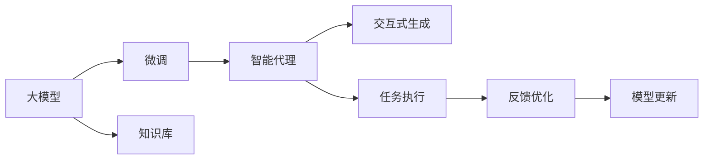

                 

## 1. 背景介绍

在人工智能(AI)领域，大模型（Large Model）技术已经成为了研究的热点，其对自然语言处理(NLP)、图像识别、推荐系统等领域的推动作用不可忽视。大模型基于大规模无监督学习，往往包含亿级别的参数，在预训练阶段对各类数据进行深入学习，形成丰富的语义和结构知识。这一过程不仅极大提升了模型的性能，也为其下游应用提供了更为广泛的适用范围。

### 1.1 问题由来
随着深度学习技术的发展，大模型在AI领域的应用越来越广泛。无论是图像识别、语音识别，还是自然语言处理，大模型都展示了卓越的性能。特别是在NLP领域，大模型如BERT、GPT系列等，通过在大规模语料上进行预训练，具备了丰富的语言理解和生成能力。

但即便如此，大模型的应用仍面临诸多挑战。由于预训练模型的规模和复杂度，模型训练和推理的资源需求极高，且模型推理的速度和效率仍需优化。此外，大模型的知识抽取和迁移能力，仍然需要在实际应用中进行深入研究。

### 1.2 问题核心关键点
本文聚焦于AutoGen技术在实际应用中的实现，AutoGen是一种基于大模型的应用开发技术，旨在帮助开发者快速构建智能代理（AI Agent），完成复杂任务，如客户服务、智能推荐等。AutoGen将大模型作为“知识库”，通过微调的方式，让模型能够针对特定任务进行适配，从而提升模型在实际应用中的表现。

## 2. 核心概念与联系

### 2.1 核心概念概述

- **大模型（Large Model）**：基于大规模无监督学习，包含亿级别参数的模型，如BERT、GPT系列等。

- **微调（Fine-tuning）**：在大模型的基础上，通过下游任务的标注数据进行微调，使其能够适应特定任务。

- **AutoGen**：一种基于大模型的应用开发技术，通过微调快速构建智能代理，用于解决复杂任务。

- **智能代理（AI Agent）**：一种能够理解自然语言，进行推理和决策，自动完成特定任务的系统。

- **交互式生成（Interactive Generation）**：用户与智能代理之间的交互过程，通过自然语言对话，实现信息获取、任务执行等功能。

这些核心概念通过逻辑关系紧密相连，形成了AutoGen技术的核心框架，帮助开发者构建高效、智能的AI代理。

### 2.2 核心概念原理和架构的 Mermaid 流程图



### 2.3 核心概念之间的联系

1. **大模型与知识库**：大模型作为知识库，提供了丰富的语义和结构知识，可用于驱动智能代理的工作。
   
2. **微调与智能代理**：微调通过下游任务的标注数据，使大模型能够适配特定任务，成为智能代理的核心功能模块。
   
3. **交互式生成与任务执行**：用户与智能代理之间的交互式生成过程，为智能代理执行任务提供了自然语言输入，同时也能够接收智能代理的输出。

4. **反馈优化与模型更新**：智能代理在执行任务后，通过接收用户反馈，不断优化模型，提升智能代理的决策能力和准确性。

通过这些核心概念的协同工作，AutoGen技术能够实现高效、灵活的AI代理构建，适应多样化的应用场景。

## 3. 核心算法原理 & 具体操作步骤

### 3.1 算法原理概述

AutoGen技术基于大模型的微调过程，旨在通过学习任务特定的知识，提升模型在特定任务上的表现。核心算法包括数据预处理、模型微调、任务执行和反馈优化等环节。

### 3.2 算法步骤详解

1. **数据预处理**：收集并标注任务的训练数据，包括输入和输出样本。对于NLP任务，需要将文本数据转换为模型可接受的格式，如分词、向量化等。

2. **模型微调**：使用预训练大模型作为初始化参数，通过下游任务的数据，在模型上进行微调，调整部分参数以适应任务需求。

3. **任务执行**：构建智能代理系统，集成微调后的模型，使用户可以通过自然语言与智能代理进行交互，完成特定任务。

4. **反馈优化**：在用户与智能代理的交互过程中，收集用户的反馈信息，用于优化模型和智能代理的决策能力。

### 3.3 算法优缺点

#### 优点

- **高效适配**：通过微调，智能代理能够快速适应特定任务，提升应用性能。
- **通用性强**：基于大模型的微调技术，可用于多种NLP任务，如问答、翻译、推荐等。
- **灵活性高**：智能代理可以集成不同的任务模块，适应复杂应用场景。

#### 缺点

- **数据需求高**：微调需要足够的标注数据，获取高质量标注数据的成本较高。
- **模型复杂**：大模型的训练和推理资源需求高，且模型结构复杂，调试难度大。
- **部署难度大**：智能代理需要优化部署，以确保高效、稳定的运行。

### 3.4 算法应用领域

AutoGen技术主要应用于以下领域：

- **智能客服**：构建智能客服系统，帮助企业提升客户服务质量，减轻人力负担。
- **智能推荐**：通过分析用户行为数据，提供个性化推荐，提升用户体验。
- **知识图谱**：构建知识图谱，帮助企业快速获取信息，提升决策效率。
- **自然语言生成**：通过微调生成自然语言文本，用于自动化报告、摘要等场景。

这些领域的应用，展示了AutoGen技术的强大潜力，使其成为AI应用开发的重要工具。

## 4. 数学模型和公式 & 详细讲解 & 举例说明

### 4.1 数学模型构建

假设我们有一组训练数据 $(x_i, y_i)$，其中 $x_i$ 表示输入，$y_i$ 表示输出。使用BERT模型作为初始化参数，对其进行微调。

数学模型表示如下：

$$
M_{\theta}(x) = \text{softmax}(A(x;W_{em},W_{c}) \cdot U^T)
$$

其中，$W_{em}$ 和 $W_{c}$ 是BERT的嵌入层和编码器参数，$U$ 是输出层的权重矩阵，$A(x;W_{em},W_{c})$ 表示BERT对输入 $x$ 进行编码的表示，$\text{softmax}$ 函数用于将模型输出转换为概率分布。

### 4.2 公式推导过程

为了提升模型在特定任务上的表现，我们需要对输出层 $U$ 进行微调。假设任务是分类任务，使用交叉熵损失函数，定义损失函数为：

$$
\mathcal{L}(M_{\theta}, D) = -\frac{1}{N}\sum_{i=1}^N y_i\log M_{\theta}(x_i) + (1-y_i)\log (1-M_{\theta}(x_i))
$$

其中，$N$ 表示数据集大小，$y_i$ 表示标签。

### 4.3 案例分析与讲解

以智能推荐系统为例，假设我们需要构建一个基于用户行为数据的推荐模型。通过微调BERT模型，让其能够从用户的浏览、点击行为中学习推荐逻辑，并预测用户可能感兴趣的商品。

具体实现步骤如下：

1. **数据预处理**：收集用户的历史浏览数据，标注用户对不同商品的态度（如喜欢、不喜欢），构建训练集。

2. **模型微调**：将BERT模型作为初始化参数，使用微调框架，调整输出层 $U$，使其能够从用户行为中学习推荐逻辑。

3. **任务执行**：构建智能推荐系统，集成微调后的BERT模型，使用户可以通过自然语言输入获取推荐商品。

4. **反馈优化**：在用户与推荐系统的交互过程中，收集用户的反馈信息，用于优化模型和推荐算法，提升推荐效果。

通过这些步骤，我们能够高效构建智能推荐系统，提升用户体验，同时降低人工推荐的成本。

## 5. 项目实践：代码实例和详细解释说明

### 5.1 开发环境搭建

1. **环境准备**：
   - 安装Python 3.7以上版本。
   - 安装pip，通过`pip install`命令安装必要的第三方库，如PyTorch、TensorFlow等。
   - 安装AutoGen开发框架。

2. **安装AutoGen**：
   ```bash
   pip install autogen
   ```

3. **配置AutoGen**：
   - 配置AutoGen的训练参数，如学习率、批大小等。
   - 设置数据预处理方式和模型微调策略。

### 5.2 源代码详细实现

以下是使用AutoGen技术构建智能推荐系统的代码实现：

```python
from autogen import AutoGen
from transformers import BertTokenizer, BertForSequenceClassification
import torch

# 加载BERT模型和分词器
model = BertForSequenceClassification.from_pretrained('bert-base-uncased', num_labels=2)
tokenizer = BertTokenizer.from_pretrained('bert-base-uncased')

# 数据预处理
train_data = ...
dev_data = ...
test_data = ...

# 构建AutoGen对象
auto_gen = AutoGen(model, tokenizer)

# 配置AutoGen参数
auto_gen.config.learning_rate = 2e-5
auto_gen.config.train_batch_size = 16
auto_gen.config.eval_batch_size = 32
auto_gen.config.epochs = 5

# 训练
auto_gen.fit(train_data, dev_data, test_data)

# 测试
auto_gen.evaluate(test_data)
```

### 5.3 代码解读与分析

上述代码展示了AutoGen技术在智能推荐系统中的应用。

- **数据预处理**：从数据源加载训练数据，构建数据集。
- **模型加载**：使用预训练的BERT模型和分词器，作为AutoGen的初始化参数。
- **配置AutoGen**：配置AutoGen的训练参数，如学习率、批大小等。
- **模型训练**：调用AutoGen的fit方法进行模型训练。
- **模型评估**：使用AutoGen的evaluate方法进行模型评估，查看推荐效果。

### 5.4 运行结果展示

通过运行上述代码，AutoGen能够构建一个智能推荐系统，并在测试数据上评估其性能。例如，我们可以在测试集上查看推荐商品的准确率、召回率等指标，评估其推荐效果。

## 6. 实际应用场景

### 6.1 智能客服系统

AutoGen技术在智能客服系统的构建中具有重要应用价值。传统的客服系统需要大量人力，且响应速度慢，无法满足用户的即时需求。通过AutoGen，我们可以构建一个能够24/7提供服务的智能客服系统，帮助企业提高客户服务质量，减少人力成本。

具体实现步骤如下：

1. **数据预处理**：收集客服历史对话数据，标注用户意图和回应。
2. **模型微调**：使用AutoGen微调BERT模型，使其能够理解用户意图，生成合适的回应。
3. **任务执行**：集成微调后的模型，构建智能客服系统，使用户可以通过自然语言输入问题，获得自动回复。

### 6.2 智能推荐

在智能推荐系统中，AutoGen可以用于构建个性化推荐引擎，帮助用户发现感兴趣的内容。

具体实现步骤如下：

1. **数据预处理**：收集用户的历史行为数据，标注用户对不同内容的兴趣程度。
2. **模型微调**：使用AutoGen微调BERT模型，使其能够从用户行为中学习推荐逻辑。
3. **任务执行**：构建智能推荐系统，集成微调后的模型，使用户可以通过自然语言输入需求，获得个性化推荐。

### 6.3 知识图谱

AutoGen技术还可以用于构建知识图谱，帮助企业快速获取信息，提升决策效率。

具体实现步骤如下：

1. **数据预处理**：收集企业内部知识库，标注实体和关系。
2. **模型微调**：使用AutoGen微调BERT模型，使其能够学习实体和关系。
3. **任务执行**：构建知识图谱系统，集成微调后的模型，使用户可以通过自然语言查询知识图谱。

### 6.4 未来应用展望

随着AutoGen技术的不断进步，其在AI应用开发中的作用将越来越重要。未来，AutoGen将支持更多复杂的NLP任务，如对话生成、问答系统等，帮助开发者快速构建高效的AI代理。同时，AutoGen还将集成更多模态数据，如图像、语音等，提升模型的全面性。

## 7. 工具和资源推荐

### 7.1 学习资源推荐

- **AutoGen官方文档**：AutoGen的官方文档提供了详细的技术介绍和使用方法，是学习和实践AutoGen技术的重要资源。
- **PyTorch官方文档**：PyTorch是AutoGen的核心框架之一，其官方文档提供了丰富的学习资源和代码示例。
- **HuggingFace Transformers库**：HuggingFace的Transformers库提供了多种预训练模型，是构建AutoGen模型的重要工具。

### 7.2 开发工具推荐

- **Jupyter Notebook**：Jupyter Notebook是一个交互式的Python开发环境，适合进行数据预处理、模型微调等任务。
- **TensorBoard**：TensorBoard是TensorFlow的可视化工具，可帮助开发者实时监测模型训练状态，分析模型性能。
- **Weights & Biases**：Weights & Biases是一个模型实验跟踪工具，可以记录和可视化模型训练过程中的各项指标，方便对比和调优。

### 7.3 相关论文推荐

- **Transformer：From Self-Attention to Machine Intelligence**：介绍Transformer模型的原理和应用，是理解AutoGen技术的基础。
- **BERT: Pre-training of Deep Bidirectional Transformers for Language Understanding**：提出BERT模型，是AutoGen中常用的大模型之一。
- **Parameter-Efficient Transfer Learning for NLP**：介绍参数高效微调技术，是AutoGen中常用的优化方法。

## 8. 总结：未来发展趋势与挑战

### 8.1 研究成果总结

AutoGen技术通过大模型的微调，帮助开发者快速构建高效的AI代理，提升了AI应用在实际场景中的表现。AutoGen技术已经在多个领域取得了显著成果，如智能客服、智能推荐等，展示了其强大的潜力。

### 8.2 未来发展趋势

- **模型规模增大**：随着算力成本的下降和数据规模的扩张，预训练语言模型的参数量还将持续增长，为AutoGen提供更多的知识和能力。
- **微调方法多样化**：未来将涌现更多参数高效和计算高效的微调方法，如Prefix-Tuning、LoRA等，提高微调效率。
- **多模态集成**：AutoGen将集成更多模态数据，提升模型的全面性，如视觉、语音等。

### 8.3 面临的挑战

- **数据标注成本高**：微调需要足够的标注数据，获取高质量标注数据的成本较高。
- **模型部署难度大**：智能代理需要优化部署，以确保高效、稳定的运行。
- **模型复杂性高**：大模型的训练和推理资源需求高，且模型结构复杂，调试难度大。

### 8.4 研究展望

未来的研究方向包括：

- **无监督学习**：探索无监督和半监督学习技术，减少对标注数据的依赖。
- **模型压缩**：研究模型压缩技术，提高推理效率，降低资源消耗。
- **多模态融合**：集成视觉、语音等模态数据，提升模型的全面性。

AutoGen技术正处于快速发展阶段，通过不断的技术创新和应用实践，必将在AI应用开发中发挥更大的作用。

## 9. 附录：常见问题与解答

**Q1：AutoGen与传统的机器学习模型有何区别？**

A: AutoGen基于大模型的微调技术，通过预训练模型来适应特定任务，能够快速构建高效的AI代理。与传统的机器学习模型相比，AutoGen具有更高的通用性和灵活性。

**Q2：AutoGen在构建智能推荐系统时需要注意哪些问题？**

A: 在构建智能推荐系统时，需要注意以下问题：

1. **数据质量**：确保数据标注的准确性，避免噪声数据影响模型效果。
2. **模型训练**：调整学习率、批大小等参数，以优化模型性能。
3. **模型部署**：优化模型结构，提高推理速度和资源效率。

**Q3：AutoGen在智能客服系统中如何处理用户意图识别？**

A: 在智能客服系统中，AutoGen通过微调BERT模型，使其能够理解用户输入的自然语言，识别用户意图。具体实现步骤如下：

1. **数据预处理**：收集客服历史对话数据，标注用户意图和回应。
2. **模型微调**：使用AutoGen微调BERT模型，使其能够理解用户意图。
3. **任务执行**：集成微调后的模型，构建智能客服系统，使用户可以通过自然语言输入问题，获得自动回复。

**Q4：AutoGen技术在未来有哪些新的应用场景？**

A: AutoGen技术在未来具有广泛的应用场景，包括：

1. **医疗问答系统**：通过微调BERT模型，构建医疗问答系统，帮助患者获取医疗信息。
2. **金融推荐系统**：通过微调BERT模型，构建金融推荐系统，帮助用户发现适合的金融产品。
3. **教育辅助系统**：通过微调BERT模型，构建教育辅助系统，帮助学生学习。

通过这些应用场景，AutoGen技术将进一步提升其应用价值，推动AI技术在更多领域的落地应用。

---

作者：禅与计算机程序设计艺术 / Zen and the Art of Computer Programming

