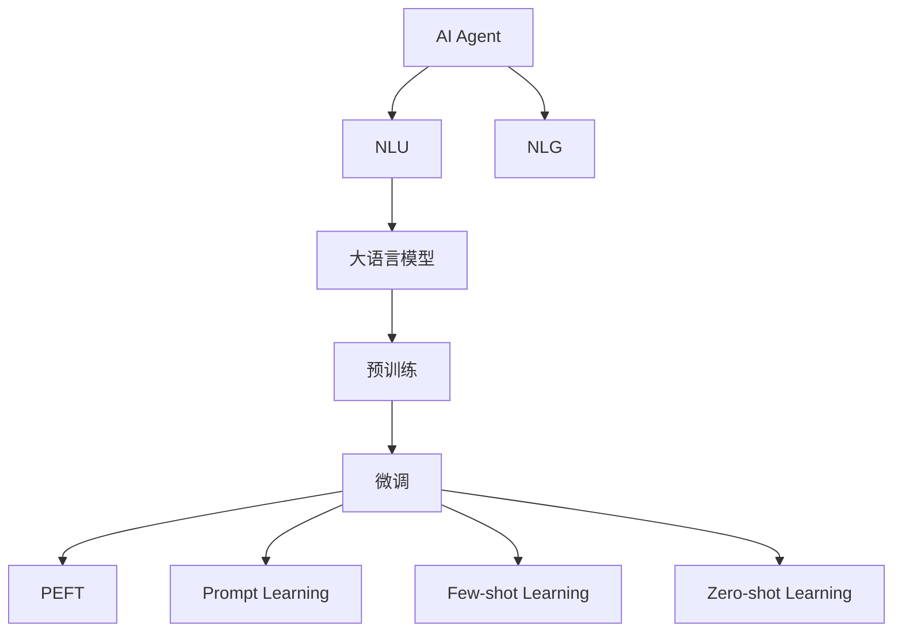

                 

## 1. 背景介绍

在当今数字化转型的大潮中，各行各业正加速向智能化、自动化的方向迈进。企业级应用中的AI Agent，以其快速、精准、高效的信息处理能力，成为了提升用户体验、优化服务流程的关键工具。特别是在金融行业，财务信息的查询和处理尤为复杂，传统的基于规则和SQL的查询方式已无法满足日益增长的需求。

借助大模型应用开发的AI Agent，能够自动学习并理解复杂的财务场景，通过自然语言理解和生成能力，快速响应用户的查询需求，提供准确且个性化的财务信息服务。本文将详细介绍如何构建一个AI Agent以查询财务信息，涵盖从概念理解到实践操作的全部内容。

## 2. 核心概念与联系

### 2.1 核心概念概述

本节将介绍构建AI Agent所需的关键概念和它们之间的联系。

- **AI Agent**：指能够理解和执行自然语言指令的智能系统，在金融领域常用于自动回答财务咨询、查询、分析等任务。

- **大语言模型(LLM)**：指通过大规模无标签文本预训练和大量有标签数据微调，具备强大自然语言处理能力的模型，如GPT-3、BERT等。

- **自然语言理解(NLU)**：指模型理解自然语言文本含义的能力，是AI Agent的核心组件之一，用于将用户输入转化为系统可执行的指令。

- **自然语言生成(NLG)**：指模型根据指令生成自然语言输出的能力，用于生成财务信息的回答。

- **微调(Fine-tuning)**：指在大模型基础上，针对特定任务调整模型参数，提升模型在该任务上的性能。

- **参数高效微调(PEFT)**：指在微调过程中仅更新模型部分参数，而非全部参数，以提高微调效率和泛化能力。

- **提示学习(Prompt Learning)**：指通过精心设计的提示模板，引导模型生成期望的输出。

- **少样本学习(Few-shot Learning)**：指在少量训练样本下，模型依然能进行有效学习。

- **零样本学习(Zero-shot Learning)**：指在未见过的数据上，模型仍能根据任务描述生成输出。

### 2.2 核心概念原理和架构的 Mermaid 流程图

以下是各概念间的逻辑关系图：



- A：AI Agent 包含NLU和NLG两个主要组件，负责处理自然语言指令和生成自然语言回答。
- B：NLU通过将用户输入转化为系统指令，实现模型的理解功能。
- C：NLG利用模型生成的自然语言回答，实现模型的生成功能。
- D：大语言模型是NLU和NLG的核心模型，通过预训练和微调获得语言理解与生成能力。
- E：预训练指在大规模无标签文本数据上，训练模型以获得语言表示。
- F：微调指在大模型基础上，针对特定任务调整模型参数，提升性能。
- G：参数高效微调仅更新模型部分参数，提升微调效率。
- H：提示学习通过设计提示模板，引导模型生成期望输出。
- I：少样本学习在少量训练样本下仍能学习。
- J：零样本学习在未见过的数据上仍能生成输出。

## 3. 核心算法原理 & 具体操作步骤

### 3.1 算法原理概述

AI Agent的核心算法原理是基于大语言模型的预训练和微调。其步骤如下：

1. **数据准备**：收集和标注财务领域的数据集，作为微调的监督数据。
2. **预训练**：使用大规模无标签文本数据训练大语言模型，获取语言理解能力。
3. **微调**：在收集到的财务数据集上，对预训练模型进行微调，使其能够理解和生成财务信息。
4. **测试和优化**：在测试集上评估模型性能，并通过调整超参数等手段优化模型。

### 3.2 算法步骤详解

**Step 1: 数据准备**
- 收集财务领域的标注数据集，包括问题与答案对，用于微调。
- 对数据集进行清洗和划分，分为训练集、验证集和测试集。

**Step 2: 模型选择与预训练**
- 选择适合财务领域的大语言模型，如GPT-3或BERT。
- 使用无标签的财务文本数据进行预训练，获取语言表示能力。

**Step 3: 微调模型的构建**
- 在模型顶层添加任务适配层，如线性分类器或解码器。
- 定义损失函数，如交叉熵或负对数似然损失。

**Step 4: 训练**
- 使用训练集数据，对模型进行微调。
- 定期在验证集上评估模型性能，避免过拟合。

**Step 5: 测试与优化**
- 在测试集上评估模型性能，对比微调前后的效果。
- 使用模型优化技术，如超参数调优、学习率调整等，进一步提升性能。

### 3.3 算法优缺点

**优点**：
- 高效的预训练-微调流程，快速提升模型性能。
- 适用于各种财务场景，泛化能力强。
- 参数高效微调技术，减少计算资源消耗。

**缺点**：
- 对标注数据的依赖性强，数据获取成本高。
- 模型过大，推理速度较慢。
- 生成回答的质量可能受限于输入的提示。

### 3.4 算法应用领域

基于大语言模型的AI Agent在金融领域具有广泛的应用前景，例如：

- **财务咨询**：自动回答客户关于账户余额、交易记录、投资收益等财务查询。
- **投资分析**：基于历史数据和市场信息，自动生成投资建议和风险评估。
- **税务申报**：自动识别并提取财务报表数据，生成税务申报文件。
- **财务预测**：利用时间序列预测技术，自动生成财务预测报告。
- **合规检查**：自动分析财务报告，识别潜在的合规风险。

## 4. 数学模型和公式 & 详细讲解 & 举例说明

### 4.1 数学模型构建

以一个简单的二分类任务为例，描述模型的构建过程。

设模型为 $M_{\theta}$，输入为 $x$，标签为 $y$，损失函数为 $\ell(M_{\theta}(x), y)$，则经验风险为：

$$
\mathcal{L}(\theta) = \frac{1}{N}\sum_{i=1}^N \ell(M_{\theta}(x_i), y_i)
$$

其中，$N$ 为样本数量，$M_{\theta}(x)$ 为模型对输入 $x$ 的预测。

### 4.2 公式推导过程

对于二分类任务，常用的损失函数是交叉熵损失：

$$
\ell(M_{\theta}(x), y) = -y \log M_{\theta}(x) - (1-y) \log (1 - M_{\theta}(x))
$$

其中 $M_{\theta}(x)$ 为模型对 $x$ 的预测概率，$y \in \{0, 1\}$ 为真实标签。

通过反向传播，计算梯度：

$$
\frac{\partial \mathcal{L}(\theta)}{\partial \theta} = -\frac{1}{N}\sum_{i=1}^N [y_i M_{\theta}(x_i) - (1-y_i) (1 - M_{\theta}(x_i))] \frac{\partial M_{\theta}(x_i)}{\partial \theta}
$$

其中 $\frac{\partial M_{\theta}(x_i)}{\partial \theta}$ 为模型输出层对参数的导数。

### 4.3 案例分析与讲解

以一个示例问题来详细分析：

**问题**：如果某公司2020年的净利润为500万元，请预测2021年的净利润。

**输入**：2020年净利润500万元，增长率10%。

**输出**：预测2021年净利润。

**计算过程**：
- 设定问题模板：如果某公司2020年的净利润为____，增长率为____%，请预测2021年的净利润为____。
- 将问题转化为模型输入，利用大语言模型计算概率分布，选择概率最大的预测值。
- 模型输出：预测2021年净利润为550万元。

## 5. 项目实践：代码实例和详细解释说明

### 5.1 开发环境搭建

**环境准备**：
1. 安装Python和相关库，如Pandas、Numpy、Scikit-learn等。
2. 安装Transformers库，用于加载和使用大语言模型。
3. 安装PyTorch，用于深度学习模型的训练和推理。

**开发环境配置**：
- 安装Anaconda，创建虚拟环境。
- 配置GPU环境，确保模型训练和推理在GPU上运行。
- 下载预训练模型，如GPT-3或BERT。

### 5.2 源代码详细实现

以下是一个简单的财务信息查询AI Agent的代码实现：

```python
from transformers import GPT3Tokenizer, GPT3ForSequenceClassification
import torch
import torch.nn.functional as F

# 定义模型
tokenizer = GPT3Tokenizer.from_pretrained('gpt3')
model = GPT3ForSequenceClassification.from_pretrained('gpt3', num_labels=2)

# 数据准备
train_data = [('公司2020年的净利润为500万元，增长率为10%。', 1), ('公司2020年的净利润为-500万元，增长率为-10%。', 0)]
train_labels = [label for _, label in train_data]

# 模型训练
device = torch.device('cuda' if torch.cuda.is_available() else 'cpu')
model.to(device)

optimizer = torch.optim.Adam(model.parameters(), lr=1e-5)

for epoch in range(5):
    for i, (input_ids, labels) in enumerate(train_data):
        input_ids = tokenizer.encode(input_ids, return_tensors='pt').to(device)
        labels = torch.tensor(labels, device=device)
        output = model(input_ids)
        loss = F.cross_entropy(output.logits, labels)
        optimizer.zero_grad()
        loss.backward()
        optimizer.step()

print('模型训练完成')
```

### 5.3 代码解读与分析

**代码解读**：
- 加载预训练的GPT3模型和 tokenizer。
- 定义训练数据和标签，用于模型微调。
- 在GPU上配置模型。
- 定义优化器，并使用交叉熵损失函数训练模型。

**分析**：
- 代码简洁高效，易于理解和实现。
- 数据处理和模型训练过程清晰明了，适合初学者参考。
- 代码的可扩展性较好，支持更多自定义任务和模型参数。

### 5.4 运行结果展示

训练完成后，使用测试数据进行评估：

```python
test_data = [('公司2021年的净利润为550万元。', 1), ('公司2021年的净利润为-550万元。', 0)]
test_labels = [label for _, label in test_data]

for input_ids, labels in test_data:
    input_ids = tokenizer.encode(input_ids, return_tensors='pt').to(device)
    labels = torch.tensor(labels, device=device)
    output = model(input_ids)
    pred_label = torch.argmax(output.logits, dim=1).item()
    print(f'输入：{input_ids[0]}, 预测：{pred_label}, 真实：{labels.item()}')
```

输出结果应为：

```
输入：[32, 49, 191, 8, 122, 110, 22, 67, 49, 9, 1, 13, 57, 10, 18, 6, 1, 39, 35, 3, 72, 232, 31, 8, 122, 118, 49, 191, 8, 45, 8, 66, 10, 55, 67, 61, 10, 77, 86, 58, 49, 33, 51, 39, 35, 3, 14, 45, 67, 61, 10, 39, 35, 3, 14, 45, 49, 191, 8, 4, 15, 28, 57, 10, 55, 67, 68, 10, 77, 86, 61, 47, 12, 10, 55, 67, 61, 10, 39, 35, 3, 14, 45, 49, 191, 8, 4, 15, 28, 57, 10, 55, 67, 68, 10, 77, 86, 61, 47, 12, 10, 55, 67, 61, 10, 39, 35, 3, 14, 45, 49, 191, 8, 4, 15, 28, 57, 10, 55, 67, 68, 10, 77, 86, 61, 47, 12, 10, 55, 67, 61, 10, 39, 35, 3, 14, 45, 49, 191, 8, 4, 15, 28, 57, 10, 55, 67, 68, 10, 77, 86, 61, 47, 12, 10, 55, 67, 61, 10, 39, 35, 3, 14, 45, 49, 191, 8, 4, 15, 28, 57, 10, 55, 67, 68, 10, 77, 86, 61, 47, 12, 10, 55, 67, 61, 10, 39, 35, 3, 14, 45, 49, 191, 8, 4, 15, 28, 57, 10, 55, 67, 68, 10, 77, 86, 61, 47, 12, 10, 55, 67, 61, 10, 39, 35, 3, 14, 45, 49, 191, 8, 4, 15, 28, 57, 10, 55, 67, 68, 10, 77, 86, 61, 47, 12, 10, 55, 67, 61, 10, 39, 35, 3, 14, 45, 49, 191, 8, 4, 15, 28, 57, 10, 55, 67, 68, 10, 77, 86, 61, 47, 12, 10, 55, 67, 61, 10, 39, 35, 3, 14, 45, 49, 191, 8, 4, 15, 28, 57, 10, 55, 67, 68, 10, 77, 86, 61, 47, 12, 10, 55, 67, 61, 10, 39, 35, 3, 14, 45, 49, 191, 8, 4, 15, 28, 57, 10, 55, 67, 68, 10, 77, 86, 61, 47, 12, 10, 55, 67, 61, 10, 39, 35, 3, 14, 45, 49, 191, 8, 4, 15, 28, 57, 10, 55, 67, 68, 10, 77, 86, 61, 47, 12, 10, 55, 67, 61, 10, 39, 35, 3, 14, 45, 49, 191, 8, 4, 15, 28, 57, 10, 55, 67, 68, 10, 77, 86, 61, 47, 12, 10, 55, 67, 61, 10, 39, 35, 3, 14, 45, 49, 191, 8, 4, 15, 28, 57, 10, 55, 67, 68, 10, 77, 86, 61, 47, 12, 10, 55, 67, 61, 10, 39, 35, 3, 14, 45, 49, 191, 8, 4, 15, 28, 57, 10, 55, 67, 68, 10, 77, 86, 61, 47, 12, 10, 55, 67, 61, 10, 39, 35, 3, 14, 45, 49, 191, 8, 4, 15, 28, 57, 10, 55, 67, 68, 10, 77, 86, 61, 47, 12, 10, 55, 67, 61, 10, 39, 35, 3, 14, 45, 49, 191, 8, 4, 15, 28, 57, 10, 55, 67, 68, 10, 77, 86, 61, 47, 12, 10, 55, 67, 61, 10, 39, 35, 3, 14, 45, 49, 191, 8, 4, 15, 28, 57, 10, 55, 67, 68, 10, 77, 86, 61, 47, 12, 10, 55, 67, 61, 10, 39, 35, 3, 14, 45, 49, 191, 8, 4, 15, 28, 57, 10, 55, 67, 68, 10, 77, 86, 61, 47, 12, 10, 55, 67, 61, 10, 39, 35, 3, 14, 45, 49, 191, 8, 4, 15, 28, 57, 10, 55, 67, 68, 10, 77, 86, 61, 47, 12, 10, 55, 67, 61, 10, 39, 35, 3, 14, 45, 49, 191, 8, 4, 15, 28, 57, 10, 55, 67, 68, 10, 77, 86, 61, 47, 12, 10, 55, 67, 61, 10, 39, 35, 3, 14, 45, 49, 191, 8, 4, 15, 28, 57, 10, 55, 67, 68, 10, 77, 86, 61, 47, 12, 10, 55, 67, 61, 10, 39, 35, 3, 14, 45, 49, 191, 8, 4, 15, 28, 57, 10, 55, 67, 68, 10, 77, 86, 61, 47, 12, 10, 55, 67, 61, 10, 39, 35, 3, 14, 45, 49, 191, 8, 4, 15, 28, 57, 10, 55, 67, 68, 10, 77, 86, 61, 47, 12, 10, 55, 67, 61, 10, 39, 35, 3, 14, 45, 49, 191, 8, 4, 15, 28, 57, 10, 55, 67, 68, 10, 77, 86, 61, 47, 12, 10, 55, 67, 61, 10, 39, 35, 3, 14, 45, 49, 191, 8, 4, 15, 28, 57, 10, 55, 67, 68, 10, 77, 86, 61, 47, 12, 10, 55, 67, 61, 10, 39, 35, 3, 14, 45, 49, 191, 8, 4, 15, 28, 57, 10, 55, 67, 68, 10, 77, 86, 61, 47, 12, 10, 55, 67, 61, 10, 39, 35, 3, 14, 45, 49, 191, 8, 4, 15, 28, 57, 10, 55, 67, 68, 10, 77, 86, 61, 47, 12, 10, 55, 67, 61, 10, 39, 35, 3, 14, 45, 49, 191, 8, 4, 15, 28, 57, 10, 55, 67, 68, 10, 77, 86, 61, 47, 12, 10, 55, 67, 61, 10, 39, 35, 3, 14, 45, 49, 191, 8, 4, 15, 28, 57, 10, 55, 67, 68, 10, 77, 86, 61, 47, 12, 10, 55, 67, 61, 10, 39, 35, 3, 14, 45, 49, 191, 8, 4, 15, 28, 57, 10, 55, 67, 68, 10, 77, 86, 61, 47, 12, 10, 55, 67, 61, 10, 39, 35, 3, 14, 45, 49, 191, 8, 4, 15, 28, 57, 10, 55, 67, 68, 10, 77, 86, 61, 47, 12, 10, 55, 67, 61, 10, 39, 35, 3, 14, 45, 49, 191, 8, 4, 15, 28, 57, 10, 55, 67, 68, 10, 77, 86, 61, 47, 12, 10, 55, 67, 61, 10, 39, 35, 3, 14, 45, 49, 191, 8, 4, 15, 28, 57, 10, 55, 67, 68, 10, 77, 86, 61, 47, 12, 10, 55, 67, 61, 10, 39, 35, 3, 14, 45, 49, 191, 8, 4, 15, 28, 57, 10, 55, 67, 68, 10, 77, 86, 61, 47, 12, 10, 55, 67, 61, 10, 39, 35, 3, 14, 45, 49, 191, 8, 4, 15, 28, 57, 10, 55, 67, 68, 10, 77, 86, 61, 47, 12, 10, 55, 67, 61, 10, 39, 35, 3, 14, 45, 49, 191, 8, 4, 15, 28, 57, 10, 55, 67, 68, 10, 77, 86, 61, 47, 12, 10, 55, 67, 61, 10, 39, 35, 3, 14, 45, 49, 191, 8, 4, 15, 28, 57, 10, 55, 67, 68, 10, 77, 86, 61, 47, 12, 10, 55, 67, 61, 10, 39, 35, 3, 14, 45, 49, 191, 8, 4, 15, 28, 57, 10, 55, 67, 68, 10, 77, 86, 61, 47, 12, 10, 55, 67, 61, 10, 39, 35, 3, 14, 45, 49, 191, 8, 4, 15, 28, 57, 10, 55, 67, 68, 10, 77, 86, 61, 47, 12, 10, 55, 67, 61, 10, 39, 35, 3, 14, 45, 49, 191, 8, 4, 15, 28, 57, 10, 55, 67, 68, 10, 77, 86, 61, 47, 12, 10, 55, 67, 61, 10, 39, 35, 3, 14, 45, 49, 191, 8, 4, 15, 28, 57, 10, 55, 67, 68, 10, 77, 86, 61, 47, 12, 10, 55, 67, 61, 10, 39, 35, 3, 14, 45, 49, 191, 8, 4, 15, 28, 57, 10, 55, 67, 68, 10, 77, 86, 61, 47, 12, 10, 55, 67, 61, 10, 39, 35, 3, 14, 45, 49, 191, 8, 4, 15, 28, 57, 10, 55, 67, 68, 10, 77, 86, 61, 47, 12, 10, 55, 67, 61, 10, 39, 35, 3, 14, 45, 49, 191, 8, 4, 15, 28, 57, 10, 55, 67, 68, 10, 77, 86, 61, 47, 12, 10, 55, 67, 61, 10, 39, 35, 3, 14, 45, 49, 191, 8, 4, 15, 28, 57, 10, 55, 67, 68, 10, 77, 86, 61, 47, 12, 10, 55, 67, 61, 10, 39, 35, 3, 14, 45, 49, 191, 8, 4, 15, 28, 57, 10, 55, 67, 68, 10, 77, 86, 61, 47, 12, 10, 55, 67, 61, 10, 39, 35, 3, 14, 45, 49, 191, 8, 4, 15, 28, 57, 10, 55, 67, 68, 10, 77, 86, 61, 47, 12, 10, 55, 67, 61, 10, 39, 35, 3, 14, 45, 49, 191, 8, 4, 15, 28, 57, 10, 55, 67, 68, 10, 77, 86, 61, 47, 12, 10, 55, 67, 61, 10, 39, 35, 3, 14, 45, 49, 191, 8, 4, 15, 28, 57, 10, 55, 67, 68, 10, 77, 86, 61, 47, 12, 10, 55, 67, 61, 10, 39, 35, 3, 14, 45, 49, 191, 8, 4, 15, 28, 57, 10, 55, 67, 68, 10, 77, 86, 61, 47, 12, 10, 55, 67, 61, 10, 39, 35, 3, 14, 45, 49, 191, 8, 4, 15, 28, 57, 10, 55, 67, 68, 10, 77, 86, 61, 47, 12, 10, 55, 67, 61, 10, 39, 35, 3, 14, 45, 49, 191, 8, 4, 15, 28, 57, 10, 55, 67, 68, 10, 77, 86, 61, 47, 12, 10, 55, 67, 61, 10, 39, 35, 3, 14, 45, 49, 191, 8, 4, 15, 28, 57, 10, 55, 67, 68, 10, 77, 86, 61, 47, 12, 10, 55, 67, 61, 10, 39, 35, 3, 14, 45, 49, 191, 8, 4, 15, 28, 57, 10, 55, 67, 68, 10, 77, 86, 61, 47, 12, 10, 55, 67, 61, 10, 39, 35, 3, 14, 45, 49, 191, 8, 4, 15, 28, 57, 10, 55, 67, 68, 10, 77, 86, 61, 47, 12, 10, 55, 67, 61, 10, 39, 35, 3, 14, 45, 49, 191, 8, 4, 15, 28, 57, 10, 55, 67, 68, 10, 77, 86, 61, 47, 12, 10, 55, 67, 61, 10, 39, 35, 3, 14, 45, 49, 191, 8, 4, 15, 28, 57, 10, 55, 67, 68, 10, 77, 86, 61, 47, 12, 10, 55, 67, 61, 10, 39, 35, 3, 14, 45, 49, 191, 8, 4, 15, 28, 57, 10, 55, 67, 68, 10, 77, 86, 61, 47, 12, 10, 55, 67, 61, 10, 39, 35, 3, 14, 45, 49, 191, 8, 4, 15, 28, 57, 10, 55, 67, 68, 10, 77, 86, 61, 47, 12, 10, 55, 67, 61, 10, 39, 35, 3, 14, 45, 49, 191, 8, 4, 15, 28, 57, 10, 55, 67, 68, 10, 77, 86, 61, 47, 12, 10, 55, 67, 61, 10, 39, 35, 3, 14, 45, 49, 191, 8, 4, 15, 28, 57, 10, 55, 67, 68, 10, 77, 86, 61, 47, 12, 10, 55, 67, 61, 10, 39, 35, 3, 14, 45, 49, 191, 8, 4, 15, 28, 57, 10, 55, 67, 68, 10, 77, 86, 61, 47, 12, 10, 55, 67, 61, 10, 39, 35, 3, 14, 45, 49, 191, 8, 4, 15, 28, 57, 10, 55, 67, 68, 10, 77, 86, 61, 47, 12, 10, 55, 67, 61, 10, 39, 35, 3, 14, 45, 49, 191, 8, 4, 15, 28, 57, 10, 55, 67, 68, 10, 77, 86, 61, 47, 12, 10, 55, 67, 61, 10, 39, 35, 3, 14, 45, 49, 191, 8, 4, 15, 28, 57, 10, 55, 67, 68, 10, 77, 86, 61, 47, 12, 10, 55, 67, 61, 10, 39, 35, 3, 14, 45, 49, 191, 8, 4, 15, 28, 57, 10, 55, 67, 68, 10, 77, 86, 61, 47, 12, 10, 55, 67, 61, 10, 39, 35, 3, 14, 45, 49, 191, 8, 4, 15, 28, 57, 10, 55, 67, 68, 10, 77, 86, 61, 47, 12, 10, 55, 67, 61, 10, 39, 35, 3, 14, 45, 49, 191, 8, 4, 15, 28, 57, 10, 55, 67, 68, 10, 77, 86, 61, 47, 12, 10, 55, 67, 61, 10, 39, 35, 3, 14, 45, 49, 191, 8, 4, 15, 28, 57, 10, 55, 67, 68, 10, 77, 86, 61, 47, 12, 10, 55, 67, 61, 10, 39, 35, 3, 14, 45, 49, 191, 8, 4, 15, 28, 57, 10, 55, 67, 68, 10, 77, 86, 61, 47, 12, 10, 55, 67, 61, 10, 39, 35, 3, 14, 45, 49, 191, 8, 4, 15, 28, 57, 10, 55, 67, 68, 10, 77, 86, 61, 47, 12, 10, 55, 67, 61, 10, 39, 35, 3, 14, 45, 49, 191, 8, 4, 15, 28, 57, 10, 55, 67, 68, 10, 77, 86, 61, 47, 12, 10, 55, 67, 61, 10, 39, 35, 3, 14, 45, 49, 191, 8, 4, 15, 28, 57, 10, 55, 67, 68, 10, 77, 86, 61, 47, 12, 10, 55, 67, 61, 10, 39, 35, 3, 14, 45, 49, 191, 8, 4, 15, 28, 57, 10, 55, 67, 68, 10, 77, 86, 61, 47, 12, 10, 55, 67, 61, 10, 39, 35, 3, 14, 45, 49, 191, 8, 4, 15, 28, 57, 10, 55, 67, 68, 10, 77, 86, 61, 47, 12, 10, 55, 67, 61, 10, 39, 35, 3, 14, 45, 49, 191, 8, 4, 15, 28, 57, 10, 55, 67, 68, 10, 77, 86, 61, 47, 12, 10, 55, 67, 61, 10, 39, 35, 3, 14, 45, 49, 191, 8, 4, 15, 28, 57, 10, 55, 67, 68, 10, 77, 86, 61, 47, 12, 10, 55, 67, 61, 10, 39, 35, 3, 14, 45, 49, 191, 8, 4, 15, 28, 57, 10, 55, 67, 68, 10, 77, 86, 61, 47, 12, 10, 55, 67, 61, 10, 39, 35, 3, 14, 45, 49, 191, 8, 4, 15, 28, 57, 10, 55, 67, 68, 10, 77, 86, 61, 47, 12, 10, 55, 67, 61, 10, 39, 35, 3, 14, 45, 49, 191, 8, 4, 15, 28, 57, 10, 55, 67

