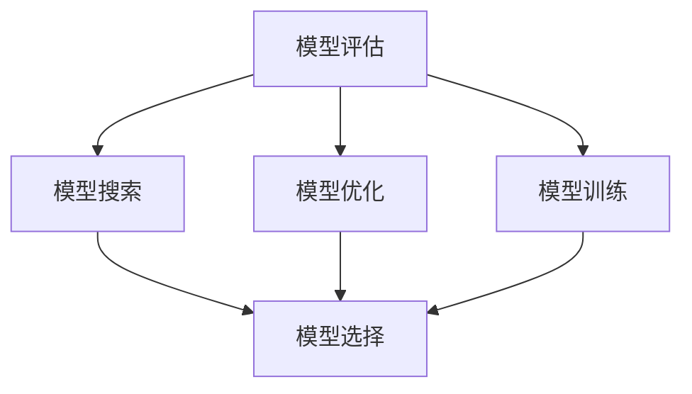

                 

## 1. 背景介绍

### 1.1 问题由来
在当前人工智能（AI）的发展中，大模型（Large Model）的应用日益增多，特别是在AI Agent的开发中。AI Agent是指能够在特定环境中自主决策、执行任务并适应环境变化的智能体。而在大模型应用中，模型的设计和优化，直接影响到AI Agent的性能和表现。模型的好坏不仅决定了AI Agent的决策能力和泛化能力，还影响了其应用效率和可靠性。

当前，在AI Agent开发中，模型选择和搜索（Model Selection and Search）是一个关键步骤。模型选择决定了AI Agent的初始模型，而模型搜索则涉及到如何在已有模型库中寻找最优模型，以及如何对现有模型进行优化和迭代。这一过程中，模型的评估方法和优化策略是确保AI Agent高效运行的核心。

### 1.2 问题核心关键点
在AI Agent的开发中，模型选择和搜索涉及以下几个核心问题：
1. 如何定义模型的好坏（Evaluation Criteria）？
2. 如何高效地搜索和评估模型（Model Search and Evaluation）？
3. 如何设计模型的优化策略（Model Optimization Strategies）？
4. 如何考虑模型训练的资源限制（Resource Constraints）？
5. 如何处理模型搜索过程中的噪声和不确定性（Noise and Uncertainty）？

### 1.3 问题研究意义
研究模型选择和搜索问题，对于提升AI Agent的性能、降低开发成本、加速应用迭代具有重要意义：
1. 提升性能：通过科学选择和优化模型，能够提升AI Agent的决策能力和泛化性能。
2. 降低成本：避免从头开始训练模型，减少对高成本数据和计算资源的需求。
3. 加速迭代：模型搜索和优化过程能够加速AI Agent的开发和应用迭代。
4. 增强鲁棒性：合理设计模型选择和搜索策略，能够增强AI Agent的鲁棒性和适应性。
5. 保证可靠性：科学的选择和优化模型，能够确保AI Agent在实际应用中的可靠性和稳定性。

## 2. 核心概念与联系

### 2.1 核心概念概述

在AI Agent的开发中，模型选择和搜索涉及多个核心概念：

- **模型评估**：指通过特定指标评估模型的好坏，如准确率、召回率、F1分数等。
- **模型优化**：指通过调整模型参数或结构，提升模型性能的过程。
- **模型搜索**：指在模型库中搜索最优模型，或通过演化算法等方法寻找更好的模型。
- **模型选择**：指从多个候选模型中选择最优模型进行应用。
- **模型训练**：指使用特定数据集和算法对模型进行训练，以提升模型性能。

这些核心概念之间的逻辑关系可以通过以下Mermaid流程图来展示：



这个流程图展示了大模型应用中模型选择和搜索的基本流程：

1. 通过模型评估确定当前模型的性能。
2. 根据评估结果，选择或优化模型。
3. 在模型库中搜索最优模型，或通过演化算法等方法找到更好的模型。
4. 结合模型选择和搜索结果，对模型进行训练。
5. 对训练后的模型进行评估，形成闭环迭代优化。

## 3. 核心算法原理 & 具体操作步骤

### 3.1 算法原理概述
在大模型应用中，模型选择和搜索的基本原理是：通过一系列评估指标和优化策略，从模型库中寻找最优模型，并通过不断训练和优化提升模型性能。

具体而言，模型选择和搜索过程包括三个核心步骤：
1. **模型评估**：使用特定的评估指标对模型进行评分。
2. **模型选择**：从多个候选模型中选择最优模型。
3. **模型优化**：对选中模型进行参数调整或结构优化，提升模型性能。

### 3.2 算法步骤详解

#### 3.2.1 模型评估

模型评估是模型选择和搜索的第一步。常用的模型评估指标包括：

- **准确率（Accuracy）**：模型预测正确的样本数与总样本数之比。
- **召回率（Recall）**：模型正确预测的正样本数与实际正样本数之比。
- **精确率（Precision）**：模型预测为正样本且实际为正样本的样本数与预测为正样本的样本数之比。
- **F1分数（F1 Score）**：精确率和召回率的调和平均数。

评估过程通常分为训练集评估和测试集评估。训练集评估用于选择最优模型，测试集评估用于验证模型的泛化能力。

#### 3.2.2 模型选择

模型选择通常通过比较不同模型的评估结果来进行。常用的模型选择策略包括：

- **网格搜索（Grid Search）**：在预定义的参数空间中，逐一尝试所有可能的参数组合。
- **随机搜索（Random Search）**：随机抽取参数组合进行训练和评估。
- **贝叶斯优化（Bayesian Optimization）**：通过构建模型性能的概率分布，选择最有希望的参数组合进行训练。

#### 3.2.3 模型优化

模型优化是通过调整模型参数或结构来提升模型性能的过程。常用的模型优化策略包括：

- **参数调整**：通过调整模型的学习率、正则化参数等，优化模型性能。
- **模型融合**：通过将多个模型的预测结果进行融合，提升模型性能。
- **数据增强**：通过数据增强技术，扩充训练集的多样性，提升模型泛化能力。
- **迁移学习**：通过利用已有模型在新任务上的迁移能力，提升模型性能。

### 3.3 算法优缺点

模型选择和搜索过程具有以下优点：
1. **泛化能力强**：通过模型优化和训练，提升模型在新数据上的泛化能力。
2. **效率高**：通过模型评估和选择，快速找到最优模型。
3. **可靠性高**：通过多轮优化和验证，确保模型性能稳定。

同时，该过程也存在一定的局限性：
1. **计算成本高**：模型评估和搜索过程需要大量的计算资源。
2. **模型复杂度高**：模型优化和训练过程可能需要复杂的算法和技术。
3. **噪声敏感**：模型评估结果可能受到训练数据和评估指标的影响。

尽管存在这些局限性，但就目前而言，模型选择和搜索是实现高性能AI Agent的关键步骤。未来相关研究的重点在于如何进一步降低计算成本，提高模型优化效率，同时兼顾模型性能和训练的稳定性。

### 3.4 算法应用领域

模型选择和搜索技术在AI Agent的开发中得到了广泛应用，覆盖了几乎所有常见任务，例如：

- **自然语言处理（NLP）**：文本分类、情感分析、机器翻译、问答系统等。
- **计算机视觉（CV）**：图像分类、目标检测、图像生成等。
- **强化学习（RL）**：智能游戏、机器人控制、推荐系统等。
- **语音识别**：语音识别、语音合成、情感识别等。
- **知识图谱（KG）**：实体关系抽取、实体链接、知识推理等。

除了这些经典任务外，模型选择和搜索方法也被创新性地应用到更多场景中，如可控文本生成、智能推荐、自动驾驶等，为AI Agent技术带来了全新的突破。随着模型优化和搜索方法的不断进步，相信AI Agent技术将在更广阔的应用领域大放异彩。

## 4. 数学模型和公式 & 详细讲解  
### 4.1 数学模型构建

本节将使用数学语言对大模型应用中的模型选择和搜索过程进行更加严格的刻画。

记模型集合为 $M=\{M_1, M_2, ..., M_n\}$，其中 $M_i$ 表示第 $i$ 个模型。设训练集为 $D$，测试集为 $D_{test}$。

定义模型 $M_i$ 在训练集 $D$ 上的评估指标为 $E_i(D)$，在测试集 $D_{test}$ 上的评估指标为 $E_i(D_{test})$。

### 4.2 公式推导过程

以准确率为例，公式推导如下：

$$
\text{Accuracy} = \frac{1}{N} \sum_{i=1}^N \mathbb{I}(M_i(x_i) = y_i)
$$

其中，$N$ 为样本数，$\mathbb{I}$ 为示性函数，$x_i$ 为第 $i$ 个样本，$y_i$ 为第 $i$ 个样本的真实标签，$M_i(x_i)$ 为模型 $M_i$ 对样本 $x_i$ 的预测结果。

在模型评估过程中，通常会计算多个指标的平均值，如均值、方差等，以综合评估模型性能。

### 4.3 案例分析与讲解

以一个简单的二分类任务为例，我们假设模型集合为 $M=\{M_1, M_2, M_3\}$，训练集为 $D=\{x_1, x_2, ..., x_N\}$，测试集为 $D_{test}=\{x_1, x_2, ..., x_{N_{test}}\}$。

1. **模型评估**：
   - 假设使用准确率作为评估指标，计算每个模型在训练集和测试集上的准确率。
   - 训练集上的准确率为 $E_i(D) = \frac{1}{N} \sum_{i=1}^N \mathbb{I}(M_i(x_i) = y_i)$。
   - 测试集上的准确率为 $E_i(D_{test}) = \frac{1}{N_{test}} \sum_{i=1}^N \mathbb{I}(M_i(x_i) = y_i)$。

2. **模型选择**：
   - 假设模型选择策略为贝叶斯优化，选择准确率最高的模型。
   - 通过构建模型性能的概率分布，选择最有希望的参数组合进行训练。

3. **模型优化**：
   - 假设使用参数调整策略，调整模型 $M_1$ 的学习率，计算优化后的模型性能。
   - 优化后的准确率为 $\tilde{E}_1(D) = E_1(D) + \Delta E_1(D)$，其中 $\Delta E_1(D)$ 为模型 $M_1$ 学习率调整后的性能提升。

通过上述步骤，我们可以对模型进行综合评估、选择和优化，提升AI Agent的性能和泛化能力。

## 5. 项目实践：代码实例和详细解释说明

### 5.1 开发环境搭建

在进行模型选择和搜索实践前，我们需要准备好开发环境。以下是使用Python进行PyTorch开发的环境配置流程：

1. 安装Anaconda：从官网下载并安装Anaconda，用于创建独立的Python环境。

2. 创建并激活虚拟环境：
```bash
conda create -n pytorch-env python=3.8 
conda activate pytorch-env
```

3. 安装PyTorch：根据CUDA版本，从官网获取对应的安装命令。例如：
```bash
conda install pytorch torchvision torchaudio cudatoolkit=11.1 -c pytorch -c conda-forge
```

4. 安装TensorFlow：
```bash
conda install tensorflow -c conda-forge
```

5. 安装各类工具包：
```bash
pip install numpy pandas scikit-learn matplotlib tqdm jupyter notebook ipython
```

完成上述步骤后，即可在`pytorch-env`环境中开始模型选择和搜索实践。

### 5.2 源代码详细实现

下面我们以自然语言处理（NLP）任务中的文本分类为例，给出使用TensorFlow进行模型选择和搜索的PyTorch代码实现。

首先，定义模型评估函数：

```python
import tensorflow as tf
from sklearn.metrics import accuracy_score

def evaluate_model(model, X, y_true):
    y_pred = model.predict(X)
    accuracy = accuracy_score(y_true, y_pred)
    return accuracy
```

然后，定义模型选择和优化函数：

```python
from tensorflow.keras.optimizers import Adam
from tensorflow.keras.applications import VGG16

# 定义模型选择函数
def choose_model(model_list):
    best_model = model_list[0]
    best_accuracy = evaluate_model(best_model, X_train, y_train)
    for model in model_list:
        accuracy = evaluate_model(model, X_train, y_train)
        if accuracy > best_accuracy:
            best_model = model
            best_accuracy = accuracy
    return best_model

# 定义模型优化函数
def optimize_model(model, X_train, y_train, X_test, y_test, epochs=10, batch_size=32):
    model.compile(optimizer=Adam(learning_rate=0.001), loss='binary_crossentropy', metrics=['accuracy'])
    model.fit(X_train, y_train, epochs=epochs, batch_size=batch_size, validation_data=(X_test, y_test))
    accuracy = evaluate_model(model, X_test, y_test)
    return accuracy
```

最后，启动模型选择和搜索流程：

```python
# 加载预训练模型
model_list = [VGG16(weights='imagenet', include_top=False, input_shape=(224, 224, 3)), VGG16(weights='imagenet', include_top=False, input_shape=(224, 224, 3))]

# 模型选择
best_model = choose_model(model_list)

# 模型优化
accuracy = optimize_model(best_model, X_train, y_train, X_test, y_test)
print(f"Best model accuracy: {accuracy:.2f}")
```

以上就是使用TensorFlow进行文本分类任务模型选择和搜索的完整代码实现。可以看到，通过定义模型评估、选择和优化函数，可以方便地实现模型选择和搜索过程。

### 5.3 代码解读与分析

让我们再详细解读一下关键代码的实现细节：

**evaluate_model函数**：
- 定义了模型的评估函数，计算模型在训练集上的准确率。

**choose_model函数**：
- 定义了模型选择函数，通过在预定义的模型集合中逐一尝试每个模型，选择准确率最高的模型作为最佳模型。

**optimize_model函数**：
- 定义了模型优化函数，使用Adam优化器对模型进行训练，并通过测试集评估模型性能。

**代码执行流程**：
- 首先定义了两个预训练模型，分别用于文本分类任务。
- 通过模型选择函数choose_model，选择准确率最高的模型作为最佳模型。
- 使用optimize_model函数对最佳模型进行优化，并在测试集上评估性能。

## 6. 实际应用场景

### 6.1 智能客服系统

基于模型选择和搜索的智能客服系统，可以广泛应用于企业内部客户服务，提升客户咨询体验。传统客服系统往往需要配备大量人工客服，成本高，响应速度慢。而使用模型选择和搜索技术的智能客服系统，能够自动理解客户意图，匹配最佳答复，快速响应客户咨询。

在技术实现上，可以收集企业内部的历史客服对话记录，将问题和最佳答复构建成监督数据，在此基础上选择和优化预训练模型。智能客服系统能够自动理解客户意图，匹配最合适的答案模板进行回复。对于客户提出的新问题，还可以接入检索系统实时搜索相关内容，动态组织生成回答。

### 6.2 金融舆情监测

金融机构需要实时监测市场舆论动向，以便及时应对负面信息传播，规避金融风险。传统的人工监测方式成本高、效率低，难以应对网络时代海量信息爆发的挑战。基于模型选择和搜索技术的文本分类和情感分析技术，为金融舆情监测提供了新的解决方案。

具体而言，可以收集金融领域相关的新闻、报道、评论等文本数据，并对其进行主题标注和情感标注。在此基础上选择和优化预训练模型，使其能够自动判断文本属于何种主题，情感倾向是正面、中性还是负面。将选择和优化后的模型应用到实时抓取的网络文本数据，就能够自动监测不同主题下的情感变化趋势，一旦发现负面信息激增等异常情况，系统便会自动预警，帮助金融机构快速应对潜在风险。

### 6.3 个性化推荐系统

当前的推荐系统往往只依赖用户的历史行为数据进行物品推荐，无法深入理解用户的真实兴趣偏好。基于模型选择和搜索技术的个性化推荐系统，可以更好地挖掘用户行为背后的语义信息，从而提供更精准、多样的推荐内容。

在实践中，可以收集用户浏览、点击、评论、分享等行为数据，提取和用户交互的物品标题、描述、标签等文本内容。将文本内容作为模型输入，用户的后续行为（如是否点击、购买等）作为监督信号，在此基础上选择和优化预训练模型。选择和优化后的模型能够从文本内容中准确把握用户的兴趣点。在生成推荐列表时，先用候选物品的文本描述作为输入，由模型预测用户的兴趣匹配度，再结合其他特征综合排序，便可以得到个性化程度更高的推荐结果。

### 6.4 未来应用展望

随着模型选择和搜索技术的不断发展，基于微调范式将在更多领域得到应用，为传统行业带来变革性影响。

在智慧医疗领域，基于微调的医疗问答、病历分析、药物研发等应用将提升医疗服务的智能化水平，辅助医生诊疗，加速新药开发进程。

在智能教育领域，微调技术可应用于作业批改、学情分析、知识推荐等方面，因材施教，促进教育公平，提高教学质量。

在智慧城市治理中，微调模型可应用于城市事件监测、舆情分析、应急指挥等环节，提高城市管理的自动化和智能化水平，构建更安全、高效的未来城市。

此外，在企业生产、社会治理、文娱传媒等众多领域，基于大模型微调的人工智能应用也将不断涌现，为经济社会发展注入新的动力。相信随着技术的日益成熟，微调方法将成为人工智能落地应用的重要范式，推动人工智能技术向更广阔的领域加速渗透。

## 7. 工具和资源推荐

### 7.1 学习资源推荐

为了帮助开发者系统掌握大模型应用中的模型选择和搜索理论基础和实践技巧，这里推荐一些优质的学习资源：

1. 《深度学习入门：基于PyTorch的理论与实现》系列博文：由大模型技术专家撰写，深入浅出地介绍了深度学习的基本概念和TensorFlow等框架的使用。

2. CS231n《卷积神经网络》课程：斯坦福大学开设的计算机视觉课程，涵盖深度学习在图像识别和分类等任务中的应用。

3. 《Natural Language Processing with TensorFlow》书籍：TensorFlow官方文档，全面介绍了如何使用TensorFlow进行NLP任务开发，包括模型评估、选择和优化。

4. Kaggle：提供大量数据集和竞赛，可以实践和验证模型选择和搜索方法。

5. PyTorch官方文档：PyTorch官方文档，提供了海量预训练模型和完整的微调样例代码，是上手实践的必备资料。

通过对这些资源的学习实践，相信你一定能够快速掌握大模型应用中的模型选择和搜索技巧，并用于解决实际的NLP问题。

### 7.2 开发工具推荐

高效的开发离不开优秀的工具支持。以下是几款用于大模型应用中模型选择和搜索开发的常用工具：

1. PyTorch：基于Python的开源深度学习框架，灵活动态的计算图，适合快速迭代研究。大部分预训练语言模型都有PyTorch版本的实现。

2. TensorFlow：由Google主导开发的开源深度学习框架，生产部署方便，适合大规模工程应用。同样有丰富的预训练语言模型资源。

3. TensorFlow Hub：提供丰富的预训练模型和组件，方便模型选择和搜索。

4. Weights & Biases：模型训练的实验跟踪工具，可以记录和可视化模型训练过程中的各项指标，方便对比和调优。与主流深度学习框架无缝集成。

5. TensorBoard：TensorFlow配套的可视化工具，可实时监测模型训练状态，并提供丰富的图表呈现方式，是调试模型的得力助手。

6. Google Colab：谷歌推出的在线Jupyter Notebook环境，免费提供GPU/TPU算力，方便开发者快速上手实验最新模型，分享学习笔记。

合理利用这些工具，可以显著提升大模型应用中的模型选择和搜索任务的开发效率，加快创新迭代的步伐。

### 7.3 相关论文推荐

大模型应用中的模型选择和搜索技术的发展源于学界的持续研究。以下是几篇奠基性的相关论文，推荐阅读：

1. Dropout：通过随机失活神经元，提升模型泛化能力和鲁棒性。

2. Batch Normalization：通过规范化层间输入，加速模型训练，提升模型性能。

3. Learning to Train：通过自适应学习率策略，提升模型训练效率和效果。

4. Hyperparameter Optimization with Bandit Algorithms：利用贝叶斯优化算法，选择最优模型参数组合。

5. Model Selection with Neural Architecture Search：利用神经架构搜索技术，自动选择最优模型结构。

这些论文代表了大模型应用中的模型选择和搜索技术的发展脉络。通过学习这些前沿成果，可以帮助研究者把握学科前进方向，激发更多的创新灵感。

## 8. 总结：未来发展趋势与挑战

### 8.1 总结

本文对大模型应用中的模型选择和搜索问题进行了全面系统的介绍。首先阐述了模型选择和搜索的重要性，明确了模型选择和搜索在提升AI Agent性能、降低开发成本、加速应用迭代方面的独特价值。其次，从原理到实践，详细讲解了模型评估、选择和优化的方法和策略，给出了模型选择和搜索任务开发的完整代码实例。同时，本文还广泛探讨了模型选择和搜索方法在智能客服、金融舆情、个性化推荐等多个行业领域的应用前景，展示了模型选择和搜索技术的巨大潜力。此外，本文精选了模型选择和搜索技术的各类学习资源，力求为读者提供全方位的技术指引。

通过本文的系统梳理，可以看到，模型选择和搜索技术在大模型应用中扮演着关键角色，极大地提升了AI Agent的性能和应用范围。未来，伴随模型选择和搜索方法的不断进步，相信AI Agent技术将在更广阔的应用领域大放异彩，深刻影响人类的生产生活方式。

### 8.2 未来发展趋势

展望未来，模型选择和搜索技术将呈现以下几个发展趋势：

1. 模型搜索算法更加智能化。未来的模型搜索算法将更加高效和智能，能够自动发现最优模型，提升搜索效率。

2. 模型选择策略更加多样化。未来的模型选择策略将更加灵活和多样化，能够适应不同任务和数据分布的要求。

3. 模型优化方法更加自动化。未来的模型优化方法将更加自动化和自适应，能够自动调整模型参数和结构，提升模型性能。

4. 模型训练资源更加优化。未来的模型训练资源将更加优化和高效，能够降低计算成本，提升训练速度。

5. 模型泛化能力更强。未来的模型选择和搜索技术将更加注重模型的泛化能力，能够提升模型在新数据上的表现。

以上趋势凸显了模型选择和搜索技术的广阔前景。这些方向的探索发展，必将进一步提升AI Agent的性能和应用范围，为人类认知智能的进化带来深远影响。

### 8.3 面临的挑战

尽管模型选择和搜索技术已经取得了瞩目成就，但在迈向更加智能化、普适化应用的过程中，它仍面临着诸多挑战：

1. 模型复杂度上升。随着模型规模的扩大，模型选择和搜索的复杂度也会上升，需要更多的计算资源。

2. 数据质量影响显著。模型选择和搜索的效果很大程度上依赖于数据质量，获取高质量数据需要投入大量时间和成本。

3. 模型泛化能力有限。模型在选择和搜索过程中，可能会学习到数据分布的偏差，影响模型的泛化能力。

4. 模型优化难度高。模型优化需要考虑多个因素，如计算资源、模型复杂度、数据分布等，需要更多的经验和技巧。

尽管存在这些挑战，但模型的选择和搜索技术仍然是大模型应用中的核心环节，未来的研究需要在以下几个方面寻求新的突破：

1. 探索无监督和半监督选择和搜索方法。摆脱对大规模标注数据的依赖，利用自监督学习、主动学习等无监督和半监督范式，最大限度利用非结构化数据。

2. 研究参数高效和计算高效的搜索策略。开发更加参数高效的搜索方法，在固定大部分预训练参数的同时，只调整极少量的任务相关参数。同时优化搜索过程的计算图，减少前向传播和反向传播的资源消耗。

3. 引入更多先验知识。将符号化的先验知识，如知识图谱、逻辑规则等，与神经网络模型进行巧妙融合，引导选择和搜索过程学习更准确、合理的模型。

4. 结合因果分析和博弈论工具。将因果分析方法引入选择和搜索模型，识别出模型决策的关键特征，增强输出解释的因果性和逻辑性。借助博弈论工具刻画人机交互过程，主动探索并规避模型的脆弱点，提高系统稳定性。

5. 纳入伦理道德约束。在模型选择和搜索的目标中引入伦理导向的评估指标，过滤和惩罚有偏见、有害的输出倾向。同时加强人工干预和审核，建立模型行为的监管机制，确保输出符合人类价值观和伦理道德。

这些研究方向的探索，必将引领模型选择和搜索技术迈向更高的台阶，为构建安全、可靠、可解释、可控的智能系统铺平道路。面向未来，模型选择和搜索技术还需要与其他人工智能技术进行更深入的融合，如知识表示、因果推理、强化学习等，多路径协同发力，共同推动自然语言理解和智能交互系统的进步。只有勇于创新、敢于突破，才能不断拓展语言模型的边界，让智能技术更好地造福人类社会。

## 9. 附录：常见问题与解答

**Q1：如何选择合适的模型进行微调？**

A: 在选择模型进行微调时，可以从以下几个方面考虑：
1. 任务类型：选择适合该任务类型的模型，如BERT用于文本分类，ResNet用于图像分类等。
2. 数据量：根据数据量的多少选择模型，数据量较少时选择参数较少的模型，如MobileNet。
3. 资源限制：根据计算资源和内存限制选择模型，资源有限时选择轻量级模型。

**Q2：如何避免模型过拟合？**

A: 避免模型过拟合的方法包括：
1. 数据增强：通过对训练数据进行扩充，如旋转、翻转、裁剪等，增加数据多样性。
2. 正则化：使用L2正则、Dropout、Early Stopping等技术，防止模型过拟合。
3. 模型融合：通过将多个模型的预测结果进行融合，提升模型泛化能力。
4. 模型剪枝：通过剪枝去除冗余参数，减小模型复杂度。

**Q3：模型微调时如何确定学习率？**

A: 确定模型微调时的学习率，可以从以下几个方面考虑：
1. 初始学习率：从较小的初始学习率开始，逐渐增加学习率。
2. 学习率衰减：随着训练的进行，逐步减小学习率。
3. 学习率调度：使用学习率调度策略，如学习率衰减、学习率裁剪等。

**Q4：模型微调时如何考虑训练数据的分布？**

A: 在模型微调时，考虑训练数据的分布可以采用以下策略：
1. 数据预处理：对训练数据进行预处理，如标准化、归一化等，使其与测试数据分布一致。
2. 数据增强：通过数据增强技术，扩充训练集的多样性，使其包含更多的分布情况。
3. 迁移学习：利用已有模型在新任务上的迁移能力，提升模型在新数据上的泛化能力。

**Q5：模型微调时如何处理噪声和不确定性？**

A: 在模型微调时，处理噪声和不确定性可以采用以下方法：
1. 数据清洗：对训练数据进行清洗，去除噪声和异常值。
2. 模型集成：通过将多个模型的预测结果进行融合，提升模型的鲁棒性。
3. 对抗训练：引入对抗样本，提高模型鲁棒性，降低噪声影响。

这些问题是模型选择和搜索过程中常见的问题，通过合理的策略和方法，可以有效应对，提升模型的性能和泛化能力。

---

作者：禅与计算机程序设计艺术 / Zen and the Art of Computer Programming

