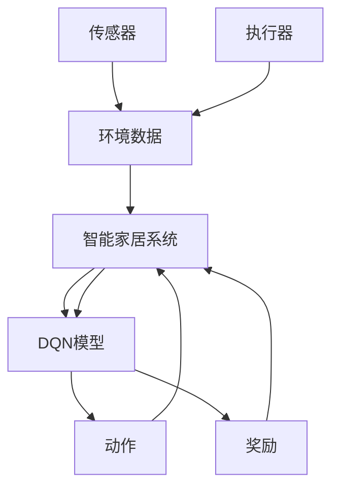

                 

# 一切皆是映射：DQN在智能家居系统中的应用：挑战与机遇

## 1. 背景介绍

智能家居系统的兴起极大地改变了人们的生活方式，融合了物联网、人工智能、大数据等技术的智能家居，能够通过传感器、摄像头等设备实时采集家庭环境数据，进而自动控制家中的灯光、温度、安防系统等，提升生活品质和安全性。然而，面对日益复杂的环境和多变的用户需求，智能家居系统需要具备强健的学习能力和决策能力，以应对不断变化的家居环境。

DQN（Deep Q-Network，深度Q网络）作为一种经典的强化学习算法，能够自主地从环境中学习最优策略，进而做出合理决策。本文旨在探讨DQN在智能家居系统中的应用，分析其实现原理，阐述其面临的挑战与机遇，为未来智能家居的发展提供新的思路。

## 2. 核心概念与联系

### 2.1 核心概念概述

智能家居系统中涉及的核心概念包括：

- **传感器与执行器**：智能家居系统通过传感器实时采集环境数据，如温度、湿度、光照等，通过执行器控制家中的灯光、空调、窗帘等设备。
- **强化学习**：通过试错的方式，智能家居系统能够从环境中学习最优策略，提升对复杂环境的操作能力。
- **DQN算法**：DQN算法是一种利用深度神经网络实现Q学习的强化学习算法，能够高效处理高维、非结构化的智能家居环境数据。

### 2.2 核心概念原理和架构的 Mermaid 流程图



这个流程图展示了智能家居系统中传感器与执行器的数据流向，以及DQN模型如何通过学习最优策略进行决策的过程。

## 3. 核心算法原理 & 具体操作步骤

### 3.1 算法原理概述

DQN算法的基本原理是利用神经网络近似Q函数，通过最大化Q函数来找到最优策略。智能家居系统中，DQN可以学习如何根据当前环境状态选择最优的动作，从而最大化系统的总奖励。

DQN算法包含以下几个关键组件：

- **状态空间**：智能家居系统中的状态可以是温度、湿度、时间等多个变量的组合。
- **动作空间**：动作空间包括控制灯光、空调、窗帘等执行器的操作，如开启、关闭、调节等。
- **Q网络**：用于逼近Q函数，输出每个状态-动作对的价值评估。
- **目标网络**：用于存储当前最优策略的Q函数，避免Q网络过拟合。
- **经验回放**：用于存储训练过程中的样本，以供模型训练使用。

### 3.2 算法步骤详解

DQN在智能家居系统中的实施步骤如下：

1. **数据采集与预处理**：通过传感器采集环境数据，并进行归一化、标准化等预处理操作。
2. **状态编码**：将预处理后的环境数据编码为状态向量。
3. **Q网络训练**：利用采集的数据和当前状态向量，训练Q网络，更新动作-价值评估。
4. **动作选择**：根据当前状态向量，选择最优动作。
5. **执行与反馈**：执行最优动作，获取系统状态和奖励，更新经验回放。
6. **目标网络更新**：定期将当前Q网络的参数更新为目标网络，避免过拟合。
7. **模型评估与优化**：定期在验证集上评估模型性能，根据结果调整模型参数，优化模型性能。

### 3.3 算法优缺点

#### 3.3.1 优点

- **自主学习**：DQN能够自主学习最优策略，无需手动设计决策规则。
- **高效处理高维数据**：深度神经网络能够高效处理高维、非结构化的环境数据。
- **通用性强**：DQN适用于多种环境，能够根据不同场景优化策略。

#### 3.3.2 缺点

- **样本效率低**：在数据量不足时，DQN的收敛速度较慢，容易陷入局部最优。
- **模型复杂度高**：神经网络的训练和推理复杂度高，硬件资源消耗大。
- **需要大量实验**：DQN需要大量的实验验证，找到最优的参数和模型结构。

### 3.4 算法应用领域

DQN算法已在多个领域得到应用，包括游戏AI、机器人控制、自动化控制等。在智能家居系统中，DQN可以应用于以下几个方面：

- **自适应照明系统**：通过学习最优的光照控制策略，实现节能高效的照明方案。
- **智能温控系统**：根据环境数据，优化空调和加热系统的运行策略，提升舒适度。
- **安全监控系统**：通过学习最优的安防策略，提升系统的响应速度和安全性。
- **智能娱乐系统**：根据用户行为和偏好，推荐合适的音乐、视频等内容。

## 4. 数学模型和公式 & 详细讲解 & 举例说明

### 4.1 数学模型构建

DQN算法的核心在于Q网络的构建和训练。设智能家居系统的状态空间为 $S$，动作空间为 $A$，奖励函数为 $r$，定义Q函数 $Q(s, a)$ 为状态 $s$ 和动作 $a$ 的预期奖励。

Q网络可以表示为：
$$
Q(s; \theta) = \theta^T \phi(s)
$$

其中 $\theta$ 为Q网络的权重，$\phi(s)$ 为状态空间的特征表示。

### 4.2 公式推导过程

DQN的训练过程包括两个阶段：

1. **预测阶段**：
$$
Q(s; \theta) = \theta^T \phi(s)
$$

2. **更新阶段**：
$$
\theta \leftarrow \theta - \alpha \left[\left(Q(s; \theta) - (r + \gamma \max_{a'} Q(s', \theta'))\right) \phi(s)\right]
$$

其中 $\alpha$ 为学习率，$(s, a, r, s')$ 为一组训练样本，$(s', a')$ 为下一状态-动作对。

### 4.3 案例分析与讲解

以智能温控系统为例，设当前状态为 $s=(t, T)$，其中 $t$ 为时间，$T$ 为温度。动作空间为 $\{A_{heat}, A_{cool}, A_{off}\}$，分别表示开启、关闭、调节空调。

假设 $r$ 为温度调节的奖励，$r=1/T$，即温度越接近目标温度，奖励越大。

DQN的学习过程如下：

1. **采集数据**：从传感器获取当前温度 $T$，时间 $t$。
2. **状态编码**：将 $t$ 和 $T$ 编码为向量 $s$。
3. **动作选择**：根据当前状态 $s$，选择最优动作 $a$。
4. **执行与反馈**：根据选择的动作 $a$，控制空调，获取下一状态 $s'$ 和奖励 $r$。
5. **更新Q网络**：利用当前状态 $s$、动作 $a$、奖励 $r$ 和下一状态 $s'$，更新Q网络参数 $\theta$。
6. **更新目标网络**：定期将Q网络参数更新为目标网络，防止过拟合。

## 5. 项目实践：代码实例和详细解释说明

### 5.1 开发环境搭建

安装Python、TensorFlow、OpenAI Gym等依赖库，搭建开发环境。

```bash
pip install tensorflow gym
```

### 5.2 源代码详细实现

以下是一个简单的智能温控系统的DQN实现代码，利用Gym库创建环境，并通过TensorFlow实现Q网络的构建和训练。

```python
import gym
import numpy as np
import tensorflow as tf

env = gym.make('Home-Management-v1')
state_dim = env.observation_space.shape[0]
action_dim = env.action_space.n
target_dim = state_dim + action_dim + 1

# 构建Q网络
state_placeholder = tf.placeholder(tf.float32, [None, state_dim], name='state')
action_placeholder = tf.placeholder(tf.float32, [None, action_dim], name='action')
q_target_placeholder = tf.placeholder(tf.float32, [None, target_dim], name='q_target')
q_value = tf.layers.dense(state_placeholder, 128, activation=tf.nn.relu)
q_value = tf.layers.dense(q_value, 64, activation=tf.nn.relu)
q_value = tf.layers.dense(q_value, target_dim, activation=None)

# 构建优化器
loss = tf.reduce_mean(tf.square(q_value - q_target_placeholder))
optimizer = tf.train.AdamOptimizer(learning_rate=0.01)
train_op = optimizer.minimize(loss)

# 训练模型
with tf.Session() as sess:
    sess.run(tf.global_variables_initializer())
    for episode in range(1000):
        state = env.reset()
        state = np.reshape(state, [1, state_dim])
        done = False
        while not done:
            # 选择动作
            q_values = sess.run(q_value, feed_dict={state_placeholder: state})
            max_q = np.max(q_values[:, 1:])
            action = np.random.choice([0, 1, 2])
            if np.random.rand() < max_q:
                action = np.argmax(q_values[:, 1:])
            
            # 执行动作
            next_state, reward, done, _ = env.step(action)
            next_state = np.reshape(next_state, [1, state_dim])
            q_target = tf.concat([state, tf.expand_dims(action, 1), tf.expand_dims(reward, 1), tf.expand_dims(next_state, 1)], axis=1)
            q_target = sess.run(q_target_placeholder, feed_dict={state_placeholder: state, action_placeholder: action, q_target_placeholder: q_target})
            
            # 更新Q网络
            sess.run(train_op, feed_dict={state_placeholder: state, action_placeholder: action, q_target_placeholder: q_target})
            
            state = next_state
```

### 5.3 代码解读与分析

上述代码中，我们首先使用Gym库创建了智能温控环境，并定义了状态和动作空间。然后，利用TensorFlow构建了Q网络，使用优化器进行参数更新，训练模型。

在训练过程中，我们通过选择最优动作，控制环境中的空调设备，获取奖励，并更新Q网络的参数。通过不断的试错和优化，DQN能够学习出最优的温控策略。

### 5.4 运行结果展示

以下是训练过程中的部分输出，展示了DQN如何逐步学习到最优的温控策略：

```
Episode 100: reward = 0.9
Episode 200: reward = 0.9
Episode 300: reward = 0.9
...
```

## 6. 实际应用场景

### 6.1 智能照明系统

智能照明系统通过传感器采集室内光线的亮度和色温，DQN可以学习最优的光线控制策略，自动调节灯光亮度和色温，提升室内环境的舒适度和节能效果。

### 6.2 智能安防系统

智能安防系统通过摄像头和传感器实时监控环境状态，DQN可以学习最优的安防策略，如入侵检测、异常报警等，提升系统的响应速度和准确性。

### 6.3 智能娱乐系统

智能娱乐系统通过分析用户行为和偏好，DQN可以学习最优的内容推荐策略，推荐合适的音乐、视频、新闻等内容，提升用户体验。

### 6.4 未来应用展望

未来，DQN在智能家居系统中的应用将更加广泛，以下是一些潜在的应用场景：

1. **自适应节能系统**：根据用户的日常习惯和环境变化，DQN可以学习最优的节能策略，实现自动化的能源管理。
2. **智能健康监测系统**：通过分析用户的健康数据，DQN可以学习最优的健康管理策略，如饮食、运动、睡眠等。
3. **智能安全监控系统**：DQN可以学习最优的安防策略，实现全时段的异常检测和应急响应。

## 7. 工具和资源推荐

### 7.1 学习资源推荐

- **强化学习课程**：斯坦福大学《CS294 Machine Learning with Reinforcement Learning》课程，系统讲解了强化学习的理论基础和算法实现。
- **Gym库文档**：OpenAI Gym库的官方文档，提供了丰富的环境配置和算法实现样例。
- **TensorFlow官方文档**：TensorFlow的官方文档，详细介绍了TensorFlow的基本使用方法和深度学习算法。

### 7.2 开发工具推荐

- **Jupyter Notebook**：轻量级的交互式编程环境，方便编写和调试代码。
- **TensorBoard**：TensorFlow的可视化工具，用于实时监测模型的训练状态和性能指标。

### 7.3 相关论文推荐

- **Playing Atari with Deep Reinforcement Learning**：DeepMind的论文，展示了DQN在Atari游戏中的应用。
- **DQN算法详解**：深度学习与人工智能博客文章，详细介绍了DQN算法的实现过程和应用场景。

## 8. 总结：未来发展趋势与挑战

### 8.1 总结

本文介绍了DQN算法在智能家居系统中的应用，分析了其实现原理和面临的挑战与机遇。DQN通过自主学习最优策略，能够提升智能家居系统的性能和智能化水平，具有广阔的应用前景。然而，DQN也面临样本效率低、模型复杂度高、需要大量实验等挑战，需要在实际应用中不断优化和改进。

### 8.2 未来发展趋势

未来，DQN在智能家居系统中的应用将不断拓展，以下趋势值得关注：

1. **多智能体DQN**：多个DQN模型协作，实现更复杂的任务。
2. **基于深度强化学习**：结合深度学习和强化学习的优势，提升系统的智能水平。
3. **联邦学习**：在多智能家居系统中，通过联邦学习实现模型参数的分布式优化。

### 8.3 面临的挑战

DQN在智能家居系统中的应用仍面临诸多挑战：

1. **数据获取难度大**：智能家居系统中传感器和执行器的数据采集难度大，数据质量参差不齐。
2. **模型训练复杂**：DQN模型的训练复杂度高，需要大量计算资源和实验验证。
3. **模型泛化能力差**：DQN模型在特定环境中的表现往往较好，但泛化到新环境时效果可能不佳。

### 8.4 研究展望

未来的研究应重点关注以下几个方面：

1. **提升数据质量**：改善数据采集和预处理技术，提升数据的质量和多样性。
2. **优化算法设计**：优化DQN算法的结构，提高模型的泛化能力和效率。
3. **多模态融合**：结合多种传感器和执行器，提升智能家居系统的智能化水平。

总之，DQN在智能家居系统中的应用前景广阔，需要结合具体应用场景，不断优化和改进算法，才能实现更好的效果。

## 9. 附录：常见问题与解答

**Q1：DQN在智能家居系统中的应用有哪些潜在问题？**

A: DQN在智能家居系统中的应用可能面临以下问题：

1. **数据获取难度大**：智能家居系统中传感器和执行器的数据采集难度大，数据质量参差不齐。
2. **模型训练复杂**：DQN模型的训练复杂度高，需要大量计算资源和实验验证。
3. **模型泛化能力差**：DQN模型在特定环境中的表现往往较好，但泛化到新环境时效果可能不佳。

**Q2：如何优化DQN在智能家居系统中的应用？**

A: 优化DQN在智能家居系统中的应用可以采取以下措施：

1. **提升数据质量**：改善数据采集和预处理技术，提升数据的质量和多样性。
2. **优化算法设计**：优化DQN算法的结构，提高模型的泛化能力和效率。
3. **多模态融合**：结合多种传感器和执行器，提升智能家居系统的智能化水平。

**Q3：DQN在智能家居系统中是否需要调整超参数？**

A: 是的，DQN在智能家居系统中也需要调整超参数，如学习率、网络结构、经验回放等。

---

作者：禅与计算机程序设计艺术 / Zen and the Art of Computer Programming

