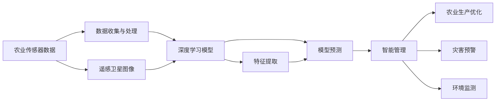

                 

# 一切皆是映射：深度学习在农业科技中的实践

> 关键词：深度学习,农业科技,机器学习,大数据,预测模型,农业生产,智能管理

## 1. 背景介绍

### 1.1 问题由来
近年来，深度学习技术的迅猛发展，为各行各业带来了革命性的变革。在农业领域，深度学习的应用也开始逐步展开，为提升农业生产效率、优化资源配置、降低生产成本提供了新的解决方案。深度学习通过对大量农业数据的分析，能够挖掘出隐藏在数据中的模式和规律，指导农业生产实践。

然而，农业数据通常具有高度的复杂性和多维度性，如何高效地利用这些数据，是深度学习在农业科技中面临的重要挑战。深度学习模型的训练需要大量标注数据和强大的计算资源，而农业领域的标注数据获取成本高、数据质量不稳定，制约了深度学习在农业科技中的应用。

### 1.2 问题核心关键点
深度学习在农业科技中的应用，主要聚焦于以下几个核心问题：

- **数据获取与处理**：如何从传感器、卫星图像等多元化的数据源中，高效获取和处理农业生产相关的数据。
- **模型选择与设计**：针对不同的农业任务，选择何种类型的深度学习模型，以及如何进行模型架构设计。
- **特征提取与融合**：如何提取并融合多源异构数据，构建更加全面、准确的特征表示。
- **模型训练与优化**：如何在有限的标注数据和计算资源下，训练高效、泛化能力强的深度学习模型。
- **应用落地与评估**：如何将深度学习模型应用于农业生产的各个环节，并进行实际效果评估。

### 1.3 问题研究意义
深度学习在农业科技中的应用，具有重要的研究意义和实际价值：

1. **提升生产效率**：通过深度学习模型的预测和优化，可以提升农业生产的效率和质量，降低成本，提高收益。
2. **优化资源配置**：深度学习能够帮助农业生产者更好地理解和管理土地、水、肥料等资源，实现精准农业。
3. **增强应对能力**：深度学习模型能够实时监测和预测农业生产中的异常情况，提高灾害预警和应对能力。
4. **推动技术创新**：深度学习为农业科技带来了新的技术手段和方法，促进了传统农业的转型升级。
5. **促进可持续发展**：深度学习支持可持续发展的理念，如精准农业和环境友好型生产。

## 2. 核心概念与联系

### 2.1 核心概念概述

深度学习在农业科技中的应用，涉及多个关键概念：

- **深度学习模型**：以神经网络为基础，通过多层非线性变换学习数据的复杂特征表示，能够处理高度非线性、高维度数据。
- **农业大数据**：来自农业生产各个环节的数据，如气象数据、土壤数据、作物生长数据等，具有海量、多源、异构的特点。
- **特征提取**：通过深度学习模型，从原始数据中提取出有意义的特征表示，用于后续的任务分析和预测。
- **模型预测**：基于训练好的深度学习模型，对新的农业数据进行预测，如作物产量、病虫害发生等。
- **智能管理**：将深度学习应用于农业生产的各个环节，实现智能化、精准化管理。

这些核心概念之间通过数据流和计算流相互联系，形成了一个闭环的深度学习农业科技系统。

### 2.2 核心概念原理和架构的 Mermaid 流程图



这个流程图展示了深度学习在农业科技中的核心概念及其联系：

1. **数据收集与处理**：农业传感器和遥感卫星图像等数据源提供原始数据。
2. **深度学习模型**：使用深度学习模型对数据进行处理和分析。
3. **特征提取**：通过深度学习模型，提取关键特征表示。
4. **模型预测**：利用训练好的深度学习模型，进行预测和决策。
5. **智能管理**：将预测结果应用于农业生产的优化和智能化管理。

## 3. 核心算法原理 & 具体操作步骤

### 3.1 算法原理概述

深度学习在农业科技中的实践，主要基于以下几个核心算法原理：

- **卷积神经网络(CNN)**：主要用于图像识别和分类任务，如遥感图像分析。
- **循环神经网络(RNN)**：适用于时间序列数据，如气象数据预测。
- **长短时记忆网络(LSTM)**：用于处理长序列数据，如土壤数据分析。
- **自编码器(AE)**：用于数据降维和特征提取。
- **生成对抗网络(GAN)**：用于生成高质量的数据，如作物生长模拟。

这些深度学习模型通过多层次的非线性变换，能够有效地从复杂数据中提取有用的特征，并进行有效的预测和决策。

### 3.2 算法步骤详解

深度学习在农业科技中的应用，通常包括以下关键步骤：

**Step 1: 数据收集与预处理**
- 收集农业生产相关的传感器数据、气象数据、卫星图像等。
- 进行数据清洗、去噪、标准化等预处理操作，确保数据质量。

**Step 2: 数据特征提取**
- 使用深度学习模型对预处理后的数据进行特征提取。
- 常用的特征提取方法包括卷积神经网络、自编码器、LSTM等。

**Step 3: 模型训练与优化**
- 根据具体任务选择适当的深度学习模型，进行模型训练。
- 使用交叉验证等技术进行模型选择和优化，防止过拟合。
- 使用GPU或TPU等高性能计算设备，加速模型训练。

**Step 4: 模型预测与评估**
- 在测试集上评估训练好的模型，进行预测和效果评估。
- 使用均方误差(MSE)、平均绝对误差(MAE)等指标评估模型预测精度。
- 根据评估结果调整模型参数，进行迭代优化。

**Step 5: 智能管理与决策支持**
- 将训练好的模型应用于农业生产的各个环节，进行智能化管理。
- 实时监测和预测农业生产中的异常情况，如病虫害发生、产量预测等。
- 提供决策支持，辅助农业生产者做出科学的决策。

### 3.3 算法优缺点

深度学习在农业科技中的应用，具有以下优点：

1. **高效性**：能够高效地处理和分析大规模农业数据，挖掘出有用的特征和模式。
2. **泛化能力**：通过深度学习模型，可以适应不同农业生产场景，具有较强的泛化能力。
3. **决策支持**：深度学习模型提供的数据驱动决策，能够帮助农业生产者做出科学的生产管理决策。
4. **实时性**：通过深度学习模型的实时预测，能够快速响应农业生产中的变化和异常。

同时，深度学习在农业科技中也有以下缺点：

1. **数据需求高**：深度学习模型需要大量标注数据进行训练，农业领域的数据获取成本高，数据质量不稳定。
2. **计算资源要求高**：深度学习模型的训练和推理需要高性能计算资源，农业生产中的资源限制较大。
3. **模型复杂度高**：深度学习模型的结构复杂，模型的解释性较弱，难以解释模型决策过程。
4. **数据质量影响**：数据清洗和预处理的质量对深度学习模型的性能影响较大。

### 3.4 算法应用领域

深度学习在农业科技中的应用，主要涵盖以下几个领域：

- **作物生长预测**：使用深度学习模型，对作物生长周期、产量等进行预测。
- **病虫害监测与防治**：通过深度学习模型，实时监测和预测病虫害的发生，指导防治措施。
- **土壤数据分析**：使用深度学习模型，分析土壤养分、水分、pH值等数据，优化施肥和灌溉方案。
- **气象数据预测**：使用深度学习模型，预测天气变化、气温、湿度等，指导农业生产决策。
- **智能灌溉管理**：结合深度学习模型和传感器数据，实现精准灌溉，降低水资源浪费。
- **农业机器人导航**：使用深度学习模型，实现农业机器人的自主导航和避障。

以上应用领域展示了深度学习在农业科技中的广阔前景。通过合理设计和应用深度学习模型，可以大幅提升农业生产的效率和质量，推动农业科技的进步。

## 4. 数学模型和公式 & 详细讲解 & 举例说明

### 4.1 数学模型构建

在农业科技中，深度学习模型的构建通常基于以下几个关键数学模型：

- **卷积神经网络模型(CNN)**：主要应用于图像识别和分类任务。
- **循环神经网络模型(RNN)**：适用于时间序列数据的预测和分析。
- **长短时记忆网络模型(LSTM)**：用于处理长序列数据，如土壤数据。
- **自编码器模型(AE)**：用于数据降维和特征提取。
- **生成对抗网络模型(GAN)**：用于生成高质量的模拟数据。

这些模型在农业科技中的应用，主要通过深度学习模型的前向传播和反向传播过程，实现对农业数据的特征提取和预测。

### 4.2 公式推导过程

以下以卷积神经网络模型为例，展示其在农业科技中的应用过程：

**卷积神经网络模型**：

$$
h_i = g(\mathbf{W}_h \mathbf{x}_i + \mathbf{b}_h)
$$

$$
a_i = g(h_i)
$$

$$
y_i = \mathbf{W}_o a_i + \mathbf{b}_o
$$

其中，$h_i$ 为卷积层输出特征图，$a_i$ 为激活函数输出，$y_i$ 为最终预测结果。

**公式推导**：

1. **卷积层**：通过卷积操作提取局部特征，公式为：
   $$
   h_i = g(\mathbf{W}_h * \mathbf{x}_i + \mathbf{b}_h)
   $$
   其中，$\mathbf{W}_h$ 为卷积核权重，$\mathbf{x}_i$ 为输入特征图，$*$ 为卷积运算，$g$ 为激活函数。

2. **池化层**：对卷积层输出进行下采样，减小特征图尺寸，公式为：
   $$
   h_i = g(\mathbf{W}_p * \mathbf{h}_{i-1} + \mathbf{b}_p)
   $$
   其中，$\mathbf{W}_p$ 为池化核权重，$\mathbf{h}_{i-1}$ 为前一层输出特征图，$g$ 为激活函数。

3. **全连接层**：将池化层的输出连接起来，进行特征融合和分类，公式为：
   $$
   y_i = \mathbf{W}_o a_i + \mathbf{b}_o
   $$
   其中，$\mathbf{W}_o$ 为权重矩阵，$a_i$ 为激活函数输出，$\mathbf{b}_o$ 为偏置项。

通过上述过程，深度学习模型能够从农业数据中提取出有用的特征，并进行预测和分类。

### 4.3 案例分析与讲解

**案例：使用卷积神经网络模型进行作物生长预测**

在作物生长预测中，使用卷积神经网络模型可以高效地从遥感图像中提取作物生长特征，预测作物的产量和生长周期。具体实现过程如下：

1. **数据预处理**：将遥感图像进行预处理，如去噪、归一化等操作，确保数据质量。

2. **特征提取**：使用卷积神经网络模型提取图像特征，如叶面积、叶绿素含量等。

3. **模型训练**：使用历史生长数据进行模型训练，优化模型参数。

4. **预测与评估**：在测试集上评估模型预测精度，进行实证分析。

**案例分析**：

- **数据预处理**：对遥感图像进行预处理，去除噪声、去雾等操作，确保数据质量。
- **特征提取**：使用卷积神经网络模型提取叶面积、叶绿素含量等特征。
- **模型训练**：使用历史生长数据进行模型训练，优化模型参数。
- **预测与评估**：在测试集上评估模型预测精度，进行实证分析。

通过卷积神经网络模型，可以高效地从遥感图像中提取作物生长特征，实现作物生长预测。

## 5. 项目实践：代码实例和详细解释说明

### 5.1 开发环境搭建

在深度学习模型应用于农业科技中，开发环境搭建是关键步骤之一。以下是使用Python进行深度学习开发的常见环境配置流程：

1. 安装Anaconda：从官网下载并安装Anaconda，用于创建独立的Python环境。

2. 创建并激活虚拟环境：
```bash
conda create -n pytorch-env python=3.8 
conda activate pytorch-env
```

3. 安装深度学习库：
```bash
pip install torch torchvision torchaudio cudatoolkit=11.1 -c pytorch -c conda-forge
```

4. 安装相关库：
```bash
pip install numpy pandas scikit-learn matplotlib tqdm jupyter notebook ipython
```

完成上述步骤后，即可在`pytorch-env`环境中开始深度学习模型开发。

### 5.2 源代码详细实现

以下是使用PyTorch实现卷积神经网络模型进行作物生长预测的代码实现：

```python
import torch
import torch.nn as nn
import torch.optim as optim
from torch.utils.data import DataLoader
from torchvision import transforms

# 定义模型
class ConvNet(nn.Module):
    def __init__(self):
        super(ConvNet, self).__init__()
        self.conv1 = nn.Conv2d(3, 32, kernel_size=3, stride=1, padding=1)
        self.pool1 = nn.MaxPool2d(kernel_size=2, stride=2)
        self.conv2 = nn.Conv2d(32, 64, kernel_size=3, stride=1, padding=1)
        self.pool2 = nn.MaxPool2d(kernel_size=2, stride=2)
        self.fc1 = nn.Linear(64 * 28 * 28, 256)
        self.fc2 = nn.Linear(256, 1)

    def forward(self, x):
        x = nn.functional.relu(self.conv1(x))
        x = self.pool1(x)
        x = nn.functional.relu(self.conv2(x))
        x = self.pool2(x)
        x = x.view(-1, 64 * 28 * 28)
        x = nn.functional.relu(self.fc1(x))
        x = torch.sigmoid(self.fc2(x))
        return x

# 定义数据预处理
transforms = transforms.Compose([
    transforms.ToTensor(),
    transforms.Normalize((0.5, 0.5, 0.5), (0.5, 0.5, 0.5))
])

# 加载数据
train_data = ...
test_data = ...

# 定义超参数
lr = 0.001
batch_size = 32
epochs = 10

# 定义模型、优化器和损失函数
model = ConvNet()
optimizer = optim.Adam(model.parameters(), lr=lr)
criterion = nn.BCELoss()

# 训练模型
dataloader = DataLoader(train_data, batch_size=batch_size, shuffle=True)
for epoch in range(epochs):
    model.train()
    for inputs, labels in dataloader:
        optimizer.zero_grad()
        outputs = model(inputs)
        loss = criterion(outputs, labels)
        loss.backward()
        optimizer.step()
        print('Epoch [%d/%d], Loss: %.4f' % (epoch+1, epochs, loss.item()))

# 评估模型
model.eval()
with torch.no_grad():
    correct = 0
    total = 0
    for inputs, labels in dataloader_test:
        outputs = model(inputs)
        _, predicted = torch.max(outputs.data, 1)
        total += labels.size(0)
        correct += (predicted == labels).sum().item()
    print('Accuracy of the model on the test images: %d %%' % (100 * correct / total))
```

以上代码展示了使用PyTorch实现卷积神经网络模型进行作物生长预测的完整过程。可以看到，利用深度学习库和相关工具，可以高效地实现农业科技中的深度学习模型开发。

### 5.3 代码解读与分析

让我们再详细解读一下关键代码的实现细节：

**ConvNet类**：
- `__init__`方法：初始化卷积层、池化层和全连接层等关键组件。
- `forward`方法：定义模型的前向传播过程，通过卷积、池化、全连接等操作，提取和融合特征，并输出预测结果。

**数据预处理**：
- `transforms.Compose`方法：将多个数据预处理步骤组合起来，如转换为张量、归一化等操作。

**模型训练与评估**：
- `DataLoader`类：对数据进行批次化加载，供模型训练和推理使用。
- `optimizer.zero_grad()`方法：在每次迭代前清空梯度，避免梯度累积。
- `torch.sigmoid`函数：用于输出概率，表示作物的生长状态。

以上代码展示了深度学习模型在农业科技中的实现细节，帮助开发者快速上手并进行模型开发。

## 6. 实际应用场景

### 6.1 智能灌溉管理

智能灌溉管理是深度学习在农业科技中的重要应用之一。通过深度学习模型，可以实现精准灌溉，减少水资源浪费，提高农业生产的效率。

具体而言，可以收集农田中的气象数据、土壤湿度数据等，输入深度学习模型中进行分析，预测土壤湿度和水分含量，指导灌溉决策。深度学习模型可以根据不同作物的生长需求，智能调整灌溉量和灌溉时间，实现精细化灌溉管理。

**案例**：

1. **数据收集**：从农田传感器中获取气象数据、土壤湿度数据等。
2. **特征提取**：使用深度学习模型提取关键特征，如土壤湿度、气温、降水量等。
3. **模型训练**：使用历史灌溉数据进行模型训练，优化模型参数。
4. **实时预测**：在实时灌溉中，输入传感器数据进行实时预测，调整灌溉量和时间。

**效果评估**：

- **水量节约**：智能灌溉系统根据模型预测结果，动态调整灌溉量，节约水资源。
- **生长优化**：通过精准灌溉，保证作物生长所需的水分和养分，提高作物产量和质量。
- **成本降低**：智能灌溉系统减少人工干预，降低灌溉成本。

### 6.2 病虫害监测与防治

病虫害是农业生产中的常见问题，深度学习模型可以实时监测和预测病虫害的发生，指导防治措施。

具体而言，可以通过深度学习模型对农田中的图像数据进行分析，识别病虫害的发生情况，预测病虫害的传播趋势。深度学习模型可以根据病虫害的类型和程度，推荐相应的防治措施，如喷洒农药、物理防治等。

**案例**：

1. **数据收集**：从农田图像传感器中获取高清图像数据。
2. **特征提取**：使用深度学习模型提取病虫害特征，如病虫害面积、颜色等。
3. **模型训练**：使用历史病虫害数据进行模型训练，优化模型参数。
4. **实时预测**：在实时监测中，输入图像数据进行实时预测，识别病虫害类型和传播趋势。

**效果评估**：

- **准确识别**：深度学习模型能够准确识别病虫害类型，提高防治的针对性和效果。
- **实时预警**：通过实时监测和预测，及时发现病虫害情况，减少损失。
- **智能防治**：根据模型预测结果，推荐相应的防治措施，降低防治成本。

### 6.3 作物生长预测

深度学习模型可以用于作物生长预测，帮助农业生产者科学规划种植时间和产量。

具体而言，可以通过深度学习模型对遥感图像进行分析，预测作物的生长周期和产量。深度学习模型可以根据作物的生长阶段，提供最佳的种植和管理建议，优化种植方案。

**案例**：

1. **数据收集**：从遥感卫星图像中获取高分辨率图像数据。
2. **特征提取**：使用深度学习模型提取作物生长特征，如叶面积、叶绿素含量等。
3. **模型训练**：使用历史生长数据进行模型训练，优化模型参数。
4. **预测与评估**：在测试集上评估模型预测精度，进行实证分析。

**效果评估**：

- **生长周期预测**：深度学习模型能够准确预测作物的生长周期，优化种植时间。
- **产量预测**：通过精准预测，提高作物的产量和质量，增加收益。
- **管理优化**：提供最佳的种植和管理建议，优化种植方案。

## 7. 工具和资源推荐

### 7.1 学习资源推荐

为了帮助开发者系统掌握深度学习在农业科技中的应用，这里推荐一些优质的学习资源：

1. **《深度学习》课程**：斯坦福大学开设的深度学习课程，内容涵盖了深度学习的基础理论和应用案例，适合初学者入门。
2. **PyTorch官方文档**：PyTorch的官方文档，提供了完整的深度学习模型开发指南，包括卷积神经网络、循环神经网络等。
3. **农业大数据平台**：如Cornell大学的Cornell AgriSciCloud平台，提供了大量农业数据集和深度学习模型。
4. **农业科技研究论文**：通过阅读最新研究论文，了解深度学习在农业科技中的前沿应用和创新技术。
5. **在线课程**：如Coursera上的深度学习在农业中的应用课程，通过案例教学，帮助学习者掌握深度学习在农业中的应用。

通过这些资源的学习实践，相信你一定能够快速掌握深度学习在农业科技中的应用，并用于解决实际的农业问题。

### 7.2 开发工具推荐

高效的深度学习开发离不开优秀的工具支持。以下是几款用于深度学习开发的常用工具：

1. **PyTorch**：基于Python的深度学习框架，灵活动态的计算图，适合快速迭代研究。
2. **TensorFlow**：由Google主导开发的深度学习框架，生产部署方便，适合大规模工程应用。
3. **Jupyter Notebook**：强大的交互式开发环境，支持Python、R等语言，便于实验和代码调试。
4. **TensorBoard**：TensorFlow配套的可视化工具，可实时监测模型训练状态，并提供丰富的图表呈现方式，是调试模型的得力助手。
5. **Weights & Biases**：模型训练的实验跟踪工具，可以记录和可视化模型训练过程中的各项指标，方便对比和调优。

合理利用这些工具，可以显著提升深度学习模型在农业科技中的应用效率，加快创新迭代的步伐。

### 7.3 相关论文推荐

深度学习在农业科技中的应用，源于学界的持续研究。以下是几篇奠基性的相关论文，推荐阅读：

1. **Crop Growth Prediction using Deep Learning Models**：展示如何使用深度学习模型进行作物生长预测，通过实验验证了模型的预测精度。
2. **Deep Learning for Pest and Disease Detection in Agriculture**：介绍了深度学习模型在病虫害检测中的应用，通过实验对比了不同模型的性能。
3. **A Deep Learning Approach for Precision Agriculture**：提出了一种基于深度学习的精准农业解决方案，展示了深度学习在智能灌溉、病虫害防治等应用中的潜力。

这些论文代表了大深度学习在农业科技中的应用方向，为后续的研究提供了有益的参考和指导。

## 8. 总结：未来发展趋势与挑战

### 8.1 总结

本文对深度学习在农业科技中的应用进行了全面系统的介绍。首先阐述了深度学习在农业科技中的研究背景和应用意义，明确了深度学习在提高农业生产效率、优化资源配置、降低生产成本等方面的独特价值。其次，从原理到实践，详细讲解了深度学习在农业科技中的应用过程，给出了深度学习模型开发的完整代码实例。同时，本文还探讨了深度学习在智能灌溉、病虫害监测、作物生长预测等实际应用场景中的具体实现，展示了深度学习在农业科技中的广阔前景。最后，本文精选了深度学习在农业科技中的各类学习资源，力求为读者提供全方位的技术指引。

通过本文的系统梳理，可以看到，深度学习在农业科技中的应用，正在推动传统农业向智能化、精准化方向迈进，为农业生产带来革命性变化。未来，随着深度学习技术的不断进步和应用的深化，深度学习在农业科技中的应用将会更加广泛和深入，为农业生产的可持续发展提供强大支撑。

### 8.2 未来发展趋势

展望未来，深度学习在农业科技中的应用，将呈现以下几个发展趋势：

1. **智能化水平提升**：深度学习模型的应用将更加智能化，能够实时监测、预测和优化农业生产过程。
2. **跨领域融合**：深度学习与物联网、大数据、机器视觉等技术的融合，将提升农业科技的智能化和自动化水平。
3. **个性化服务**：深度学习能够提供个性化的农业服务，如精准灌溉、病虫害防治等，满足不同农业生产者的需求。
4. **模型优化**：深度学习模型将进一步优化，提升预测精度和实时性，减少计算资源消耗。
5. **数据驱动决策**：深度学习模型将更加依赖数据驱动的决策，提高农业生产的科学性和效率。

这些趋势表明，深度学习在农业科技中的应用前景广阔，将推动农业生产向更高层次的智能化、精准化方向发展。

### 8.3 面临的挑战

尽管深度学习在农业科技中的应用取得了显著进展，但在迈向更加智能化、普适化应用的过程中，它仍面临诸多挑战：

1. **数据获取与处理**：深度学习模型需要大量高质量的数据进行训练，而农业领域的数据获取和处理成本较高。
2. **计算资源限制**：深度学习模型的训练和推理需要高性能计算资源，农业生产中的资源限制较大。
3. **模型复杂度高**：深度学习模型的结构复杂，模型的解释性较弱，难以解释模型决策过程。
4. **数据质量影响**：数据清洗和预处理的质量对深度学习模型的性能影响较大。
5. **模型鲁棒性**：深度学习模型在面对农业生产中的异常情况时，泛化性能可能不足。

### 8.4 研究展望

针对深度学习在农业科技中的应用面临的挑战，未来的研究需要在以下几个方面寻求新的突破：

1. **高效数据获取与处理**：研究高效、低成本的数据获取和处理方法，如无人机航拍、卫星遥感等技术。
2. **计算资源优化**：研究高效、低成本的深度学习模型训练和推理方法，如分布式计算、模型压缩等技术。
3. **模型可解释性增强**：研究增强深度学习模型可解释性的方法，如可视化、可解释性模型等。
4. **鲁棒性提升**：研究提升深度学习模型鲁棒性的方法，如数据增强、对抗训练等技术。
5. **跨领域融合**：研究深度学习与物联网、大数据、机器视觉等技术的融合方法，提升农业科技的智能化和自动化水平。

这些研究方向将引领深度学习在农业科技中的应用走向成熟，推动农业生产的智能化、精准化发展。面向未来，深度学习在农业科技中的应用前景广阔，值得我们共同关注和探索。

## 9. 附录：常见问题与解答

**Q1：深度学习模型在农业科技中的应用主要有哪些？**

A: 深度学习在农业科技中的应用主要包括以下几个方面：

1. **作物生长预测**：使用深度学习模型预测作物的生长周期和产量。
2. **病虫害监测与防治**：通过深度学习模型实时监测和预测病虫害的发生，指导防治措施。
3. **智能灌溉管理**：结合深度学习模型和传感器数据，实现精准灌溉，节约水资源。
4. **土壤数据分析**：使用深度学习模型分析土壤养分、水分、pH值等数据，优化施肥和灌溉方案。
5. **气象数据预测**：使用深度学习模型预测天气变化、气温、湿度等，指导农业生产决策。
6. **农业机器人导航**：使用深度学习模型实现农业机器人的自主导航和避障。

**Q2：深度学习模型在农业科技中的训练需要哪些数据？**

A: 深度学习模型在农业科技中的训练需要大量的标注数据。通常，这些数据包括：

1. **作物生长数据**：包括作物的生长周期、产量等数据，用于作物生长预测。
2. **病虫害数据**：包括病虫害的图像、标签等数据，用于病虫害监测和防治。
3. **土壤数据**：包括土壤的养分、水分、pH值等数据，用于土壤分析。
4. **气象数据**：包括气温、降水量、湿度等数据，用于气象数据预测。

这些数据通常需要从农田传感器、遥感卫星图像等数据源中获取，并进行清洗、预处理等操作，确保数据质量。

**Q3：深度学习模型在农业科技中的训练需要注意哪些问题？**

A: 深度学习模型在农业科技中的训练需要注意以下几个问题：

1. **数据质量**：数据清洗和预处理的质量对深度学习模型的性能影响较大，需要确保数据的准确性和完整性。
2. **计算资源**：深度学习模型的训练和推理需要高性能计算资源，需要考虑计算资源的限制。
3. **模型选择**：根据具体任务选择合适的深度学习模型，如卷积神经网络、循环神经网络等。
4. **参数调整**：优化模型参数，防止过拟合，提升模型泛化能力。
5. **模型验证**：使用验证集评估模型性能，进行模型选择和优化。

合理处理这些问题，可以提高深度学习模型在农业科技中的训练效果和应用性能。

**Q4：深度学习模型在农业科技中的预测效果如何？**

A: 深度学习模型在农业科技中的预测效果具有较高的准确性和可靠性，主要体现在以下几个方面：

1. **作物生长预测**：深度学习模型能够准确预测作物的生长周期和产量，优化种植时间和方案。
2. **病虫害监测与防治**：深度学习模型能够准确识别病虫害类型，及时发现和防治病虫害。
3. **智能灌溉管理**：深度学习模型能够精准控制灌溉量和时间，节约水资源。
4. **土壤数据分析**：深度学习模型能够分析土壤养分、水分等数据，优化施肥和灌溉方案。
5. **气象数据预测**：深度学习模型能够准确预测天气变化、气温、湿度等，指导农业生产决策。

通过深度学习模型的预测，农业生产者能够科学规划和管理农业生产，提高生产效率和收益。

**Q5：深度学习模型在农业科技中的部署需要注意哪些问题？**

A: 深度学习模型在农业科技中的部署需要注意以下几个问题：

1. **模型裁剪**：去除不必要的层和参数，减小模型尺寸，加快推理速度。
2. **量化加速**：将浮点模型转为定点模型，压缩存储空间，提高计算效率。
3. **服务化封装**：将模型封装为标准化服务接口，便于集成调用。
4. **弹性伸缩**：根据请求流量动态调整资源配置，平衡服务质量和成本。
5. **监控告警**：实时采集系统指标，设置异常告警阈值，确保服务稳定性。

合理处理这些问题，可以提高深度学习模型在农业科技中的部署效果和应用性能。

---

作者：禅与计算机程序设计艺术 / Zen and the Art of Computer Programming

