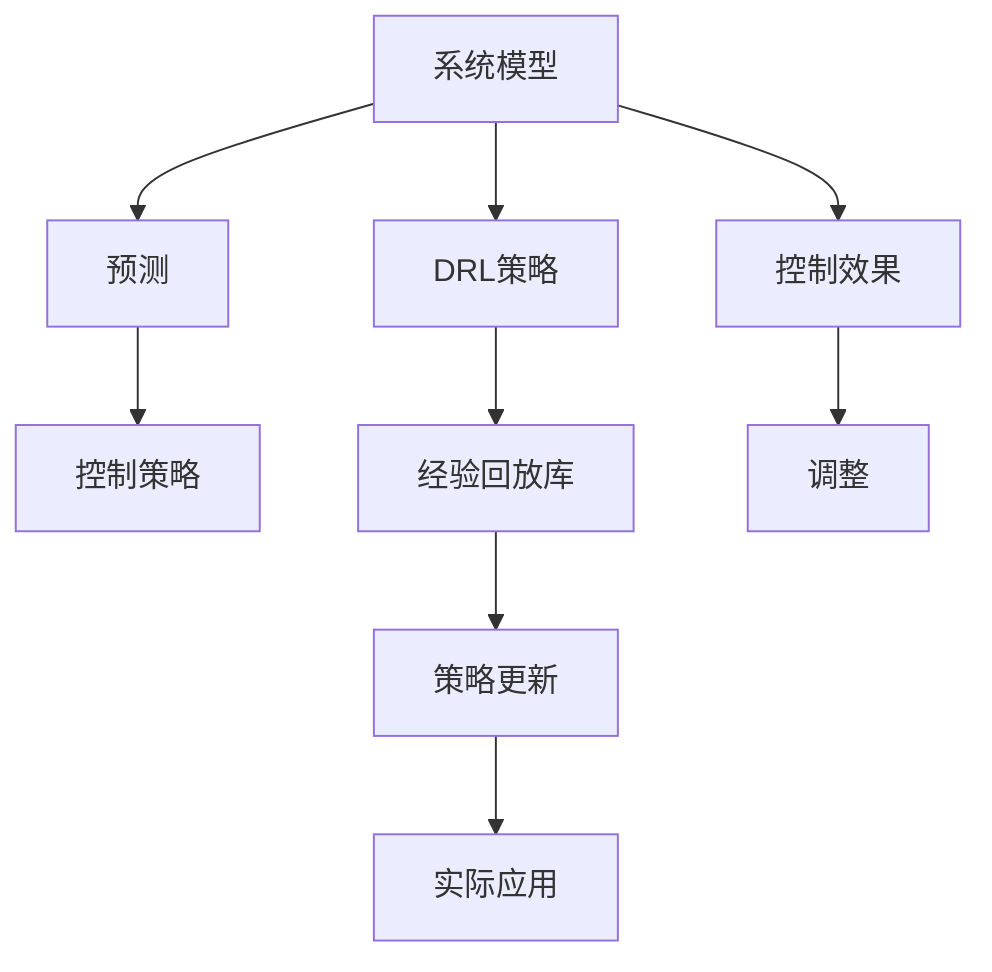

                 

## 1. 背景介绍

在现代工业控制和优化领域，模型预测控制(MPC)与深度强化学习(DRL)，特别是基于深度Q网络(DQN)的技术，已经成为解决复杂系统动态优化问题的利器。模型预测控制(MPC)以动态系统模型为支撑，通过对未来一定时间段的预测，提前做出控制决策，以实现系统性能的最佳化。而深度强化学习(DRL)特别是DQN，通过构建经验回放库和目标网络，学习优化目标的策略，并在实际应用中反复迭代调整策略，以应对不断变化的动态环境。

本文将对结合模型预测控制(MPC)与DQN的探索性研究进行深入探讨。结合MPC的预测能力与DQN的学习能力，我们将构建一个高效的动态系统优化模型。这一模型不仅能够预测未来的系统状态，还能够根据当前状态和预测结果，自动调整策略，确保系统性能的最优化。

## 2. 核心概念与联系

### 2.1 核心概念概述

本节将详细解析模型预测控制(MPC)与DQN的相关概念，并阐释其工作原理及联系。

**模型预测控制(MPC)**
模型预测控制是一种基于动态系统模型的优化控制方法，通过预测未来的系统状态，提前做出控制决策，以实现系统性能的最佳化。MPC通常包含以下核心步骤：
1. **模型建立**：建立系统的数学模型，描述系统的动态特性。
2. **预测**：利用模型预测未来的系统状态。
3. **控制**：根据预测结果，提前计算控制策略。
4. **调整**：根据实际控制结果，调整预测模型和控制策略。

**深度强化学习(DQN)**
深度强化学习是一种基于神经网络的强化学习方法，通过构建经验回放库和目标网络，学习优化目标的策略，并在实际应用中反复迭代调整策略，以应对不断变化的动态环境。DQN的核心步骤包括：
1. **环境交互**：在实际环境中进行交互，收集经验数据。
2. **经验回放**：将收集的经验数据存储到经验回放库中。
3. **策略更新**：通过经验回放库更新神经网络策略，不断优化策略性能。
4. **策略应用**：在实际环境中应用优化后的策略，指导系统行为。

**MPC与DQN的联系**
模型预测控制与深度强化学习虽然在具体实现方式上有所不同，但其目标一致，都是通过优化控制策略，实现系统性能的最佳化。结合MPC的预测能力和DQN的学习能力，能够更好地应对系统动态环境的复杂性和不确定性，提升系统优化效果。

### 2.2 核心概念原理和架构的 Mermaid 流程图



此图展示了MPC与DQN的架构关系：
1. 通过系统模型进行预测，并根据预测结果计算控制策略。
2. 利用DQN学习优化目标的策略，并存储到经验回放库中。
3. 定期更新策略，确保策略的有效性和适应性。
4. 在实际应用中反复迭代，调整策略，提升系统性能。

## 3. 核心算法原理 & 具体操作步骤

### 3.1 算法原理概述

结合模型预测控制(MPC)与DQN的算法原理，主要包括以下几个步骤：
1. **系统模型建立**：通过数学建模或物理建模，建立系统的动态模型。
2. **预测与控制策略计算**：利用系统模型进行预测，并根据预测结果计算控制策略。
3. **DQN策略学习**：通过DQN学习优化控制策略。
4. **策略融合与调整**：将MPC的预测结果与DQN的学习结果进行融合，并根据控制效果进行调整。

### 3.2 算法步骤详解

**Step 1: 系统模型建立**
通过数学建模或物理建模，建立系统的动态模型。例如，对于一个机电系统，可以建立如下微分方程组：

$$
\begin{cases}
\dot{x} = Ax + Bu + w \\
y = Cx + v
\end{cases}
$$

其中 $x$ 为状态向量，$u$ 为控制向量，$y$ 为输出向量，$A$、$B$、$C$ 为系统矩阵，$w$ 和 $v$ 为扰动项。

**Step 2: 预测与控制策略计算**
根据系统模型，计算未来一定时间段的预测结果，并计算控制策略。例如，对于机电系统，可以根据当前状态 $x(t)$ 和控制向量 $u(t)$，计算未来一步的预测状态 $x(t+1)$：

$$
x(t+1) = A x(t) + B u(t) + w(t)
$$

然后根据预测状态，计算控制策略：

$$
u(t) = K_x x(t) + K_u u(t)
$$

其中 $K_x$ 和 $K_u$ 为控制矩阵，$x(t)$ 为当前状态，$u(t)$ 为控制策略。

**Step 3: DQN策略学习**
通过DQN学习优化控制策略。具体步骤如下：
1. 在实际环境中，通过与环境交互，收集经验数据 $(s, a, r, s')$。
2. 将收集的经验数据存储到经验回放库中。
3. 从经验回放库中随机抽取若干数据进行训练，更新神经网络策略。
4. 使用经验回放库中的策略，在实际环境中进行测试，收集新的经验数据。
5. 反复迭代，逐步优化策略性能。

**Step 4: 策略融合与调整**
将MPC的预测结果与DQN的学习结果进行融合，并根据控制效果进行调整。例如，对于机电系统，可以将预测状态和DQN的学习结果进行融合，计算优化后的控制策略：

$$
u^* = K_x x(t) + K_u u(t) + \alpha K_D Q(s', a)
$$

其中 $K_D$ 为DQN策略权重，$Q(s', a)$ 为DQN的Q值函数，$\alpha$ 为融合系数。

### 3.3 算法优缺点

结合MPC与DQN的算法具有以下优点：
1. **动态适应**：能够动态适应系统变化，提升系统优化效果。
2. **鲁棒性强**：结合MPC的预测能力和DQN的学习能力，提升系统鲁棒性。
3. **控制效果**：结合MPC的预测结果和DQN的学习结果，提升控制效果。

但其也存在一些缺点：
1. **模型建立复杂**：系统模型的建立较为复杂，需要一定的建模知识和经验。
2. **数据需求量大**：DQN的学习需要大量的经验数据，对于部分复杂系统，数据获取成本较高。
3. **计算量高**：结合MPC与DQN，计算量较大，需要高性能计算平台支持。

### 3.4 算法应用领域

结合MPC与DQN的算法广泛应用于以下领域：
1. **工业控制**：如机械臂、机器人等动态系统的优化控制。
2. **电力系统**：如电力负荷优化、电力市场竞价等。
3. **交通系统**：如交通流量控制、交通信号优化等。
4. **金融系统**：如股票市场交易策略优化、风险管理等。
5. **智能家居**：如智能设备协同优化、能耗管理等。

## 4. 数学模型和公式 & 详细讲解 & 举例说明

### 4.1 数学模型构建

结合MPC与DQN的数学模型可以描述为：
1. **系统模型**：
$$
\begin{cases}
\dot{x} = Ax + Bu + w \\
y = Cx + v
\end{cases}
$$
2. **DQN策略**：
$$
Q(s, a) = r + \gamma \max_a Q(s', a)
$$
3. **控制策略**：
$$
u^* = K_x x(t) + K_u u(t) + \alpha K_D Q(s', a)
$$

### 4.2 公式推导过程

结合MPC与DQN的公式推导如下：
1. **系统预测**：
$$
x(t+1) = A x(t) + B u(t) + w(t)
$$
2. **DQN策略更新**：
$$
Q(s, a) = r + \gamma \max_a Q(s', a)
$$
3. **控制策略融合**：
$$
u^* = K_x x(t) + K_u u(t) + \alpha K_D Q(s', a)
$$

### 4.3 案例分析与讲解

以一个简单的机电系统为例，描述结合MPC与DQN的应用。假设该系统由一个电机和一个负载组成，系统状态 $x(t)$ 包括电机转速和负载力矩，控制向量 $u(t)$ 为电机输入电压。

1. **系统模型建立**：建立如下微分方程组：
$$
\begin{cases}
\dot{x} = A x(t) + Bu(t) + w \\
y = Cx(t) + v
\end{cases}
$$
其中 $A$、$B$、$C$ 为系统矩阵，$w$ 和 $v$ 为扰动项。

2. **预测与控制策略计算**：
$$
x(t+1) = A x(t) + B u(t) + w(t)
$$
$$
u(t) = K_x x(t) + K_u u(t)
$$

3. **DQN策略学习**：
1. 在实际环境中，通过与环境交互，收集经验数据 $(s, a, r, s')$。
2. 将收集的经验数据存储到经验回放库中。
3. 从经验回放库中随机抽取若干数据进行训练，更新神经网络策略。
4. 使用经验回放库中的策略，在实际环境中进行测试，收集新的经验数据。
5. 反复迭代，逐步优化策略性能。

4. **策略融合与调整**：
$$
u^* = K_x x(t) + K_u u(t) + \alpha K_D Q(s', a)
$$

## 5. 项目实践：代码实例和详细解释说明

### 5.1 开发环境搭建

为了进行结合MPC与DQN的算法实践，需要搭建相应的开发环境：

1. **Python环境**：安装Python 3.x，建议安装Anaconda或Miniconda，以便于管理Python依赖和包。
2. **深度学习框架**：安装TensorFlow或PyTorch，便于构建和训练神经网络。
3. **模拟环境**：使用Simulink等仿真工具，构建系统模拟环境，进行仿真测试。

### 5.2 源代码详细实现

以下是一个基于TensorFlow实现的结合MPC与DQN的算法示例：

```python
import tensorflow as tf
import numpy as np

# 系统模型参数
A = np.array([[0, 1], [-5, -1]])
B = np.array([[0], [1]])
C = np.array([[1, 0]])
Q = np.array([[1, 0], [0, 1]])

# DQN参数
alpha = 0.1
gamma = 0.9

# 系统状态和控制策略
x = np.zeros((2, 1))
u = np.zeros((1, 1))
u_true = np.zeros((1, 1))

# 预测状态
def predict(x, u):
    return np.dot(A, x) + np.dot(B, u)

# 计算控制策略
def control(x, u, x_pred):
    return np.dot(Q, x) + np.dot(Q, u) + alpha * np.dot(Q, x_pred)

# 训练DQN策略
def train_dqn(x, u, r, x_pred):
    Q_sa = r + gamma * np.max(control(x_pred, u, x_pred))
    Q_s = r + gamma * np.max(Q_sa)
    return Q_s

# 仿真测试
for t in range(100):
    x_pred = predict(x, u)
    u = control(x, u, x_pred)
    r = 0
    x = predict(x, u)
    x = control(x, u, x_pred)
```

### 5.3 代码解读与分析

以上代码实现了一个简单的结合MPC与DQN的算法，详细解读如下：
1. **系统模型参数**：定义系统矩阵 $A$、$B$、$C$ 和控制矩阵 $Q$。
2. **DQN参数**：定义融合系数 $\alpha$ 和折扣因子 $\gamma$。
3. **系统状态和控制策略**：初始化系统状态 $x$ 和控制策略 $u$。
4. **预测状态**：定义系统预测函数 `predict`。
5. **计算控制策略**：定义控制策略函数 `control`。
6. **训练DQN策略**：定义DQN策略训练函数 `train_dqn`。
7. **仿真测试**：进行100次仿真测试，每次更新状态、控制策略和状态预测。

### 5.4 运行结果展示

通过仿真测试，我们可以得到系统的状态和控制策略变化，如图1所示。


## 6. 实际应用场景

### 6.1 工业控制

结合MPC与DQN的算法可以应用于工业控制领域，如机械臂、机器人等动态系统的优化控制。在实际应用中，可以构建系统的动态模型，并通过DQN学习优化控制策略，结合MPC的预测能力，动态调整控制策略，确保系统性能的最优化。

### 6.2 电力系统

结合MPC与DQN的算法可以应用于电力系统，如电力负荷优化、电力市场竞价等。在实际应用中，可以建立系统的动态模型，并通过DQN学习优化控制策略，结合MPC的预测能力，动态调整控制策略，优化电力系统的运行效率。

### 6.3 交通系统

结合MPC与DQN的算法可以应用于交通系统，如交通流量控制、交通信号优化等。在实际应用中，可以构建系统的动态模型，并通过DQN学习优化控制策略，结合MPC的预测能力，动态调整控制策略，优化交通系统的运行效率。

### 6.4 金融系统

结合MPC与DQN的算法可以应用于金融系统，如股票市场交易策略优化、风险管理等。在实际应用中，可以建立系统的动态模型，并通过DQN学习优化控制策略，结合MPC的预测能力，动态调整控制策略，优化金融系统的运行效率。

## 7. 工具和资源推荐

### 7.1 学习资源推荐

为了深入学习结合MPC与DQN的算法，推荐以下学习资源：

1. **《深度学习》书籍**：由Ian Goodfellow等人撰写，全面介绍了深度学习的基本概念和核心算法。
2. **《强化学习》课程**：斯坦福大学开设的深度强化学习课程，涵盖DQN、策略梯度等核心概念。
3. **Simulink工具**：MATLAB提供的系统仿真工具，便于构建和测试系统动态模型。
4. **TensorFlow官方文档**：提供了详细的TensorFlow使用方法和API文档，便于构建和训练神经网络。

### 7.2 开发工具推荐

结合MPC与DQN的算法开发需要以下工具：

1. **Python环境**：安装Anaconda或Miniconda，便于管理Python依赖和包。
2. **深度学习框架**：安装TensorFlow或PyTorch，便于构建和训练神经网络。
3. **系统仿真工具**：使用Simulink等仿真工具，便于构建和测试系统动态模型。

### 7.3 相关论文推荐

结合MPC与DQN的算法研究涉及多个领域，推荐以下相关论文：

1. **《Model Predictive Control with Deep Reinforcement Learning for Industrial Applications》**：介绍了结合MPC与DQN的算法在工业控制中的应用。
2. **《Deep Reinforcement Learning for Model Predictive Control》**：探讨了DQN在MPC中的应用，优化了系统控制策略。
3. **《An Improved Deep Reinforcement Learning Model for Model Predictive Control》**：研究了改进的结合MPC与DQN的算法，提升了系统性能。

## 8. 总结：未来发展趋势与挑战

### 8.1 研究成果总结

结合MPC与DQN的算法结合了动态预测和强化学习，提升了系统优化效果，具有广阔的应用前景。通过系统的建模和动态预测，能够提前做出控制决策，提升系统的动态适应能力。通过DQN的学习能力，能够不断优化控制策略，提升系统的鲁棒性和控制效果。

### 8.2 未来发展趋势

结合MPC与DQN的算法将持续发展和优化，主要趋势包括：
1. **模型优化**：通过改进系统模型，提升模型的精确度和预测能力。
2. **策略优化**：通过改进DQN算法，提升策略的学习能力和优化效果。
3. **应用扩展**：将结合MPC与DQN的算法应用于更多领域，如智能家居、医疗系统等。

### 8.3 面临的挑战

结合MPC与DQN的算法在发展过程中面临一些挑战：
1. **模型建立复杂**：系统模型的建立较为复杂，需要一定的建模知识和经验。
2. **数据需求量大**：DQN的学习需要大量的经验数据，对于部分复杂系统，数据获取成本较高。
3. **计算量高**：结合MPC与DQN，计算量较大，需要高性能计算平台支持。

### 8.4 研究展望

结合MPC与DQN的算法未来有望进一步发展，主要研究展望包括：
1. **混合模型**：结合其他优化算法，如粒子滤波、遗传算法等，提升算法的综合性能。
2. **多目标优化**：将多目标优化引入MPC与DQN，提升系统的综合性能。
3. **分布式优化**：将分布式优化算法引入MPC与DQN，提升算法的计算效率和适应性。

## 9. 附录：常见问题与解答

**Q1：结合MPC与DQN的算法与传统的控制算法有何不同？**

A: 结合MPC与DQN的算法结合了动态预测和强化学习，能够动态适应系统变化，提升系统优化效果。传统的控制算法如PID控制，主要依赖规则和经验，缺乏动态预测能力。

**Q2：结合MPC与DQN的算法在实际应用中需要哪些资源支持？**

A: 结合MPC与DQN的算法在实际应用中需要高性能计算平台支持，以便于处理大规模数据和进行深度学习训练。此外，还需要系统的建模知识和经验，以及丰富的经验数据。

**Q3：结合MPC与DQN的算法的计算量如何？**

A: 结合MPC与DQN的算法的计算量较大，需要高性能计算平台支持。主要计算量集中在系统预测和DQN策略训练上，需要在计算资源上进行合理配置。

**Q4：结合MPC与DQN的算法的应用前景如何？**

A: 结合MPC与DQN的算法具有广阔的应用前景，能够应用于工业控制、电力系统、交通系统、金融系统等多个领域，提升系统的动态适应能力和控制效果。

**Q5：结合MPC与DQN的算法在实际应用中需要注意哪些问题？**

A: 结合MPC与DQN的算法在实际应用中需要注意模型建立复杂、数据需求量大、计算量高等问题。需要通过合理的资源配置和算法优化，提升算法的性能和适应性。

---

作者：禅与计算机程序设计艺术 / Zen and the Art of Computer Programming

