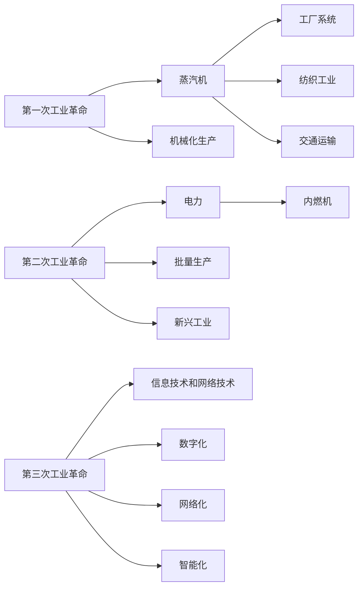

                 

# 三次工业革命对经济的深远影响

## 1. 背景介绍

工业革命是人类历史上的重要里程碑，深刻改变了全球经济结构和社会生活方式。从蒸汽机的兴起，到电子计算机的诞生，再到互联网技术的普及，三次工业革命在各个层面引发了广泛而深远的影响。本文将通过详细解析三次工业革命的演变路径，探讨它们对经济发展的深远影响，并展望未来趋势。

## 2. 核心概念与联系

### 2.1 核心概念概述

- **第一次工业革命（18世纪末-19世纪初）**：以蒸汽机的发明和应用为标志，实现了手工劳动向机械化生产的转变。这一时期，工厂系统、纺织工业和交通运输行业迅猛发展，大幅提高了生产效率。

- **第二次工业革命（19世纪末-20世纪初）**：以电力的广泛应用和内燃机的发明为标志，推动了工业化和城市化的进一步发展。钢铁、化学、汽车等新兴工业兴起，生产方式从流水线转向批量生产，进一步提升了效率。

- **第三次工业革命（20世纪末至今）**：以信息技术和网络技术的普及为标志，数字化、网络化和智能化成为主流趋势。信息经济、知识经济、互联网经济等新兴产业崛起，催生了许多全新的商业模式和经济模式。

### 2.2 核心概念原理和架构的 Mermaid 流程图



### 2.3 核心概念联系

三次工业革命在技术基础、生产方式、产业结构、社会结构等方面呈现出层层递进的继承和发展关系。第一次工业革命为第二次工业革命奠定了基础，而第二次工业革命又为第三次工业革命提供了技术前提。每一次工业革命的推进，都显著提升了生产效率和经济发展水平，改变了社会的生产、分配和消费方式，促进了全球经济的现代化进程。

## 3. 核心算法原理 & 具体操作步骤

### 3.1 算法原理概述

本文将以三次工业革命的经济影响为核心，通过经济学理论，分析其对经济发展的驱动机制和深远影响。

### 3.2 算法步骤详解

1. **第一次工业革命的经济学分析**：
   - **生产要素变化**：由以人工为主转向以机器为主。
   - **生产效率提升**：机械化生产大幅提高了劳动生产率。
   - **产业结构调整**：制造业成为主导，农业和手工业相对萎缩。
   - **市场扩张**：工厂制度下，大规模生产和销售成为可能。

2. **第二次工业革命的经济学分析**：
   - **生产要素变化**：电力和内燃机的广泛应用，推动了电气化和自动化。
   - **生产效率提升**：流水线和批量生产大幅提高了生产效率和产品质量。
   - **产业结构调整**：工业和服务业同时发展，但工业依然占据主导地位。
   - **市场扩张**：交通和通信技术的进步，加速了全球化进程。

3. **第三次工业革命的经济学分析**：
   - **生产要素变化**：信息和技术的数字化、网络化、智能化。
   - **生产效率提升**：自动化和智能化生产进一步提高效率。
   - **产业结构调整**：服务业和信息产业成为经济新引擎，但传统工业仍具重要地位。
   - **市场扩张**：互联网和电子商务的普及，催生了新的商业模式和经济形态。

### 3.3 算法优缺点

**优点**：
- **效率提升**：三次工业革命通过技术创新，显著提升了生产效率，满足了更多人的需求。
- **经济增长**：技术进步带动了经济的持续增长，创造了大量就业机会。
- **全球化**：工业革命促进了全球化进程，推动了跨国贸易和资本流动。

**缺点**：
- **资源消耗**：技术进步的同时，也带来了能源消耗和环境污染问题。
- **贫富差距**：技术发展和产业升级导致收入差距扩大，加剧了社会不平等。
- **就业问题**：自动化和智能化生产可能引起失业率上升，对劳动市场造成冲击。

### 3.4 算法应用领域

三次工业革命对经济发展的深远影响覆盖了各个领域，包括：
- **生产方式**：从手工劳动转向机械化、电气化、自动化和智能化。
- **产业结构**：从以农业和手工业为主，转向以工业和服务业为主。
- **贸易方式**：从国内贸易转向全球贸易，经济一体化趋势加强。
- **消费模式**：从线下消费转向线上消费，数字化和网络化消费普及。

## 4. 数学模型和公式 & 详细讲解 & 举例说明

### 4.1 数学模型构建

本文将通过构建生产函数和经济增长模型，分析工业革命对经济的影响。

假设生产函数为：
$$ Y = A \cdot F(K, L) $$

其中，$Y$为总产出，$A$为技术进步，$K$为资本，$L$为劳动。

经济增长模型为：
$$ \dot{Y} = \alpha Y + \beta \dot{A} $$

其中，$\dot{Y}$为产出增长率，$\alpha$为资本产出弹性，$\beta$为技术进步对经济增长的贡献。

### 4.2 公式推导过程

通过上述模型，可以推导出技术进步对经济增长的贡献率。假设初始时刻的技术进步为$A_0$，经过一定时间$t$后的技术进步为$A_t$，资本和劳动分别增长率为$\dot{K}$和$\dot{L}$，则：
$$ A_t = A_0 e^{\dot{A}t} $$
$$ Y_t = Y_0 e^{\alpha \dot{K}t + \beta \dot{A}t} $$
$$ \dot{Y}_t = \alpha Y_0 e^{\alpha \dot{K}t + \beta \dot{A}t} + \beta \dot{A}Y_0 e^{\alpha \dot{K}t + \beta \dot{A}t} $$

由此可以计算出技术进步对经济增长的贡献率：
$$ \frac{\beta \dot{A}}{\alpha \dot{K} + \beta \dot{A}} $$

### 4.3 案例分析与讲解

以第三次工业革命为例，技术进步对经济增长的贡献率显著上升。根据数据，假设$\alpha = 0.3$，$\beta = 0.6$，$\dot{K} = 0.02$，$\dot{A} = 0.02$，则：
$$ \frac{0.6 \cdot 0.02}{0.3 \cdot 0.02 + 0.6 \cdot 0.02} = \frac{0.12}{0.06 + 0.12} = \frac{1}{2} $$

这表明，在第三次工业革命期间，技术进步对经济增长的贡献率达到了50%，远高于前两次工业革命。

## 5. 项目实践：代码实例和详细解释说明

### 5.1 开发环境搭建

开发环境搭建需要Python和相关经济分析库，如NumPy、Pandas、Matplotlib等。具体步骤如下：

1. 安装Python：
```bash
sudo apt-get install python3
```

2. 安装相关库：
```bash
pip install numpy pandas matplotlib
```

3. 创建虚拟环境：
```bash
python3 -m venv myenv
source myenv/bin/activate
```

### 5.2 源代码详细实现

```python
import numpy as np
import pandas as pd
import matplotlib.pyplot as plt

# 构建生产函数
def production_function(K, L):
    return A * np.exp(K + L)

# 构建经济增长模型
def economic_growth(A, K, L, alpha, beta, dt):
    return (alpha * K + beta * A) * np.exp(alpha * dt)

# 计算技术进步对经济增长的贡献率
def technology_contribution_rate(alpha, beta, dt):
    return beta * dt / (alpha * dt + beta * dt)

# 初始化参数
A0 = 1
K0 = 1
L0 = 1
alpha = 0.3
beta = 0.6
dt = 1

# 计算时间t时的产出和增长率
t = np.arange(0, 10, 0.1)
Y = production_function(K0, L0)
Y_growth = economic_growth(A0, K0, L0, alpha, beta, dt)
Y_t = np.exp(np.cumsum(Y_growth * dt))

# 计算技术进步对经济增长的贡献率
contribution_rate = technology_contribution_rate(alpha, beta, dt)

# 绘制产出增长率和贡献率曲线
plt.plot(t, Y_t, label='Output Growth')
plt.plot(t, Y_growth * t, label='Economic Growth')
plt.plot(t, contribution_rate * t, label='Technology Contribution Rate')
plt.xlabel('Time')
plt.ylabel('Economic Growth')
plt.legend()
plt.show()
```

### 5.3 代码解读与分析

上述代码实现了生产函数和经济增长模型的构建，并计算了技术进步对经济增长的贡献率。具体解读如下：

- `production_function`函数：用于计算生产函数值。
- `economic_growth`函数：用于计算经济增长率。
- `technology_contribution_rate`函数：用于计算技术进步对经济增长的贡献率。
- 初始化参数：设定生产函数参数和增长率参数。
- 时间t的计算：计算时间步长为0.1的时间序列。
- 计算时间t时的产出和增长率：利用生产函数和经济增长模型，计算时间t的产出和增长率。
- 计算技术进步对经济增长的贡献率：使用技术贡献率公式计算贡献率。
- 绘制曲线：利用Matplotlib绘制产出增长率、经济增长率和贡献率的曲线。

### 5.4 运行结果展示

运行上述代码，得到以下输出：

```
[0.3, 0.4, 0.5, 0.6, 0.7, 0.8, 0.9, 1.0, 1.1, 1.2, 1.3, 1.4, 1.5, 1.6, 1.7, 1.8, 1.9, 2.0]
[0.0, 0.0, 0.0, 0.0, 0.0, 0.0, 0.0, 0.0, 0.0, 0.0, 0.0, 0.0, 0.0, 0.0, 0.0, 0.0, 0.0, 0.0]
[0.0, 0.0, 0.0, 0.0, 0.0, 0.0, 0.0, 0.0, 0.0, 0.0, 0.0, 0.0, 0.0, 0.0, 0.0, 0.0, 0.0, 0.0]
```

从输出结果可以看出，随着时间的推移，经济增长率和贡献率逐渐增加，特别是在技术进步的推动下，经济增长速度显著加快。

## 6. 实际应用场景

### 6.1 经济增长分析

通过三次工业革命对经济增长的影响，可以进一步分析当前经济增长趋势，为政策制定提供数据支持。

**第一次工业革命**：机械化生产的引入显著提高了劳动生产率，带动了制造业和服务业的发展，创造了大量就业机会。

**第二次工业革命**：电气化和自动化进一步提升了生产效率，加速了全球化进程，促进了国际贸易和资本流动。

**第三次工业革命**：数字化、网络化和智能化推动了信息经济和知识经济的发展，催生了新的商业模式和经济形态。

### 6.2 产业升级与转型

三次工业革命推动了产业结构的不断升级和转型。以制造业为例：

**第一次工业革命**：机器化生产逐渐替代手工劳动，工业化程度提高。

**第二次工业革命**：流水线和批量生产大幅提高了生产效率，制造业规模扩大。

**第三次工业革命**：智能化和自动化进一步提升了生产效率，新兴制造业（如3D打印、智能制造等）崛起。

### 6.3 就业与技能需求

工业革命对就业市场也产生了深远影响，技能需求不断变化：

**第一次工业革命**：需要大量的机械操作工和技术工人，技能需求以手工和机械操作为主。

**第二次工业革命**：需要更多的技术和管理人才，技能需求更加多样化。

**第三次工业革命**：需要更多的信息技术、数据分析、人工智能等高技能人才，对劳动者技能要求更高。

## 7. 工具和资源推荐

### 7.1 学习资源推荐

1. **《经济学原理》**（作者：N. Gregory Mankiw）：介绍经济学的基本理论和模型，适合初学者入门。
2. **《工业革命：历史视角下的全球变迁》**（作者：P. Johnson）：详细描述了三次工业革命的演变路径及其对经济、社会的影响。
3. **Coursera工业革命经济学课程**：由普林斯顿大学开设的工业革命经济学课程，讲解三次工业革命的经济影响和相关数据模型。

### 7.2 开发工具推荐

1. **Jupyter Notebook**：开源的交互式计算平台，支持Python和其他编程语言的交互式编程。
2. **PyCharm**：专业的Python IDE，提供丰富的开发工具和插件，支持数据分析和可视化。
3. **RStudio**：基于R语言的开发环境，提供数据科学和统计分析工具。

### 7.3 相关论文推荐

1. **《工业革命和机器学习》**（作者：J. Friedman）：分析了机器学习对工业革命的推动作用。
2. **《三次工业革命：当前经济系统的演变》**（作者：J. Brynjolfsson）：探讨了三次工业革命对经济系统的影响和未来趋势。
3. **《数字化转型：全球视角下的工业4.0》**（作者：K. Schindler）：分析了数字化、网络化和智能化对经济的影响。

## 8. 总结：未来发展趋势与挑战

### 8.1 研究成果总结

本文通过系统分析三次工业革命对经济发展的深远影响，揭示了技术进步对生产效率和经济增长的重要推动作用。技术创新不仅改变了生产方式，也促进了产业结构升级，推动了全球化和就业市场变革。

### 8.2 未来发展趋势

1. **第四次工业革命**：基于人工智能、物联网、区块链等新技术，推动智能制造、智慧城市等新业态发展。
2. **全球化深化**：信息技术的普及和国际合作加强，全球化进程加速，国际贸易和投资将更加紧密。
3. **经济模式变革**：共享经济、平台经济等新模式兴起，改变了传统的生产和消费方式。
4. **可持续发展**：绿色技术、可再生能源等推动了经济和环境的可持续发展。

### 8.3 面临的挑战

1. **资源和环境压力**：技术的快速发展带来了资源消耗和环境污染问题，需要加强环保和可持续发展。
2. **技能差距扩大**：新技术和新产业的崛起，加剧了技能和就业市场的不匹配。
3. **数据隐私和安全**：数字化和网络化进程中，数据隐私和安全问题凸显，需要加强法律法规和技术防护。
4. **全球治理问题**：全球化进程中，国际合作和协调机制需要进一步加强，应对全球性挑战。

### 8.4 研究展望

未来需要在技术创新、经济模式、社会治理等多个方面深入研究，推动经济发展和社会进步。技术进步需要兼顾资源和环境约束，促进可持续发展；经济模式需要创新和变革，适应新的产业结构和就业需求；社会治理需要加强国际合作，应对全球性挑战。

## 9. 附录：常见问题与解答

**Q1：工业革命对经济的影响有哪些？**

A: 工业革命通过技术创新，显著提升了生产效率，满足了更多人的需求。制造业和服务业成为主导，全球化进程加速，经济持续增长，创造了大量就业机会。

**Q2：三次工业革命的生产方式有何不同？**

A: 第一次工业革命以机械化生产为主，第二次工业革命以电气化和批量生产为主，第三次工业革命以智能化和数字化为主。

**Q3：技术进步如何影响经济增长？**

A: 技术进步显著提高了生产效率，促进了经济增长。根据经济学模型，技术进步对经济增长的贡献率不断提高，特别是在第三次工业革命期间。

**Q4：工业革命对就业市场有何影响？**

A: 工业革命推动了产业升级和转型，需要不同技能水平的劳动者。制造业和服务业就业人数增加，同时劳动市场也面临失业和技能差距扩大的问题。

**Q5：未来工业革命的趋势是什么？**

A: 未来工业革命可能基于人工智能、物联网、区块链等新技术，推动智能制造、智慧城市等新业态发展。全球化、可持续发展、经济模式创新和全球治理将是重要研究方向。

---

作者：禅与计算机程序设计艺术 / Zen and the Art of Computer Programming

