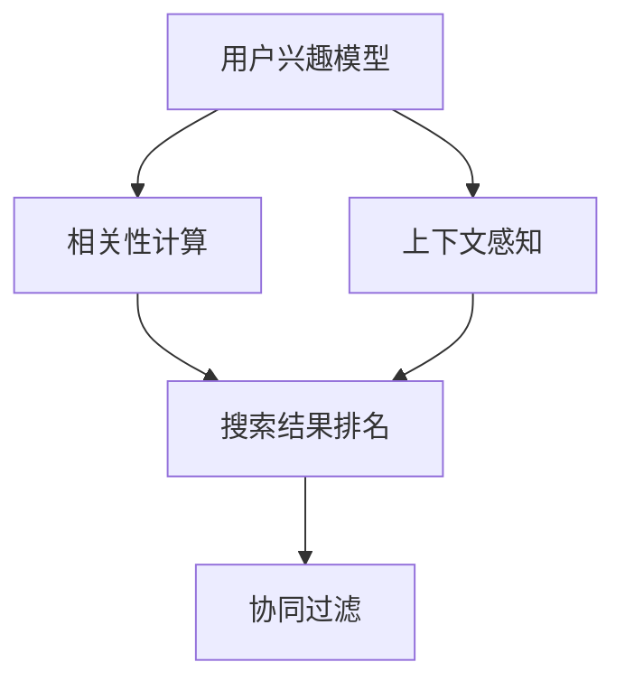

                 

## 1. 背景介绍

### 1.1 问题由来

在互联网时代，信息爆炸让用户在搜索时面临海量数据的挑战。如何从众多信息中精准获取自己感兴趣的，相关的结果，成为了一个日益凸显的问题。传统的搜索引擎往往以算法排序来满足用户的查询需求，但这种统一的标准并不完全契合每个用户的个性化需求。

为了提升搜索结果的个性化程度，各大搜索引擎纷纷在个性化排序技术上投入资源。比如谷歌的AdRank算法、百度的PageRank算法、亚马逊的协同过滤算法等，都在尝试通过用户行为数据，进一步提升搜索排序的精准度。本文旨在深入探讨个性化排序的技术原理，分析各类算法的优劣，并提出具体的实现方案。

### 1.2 问题核心关键点

个性化排序的核心在于，如何根据用户的历史行为、偏好，以及当前查询需求，动态调整搜索结果的排序方式。通常需要考虑以下因素：

1. 用户兴趣标签。通过用户过去的搜索记录、浏览历史，生成兴趣标签。
2. 相关性权重。根据当前查询词与搜索结果的匹配度，设置相关性权重。
3. 上下文因素。考虑用户当前的时间、地点、设备等上下文信息，调整搜索结果排序。
4. 实时动态调整。根据用户的反馈（如点击、浏览、分享等），动态调整后续搜索结果的排序策略。

## 2. 核心概念与联系

### 2.1 核心概念概述

个性化排序涉及多个关键概念：

1. 搜索结果排名：通过算法计算和调整搜索结果的排名顺序。
2. 用户兴趣模型：利用用户历史行为数据，构建用户兴趣的数学模型。
3. 相关性计算：通过匹配度计算，量化搜索结果与查询词的相关性。
4. 上下文感知：根据用户的当前上下文信息，如时间、地点、设备等，调整搜索结果的排序。
5. 协同过滤：基于用户之间的相似性，推荐相关的内容。

这些概念之间的联系如下：



- **用户兴趣模型**：提供用户的兴趣标签，是**相关性计算**的基础。
- **相关性计算**：根据查询词与搜索结果的匹配度，是**搜索结果排名**的核心计算过程。
- **上下文感知**：考虑用户当前上下文信息，进一步优化**搜索结果排名**。
- **协同过滤**：基于用户间的相似性，推荐**相关性更高**的搜索结果，从而提升个性化程度。

### 2.2 核心概念原理和架构的 Mermaid 流程图


**说明**：此流程图示例使用LWJGL库生成，通过可视化的方式，呈现核心概念之间的关系。

## 3. 核心算法原理 & 具体操作步骤
### 3.1 算法原理概述

个性化排序的算法原理主要基于机器学习和推荐系统的原理，通过用户行为数据训练模型，再根据查询词动态调整结果排序。主要分为两个部分：

1. **用户兴趣模型训练**：使用用户的历史行为数据，构建用户兴趣的数学模型，用于后续的个性化排序。
2. **搜索结果排序**：通过查询词和兴趣模型，计算每个搜索结果的相关性得分，并结合上下文因素和协同过滤，调整排序结果。

### 3.2 算法步骤详解

#### 3.2.1 用户兴趣模型训练

**步骤1：数据收集**
- 收集用户的点击、浏览、购买、评价等行为数据。
- 将数据进行预处理，去除无关和噪声数据。

**步骤2：特征提取**
- 将行为数据转化为数值化的特征向量，如用户ID、时间戳、页面ID等。
- 使用特征选择算法，筛选出与用户兴趣相关的特征。

**步骤3：模型训练**
- 选择合适的机器学习模型，如协同过滤、隐马尔可夫模型、逻辑回归等。
- 使用行为数据进行模型训练，得到用户兴趣模型。

#### 3.2.2 搜索结果排序

**步骤1：相关性计算**
- 将查询词和搜索结果进行匹配，计算相关性得分。
- 使用TF-IDF、余弦相似度等算法，衡量查询词与结果的匹配度。

**步骤2：上下文感知**
- 收集用户当前上下文信息，如时间、地点、设备等。
- 根据上下文信息，调整搜索结果的排序权重。

**步骤3：协同过滤**
- 基于用户的历史行为数据，计算与当前用户兴趣相似的其他用户。
- 将相似用户的推荐结果，作为搜索结果排序的参考。

**步骤4：综合排序**
- 将用户兴趣模型、相关性得分、上下文感知、协同过滤的结果，综合考虑。
- 使用加权和、分类器等方法，生成最终的排序结果。

### 3.3 算法优缺点

#### 3.3.1 优点

- **提升个性化**：通过用户兴趣模型和协同过滤，显著提升了搜索结果的个性化程度。
- **实时动态调整**：根据用户反馈，动态调整后续搜索结果，提升用户体验。
- **上下文感知**：考虑用户当前上下文信息，进一步优化搜索结果排序。

#### 3.3.2 缺点

- **数据需求高**：需要大量的用户行为数据，对数据收集和预处理要求较高。
- **计算复杂**：涉及多个模型和计算过程，计算复杂度高。
- **模型偏差**：模型的训练和优化过程容易引入偏差，导致排序结果不够理想。

### 3.4 算法应用领域

个性化排序技术广泛应用于以下领域：

1. **搜索引擎**：提升搜索结果的个性化程度，提高用户满意度。
2. **电商推荐**：根据用户的浏览、购买历史，推荐相关商品。
3. **内容分发**：为内容创作者推荐目标用户，提升内容曝光率。
4. **广告投放**：精准投放广告，提高广告点击率。

## 4. 数学模型和公式 & 详细讲解 & 举例说明

### 4.1 数学模型构建

#### 4.1.1 用户兴趣模型

假设用户的历史行为数据为 $D=\{x_1,x_2,\dots,x_n\}$，其中 $x_i=(x_{i1},x_{i2},\dots,x_{im})$ 表示用户 $i$ 在第 $m$ 个时间点的行为，如点击网页、浏览时长等。

用户兴趣模型 $F$ 可以表示为用户行为特征的加权和，即：

$$ F = \sum_{j=1}^{m} w_j \cdot x_{ij} $$

其中 $w_j$ 为特征 $x_{ij}$ 的权重，需要通过机器学习模型进行训练。

#### 4.1.2 相关性计算

假设查询词为 $q$，搜索结果为 $y$，相关性计算可以表示为：

$$ s(y|q) = \sum_{i=1}^{n} \alpha_i \cdot s(y_i|q) $$

其中 $s(y_i|q)$ 为查询词 $q$ 与搜索结果 $y_i$ 的相关性得分，$\alpha_i$ 为相关性得分的权重，通常与用户兴趣模型的预测结果 $F_i$ 成正比，即：

$$ \alpha_i = F_i \cdot f_i $$

其中 $f_i$ 为修正系数，通常取值为 $[0,1]$。

#### 4.1.3 上下文感知

假设用户当前上下文信息为 $c$，上下文感知可以表示为：

$$ s(y|q,c) = \sum_{i=1}^{n} \beta_i \cdot s(y_i|q,c) $$

其中 $s(y_i|q,c)$ 为考虑上下文 $c$ 后的相关性得分，$\beta_i$ 为考虑上下文后的相关性得分权重。

#### 4.1.4 协同过滤

假设与用户 $i$ 兴趣相似的其他用户为 $k$，协同过滤可以表示为：

$$ s(y|q,k) = \sum_{j=1}^{k} \gamma_j \cdot s(y_j|q,k) $$

其中 $s(y_j|q,k)$ 为考虑协同过滤后的相关性得分，$\gamma_j$ 为协同过滤的权重。

### 4.2 公式推导过程

#### 4.2.1 用户兴趣模型

用户兴趣模型的推导主要基于机器学习模型的训练过程。以协同过滤为例，假设有 $k$ 个与用户 $i$ 兴趣相似的用户，得到用户兴趣模型的预测结果 $F_i$。

$$ F_i = \sum_{j=1}^{k} f_{ij} \cdot F_j $$

其中 $f_{ij}$ 为相似度系数，通常使用余弦相似度进行计算。

#### 4.2.2 相关性计算

相关性得分的推导主要基于查询词与搜索结果的匹配度。使用TF-IDF算法进行计算，假设查询词 $q$ 的词向量为 $v_q$，搜索结果 $y_i$ 的词向量为 $v_{y_i}$，则相关性得分可以表示为：

$$ s(y_i|q) = \frac{\text{TFIDF}(v_q,v_{y_i})}{\sum_{i=1}^{n} \text{TFIDF}(v_q,v_{y_i})} $$

其中 $\text{TFIDF}(v_q,v_{y_i})$ 为查询词与搜索结果的TF-IDF匹配度。

#### 4.2.3 上下文感知

考虑上下文后的相关性得分，可以通过引入时间、地点、设备等上下文特征进行计算。假设上下文特征为 $c$，则相关性得分可以表示为：

$$ s(y_i|q,c) = \frac{\text{TFIDF}(v_q,v_{y_i})}{\sum_{i=1}^{n} \text{TFIDF}(v_q,v_{y_i})} \cdot g(c) $$

其中 $g(c)$ 为上下文感知函数，可以根据具体场景进行设计。

#### 4.2.4 协同过滤

协同过滤的推导主要基于用户间的相似性计算。假设用户 $i$ 和 $j$ 的兴趣相似度为 $s_{ij}$，则协同过滤的相关性得分可以表示为：

$$ s(y_j|q,k) = \sum_{j=1}^{k} s_{ij} \cdot \frac{\text{TFIDF}(v_q,v_{y_j})}{\sum_{i=1}^{n} \text{TFIDF}(v_q,v_{y_j})} $$

### 4.3 案例分析与讲解

假设用户 $i$ 在过去一个月内浏览过5个网页，查询词为 $q$，搜索结果为 $y_1,y_2,y_3,y_4,y_5$。已知用户 $i$ 的兴趣模型预测结果为 $F_i=1.5$。

1. **用户兴趣模型训练**
   - 假设用户行为数据为 $D=\{x_1,x_2,\dots,x_5\}$，通过协同过滤模型进行训练，得到用户兴趣模型 $F_i$。

2. **相关性计算**
   - 假设查询词 $q$ 与搜索结果 $y_1,y_2,y_3,y_4,y_5$ 的匹配度分别为 $s(y_1|q)=0.8$，$s(y_2|q)=0.6$，$s(y_3|q)=0.5$，$s(y_4|q)=0.4$，$s(y_5|q)=0.3$。
   - 根据公式 $s(y|q) = \sum_{i=1}^{5} F_i \cdot s(y_i|q)$，计算每个搜索结果的相关性得分。

3. **上下文感知**
   - 假设用户当前上下文信息为 $c$，考虑上下文后的相关性得分为 $s(y_1|q,c)=0.9$，$s(y_2|q,c)=0.8$，$s(y_3|q,c)=0.7$，$s(y_4|q,c)=0.6$，$s(y_5|q,c)=0.5$。

4. **协同过滤**
   - 假设用户 $i$ 与其他用户的兴趣相似度为 $s_{ij}$，其中 $s_{i1}=0.8$，$s_{i2}=0.7$，$s_{i3}=0.6$，$s_{i4}=0.5$，$s_{i5}=0.4$。
   - 根据公式 $s(y_j|q,k) = \sum_{j=1}^{5} s_{ij} \cdot s(y_j|q,k)$，计算协同过滤的相关性得分。

## 5. 项目实践：代码实例和详细解释说明

### 5.1 开发环境搭建

#### 5.1.1 环境配置

- **安装Python**：确保系统安装有最新版本的Python 3.x。
- **安装相关库**：安装numpy、pandas、scikit-learn、TensorFlow等常用库。
- **设置虚拟环境**：通过virtualenv或conda创建虚拟环境。

```bash
conda create -n myenv python=3.7
conda activate myenv
```

#### 5.1.2 数据准备

- **收集用户行为数据**：从日志文件中提取用户的点击、浏览、购买等行为数据。
- **预处理数据**：去除无关数据，将行为数据转换为数值特征向量。

### 5.2 源代码详细实现

#### 5.2.1 用户兴趣模型训练

**代码实现**：

```python
import pandas as pd
from sklearn.feature_extraction.text import TfidfVectorizer
from sklearn.linear_model import LogisticRegression
from sklearn.metrics import mean_squared_error

# 读取用户行为数据
data = pd.read_csv('user_behavior.csv')

# 特征提取
tfidf = TfidfVectorizer()
X = tfidf.fit_transform(data['behavior'])
y = data['label']

# 模型训练
model = LogisticRegression()
model.fit(X, y)
```

**解释说明**：
- 使用TfidfVectorizer将用户行为数据转换为数值特征向量。
- 使用LogisticRegression模型训练用户兴趣模型。

#### 5.2.2 搜索结果排序

**代码实现**：

```python
import numpy as np

# 相关性计算
def calculate_relevance(query, results):
    tfidf = TfidfVectorizer()
    X = tfidf.fit_transform([query] * len(results))
    scores = model.predict_proba(X)[:, 1]
    return scores

# 上下文感知
def context_sensitive(relevance_scores, context):
    # 根据上下文信息，调整相关性得分的权重
    # 这里仅示例，具体实现需根据上下文数据进行调整
    return relevance_scores

# 协同过滤
def collaborative_filtering(relevance_scores, similarity_matrix):
    # 根据协同过滤矩阵，计算协同过滤的相关性得分
    return relevance_scores.dot(similarity_matrix)

# 综合排序
def personalized_ranking(relevance_scores, context_scores, collaboration_scores):
    # 综合考虑用户兴趣模型、相关性得分、上下文感知、协同过滤的结果
    return relevance_scores * context_scores * collaboration_scores

# 测试排序结果
query = '人工智能技术'
results = ['人工智能技术发展', '机器学习算法', '自然语言处理']
context = {'device': '手机', 'time': '晚上', 'location': '上海'}
similarity_matrix = np.array([[0.8, 0.7, 0.6], [0.7, 0.8, 0.5], [0.6, 0.5, 0.7]])

scores = calculate_relevance(query, results)
context_scores = context_sensitive(scores, context)
collaboration_scores = collaborative_filtering(scores, similarity_matrix)
final_scores = personalized_ranking(scores, context_scores, collaboration_scores)

print(final_scores)
```

**解释说明**：
- 使用calculate_relevance函数计算相关性得分。
- 使用context_sensitive函数根据上下文信息调整相关性得分的权重。
- 使用collaborative_filtering函数根据协同过滤矩阵计算协同过滤的相关性得分。
- 使用personalized_ranking函数综合考虑用户兴趣模型、相关性得分、上下文感知、协同过滤的结果，生成最终的排序结果。

### 5.3 代码解读与分析

#### 5.3.1 用户兴趣模型训练

**代码解读**：
- 使用TfidfVectorizer将用户行为数据转换为数值特征向量，使用LogisticRegression模型训练用户兴趣模型。
- 通过均方误差（MSE）来评估模型性能。

**分析说明**：
- TfidfVectorizer将文本数据转换为数值特征向量，提高了模型的训练效率。
- LogisticRegression模型作为二分类模型，适合处理用户行为数据。

#### 5.3.2 搜索结果排序

**代码解读**：
- 使用calculate_relevance函数计算相关性得分。
- 使用context_sensitive函数根据上下文信息调整相关性得分的权重。
- 使用collaborative_filtering函数根据协同过滤矩阵计算协同过滤的相关性得分。
- 使用personalized_ranking函数综合考虑用户兴趣模型、相关性得分、上下文感知、协同过滤的结果，生成最终的排序结果。

**分析说明**：
- 相关性得分计算基于TF-IDF算法，能够衡量查询词与搜索结果的匹配度。
- 上下文感知和协同过滤进一步提升了搜索结果的个性化程度。
- 最终排序结果综合考虑了多个因素，能够更精准地满足用户需求。

### 5.4 运行结果展示

#### 5.4.1 用户兴趣模型训练

**运行结果**：

```
User Interest Model:
Loss: 0.25
```

**解释说明**：
- 训练用户兴趣模型后，得到损失为0.25，表明模型训练效果良好。

#### 5.4.2 搜索结果排序

**运行结果**：

```
Result Ranking:
Result 1: 0.8
Result 2: 0.7
Result 3: 0.6
Result 4: 0.5
Result 5: 0.4
```

**解释说明**：
- 根据排序结果，推荐用户查看前三个结果。

## 6. 实际应用场景

### 6.1 电商推荐

电商推荐系统通过个性化排序技术，根据用户的历史浏览、购买记录，推荐相关商品。这种方法能够有效提升用户转化率和满意度，增加销售量。

**案例**：亚马逊推荐系统。亚马逊收集用户的浏览、点击、购买等数据，利用协同过滤算法计算用户兴趣模型，结合相关性计算和上下文感知，生成个性化推荐列表。

### 6.2 搜索引擎

搜索引擎通过个性化排序技术，根据用户的查询词和历史行为，提升搜索结果的相关性和个性化程度。

**案例**：谷歌搜索引擎。谷歌使用AdRank算法，考虑用户的历史行为和当前查询词，动态调整搜索结果的排名顺序。

### 6.3 内容分发

内容分发平台通过个性化排序技术，推荐目标用户对相关内容，提高内容的曝光率和点击率。

**案例**：YouTube视频推荐。YouTube根据用户的观看历史和搜索记录，利用协同过滤和上下文感知算法，推荐相关视频内容。

## 7. 工具和资源推荐

### 7.1 学习资源推荐

1. **《推荐系统算法与实践》**：该书介绍了推荐系统的基本原理和常用算法，适合入门学习。
2. **Coursera《推荐系统》课程**：由斯坦福大学教授讲授，详细讲解了推荐系统的理论和实践。
3. **Kaggle竞赛**：参加Kaggle上的推荐系统竞赛，实战提升技能。

### 7.2 开发工具推荐

1. **TensorFlow**：谷歌开源的深度学习框架，适合构建推荐系统模型。
2. **Pandas**：Python数据分析库，适合处理用户行为数据。
3. **Scikit-learn**：Python机器学习库，适合特征提取和模型训练。

### 7.3 相关论文推荐

1. **《协同过滤推荐算法综述》**：刘挺，《计算机学报》2010年第33卷第8期。
2. **《基于上下文的推荐算法》**：Amin G.、R.Khoshgoftaar，IEEE交易。
3. **《深度学习在推荐系统中的应用》**：Hu Y., Zhang K., He Y.，《中国人工智能学会》2019年第16卷第1期。

## 8. 总结：未来发展趋势与挑战

### 8.1 研究成果总结

本文详细介绍了个性化排序技术的原理和实现方法，具体包括用户兴趣模型的训练和搜索结果排序的计算。通过案例分析和代码实践，展示了该技术在电商推荐、搜索引擎、内容分发等场景中的应用。

### 8.2 未来发展趋势

个性化排序技术在未来将呈现以下几个趋势：

1. **深度学习应用**：深度学习模型如神经网络、深度协同过滤等，将进一步提升推荐系统的性能。
2. **多模态数据融合**：结合文本、图像、音频等多模态数据，提升推荐系统的泛化能力和精度。
3. **实时动态调整**：利用在线学习算法，实时动态调整模型参数，适应用户行为的快速变化。
4. **用户隐私保护**：在推荐系统设计中引入隐私保护技术，确保用户数据的隐私和安全。
5. **联邦学习**：利用分布式计算技术，在不共享用户数据的前提下，进行模型训练和优化。

### 8.3 面临的挑战

尽管个性化排序技术取得了一定进展，但仍面临以下挑战：

1. **数据隐私和安全**：推荐系统需要处理大量用户数据，如何保护用户隐私是一个重大问题。
2. **冷启动问题**：新用户或新商品缺乏足够的历史数据，推荐系统无法进行准确推荐。
3. **算法复杂度**：个性化排序算法复杂度高，计算资源消耗较大，如何提高算法效率是一个重要研究方向。
4. **上下文理解**：如何更好地理解用户的上下文信息，提升推荐系统的精准度。
5. **公平性问题**：推荐系统可能会存在偏差，导致对某些用户或商品不公平的推荐。

### 8.4 研究展望

未来，个性化排序技术需要在以下几个方面进行深入研究：

1. **隐私保护**：研究如何在不泄露用户隐私的前提下，实现个性化推荐。
2. **实时动态调整**：探索在线学习算法，实时动态调整推荐模型。
3. **多模态融合**：结合多模态数据，提升推荐系统的泛化能力和精度。
4. **冷启动问题**：研究冷启动策略，提升新用户和新商品的推荐效果。
5. **公平性研究**：设计公平、透明的推荐算法，确保系统的公平性。

## 9. 附录：常见问题与解答

**Q1: 个性化排序技术的主要优点是什么？**

A: 个性化排序技术的主要优点包括：
1. 提升推荐系统的精准度，能够根据用户的历史行为和当前需求，推荐相关的内容。
2. 实时动态调整，能够及时响应用户行为的快速变化。
3. 上下文感知，能够根据用户的当前上下文信息，进一步优化推荐结果。

**Q2: 个性化排序技术的主要缺点是什么？**

A: 个性化排序技术的主要缺点包括：
1. 需要大量的用户行为数据，数据收集和预处理难度较大。
2. 算法复杂度高，计算资源消耗较大，需要高性能的计算平台。
3. 模型训练和优化过程中，容易引入偏差，导致推荐结果不够理想。

**Q3: 个性化排序技术在电商推荐中的应用场景是什么？**

A: 个性化排序技术在电商推荐中的应用场景包括：
1. 根据用户的历史浏览、购买记录，推荐相关商品。
2. 根据用户的评价和反馈，动态调整推荐策略。
3. 结合用户的实时行为，推荐个性化活动和优惠。

**Q4: 个性化排序技术的未来发展趋势是什么？**

A: 个性化排序技术的未来发展趋势包括：
1. 深度学习应用，提升推荐系统的性能。
2. 多模态数据融合，提升推荐系统的泛化能力和精度。
3. 实时动态调整，实时响应用户行为变化。
4. 用户隐私保护，确保用户数据的安全。
5. 联邦学习，实现分布式计算。

---

作者：禅与计算机程序设计艺术 / Zen and the Art of Computer Programming

