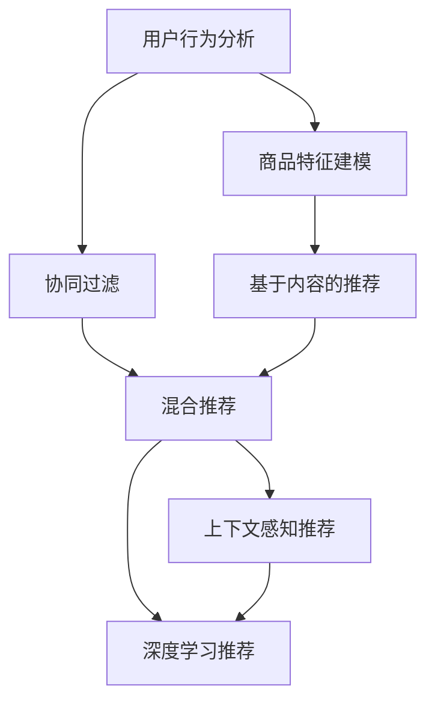

                 

# 个性化推荐的商业价值分析

> 关键词：个性化推荐,商业价值,推荐系统,用户行为,算法优化,广告投放,客户留存

## 1. 背景介绍

### 1.1 问题由来

随着互联网的迅速发展和数字经济的崛起，电子商务、在线视频、在线旅游、在线教育等数字平台已成为用户获取商品和服务的主要渠道。平台为了满足用户需求，提升用户体验，纷纷引入个性化推荐系统。个性化推荐系统通过分析用户行为、兴趣和偏好，推荐合适的商品、内容或服务，极大地提升了用户满意度、转化率和平台收入。

据统计，个性化推荐系统每年为用户节省的时间成本超过100亿小时，推荐的商品在电商平台上带来的成交额可占到总成交额的30%以上。推荐系统已经成为数字经济中不可或缺的关键技术，对于平台商业价值的提升起到了至关重要的作用。

### 1.2 问题核心关键点

个性化推荐系统的核心在于通过算法模型精准捕捉用户兴趣，通过推荐商品、内容或服务，满足用户个性化需求，从而提升用户满意度和平台转化率。个性化推荐主要依赖以下关键技术：

1. **用户行为分析**：通过分析用户在平台上的浏览、购买、评分等行为数据，提取用户兴趣特征。
2. **商品或内容特征建模**：将商品、内容等实体特征化，建立特征向量。
3. **相似度计算**：基于用户特征和实体特征，计算相似度，构建推荐模型。
4. **模型训练与优化**：使用机器学习算法训练推荐模型，并根据用户反馈不断优化。
5. **推荐策略设计**：基于模型输出，设计推荐策略，如基于时间、地点、人群等维度的多场景推荐。

## 2. 核心概念与联系

### 2.1 核心概念概述

为更好地理解个性化推荐系统的原理和应用，本节将介绍几个关键概念：

- **个性化推荐系统(Recommender System)**：利用用户行为数据，通过算法模型预测用户对商品、内容或服务的兴趣，进而推荐符合用户需求的商品、内容或服务。
- **协同过滤(Collaborative Filtering)**：基于用户-商品、内容-内容的协同关系，推荐相似用户或内容的喜好。
- **基于内容的推荐(Content-based Recommendation)**：基于商品或内容的固有属性，推荐相似的商品或内容。
- **混合推荐(Mixed Recommendation)**：综合利用协同过滤和基于内容的推荐，取长补短，提升推荐效果。
- **上下文感知推荐(Context-aware Recommendation)**：在推荐过程中考虑时间、地点、人群等因素，构建更精确的推荐模型。
- **深度学习推荐(Deep Learning Recommendation)**：利用深度学习模型，提取用户和实体的高层次特征，提升推荐精度。

这些核心概念之间的逻辑关系可以通过以下Mermaid流程图来展示：



这个流程图展示了个性化推荐系统的核心概念及其之间的关系：

1. 通过用户行为分析，提取用户兴趣特征。
2. 对商品、内容进行特征建模，建立特征向量。
3. 基于协同过滤、基于内容、混合推荐、上下文感知、深度学习等多种推荐技术，构建推荐模型。

这些核心概念共同构成了个性化推荐系统的理论基础，使得推荐系统能够根据用户个性化需求，提供精准的商品、内容或服务推荐。

## 3. 核心算法原理 & 具体操作步骤
### 3.1 算法原理概述

个性化推荐系统的核心在于通过对用户行为数据的分析，构建用户兴趣模型，并利用该模型对商品、内容等实体进行推荐。具体而言，推荐算法可以分为以下步骤：

1. **用户行为数据收集与处理**：收集用户在平台上的浏览、点击、购买、评分等行为数据，并对数据进行清洗和预处理。
2. **用户兴趣模型构建**：基于用户行为数据，利用机器学习算法构建用户兴趣模型，如基于协同过滤的模型、基于内容的模型、深度学习模型等。
3. **商品或内容特征建模**：对商品、内容等实体进行特征提取，构建特征向量，用于计算相似度。
4. **相似度计算与排序**：基于用户兴趣模型和商品/内容特征，计算用户与商品、内容之间的相似度，并根据相似度排序。
5. **推荐策略设计**：根据用户行为特征和推荐结果，设计推荐策略，如上下文推荐、时间动态推荐等。

### 3.2 算法步骤详解

具体算法步骤如下：

**Step 1: 数据收集与预处理**
- 收集用户在平台上的行为数据，包括浏览记录、点击次数、购买历史、评分等。
- 对数据进行清洗，去除无效、异常或重复数据。
- 进行特征提取，将行为数据转换为数字向量，用于后续计算。

**Step 2: 用户兴趣模型构建**
- 基于协同过滤模型，计算用户与其他用户之间的相似度，如基于余弦相似度的用户相似度计算。
- 基于基于内容的推荐模型，提取商品或内容的特征向量，计算用户与商品或内容的相似度。
- 利用深度学习模型，通过神经网络提取用户和实体的高层次特征，构建更精确的用户兴趣模型。

**Step 3: 商品或内容特征建模**
- 提取商品、内容的属性特征，如价格、销量、标签、图片等。
- 对属性特征进行归一化、标准化等处理，构建特征向量。
- 利用降维技术，如PCA、TF-IDF等，降低特征向量维度，提高计算效率。

**Step 4: 相似度计算与排序**
- 基于用户模型和商品/内容特征向量，计算相似度，如余弦相似度、欧式距离等。
- 根据相似度对商品、内容进行排序，选择高相似度的商品或内容推荐给用户。

**Step 5: 推荐策略设计**
- 根据用户行为特征和推荐结果，设计推荐策略，如基于时间的推荐、基于地点的推荐、基于人群的推荐等。
- 引入A/B测试，评估不同推荐策略的效果，选取最佳推荐策略。

### 3.3 算法优缺点

个性化推荐系统具有以下优点：

1. **提升用户体验**：通过个性化推荐，用户能够快速找到感兴趣的商品、内容或服务，提升用户体验。
2. **增加平台收益**：个性化推荐能够增加用户点击率、转化率和购买量，提升平台收入。
3. **精准匹配需求**：个性化推荐能够精准匹配用户需求，提升用户满意度和忠诚度。
4. **丰富用户选择**：个性化推荐能够为用户推荐多样化的商品、内容或服务，提升用户选择的丰富性。

同时，该系统也存在一些局限性：

1. **数据冷启动问题**：对于新用户，由于缺乏历史行为数据，推荐效果可能较差。
2. **数据稀疏性问题**：用户行为数据可能存在缺失，导致推荐模型精度下降。
3. **过拟合问题**：模型可能过拟合历史行为数据，导致泛化能力不足。
4. **推荐同质化问题**：推荐结果可能过于相似，导致用户体验单一化。
5. **隐私和安全问题**：用户行为数据可能包含敏感信息，需要保护用户隐私和数据安全。

### 3.4 算法应用领域

个性化推荐系统在电子商务、在线视频、在线旅游、在线教育等多个领域得到了广泛应用，具体如下：

- **电子商务**：推荐商品、提升转化率、增加销售额。
- **在线视频**：推荐视频、增加观看量、提升用户满意度。
- **在线旅游**：推荐旅游目的地、提升预订量、增加平台收入。
- **在线教育**：推荐课程、提升学习效果、增加平台收入。

除了这些经典领域外，个性化推荐系统还被创新性地应用到更多场景中，如社交网络中的好友推荐、物联网中的设备推荐等，为各行业的数字化转型提供了新的技术路径。

## 4. 数学模型和公式 & 详细讲解 & 举例说明

### 4.1 数学模型构建

个性化推荐系统的数学模型通常包括用户兴趣模型、商品或内容特征模型和相似度计算模型。以下以协同过滤推荐为例，介绍其主要数学模型。

**协同过滤推荐模型**
- 用户-商品矩阵：将用户和商品之间的关系表示为二维矩阵 $U \times I$，其中 $U$ 为用户数，$I$ 为商品数。每个元素 $u_{ij}$ 表示用户 $u$ 对商品 $i$ 的评分。
- 用户-商品相似度矩阵：计算用户之间的相似度，表示为 $U \times U$ 矩阵 $S$，其中 $s_{uv}$ 表示用户 $u$ 和用户 $v$ 的相似度。

协同过滤模型通过计算用户之间的相似度，推荐相似用户喜欢的商品。具体而言，对于用户 $u$，计算其与所有其他用户之间的相似度 $S_{u*}$，选择与 $u$ 相似度最高的 $k$ 个用户，记为 $N(u)$，则推荐商品为这些用户喜欢的商品。

### 4.2 公式推导过程

**用户相似度计算公式**
假设用户 $u$ 和 $v$ 的评分向量为 $\mathbf{r}_u$ 和 $\mathbf{r}_v$，则它们之间的余弦相似度为：

$$
\mathbf{r}_u \cdot \mathbf{r}_v = \frac{\mathbf{r}_u \cdot \mathbf{r}_v}{\|\mathbf{r}_u\| \cdot \|\mathbf{r}_v\|}
$$

其中 $\cdot$ 表示向量点乘，$\| \cdot \|$ 表示向量范数。

在实际应用中，由于评分矩阵存在大量缺失值，通常使用矩阵分解方法，如奇异值分解(SVD)，将评分矩阵 $U \times I$ 分解为 $U \times K$ 和 $K \times I$ 两个矩阵，其中 $K$ 为矩阵分解的维度。

### 4.3 案例分析与讲解

假设有一个电子商务平台，收集了用户对商品的评分数据。基于协同过滤模型，计算用户之间的相似度，推荐相似用户喜欢的商品。

**案例1: 用户相似度计算**
- 假设平台收集了1000个用户的评分数据，每个用户对5000个商品进行了评分。
- 使用SVD方法，将评分矩阵分解为 $1000 \times 50$ 和 $50 \times 5000$ 两个矩阵。
- 计算用户之间的余弦相似度，得到 $1000 \times 1000$ 的相似度矩阵 $S$。

**案例2: 推荐系统应用**
- 对于新用户 $u_1$，计算其与所有其他用户之间的相似度 $S_{u_1*}$。
- 选择相似度最高的10个用户，记为 $N(u_1)$。
- 计算这些用户喜欢的前20个商品，作为推荐结果。

## 5. 项目实践：代码实例和详细解释说明
### 5.1 开发环境搭建

在进行个性化推荐系统开发前，我们需要准备好开发环境。以下是使用Python进行TensorFlow开发的环境配置流程：

1. 安装Anaconda：从官网下载并安装Anaconda，用于创建独立的Python环境。

2. 创建并激活虚拟环境：
```bash
conda create -n tf-env python=3.8 
conda activate tf-env
```

3. 安装TensorFlow：根据CUDA版本，从官网获取对应的安装命令。例如：
```bash
conda install tensorflow tensorflow-estimator tensorflow-hub tensorflow-addons -c tf -c conda-forge
```

4. 安装TensorFlow Addons：
```bash
conda install tensorflow-addons
```

5. 安装各类工具包：
```bash
pip install numpy pandas scikit-learn matplotlib tqdm jupyter notebook ipython
```

完成上述步骤后，即可在`tf-env`环境中开始推荐系统开发。

### 5.2 源代码详细实现

这里我们以协同过滤推荐为例，给出使用TensorFlow进行推荐系统开发的PyTorch代码实现。

首先，定义评分矩阵和用户特征矩阵：

```python
import tensorflow as tf

# 评分矩阵
rating_matrix = tf.random.normal([1000, 5000], mean=0, stddev=1)
```

然后，定义相似度计算函数和推荐函数：

```python
def similarity(u, v):
    """计算用户之间的余弦相似度"""
    cos_sim = tf.reduce_sum(u * v) / (tf.linalg.norm(u) * tf.linalg.norm(v))
    return cos_sim

def collaborative_filtering(rating_matrix, u, k=10):
    """基于协同过滤的推荐"""
    # 计算用户之间的相似度
    similarities = tf.map_fn(lambda i: similarity(u, v), tf.range(1000), dtype=tf.float32)
    # 选择相似度最高的k个用户
    top_users = tf.argsort(similarities, axis=0, reverse=True)[:k]
    # 计算这些用户喜欢的前20个商品
    recommendations = tf.reduce_sum(rating_matrix[top_users], axis=0)[:20]
    return recommendations
```

最后，启动推荐流程：

```python
# 创建推荐系统
def recommend(user, rating_matrix, k=10):
    """为用户推荐商品"""
    recommendations = collaborative_filtering(rating_matrix, u)
    return recommendations

# 模拟用户行为
user = 0
recommendations = recommend(user, rating_matrix)
print(recommendations)
```

以上就是使用TensorFlow进行协同过滤推荐系统的完整代码实现。可以看到，TensorFlow提供了强大的计算能力和丰富的API，使得推荐系统的开发变得更加高效和灵活。

### 5.3 代码解读与分析

让我们再详细解读一下关键代码的实现细节：

**评分矩阵**：
- 定义评分矩阵 `rating_matrix`，使用`tf.random.normal`生成随机数矩阵，表示用户对商品的评分。

**相似度计算函数**：
- `similarity`函数计算用户之间的余弦相似度，使用`tf.reduce_sum`计算向量点乘，`tf.linalg.norm`计算向量范数。
- `tf.map_fn`函数对所有用户之间的相似度进行计算，得到 $1000 \times 1000$ 的相似度矩阵 `similarities`。

**推荐函数**：
- `collaborative_filtering`函数计算用户与相似用户之间的相似度，选择相似度最高的k个用户，并计算这些用户喜欢的前20个商品。
- 最终输出推荐结果 `recommendations`。

**推荐流程**：
- 创建一个推荐函数 `recommend`，输入用户ID、评分矩阵和推荐数量k，调用`collaborative_filtering`函数进行推荐。
- 调用`recommend`函数模拟用户行为，输出推荐结果。

可以看到，TensorFlow提供了强大的计算能力和丰富的API，使得推荐系统的开发变得更加高效和灵活。开发者可以将更多精力放在数据处理、模型改进等高层逻辑上，而不必过多关注底层的实现细节。

当然，工业级的系统实现还需考虑更多因素，如模型的保存和部署、超参数的自动搜索、更灵活的任务适配层等。但核心的推荐范式基本与此类似。

## 6. 实际应用场景

### 6.1 电商推荐

电商推荐系统是推荐系统最为典型的应用场景。电商平台的个性化推荐能够帮助用户快速找到感兴趣的商品，提升用户体验和满意度。

**电商推荐案例**：
- 用户A浏览过产品X、Y、Z，但未购买。
- 根据用户A的历史行为数据，使用协同过滤模型计算用户A与其他用户的相似度，选择相似度最高的用户B。
- 用户B喜欢产品A、B、C，使用协同过滤模型计算用户A对产品A、B、C的兴趣，推荐产品A、B、C给用户A。

**电商推荐技术要点**：
- 用户行为数据采集：收集用户浏览、点击、购买、评分等行为数据。
- 用户行为数据清洗：去除无效、异常或重复数据。
- 用户行为数据建模：利用协同过滤、基于内容的推荐等技术，构建用户兴趣模型。
- 商品特征建模：提取商品属性特征，如价格、销量、标签等。
- 相似度计算：基于用户模型和商品特征向量，计算用户与商品之间的相似度。
- 推荐策略设计：根据用户行为特征和推荐结果，设计推荐策略，如基于时间的推荐、基于地点的推荐、基于人群的推荐等。

### 6.2 视频推荐

视频推荐系统是推荐系统的重要应用场景之一，能够帮助用户发现感兴趣的视频内容。

**视频推荐案例**：
- 用户A观看过视频X、Y、Z。
- 根据用户A的历史行为数据，使用协同过滤模型计算用户A与其他用户的相似度，选择相似度最高的用户B。
- 用户B喜欢视频A、B、C，使用协同过滤模型计算用户A对视频A、B、C的兴趣，推荐视频A、B、C给用户A。

**视频推荐技术要点**：
- 视频行为数据采集：收集用户观看、点赞、评论等行为数据。
- 视频行为数据清洗：去除无效、异常或重复数据。
- 视频行为数据建模：利用协同过滤、基于内容的推荐等技术，构建用户兴趣模型。
- 视频内容特征建模：提取视频标签、时长、主题等特征。
- 相似度计算：基于用户模型和视频特征向量，计算用户与视频之间的相似度。
- 推荐策略设计：根据用户行为特征和推荐结果，设计推荐策略，如基于时间的推荐、基于地点的推荐、基于人群的推荐等。

### 6.3 旅游推荐

旅游推荐系统是推荐系统的重要应用场景之一，能够帮助用户发现感兴趣的旅游目的地。

**旅游推荐案例**：
- 用户A浏览过旅游目的地X、Y、Z。
- 根据用户A的历史行为数据，使用协同过滤模型计算用户A与其他用户的相似度，选择相似度最高的用户B。
- 用户B喜欢旅游目的地A、B、C，使用协同过滤模型计算用户A对旅游目的地A、B、C的兴趣，推荐旅游目的地A、B、C给用户A。

**旅游推荐技术要点**：
- 旅游行为数据采集：收集用户浏览、点击、预订等行为数据。
- 旅游行为数据清洗：去除无效、异常或重复数据。
- 旅游行为数据建模：利用协同过滤、基于内容的推荐等技术，构建用户兴趣模型。
- 旅游目的地特征建模：提取旅游目的地属性特征，如地理位置、旅游资源、交通便利性等。
- 相似度计算：基于用户模型和旅游目的地特征向量，计算用户与旅游目的地之间的相似度。
- 推荐策略设计：根据用户行为特征和推荐结果，设计推荐策略，如基于时间的推荐、基于地点的推荐、基于人群的推荐等。

### 6.4 未来应用展望

随着个性化推荐系统的不断发展，其应用场景将不断扩展，进一步提升各行业的数字化水平。

**未来应用展望**：
- 在智慧医疗领域，推荐系统能够帮助医生推荐合适的诊疗方案，提升诊疗效率和效果。
- 在智能教育领域，推荐系统能够帮助教师推荐合适的教学资源，提升教学效果和学生满意度。
- 在智慧城市治理中，推荐系统能够帮助城市管理部门推荐合适的公共服务，提升城市管理和居民幸福感。
- 在金融行业，推荐系统能够帮助用户推荐合适的金融产品，提升用户满意度和金融平台收入。

## 7. 工具和资源推荐
### 7.1 学习资源推荐

为了帮助开发者系统掌握个性化推荐系统的原理和实践，这里推荐一些优质的学习资源：

1. **《推荐系统实践》书籍**：由腾讯技术专家撰写，深入浅出地介绍了推荐系统的原理和实践，涵盖协同过滤、基于内容的推荐、深度学习推荐等主流技术。
2. **Recommender System in Python系列教程**：由Python爱好者编写，提供了丰富的案例和代码实现，适合初学者快速上手。
3. **Kaggle推荐系统竞赛**：参与Kaggle推荐系统竞赛，能够从实战中学习推荐系统算法和实践，提升技术水平。
4. **RecSys大会论文**：参加RecSys大会，阅读最新推荐系统领域的学术研究，了解最新技术和趋势。
5. **TensorFlow官方文档**：TensorFlow官方文档提供了丰富的API和示例代码，是推荐系统开发者的重要参考。

通过对这些资源的学习实践，相信你一定能够快速掌握个性化推荐系统的精髓，并用于解决实际的推荐问题。

### 7.2 开发工具推荐

高效的开发离不开优秀的工具支持。以下是几款用于个性化推荐系统开发的常用工具：

1. **TensorFlow**：基于Python的开源深度学习框架，提供了强大的计算能力和丰富的API，适合推荐系统开发。
2. **PyTorch**：基于Python的开源深度学习框架，灵活的动态计算图，适合推荐系统开发。
3. **Scikit-learn**：基于Python的机器学习库，提供了丰富的算法和工具，适合数据预处理和特征工程。
4. **NumPy**：基于Python的科学计算库，提供了高效的数组和矩阵操作，适合数值计算和数据分析。
5. **Pandas**：基于Python的数据分析库，提供了灵活的数据处理和分析功能，适合推荐系统数据处理。

合理利用这些工具，可以显著提升个性化推荐系统的开发效率，加快创新迭代的步伐。

### 7.3 相关论文推荐

个性化推荐系统的发展得益于学术界的持续研究。以下是几篇奠基性的相关论文，推荐阅读：

1. **《Netflix Prize: a large-scale collaborative filtering challenge》**：Netflix公司发布的推荐系统竞赛，展示了协同过滤技术的强大应用潜力。
2. **《Wide & Deep Learning for Recommender Systems》**：利用宽阔和深度学习相结合的方法，提升推荐系统精度。
3. **《Gated Matrix Product States for Recommendation》**：利用矩阵乘法网络，提升推荐系统的效果。
4. **《Deep BPR: Scalable Deep Models for Recommender Systems》**：利用深度双向矩阵分解，提升推荐系统的精度和泛化能力。
5. **《Deep Collaborative Filtering》**：利用深度神经网络，提升推荐系统的性能。

这些论文代表了个性化推荐系统的发展脉络。通过学习这些前沿成果，可以帮助研究者把握学科前进方向，激发更多的创新灵感。

## 8. 总结：未来发展趋势与挑战

### 8.1 总结

本文对个性化推荐系统的商业价值进行了全面系统的介绍。首先阐述了个性化推荐系统的发展背景和重要性，明确了其在电子商务、在线视频、在线旅游、在线教育等领域的广泛应用。其次，从原理到实践，详细讲解了个性化推荐系统的数学模型和关键算法，给出了推荐系统开发的完整代码实现。同时，本文还探讨了个性化推荐系统面临的诸多挑战和未来发展趋势，指明了未来研究的方向和突破点。

通过本文的系统梳理，可以看到，个性化推荐系统通过精准捕捉用户兴趣，提升了用户体验和平台收益，已经成为数字经济中不可或缺的关键技术。未来，伴随推荐技术的不断演进，个性化推荐系统必将在更多领域得到应用，为各行各业带来深刻的变革。

### 8.2 未来发展趋势

展望未来，个性化推荐系统将呈现以下几个发展趋势：

1. **深度学习推荐**：利用深度学习模型，提取用户和实体的高层次特征，提升推荐精度。
2. **上下文感知推荐**：在推荐过程中考虑时间、地点、人群等因素，构建更精确的推荐模型。
3. **多模态推荐**：融合视觉、语音、文本等多模态信息，提升推荐效果。
4. **联邦学习推荐**：在保护用户隐私的前提下，利用分布式计算提升推荐精度。
5. **个性化推荐算法优化**：利用优化算法，提升推荐系统的效率和精度。
6. **推荐系统实时化**：利用实时计算技术，提升推荐系统的响应速度。

这些趋势将进一步提升个性化推荐系统的性能和应用范围，为各行各业带来更丰富的智能化服务。

### 8.3 面临的挑战

尽管个性化推荐系统已经取得了显著成效，但在迈向更加智能化、普适化应用的过程中，它仍面临诸多挑战：

1. **数据隐私与安全**：用户行为数据可能包含敏感信息，需要保护用户隐私和数据安全。
2. **推荐模型可解释性**：推荐系统的决策过程通常缺乏可解释性，难以对其推理逻辑进行分析和调试。
3. **推荐模型鲁棒性**：推荐系统面对域外数据时，泛化性能往往大打折扣，需要提升模型的鲁棒性。
4. **冷启动问题**：对于新用户，由于缺乏历史行为数据，推荐效果可能较差。
5. **推荐同质化问题**：推荐结果可能过于相似，导致用户体验单一化。
6. **数据稀疏性问题**：用户行为数据可能存在缺失，导致推荐模型精度下降。

这些挑战亟需研究者进一步探索和解决。只有在数据、模型、算法等多个维度进行全面优化，才能真正实现个性化推荐系统的价值最大化。

### 8.4 研究展望

未来，个性化推荐系统需要从以下方向进行深入研究：

1. **多模态推荐**：融合视觉、语音、文本等多模态信息，提升推荐效果。
2. **上下文感知推荐**：在推荐过程中考虑时间、地点、人群等因素，构建更精确的推荐模型。
3. **深度学习推荐**：利用深度学习模型，提取用户和实体的高层次特征，提升推荐精度。
4. **联邦学习推荐**：在保护用户隐私的前提下，利用分布式计算提升推荐精度。
5. **个性化推荐算法优化**：利用优化算法，提升推荐系统的效率和精度。
6. **推荐系统实时化**：利用实时计算技术，提升推荐系统的响应速度。

这些研究方向将推动个性化推荐系统技术不断演进，为各行各业带来更丰富的智能化服务。

## 9. 附录：常见问题与解答

**Q1：个性化推荐系统有哪些常见的推荐算法？**

A: 个性化推荐系统常见的推荐算法包括：
1. **协同过滤算法**：基于用户-商品、内容-内容的协同关系，推荐相似用户或内容的喜好。
2. **基于内容的推荐算法**：基于商品或内容的固有属性，推荐相似的商品或内容。
3. **混合推荐算法**：综合利用协同过滤和基于内容的推荐，取长补短，提升推荐效果。
4. **深度学习推荐算法**：利用深度学习模型，提取用户和实体的高层次特征，提升推荐精度。

这些算法各有优缺点，具体选择需根据实际场景和数据特点进行选择。

**Q2：如何优化个性化推荐系统的推荐效果？**

A: 个性化推荐系统推荐效果的优化可以从以下几个方面进行：
1. **数据收集与处理**：收集更多、更全面的用户行为数据，并进行清洗和预处理，提升数据质量。
2. **模型选择与优化**：选择合适的推荐算法和模型，并进行调参和优化，提升推荐精度。
3. **特征工程**：提取和选择有意义的特征，提升特征向量的质量。
4. **算法融合与创新**：结合多种推荐算法，融合上下文信息，创新推荐策略，提升推荐效果。
5. **实时计算与响应**：利用实时计算技术，提升推荐系统的响应速度，提升用户体验。

通过以上优化，可以显著提升个性化推荐系统的推荐效果。

**Q3：个性化推荐系统面临哪些数据隐私和安全问题？**

A: 个性化推荐系统面临的数据隐私和安全问题包括：
1. **用户隐私**：用户行为数据可能包含敏感信息，如地理位置、购物偏好等，需要保护用户隐私。
2. **数据安全**：用户行为数据可能被恶意攻击者获取，需要保护数据安全。
3. **数据共享**：用户行为数据可能被第三方获取和滥用，需要保护数据共享的安全性。

为了保护数据隐私和安全，推荐系统需要在数据收集、存储、处理、传输等环节进行全面的安全防护。

**Q4：个性化推荐系统有哪些应用场景？**

A: 个性化推荐系统在电子商务、在线视频、在线旅游、在线教育等多个领域得到了广泛应用，具体如下：
1. **电子商务**：推荐商品、提升转化率、增加销售额。
2. **在线视频**：推荐视频、增加观看量、提升用户满意度。
3. **在线旅游**：推荐旅游目的地、提升预订量、增加平台收入。
4. **在线教育**：推荐课程、提升学习效果、增加平台收入。

除了这些经典领域外，个性化推荐系统还被创新性地应用到更多场景中，如社交网络中的好友推荐、物联网中的设备推荐等，为各行业的数字化转型提供了新的技术路径。

**Q5：如何评价个性化推荐系统的推荐效果？**

A: 个性化推荐系统的推荐效果可以通过以下几个指标进行评价：
1. **准确率**：推荐系统推荐的商品或内容是否与用户兴趣相符。
2. **召回率**：推荐系统推荐的商品或内容是否能够覆盖用户所需的内容。
3. **覆盖率**：推荐系统推荐的内容是否多样。
4. **点击率**：用户点击推荐商品或内容的概率。
5. **转化率**：用户购买推荐商品或服务的概率。

通过以上指标，可以全面评估个性化推荐系统的推荐效果。

---

作者：禅与计算机程序设计艺术 / Zen and the Art of Computer Programming

