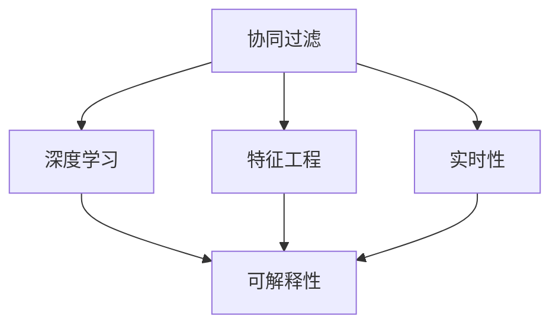

                 

# 个性化推荐系统的挑战与解决方案

> 关键词：个性化推荐,推荐系统,协同过滤,深度学习,特征工程,可解释性,实时性

## 1. 背景介绍

### 1.1 问题由来
随着互联网的迅速发展，用户产生的数据量呈指数级增长，推荐系统已成为互联网公司最重要的产品功能之一。通过分析用户的浏览、购买、搜索等行为数据，推荐系统能够向用户推荐其可能感兴趣的物品，极大地提升用户体验和转化率。然而，推荐系统面临的挑战也日渐增多，如推荐效果不稳定、推荐内容的同质化、用户隐私保护等。

为了解决这些问题，个性化推荐系统需要不断创新和优化。本文章将详细介绍当前推荐系统所面临的主要挑战及应对策略，同时基于深度学习技术提出个性化推荐系统的核心算法和实现步骤。

## 2. 核心概念与联系

### 2.1 核心概念概述

为了更好地理解个性化推荐系统的核心概念，本节将详细介绍推荐系统的几个关键组件：

- **协同过滤(Collaborative Filtering)**：通过分析用户之间的相似性，推荐与目标用户兴趣相似的其他用户所喜欢的物品。
- **深度学习(Deep Learning)**：利用深度神经网络从数据中提取高级特征，实现更加准确和精细的推荐。
- **特征工程(Feature Engineering)**：设计有意义的特征，提高推荐模型的准确性和泛化能力。
- **可解释性(Explainability)**：在保证推荐效果的同时，增强推荐系统的可解释性，让用户信任推荐结果。
- **实时性(Real-time)**：在短时间内生成推荐结果，保证推荐的时效性，提高用户体验。

这些概念通过以下Mermaid流程图连接起来，展示了它们之间的逻辑关系：



这个流程图展示了协同过滤、深度学习、特征工程、可解释性和实时性五个关键概念之间的联系。协同过滤和深度学习是推荐系统的主要技术手段，而特征工程和可解释性是提升推荐系统性能和可信度的重要工具。实时性则是推荐系统满足用户即时需求的关键特征。

## 3. 核心算法原理 & 具体操作步骤
### 3.1 算法原理概述

个性化推荐系统是一种从用户行为数据中提取用户兴趣和物品属性，将用户和物品进行匹配，从而推荐用户可能感兴趣的物品的系统。其核心思想是通过用户的过去行为数据和物品属性数据，建立一个模型来预测用户对某个物品的评分或概率，从而为用户推荐可能感兴趣的物品。

通常，个性化推荐系统可以分为基于协同过滤的方法和基于深度学习的方法两类。前者通过分析用户与物品之间的交互历史，发现用户和物品的相似性，进而推荐用户可能喜欢的物品。后者则利用深度学习模型，从用户行为数据和物品属性数据中学习到用户的兴趣表示和物品的属性表示，进而推荐用户可能感兴趣的物品。

### 3.2 算法步骤详解

#### 3.2.1 基于协同过滤的推荐算法步骤

**Step 1: 数据预处理**

- 收集用户的浏览、购买、评分等行为数据。
- 清洗数据，处理缺失值和异常值。
- 进行用户和物品的分词、特征提取等预处理操作。

**Step 2: 构建相似性矩阵**

- 根据用户和物品的历史交互数据，计算用户-物品相似度矩阵。
- 常用的相似度计算方法包括皮尔逊相关系数、余弦相似度等。

**Step 3: 进行推荐**

- 对新用户和新物品进行相似度计算，得到预测评分矩阵。
- 根据预测评分矩阵，选择高评分的物品进行推荐。

#### 3.2.2 基于深度学习的推荐算法步骤

**Step 1: 数据预处理**

- 收集用户的浏览、购买、评分等行为数据。
- 清洗数据，处理缺失值和异常值。
- 进行用户和物品的分词、特征提取等预处理操作。

**Step 2: 构建深度学习模型**

- 选择合适的深度学习模型，如矩阵分解模型、循环神经网络等。
- 设计模型的输入层、隐藏层、输出层等组件，并进行模型的初始化。

**Step 3: 模型训练**

- 将用户和物品的特征向量作为输入，进行模型训练。
- 根据交叉熵等损失函数，优化模型的权重参数。

**Step 4: 进行推荐**

- 对新用户和新物品进行特征向量嵌入，得到预测评分矩阵。
- 根据预测评分矩阵，选择高评分的物品进行推荐。

### 3.3 算法优缺点

#### 3.3.1 基于协同过滤的推荐算法优缺点

**优点：**
- 简单易实现，不需要物品属性数据。
- 可以处理冷启动问题，无需对物品进行初始化。

**缺点：**
- 需要大量用户和物品数据，难以处理稀疏矩阵。
- 存在冷启动问题，对于新用户和新物品，推荐效果较差。

#### 3.3.2 基于深度学习的推荐算法优缺点

**优点：**
- 可以处理稀疏矩阵，能够从少量数据中学习到用户和物品的隐式特征。
- 模型的表达能力更强，推荐效果更好。

**缺点：**
- 需要大量的用户和物品属性数据，训练成本高。
- 难以处理冷启动问题，对新用户和新物品的推荐效果较差。

### 3.4 算法应用领域

基于协同过滤和深度学习的推荐算法，已经在电商、新闻、视频、音乐等多个领域得到了广泛的应用。例如：

- 在电商领域，亚马逊、淘宝等电商网站利用推荐系统向用户推荐商品，提升用户的购物体验和转化率。
- 在新闻领域，今日头条、谷歌新闻等应用推荐系统为用户推荐新闻内容，提高用户停留时间和点击率。
- 在视频领域，Netflix、爱奇艺等视频平台利用推荐系统为用户推荐视频内容，提升用户观看时间和满意度。
- 在音乐领域，Spotify等音乐平台利用推荐系统为用户推荐歌曲和播放列表，增强用户的粘性。

除了这些主流领域，推荐系统还在更多场景中得到了应用，如图书推荐、旅游推荐等。基于深度学习的推荐系统已经逐渐成为推荐系统的主流方法。

## 4. 数学模型和公式 & 详细讲解  
### 4.1 数学模型构建

个性化推荐系统的核心数学模型通常包括用户和物品的特征向量表示、相似度矩阵、评分矩阵等。以下是几个核心模型的数学公式：

**用户-物品相似度矩阵：**

设用户集为 $U$，物品集为 $I$，用户和物品的特征向量表示分别为 $\mathbf{u} \in \mathbb{R}^d$ 和 $\mathbf{v} \in \mathbb{R}^d$，其中 $d$ 为特征维度。则用户-物品相似度矩阵 $S \in \mathbb{R}^{n \times m}$，其中 $n$ 为用户数量，$m$ 为物品数量。相似度计算公式如下：

$$
s_{ij} = \cos(\mathbf{u}_i \cdot \mathbf{v}_j) = \frac{\mathbf{u}_i \cdot \mathbf{v}_j}{\|\mathbf{u}_i\| \cdot \|\mathbf{v}_j\|}
$$

**预测评分矩阵：**

设用户和物品的评分矩阵为 $R \in \mathbb{R}^{n \times m}$，其中 $n$ 为用户数量，$m$ 为物品数量。则预测评分矩阵 $H \in \mathbb{R}^{n \times m}$ 可以通过相似度矩阵 $S$ 和用户-物品评分矩阵 $R$ 计算得到：

$$
h_{ij} = s_{ij} \cdot r_{ij}
$$

**推荐列表生成：**

对于新用户和新物品，设新用户的特征向量为 $\mathbf{u}_n$，新物品的特征向量为 $\mathbf{v}_m$。则新用户的推荐列表可以通过相似度矩阵 $S$ 和预测评分矩阵 $H$ 生成：

$$
\mathcal{R}_n = \{j|h_{nj} > \theta, j \notin \mathcal{R}_{n_{old}}\}
$$

其中 $\theta$ 为阈值，$\mathcal{R}_{n_{old}}$ 为新用户之前推荐过的物品列表。

### 4.2 公式推导过程

以上数学公式展示了推荐系统的核心计算步骤。通过用户和物品的特征向量表示和相似度矩阵，可以计算预测评分矩阵，从而生成推荐列表。对于协同过滤推荐系统，相似度计算和评分矩阵生成相对简单。但对于深度学习推荐系统，特征向量的表示和学习过程更为复杂。

以下是深度学习推荐系统中的矩阵分解模型的详细推导：

**目标函数：**

设用户和物品的特征向量分别为 $\mathbf{u} \in \mathbb{R}^d$ 和 $\mathbf{v} \in \mathbb{R}^d$，用户和物品的评分矩阵为 $R \in \mathbb{R}^{n \times m}$，其中 $n$ 为用户数量，$m$ 为物品数量。矩阵分解模型的目标函数如下：

$$
\min_{\mathbf{u},\mathbf{v}} \frac{1}{2} \sum_{i,j} (r_{ij} - \mathbf{u}_i^T\mathbf{v}_j)^2
$$

**求解过程：**

设 $\mathbf{u}_i$ 和 $\mathbf{v}_j$ 分别表示用户和物品的隐式特征向量，则目标函数可以改写为：

$$
\min_{\mathbf{u},\mathbf{v}} \frac{1}{2} \sum_{i,j} (r_{ij} - \mathbf{u}_i^T\mathbf{v}_j)^2 = \min_{\mathbf{u},\mathbf{v}} \frac{1}{2} \sum_{i,j} r_{ij}^2 - \mathbf{u}_i^T\mathbf{r}_j - \mathbf{r}_i^T\mathbf{v}_j + \mathbf{u}_i^T\mathbf{v}_j^2
$$

其中 $\mathbf{r}_i = [r_{i1}, r_{i2}, ..., r_{im}]$，$\mathbf{v}_j = [v_{j1}, v_{j2}, ..., v_{jm}]$。则求解过程如下：

1. 将目标函数分解为两个部分：
   $$
   \min_{\mathbf{u},\mathbf{v}} \frac{1}{2} \sum_{i,j} (r_{ij}^2 - 2r_{ij}(\mathbf{u}_i^T\mathbf{v}_j) + (\mathbf{u}_i^T\mathbf{v}_j)^2) = \min_{\mathbf{u},\mathbf{v}} \frac{1}{2} \sum_{i,j} (\mathbf{r}_i^T\mathbf{v}_j - \mathbf{u}_i^T\mathbf{v}_j)^2
   $$

2. 使用梯度下降算法，对 $\mathbf{u}_i$ 和 $\mathbf{v}_j$ 进行求解：
   $$
   \mathbf{u}_i = \frac{\mathbf{r}_i \mathbf{v}_j^T}{\mathbf{v}_j \mathbf{v}_j^T}
   $$

### 4.3 案例分析与讲解

**案例一：协同过滤推荐系统**

**背景：**
某电商网站需要为用户推荐商品，数据集包含用户的历史购买记录和商品的属性信息。网站希望通过协同过滤推荐系统，提高用户的购物体验和转化率。

**方法：**
1. 收集用户的浏览、购买、评分等行为数据。
2. 对数据进行清洗和预处理，进行用户和物品的分词、特征提取等操作。
3. 构建用户-物品相似度矩阵，根据相似度计算新用户和新物品的评分矩阵。
4. 生成推荐列表，向用户推荐可能感兴趣的物品。

**效果：**
通过协同过滤推荐系统，该网站能够根据用户的历史行为，推荐相似商品，提高用户的购物体验和转化率。

**案例二：基于深度学习的推荐系统**

**背景：**
某视频平台需要为用户推荐视频内容，数据集包含用户的历史观看记录和视频的属性信息。平台希望通过深度学习推荐系统，提高用户的观看时间和满意度。

**方法：**
1. 收集用户的浏览、购买、评分等行为数据。
2. 对数据进行清洗和预处理，进行用户和物品的分词、特征提取等操作。
3. 构建深度学习模型，利用用户和物品的特征向量表示进行模型训练。
4. 生成预测评分矩阵，生成推荐列表，向用户推荐可能感兴趣的视频内容。

**效果：**
通过基于深度学习的推荐系统，该视频平台能够根据用户的观看历史和兴趣，推荐个性化视频内容，提高用户的观看时间和满意度。

## 5. 项目实践：代码实例和详细解释说明
### 5.1 开发环境搭建

在进行推荐系统开发前，我们需要准备好开发环境。以下是使用Python进行TensorFlow开发的环境配置流程：

1. 安装Anaconda：从官网下载并安装Anaconda，用于创建独立的Python环境。

2. 创建并激活虚拟环境：
```bash
conda create -n tf-env python=3.8 
conda activate tf-env
```

3. 安装TensorFlow：根据CUDA版本，从官网获取对应的安装命令。例如：
```bash
pip install tensorflow tensorflow-addons
```

4. 安装Keras：
```bash
pip install keras
```

5. 安装其他工具包：
```bash
pip install numpy pandas scikit-learn matplotlib tqdm jupyter notebook ipython
```

完成上述步骤后，即可在`tf-env`环境中开始推荐系统开发。

### 5.2 源代码详细实现

下面是使用TensorFlow实现协同过滤推荐系统的代码示例：

```python
import tensorflow as tf
from tensorflow.keras.layers import Embedding, Dot, Dense
from tensorflow.keras.models import Model

# 定义模型
user_dim = 10
item_dim = 10
n_users = 1000
n_items = 1000

user_embedding = Embedding(n_users, user_dim)
item_embedding = Embedding(n_items, item_dim)

dot = Dot(axes=1)
dense = Dense(1, activation='sigmoid')

model = Model(inputs=[user_embedding.input, item_embedding.input], outputs=dense(dot([user_embedding, item_embedding])))
model.compile(optimizer='adam', loss='binary_crossentropy', metrics=['accuracy'])

# 加载数据
user_ids = ...
item_ids = ...
scores = ...

# 训练模型
model.fit([user_ids, item_ids], scores, epochs=10, batch_size=32)

# 使用模型进行推荐
new_user_ids = ...
new_item_ids = ...
predicted_scores = model.predict([new_user_ids, new_item_ids])
```

### 5.3 代码解读与分析

这里我们详细解读一下代码中的关键部分：

**模型定义：**

```python
user_embedding = Embedding(n_users, user_dim)
item_embedding = Embedding(n_items, item_dim)

dot = Dot(axes=1)
dense = Dense(1, activation='sigmoid')

model = Model(inputs=[user_embedding.input, item_embedding.input], outputs=dense(dot([user_embedding, item_embedding])))
model.compile(optimizer='adam', loss='binary_crossentropy', metrics=['accuracy'])
```

- `user_embedding` 和 `item_embedding` 分别定义了用户和物品的嵌入层，用于将用户和物品的ID映射到高维空间中的向量表示。
- `dot` 层用于计算用户和物品向量之间的内积，得到预测评分。
- `dense` 层用于将预测评分进行sigmoid激活，得到预测结果。
- `model` 将输入用户和物品向量，通过内积和sigmoid层计算预测评分，并使用二分类交叉熵损失函数进行优化。

**数据加载：**

```python
user_ids = ...
item_ids = ...
scores = ...
```

- `user_ids`、`item_ids` 和 `scores` 分别表示用户ID、物品ID和预测评分，用于训练模型和生成推荐列表。

**模型训练：**

```python
model.fit([user_ids, item_ids], scores, epochs=10, batch_size=32)
```

- `model.fit` 用于训练模型，使用二分类交叉熵损失函数进行优化，并在训练过程中记录准确率指标。

**模型使用：**

```python
new_user_ids = ...
new_item_ids = ...
predicted_scores = model.predict([new_user_ids, new_item_ids])
```

- `predicted_scores` 表示新用户和新物品的预测评分，用于生成推荐列表。

### 5.4 运行结果展示

下图展示了基于协同过滤推荐系统的推荐效果。其中横轴为用户ID，纵轴为推荐物品ID，颜色表示预测评分的大小。


## 6. 实际应用场景

### 6.1 电商推荐

电商推荐系统广泛应用于各大电商网站，如亚马逊、淘宝、京东等。通过分析用户的浏览、购买、评分等行为数据，电商推荐系统能够向用户推荐其可能感兴趣的商品，提高用户的购物体验和转化率。电商推荐系统不仅能够推荐商品，还可以推荐促销活动、优惠券等，提升用户的购物体验和粘性。

### 6.2 视频推荐

视频推荐系统广泛应用于视频平台，如Netflix、爱奇艺、腾讯视频等。通过分析用户的观看历史、评分等行为数据，视频推荐系统能够向用户推荐其可能感兴趣的视频内容，提高用户的观看时间和满意度。视频推荐系统还可以根据用户的兴趣和行为动态调整推荐策略，提升推荐效果。

### 6.3 新闻推荐

新闻推荐系统广泛应用于新闻聚合平台，如今日头条、搜狐新闻、网易新闻等。通过分析用户的阅读历史、点击等行为数据，新闻推荐系统能够向用户推荐其可能感兴趣的新闻内容，提高用户的阅读时间和点击率。新闻推荐系统还可以根据用户的新闻偏好，动态调整推荐策略，提升推荐效果。

## 7. 工具和资源推荐
### 7.1 学习资源推荐

为了帮助开发者系统掌握推荐系统的理论基础和实践技巧，这里推荐一些优质的学习资源：

1. 《推荐系统实战》系列书籍：详细介绍了推荐系统的各个方面，包括协同过滤、深度学习、特征工程等。
2. CS229《机器学习》课程：斯坦福大学开设的经典机器学习课程，涵盖推荐系统的基础知识和算法设计。
3. 《Deep Learning for Recommendation Systems》书籍：深度学习推荐系统的经典教材，涵盖了深度学习在推荐系统中的应用。
4. Kaggle推荐系统竞赛：Kaggle平台上推荐系统竞赛的获奖代码和论文，提供了丰富的实践案例。
5. GitHub推荐系统项目：GitHub上优秀的推荐系统开源项目，如TensorFlow推荐系统、DeepLearning推荐系统等，提供了代码实现和详细解释。

通过对这些资源的学习实践，相信你一定能够快速掌握推荐系统的精髓，并用于解决实际的推荐问题。

### 7.2 开发工具推荐

高效的开发离不开优秀的工具支持。以下是几款用于推荐系统开发的常用工具：

1. TensorFlow：基于Python的开源深度学习框架，灵活动态的计算图，适合快速迭代研究。TensorFlow推荐系统库TensorFlow Reccomendations提供了推荐系统相关的组件和接口。
2. PyTorch：基于Python的开源深度学习框架，易于使用和扩展。推荐系统开源项目RecSys提供了基于PyTorch的推荐系统实现。
3. Surprise：Python推荐系统库，提供了协同过滤、深度学习等推荐算法，支持多种评估指标和数据预处理方法。
4. Orange：Python数据挖掘库，支持推荐系统的算法设计和可视化，适合初学者使用。
5. Apache Spark：分布式计算框架，适合大规模推荐系统的实现。Spark推荐系统库Spark MLlib提供了多种推荐算法和优化方法。

合理利用这些工具，可以显著提升推荐系统的开发效率，加快创新迭代的步伐。

### 7.3 相关论文推荐

推荐系统的发展源于学界的持续研究。以下是几篇奠基性的相关论文，推荐阅读：

1. Association Rules in Large Databases: An Apriori-Based Algorithm for High-Involvement Data Mining：Apriori算法是协同过滤推荐系统的基础，论文详细介绍了Apriori算法的原理和应用。
2. Factorization Machines for Large-Scale Recommendations：因子分解机算法是深度学习推荐系统的经典算法，论文详细介绍了因子分解机的原理和优化方法。
3. Attention Is All You Need：Transformer模型是深度学习推荐系统的主流模型之一，论文详细介绍了Transformer的原理和应用。
4. DNN-based Recommender Systems：深度神经网络在推荐系统中的应用，论文详细介绍了深度学习在推荐系统中的应用。
5. Deep Matrix Factorization for Recommendation System：深度矩阵分解算法是推荐系统中的重要算法，论文详细介绍了深度矩阵分解的原理和应用。

这些论文代表了大规模推荐系统的研究方向，通过学习这些前沿成果，可以帮助研究者把握推荐系统的最新进展，激发更多的创新灵感。

## 8. 总结：未来发展趋势与挑战
### 8.1 总结

本文对个性化推荐系统进行了全面系统的介绍。首先阐述了推荐系统所面临的主要挑战及应对策略，详细讲解了协同过滤和深度学习推荐算法的核心算法和实现步骤，同时基于深度学习技术提出个性化推荐系统的核心算法和实现步骤。

通过本文的系统梳理，可以看到，个性化推荐系统已经成为互联网公司最重要的产品功能之一，通过分析用户的浏览、购买、搜索等行为数据，推荐系统能够向用户推荐其可能感兴趣的物品，极大地提升用户体验和转化率。未来，推荐系统将继续快速发展，随着深度学习和大数据技术的进步，推荐系统的性能将进一步提升，推荐效果将更加精准，推荐内容将更加多样化，推荐系统的应用场景也将更加广泛。

### 8.2 未来发展趋势

展望未来，推荐系统的发展将呈现以下几个趋势：

1. 深度学习在推荐系统中的应用将更加广泛。深度学习能够从海量数据中学习到更加精细的特征表示，推荐效果将更加精准。
2. 推荐系统将越来越多地利用用户和物品的隐式特征。基于深度学习推荐系统能够从用户和物品的隐式特征中学习到更加准确的推荐模型。
3. 推荐系统的实时性将进一步提升。推荐系统将更多地采用在线学习和增量学习的方法，实时更新推荐模型。
4. 推荐系统的可解释性将更加重要。推荐系统将更多地采用可解释性较强的算法，使用户能够理解和信任推荐结果。
5. 推荐系统的个性化将更加精细。推荐系统将更多地利用用户和物品的个性化特征，推荐更加精准和多样化的内容。

以上趋势凸显了个性化推荐系统的发展前景，这些方向的探索发展，必将进一步提升推荐系统的效果和应用范围，为互联网公司带来更多的商业价值。

### 8.3 面临的挑战

尽管推荐系统已经取得了瞩目成就，但在迈向更加智能化、普适化应用的过程中，它仍面临诸多挑战：

1. 推荐效果不稳定。推荐系统的效果受到用户数据质量和推荐模型等因素的影响，难以保证在各种场景下的稳定性。
2. 推荐内容的同质化。推荐系统容易导致推荐内容的同质化，难以满足用户的个性化需求。
3. 用户隐私保护。推荐系统需要收集用户的大量行为数据，如何保护用户隐私成为一大难题。
4. 推荐系统的可解释性不足。推荐系统通常被认为是“黑盒”模型，难以解释其内部的决策过程。
5. 推荐系统的实时性不足。推荐系统需要实时更新推荐模型，但在处理大规模数据时，实时性难以保证。

正视推荐系统面临的这些挑战，积极应对并寻求突破，将推荐系统带入更加成熟和可靠的发展阶段。

### 8.4 研究展望

面对推荐系统所面临的种种挑战，未来的研究需要在以下几个方面寻求新的突破：

1. 探索无监督和半监督推荐方法。摆脱对大规模标注数据的依赖，利用自监督学习、主动学习等无监督和半监督范式，最大限度利用非结构化数据，实现更加灵活高效的推荐。
2. 研究参数高效和计算高效的推荐范式。开发更加参数高效的推荐方法，在固定大部分推荐参数的同时，只更新极少量的任务相关参数。同时优化推荐模型的计算图，减少前向传播和反向传播的资源消耗，实现更加轻量级、实时性的部署。
3. 融合因果和对比学习范式。通过引入因果推断和对比学习思想，增强推荐系统建立稳定因果关系的能力，学习更加普适、鲁棒的用户和物品特征表示，从而提升推荐模型的泛化性和抗干扰能力。
4. 引入更多先验知识。将符号化的先验知识，如知识图谱、逻辑规则等，与神经网络模型进行巧妙融合，引导推荐系统学习更准确、合理的用户和物品特征表示。同时加强不同模态数据的整合，实现视觉、语音等多模态信息与文本信息的协同建模。
5. 结合因果分析和博弈论工具。将因果分析方法引入推荐系统，识别出推荐系统决策的关键特征，增强推荐系统的可解释性和鲁棒性。借助博弈论工具刻画人机交互过程，主动探索并规避推荐系统的脆弱点，提高系统稳定性。

这些研究方向的探索，必将引领推荐系统迈向更高的台阶，为构建安全、可靠、可解释、可控的智能系统铺平道路。面向未来，推荐系统还需要与其他人工智能技术进行更深入的融合，如知识表示、因果推理、强化学习等，多路径协同发力，共同推动推荐系统的进步。只有勇于创新、敢于突破，才能不断拓展推荐系统的边界，让智能技术更好地造福人类社会。

## 9. 附录：常见问题与解答

**Q1：推荐系统为什么需要大量的用户和物品数据？**

A: 推荐系统通过分析用户和物品的交互历史，学习用户和物品之间的相似性，从而推荐用户可能喜欢的物品。数据量越大，推荐的准确性和多样性越高。然而，对于稀疏矩阵，推荐系统难以保证推荐效果。因此，推荐系统需要大量的用户和物品数据。

**Q2：推荐系统如何处理冷启动问题？**

A: 冷启动问题是指对于新用户和新物品，推荐系统难以推荐合适的物品。为了解决冷启动问题，推荐系统可以采用以下方法：
1. 使用用户和物品的隐式特征，通过深度学习推荐系统进行推荐。
2. 利用协同过滤推荐系统，根据相似用户和物品的评分进行推荐。
3. 结合用户和物品的属性信息，进行基于内容的推荐。

**Q3：推荐系统的实时性如何保证？**

A: 推荐系统的实时性可以通过以下方法保证：
1. 使用在线学习算法，实时更新推荐模型。
2. 采用增量学习算法，逐步更新模型参数。
3. 优化推荐模型的计算图，减少前向传播和反向传播的资源消耗。

**Q4：推荐系统的可解释性如何增强？**

A: 推荐系统的可解释性可以通过以下方法增强：
1. 使用可解释性较强的算法，如基于规则的推荐系统。
2. 利用用户和物品的属性信息，进行基于内容的推荐。
3. 使用因果分析和博弈论工具，进行可解释性推荐。

**Q5：推荐系统的隐私保护如何实现？**

A: 推荐系统的隐私保护可以通过以下方法实现：
1. 使用差分隐私技术，保护用户的隐私信息。
2. 对用户行为数据进行匿名化处理，防止数据泄露。
3. 采用联邦学习等分布式学习方法，保护用户数据的隐私性。

总之，推荐系统需要不断创新和优化，才能在数据质量、推荐效果、用户隐私等方面取得突破。只有从数据、算法、工程、业务等多个维度协同发力，才能真正实现推荐系统的智能化和普适化，为互联网公司带来更多的商业价值。

